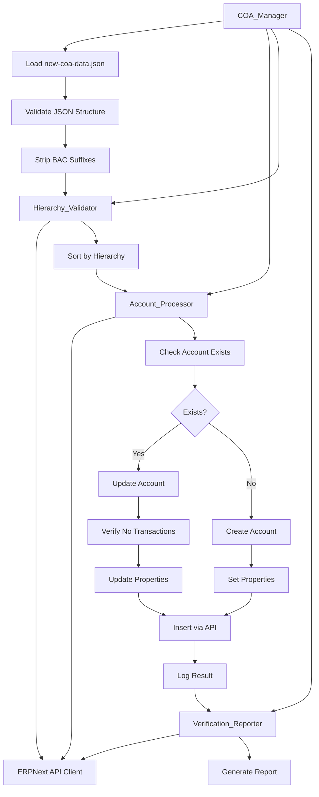

# Design Document: Complete COA Replacement

## Overview

The Complete COA Replacement feature provides a safe, idempotent mechanism to migrate Berkat Abadi Cirebon's Chart of Accounts from the existing ~104 accounts to a properly structured 143-account system. The design prioritizes data integrity by avoiding account deletions and instead focuses on creating new accounts and updating existing ones where safe to do so.

The system implements a sophisticated account management strategy that:
- Uses account_number as the primary identifier for matching and idempotency
- Creates parent accounts before children to maintain hierarchy integrity
- Strips " - BAC" suffixes from account names (ERPNext adds company abbreviation automatically)
- Validates account relationships and prevents circular references
- Preserves existing transactions and system references
- Provides comprehensive verification and reporting

This approach ensures that critical system components (Company defaults, Payment Modes, Tax Templates) remain functional throughout the migration process.

## Architecture

### System Components

The COA replacement system consists of four primary components:

1. **COA_Manager**: Core orchestration component that coordinates the entire replacement process
2. **Account_Processor**: Handles individual account creation and update operations
3. **Hierarchy_Validator**: Ensures parent-child relationships are valid and properly ordered
4. **Verification_Reporter**: Generates detailed reports on COA state and migration results

### Component Interactions



### Data Flow

1. **Input Phase**: Load 143 accounts from `new-coa-data.json`
2. **Validation Phase**: Validate structure, strip suffixes, check for duplicates
3. **Hierarchy Phase**: Sort accounts by parent-child relationships
4. **Processing Phase**: Create/update accounts in correct order
5. **Verification Phase**: Validate final COA state and generate reports

### Technology Stack

- **Runtime**: Node.js with TypeScript (tsx)
- **API Client**: ERPNextClient (lib/erpnext.ts)
- **Data Format**: JSON (new-coa-data.json)
- **Authentication**: Basic Auth with API Key/Secret
- **Error Handling**: Try-catch with detailed logging

## Components and Interfaces

### COA_Manager

The main orchestration component responsible for coordinating the entire replacement process.

```typescript
interface COAManager {
  /**
   * Execute the complete COA replacement process
   * @returns Summary of operations performed
   */
  execute(): Promise<ReplacementSummary>;
  
  /**
   * Load and validate COA data from JSON file
   * @param filePath Path to new-coa-data.json
   * @returns Validated account data
   */
  loadCOAData(filePath: string): Promise<COAAccount[]>;
  
  /**
   * Process all accounts in correct hierarchy order
   * @param accounts Array of accounts to process
   * @returns Processing results
   */
  processAccounts(accounts: COAAccount[]): Promise<ProcessingResult>;
}
```

### Account_Processor

Handles individual account operations with ERPNext API.

```typescript
interface AccountProcessor {
  /**
   * Create or update a single account
   * @param account Account data to process
   * @returns Operation result
   */
  processAccount(account: COAAccount): Promise<AccountOperationResult>;
  
  /**
   * Check if account exists by account_number
   * @param accountNumber Unique account identifier
   * @returns Existing account or null
   */
  findExistingAccount(accountNumber: string): Promise<ERPNextAccount | null>;
  
  /**
   * Create new account in ERPNext
   * @param account Account data
   * @returns Created account
   */
  createAccount(account: COAAccount): Promise<ERPNextAccount>;
  
  /**
   * Update existing account properties
   * @param existingName ERPNext account name
   * @param updates Properties to update
   * @returns Updated account
   */
  updateAccount(existingName: string, updates: Partial<COAAccount>): Promise<ERPNextAccount>;
  
  /**
   * Check if account has GL Entry transactions
   * @param accountName ERPNext account name
   * @returns True if transactions exist
   */
  hasTransactions(accountName: string): Promise<boolean>;
}
```

### Hierarchy_Validator

Validates and manages account hierarchy relationships.

```typescript
interface HierarchyValidator {
  /**
   * Sort accounts by hierarchy (parents before children)
   * @param accounts Unsorted account array
   * @returns Sorted account array
   */
  sortByHierarchy(accounts: COAAccount[]): COAAccount[];
  
  /**
   * Validate parent account exists
   * @param parentAccount Parent account reference
   * @param processedAccounts Already processed accounts
   * @returns True if parent exists or will be created
   */
  validateParentExists(
    parentAccount: string,
    processedAccounts: Set<string>
  ): boolean;
  
  /**
   * Check for circular references in hierarchy
   * @param accounts All accounts
   * @returns Array of circular reference errors
   */
  detectCircularReferences(accounts: COAAccount[]): CircularReferenceError[];
  
  /**
   * Validate account can be converted from ledger to group
   * @param accountName ERPNext account name
   * @returns True if safe to convert
   */
  canConvertToGroup(accountName: string): Promise<boolean>;
}
```

### Verification_Reporter

Generates reports and verification results.

```typescript
interface VerificationReporter {
  /**
   * Generate comprehensive verification report
   * @returns Verification results
   */
  generateReport(): Promise<VerificationReport>;
  
  /**
   * Verify all 143 accounts exist
   * @param expectedAccounts Expected account numbers
   * @returns Missing accounts
   */
  verifyAccountsExist(expectedAccounts: string[]): Promise<string[]>;
  
  /**
   * Validate hierarchy integrity
   * @returns Hierarchy validation errors
   */
  validateHierarchy(): Promise<HierarchyError[]>;
  
  /**
   * Check for orphaned accounts
   * @returns Accounts with invalid parents
   */
  findOrphanedAccounts(): Promise<ERPNextAccount[]>;
}
```

## Data Models

### COAAccount (Input Data Model)

Represents an account from new-coa-data.json:

```typescript
interface COAAccount {
  account_number: string;        // e.g., "1110.001"
  account_name: string;          // e.g., "Kas" (without " - BAC")
  company: string;               // "Berkat Abadi Cirebon"
  parent_account: string;        // e.g., "1110.000 - Kas dan Bank - BAC"
  is_group: 0 | 1;              // 0 = Ledger, 1 = Group
  root_type: RootType;          // Asset, Liability, Equity, Income, Expense
  report_type: ReportType;      // "Balance Sheet" | "Profit and Loss"
  account_type?: AccountType;   // Optional: Bank, Cash, Receivable, etc.
  account_currency: string;     // "IDR", "USD", "SGD"
}

type RootType = "Asset" | "Liability" | "Equity" | "Income" | "Expense";

type ReportType = "Balance Sheet" | "Profit and Loss";

type AccountType = 
  | "Bank"
  | "Cash"
  | "Receivable"
  | "Payable"
  | "Stock"
  | "Tax"
  | "Fixed Asset"
  | "Accumulated Depreciation"
  | "Income Account"
  | "Expense Account"
  | "Cost of Goods Sold"
  | "Depreciation";
```

### ERPNextAccount (API Response Model)

Represents an account as returned by ERPNext API:

```typescript
interface ERPNextAccount {
  name: string;                  // Full name: "1110.001 - Kas - BAC"
  account_name: string;          // Display name
  account_number: string;        // Unique identifier
  company: string;
  parent_account?: string;
  is_group: 0 | 1;
  root_type: RootType;
  report_type: ReportType;
  account_type?: AccountType;
  account_currency: string;
  lft: number;                   // Nested set left value
  rgt: number;                   // Nested set right value
  disabled: 0 | 1;
  [key: string]: any;
}
```

### AccountOperationResult

Result of processing a single account:

```typescript
interface AccountOperationResult {
  account_number: string;
  account_name: string;
  operation: "created" | "updated" | "skipped" | "failed";
  reason?: string;
  error?: string;
}
```

### ReplacementSummary

Summary of entire replacement operation:

```typescript
interface ReplacementSummary {
  total_accounts: number;
  created: number;
  updated: number;
  skipped: number;
  failed: number;
  errors: AccountOperationResult[];
  duration_ms: number;
}
```

### VerificationReport

Comprehensive verification results:

```typescript
interface VerificationReport {
  total_accounts: number;
  accounts_by_root_type: Record<RootType, number>;
  accounts_by_account_type: Record<string, number>;
  accounts_by_currency: Record<string, number>;
  missing_accounts: string[];
  orphaned_accounts: ERPNextAccount[];
  hierarchy_errors: HierarchyError[];
  ledger_with_children: ERPNextAccount[];
  verification_passed: boolean;
}

interface HierarchyError {
  account: string;
  error_type: "missing_parent" | "circular_reference" | "invalid_group";
  details: string;
}
```

### ProcessingResult

Detailed results from account processing:

```typescript
interface ProcessingResult {
  results: AccountOperationResult[];
  summary: ReplacementSummary;
  processing_order: string[];  // Account numbers in order processed
}
```

## Account Processing Algorithm

### Main Processing Flow

```typescript
async function processAccounts(accounts: COAAccount[]): Promise<ProcessingResult> {
  // 1. Validate and prepare data
  const validatedAccounts = validateAccountData(accounts);
  const cleanedAccounts = stripBacSuffixes(validatedAccounts);
  
  // 2. Sort by hierarchy
  const sortedAccounts = sortByHierarchy(cleanedAccounts);
  
  // 3. Process each account
  const results: AccountOperationResult[] = [];
  const processedNumbers = new Set<string>();
  
  for (const account of sortedAccounts) {
    try {
      // Check if parent exists (if specified)
      if (account.parent_account) {
        const parentNumber = extractAccountNumber(account.parent_account);
        if (parentNumber && !processedNumbers.has(parentNumber)) {
          // Parent not yet processed - should not happen with correct sorting
          results.push({
            account_number: account.account_number,
            account_name: account.account_name,
            operation: "skipped",
            reason: "Parent account not yet processed"
          });
          continue;
        }
      }
      
      // Process the account
      const result = await processAccount(account);
      results.push(result);
      
      if (result.operation === "created" || result.operation === "updated") {
        processedNumbers.add(account.account_number);
      }
      
      // Progress logging every 10 accounts
      if (results.length % 10 === 0) {
        console.log(`Progress: ${results.length}/${sortedAccounts.length} processed`);
      }
      
    } catch (error) {
      results.push({
        account_number: account.account_number,
        account_name: account.account_name,
        operation: "failed",
        error: error.message
      });
    }
  }
  
  // 4. Generate summary
  const summary = generateSummary(results);
  
  return {
    results,
    summary,
    processing_order: Array.from(processedNumbers)
  };
}
```

### Hierarchy Sorting Algorithm

```typescript
function sortByHierarchy(accounts: COAAccount[]): COAAccount[] {
  // Build dependency graph
  const accountMap = new Map<string, COAAccount>();
  const dependencyGraph = new Map<string, Set<string>>();
  
  for (const account of accounts) {
    accountMap.set(account.account_number, account);
    dependencyGraph.set(account.account_number, new Set());
  }
  
  // Build dependencies (child depends on parent)
  for (const account of accounts) {
    if (account.parent_account) {
      const parentNumber = extractAccountNumber(account.parent_account);
      if (parentNumber && accountMap.has(parentNumber)) {
        dependencyGraph.get(account.account_number)!.add(parentNumber);
      }
    }
  }
  
  // Topological sort using Kahn's algorithm
  const sorted: COAAccount[] = [];
  const inDegree = new Map<string, number>();
  
  // Calculate in-degrees
  for (const [node, deps] of dependencyGraph) {
    inDegree.set(node, deps.size);
  }
  
  // Find nodes with no dependencies
  const queue: string[] = [];
  for (const [node, degree] of inDegree) {
    if (degree === 0) {
      queue.push(node);
    }
  }
  
  // Process queue
  while (queue.length > 0) {
    // Sort queue by account number for deterministic ordering
    queue.sort();
    const current = queue.shift()!;
    sorted.push(accountMap.get(current)!);
    
    // Reduce in-degree for accounts that depend on this one
    for (const [node, deps] of dependencyGraph) {
      if (deps.has(current)) {
        deps.delete(current);
        const newDegree = deps.size;
        inDegree.set(node, newDegree);
        if (newDegree === 0) {
          queue.push(node);
        }
      }
    }
  }
  
  // Check for circular dependencies
  if (sorted.length !== accounts.length) {
    const missing = accounts.filter(a => 
      !sorted.find(s => s.account_number === a.account_number)
    );
    throw new Error(
      `Circular dependency detected in accounts: ${missing.map(a => a.account_number).join(', ')}`
    );
  }
  
  return sorted;
}
```

### Individual Account Processing

```typescript
async function processAccount(account: COAAccount): Promise<AccountOperationResult> {
  // 1. Check if account exists
  const existing = await findExistingAccount(account.account_number);
  
  if (existing) {
    // Account exists - determine if update is needed
    return await updateExistingAccount(existing, account);
  } else {
    // Account doesn't exist - create it
    return await createNewAccount(account);
  }
}

async function createNewAccount(account: COAAccount): Promise<AccountOperationResult> {
  try {
    // Prepare account data for ERPNext API
    const accountData: any = {
      doctype: "Account",
      account_number: account.account_number,
      account_name: account.account_name,  // WITHOUT " - BAC"
      company: account.company,
      is_group: account.is_group,
      root_type: account.root_type,
      report_type: account.report_type,
      account_currency: account.account_currency
    };
    
    // Add parent if specified
    if (account.parent_account && account.parent_account.trim() !== "") {
      accountData.parent_account = account.parent_account;
    }
    
    // Add account_type if specified
    if (account.account_type) {
      accountData.account_type = account.account_type;
    }
    
    // Create via API
    await erpnextClient.insert("Account", accountData);
    
    return {
      account_number: account.account_number,
      account_name: account.account_name,
      operation: "created"
    };
    
  } catch (error) {
    return {
      account_number: account.account_number,
      account_name: account.account_name,
      operation: "failed",
      error: error.message
    };
  }
}

async function updateExistingAccount(
  existing: ERPNextAccount,
  newData: COAAccount
): Promise<AccountOperationResult> {
  try {
    // Determine what needs updating
    const updates: Partial<ERPNextAccount> = {};
    let needsUpdate = false;
    
    // Check root_type
    if (existing.root_type !== newData.root_type) {
      updates.root_type = newData.root_type;
      needsUpdate = true;
    }
    
    // Check report_type
    if (existing.report_type !== newData.report_type) {
      updates.report_type = newData.report_type;
      needsUpdate = true;
    }
    
    // Check account_currency
    if (existing.account_currency !== newData.account_currency) {
      updates.account_currency = newData.account_currency;
      needsUpdate = true;
    }
    
    // Check account_type
    if (newData.account_type && existing.account_type !== newData.account_type) {
      updates.account_type = newData.account_type;
      needsUpdate = true;
    }
    
    // Check parent_account
    if (newData.parent_account && existing.parent_account !== newData.parent_account) {
      updates.parent_account = newData.parent_account;
      needsUpdate = true;
    }
    
    // Check is_group (DANGEROUS - requires transaction check)
    if (existing.is_group !== newData.is_group) {
      const hasTransactions = await checkHasTransactions(existing.name);
      if (hasTransactions) {
        return {
          account_number: newData.account_number,
          account_name: newData.account_name,
          operation: "skipped",
          reason: "Cannot change is_group - account has transactions"
        };
      }
      updates.is_group = newData.is_group;
      needsUpdate = true;
    }
    
    if (!needsUpdate) {
      return {
        account_number: newData.account_number,
        account_name: newData.account_name,
        operation: "skipped",
        reason: "No changes needed"
      };
    }
    
    // Perform update
    await erpnextClient.update("Account", existing.name, updates);
    
    return {
      account_number: newData.account_number,
      account_name: newData.account_name,
      operation: "updated",
      reason: `Updated: ${Object.keys(updates).join(', ')}`
    };
    
  } catch (error) {
    return {
      account_number: newData.account_number,
      account_name: newData.account_name,
      operation: "failed",
      error: error.message
    };
  }
}
```

### Account Name Suffix Handling

```typescript
function stripBacSuffixes(accounts: COAAccount[]): COAAccount[] {
  return accounts.map(account => ({
    ...account,
    account_name: stripBacSuffix(account.account_name),
    // parent_account keeps " - BAC" as it's a reference to existing account
  }));
}

function stripBacSuffix(name: string): string {
  // Remove " - BAC" suffix if present
  return name.replace(/\s*-\s*BAC\s*$/i, '').trim();
}

function extractAccountNumber(parentReference: string): string | null {
  // Extract account number from reference like "1110.000 - Kas dan Bank - BAC"
  const match = parentReference.match(/^([\d.]+)/);
  return match ? match[1] : null;
}
```

## Error Handling

### Error Categories

1. **Validation Errors**: Invalid JSON, missing required fields, invalid data types
2. **Hierarchy Errors**: Missing parents, circular references, invalid group conversions
3. **API Errors**: Network failures, authentication issues, ERPNext validation failures
4. **Transaction Errors**: Attempting to modify accounts with existing GL entries

### Error Handling Strategy

```typescript
class COAReplacementError extends Error {
  constructor(
    message: string,
    public category: ErrorCategory,
    public account?: string,
    public details?: any
  ) {
    super(message);
    this.name = "COAReplacementError";
  }
}

type ErrorCategory = 
  | "validation"
  | "hierarchy"
  | "api"
  | "transaction"
  | "system";

function handleError(error: any, account?: COAAccount): AccountOperationResult {
  console.error(`Error processing account ${account?.account_number}:`, error);
  
  let errorMessage = error.message || "Unknown error";
  let reason = "";
  
  if (error instanceof COAReplacementError) {
    reason = `${error.category}: ${error.message}`;
  } else if (error.message?.includes("already exists")) {
    reason = "Account already exists with different properties";
  } else if (error.message?.includes("parent")) {
    reason = "Parent account issue";
  } else if (error.message?.includes("GL Entry")) {
    reason = "Account has transactions - cannot modify";
  }
  
  return {
    account_number: account?.account_number || "unknown",
    account_name: account?.account_name || "unknown",
    operation: "failed",
    error: errorMessage,
    reason
  };
}
```

### Retry Logic

```typescript
async function withRetry<T>(
  operation: () => Promise<T>,
  maxRetries: number = 3,
  delayMs: number = 1000
): Promise<T> {
  let lastError: any;
  
  for (let attempt = 1; attempt <= maxRetries; attempt++) {
    try {
      return await operation();
    } catch (error) {
      lastError = error;
      
      // Don't retry validation errors
      if (error.message?.includes("validation")) {
        throw error;
      }
      
      if (attempt < maxRetries) {
        console.log(`Attempt ${attempt} failed, retrying in ${delayMs}ms...`);
        await new Promise(resolve => setTimeout(resolve, delayMs));
        delayMs *= 2; // Exponential backoff
      }
    }
  }
  
  throw lastError;
}
```

### Transaction Safety Checks

```typescript
async function checkHasTransactions(accountName: string): Promise<boolean> {
  try {
    const glEntries = await erpnextClient.getList("GL Entry", {
      filters: [["account", "=", accountName]],
      fields: ["name"],
      limit: 1
    });
    
    return glEntries.length > 0;
  } catch (error) {
    console.error(`Error checking transactions for ${accountName}:`, error);
    // Assume has transactions if check fails (safe default)
    return true;
  }
}
```


## Testing Strategy

The Complete COA Replacement feature requires a dual testing approach combining unit tests for specific scenarios and property-based tests for universal correctness guarantees.

### Testing Approach

1. **Unit Tests**: Focus on specific examples, edge cases, and integration points
   - Specific account creation (e.g., Hutang Komisi Sales with account_number 2150)
   - Error handling for invalid JSON structure
   - API error responses and retry logic
   - Specific hierarchy scenarios (3-level deep hierarchies)
   - Edge cases like empty parent_account fields

2. **Property-Based Tests**: Verify universal properties across all inputs
   - Account creation and update operations
   - Hierarchy ordering and validation
   - Name suffix stripping
   - Idempotency guarantees
   - Data integrity preservation

### Property-Based Testing Configuration

- **Library**: fast-check (for TypeScript/JavaScript)
- **Iterations**: Minimum 100 runs per property test
- **Tagging**: Each test references its design document property
- **Tag Format**: `Feature: complete-coa-replacement, Property {number}: {property_text}`

### Test Organization

```
tests/
├── coa-replacement/
│   ├── unit/
│   │   ├── account-processor.test.ts
│   │   ├── hierarchy-validator.test.ts
│   │   ├── name-handling.test.ts
│   │   └── special-accounts.test.ts
│   └── property/
│       ├── account-operations.property.test.ts
│       ├── hierarchy.property.test.ts
│       ├── idempotency.property.test.ts
│       └── data-integrity.property.test.ts
```

### Mock Strategy

- Mock ERPNextClient for unit and property tests
- Use in-memory account store for fast test execution
- Provide test fixtures for common account structures
- Mock GL Entry checks for transaction validation tests


## Correctness Properties

A property is a characteristic or behavior that should hold true across all valid executions of a system—essentially, a formal statement about what the system should do. Properties serve as the bridge between human-readable specifications and machine-verifiable correctness guarantees.

### Property 1: No Account Deletion

For any COA replacement operation, the set of account numbers existing before the operation must be a subset of account numbers existing after the operation.

**Validates: Requirements 1.2, 11.3**

### Property 2: Account Number Uniqueness

For any set of COA accounts, all account_number values must be unique within the dataset.

**Validates: Requirements 8.2**

### Property 3: BAC Suffix Stripping

For any account name sent to the ERPNext API during create or update operations, the account_name field must not contain the " - BAC" suffix pattern.

**Validates: Requirements 2.3, 3.1, 3.2, 3.3, 3.6**

### Property 4: Parent Before Child Ordering

For any account with a parent_account specified, the parent account must appear earlier in the processing order than the child account.

**Validates: Requirements 2.2, 4.1, 4.2, 4.3**

### Property 5: Ledger Account is_group Value

For any account designated as a Ledger_Account, the is_group property must equal 0.

**Validates: Requirements 2.5**

### Property 6: Group Account is_group Value

For any account designated as a Group_Account, the is_group property must equal 1.

**Validates: Requirements 2.6**

### Property 7: Required Properties Set

For any newly created account, the properties account_number, account_name, root_type, is_group, and account_currency must all be set to non-null values.

**Validates: Requirements 2.4**

### Property 8: Account Number as Idempotency Key

For any account lookup or matching operation, the account_number field must be used as the primary identifier, not the account name.

**Validates: Requirements 3.4, 9.5**

### Property 9: Valid Root Type

For any account, the root_type property must be one of: "Asset", "Liability", "Equity", "Income", or "Expense".

**Validates: Requirements 6.1**

### Property 10: Account Type Compatibility

For any account with both root_type and account_type specified, the account_type must be compatible with the root_type according to ERPNext validation rules (e.g., "Bank" and "Cash" are compatible with "Asset", "Receivable" is compatible with "Asset", "Payable" is compatible with "Liability").

**Validates: Requirements 6.3**

### Property 11: Multi-Currency Account Configuration

For any account with account_currency set to a value other than "IDR", the account must have the account_currency property explicitly set in the API call.

**Validates: Requirements 2.7, 6.6, 7.1, 7.2, 7.3, 10.8**

### Property 12: Valid Currency Codes

For any account, the account_currency value must be a valid ISO 4217 currency code (e.g., "IDR", "USD", "SGD").

**Validates: Requirements 7.4**

### Property 13: No Ledger Accounts with Children

For any account with is_group=0 (Ledger_Account), the account must not have any child accounts in the hierarchy.

**Validates: Requirements 4.4, 10.6**

### Property 14: Leaf Accounts are Ledgers

For any account that has no children in the hierarchy, the account must have is_group=0 (be a Ledger_Account).

**Validates: Requirements 10.7**

### Property 15: Transaction Safety for is_group Changes

For any account update that changes the is_group property, the account must not have any existing GL Entry transactions.

**Validates: Requirements 1.4, 4.5, 11.1**

### Property 16: Update Skipping for Unsafe Operations

For any account that cannot be safely updated (e.g., has transactions and needs is_group change), the operation result must be "skipped" with an appropriate reason logged.

**Validates: Requirements 1.5**

### Property 17: ERPNext Name Preservation

For any account update operation, the ERPNext name field (full account name including company suffix) must remain unchanged.

**Validates: Requirements 1.3**

### Property 18: Account Name Length Validation

For any account, the account_name combined with the company abbreviation " - BAC" must not exceed ERPNext's field length limit (140 characters).

**Validates: Requirements 3.5**

### Property 19: Valid JSON Structure

For any COA data input, the JSON structure must be valid and contain all required fields (account_number, account_name, company, is_group, root_type, report_type, account_currency) for each account.

**Validates: Requirements 8.1**

### Property 20: Error Handling Continuity

For any API error encountered during account processing, the system must log the error with account details and continue processing the remaining accounts.

**Validates: Requirements 8.3**

### Property 21: Summary Report Completeness

For any COA replacement operation, the summary report must include counts for: accounts created, accounts updated, accounts skipped, and errors encountered.

**Validates: Requirements 8.4, 10.1, 10.2**

### Property 22: Invalid Parent Handling

For any account with an invalid parent_account reference (parent does not exist and is not in the processing queue), the operation must log an error and skip that account.

**Validates: Requirements 8.5**

### Property 23: Circular Reference Detection

For any set of accounts, if a circular reference exists in the parent-child relationships, the system must detect it and reject the entire hierarchy.

**Validates: Requirements 8.6**

### Property 24: Idempotent Execution

For any COA data set, running the replacement operation multiple times must produce the same final account state (same accounts with same properties).

**Validates: Requirements 9.1**

### Property 25: Existing Account Detection

For any account that already exists in ERPNext (matched by account_number), the system must detect it and perform an update operation instead of attempting to create a duplicate.

**Validates: Requirements 9.2**

### Property 26: Unnecessary Update Skipping

For any existing account where all properties match the new COA data, the system must skip the update operation and mark it as "skipped" with reason "No changes needed".

**Validates: Requirements 9.3**

### Property 27: Partial Completion Resumability

For any COA replacement operation that completes partially (some accounts processed, some not), running the operation again must resume from the unprocessed accounts and reach the same final state.

**Validates: Requirements 9.4**

### Property 28: Complete Account Verification

For any COA replacement operation, the verification report must confirm that all 143 accounts from the new COA data exist in the system after processing.

**Validates: Requirements 10.3**

### Property 29: Extra Account Identification

For any COA replacement operation, the verification report must identify accounts that exist in the system but are not present in the new COA data.

**Validates: Requirements 10.4**

### Property 30: Hierarchy Relationship Validation

For any account in the final COA, if it has a parent_account specified, that parent must exist in the system and the relationship must match the new COA data structure.

**Validates: Requirements 10.5**

### Property 31: Transaction Warning Logging

For any account with existing GL Entry transactions that needs property changes, the system must log a warning message indicating the account has transactions.

**Validates: Requirements 11.2**

### Property 32: Transaction Integrity Preservation

For any COA replacement operation, the total count of GL Entry records referencing accounts must remain unchanged before and after the operation.

**Validates: Requirements 11.4**

### Property 33: Transaction Integrity Reporting

For any transaction integrity issues detected after COA replacement, the verification report must include the affected account names and transaction counts.

**Validates: Requirements 11.5**

### Property 34: Retry Logic for Transient Failures

For any transient API failure (network timeout, temporary server error), the system must retry the operation up to a maximum number of attempts before marking it as failed.

**Validates: Requirements 12.2**

### Property 35: Progress Logging

For any COA replacement operation processing more than 10 accounts, the system must log progress updates at intervals of every 10 accounts processed.

**Validates: Requirements 12.3**

### Property 36: Valid Hierarchy Path to Root

For any account in the final COA, there must exist a valid path from that account up through parent accounts to one of the five root types (Asset, Liability, Equity, Income, Expense).

**Validates: Requirements 4.6**

### Property 37: Bank and Cash Account Types

For any account with account_type set to "Bank" or "Cash", the root_type must be "Asset".

**Validates: Requirements 6.4**

### Property 38: Receivable and Payable Account Types

For any account with account_type set to "Receivable", the root_type must be "Asset", and for any account with account_type set to "Payable", the root_type must be "Liability".

**Validates: Requirements 6.5**


## Verification and Reporting

### Verification Process

The verification system runs after COA replacement completes to ensure data integrity and correctness.

```typescript
async function runVerification(): Promise<VerificationReport> {
  const report: VerificationReport = {
    total_accounts: 0,
    accounts_by_root_type: {},
    accounts_by_account_type: {},
    accounts_by_currency: {},
    missing_accounts: [],
    orphaned_accounts: [],
    hierarchy_errors: [],
    ledger_with_children: [],
    verification_passed: true
  };
  
  // 1. Fetch all accounts for the company
  const allAccounts = await erpnextClient.getList<ERPNextAccount>("Account", {
    filters: [["company", "=", "Berkat Abadi Cirebon"]],
    fields: ["*"],
    limit: 500,
    order_by: "account_number asc"
  });
  
  report.total_accounts = allAccounts.length;
  
  // 2. Group by root_type
  for (const account of allAccounts) {
    report.accounts_by_root_type[account.root_type] = 
      (report.accounts_by_root_type[account.root_type] || 0) + 1;
    
    if (account.account_type) {
      report.accounts_by_account_type[account.account_type] = 
        (report.accounts_by_account_type[account.account_type] || 0) + 1;
    }
    
    report.accounts_by_currency[account.account_currency] = 
      (report.accounts_by_currency[account.account_currency] || 0) + 1;
  }
  
  // 3. Verify all 143 accounts exist
  const expectedAccountNumbers = loadExpectedAccountNumbers();
  for (const expectedNumber of expectedAccountNumbers) {
    const found = allAccounts.find(a => a.account_number === expectedNumber);
    if (!found) {
      report.missing_accounts.push(expectedNumber);
      report.verification_passed = false;
    }
  }
  
  // 4. Find orphaned accounts (invalid parent references)
  for (const account of allAccounts) {
    if (account.parent_account) {
      const parentExists = allAccounts.find(a => a.name === account.parent_account);
      if (!parentExists) {
        report.orphaned_accounts.push(account);
        report.hierarchy_errors.push({
          account: account.name,
          error_type: "missing_parent",
          details: `Parent ${account.parent_account} does not exist`
        });
        report.verification_passed = false;
      }
    }
  }
  
  // 5. Verify no ledger accounts have children
  for (const account of allAccounts) {
    if (account.is_group === 0) {
      const children = allAccounts.filter(a => a.parent_account === account.name);
      if (children.length > 0) {
        report.ledger_with_children.push(account);
        report.hierarchy_errors.push({
          account: account.name,
          error_type: "invalid_group",
          details: `Ledger account has ${children.length} children`
        });
        report.verification_passed = false;
      }
    }
  }
  
  // 6. Verify all leaf accounts are ledgers
  for (const account of allAccounts) {
    const children = allAccounts.filter(a => a.parent_account === account.name);
    if (children.length === 0 && account.is_group === 1) {
      report.hierarchy_errors.push({
        account: account.name,
        error_type: "invalid_group",
        details: "Leaf account is marked as group"
      });
      report.verification_passed = false;
    }
  }
  
  return report;
}
```

### Report Output Format

The verification report is displayed in a structured format:

```
╔════════════════════════════════════════════════════════════╗
║  COA Verification Report                                   ║
║  Company: Berkat Abadi Cirebon                            ║
╚════════════════════════════════════════════════════════════╝

📊 Account Summary:
   Total accounts: 143
   
   By Root Type:
   - Asset: 23
   - Liability: 12
   - Equity: 6
   - Income: 8
   - Expense: 94
   
   By Account Type:
   - Bank: 2
   - Cash: 1
   - Receivable: 2
   - Payable: 2
   - Stock: 1
   - Tax: 4
   - Fixed Asset: 4
   - Accumulated Depreciation: 3
   - Income Account: 1
   - Expense Account: 15
   - Cost of Goods Sold: 1
   - Depreciation: 3
   
   By Currency:
   - IDR: 143

✅ All 143 expected accounts exist

✅ No orphaned accounts found

✅ No hierarchy errors detected

✅ All ledger accounts have no children

✅ All leaf accounts are ledgers

╔════════════════════════════════════════════════════════════╗
║  ✅ VERIFICATION PASSED                                     ║
╚════════════════════════════════════════════════════════════╝
```

### Error Report Format

When errors are detected:

```
❌ VERIFICATION FAILED

Missing Accounts (2):
   - 1140.001 (Sewa Dibayar Dimuka)
   - 5280.000 (Beban Lain-lain)

Orphaned Accounts (1):
   - 1150.001 - Piutang Karyawan - BAC
     Parent: 1150.000 - Piutang Lain - BAC (does not exist)

Hierarchy Errors (1):
   - 4110.000 - Penjualan - BAC
     Error: Ledger account has 1 children
     Details: Account marked as is_group=0 but has child accounts

Transaction Integrity Issues (0):
   None detected
```

## Implementation Considerations

### Performance Optimization

1. **Batch Processing**: Process accounts in batches of 10 to balance API load and progress visibility
2. **Parallel Validation**: Run independent validations (JSON structure, uniqueness, circular references) in parallel
3. **Caching**: Cache parent account lookups to avoid repeated API calls
4. **Early Exit**: Stop processing on critical errors (invalid JSON, circular references)

### Rate Limiting

Implement exponential backoff for API calls:

```typescript
const INITIAL_DELAY_MS = 100;
const MAX_DELAY_MS = 5000;
const BACKOFF_MULTIPLIER = 2;

async function callWithBackoff<T>(
  operation: () => Promise<T>,
  attempt: number = 1
): Promise<T> {
  try {
    return await operation();
  } catch (error) {
    if (attempt >= 3) throw error;
    
    const delay = Math.min(
      INITIAL_DELAY_MS * Math.pow(BACKOFF_MULTIPLIER, attempt - 1),
      MAX_DELAY_MS
    );
    
    await new Promise(resolve => setTimeout(resolve, delay));
    return callWithBackoff(operation, attempt + 1);
  }
}
```

### Transaction Safety

Before modifying any account property that could affect transactions:

1. Check for GL Entry records
2. Check for Journal Entry records
3. Check for Payment Entry records
4. Check for Stock Ledger Entry records (for Stock accounts)

```typescript
async function isAccountSafeToModify(accountName: string): Promise<boolean> {
  const checks = [
    erpnextClient.getCount("GL Entry", { 
      filters: [["account", "=", accountName]] 
    }),
    erpnextClient.getCount("Journal Entry Account", { 
      filters: [["account", "=", accountName]] 
    }),
    erpnextClient.getCount("Payment Entry", { 
      filters: [
        ["paid_from", "=", accountName],
        ["paid_to", "=", accountName]
      ] 
    })
  ];
  
  const results = await Promise.all(checks);
  return results.every(count => count === 0);
}
```

### Logging Strategy

Implement structured logging with different levels:

```typescript
enum LogLevel {
  DEBUG = 0,
  INFO = 1,
  WARN = 2,
  ERROR = 3
}

class Logger {
  constructor(private level: LogLevel = LogLevel.INFO) {}
  
  debug(message: string, data?: any) {
    if (this.level <= LogLevel.DEBUG) {
      console.log(`[DEBUG] ${message}`, data || "");
    }
  }
  
  info(message: string, data?: any) {
    if (this.level <= LogLevel.INFO) {
      console.log(`[INFO] ${message}`, data || "");
    }
  }
  
  warn(message: string, data?: any) {
    if (this.level <= LogLevel.WARN) {
      console.warn(`[WARN] ${message}`, data || "");
    }
  }
  
  error(message: string, error?: any) {
    if (this.level <= LogLevel.ERROR) {
      console.error(`[ERROR] ${message}`, error || "");
    }
  }
}
```

### Rollback Strategy

While the system doesn't delete accounts, provide a way to identify changes:

```typescript
interface ChangeLog {
  timestamp: string;
  operation: "created" | "updated";
  account_number: string;
  account_name: string;
  changes?: {
    field: string;
    old_value: any;
    new_value: any;
  }[];
}

async function generateChangeLog(
  results: AccountOperationResult[]
): Promise<ChangeLog[]> {
  const changeLog: ChangeLog[] = [];
  
  for (const result of results) {
    if (result.operation === "created" || result.operation === "updated") {
      changeLog.push({
        timestamp: new Date().toISOString(),
        operation: result.operation,
        account_number: result.account_number,
        account_name: result.account_name,
        changes: result.operation === "updated" ? 
          parseChangesFromReason(result.reason) : undefined
      });
    }
  }
  
  return changeLog;
}
```

## Deployment and Execution

### Prerequisites

1. ERPNext instance running and accessible
2. API credentials configured in `.env.local`
3. Node.js 18+ and pnpm installed
4. `new-coa-data.json` file present in `scripts/` directory

### Execution Steps

```bash
# 1. Verify environment variables
cat .env.local | grep ERP_

# 2. Validate COA data file
pnpm tsx scripts/validate-coa-data.ts

# 3. Run the replacement script
pnpm tsx scripts/update-coa.ts

# 4. Verify the results
pnpm tsx scripts/verify-coa.ts
```

### Script Naming Convention

- `update-coa.ts`: Main replacement script (safe update strategy)
- `verify-coa.ts`: Verification script
- `validate-coa-data.ts`: Pre-flight validation of JSON data
- `new-coa-data.json`: Source data for 143 accounts

### Safety Measures

1. **Dry Run Mode**: Add `--dry-run` flag to preview changes without applying them
2. **Backup Verification**: Ensure backup exists before running
3. **Progress Checkpoints**: Save progress every 25 accounts
4. **Automatic Rollback**: On critical errors, log all changes for manual review

### Monitoring

During execution, monitor:
- Progress updates (every 10 accounts)
- Error messages (logged immediately)
- API response times (warn if > 2 seconds)
- Memory usage (warn if > 500MB)

## Future Enhancements

1. **Incremental Updates**: Support updating only changed accounts
2. **Diff Preview**: Show what will change before applying
3. **Backup Integration**: Automatic backup before replacement
4. **Webhook Notifications**: Notify on completion or errors
5. **Multi-Company Support**: Extend to handle multiple companies
6. **Account Mapping**: Map old account numbers to new ones for migration
7. **Audit Trail**: Detailed audit log of all changes with timestamps
8. **Validation Rules**: Configurable validation rules for account properties

## References

- ERPNext Account DocType: https://frappeframework.com/docs/user/en/desk/doctype/account
- ERPNext API Documentation: https://frappeframework.com/docs/user/en/api
- Chart of Accounts Best Practices: Internal documentation
- Indonesian Accounting Standards: PSAK guidelines

