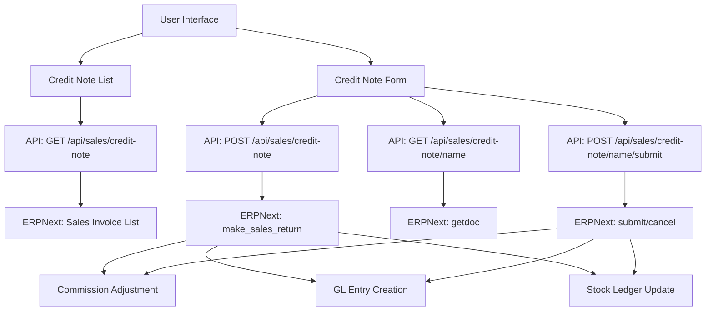

# Design Document - Credit Note Management

## Overview

Credit Note Management adalah fitur untuk mengelola retur penjualan dari Sales Invoice yang sudah dibayar (status: Paid). Fitur ini melengkapi sistem Sales Return yang sudah ada dengan menambahkan kemampuan untuk membuat Credit Note, yang merupakan Sales Invoice dengan `is_return=1`.

### Key Design Decisions

1. **ERPNext Native Return Mechanism**: Menggunakan ERPNext native `make_sales_return` method untuk memastikan konsistensi data dan integrasi yang baik dengan sistem akuntansi
2. **Pattern Consistency**: Mengikuti pola yang sama dengan Sales Return (Delivery Note return) untuk konsistensi kode dan user experience
3. **Commission Integration**: Terintegrasi dengan Commission System untuk menyesuaikan nilai komisi sales ketika Credit Note dibuat
4. **Accounting Period Validation**: Memvalidasi posting date terhadap Accounting Period sebelum save/submit/cancel

### Architecture Pattern

```
Frontend (Next.js)          API Layer                ERPNext Backend
─────────────────          ─────────               ─────────────────
app/credit-note/     →     /api/sales/        →    Sales Invoice
  - page.tsx               credit-note/             (is_return=1)
  - cnList/                  - route.ts
  - cnMain/                  - [name]/
                               - route.ts
                               - submit/
                                 - route.ts
```

## Architecture

### System Components



### Data Flow

1. **Create Credit Note Flow**:
   - User selects paid Sales Invoice
   - Frontend fetches invoice details with items
   - User selects items and quantities to return
   - Frontend sends request to API
   - API calls ERPNext `make_sales_return` to generate template
   - API customizes template with user data
   - API copies commission values (negative)
   - API saves Credit Note to ERPNext
   - ERPNext creates GL entries and updates stock

2. **Submit Credit Note Flow**:
   - User clicks Submit button
   - Frontend sends submit request to API
   - API validates Accounting Period
   - API calls ERPNext submit endpoint
   - ERPNext updates `returned_qty` in original Sales Invoice
   - ERPNext creates GL entries
   - Commission System adjusts commission values

3. **List Credit Notes Flow**:
   - Frontend requests list with filters
   - API queries ERPNext with `is_return=1` filter
   - API transforms data to frontend format
   - Frontend displays list with pagination

## Components and Interfaces

### Frontend Components

#### 1. Credit Note List (`app/credit-note/cnList/component.tsx`)

**Responsibilities**:
- Display paginated list of Credit Notes
- Provide filtering (date range, customer, status, document number)
- Handle mobile responsive layout (infinite scroll on mobile, pagination on desktop)
- Show submit/cancel actions for eligible documents

**Key Features**:
- Dual layout: Mobile cards vs Desktop table
- Infinite scroll for mobile (10 items per page)
- Pagination for desktop (20 items per page)
- Status badges with color coding
- Quick actions: Print, Submit

**State Management**:
```typescript
- creditNotes: CreditNote[]
- loading: boolean
- filters: { from_date, to_date, customer, status, documentNumber }
- currentPage: number
- totalPages: number
```

#### 2. Credit Note Form (`app/credit-note/cnMain/component.tsx`)

**Responsibilities**:
- Create new Credit Note from paid Sales Invoice
- Edit Draft Credit Notes
- Display read-only view for Submitted/Cancelled Credit Notes
- Validate return quantities
- Calculate totals and commission adjustments

**Key Features**:
- Sales Invoice selection dialog (filtered by status=Paid)
- Item selection with checkboxes (partial return support)
- Quantity input with validation
- Return reason dropdown (Damaged, Quality Issue, Wrong Item, Customer Request, Expired, Other)
- Conditional notes field for "Other" reason
- Real-time total calculation
- Commission adjustment display

**State Management**:
```typescript
- formData: CreditNoteFormData
- selectedInvoice: SalesInvoice | null
- editingCreditNote: CreditNote | null
- currentStatus: string
- loading: boolean
- error: string
```

#### 3. Sales Invoice Dialog Component

**Responsibilities**:
- Display list of paid Sales Invoices
- Allow user to search and filter
- Return selected invoice to parent component

**Props**:
```typescript
interface SalesInvoiceDialogProps {
  isOpen: boolean;
  onClose: () => void;
  onSelect: (invoice: SalesInvoice) => void;
  selectedCompany: string;
}
```

### API Routes

#### 1. List Credit Notes (`GET /api/sales/credit-note`)

**Query Parameters**:
- `limit_page_length`: number (default: 20)
- `start`: number (default: 0)
- `filters`: JSON string (ERPNext filters)
- `order_by`: string (default: "posting_date desc")
- `from_date`: string (YYYY-MM-DD)
- `to_date`: string (YYYY-MM-DD)
- `search`: string (customer name)
- `documentNumber`: string
- `status`: string (Draft | Submitted | Cancelled)

**Response**:
```typescript
{
  success: boolean;
  data: CreditNote[];
  total_records: number;
}
```

**Implementation Notes**:
- Filter by `is_return=1` and `doctype=Sales Invoice`
- Map `docstatus` to status labels
- Transform `return_against` to `sales_invoice` for frontend

#### 2. Create Credit Note (`POST /api/sales/credit-note`)

**Request Body**:
```typescript
{
  company: string;
  customer: string;
  posting_date: string; // YYYY-MM-DD
  return_against: string; // Sales Invoice name
  items: Array<{
    item_code: string;
    item_name: string;
    qty: number; // positive value, API converts to negative
    rate: number;
    amount: number;
    warehouse: string;
    sales_invoice_item: string; // reference to original item
    return_reason: string;
    return_item_notes?: string;
    custom_komisi_sales: number; // from original invoice
  }>;
  return_notes?: string;
}
```

**Response**:
```typescript
{
  success: boolean;
  data: CreditNote;
  message: string;
}
```

**Implementation Steps**:
1. Validate request body structure
2. Validate Accounting Period for posting_date
3. Call ERPNext `make_sales_return` method with `source_name`
4. Customize template with user data
5. Copy commission values (negative, proportional to qty)
6. Calculate `custom_total_komisi_sales`
7. Save Credit Note to ERPNext
8. Refresh document with `getdoc` to get all fields
9. Return saved Credit Note

#### 3. Get Credit Note Detail (`GET /api/sales/credit-note/[name]`)

**Response**:
```typescript
{
  success: boolean;
  data: CreditNote;
}
```

**Implementation Notes**:
- Use `frappe.desk.form.load.getdoc` for complete data
- Include all child tables (items)
- Transform field names for frontend compatibility

#### 4. Submit Credit Note (`POST /api/sales/credit-note/[name]/submit`)

**Request Body**:
```typescript
{
  name: string;
}
```

**Response**:
```typescript
{
  success: boolean;
  message: string;
}
```

**Implementation Steps**:
1. Validate Accounting Period for posting_date
2. Call ERPNext submit endpoint
3. ERPNext automatically:
   - Updates `returned_qty` in original Sales Invoice
   - Creates GL entries
   - Updates stock ledger
4. Return success response

#### 5. Cancel Credit Note (`POST /api/sales/credit-note/[name]/cancel`)

**Request Body**:
```typescript
{
  name: string;
}
```

**Response**:
```typescript
{
  success: boolean;
  message: string;
}
```

**Implementation Steps**:
1. Validate Accounting Period for posting_date
2. Call ERPNext cancel endpoint
3. ERPNext automatically reverses all entries
4. Return success response

### ERPNext Integration

#### Sales Invoice Return Method

ERPNext provides native method for creating returns:
```python
erpnext.accounts.doctype.sales_invoice.sales_invoice.make_sales_return
```

**Parameters**:
- `source_name`: Name of original Sales Invoice

**Returns**:
- Sales Invoice document with `is_return=1`
- Pre-filled with original invoice data
- Items with negative quantities
- Proper references (`return_against`, `si_detail`)

#### Custom Fields

The system uses custom fields for commission tracking:

**Sales Invoice Item**:
- `custom_komisi_sales`: Decimal field for commission per item

**Sales Invoice**:
- `custom_total_komisi_sales`: Currency field for total commission

**Credit Note Behavior**:
- Copy `custom_komisi_sales` from original items (negative, proportional)
- Calculate `custom_total_komisi_sales` as sum of item commissions

## Data Models

### TypeScript Interfaces

```typescript
// Credit Note (Sales Invoice with is_return=1)
interface CreditNote {
  name: string;
  doctype: 'Sales Invoice';
  is_return: 1;
  return_against: string; // Original Sales Invoice
  customer: string;
  customer_name: string;
  posting_date: string;
  company: string;
  status: 'Draft' | 'Submitted' | 'Cancelled';
  docstatus: 0 | 1 | 2;
  grand_total: number;
  custom_total_komisi_sales: number; // Negative value
  return_notes?: string;
  items: CreditNoteItem[];
  creation: string;
  modified: string;
  owner: string;
  modified_by: string;
}

interface CreditNoteItem {
  name: string;
  item_code: string;
  item_name: string;
  qty: number; // Negative for returns
  rate: number;
  amount: number; // Negative for returns
  uom: string;
  warehouse: string;
  si_detail: string; // Reference to original Sales Invoice Item
  return_reason: 'Damaged' | 'Quality Issue' | 'Wrong Item' | 'Customer Request' | 'Expired' | 'Other';
  return_item_notes?: string;
  custom_komisi_sales: number; // Negative value
  delivered_qty: number; // From original invoice
  returned_qty: number; // Accumulated returns
}

// Form Data (Frontend)
interface CreditNoteFormData {
  customer: string;
  customer_name: string;
  posting_date: string; // DD/MM/YYYY format
  sales_invoice: string;
  custom_notes: string;
  items: CreditNoteFormItem[];
}

interface CreditNoteFormItem {
  item_code: string;
  item_name: string;
  qty: number; // Positive for display
  rate: number;
  amount: number; // Positive for display
  uom: string;
  warehouse: string;
  sales_invoice_item: string;
  delivered_qty: number;
  remaining_qty: number; // delivered_qty - returned_qty
  return_reason: string;
  return_notes: string;
  custom_komisi_sales: number; // From original, will be negative in Credit Note
  selected: boolean; // For partial return
}

// Sales Invoice (for selection)
interface SalesInvoice {
  name: string;
  customer: string;
  customer_name: string;
  posting_date: string;
  status: string;
  grand_total: number;
  custom_total_komisi_sales: number;
  items: SalesInvoiceItem[];
}

interface SalesInvoiceItem {
  name: string;
  item_code: string;
  item_name: string;
  qty: number;
  rate: number;
  amount: number;
  uom: string;
  warehouse: string;
  custom_komisi_sales: number;
  returned_qty: number; // Accumulated returns
}
```

### Database Schema (ERPNext)

Credit Note menggunakan ERPNext native `Sales Invoice` doctype dengan field tambahan:

**Sales Invoice (DocType)**:
- Standard ERPNext fields
- `is_return`: Int (1 for Credit Note)
- `return_against`: Link to Sales Invoice
- `custom_total_komisi_sales`: Currency (custom field)

**Sales Invoice Item (Child Table)**:
- Standard ERPNext fields
- `si_detail`: Link to original Sales Invoice Item
- `return_reason`: Data field
- `return_item_notes`: Text field
- `custom_komisi_sales`: Currency (custom field)
- `returned_qty`: Float (tracked by ERPNext)

## Correctness Properties

*A property is a characteristic or behavior that should hold true across all valid executions of a system-essentially, a formal statement about what the system should do. Properties serve as the bridge between human-readable specifications and machine-verifiable correctness guarantees.*

### Property 1: Sales Invoice Selection Returns Paid Invoices Only

*For any* Sales Invoice selection query, all returned invoices should have status "Paid" and should not already be fully returned.

**Validates: Requirements 1.3, 1.4**

### Property 2: Return Quantity Validation

*For any* Credit Note item, the return quantity must be greater than 0 and must not exceed the remaining returnable quantity (original qty - returned_qty).

**Validates: Requirements 1.6, 5.1, 5.2, 5.3**

### Property 3: Return Reason Required

*For any* Credit Note item that is selected for return, a return reason must be specified from the allowed values.

**Validates: Requirements 1.7**

### Property 4: Conditional Notes Requirement

*For any* Credit Note item with return_reason = "Other", the return_item_notes field must be non-empty.

**Validates: Requirements 1.8**

### Property 5: Total Calculation Accuracy

*For any* Credit Note, the grand_total should equal the sum of all selected item amounts (qty × rate).

**Validates: Requirements 1.9**

### Property 6: Commission Copy Proportionality

*For any* Credit Note item, the custom_komisi_sales value should be negative and proportional to the return quantity: `credit_note_commission = -(original_commission × return_qty / original_qty)`.

**Validates: Requirements 1.12, 7.12**

### Property 7: Total Commission Calculation

*For any* Credit Note, the custom_total_komisi_sales should equal the sum of all item custom_komisi_sales values (negative).

**Validates: Requirements 1.13, 7.2**

### Property 8: Credit Note Structure Validation

*For any* saved Credit Note, it must have is_return=1 and return_against must reference a valid Sales Invoice.

**Validates: Requirements 1.14**

### Property 9: Accounting Period Validation

*For any* Credit Note save, submit, or cancel operation, the posting_date must fall within an open Accounting Period, otherwise the operation should fail with a descriptive error.

**Validates: Requirements 1.15, 3.7, 9.8**

### Property 10: Filter Application Correctness

*For any* list query with filters (date range, customer, status, document number), all returned Credit Notes should match all specified filter criteria.

**Validates: Requirements 2.2, 2.3, 2.4, 2.5, 2.6**

### Property 11: API Data Format Consistency

*For any* Credit Note returned by the API, the data structure should match the frontend expectations with proper field name transformations (return_against → sales_invoice, docstatus → status).

**Validates: Requirements 2.8**

### Property 12: Returned Quantity Update

*For any* submitted Credit Note, the returned_qty in the original Sales Invoice items should be incremented by the Credit Note return quantities.

**Validates: Requirements 3.3**

### Property 13: GL Entry Creation

*For any* submitted Credit Note, GL entries should be created to record the accounting transaction (debit customer account, credit revenue account).

**Validates: Requirements 3.4**

### Property 14: Backend Validation Enforcement

*For any* Credit Note creation request, if the backend validation fails (invalid quantity, missing fields, closed accounting period), the API should return HTTP 400 with a specific error message.

**Validates: Requirements 5.6, 5.7, 11.6, 11.7, 11.8**

### Property 15: Partial Return Accumulation

*For any* Sales Invoice with multiple Credit Notes, the sum of all return quantities for each item should not exceed the original quantity.

**Validates: Requirements 8.7**

### Property 16: Commission Adjustment on Submit

*For any* submitted Credit Note, the custom_total_komisi_sales in the original Sales Invoice should be reduced by the Credit Note's commission amount.

**Validates: Requirements 7.3, 7.4**

### Property 17: Minimal Item Selection

*For any* Credit Note creation request, at least one item must be selected with qty > 0, otherwise the request should fail with validation error.

**Validates: Requirements 8.6, 11.4**

### Property 18: Date Format Validation

*For any* posting_date input, it must be in valid YYYY-MM-DD format for API calls, and DD/MM/YYYY format for frontend display.

**Validates: Requirements 11.2**

### Property 19: Required Fields Validation

*For any* Credit Note creation, all required fields (customer, posting_date, return_against, items) must be present and non-empty, otherwise validation should fail.

**Validates: Requirements 11.1**

### Property 20: Sales Invoice Existence Validation

*For any* Credit Note creation request, the return_against Sales Invoice must exist in ERPNext and have status "Paid".

**Validates: Requirements 11.7**

## Error Handling

### Frontend Error Handling

**Validation Errors**:
- Display inline error messages for form fields
- Show banner error for form-level validation failures
- Use Toast notifications for operation failures

**API Errors**:
- Parse ERPNext error responses using `handleERPNextError` utility
- Display user-friendly error messages in Indonesian
- Handle Accounting Period errors specifically

**Network Errors**:
- Show generic "Gagal terhubung ke server" message
- Provide retry option for failed operations

### Backend Error Handling

**Request Validation**:
```typescript
// Missing required fields
{ success: false, message: 'Missing required fields: ...', status: 400 }

// Invalid quantity
{ success: false, message: 'Return quantity exceeds available quantity', status: 400 }

// Closed accounting period
{ success: false, message: 'Accounting period is closed for this date', status: 400 }
```

**ERPNext API Errors**:
```typescript
// Use handleERPNextAPIError utility
// Parse ERPNext exception messages
// Return appropriate HTTP status codes
```

**Authentication Errors**:
```typescript
// No auth available
{ success: false, message: 'No authentication available', status: 401 }

// Invalid credentials
{ success: false, message: 'Authentication failed', status: 401 }
```

### Error Recovery

**Draft State**:
- Credit Notes in Draft can be edited to fix errors
- Users can delete Draft Credit Notes if needed

**Validation Feedback**:
- Real-time validation for quantity inputs
- Immediate feedback for return reason selection
- Clear indication of remaining returnable quantity

**Accounting Period Errors**:
- Display specific message about closed period
- Suggest valid date range to user
- Prevent submission until date is corrected

## Testing Strategy

### Unit Testing

**Frontend Components**:
- Test form validation logic
- Test quantity calculation functions
- Test commission calculation functions
- Test date format conversion utilities
- Test filter state management
- Test error message display

**API Routes**:
- Test request body validation
- Test ERPNext API call construction
- Test data transformation functions
- Test error response formatting
- Test authentication header construction

**Utilities**:
- Test `formatDate` and `parseDate` functions
- Test `handleERPNextError` function
- Test commission calculation helpers

### Property-Based Testing

Use `fast-check` library for JavaScript/TypeScript property-based testing. Configure each test to run minimum 100 iterations.

**Property Test 1: Return Quantity Validation**
```typescript
// Feature: credit-note-management, Property 2: Return Quantity Validation
fc.assert(
  fc.property(
    fc.record({
      original_qty: fc.float({ min: 1, max: 1000 }),
      returned_qty: fc.float({ min: 0, max: 1000 }),
      return_qty: fc.float({ min: 0.01, max: 1000 })
    }),
    (data) => {
      const remaining = data.original_qty - data.returned_qty;
      const isValid = data.return_qty > 0 && data.return_qty <= remaining;
      const result = validateReturnQuantity(data.return_qty, remaining);
      return result.valid === isValid;
    }
  ),
  { numRuns: 100 }
);
```

**Property Test 2: Commission Proportionality**
```typescript
// Feature: credit-note-management, Property 6: Commission Copy Proportionality
fc.assert(
  fc.property(
    fc.record({
      original_commission: fc.float({ min: 0, max: 10000 }),
      original_qty: fc.float({ min: 1, max: 100 }),
      return_qty: fc.float({ min: 0.01, max: 100 })
    }),
    (data) => {
      const expected = -(data.original_commission * data.return_qty / data.original_qty);
      const result = calculateCreditNoteCommission(
        data.original_commission,
        data.return_qty,
        data.original_qty
      );
      return Math.abs(result - expected) < 0.01; // Allow small floating point error
    }
  ),
  { numRuns: 100 }
);
```

**Property Test 3: Total Calculation**
```typescript
// Feature: credit-note-management, Property 5: Total Calculation Accuracy
fc.assert(
  fc.property(
    fc.array(
      fc.record({
        qty: fc.float({ min: 1, max: 100 }),
        rate: fc.float({ min: 1, max: 10000 }),
        selected: fc.boolean()
      }),
      { minLength: 1, maxLength: 20 }
    ),
    (items) => {
      const expected = items
        .filter(item => item.selected)
        .reduce((sum, item) => sum + (item.qty * item.rate), 0);
      const result = calculateCreditNoteTotal(items);
      return Math.abs(result - expected) < 0.01;
    }
  ),
  { numRuns: 100 }
);
```

**Property Test 4: Filter Application**
```typescript
// Feature: credit-note-management, Property 10: Filter Application Correctness
fc.assert(
  fc.property(
    fc.record({
      creditNotes: fc.array(fc.record({
        posting_date: fc.date(),
        customer_name: fc.string(),
        status: fc.constantFrom('Draft', 'Submitted', 'Cancelled'),
        name: fc.string()
      })),
      filters: fc.record({
        from_date: fc.option(fc.date()),
        to_date: fc.option(fc.date()),
        customer: fc.option(fc.string()),
        status: fc.option(fc.constantFrom('Draft', 'Submitted', 'Cancelled'))
      })
    }),
    (data) => {
      const filtered = applyFilters(data.creditNotes, data.filters);
      return filtered.every(cn => matchesFilters(cn, data.filters));
    }
  ),
  { numRuns: 100 }
);
```

**Property Test 5: Partial Return Accumulation**
```typescript
// Feature: credit-note-management, Property 15: Partial Return Accumulation
fc.assert(
  fc.property(
    fc.record({
      original_qty: fc.float({ min: 10, max: 100 }),
      credit_notes: fc.array(
        fc.record({ return_qty: fc.float({ min: 1, max: 10 }) }),
        { minLength: 1, maxLength: 5 }
      )
    }),
    (data) => {
      const total_returned = data.credit_notes.reduce((sum, cn) => sum + cn.return_qty, 0);
      const isValid = total_returned <= data.original_qty;
      const result = validateTotalReturns(data.original_qty, data.credit_notes);
      return result.valid === isValid;
    }
  ),
  { numRuns: 100 }
);
```

**Property Test 6: Date Format Conversion Round Trip**
```typescript
// Feature: credit-note-management, Property 18: Date Format Validation
fc.assert(
  fc.property(
    fc.date(),
    (date) => {
      const formatted = formatDate(date); // DD/MM/YYYY
      const parsed = parseDate(formatted); // YYYY-MM-DD
      const reformatted = formatDate(new Date(parsed)); // Back to DD/MM/YYYY
      return formatted === reformatted;
    }
  ),
  { numRuns: 100 }
);
```

### Integration Testing

**API Integration**:
- Test complete create Credit Note flow
- Test submit Credit Note flow
- Test cancel Credit Note flow
- Test list with various filter combinations
- Test error scenarios (invalid data, closed period)

**ERPNext Integration**:
- Test `make_sales_return` method call
- Test document save and submit
- Test GL entry creation
- Test stock ledger updates
- Test commission field updates

**Commission System Integration**:
- Test commission adjustment on Credit Note submit
- Test commission display in Commission Dashboard
- Test net commission calculation with Credit Notes

### End-to-End Testing

**User Workflows**:
1. Create Credit Note from paid Sales Invoice
2. Select partial items and quantities
3. Submit Credit Note
4. Verify commission adjustment
5. Verify GL entries
6. Cancel Credit Note
7. Verify reversal of all entries

**Edge Cases**:
- Multiple Credit Notes for same Sales Invoice
- Credit Note for fully commissioned invoice
- Credit Note with mixed return reasons
- Credit Note on last day of accounting period
- Credit Note with very small quantities (decimal precision)

### Test Data Generation

**Generators for Property Tests**:
- Random Sales Invoices with items
- Random return quantities within valid ranges
- Random commission values
- Random dates within accounting periods
- Random customer names and document numbers

**Fixtures for Integration Tests**:
- Sample paid Sales Invoices
- Sample Credit Notes in various states
- Sample accounting periods (open and closed)
- Sample commission configurations

### Testing Tools

- **Jest**: Unit testing framework
- **fast-check**: Property-based testing library
- **React Testing Library**: Component testing
- **MSW (Mock Service Worker)**: API mocking
- **Playwright**: End-to-end testing

### Test Coverage Goals

- Unit tests: 80% code coverage
- Property tests: All critical calculations and validations
- Integration tests: All API endpoints
- E2E tests: All major user workflows

### Continuous Testing

- Run unit tests on every commit
- Run property tests on pull requests
- Run integration tests before deployment
- Run E2E tests on staging environment
- Monitor test execution time and optimize slow tests
