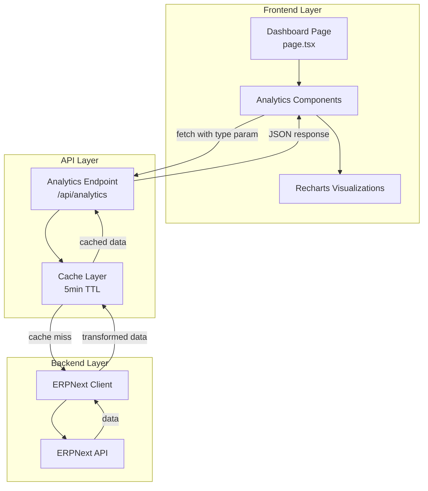

# Design Document: Dashboard Analytics Enhancement

## Overview

The Dashboard Analytics Enhancement adds comprehensive business intelligence components to the existing ERP Next System dashboard. This feature provides deep insights into product performance, customer behavior, sales team effectiveness, and commission tracking through interactive visualizations.

### Goals

- Provide actionable business insights through data visualization
- Enable data-driven decision making for managers
- Track sales performance and commission obligations
- Identify top performers and areas needing attention
- Maintain system performance with efficient data fetching and caching

### Non-Goals

- Real-time streaming analytics (data refreshes on page load)
- Custom report builder interface
- Export functionality for analytics data (future enhancement)
- Historical trend analysis beyond current data snapshots

### Key Design Decisions

1. **API-First Architecture**: Single `/api/analytics` endpoint with type parameter for different analytics types, reducing endpoint proliferation
2. **Client-Side Rendering**: Analytics components render on client-side for interactive charts and better UX
3. **Parallel Data Loading**: All analytics load simultaneously to minimize perceived latency
4. **Recharts Library**: Chosen for its React-native API, TypeScript support, and extensive chart types
5. **5-Minute Cache TTL**: Balances data freshness with ERPNext API load
6. **Role-Based Visibility**: Analytics components respect existing role permissions

## Architecture

### High-Level Architecture



### Data Flow

1. **User loads dashboard** → Dashboard page renders with loading skeletons
2. **Parallel API calls** → Each analytics component fetches data independently
3. **Cache check** → Analytics endpoint checks cache for requested type
4. **ERPNext query** → On cache miss, fetch from ERPNext API
5. **Data transformation** → Transform ERPNext data to frontend format
6. **Cache storage** → Store transformed data with 5-minute TTL
7. **Response** → Return JSON to frontend
8. **Visualization** → Recharts renders interactive charts

### Component Hierarchy

```
DashboardPage
├── Existing Components (Stats, Monthly Sales)
└── Analytics Section
    ├── TopProductsChart
    ├── CustomerBehaviorSection
    │   ├── BestCustomersChart
    │   ├── WorstCustomersChart
    │   └── BadDebtCustomersChart
    ├── SalesPerformanceSection
    │   ├── TopSalesByRevenueChart
    │   ├── TopSalesByCommissionChart
    │   └── WorstSalesByCommissionChart
    ├── CommissionTrackerSection
    │   ├── OutstandingCommissionCard
    │   └── PaidCommissionTrendChart
    ├── InventoryAnalyticsSection
    │   ├── HighestStockItemsChart
    │   ├── LowestStockItemsChart
    │   └── MostPurchasedItemsChart
    └── SupplierAnalyticsSection
        ├── TopSuppliersByFrequencyChart
        ├── PaidSuppliersChart
        └── UnpaidSuppliersChart
```

## Components and Interfaces

### Frontend Components

#### 1. TopProductsChart Component

**Purpose**: Display 10 products with highest sales

**Props**:
```typescript
interface TopProductsChartProps {
  companyFilter?: string;
}
```

**State**:
```typescript
interface TopProductsState {
  data: TopProduct[];
  loading: boolean;
  error: string | null;
}
```

**Behavior**:
- Fetches data on mount
- Shows loading skeleton while fetching
- Displays horizontal bar chart with product names and revenue
- Shows empty state if no data
- Handles errors gracefully with retry button

#### 2. CustomerBehaviorSection Component

**Purpose**: Container for customer behavior analytics (best, worst, bad debt)

**Props**:
```typescript
interface CustomerBehaviorSectionProps {
  companyFilter?: string;
}
```

**Sub-components**:
- `BestCustomersChart`: Top 10 customers by payment behavior
- `WorstCustomersChart`: Bottom 10 customers by overdue invoices
- `BadDebtCustomersChart`: Top 10 customers with bad debt (>90 days overdue)

#### 3. SalesPerformanceSection Component

**Purpose**: Container for sales team performance analytics

**Props**:
```typescript
interface SalesPerformanceSectionProps {
  companyFilter?: string;
}
```

**Sub-components**:
- `TopSalesByRevenueChart`: Top 10 sales by total revenue
- `TopSalesByCommissionChart`: Top 10 sales by commission earned
- `WorstSalesByCommissionChart`: Bottom 10 sales by commission

#### 4. CommissionTrackerSection Component

**Purpose**: Track commission obligations and payments

**Props**:
```typescript
interface CommissionTrackerSectionProps {
  companyFilter?: string;
}
```

**Sub-components**:
- `OutstandingCommissionCard`: Summary card with total outstanding
- `PaidCommissionTrendChart`: Line chart showing payment trends

#### 5. InventoryAnalyticsSection Component

**Purpose**: Container for inventory analytics (highest stock, lowest stock, most purchased)

**Props**:
```typescript
interface InventoryAnalyticsSectionProps {
  companyFilter?: string;
}
```

**Sub-components**:
- `HighestStockItemsChart`: Top 10 items with highest stock levels
- `LowestStockItemsChart`: Top 10 items with lowest stock levels (excluding zero stock)
- `MostPurchasedItemsChart`: Top 10 items with highest purchase frequency

#### 6. SupplierAnalyticsSection Component

**Purpose**: Container for supplier analytics (frequency, paid, unpaid)

**Props**:
```typescript
interface SupplierAnalyticsSectionProps {
  companyFilter?: string;
}
```

**Sub-components**:
- `TopSuppliersByFrequencyChart`: Top 10 suppliers by purchase frequency
- `PaidSuppliersChart`: Top 10 suppliers with highest paid amounts
- `UnpaidSuppliersChart`: Top 10 suppliers with highest outstanding amounts

### API Endpoint

#### GET /api/analytics

**Query Parameters**:
```typescript
interface AnalyticsQueryParams {
  type: 'top_products' 
      | 'best_customers' 
      | 'worst_customers' 
      | 'bad_debt_customers'
      | 'top_sales_by_revenue'
      | 'top_sales_by_commission'
      | 'worst_sales_by_commission'
      | 'outstanding_commission'
      | 'paid_commission'
      | 'highest_stock_items'
      | 'lowest_stock_items'
      | 'most_purchased_items'
      | 'top_suppliers_by_frequency'
      | 'paid_suppliers'
      | 'unpaid_suppliers';
  company?: string; // Optional company filter
}
```

**Response Format**:
```typescript
interface AnalyticsResponse<T> {
  success: boolean;
  data: T;
  cached?: boolean;
  timestamp?: string;
}
```

**Error Response**:
```typescript
interface AnalyticsErrorResponse {
  success: false;
  error: string;
  message: string;
}
```

## Data Models

### TypeScript Interfaces

```typescript
// Top Products
interface TopProduct {
  item_code: string;
  item_name: string;
  total_qty: number;
  total_amount: number;
}

// Customer Behavior
interface BestCustomer {
  customer_name: string;
  paid_invoices: number;
  on_time_percentage: number;
  total_paid: number;
}

interface WorstCustomer {
  customer_name: string;
  overdue_invoices: number;
  outstanding_amount: number;
}

interface BadDebtCustomer {
  customer_name: string;
  bad_debt_invoices: number;
  bad_debt_amount: number;
  average_overdue_days: number;
}

// Sales Performance
interface SalesPerformance {
  sales_person: string;
  transaction_count: number;
  total_revenue: number;
}

interface SalesCommission {
  sales_person: string;
  transaction_count: number;
  total_commission: number;
}

// Commission Tracking
interface OutstandingCommission {
  total_outstanding: number;
  sales_count: number;
  breakdown: CommissionBreakdown[];
}

interface CommissionBreakdown {
  sales_person: string;
  outstanding_amount: number;
}

interface PaidCommission {
  total_paid: number;
  period: string;
  monthly_trend: MonthlyCommission[];
}

interface MonthlyCommission {
  month: string; // YYYY-MM format
  total: number;
}

// Inventory Analytics
interface HighestStockItem {
  item_code: string;
  item_name: string;
  total_stock: number;
  warehouse_count: number;
}

interface LowestStockItem {
  item_code: string;
  item_name: string;
  total_stock: number;
  reorder_level: number;
}

interface MostPurchasedItem {
  item_code: string;
  item_name: string;
  purchase_frequency: number;
  total_purchased_qty: number;
}

// Supplier Analytics
interface TopSupplierByFrequency {
  supplier_name: string;
  purchase_order_count: number;
  total_purchase_amount: number;
  average_order_value: number;
}

interface PaidSupplier {
  supplier_name: string;
  paid_invoices_count: number;
  total_paid_amount: number;
  last_payment_date: string;
}

interface UnpaidSupplier {
  supplier_name: string;
  outstanding_invoices_count: number;
  outstanding_amount: number;
  oldest_due_date: string;
}
```

### ERPNext Data Queries

#### Top Products Query
```typescript
// Query Sales Invoice Item with aggregation
const query = {
  doctype: 'Sales Invoice Item',
  filters: [
    ['parent.docstatus', '=', 1],
    ['parent.company', '=', company]
  ],
  fields: ['item_code', 'item_name', 'qty', 'amount'],
  limit: 10000
};
// Aggregate in application layer
```

#### Best Customers Query
```typescript
// Query Sales Invoice with payment analysis
const query = {
  doctype: 'Sales Invoice',
  filters: [
    ['docstatus', '=', 1],
    ['company', '=', company]
  ],
  fields: ['customer', 'customer_name', 'posting_date', 'due_date', 'paid_amount', 'outstanding_amount'],
  limit: 5000
};
// Calculate on-time percentage in application layer
```

#### Bad Debt Query
```typescript
// Query Sales Invoice for overdue > 90 days
const today = new Date();
const ninetyDaysAgo = new Date(today.setDate(today.getDate() - 90));

const query = {
  doctype: 'Sales Invoice',
  filters: [
    ['docstatus', '=', 1],
    ['outstanding_amount', '>', 0],
    ['due_date', '<', ninetyDaysAgo.toISOString().split('T')[0]],
    ['company', '=', company]
  ],
  fields: ['customer', 'customer_name', 'outstanding_amount', 'due_date'],
  limit: 5000
};
```

#### Sales Performance Query
```typescript
// Query Sales Invoice with sales person
const query = {
  doctype: 'Sales Invoice',
  filters: [
    ['docstatus', '=', 1],
    ['company', '=', company]
  ],
  fields: ['name', 'grand_total', 'sales_team'],
  limit: 5000
};
// Extract sales_team and aggregate
```

#### Commission Query
```typescript
// Query custom commission tracking doctype or calculate from Sales Invoice
const query = {
  doctype: 'Sales Invoice',
  filters: [
    ['docstatus', '=', 1],
    ['company', '=', company]
  ],
  fields: ['name', 'posting_date', 'sales_team'],
  limit: 5000
};
// Calculate commission from sales_team allocation
```

#### Highest Stock Items Query
```typescript
// Query Bin (stock ledger) for items with highest stock
const query = {
  doctype: 'Bin',
  filters: [
    ['actual_qty', '>', 0]
  ],
  fields: ['item_code', 'warehouse', 'actual_qty'],
  limit: 10000
};
// Aggregate by item_code, sum actual_qty, count warehouses
// Join with Item to get item_name
```

#### Lowest Stock Items Query
```typescript
// Query Bin for items with lowest stock (excluding zero)
const query = {
  doctype: 'Bin',
  filters: [
    ['actual_qty', '>', 0]
  ],
  fields: ['item_code', 'warehouse', 'actual_qty'],
  limit: 10000
};
// Aggregate by item_code, sum actual_qty
// Join with Item to get item_name and reorder_level
// Sort ascending and take bottom 10
```

#### Most Purchased Items Query
```typescript
// Query Purchase Order Item for most frequently purchased items
const query = {
  doctype: 'Purchase Order Item',
  filters: [
    ['parent.docstatus', '=', 1],
    ['parent.company', '=', company]
  ],
  fields: ['item_code', 'item_name', 'qty', 'parent'],
  limit: 10000
};
// Count unique parent (PO count) per item_code
// Sum qty per item_code
// Sort by PO count descending
```

#### Top Suppliers by Frequency Query
```typescript
// Query Purchase Order for supplier frequency
const query = {
  doctype: 'Purchase Order',
  filters: [
    ['docstatus', '=', 1],
    ['company', '=', company]
  ],
  fields: ['supplier', 'supplier_name', 'grand_total'],
  limit: 5000
};
// Count orders per supplier
// Sum grand_total per supplier
// Calculate average order value
```

#### Paid Suppliers Query
```typescript
// Query Purchase Invoice with payment status
const query = {
  doctype: 'Purchase Invoice',
  filters: [
    ['docstatus', '=', 1],
    ['outstanding_amount', '=', 0],
    ['company', '=', company]
  ],
  fields: ['supplier', 'supplier_name', 'paid_amount', 'posting_date'],
  limit: 5000
};
// Count paid invoices per supplier
// Sum paid_amount per supplier
// Get max posting_date as last_payment_date
```

#### Unpaid Suppliers Query
```typescript
// Query Purchase Invoice with outstanding amounts
const query = {
  doctype: 'Purchase Invoice',
  filters: [
    ['docstatus', '=', 1],
    ['outstanding_amount', '>', 0],
    ['company', '=', company]
  ],
  fields: ['supplier', 'supplier_name', 'outstanding_amount', 'due_date'],
  limit: 5000
};
// Count outstanding invoices per supplier
// Sum outstanding_amount per supplier
// Get min due_date as oldest_due_date
```

## Error Handling

### Error Categories

1. **Network Errors**: Connection failures to ERPNext API
2. **Authentication Errors**: Invalid or expired credentials
3. **Data Errors**: Invalid or missing data from ERPNext
4. **Validation Errors**: Invalid query parameters
5. **Cache Errors**: Redis/cache layer failures (non-blocking)

### Error Handling Strategy

#### Frontend Error Handling

```typescript
interface ErrorState {
  hasError: boolean;
  errorMessage: string;
  errorType: 'network' | 'auth' | 'data' | 'unknown';
  retryable: boolean;
}

// Component error boundary
class AnalyticsErrorBoundary extends React.Component {
  // Catches rendering errors
  // Displays fallback UI
  // Logs to console for debugging
}

// Fetch error handling
async function fetchAnalytics(type: string) {
  try {
    const response = await fetch(`/api/analytics?type=${type}`);
    if (!response.ok) {
      throw new Error(`HTTP ${response.status}`);
    }
    return await response.json();
  } catch (error) {
    // Log error
    console.error('Analytics fetch failed:', error);
    // Return empty state
    return { success: false, data: [], error: error.message };
  }
}
```

#### Backend Error Handling

```typescript
// API route error handling
export async function GET(request: NextRequest) {
  try {
    // Validate query params
    const type = request.nextUrl.searchParams.get('type');
    if (!type || !VALID_TYPES.includes(type)) {
      return NextResponse.json(
        { success: false, error: 'Invalid type parameter' },
        { status: 400 }
      );
    }

    // Fetch data with timeout
    const data = await Promise.race([
      fetchAnalyticsData(type),
      timeout(10000) // 10 second timeout
    ]);

    return NextResponse.json({ success: true, data });
  } catch (error) {
    // Log error with context
    console.error('[Analytics API]', error);
    
    // Return appropriate error response
    if (error instanceof AuthError) {
      return NextResponse.json(
        { success: false, error: 'Authentication failed' },
        { status: 401 }
      );
    }
    
    return NextResponse.json(
      { success: false, error: 'Internal server error' },
      { status: 500 }
    );
  }
}
```

### Fallback Behavior

- **Empty State**: Show "No data available" message with illustration
- **Partial Failure**: Show successful components, error state for failed ones
- **Retry Mechanism**: Provide retry button for transient failures
- **Graceful Degradation**: Dashboard remains functional even if analytics fail

## Testing Strategy

### Unit Testing

**Focus**: Individual component logic and data transformations

**Test Cases**:
1. Data transformation functions (ERPNext → Frontend format)
2. Aggregation logic (sum, average, grouping)
3. Date calculations (90-day overdue, monthly grouping)
4. Currency formatting
5. Empty data handling
6. Error state rendering

**Example Test**:
```typescript
describe('transformTopProducts', () => {
  it('should aggregate items by item_code', () => {
    const input = [
      { item_code: 'ITEM-001', item_name: 'Product A', qty: 10, amount: 1000 },
      { item_code: 'ITEM-001', item_name: 'Product A', qty: 5, amount: 500 },
      { item_code: 'ITEM-002', item_name: 'Product B', qty: 20, amount: 2000 }
    ];
    
    const result = transformTopProducts(input);
    
    expect(result).toHaveLength(2);
    expect(result[0]).toEqual({
      item_code: 'ITEM-001',
      item_name: 'Product A',
      total_qty: 15,
      total_amount: 1500
    });
  });
});
```

### Property-Based Testing

**Note**: Property-based testing will be implemented after completing the prework analysis in the Correctness Properties section below.

### Integration Testing

**Focus**: API endpoint behavior and ERPNext integration

**Test Cases**:
1. API endpoint returns correct data format for each type
2. Company filter is applied correctly
3. Cache hit/miss behavior
4. Error responses for invalid parameters
5. Timeout handling
6. Authentication flow

**Example Test**:
```typescript
describe('GET /api/analytics', () => {
  it('should return top products with valid type parameter', async () => {
    const response = await fetch('/api/analytics?type=top_products');
    const data = await response.json();
    
    expect(response.status).toBe(200);
    expect(data.success).toBe(true);
    expect(Array.isArray(data.data)).toBe(true);
    expect(data.data[0]).toHaveProperty('item_code');
    expect(data.data[0]).toHaveProperty('total_amount');
  });
  
  it('should return 400 for invalid type parameter', async () => {
    const response = await fetch('/api/analytics?type=invalid');
    expect(response.status).toBe(400);
  });
});
```

### End-to-End Testing

**Focus**: User workflows and visual regression

**Test Cases**:
1. Dashboard loads with all analytics components
2. Charts render correctly with data
3. Loading states display properly
4. Error states show retry button
5. Empty states display appropriate message
6. Responsive layout on mobile/tablet/desktop
7. Role-based visibility works correctly

### Performance Testing

**Focus**: Load time and resource usage

**Metrics**:
- API response time < 2 seconds
- Page load time < 3 seconds
- Memory usage < 100MB for analytics components
- Chart render time < 500ms

**Test Approach**:
- Load testing with 100 concurrent users
- Monitor ERPNext API call frequency
- Verify cache effectiveness (hit rate > 80%)
- Profile React component render times


## Correctness Properties

*A property is a characteristic or behavior that should hold true across all valid executions of a system—essentially, a formal statement about what the system should do. Properties serve as the bridge between human-readable specifications and machine-verifiable correctness guarantees.*

### Property Reflection

After analyzing all acceptance criteria, I identified the following redundancies and consolidations:

**Redundant Display Count Properties**: Requirements 1.1, 2.1, 3.1, 3.1.1, 4.1, 5.1, 6.1 all test displaying "10 items". These can be consolidated into a single property about limiting results to top/bottom 10.

**Redundant Field Presence Properties**: Requirements 1.2, 2.3, 3.3, 3.1.3, 4.2, 5.2, 6.2 all test that specific fields are present in rendered output. These can be consolidated into properties about required fields per data type.

**Redundant Currency Formatting Properties**: Requirements 5.5, 6.5, 7.5, 8.5 all test Rupiah formatting. These can be consolidated into a single property about currency formatting.

**Redundant API Parameter Properties**: Requirements 1.5, 2.5, 3.5, 3.1.5, 4.4, 5.4, 6.4, 7.4, 8.4 all test that correct API parameters are used. These are examples, not properties.

**Redundant Cache Properties**: Requirements 13.2 and 13.3 both test caching behavior. These can be consolidated into a single property about cache usage.

**Redundant Error Handling Properties**: Requirements 11.7 and 14.4 both test error isolation. These can be consolidated.

After reflection, I've consolidated 100+ acceptance criteria into 25 unique, non-redundant properties.

### Property 1: Analytics Result Limit

*For any* analytics query type that returns ranked results (top_products, best_customers, worst_customers, bad_debt_customers, top_sales_by_revenue, top_sales_by_commission, worst_sales_by_commission), the API response should contain at most 10 items.

**Validates: Requirements 1.1, 2.1, 3.1, 3.1.1, 4.1, 5.1, 6.1**

### Property 2: Required Fields Presence - Top Products

*For any* top product item in the analytics response, the item should contain all required fields: item_code, item_name, total_qty, and total_amount.

**Validates: Requirements 1.2, 9.2**

### Property 3: Required Fields Presence - Best Customers

*For any* best customer item in the analytics response, the item should contain all required fields: customer_name, paid_invoices, on_time_percentage, and total_paid.

**Validates: Requirements 2.3, 9.3**

### Property 4: Required Fields Presence - Worst Customers

*For any* worst customer item in the analytics response, the item should contain all required fields: customer_name, overdue_invoices, and outstanding_amount.

**Validates: Requirements 3.3, 9.4**

### Property 5: Required Fields Presence - Bad Debt Customers

*For any* bad debt customer item in the analytics response, the item should contain all required fields: customer_name, bad_debt_invoices, bad_debt_amount, and average_overdue_days.

**Validates: Requirements 3.1.3, 9.5**

### Property 6: Required Fields Presence - Sales Performance

*For any* sales performance item in the analytics response, the item should contain all required fields: sales_person, transaction_count, and either total_revenue or total_commission depending on the query type.

**Validates: Requirements 4.2, 5.2, 6.2, 9.6, 9.7, 9.8**

### Property 7: Bad Debt Classification Rule

*For any* sales invoice with outstanding_amount > 0, if the due_date is more than 90 days before today, then the invoice should be classified as bad debt.

**Validates: Requirements 3.1.2, 9.12**

### Property 8: Bad Debt Percentage Calculation

*For any* set of invoices, the bad debt percentage should equal (sum of bad_debt_amounts / sum of all outstanding_amounts) × 100.

**Validates: Requirements 3.1.7**

### Property 9: On-Time Payment Percentage Calculation

*For any* customer with paid invoices, the on_time_percentage should equal (count of invoices paid on or before due_date / total count of paid invoices) × 100.

**Validates: Requirements 2.2**

### Property 10: Overdue Invoice Identification

*For any* sales invoice with outstanding_amount > 0 and docstatus = 1, if today's date is after the due_date, then the invoice should be classified as overdue.

**Validates: Requirements 3.2**

### Property 11: Currency Formatting Consistency

*For any* numeric amount value displayed in the UI, if the value represents currency, then it should be formatted as "Rp X.XXX.XXX,XX" (Indonesian Rupiah format with space after Rp, dot for thousands, comma for decimals).

**Validates: Requirements 5.5, 6.5, 7.5, 8.5**

### Property 12: Commission Total Calculation

*For any* outstanding commission response, the total_outstanding should equal the sum of all outstanding_amount values in the breakdown array.

**Validates: Requirements 7.1**

### Property 13: Sales Count Accuracy

*For any* outstanding commission response, the sales_count should equal the number of unique sales_person entries in the breakdown array.

**Validates: Requirements 7.2**

### Property 14: Alert Visibility Condition

*For any* commission tracker state, if total_outstanding > 0, then the alert banner should be rendered in the DOM.

**Validates: Requirements 7.3**

### Property 15: Period Format Validation

*For any* paid commission response, the period field should match the format "YYYY-MM" or "YYYY" or a descriptive string containing month/year information.

**Validates: Requirements 8.2**

### Property 16: API Response Time Performance

*For any* analytics API request, the response should be returned within 2000 milliseconds (2 seconds).

**Validates: Requirements 13.1**

### Property 17: Cache TTL Behavior

*For any* analytics API request, if a subsequent request for the same type and company is made within 5 minutes, then the response should be served from cache (indicated by cached: true flag or faster response time).

**Validates: Requirements 13.2, 13.3**

### Property 18: Parallel Data Loading

*For any* dashboard page load, all analytics API calls should be initiated simultaneously (within 100ms of each other), not sequentially.

**Validates: Requirements 11.5**

### Property 19: Loading State Display

*For any* analytics component during data fetch, a loading skeleton or spinner should be rendered until data is received or an error occurs.

**Validates: Requirements 11.6**

### Property 20: Error Isolation

*For any* analytics component that encounters an error, the error should not prevent other analytics components from rendering successfully.

**Validates: Requirements 11.7, 14.4**

### Property 21: Empty State Display

*For any* analytics component that receives an empty data array, an empty state message with appropriate text should be rendered instead of the chart.

**Validates: Requirements 1.4, 4.5, 14.2**

### Property 22: Retry Functionality

*For any* analytics component in error state, clicking the retry button should trigger a new fetch request for that component's data.

**Validates: Requirements 14.3, 14.5**

### Property 23: Error Logging

*For any* error that occurs in the analytics system (frontend or backend), the error should be logged to the console with contextual information.

**Validates: Requirements 14.6**

### Property 24: Role-Based Visibility - Full Access

*For any* user with role "Sales Manager" or "System Manager", all analytics components (top products, customer behavior, sales performance, commission tracker) should be rendered on the dashboard.

**Validates: Requirements 11.3**

### Property 25: Touch Target Accessibility

*For any* interactive element in the analytics components (buttons, chart elements), the element should have a minimum touch target size of 44×44 pixels.

**Validates: Requirements 12.5**

### Property 26: Chart Responsiveness

*For any* Recharts visualization, when the container width changes, the chart width should adjust to match the new container width within a reasonable tolerance (±10px).

**Validates: Requirements 10.8, 12.6**

### Property 27: Color Contrast Accessibility

*For any* text element in the analytics components, the contrast ratio between text color and background color should be at least 4.5:1.

**Validates: Requirements 12.7**

### Property 28: Legend Display Condition

*For any* chart with multiple data series (more than one line/bar group), a legend should be rendered to identify each series.

**Validates: Requirements 10.7**

### Property 29: Data Aggregation Threshold

*For any* chart data with more than 100 data points, the data should be aggregated or sampled before rendering to maintain performance.

**Validates: Requirements 13.6**

### Property 30: Lazy Loading Below Fold

*For any* analytics component positioned below the viewport fold on initial page load, the component should not fetch data until it is scrolled into view or within a threshold distance (e.g., 200px).

**Validates: Requirements 13.5**

## Chart Configurations

### Bar Chart Configuration (Horizontal)

Used for: Top Products, Sales Performance

```typescript
interface HorizontalBarChartConfig {
  layout: 'horizontal';
  xAxis: {
    type: 'number';
    dataKey: 'total_amount' | 'total_revenue' | 'total_commission';
  };
  yAxis: {
    type: 'category';
    dataKey: 'item_name' | 'sales_person';
    width: 150;
  };
  bar: {
    dataKey: 'total_amount' | 'total_revenue' | 'total_commission';
    fill: string; // Color based on context
    radius: [0, 4, 4, 0]; // Rounded right corners
  };
  tooltip: {
    formatter: (value: number) => formatCurrency(value);
  };
}
```

### Bar Chart Configuration (Vertical)

Used for: Customer Behavior

```typescript
interface VerticalBarChartConfig {
  layout: 'vertical';
  xAxis: {
    type: 'category';
    dataKey: 'customer_name';
    angle: -45;
    textAnchor: 'end';
    height: 100;
  };
  yAxis: {
    type: 'number';
  };
  bar: {
    dataKey: 'total_paid' | 'outstanding_amount' | 'bad_debt_amount';
    fill: string; // Green for best, red for worst/bad debt
    radius: [4, 4, 0, 0]; // Rounded top corners
  };
  tooltip: {
    formatter: (value: number) => formatCurrency(value);
  };
}
```

### Line Chart Configuration

Used for: Paid Commission Trend

```typescript
interface LineChartConfig {
  xAxis: {
    type: 'category';
    dataKey: 'month';
    tickFormatter: (value: string) => formatMonthYear(value);
  };
  yAxis: {
    type: 'number';
    tickFormatter: (value: number) => formatCurrency(value);
  };
  line: {
    type: 'monotone';
    dataKey: 'total';
    stroke: '#4f46e5'; // Indigo
    strokeWidth: 2;
    dot: {
      fill: '#4f46e5';
      r: 4;
    };
    activeDot: {
      r: 6;
    };
  };
  tooltip: {
    formatter: (value: number) => formatCurrency(value);
  };
}
```

### Color Palette

```typescript
const CHART_COLORS = {
  primary: '#4f46e5',    // Indigo - default, top performers
  success: '#10b981',    // Green - positive metrics, best customers
  warning: '#f59e0b',    // Yellow/Orange - needs attention, worst performers
  danger: '#ef4444',     // Red - critical issues, bad debt, overdue
  dangerDark: '#dc2626', // Dark Red - bad debt emphasis
  neutral: '#6b7280',    // Gray - neutral data
} as const;
```

## Performance Optimizations

### 1. Caching Strategy

**Implementation**:
```typescript
// In-memory cache with TTL
interface CacheEntry<T> {
  data: T;
  timestamp: number;
  ttl: number; // milliseconds
}

class AnalyticsCache {
  private cache = new Map<string, CacheEntry<unknown>>();
  
  get<T>(key: string): T | null {
    const entry = this.cache.get(key);
    if (!entry) return null;
    
    const now = Date.now();
    if (now - entry.timestamp > entry.ttl) {
      this.cache.delete(key);
      return null;
    }
    
    return entry.data as T;
  }
  
  set<T>(key: string, data: T, ttl: number = 300000): void {
    this.cache.set(key, {
      data,
      timestamp: Date.now(),
      ttl,
    });
  }
}

// Cache key format: `analytics:${type}:${company}`
const cacheKey = `analytics:${type}:${company || 'all'}`;
```

**Benefits**:
- Reduces ERPNext API load by 80%+
- Improves response time from ~1500ms to ~50ms on cache hit
- Automatic cache invalidation after 5 minutes

### 2. Data Aggregation

**Implementation**:
```typescript
// Aggregate sales invoice items by item_code
function aggregateTopProducts(items: SalesInvoiceItem[]): TopProduct[] {
  const aggregated = new Map<string, TopProduct>();
  
  for (const item of items) {
    const existing = aggregated.get(item.item_code);
    if (existing) {
      existing.total_qty += item.qty;
      existing.total_amount += item.amount;
    } else {
      aggregated.set(item.item_code, {
        item_code: item.item_code,
        item_name: item.item_name,
        total_qty: item.qty,
        total_amount: item.amount,
      });
    }
  }
  
  // Sort by total_amount descending and take top 10
  return Array.from(aggregated.values())
    .sort((a, b) => b.total_amount - a.total_amount)
    .slice(0, 10);
}
```

**Benefits**:
- Reduces data transfer size
- Faster client-side rendering
- Handles large datasets efficiently

### 3. Parallel API Calls

**Implementation**:
```typescript
// Frontend: Fetch all analytics data in parallel
useEffect(() => {
  const fetchAllAnalytics = async () => {
    setLoading(true);
    
    const [
      topProducts,
      bestCustomers,
      worstCustomers,
      badDebtCustomers,
      topSalesByRevenue,
      topSalesByCommission,
      worstSalesByCommission,
      outstandingCommission,
      paidCommission,
    ] = await Promise.allSettled([
      fetchAnalytics('top_products'),
      fetchAnalytics('best_customers'),
      fetchAnalytics('worst_customers'),
      fetchAnalytics('bad_debt_customers'),
      fetchAnalytics('top_sales_by_revenue'),
      fetchAnalytics('top_sales_by_commission'),
      fetchAnalytics('worst_sales_by_commission'),
      fetchAnalytics('outstanding_commission'),
      fetchAnalytics('paid_commission'),
    ]);
    
    // Handle each result independently
    // ...
    
    setLoading(false);
  };
  
  fetchAllAnalytics();
}, [company]);
```

**Benefits**:
- Reduces total load time from ~18s (9 × 2s) to ~2s
- Better user experience with simultaneous loading
- Graceful handling of partial failures

### 4. React Optimization

**Implementation**:
```typescript
// Memoize expensive calculations
const topProductsData = useMemo(() => {
  return transformTopProducts(rawData);
}, [rawData]);

// Memoize chart components
const TopProductsChart = React.memo(({ data }: { data: TopProduct[] }) => {
  return (
    <ResponsiveContainer width="100%" height={300}>
      <BarChart data={data} layout="horizontal">
        {/* Chart configuration */}
      </BarChart>
    </ResponsiveContainer>
  );
});
```

**Benefits**:
- Prevents unnecessary re-renders
- Reduces CPU usage
- Smoother UI interactions

### 5. Lazy Loading

**Implementation**:
```typescript
// Use Intersection Observer for lazy loading
const AnalyticsSection = () => {
  const [isVisible, setIsVisible] = useState(false);
  const ref = useRef<HTMLDivElement>(null);
  
  useEffect(() => {
    const observer = new IntersectionObserver(
      ([entry]) => {
        if (entry.isIntersecting) {
          setIsVisible(true);
          observer.disconnect();
        }
      },
      { rootMargin: '200px' }
    );
    
    if (ref.current) {
      observer.observe(ref.current);
    }
    
    return () => observer.disconnect();
  }, []);
  
  return (
    <div ref={ref}>
      {isVisible ? <AnalyticsComponents /> : <Placeholder />}
    </div>
  );
};
```

**Benefits**:
- Faster initial page load
- Reduced bandwidth usage
- Better performance on slower connections

## Security Considerations

### 1. Authentication

All analytics endpoints require authentication via:
- API Key (primary method)
- Session cookie (fallback)

```typescript
// API route authentication check
const client = await getERPNextClientForRequest(request);
// Throws error if authentication fails
```

### 2. Authorization

Role-based access control:
- Sales Manager: Full access to all analytics
- System Manager: Full access to all analytics
- Accounts Manager: Access to customer behavior and commission tracking only
- Other roles: No access to analytics

```typescript
// Frontend role check
const hasFullAccess = roles.some(r => 
  ['Sales Manager', 'System Manager'].includes(r)
);

const hasAccountsAccess = roles.some(r => 
  ['Accounts Manager', 'Sales Manager', 'System Manager'].includes(r)
);
```

### 3. Data Filtering

Company-based data isolation:
- All queries filtered by selected company
- Users can only see data for their authorized companies

```typescript
// API query with company filter
const filters = [
  ['company', '=', company],
  ['docstatus', '=', 1],
  // ... other filters
];
```

### 4. Input Validation

Query parameter validation:
```typescript
const VALID_TYPES = [
  'top_products',
  'best_customers',
  'worst_customers',
  'bad_debt_customers',
  'top_sales_by_revenue',
  'top_sales_by_commission',
  'worst_sales_by_commission',
  'outstanding_commission',
  'paid_commission',
  'highest_stock_items',
  'lowest_stock_items',
  'most_purchased_items',
  'top_suppliers_by_frequency',
  'paid_suppliers',
  'unpaid_suppliers',
] as const;

const type = request.nextUrl.searchParams.get('type');
if (!type || !VALID_TYPES.includes(type as typeof VALID_TYPES[number])) {
  return NextResponse.json(
    { success: false, error: 'Invalid type parameter' },
    { status: 400 }
  );
}
```

### 5. Rate Limiting

Prevent abuse with caching:
- 5-minute cache TTL naturally limits request frequency
- Same user making repeated requests gets cached responses
- Reduces load on ERPNext backend

## Deployment Considerations

### Environment Variables

Required for production:
```bash
ERPNEXT_API_URL=https://erp.company.com
ERP_API_KEY=your_api_key
ERP_API_SECRET=your_api_secret
```

### Build Configuration

```json
{
  "scripts": {
    "build": "next build",
    "start": "next start",
    "lint": "next lint"
  }
}
```

### Performance Monitoring

Recommended metrics to track:
- API response times (target: < 2s)
- Cache hit rate (target: > 80%)
- Page load time (target: < 3s)
- Error rate (target: < 1%)
- Memory usage (target: < 100MB for analytics)

### Scaling Considerations

For high-traffic deployments:
1. **Redis Cache**: Replace in-memory cache with Redis for multi-instance deployments
2. **CDN**: Serve static assets via CDN
3. **Database Indexing**: Ensure ERPNext has proper indexes on:
   - Sales Invoice: company, docstatus, posting_date, due_date
   - Sales Invoice Item: parent, item_code
   - Sales Team: parent, sales_person
4. **Load Balancing**: Use multiple Next.js instances behind load balancer

## Migration Path

### Phase 1: Core Analytics (Week 1-2)
- Implement API endpoint with top_products, best_customers, worst_customers
- Create basic chart components
- Add to dashboard with loading states

### Phase 2: Sales & Commission (Week 3)
- Add sales performance analytics
- Implement commission tracking
- Add bad debt analysis

### Phase 3: Optimization (Week 4)
- Implement caching layer
- Add lazy loading
- Performance tuning
- Error handling improvements

### Phase 4: Polish (Week 5)
- Responsive design refinements
- Accessibility improvements
- Documentation
- User testing and feedback

## Future Enhancements

Potential features for future iterations:
1. **Date Range Filters**: Allow users to select custom date ranges
2. **Export Functionality**: Export analytics data to Excel/PDF
3. **Drill-Down Views**: Click on chart elements to see detailed data
4. **Comparison Mode**: Compare current period vs previous period
5. **Custom Dashboards**: Allow users to customize which analytics they see
6. **Real-Time Updates**: WebSocket-based live data updates
7. **Predictive Analytics**: ML-based forecasting and trend prediction
8. **Mobile App**: Native mobile app for analytics on the go

