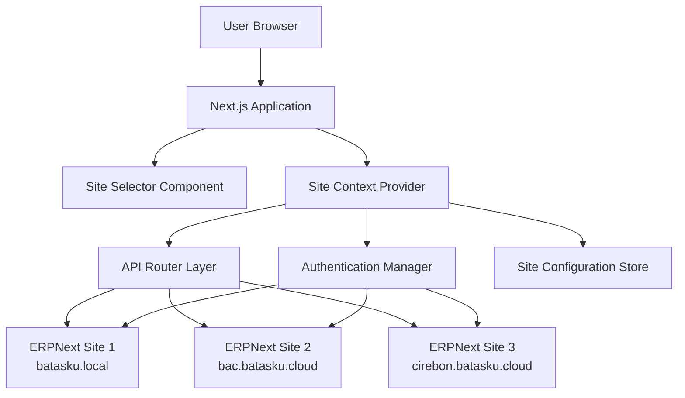
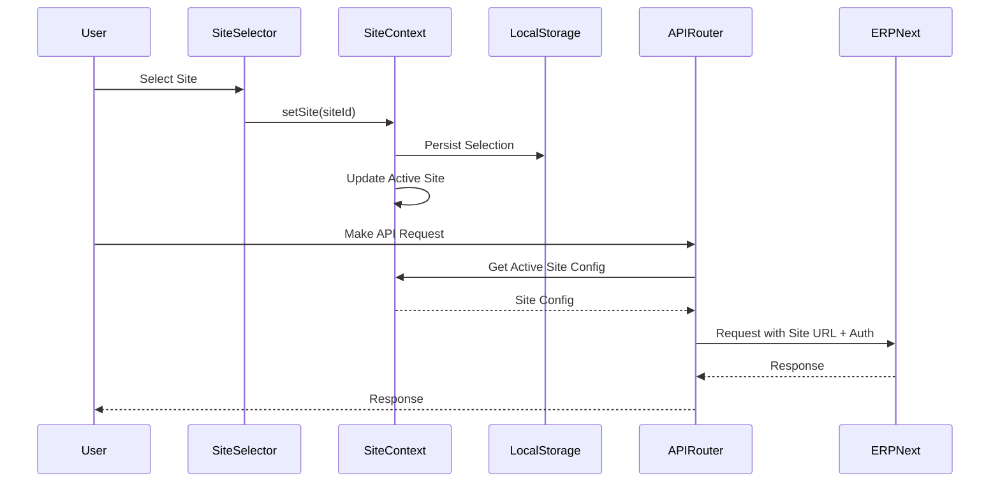

# Design Document: Multi-Site Support

## Overview

This design implements multi-site support for the erp-next-system Next.js application, enabling a single deployment to connect to multiple ERPNext backend instances. The architecture follows a context-based approach where the active site determines API routing, authentication, and data isolation.

The design maintains backward compatibility with the existing single-site configuration while introducing a flexible multi-site layer that can be adopted incrementally. The system will support both local development sites (batasku.local, demo.batasku.local) and production cloud sites (bac.batasku.cloud, cirebon.batasku.cloud, cvcirebon.batasku.cloud, demo.batasku.cloud).

Key design principles:
- Site isolation: Data and sessions are strictly separated per site
- Backward compatibility: Existing single-site configurations continue to work
- Progressive enhancement: Multi-site features are opt-in via configuration
- Type safety: Full TypeScript support for site configurations and contexts
- Performance: Minimal overhead for site switching and API routing

## Architecture

### High-Level Architecture



### Layered Architecture

The multi-site support is implemented as a series of layers:

1. **Configuration Layer**: Manages site definitions and persistence
2. **Context Layer**: Maintains active site state throughout the application
3. **Authentication Layer**: Handles per-site credentials and sessions
4. **API Layer**: Routes requests to the correct ERPNext instance
5. **UI Layer**: Provides site selection and status indicators

### Site Context Flow



## Components and Interfaces

### 1. Site Configuration Store

**Location**: `lib/site-config.ts`

**Purpose**: Manages site configurations with persistence to localStorage and environment variable fallback.

**Interface**:
```typescript
interface SiteConfig {
  id: string;
  name: string;
  displayName: string;
  apiUrl: string;
  apiKey: string;
  apiSecret: string;
  isDefault?: boolean;
  isActive?: boolean;
}

interface SiteConfigStore {
  sites: SiteConfig[];
  addSite(config: Omit<SiteConfig, 'id'>): SiteConfig;
  updateSite(id: string, config: Partial<SiteConfig>): void;
  removeSite(id: string): void;
  getSite(id: string): SiteConfig | undefined;
  getAllSites(): SiteConfig[];
  validateSiteConnection(config: SiteConfig): Promise<boolean>;
  loadFromEnvironment(): void;
  persist(): void;
}
```

**Key Responsibilities**:
- CRUD operations for site configurations
- Validation of site connections before saving
- Migration from single-site environment variables
- Persistence to localStorage with JSON serialization
- Environment variable parsing for default sites

**Storage Format**:
```typescript
// localStorage key: 'erpnext-sites'
{
  version: 1,
  sites: SiteConfig[],
  lastModified: string
}
```

### 2. Site Context Provider

**Location**: `lib/site-context.tsx`

**Purpose**: React Context provider that maintains the active site state and provides site switching functionality.

**Interface**:
```typescript
interface SiteContextValue {
  activeSite: SiteConfig | null;
  sites: SiteConfig[];
  setActiveSite(siteId: string): void;
  refreshSites(): void;
  isLoading: boolean;
  error: string | null;
}

const SiteContext = React.createContext<SiteContextValue | undefined>(undefined);

function SiteProvider({ children }: { children: React.ReactNode }): JSX.Element;
function useSite(): SiteContextValue;
```

**Key Responsibilities**:
- Maintain active site state
- Restore last selected site on app load
- Provide site switching functionality
- Clear cached data when switching sites
- Notify components of site changes

**State Management**:
- Uses React Context for global state
- Persists active site ID to localStorage
- Triggers re-render of dependent components on site change

### 3. Authentication Manager

**Location**: `utils/erpnext-auth-multi.ts`

**Purpose**: Enhanced authentication utilities that support per-site credentials.

**Interface**:
```typescript
interface AuthHeaders {
  'Content-Type': string;
  'Authorization'?: string;
  'Cookie'?: string;
}

function makeErpHeaders(siteConfig: SiteConfig): AuthHeaders;
function getErpAuthHeaders(request: NextRequest, siteConfig: SiteConfig): AuthHeaders;
function getErpHeaders(siteConfig: SiteConfig, sid?: string | null): AuthHeaders;
function isAuthenticated(request: NextRequest, siteId: string): boolean;
```

**Key Responsibilities**:
- Generate authentication headers per site
- Support both API key and session-based auth per site
- Maintain separate session cookies per site (using site-prefixed cookie names)
- Validate authentication status per site

**Session Cookie Strategy**:
- Cookie naming: `sid_${siteId}` (e.g., `sid_batasku-local`, `sid_bac-cloud`)
- Separate cookies prevent session leakage between sites
- Cookies are scoped to the Next.js application domain

### 4. API Router Layer

**Location**: `lib/erpnext-multi.ts`

**Purpose**: Enhanced ERPNext client that routes requests based on active site context.

**Interface**:
```typescript
class ERPNextMultiClient extends ERPNextClient {
  constructor(siteConfig: SiteConfig);
  
  // Inherits all methods from ERPNextClient:
  // getList, get, getDoc, getCount, insert, update, delete, submit, cancel, call
}

function getERPNextClientForSite(siteConfig: SiteConfig): ERPNextMultiClient;
function useERPNextClient(): ERPNextMultiClient; // React hook
```

**Key Responsibilities**:
- Extend existing ERPNextClient with site-aware configuration
- Route all API requests to the correct site URL
- Include correct authentication headers for the site
- Handle site-specific errors
- Provide React hook for component usage

**Implementation Strategy**:
- Extends existing `ERPNextClient` class
- Overrides constructor to accept `SiteConfig`
- All existing methods work unchanged
- Backward compatible with single-site usage

### 5. Site Selector Component

**Location**: `components/site-selector.tsx`

**Purpose**: UI component for site selection and status display.

**Interface**:
```typescript
interface SiteStatus {
  siteId: string;
  isOnline: boolean;
  lastChecked: Date;
  responseTime?: number;
}

interface SiteSelectorProps {
  className?: string;
  showStatus?: boolean;
}

function SiteSelector(props: SiteSelectorProps): JSX.Element;
```

**UI Features**:
- Dropdown menu with all configured sites
- Visual indicator for active site
- Online/offline status badges
- Site display names
- Keyboard navigation support
- Mobile-responsive design

**Visual Design**:
- Uses Tailwind CSS with indigo primary color
- Positioned in navbar for global access
- Shows site name and status icon
- Dropdown with hover/focus states

### 6. Site Health Monitor

**Location**: `lib/site-health.ts`

**Purpose**: Background service that monitors site availability.

**Interface**:
```typescript
interface HealthCheckResult {
  siteId: string;
  isOnline: boolean;
  responseTime: number;
  error?: string;
  timestamp: Date;
}

class SiteHealthMonitor {
  checkSite(siteConfig: SiteConfig): Promise<HealthCheckResult>;
  checkAllSites(): Promise<HealthCheckResult[]>;
  startMonitoring(intervalMs: number): void;
  stopMonitoring(): void;
  getStatus(siteId: string): HealthCheckResult | undefined;
  subscribe(callback: (results: HealthCheckResult[]) => void): () => void;
}
```

**Key Responsibilities**:
- Periodic health checks (every 60 seconds)
- Lightweight ping endpoint (`/api/method/ping`)
- Cache health status
- Notify subscribers of status changes
- Automatic retry with exponential backoff

**Health Check Strategy**:
- Uses ERPNext ping method for minimal overhead
- Timeout after 5 seconds
- Marks site offline after 3 consecutive failures
- Stores last 10 health check results per site

### 7. Site Management UI

**Location**: `app/settings/sites/page.tsx`

**Purpose**: Admin interface for managing site configurations.

**Features**:
- List all configured sites
- Add new site with connection validation
- Edit existing site configurations
- Remove sites (with confirmation)
- Test site connections
- Set default site
- Import/export site configurations

**Form Fields**:
- Display Name (required)
- API URL (required, validated format)
- API Key (required)
- API Secret (required, masked input)
- Set as Default (checkbox)

**Validation**:
- URL format validation
- Connection test before saving
- Duplicate name detection
- Required field validation

## Data Models

### Site Configuration Model

```typescript
interface SiteConfig {
  // Unique identifier (generated from name)
  id: string;
  
  // Internal name (kebab-case, e.g., 'batasku-local')
  name: string;
  
  // User-friendly display name (e.g., 'Batasku Local Development')
  displayName: string;
  
  // ERPNext API base URL (e.g., 'https://bac.batasku.cloud')
  apiUrl: string;
  
  // API authentication credentials
  apiKey: string;
  apiSecret: string;
  
  // Whether this is the default site
  isDefault?: boolean;
  
  // Whether this site is currently active
  isActive?: boolean;
  
  // Metadata
  createdAt?: string;
  updatedAt?: string;
}
```

### Site Context Model

```typescript
interface SiteContextState {
  // Currently active site configuration
  activeSite: SiteConfig | null;
  
  // All available site configurations
  sites: SiteConfig[];
  
  // Loading state during initialization
  isLoading: boolean;
  
  // Error message if site loading fails
  error: string | null;
  
  // Last selected site ID (persisted)
  lastSelectedSiteId: string | null;
}
```

### Health Status Model

```typescript
interface SiteHealthStatus {
  siteId: string;
  isOnline: boolean;
  lastChecked: Date;
  responseTime: number | null;
  error: string | null;
  consecutiveFailures: number;
}
```

### Environment Configuration Model

```typescript
interface EnvironmentSiteConfig {
  // Single-site legacy format
  ERPNEXT_API_URL?: string;
  ERP_API_KEY?: string;
  ERP_API_SECRET?: string;
  
  // Multi-site format (JSON string)
  ERPNEXT_SITES?: string; // JSON array of SiteConfig
  
  // Default site for multi-site setup
  ERPNEXT_DEFAULT_SITE?: string; // site ID
}

// Example ERPNEXT_SITES format:
// [
//   {
//     "name": "batasku-local",
//     "displayName": "Batasku Local",
//     "apiUrl": "http://batasku.local:8000",
//     "apiKey": "...",
//     "apiSecret": "...",
//     "isDefault": true
//   },
//   {
//     "name": "bac-cloud",
//     "displayName": "BAC Production",
//     "apiUrl": "https://bac.batasku.cloud",
//     "apiKey": "...",
//     "apiSecret": "..."
//   }
// ]
```

### Storage Models

**localStorage Schema**:
```typescript
// Key: 'erpnext-sites-config'
interface SitesStorage {
  version: number; // Schema version for migrations
  sites: SiteConfig[];
  lastModified: string; // ISO timestamp
}

// Key: 'erpnext-active-site'
interface ActiveSiteStorage {
  siteId: string;
  timestamp: string; // ISO timestamp
}

// Key: 'erpnext-site-health'
interface SiteHealthStorage {
  [siteId: string]: SiteHealthStatus;
}
```

### Migration Model

```typescript
interface MigrationResult {
  success: boolean;
  migratedSite: SiteConfig | null;
  error: string | null;
  hadLegacyConfig: boolean;
}

interface MigrationStrategy {
  detectLegacyConfig(): boolean;
  migrateLegacyConfig(): MigrationResult;
  preserveLegacyEnvVars(): void;
}
```


## Correctness Properties

*A property is a characteristic or behavior that should hold true across all valid executions of a system—essentially, a formal statement about what the system should do. Properties serve as the bridge between human-readable specifications and machine-verifiable correctness guarantees.*

### Property 1: Site Configuration Storage Round-Trip

*For any* valid site configuration with URL, API key, API secret, and display name, storing it and then retrieving it should return an equivalent configuration with all fields intact.

**Validates: Requirements 1.1**

### Property 2: Site Connection Validation Before Save

*For any* site configuration being added or updated, the configuration should only be persisted if the connection validation succeeds.

**Validates: Requirements 1.2, 1.5**

### Property 3: URL Format Support

*For any* site configuration with a valid URL format (http/https, with/without port, local/cloud domain), the system should parse and store it correctly.

**Validates: Requirements 1.3**

### Property 4: Site Configuration Persistence Round-Trip

*For any* set of site configurations and active site selection, persisting to storage and then restoring (simulating app restart) should return equivalent configurations and selection.

**Validates: Requirements 1.4, 5.1, 5.2**

### Property 5: Site Configuration CRUD Operations

*For any* sequence of add, update, and remove operations on site configurations, the final state should reflect all operations correctly without data corruption.

**Validates: Requirements 1.6**

### Property 6: Site Selector Display Completeness

*For any* set of configured sites, the Site Selector should render all site display names in the output.

**Validates: Requirements 2.1**

### Property 7: Site Context Switching

*For any* site selection, the Site Context should immediately reflect the selected site as active.

**Validates: Requirements 2.2**

### Property 8: Active Site Indicator Consistency

*For any* active site, the Site Selector indicator should match the active site's identity.

**Validates: Requirements 2.3**

### Property 9: Route Preservation on Site Switch

*For any* valid route that exists on both sites, switching sites should preserve the current route.

**Validates: Requirements 2.4**

### Property 10: Site-Specific Credential Isolation

*For any* set of sites with different credentials, switching between sites should always use the correct credentials for the active site.

**Validates: Requirements 3.1, 3.2**

### Property 11: Authentication Method Support

*For any* site configured with either API key or session-based authentication, the Authentication Manager should successfully authenticate using the configured method.

**Validates: Requirements 3.3**

### Property 12: Authentication Fallback

*For any* site where API key authentication fails, the Authentication Manager should attempt session-based authentication as fallback.

**Validates: Requirements 3.4**

### Property 13: Session Cookie Isolation

*For any* set of sites with active sessions, each site should have its own distinct session cookie (prefixed with site ID).

**Validates: Requirements 3.5**

### Property 14: Session Independence on Logout

*For any* site where logout occurs, sessions on other sites should remain active and unaffected.

**Validates: Requirements 3.6**

### Property 15: API Request Routing Correctness

*For any* API request made with an active site, the request should be routed to the active site's API URL.

**Validates: Requirements 4.1**

### Property 16: Immediate Routing Update on Site Change

*For any* site switch followed immediately by an API request, the request should route to the new site's API endpoint.

**Validates: Requirements 4.2**

### Property 17: Authentication Header Correctness

*For any* API request, the authentication headers should match the active site's credentials.

**Validates: Requirements 4.3**

### Property 18: URL Format Handling

*For any* site with a valid URL format (various protocols, ports, paths), API requests should construct the full URL correctly.

**Validates: Requirements 4.5**

### Property 19: Cache Isolation Between Sites

*For any* data cached from one site, switching to a different site should not return the cached data from the previous site.

**Validates: Requirements 6.1, 6.2**

### Property 20: Current Site Display

*For any* active site, the UI should prominently display the active site's display name.

**Validates: Requirements 6.3**

### Property 21: Site Data Visual Indicators

*For any* data displayed in the UI, visual indicators should show which site the data belongs to.

**Validates: Requirements 6.5**

### Property 22: Environment Variable Site Configuration

*For any* valid environment variable site configuration (single or multi-site format), the system should parse and load it correctly.

**Validates: Requirements 7.1, 7.5**

### Property 23: Environment Variable Fallback

*For any* state where no sites are configured in storage, the system should use the site from environment variables as default.

**Validates: Requirements 7.2**

### Property 24: Legacy Environment Variable Migration

*For any* legacy single-site environment variables (ERPNEXT_API_URL, ERP_API_KEY, ERP_API_SECRET), the system should automatically create a valid site configuration.

**Validates: Requirements 7.3, 9.1, 9.2**

### Property 25: Multi-Site Configuration Priority

*For any* state where both multi-site configuration and legacy environment variables exist, the multi-site configuration should take precedence.

**Validates: Requirements 7.4**

### Property 26: Health Status Display

*For any* set of sites with health statuses, the Site Selector should display the correct online/offline status for each site.

**Validates: Requirements 8.1**

### Property 27: Offline Status Indication

*For any* site that becomes unavailable, the Site Selector should update to show offline status.

**Validates: Requirements 8.3**

### Property 28: Active Site Unavailability Notification

*For any* active site that becomes unavailable, the system should display a notification to the user.

**Validates: Requirements 8.4**

### Property 29: Manual Health Check Trigger

*For any* manual refresh action, the system should perform health checks on all configured sites.

**Validates: Requirements 8.5**

### Property 30: Backward Compatibility with Existing API Routes

*For any* existing API route pattern, the multi-site system should maintain compatibility without breaking existing functionality.

**Validates: Requirements 9.4**

### Property 31: Post-Migration Functional State

*For any* completed migration from single-site to multi-site, the application should be in a fully functional state without requiring user intervention.

**Validates: Requirements 9.5**

### Property 32: Site-Specific Error Messages

*For any* site connection failure, the error message should include the site name and failure reason.

**Validates: Requirements 10.1**

### Property 33: Authentication Error Guidance

*For any* authentication failure, the error message should include specific guidance on resolution.

**Validates: Requirements 10.2**

### Property 34: Error Type Classification

*For any* site error (network vs configuration), the system should correctly classify and report the error type.

**Validates: Requirements 10.3**

### Property 35: Error Logging Completeness

*For any* site-related error, the log entry should contain site ID, error type, timestamp, and error details.

**Validates: Requirements 10.4**

### Property 36: Multi-Site Error Summary

*For any* state where multiple sites have errors, the system should provide an aggregate summary of all site statuses.

**Validates: Requirements 10.5**

## Error Handling

### Error Categories

The multi-site system handles several categories of errors:

1. **Configuration Errors**
   - Invalid URL format
   - Missing required fields (API key, secret)
   - Duplicate site names
   - Invalid JSON in environment variables

2. **Connection Errors**
   - Network timeout (5 second timeout)
   - DNS resolution failure
   - SSL/TLS certificate errors
   - HTTP error responses (4xx, 5xx)

3. **Authentication Errors**
   - Invalid API credentials
   - Expired session cookies
   - Missing authentication headers
   - Permission denied responses

4. **State Errors**
   - No site selected when required
   - Selected site no longer exists
   - Corrupted localStorage data
   - Missing environment variables

### Error Handling Strategies

**Configuration Validation**:
```typescript
// Validate before saving
async function validateSiteConfig(config: SiteConfig): Promise<ValidationResult> {
  // URL format validation
  if (!isValidUrl(config.apiUrl)) {
    return { valid: false, error: 'Invalid URL format' };
  }
  
  // Required fields
  if (!config.apiKey || !config.apiSecret) {
    return { valid: false, error: 'API credentials required' };
  }
  
  // Connection test
  try {
    const client = new ERPNextMultiClient(config);
    await client.call('ping');
    return { valid: true };
  } catch (error) {
    return { valid: false, error: `Connection failed: ${error.message}` };
  }
}
```

**Connection Error Handling**:
```typescript
// Retry with exponential backoff
async function fetchWithRetry(url: string, options: RequestInit, maxRetries = 3) {
  for (let i = 0; i < maxRetries; i++) {
    try {
      const response = await fetch(url, {
        ...options,
        signal: AbortSignal.timeout(5000) // 5 second timeout
      });
      return response;
    } catch (error) {
      if (i === maxRetries - 1) throw error;
      await sleep(Math.pow(2, i) * 1000); // Exponential backoff
    }
  }
}
```

**Authentication Error Handling**:
```typescript
// Fallback from API key to session
async function authenticatedFetch(siteConfig: SiteConfig, url: string) {
  // Try API key first
  try {
    const headers = makeErpHeaders(siteConfig);
    const response = await fetch(url, { headers });
    if (response.status === 401) {
      throw new Error('API key authentication failed');
    }
    return response;
  } catch (error) {
    // Fallback to session cookie
    const sid = getSessionCookie(siteConfig.id);
    if (sid) {
      const headers = { 'Cookie': `sid=${sid}` };
      return fetch(url, { headers });
    }
    throw error;
  }
}
```

**State Error Handling**:
```typescript
// Graceful degradation for missing site
function useActiveSite(): SiteConfig | null {
  const { activeSite, sites } = useSite();
  
  // No site selected - prompt user
  if (!activeSite && sites.length > 0) {
    return null; // Triggers site selection prompt
  }
  
  // Selected site no longer exists - clear and prompt
  if (activeSite && !sites.find(s => s.id === activeSite.id)) {
    clearActiveSite();
    return null;
  }
  
  return activeSite;
}
```

### Error Messages

All error messages follow this structure:
- **Context**: Which site and operation
- **Problem**: What went wrong
- **Guidance**: How to fix it

Examples:
```typescript
const errorMessages = {
  connectionFailed: (siteName: string, reason: string) =>
    `Cannot connect to ${siteName}: ${reason}. Check the site URL and network connection.`,
  
  authFailed: (siteName: string) =>
    `Authentication failed for ${siteName}. Verify your API key and secret in site settings.`,
  
  noSiteSelected: () =>
    `No site selected. Please select a site from the dropdown to continue.`,
  
  siteNotFound: (siteName: string) =>
    `Site "${siteName}" is no longer configured. Please select a different site.`,
};
```

### Error Recovery

The system provides automatic recovery for common errors:

1. **Stale Site Selection**: Automatically clears and prompts for new selection
2. **Network Timeout**: Retries with exponential backoff (3 attempts)
3. **Auth Failure**: Falls back to session-based auth
4. **Corrupted Storage**: Resets to environment variable defaults

## Testing Strategy

### Dual Testing Approach

The multi-site support feature requires both unit tests and property-based tests for comprehensive coverage:

**Unit Tests** focus on:
- Specific examples of site configurations
- Edge cases (empty configs, invalid URLs, missing credentials)
- Error conditions (network failures, auth failures)
- Integration points (localStorage, environment variables)
- UI component rendering with specific props

**Property-Based Tests** focus on:
- Universal properties across all valid inputs
- Round-trip properties (store/retrieve, serialize/deserialize)
- Invariants (credential isolation, cache isolation)
- State transitions (site switching, authentication fallback)
- Comprehensive input coverage through randomization

### Property-Based Testing Configuration

**Library**: fast-check (TypeScript property-based testing library)

**Configuration**:
- Minimum 100 iterations per property test
- Custom generators for domain types (SiteConfig, URLs, credentials)
- Shrinking enabled for minimal failing examples

**Test Tagging**:
Each property test must reference its design document property:
```typescript
// Feature: multi-site-support, Property 1: Site Configuration Storage Round-Trip
test('site configuration storage round-trip', () => {
  fc.assert(
    fc.property(siteConfigArbitrary, (config) => {
      const stored = storeSiteConfig(config);
      const retrieved = getSiteConfig(stored.id);
      expect(retrieved).toEqual(config);
    }),
    { numRuns: 100 }
  );
});
```

### Test Organization

```
tests/
├── unit/
│   ├── site-config.test.ts          # Site configuration CRUD
│   ├── site-context.test.ts         # React context behavior
│   ├── auth-multi.test.ts           # Multi-site authentication
│   ├── api-router.test.ts           # API routing logic
│   ├── site-health.test.ts          # Health monitoring
│   └── migration.test.ts            # Legacy migration
├── property/
│   ├── site-config.property.test.ts # Properties 1-5
│   ├── site-selection.property.test.ts # Properties 6-9
│   ├── authentication.property.test.ts # Properties 10-14
│   ├── api-routing.property.test.ts # Properties 15-18
│   ├── isolation.property.test.ts   # Properties 19-21
│   ├── environment.property.test.ts # Properties 22-25
│   ├── health.property.test.ts      # Properties 26-29
│   ├── migration.property.test.ts   # Properties 30-31
│   └── errors.property.test.ts      # Properties 32-36
└── integration/
    ├── site-switching.test.ts       # End-to-end site switching
    ├── api-requests.test.ts         # Full API request flow
    └── ui-components.test.ts        # Component integration
```

### Custom Generators for Property Tests

```typescript
// Arbitrary for valid site configurations
const siteConfigArbitrary = fc.record({
  id: fc.uuid(),
  name: fc.stringMatching(/^[a-z0-9-]+$/),
  displayName: fc.string({ minLength: 1, maxLength: 50 }),
  apiUrl: fc.oneof(
    fc.constant('http://localhost:8000'),
    fc.webUrl({ validSchemes: ['http', 'https'] })
  ),
  apiKey: fc.hexaString({ minLength: 15, maxLength: 15 }),
  apiSecret: fc.hexaString({ minLength: 15, maxLength: 15 }),
  isDefault: fc.boolean(),
});

// Arbitrary for site arrays
const siteArrayArbitrary = fc.array(siteConfigArbitrary, { minLength: 1, maxLength: 10 });

// Arbitrary for URLs with various formats
const urlFormatArbitrary = fc.oneof(
  fc.constant('http://batasku.local'),
  fc.constant('http://batasku.local:8000'),
  fc.constant('https://bac.batasku.cloud'),
  fc.constant('https://demo.batasku.cloud:8443'),
);
```

### Test Coverage Goals

- **Unit Test Coverage**: 80% line coverage minimum
- **Property Test Coverage**: All 36 correctness properties implemented
- **Integration Test Coverage**: All critical user flows
- **Edge Case Coverage**: All identified edge cases from prework

### Mocking Strategy

**External Dependencies**:
- Mock `fetch` for ERPNext API calls
- Mock `localStorage` for storage tests
- Mock `process.env` for environment variable tests
- Mock timers for health check intervals

**Test Isolation**:
- Clear localStorage before each test
- Reset environment variables after each test
- Clear all mocks between tests
- Use separate test databases if needed

### Example Property Test

```typescript
import fc from 'fast-check';
import { storeSiteConfig, getSiteConfig, clearSiteConfigs } from '@/lib/site-config';

describe('Site Configuration Properties', () => {
  beforeEach(() => {
    clearSiteConfigs();
  });

  // Feature: multi-site-support, Property 1: Site Configuration Storage Round-Trip
  test('storing and retrieving site config preserves all fields', () => {
    fc.assert(
      fc.property(siteConfigArbitrary, (config) => {
        const stored = storeSiteConfig(config);
        const retrieved = getSiteConfig(stored.id);
        
        expect(retrieved).toBeDefined();
        expect(retrieved?.name).toBe(config.name);
        expect(retrieved?.displayName).toBe(config.displayName);
        expect(retrieved?.apiUrl).toBe(config.apiUrl);
        expect(retrieved?.apiKey).toBe(config.apiKey);
        expect(retrieved?.apiSecret).toBe(config.apiSecret);
      }),
      { numRuns: 100 }
    );
  });

  // Feature: multi-site-support, Property 4: Site Configuration Persistence Round-Trip
  test('persistence round-trip preserves configurations', () => {
    fc.assert(
      fc.property(siteArrayArbitrary, (configs) => {
        // Store all configs
        configs.forEach(config => storeSiteConfig(config));
        
        // Simulate app restart by clearing in-memory state
        const persistedData = localStorage.getItem('erpnext-sites-config');
        clearSiteConfigs();
        
        // Restore from storage
        if (persistedData) {
          localStorage.setItem('erpnext-sites-config', persistedData);
        }
        loadSiteConfigs();
        
        // Verify all configs restored
        const restored = getAllSiteConfigs();
        expect(restored).toHaveLength(configs.length);
        
        configs.forEach(config => {
          const found = restored.find(r => r.name === config.name);
          expect(found).toBeDefined();
          expect(found?.apiUrl).toBe(config.apiUrl);
        });
      }),
      { numRuns: 100 }
    );
  });
});
```

### Example Unit Test

```typescript
import { validateSiteConfig } from '@/lib/site-config';

describe('Site Configuration Validation', () => {
  test('rejects invalid URL format', async () => {
    const config = {
      name: 'test-site',
      displayName: 'Test Site',
      apiUrl: 'not-a-valid-url',
      apiKey: 'test-key',
      apiSecret: 'test-secret',
    };
    
    const result = await validateSiteConfig(config);
    expect(result.valid).toBe(false);
    expect(result.error).toContain('Invalid URL format');
  });

  test('rejects missing API credentials', async () => {
    const config = {
      name: 'test-site',
      displayName: 'Test Site',
      apiUrl: 'https://test.example.com',
      apiKey: '',
      apiSecret: '',
    };
    
    const result = await validateSiteConfig(config);
    expect(result.valid).toBe(false);
    expect(result.error).toContain('API credentials required');
  });

  test('accepts valid configuration with successful connection', async () => {
    // Mock successful API call
    global.fetch = jest.fn().mockResolvedValue({
      ok: true,
      json: async () => ({ message: 'pong' }),
    });
    
    const config = {
      name: 'test-site',
      displayName: 'Test Site',
      apiUrl: 'https://test.example.com',
      apiKey: 'valid-key',
      apiSecret: 'valid-secret',
    };
    
    const result = await validateSiteConfig(config);
    expect(result.valid).toBe(true);
  });
});
```

