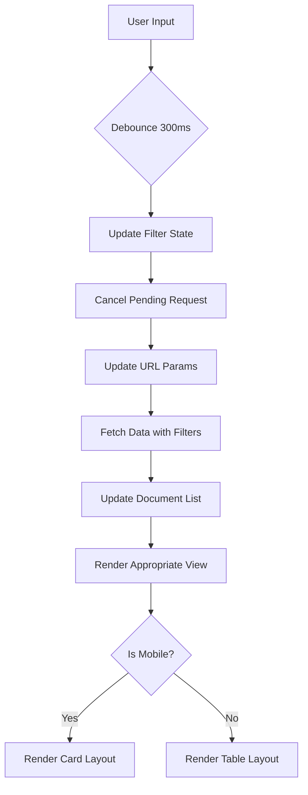

# Design Document: Responsive List UI Redesign

## Overview

This design document outlines the architecture and implementation approach for redesigning all list views in the ERPNext-based ERP system to be fully responsive with a hybrid table/card layout. The redesign addresses critical usability issues including cursor focus loss in search inputs, missing filter functionality, and poor mobile experience.

### Goals

- Implement hybrid responsive layout (table for desktop >768px, cards for mobile ≤768px)
- Fix search input focus issues through proper controlled input management
- Add adaptive pagination (20 items desktop, 10 items mobile)
- Implement debounced search and filtering (300ms delay)
- Ensure consistent filter state management across all list views
- Optimize performance with request cancellation
- Maintain accessibility compliance

### Scope

This redesign applies to all list views across the following modules:
- Sales (Sales Orders, Sales Invoices, Delivery Notes)
- Purchase (Purchase Orders, Purchase Invoices, Purchase Receipts)
- Inventory (Stock Entry, Stock Reconciliation, Warehouses, Items)
- HR (Employees, Sales Persons, Commission Payments)
- Finance (Journal Entries, GL Entries, Chart of Accounts, Payment Entries)

### Non-Goals

- Redesigning detail/edit forms (only list views)
- Implementing advanced filtering beyond date ranges and text search
- Adding bulk operations or multi-select functionality
- Changing the underlying ERPNext API structure

## Architecture

### Component Hierarchy

```
ResponsiveListView (Generic Container)
├── ListHeader
│   ├── Title
│   └── CreateButton
├── FilterPanel
│   ├── SearchInput (with debounce)
│   ├── DocumentNumberInput (with debounce)
│   ├── StatusSelect
│   ├── DateRangeFilter (BrowserStyleDatePicker)
│   └── ClearFiltersButton
├── ActiveFiltersDisplay
│   └── FilterChip[] (removable)
├── ListContent
│   ├── DesktopTableView (>768px)
│   │   ├── TableHeader
│   │   └── TableRow[]
│   └── MobileCardView (≤768px)
│       └── DocumentCard[]
└── PaginationControls
    ├── PageInfo
    ├── PreviousButton
    ├── PageNumbers[]
    └── NextButton
```

### Responsive Strategy

The design uses a **breakpoint-based hybrid approach**:

- **Desktop View (>768px)**: Traditional table layout with full column visibility
- **Mobile View (≤768px)**: Card-based layout with stacked information hierarchy

The breakpoint detection uses CSS media queries and React hooks (`useMediaQuery`) to:
1. Detect viewport width changes
2. Adjust page size automatically (20 → 10 or 10 → 20)
3. Recalculate current page to maintain viewing context
4. Re-render with appropriate layout component

### State Management Architecture

```typescript
interface ListViewState {
  // Data
  documents: Document[];
  loading: boolean;
  error: string | null;
  
  // Pagination
  currentPage: number;
  totalPages: number;
  totalRecords: number;
  pageSize: number; // 20 for desktop, 10 for mobile
  
  // Filters
  searchTerm: string;
  documentNumberFilter: string;
  statusFilter: string;
  dateFilter: {
    from_date: string; // DD/MM/YYYY format
    to_date: string;   // DD/MM/YYYY format
  };
  
  // UI State
  isMobile: boolean;
  submittingDocument: string | null;
  
  // Request Management
  abortController: AbortController | null;
}
```

### Data Flow



## Components and Interfaces

### 1. ResponsiveListView (Generic Component)

A reusable container component that can be configured for any document type.

```typescript
interface ResponsiveListViewProps<T> {
  // Configuration
  title: string;
  createRoute: string;
  apiEndpoint: string;
  
  // Column/Field Configuration
  columns: ColumnConfig[];
  searchFields: string[];
  
  // Rendering
  renderTableRow: (doc: T) => React.ReactNode;
  renderCard: (doc: T) => React.ReactNode;
  
  // Optional Customization
  statusOptions?: StatusOption[];
  additionalFilters?: React.ReactNode;
  onDocumentClick?: (doc: T) => void;
  showPrintButton?: boolean;
  showSubmitButton?: boolean;
}

interface ColumnConfig {
  key: string;
  label: string;
  sortable?: boolean;
  width?: string;
  render?: (value: any, doc: any) => React.ReactNode;
}

interface StatusOption {
  value: string;
  label: string;
  color: 'green' | 'red' | 'blue' | 'yellow' | 'gray';
}
```

### 2. useDebounce Hook

Custom hook for debouncing input values.

```typescript
function useDebounce<T>(value: T, delay: number): T {
  const [debouncedValue, setDebouncedValue] = useState<T>(value);
  
  useEffect(() => {
    const handler = setTimeout(() => {
      setDebouncedValue(value);
    }, delay);
    
    return () => {
      clearTimeout(handler);
    };
  }, [value, delay]);
  
  return debouncedValue;
}
```

### 3. useMediaQuery Hook

Custom hook for responsive breakpoint detection.

```typescript
function useMediaQuery(query: string): boolean {
  const [matches, setMatches] = useState(false);
  
  useEffect(() => {
    const media = window.matchMedia(query);
    
    // Set initial value
    setMatches(media.matches);
    
    // Create listener
    const listener = (e: MediaQueryListEvent) => {
      setMatches(e.matches);
    };
    
    // Add listener
    media.addEventListener('change', listener);
    
    // Cleanup
    return () => media.removeEventListener('change', listener);
  }, [query]);
  
  return matches;
}
```

### 4. FilterPanel Component

```typescript
interface FilterPanelProps {
  searchTerm: string;
  onSearchChange: (value: string) => void;
  documentNumberFilter: string;
  onDocumentNumberChange: (value: string) => void;
  statusFilter: string;
  onStatusChange: (value: string) => void;
  dateFilter: DateFilter;
  onDateFilterChange: (filter: DateFilter) => void;
  statusOptions: StatusOption[];
  onClearFilters: () => void;
}

interface DateFilter {
  from_date: string;
  to_date: string;
}
```

### 5. DocumentCard Component (Mobile)

```typescript
interface DocumentCardProps<T> {
  document: T;
  onClick: () => void;
  primaryField: string;
  secondaryFields: CardField[];
  statusField: string;
  actions?: CardAction[];
}

interface CardField {
  label: string;
  value: string | number;
  format?: 'currency' | 'date' | 'text';
}

interface CardAction {
  icon: React.ReactNode;
  label: string;
  onClick: (e: React.MouseEvent) => void;
  variant?: 'primary' | 'secondary' | 'danger';
}
```

### 6. useListData Hook

Custom hook encapsulating data fetching logic with debouncing and cancellation.

```typescript
interface UseListDataOptions {
  apiEndpoint: string;
  pageSize: number;
  filters: FilterState;
  currentPage: number;
}

interface UseListDataReturn<T> {
  documents: T[];
  loading: boolean;
  error: string | null;
  totalRecords: number;
  totalPages: number;
  refetch: () => void;
}

function useListData<T>(options: UseListDataOptions): UseListDataReturn<T> {
  // Implementation with debouncing, cancellation, and error handling
}
```

## Data Models

### Generic Document Interface

```typescript
interface BaseDocument {
  name: string;
  docstatus: number;
  creation: string;
  modified: string;
  owner: string;
}
```

### Filter State Model

```typescript
interface FilterState {
  search: string;
  documentNumber: string;
  status: string;
  fromDate: string;
  toDate: string;
  company: string;
  [key: string]: string; // Allow additional custom filters
}
```

### Pagination Model

```typescript
interface PaginationState {
  currentPage: number;
  pageSize: number;
  totalRecords: number;
  totalPages: number;
}

interface PaginationParams {
  limit_page_length: number;
  start: number;
}
```

### API Response Model

```typescript
interface ListAPIResponse<T> {
  success: boolean;
  data: T[];
  total_records: number;
  message?: string;
}
```


## Correctness Properties

*A property is a characteristic or behavior that should hold true across all valid executions of a system—essentially, a formal statement about what the system should do. Properties serve as the bridge between human-readable specifications and machine-verifiable correctness guarantees.*

### Property 1: Responsive Layout Switching

*For any* viewport width, the list view should render a table layout when width > 768px and a card layout when width ≤ 768px.

**Validates: Requirements 1.1, 1.2**

### Property 2: Layout Transition Responsiveness

*For any* viewport width change that crosses the 768px breakpoint, the list view should detect the change and re-render with the appropriate layout within one render cycle.

**Validates: Requirements 1.3**

### Property 3: Hybrid Layout Consistency

*For all* list view components across Sales, Purchase, Inventory, HR, and Finance modules, each should implement the same responsive breakpoint behavior (table >768px, cards ≤768px).

**Validates: Requirements 1.4**

### Property 4: State Preservation During Layout Switch

*For any* active filter state and pagination position, switching between desktop and mobile views should preserve all filter values and maintain the user's viewing context.

**Validates: Requirements 1.5**

### Property 5: Adaptive Page Sizing

*For any* viewport width, the list view should set page size to 20 items when width > 768px and 10 items when width ≤ 768px.

**Validates: Requirements 2.1, 2.2**

### Property 6: Page Recalculation on Size Change

*For any* current page position, when page size changes due to layout switch, the list view should recalculate the current page number to display items closest to the previous viewing position.

**Validates: Requirements 2.3**

### Property 7: Pagination UI Presence

*For any* layout mode (desktop or mobile), the list view should display pagination controls at the bottom of the document list.

**Validates: Requirements 2.4**

### Property 8: Correct Page Data Fetching

*For any* page number N and page size P, navigating to page N should fetch and display items from index (N-1)*P to N*P-1.

**Validates: Requirements 2.5**

### Property 9: Search Input Focus Preservation

*For any* typing sequence in a search input field, the cursor focus and position should remain stable throughout the entire typing session without jumping or losing focus.

**Validates: Requirements 3.1**

### Property 10: Universal Input Debouncing

*For any* filter input change (search, document number, or date), the list view should debounce API calls with a 300ms delay after the last input change.

**Validates: Requirements 3.3, 4.4, 5.3**

### Property 11: Debounce Period Result Stability

*For any* filter input change, the displayed results should remain unchanged during the 300ms debounce period and only update after the period completes.

**Validates: Requirements 3.4**

### Property 12: Consistent Search Implementation

*For all* list views with search functionality, each should implement the same debouncing (300ms) and focus preservation patterns.

**Validates: Requirements 3.5, 7.3**

### Property 13: Multi-Field Search Coverage

*For any* search term entered, the list view should return documents where the term matches either the Document_Number field or the Party_Name field (or both).

**Validates: Requirements 5.2**

### Property 14: Search Match Indication

*For any* search result displayed, the list view should visually indicate which field(s) (Document_Number or Party_Name) matched the search term.

**Validates: Requirements 5.4**

### Property 15: Filter Clearing Behavior

*For any* cleared filter (search, date, or status), the list view should display all documents that match the remaining active filters, or all documents if no filters remain active.

**Validates: Requirements 4.5, 5.5**

### Property 16: Date Range Filtering

*For any* selected date range [from_date, to_date], the list view should fetch and display only documents where posting_date >= from_date AND posting_date <= to_date.

**Validates: Requirements 4.3**

### Property 17: Active Filter Visual Indication

*For any* active filter (search, status, date range, document number), the list view should display a visual indicator showing which filters are currently applied.

**Validates: Requirements 6.1**

### Property 18: URL State Synchronization

*For any* filter state change, the list view should update the URL query parameters to reflect the current filter values, and conversely, loading with URL query parameters should apply those as the initial filter state.

**Validates: Requirements 6.4, 6.5**

### Property 19: Universal Search Availability

*For all* list view components in the system, each should provide a search input field that searches relevant document fields.

**Validates: Requirements 7.2**

### Property 20: Searchable Field Functionality

*For any* list view with search capability, searching should return results when the search term matches any of the documented searchable fields for that document type.

**Validates: Requirements 7.4**

### Property 21: Mobile Card Rendering

*For any* document in mobile view (≤768px), the list view should render it as a distinct card with visual separation from other cards.

**Validates: Requirements 8.1**

### Property 22: Complete Card Content Display

*For any* document card in mobile view, the card should display the document number prominently, party name and date as secondary information, and status with appropriate color-coded styling.

**Validates: Requirements 8.2, 8.3, 8.4**

### Property 23: Card Navigation

*For any* document card, tapping or clicking the card should navigate to the document's detail or edit page.

**Validates: Requirements 8.5**

### Property 24: Paginated Data Fetching

*For any* list view render, the system should fetch only the data required for the current page (page size items), not the entire dataset.

**Validates: Requirements 9.1**

### Property 25: Request Cancellation on New Request

*For any* pending API request, initiating a new filter change or pagination request should cancel the pending request before starting the new one.

**Validates: Requirements 9.2, 9.3**

### Property 26: Loading State Indication

*For any* data fetching operation, the list view should display a loading indicator while the request is in progress.

**Validates: Requirements 9.4**

### Property 27: Error Handling with Retry

*For any* failed API request, the list view should display an error message and provide a retry action to the user.

**Validates: Requirements 9.5**

### Property 28: Keyboard Navigation Support

*For any* pagination control (previous, next, page numbers), the control should be keyboard accessible and navigable using Tab and Enter keys.

**Validates: Requirements 10.1**

### Property 29: ARIA Label Completeness

*For all* interactive filter controls (search inputs, date pickers, status selects), each should have appropriate ARIA labels for screen reader accessibility.

**Validates: Requirements 10.2**

### Property 30: Visible Focus Indicators

*For any* interactive element receiving keyboard focus, the list view should display a visible focus indicator (outline or highlight).

**Validates: Requirements 10.3**

### Property 31: Screen Reader Announcements

*For any* filter change or result count update, the list view should announce the change to screen readers using ARIA live regions.

**Validates: Requirements 10.4**

### Property 32: Card Keyboard Accessibility

*For any* document card in mobile view, the card should be keyboard accessible with proper focus management and activation via Enter key.

**Validates: Requirements 10.5**

## Error Handling

### Input Validation Errors

- **Invalid Date Format**: If user manually enters an invalid date, display inline error message and prevent API call
- **Empty Required Filters**: If company is not selected, display error message and prevent data fetching
- **Invalid Page Number**: If URL contains invalid page number, default to page 1

### API Errors

- **Network Failure**: Display "Unable to connect to server" message with retry button
- **Authentication Failure**: Redirect to login page with session expired message
- **Authorization Failure**: Display "You don't have permission to view this data" message
- **Server Error (500)**: Display "Server error occurred" message with retry button
- **Timeout**: Cancel request after 30 seconds and display timeout message with retry

### State Management Errors

- **Invalid Filter State**: If URL params contain invalid filter values, ignore invalid params and use defaults
- **Missing Company Context**: If no company is selected, prompt user to select company before loading data
- **Pagination Out of Bounds**: If calculated page exceeds total pages, reset to last valid page

### Error Recovery

All errors should:
1. Display user-friendly error messages in Indonesian
2. Preserve current filter state when possible
3. Provide clear recovery actions (retry, clear filters, select company)
4. Log errors to console for debugging
5. Not crash the application or leave it in broken state

## Testing Strategy

### Dual Testing Approach

This feature requires both unit tests and property-based tests to ensure comprehensive coverage:

- **Unit Tests**: Verify specific examples, edge cases, and error conditions
- **Property Tests**: Verify universal properties across all inputs through randomization

Both testing approaches are complementary and necessary. Unit tests catch concrete bugs in specific scenarios, while property tests verify general correctness across a wide range of inputs.

### Property-Based Testing

**Library Selection**: Use `fast-check` for TypeScript/JavaScript property-based testing

**Configuration**:
- Minimum 100 iterations per property test (due to randomization)
- Each property test must reference its design document property
- Tag format: `// Feature: responsive-list-ui, Property {number}: {property_text}`

**Property Test Coverage**:

Each correctness property (1-32) should be implemented as a property-based test:

1. **Responsive Layout Switching**: Generate random viewport widths, verify correct layout component renders
2. **Layout Transition Responsiveness**: Generate viewport transitions, verify re-render occurs
3. **Hybrid Layout Consistency**: Test all module list views, verify consistent breakpoint behavior
4. **State Preservation**: Generate random filter states, switch layouts, verify state unchanged
5. **Adaptive Page Sizing**: Generate random viewport widths, verify correct page size
6. **Page Recalculation**: Generate random page positions and size changes, verify correct recalculation
7. **Pagination UI Presence**: Test both layouts, verify pagination controls exist
8. **Correct Page Data Fetching**: Generate random page numbers, verify correct data range fetched
9. **Search Input Focus**: Simulate typing sequences, verify focus remains stable
10. **Universal Input Debouncing**: Generate rapid input changes, verify 300ms debounce
11. **Debounce Period Stability**: Generate input changes, verify results don't update during debounce
12. **Consistent Search Implementation**: Test all list views, verify same debounce/focus patterns
13. **Multi-Field Search**: Generate search terms, verify matches in both fields returned
14. **Search Match Indication**: Generate search results, verify matched fields indicated
15. **Filter Clearing**: Generate filter combinations, clear filters, verify correct results
16. **Date Range Filtering**: Generate date ranges, verify only documents in range returned
17. **Active Filter Indication**: Generate filter states, verify visual indicators present
18. **URL State Sync**: Generate filter changes, verify URL updates and hydration works
19. **Universal Search Availability**: Test all list views, verify search input exists
20. **Searchable Field Functionality**: Generate search terms for each list type, verify results
21. **Mobile Card Rendering**: Generate documents in mobile view, verify card rendering
22. **Complete Card Content**: Generate documents, verify all required fields in cards
23. **Card Navigation**: Generate card clicks, verify navigation occurs
24. **Paginated Data Fetching**: Generate page requests, verify only page data fetched
25. **Request Cancellation**: Generate rapid filter changes, verify old requests cancelled
26. **Loading State Indication**: Generate fetch operations, verify loading indicators shown
27. **Error Handling**: Generate API failures, verify error messages and retry buttons
28. **Keyboard Navigation**: Generate keyboard events, verify pagination navigable
29. **ARIA Label Completeness**: Test all controls, verify ARIA labels present
30. **Visible Focus Indicators**: Generate focus events, verify indicators visible
31. **Screen Reader Announcements**: Generate filter changes, verify ARIA live announcements
32. **Card Keyboard Accessibility**: Generate keyboard events on cards, verify accessibility

### Unit Testing

**Focus Areas**:

1. **Specific Examples**:
   - Test exact breakpoint (768px) behavior
   - Test specific date range (e.g., Jan 1 - Jan 31)
   - Test specific search term matching
   - Test empty state rendering

2. **Edge Cases**:
   - Empty document list
   - Single document
   - Exactly 20 documents (one full page)
   - Page size boundary conditions
   - Invalid date inputs
   - Special characters in search
   - Very long document names
   - Missing optional fields

3. **Integration Points**:
   - API endpoint integration
   - URL parameter parsing
   - Local storage company selection
   - Navigation routing
   - Print dialog integration

4. **Error Conditions**:
   - Network timeout
   - 401 authentication error
   - 403 authorization error
   - 500 server error
   - Malformed API response
   - Missing required fields in response

**Unit Test Balance**:
- Avoid writing too many unit tests for scenarios covered by property tests
- Focus unit tests on concrete examples that demonstrate correct behavior
- Use unit tests for integration testing between components
- Property tests handle comprehensive input coverage

### Testing Tools

- **Property Testing**: fast-check
- **Unit Testing**: Jest + React Testing Library
- **Component Testing**: Testing Library user-event for interactions
- **Accessibility Testing**: jest-axe for automated a11y checks
- **Visual Regression**: Consider Chromatic or Percy for visual changes

### Test Organization

```
tests/
├── unit/
│   ├── components/
│   │   ├── ResponsiveListView.test.tsx
│   │   ├── FilterPanel.test.tsx
│   │   ├── DocumentCard.test.tsx
│   │   └── Pagination.test.tsx
│   ├── hooks/
│   │   ├── useDebounce.test.ts
│   │   ├── useMediaQuery.test.ts
│   │   └── useListData.test.ts
│   └── integration/
│       └── list-view-integration.test.tsx
└── property/
    ├── responsive-layout.property.test.ts
    ├── pagination.property.test.ts
    ├── filtering.property.test.ts
    ├── search.property.test.ts
    └── accessibility.property.test.ts
```

### Continuous Integration

- Run all tests on every pull request
- Require 100% property test pass rate
- Require >80% unit test coverage for new code
- Run accessibility tests automatically
- Test on multiple viewport sizes (mobile, tablet, desktop)


## Implementation Approach

### Phase 1: Core Infrastructure (Foundation)

**Goal**: Create reusable hooks and utilities that all list views will use.

**Deliverables**:
1. `useMediaQuery` hook for responsive breakpoint detection
2. `useDebounce` hook for input debouncing
3. `useListData` hook for data fetching with cancellation
4. `useFilterState` hook for filter state management with URL sync
5. Update existing `Pagination` component to support adaptive page sizes

**Implementation Details**:

```typescript
// hooks/useMediaQuery.ts
export function useMediaQuery(query: string): boolean {
  const [matches, setMatches] = useState(() => {
    if (typeof window !== 'undefined') {
      return window.matchMedia(query).matches;
    }
    return false;
  });
  
  useEffect(() => {
    const media = window.matchMedia(query);
    const listener = (e: MediaQueryListEvent) => setMatches(e.matches);
    
    media.addEventListener('change', listener);
    return () => media.removeEventListener('change', listener);
  }, [query]);
  
  return matches;
}

// hooks/useDebounce.ts
export function useDebounce<T>(value: T, delay: number): T {
  const [debouncedValue, setDebouncedValue] = useState<T>(value);
  
  useEffect(() => {
    const handler = setTimeout(() => setDebouncedValue(value), delay);
    return () => clearTimeout(handler);
  }, [value, delay]);
  
  return debouncedValue;
}

// hooks/useFilterState.ts
export function useFilterState(initialFilters: FilterState) {
  const router = useRouter();
  const searchParams = useSearchParams();
  
  // Initialize from URL params
  const [filters, setFilters] = useState<FilterState>(() => {
    const urlFilters = { ...initialFilters };
    searchParams.forEach((value, key) => {
      urlFilters[key] = value;
    });
    return urlFilters;
  });
  
  // Sync to URL when filters change
  useEffect(() => {
    const params = new URLSearchParams();
    Object.entries(filters).forEach(([key, value]) => {
      if (value) params.set(key, value);
    });
    router.replace(`?${params.toString()}`, { scroll: false });
  }, [filters, router]);
  
  return [filters, setFilters] as const;
}
```

### Phase 2: Generic List View Component

**Goal**: Create a reusable `ResponsiveListView` component that can be configured for any document type.

**Deliverables**:
1. `ResponsiveListView` container component
2. `FilterPanel` component with all filter types
3. `ActiveFiltersDisplay` component
4. `DocumentCard` component for mobile view
5. `TableRow` component wrapper for desktop view

**Component Structure**:

```typescript
// components/ResponsiveListView.tsx
export function ResponsiveListView<T extends BaseDocument>({
  title,
  createRoute,
  apiEndpoint,
  columns,
  searchFields,
  renderTableRow,
  renderCard,
  statusOptions,
  additionalFilters,
  onDocumentClick,
  showPrintButton = false,
  showSubmitButton = false,
}: ResponsiveListViewProps<T>) {
  const isMobile = useMediaQuery('(max-width: 768px)');
  const pageSize = isMobile ? 10 : 20;
  
  const [filters, setFilters] = useFilterState({
    search: '',
    documentNumber: '',
    status: '',
    fromDate: formatDate(new Date(Date.now() - 86400000)),
    toDate: formatDate(new Date()),
  });
  
  const debouncedFilters = useDebounce(filters, 300);
  
  const { documents, loading, error, totalRecords, totalPages, refetch } = 
    useListData<T>({
      apiEndpoint,
      pageSize,
      filters: debouncedFilters,
      currentPage,
    });
  
  return (
    <div className="container mx-auto px-4 py-8">
      <ListHeader title={title} createRoute={createRoute} />
      
      <FilterPanel
        filters={filters}
        onFiltersChange={setFilters}
        statusOptions={statusOptions}
        additionalFilters={additionalFilters}
      />
      
      <ActiveFiltersDisplay
        filters={filters}
        onRemoveFilter={(key) => setFilters({ ...filters, [key]: '' })}
        onClearAll={() => setFilters(initialFilters)}
      />
      
      {error && <ErrorMessage message={error} onRetry={refetch} />}
      
      {loading ? (
        <LoadingSpinner />
      ) : (
        <div className="bg-white shadow overflow-hidden sm:rounded-md">
          {isMobile ? (
            <MobileCardView
              documents={documents}
              renderCard={renderCard}
              onDocumentClick={onDocumentClick}
            />
          ) : (
            <DesktopTableView
              documents={documents}
              columns={columns}
              renderTableRow={renderTableRow}
              onDocumentClick={onDocumentClick}
            />
          )}
          
          <Pagination
            currentPage={currentPage}
            totalPages={totalPages}
            totalRecords={totalRecords}
            pageSize={pageSize}
            onPageChange={setCurrentPage}
          />
        </div>
      )}
    </div>
  );
}
```

### Phase 3: Filter Panel Implementation

**Goal**: Create a comprehensive filter panel with all filter types and proper controlled inputs.

**Key Implementation Details**:

```typescript
// components/FilterPanel.tsx
export function FilterPanel({
  filters,
  onFiltersChange,
  statusOptions,
  additionalFilters,
}: FilterPanelProps) {
  // Use local state for immediate UI updates
  const [localSearch, setLocalSearch] = useState(filters.search);
  const [localDocNumber, setLocalDocNumber] = useState(filters.documentNumber);
  
  // Sync local state with parent when filters change externally
  useEffect(() => {
    setLocalSearch(filters.search);
  }, [filters.search]);
  
  useEffect(() => {
    setLocalDocNumber(filters.documentNumber);
  }, [filters.documentNumber]);
  
  // Update parent state on local changes
  const handleSearchChange = (value: string) => {
    setLocalSearch(value);
    onFiltersChange({ ...filters, search: value });
  };
  
  const handleDocNumberChange = (value: string) => {
    setLocalDocNumber(value);
    onFiltersChange({ ...filters, documentNumber: value });
  };
  
  return (
    <div className="bg-white shadow rounded-lg p-4 mb-6">
      <div className="grid grid-cols-1 sm:grid-cols-2 lg:grid-cols-3 xl:grid-cols-5 gap-4">
        {/* Search Input - Controlled with local state */}
        <div>
          <label className="block text-sm font-medium text-gray-700 mb-1">
            Cari Pelanggan/Supplier
          </label>
          <input
            type="text"
            placeholder="Cari nama..."
            className="block w-full border border-gray-300 rounded-md shadow-sm py-2 px-3 focus:outline-none focus:ring-indigo-500 focus:border-indigo-500 sm:text-sm"
            value={localSearch}
            onChange={(e) => handleSearchChange(e.target.value)}
            aria-label="Search by customer or supplier name"
          />
        </div>
        
        {/* Document Number Input - Controlled with local state */}
        <div>
          <label className="block text-sm font-medium text-gray-700 mb-1">
            No. Dokumen
          </label>
          <input
            type="text"
            placeholder="Cari nomor dokumen..."
            className="block w-full border border-gray-300 rounded-md shadow-sm py-2 px-3 focus:outline-none focus:ring-indigo-500 focus:border-indigo-500 sm:text-sm"
            value={localDocNumber}
            onChange={(e) => handleDocNumberChange(e.target.value)}
            aria-label="Search by document number"
          />
        </div>
        
        {/* Status Select */}
        <div>
          <label className="block text-sm font-medium text-gray-700 mb-1">
            Status
          </label>
          <select
            className="block w-full border border-gray-300 rounded-md shadow-sm py-2 px-3 focus:outline-none focus:ring-indigo-500 focus:border-indigo-500 sm:text-sm"
            value={filters.status}
            onChange={(e) => onFiltersChange({ ...filters, status: e.target.value })}
            aria-label="Filter by status"
          >
            <option value="">Semua Status</option>
            {statusOptions.map(opt => (
              <option key={opt.value} value={opt.value}>{opt.label}</option>
            ))}
          </select>
        </div>
        
        {/* Date Range Filters */}
        <div>
          <label className="block text-sm font-medium text-gray-700 mb-1">
            Dari Tanggal
          </label>
          <BrowserStyleDatePicker
            value={filters.fromDate}
            onChange={(value) => onFiltersChange({ ...filters, fromDate: value })}
            className="block w-full border border-gray-300 rounded-md shadow-sm py-2 px-3 focus:outline-none focus:ring-indigo-500 focus:border-indigo-500 sm:text-sm"
            placeholder="DD/MM/YYYY"
          />
        </div>
        
        <div>
          <label className="block text-sm font-medium text-gray-700 mb-1">
            Sampai Tanggal
          </label>
          <BrowserStyleDatePicker
            value={filters.toDate}
            onChange={(value) => onFiltersChange({ ...filters, toDate: value })}
            className="block w-full border border-gray-300 rounded-md shadow-sm py-2 px-3 focus:outline-none focus:ring-indigo-500 focus:border-indigo-500 sm:text-sm"
            placeholder="DD/MM/YYYY"
          />
        </div>
        
        {/* Additional Filters (if provided) */}
        {additionalFilters}
      </div>
    </div>
  );
}
```

### Phase 4: Mobile Card Layout

**Goal**: Create an attractive, accessible card layout for mobile devices.

**Card Design**:

```typescript
// components/DocumentCard.tsx
export function DocumentCard<T extends BaseDocument>({
  document,
  onClick,
  primaryField,
  secondaryFields,
  statusField,
  actions,
}: DocumentCardProps<T>) {
  const status = document[statusField];
  const statusColor = getStatusColor(status);
  
  return (
    <div
      onClick={onClick}
      onKeyDown={(e) => {
        if (e.key === 'Enter' || e.key === ' ') {
          e.preventDefault();
          onClick();
        }
      }}
      className="border-b border-gray-200 p-4 hover:bg-gray-50 transition-colors cursor-pointer focus:outline-none focus:ring-2 focus:ring-indigo-500 focus:ring-inset"
      role="button"
      tabIndex={0}
      aria-label={`View ${document[primaryField]}`}
    >
      {/* Primary Identifier */}
      <div className="flex items-start justify-between mb-2">
        <h3 className="text-base font-semibold text-indigo-600">
          {document[primaryField]}
        </h3>
        <span className={`inline-flex px-2 py-1 text-xs font-semibold rounded-full ${statusColor}`}>
          {status}
        </span>
      </div>
      
      {/* Secondary Information */}
      <div className="space-y-1">
        {secondaryFields.map((field, idx) => (
          <div key={idx} className="flex justify-between text-sm">
            <span className="text-gray-500">{field.label}:</span>
            <span className="text-gray-900 font-medium">
              {formatFieldValue(field.value, field.format)}
            </span>
          </div>
        ))}
      </div>
      
      {/* Actions */}
      {actions && actions.length > 0 && (
        <div className="flex items-center justify-end gap-2 mt-3 pt-3 border-t border-gray-100">
          {actions.map((action, idx) => (
            <button
              key={idx}
              onClick={(e) => {
                e.stopPropagation();
                action.onClick(e);
              }}
              className={`p-2 rounded transition-colors ${getActionStyles(action.variant)}`}
              title={action.label}
              aria-label={action.label}
            >
              {action.icon}
            </button>
          ))}
        </div>
      )}
    </div>
  );
}
```

### Phase 5: Migration Strategy

**Goal**: Migrate existing list views to use the new responsive components.

**Migration Order** (by priority):
1. Sales Invoice (most used)
2. Purchase Invoice
3. Sales Order
4. Purchase Order
5. Delivery Note
6. Purchase Receipt
7. Stock Entry
8. Remaining modules

**Migration Process per Module**:

1. **Analyze Current Implementation**:
   - Identify current columns and fields
   - Document current filter options
   - Note any custom actions or buttons

2. **Configure ResponsiveListView**:
   - Define column configuration
   - Create renderTableRow function
   - Create renderCard function
   - Configure status options

3. **Test Migration**:
   - Verify all filters work
   - Test responsive behavior
   - Verify pagination
   - Test accessibility

4. **Deploy and Monitor**:
   - Deploy to staging
   - User acceptance testing
   - Monitor for issues
   - Deploy to production

**Example Migration** (Sales Invoice):

```typescript
// app/invoice/page.tsx
'use client';

import { ResponsiveListView } from '@/components/ResponsiveListView';
import { Invoice } from '@/types/sales-invoice';

export default function InvoicePage() {
  return (
    <ResponsiveListView<Invoice>
      title="Faktur Penjualan"
      createRoute="/invoice/siMain"
      apiEndpoint="/api/sales/invoices"
      columns={[
        { key: 'name', label: 'No. Faktur', width: '15%' },
        { key: 'customer_name', label: 'Pelanggan', width: '25%' },
        { key: 'posting_date', label: 'Tanggal', width: '12%' },
        { key: 'grand_total', label: 'Total', width: '15%', render: formatCurrency },
        { key: 'status', label: 'Status', width: '10%' },
      ]}
      searchFields={['customer_name', 'customer']}
      renderTableRow={(invoice) => (
        <InvoiceTableRow invoice={invoice} />
      )}
      renderCard={(invoice) => (
        <InvoiceCard invoice={invoice} />
      )}
      statusOptions={[
        { value: 'Draft', label: 'Draft', color: 'yellow' },
        { value: 'Submitted', label: 'Diajukan', color: 'blue' },
        { value: 'Paid', label: 'Lunas', color: 'green' },
        { value: 'Unpaid', label: 'Belum Lunas', color: 'red' },
      ]}
      showPrintButton
      showSubmitButton
    />
  );
}
```

### Phase 6: Performance Optimization

**Goal**: Ensure list views perform well with large datasets.

**Optimization Techniques**:

1. **Request Cancellation**:
```typescript
// hooks/useListData.ts
export function useListData<T>(options: UseListDataOptions): UseListDataReturn<T> {
  const [abortController, setAbortController] = useState<AbortController | null>(null);
  
  useEffect(() => {
    // Cancel previous request
    if (abortController) {
      abortController.abort();
    }
    
    // Create new abort controller
    const controller = new AbortController();
    setAbortController(controller);
    
    // Fetch data
    fetchData(controller.signal);
    
    return () => {
      controller.abort();
    };
  }, [options.filters, options.currentPage]);
}
```

2. **Memoization**:
```typescript
// Memoize expensive computations
const filteredDocuments = useMemo(() => {
  return documents.filter(doc => matchesFilters(doc, filters));
}, [documents, filters]);

// Memoize rendered components
const MemoizedCard = memo(DocumentCard);
```

3. **Virtual Scrolling** (Future Enhancement):
- Consider implementing virtual scrolling for very long lists
- Use libraries like `react-window` or `react-virtual`
- Only render visible items in viewport

### Phase 7: Accessibility Enhancements

**Goal**: Ensure full WCAG 2.1 AA compliance.

**Implementation Checklist**:

- [ ] All interactive elements keyboard accessible
- [ ] Visible focus indicators on all focusable elements
- [ ] ARIA labels on all form inputs
- [ ] ARIA live regions for dynamic content updates
- [ ] Proper heading hierarchy
- [ ] Color contrast ratios meet WCAG AA standards
- [ ] Screen reader testing with NVDA/JAWS
- [ ] Keyboard-only navigation testing
- [ ] Mobile screen reader testing (TalkBack/VoiceOver)

**ARIA Live Region Example**:

```typescript
// Announce filter changes to screen readers
<div
  role="status"
  aria-live="polite"
  aria-atomic="true"
  className="sr-only"
>
  {`Showing ${totalRecords} results${
    filters.search ? ` for "${filters.search}"` : ''
  }`}
</div>
```

## Deployment Strategy

### Rollout Plan

**Phase 1: Pilot (Week 1-2)**
- Deploy to staging environment
- Internal testing with development team
- Fix critical bugs

**Phase 2: Beta (Week 3-4)**
- Deploy to production with feature flag
- Enable for 10% of users
- Collect feedback and metrics
- Monitor performance and errors

**Phase 3: Gradual Rollout (Week 5-6)**
- Increase to 50% of users
- Continue monitoring
- Address any issues

**Phase 4: Full Rollout (Week 7)**
- Enable for 100% of users
- Remove feature flag
- Monitor for one week

### Rollback Plan

If critical issues are discovered:
1. Disable feature flag immediately
2. Revert to old list view components
3. Investigate and fix issues
4. Re-test thoroughly
5. Resume rollout

### Monitoring

**Metrics to Track**:
- Page load time
- Time to interactive
- API response times
- Error rates
- User engagement (clicks, searches)
- Mobile vs desktop usage
- Filter usage patterns

**Alerts**:
- Error rate > 5%
- Page load time > 3 seconds
- API timeout rate > 2%

## Future Enhancements

### Post-Launch Improvements

1. **Advanced Filtering**:
   - Multi-select filters
   - Custom date ranges (last 7 days, last month, etc.)
   - Saved filter presets
   - Filter templates

2. **Bulk Operations**:
   - Multi-select checkboxes
   - Bulk submit
   - Bulk delete
   - Bulk export

3. **Sorting**:
   - Column sorting in table view
   - Sort by multiple columns
   - Remember sort preferences

4. **Export Functionality**:
   - Export to Excel
   - Export to PDF
   - Export filtered results
   - Scheduled exports

5. **Customization**:
   - User-configurable columns
   - Saved view preferences
   - Custom page sizes
   - Theme customization

6. **Performance**:
   - Virtual scrolling for large lists
   - Infinite scroll option
   - Client-side caching
   - Optimistic UI updates

## Appendix

### Responsive Breakpoint Reference

```css
/* Mobile: ≤768px */
@media (max-width: 768px) {
  /* Card layout */
  /* Page size: 10 */
}

/* Desktop: >768px */
@media (min-width: 769px) {
  /* Table layout */
  /* Page size: 20 */
}
```

### Status Color Mapping

```typescript
const STATUS_COLORS = {
  Draft: 'bg-yellow-100 text-yellow-800',
  Submitted: 'bg-blue-100 text-blue-800',
  Paid: 'bg-green-100 text-green-800',
  Unpaid: 'bg-red-100 text-red-800',
  Cancelled: 'bg-gray-100 text-gray-800',
  Completed: 'bg-green-100 text-green-800',
  Pending: 'bg-yellow-100 text-yellow-800',
};
```

### Filter State URL Format

```
?search=customer+name
&documentNumber=SI-2024-001
&status=Paid
&fromDate=01/01/2024
&toDate=31/01/2024
&page=2
```

### Component File Structure

```
components/
├── list-view/
│   ├── ResponsiveListView.tsx
│   ├── FilterPanel.tsx
│   ├── ActiveFiltersDisplay.tsx
│   ├── DocumentCard.tsx
│   ├── DesktopTableView.tsx
│   ├── MobileCardView.tsx
│   └── index.ts
├── BrowserStyleDatePicker.tsx
├── Pagination.tsx
└── LoadingSpinner.tsx

hooks/
├── useMediaQuery.ts
├── useDebounce.ts
├── useListData.ts
└── useFilterState.ts
```

### API Response Format

```typescript
// GET /api/sales/invoices?limit_page_length=20&start=0
{
  "success": true,
  "data": [
    {
      "name": "SI-2024-001",
      "customer": "CUST-001",
      "customer_name": "PT Example",
      "posting_date": "2024-01-15",
      "grand_total": 1000000,
      "status": "Paid"
    }
  ],
  "total_records": 150,
  "message": null
}
```

---

**Document Version**: 1.0  
**Last Updated**: 2024  
**Author**: Kiro AI Assistant  
**Status**: Ready for Review
