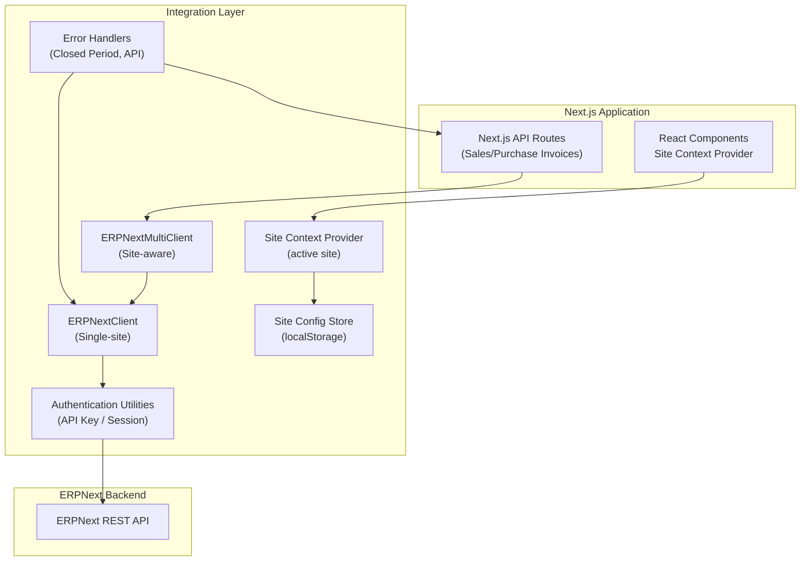
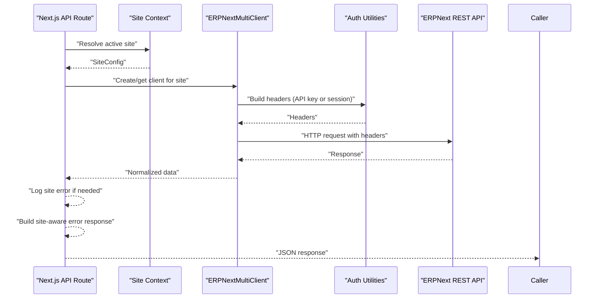
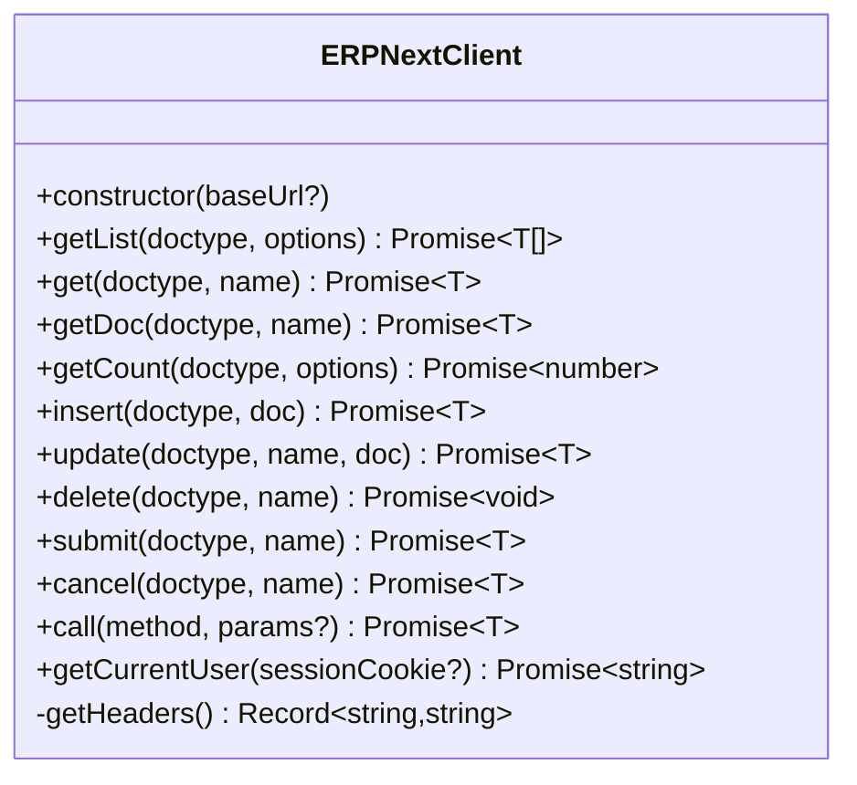
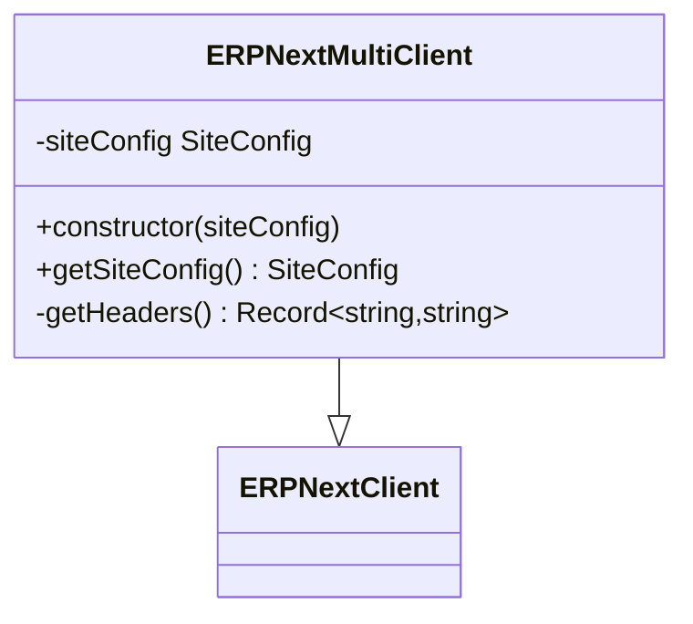
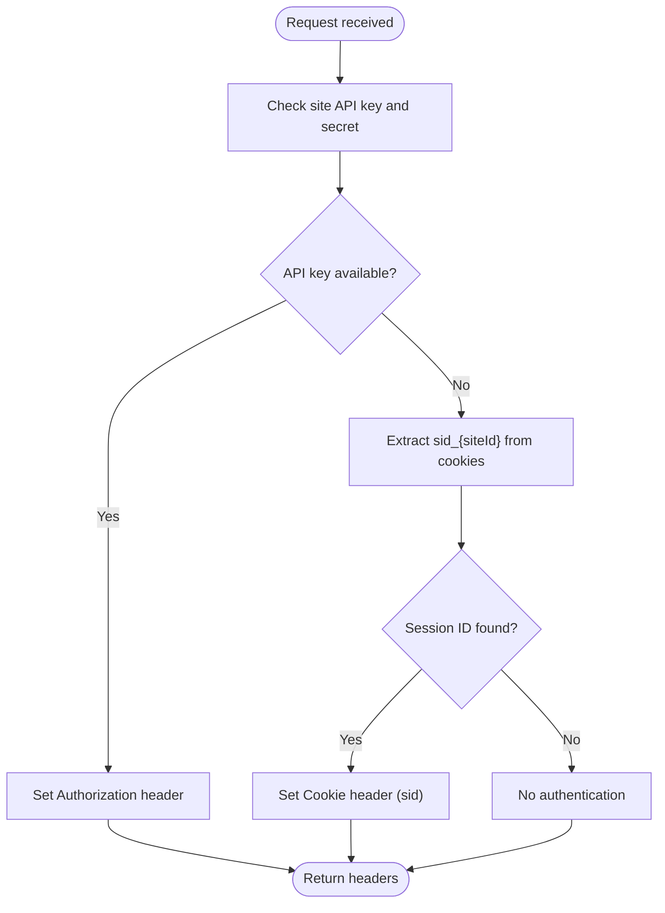
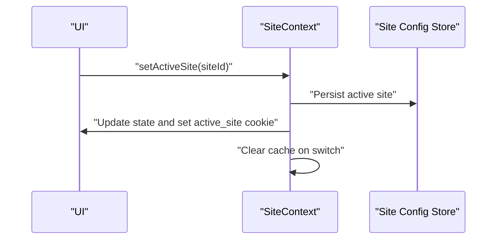
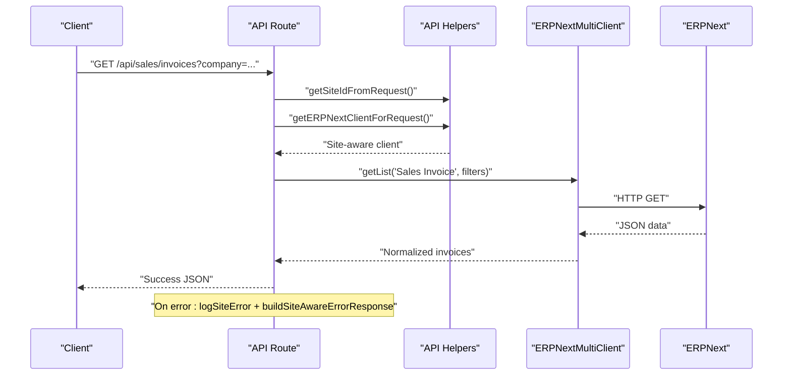
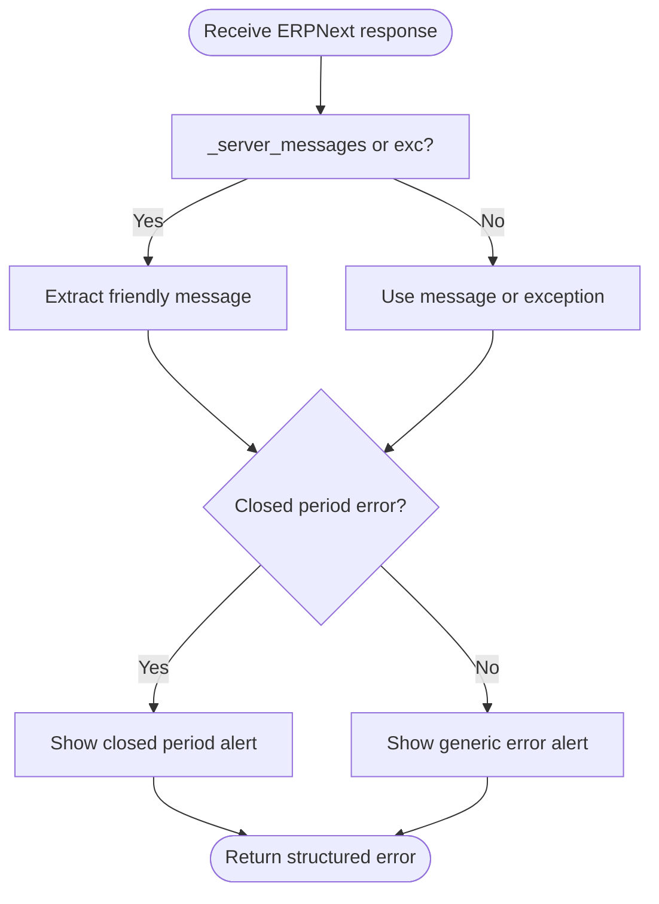
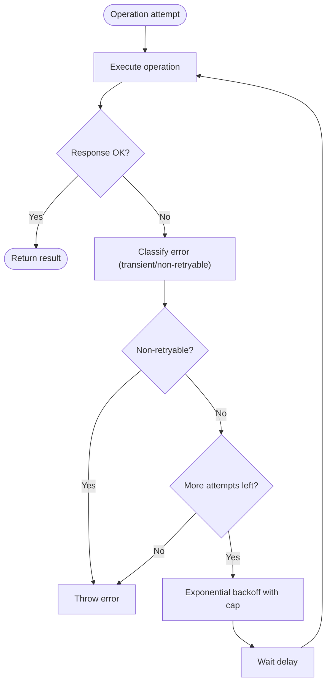
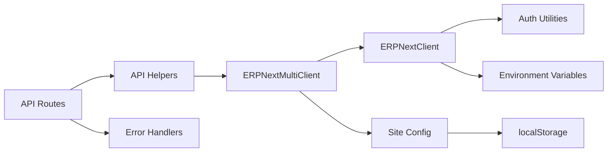

# API Integration Layer

<cite>
**Referenced Files in This Document**
- [erpnext.ts](file://lib/erpnext.ts)
- [erpnext-multi.ts](file://lib/erpnext-multi.ts)
- [use-erpnext-client.ts](file://lib/use-erpnext-client.ts)
- [site-config.ts](file://lib/site-config.ts)
- [site-context.tsx](file://lib/site-context.tsx)
- [erpnext-auth-multi.ts](file://utils/erpnext-auth-multi.ts)
- [report-auth-helper.ts](file://lib/report-auth-helper.ts)
- [erpnext-error-handler.ts](file://utils/erpnext-error-handler.ts)
- [route.ts (Sales Invoices)](file://app/api/sales/invoices/route.ts)
- [route.ts (Purchase Invoices)](file://app/api/purchase/invoices/route.ts)
- [api-helpers.ts](file://lib/api-helpers.ts)
- [account-processor.ts](file://scripts/lib/account-processor.ts)
- [accounting-period-error-handler.ts](file://lib/accounting-period-error-handler.ts)
</cite>

## Table of Contents
1. [Introduction](#introduction)
2. [Project Structure](#project-structure)
3. [Core Components](#core-components)
4. [Architecture Overview](#architecture-overview)
5. [Detailed Component Analysis](#detailed-component-analysis)
6. [Dependency Analysis](#dependency-analysis)
7. [Performance Considerations](#performance-considerations)
8. [Troubleshooting Guide](#troubleshooting-guide)
9. [Conclusion](#conclusion)
10. [Appendices](#appendices)

## Introduction
This document describes the API Integration Layer that connects the Next.js application to ERPNext’s REST API. It covers the unified client implementation, authentication and authorization mechanisms (API key and session-based), site-aware routing, error handling strategies, and retry logic. It also explains how Next.js API routes integrate with ERPNext, including request/response handling patterns, security considerations, rate limiting, and performance optimization techniques.

## Project Structure
The integration layer is organized around:
- A core ERPNext client with CRUD and method invocation capabilities
- A multi-site client that routes requests to the active site with site-specific credentials
- Utilities for authentication, error handling, and site configuration/context
- Next.js API routes that wrap ERPNext operations with consistent error handling and site awareness

**Diagram sources**
- [erpnext.ts](file://lib/erpnext.ts#L18-L321)
- [erpnext-multi.ts](file://lib/erpnext-multi.ts#L24-L69)
- [erpnext-auth-multi.ts](file://utils/erpnext-auth-multi.ts#L54-L98)
- [site-config.ts](file://lib/site-config.ts#L97-L172)
- [site-context.tsx](file://lib/site-context.tsx#L59-L336)
- [route.ts (Sales Invoices)](file://app/api/sales/invoices/route.ts#L1-L111)
- [route.ts (Purchase Invoices)](file://app/api/purchase/invoices/route.ts#L10-L213)

**Section sources**
- [erpnext.ts](file://lib/erpnext.ts#L1-L345)
- [erpnext-multi.ts](file://lib/erpnext-multi.ts#L1-L93)
- [erpnext-auth-multi.ts](file://utils/erpnext-auth-multi.ts#L1-L279)
- [site-config.ts](file://lib/site-config.ts#L1-L322)
- [site-context.tsx](file://lib/site-context.tsx#L1-L353)
- [route.ts (Sales Invoices)](file://app/api/sales/invoices/route.ts#L1-L362)
- [route.ts (Purchase Invoices)](file://app/api/purchase/invoices/route.ts#L1-L457)

## Core Components
- ERPNextClient: Single-site client providing CRUD and method calls to ERPNext REST API. It constructs URLs, sets authentication headers, and parses responses.
- ERPNextMultiClient: Extends ERPNextClient to be site-aware, selecting the correct API URL and authentication method per site.
- Authentication Utilities: Provide site-specific authentication headers, session cookie management, and helpers for dual-authentication support.
- Site Configuration and Context: Persist and manage multiple sites, validate connections, and maintain the active site across the app lifecycle.
- API Routes: Wrap ERPNext operations with consistent request parsing, validation, error logging, and standardized response/error handling.
- Error Handlers: Extract user-friendly messages, detect closed accounting period errors, and provide actionable alerts.

**Section sources**
- [erpnext.ts](file://lib/erpnext.ts#L18-L321)
- [erpnext-multi.ts](file://lib/erpnext-multi.ts#L24-L69)
- [erpnext-auth-multi.ts](file://utils/erpnext-auth-multi.ts#L54-L98)
- [site-config.ts](file://lib/site-config.ts#L97-L172)
- [site-context.tsx](file://lib/site-context.tsx#L59-L184)
- [route.ts (Sales Invoices)](file://app/api/sales/invoices/route.ts#L11-L111)
- [route.ts (Purchase Invoices)](file://app/api/purchase/invoices/route.ts#L10-L213)
- [erpnext-error-handler.ts](file://utils/erpnext-error-handler.ts#L11-L185)

## Architecture Overview
The integration follows a layered approach:
- UI and API routes depend on the Site Context to resolve the active site
- API routes obtain a site-aware client and delegate to ERPNextMultiClient
- ERPNextMultiClient delegates authentication to authentication utilities
- Authentication utilities choose API key or session cookie per site
- Responses are normalized and errors are handled consistently

**Diagram sources**
- [route.ts (Sales Invoices)](file://app/api/sales/invoices/route.ts#L58-L110)
- [route.ts (Purchase Invoices)](file://app/api/purchase/invoices/route.ts#L23-L212)
- [erpnext-multi.ts](file://lib/erpnext-multi.ts#L24-L69)
- [erpnext-auth-multi.ts](file://utils/erpnext-auth-multi.ts#L54-L98)

## Detailed Component Analysis

### ERPNext Client Implementation
- Responsibilities:
  - Build resource URLs and query parameters
  - Manage authentication headers (API key or session)
  - Perform GET, POST, PUT, DELETE, COUNT, SUBMIT, CANCEL, and custom method calls
  - Normalize responses and propagate user-friendly errors
- Key behaviors:
  - URL encoding for doctype and name parameters
  - Content-type validation for JSON responses
  - Special handling for submit/cancel with retry logic for timestamp mismatches
  - getCurrentUser supports session-based user resolution

**Diagram sources**
- [erpnext.ts](file://lib/erpnext.ts#L18-L321)

**Section sources**
- [erpnext.ts](file://lib/erpnext.ts#L18-L321)

### Multi-Site Client and Site-Aware Routing
- ERPNextMultiClient extends ERPNextClient to:
  - Accept a SiteConfig and pass the site’s API URL to the parent
  - Override getHeaders to use site-specific authentication (API key preferred)
- Site isolation:
  - Uses site-specific session cookie naming (sid_{siteId})
  - Ensures credentials and sessions are isolated per site

**Diagram sources**
- [erpnext-multi.ts](file://lib/erpnext-multi.ts#L24-L69)

**Section sources**
- [erpnext-multi.ts](file://lib/erpnext-multi.ts#L24-L69)
- [erpnext-auth-multi.ts](file://utils/erpnext-auth-multi.ts#L54-L98)

### Authentication and Authorization Mechanisms
- Dual authentication support:
  - API key authentication (primary) using site credentials
  - Session-based authentication (fallback) using site-prefixed cookies
- Session cookie strategy:
  - Cookie naming: sid_{siteId}
  - Scoped to the application domain
  - Independent per site to prevent cross-site session leakage
- Helpers:
  - makeErpHeaders: construct headers from SiteConfig
  - getErpAuthHeaders: combine request and SiteConfig for headers
  - isAuthenticated/isAuthenticatedForSite: guards for site-specific sessions
  - Cookie management: setSessionCookie, clearSessionCookie, clearAllSessionCookies

**Diagram sources**
- [erpnext-auth-multi.ts](file://utils/erpnext-auth-multi.ts#L54-L98)

**Section sources**
- [erpnext-auth-multi.ts](file://utils/erpnext-auth-multi.ts#L54-L98)
- [report-auth-helper.ts](file://lib/report-auth-helper.ts#L7-L20)

### Site Configuration and Context
- SiteConfig store:
  - Load/save sites to/from localStorage
  - Validate and persist site configurations
  - Validate site connection via a server-side proxy
- SiteContext provider:
  - Manages active site state and persistence
  - Clears caches on site switch to prevent data leakage
  - Sets active_site cookie for API routes
- Default demo site provisioning and migration handling

**Diagram sources**
- [site-context.tsx](file://lib/site-context.tsx#L152-L184)
- [site-config.ts](file://lib/site-config.ts#L97-L172)

**Section sources**
- [site-context.tsx](file://lib/site-context.tsx#L59-L336)
- [site-config.ts](file://lib/site-config.ts#L97-L281)

### Next.js API Routes: Unified Integration Pattern
- Request parsing:
  - Extract query parameters and company filters
  - Build filters array dynamically
- Client usage:
  - Obtain site-aware client via request and site context
  - Use getList/getDoc/insert/update/call methods
- Response normalization:
  - Return standardized success objects with data and counts
- Error handling:
  - Centralized logging and site-aware error response construction
  - Use of error handlers for user-friendly messaging

**Diagram sources**
- [route.ts (Sales Invoices)](file://app/api/sales/invoices/route.ts#L11-L111)
- [route.ts (Purchase Invoices)](file://app/api/purchase/invoices/route.ts#L10-L213)
- [api-helpers.ts](file://lib/api-helpers.ts)

**Section sources**
- [route.ts (Sales Invoices)](file://app/api/sales/invoices/route.ts#L11-L111)
- [route.ts (Purchase Invoices)](file://app/api/purchase/invoices/route.ts#L10-L213)

### Error Handling Strategies
- Closed accounting period detection:
  - Detect keywords indicating closed period errors
  - Provide localized, actionable alerts
- API error extraction:
  - Prioritize server messages, exception details, and message fields
- API response handling:
  - Validate response.ok, extract user-friendly messages, and optionally throw

**Diagram sources**
- [erpnext-error-handler.ts](file://utils/erpnext-error-handler.ts#L11-L143)

**Section sources**
- [erpnext-error-handler.ts](file://utils/erpnext-error-handler.ts#L11-L185)

### Retry Logic Implementation
- Transient error retries:
  - Exponential backoff with capped delays
  - Non-retryable errors (e.g., validation) short-circuit
  - On retry, invoke optional onRetry callback and sleep
- Specific to accounting operations:
  - Submit/cancel operations retry on timestamp mismatch
  - Up to a fixed number of attempts with incremental backoff

**Diagram sources**
- [accounting-period-error-handler.ts](file://lib/accounting-period-error-handler.ts#L357-L380)
- [account-processor.ts](file://scripts/lib/account-processor.ts#L619-L652)

**Section sources**
- [accounting-period-error-handler.ts](file://lib/accounting-period-error-handler.ts#L357-L380)
- [account-processor.ts](file://scripts/lib/account-processor.ts#L619-L652)

### Practical Examples: API Route Development
- Sales Invoices:
  - GET: Build filters from query params, fetch list with fields, compute total records, normalize defaults for backward compatibility
  - POST: Validate discounts, fetch tax templates and accounts, prepare payload, insert via client, update cache to prevent “not saved” status
- Purchase Invoices:
  - GET: Support single document fetch with company verification, list fetch with filters, transform items and supplier address
  - POST: Validate discounts, fetch default price list from company, prepare payload with tax and discount fields, insert via client
  - PUT: Update invoice with validated fields and items

**Section sources**
- [route.ts (Sales Invoices)](file://app/api/sales/invoices/route.ts#L11-L362)
- [route.ts (Purchase Invoices)](file://app/api/purchase/invoices/route.ts#L10-L457)

## Dependency Analysis
- ERPNextClient depends on:
  - Environment variables for API URL and credentials
  - Authentication utilities for headers
- ERPNextMultiClient depends on:
  - SiteConfig for API URL and credentials
  - Authentication utilities for site-specific headers
- API routes depend on:
  - Site context and helpers to obtain site-aware clients
  - Error handlers for consistent error responses
- Site configuration depends on:
  - localStorage for persistence
  - Environment variables for initial migration

**Diagram sources**
- [erpnext.ts](file://lib/erpnext.ts#L18-L321)
- [erpnext-multi.ts](file://lib/erpnext-multi.ts#L24-L69)
- [erpnext-auth-multi.ts](file://utils/erpnext-auth-multi.ts#L54-L98)
- [site-config.ts](file://lib/site-config.ts#L97-L172)
- [route.ts (Sales Invoices)](file://app/api/sales/invoices/route.ts#L11-L111)
- [route.ts (Purchase Invoices)](file://app/api/purchase/invoices/route.ts#L10-L213)

**Section sources**
- [erpnext.ts](file://lib/erpnext.ts#L18-L321)
- [erpnext-multi.ts](file://lib/erpnext-multi.ts#L24-L69)
- [erpnext-auth-multi.ts](file://utils/erpnext-auth-multi.ts#L54-L98)
- [site-config.ts](file://lib/site-config.ts#L97-L172)
- [route.ts (Sales Invoices)](file://app/api/sales/invoices/route.ts#L11-L111)
- [route.ts (Purchase Invoices)](file://app/api/purchase/invoices/route.ts#L10-L213)

## Performance Considerations
- Minimize round-trips:
  - Use getList with appropriate fields and filters
  - Prefer batch operations where possible
- Efficient pagination:
  - Use limit_page_length and start parameters
  - Compute total records with getCount
- Caching:
  - Clear caches on site switch to avoid stale data
  - Update cache after insert/update to keep UI in sync
- Network resilience:
  - Implement exponential backoff for transient errors
  - Avoid retrying validation or client errors

[No sources needed since this section provides general guidance]

## Troubleshooting Guide
- Authentication failures:
  - Verify API key and secret are configured for the active site
  - Ensure site-prefixed session cookie (sid_{siteId}) is present
  - Use isAuthenticatedForSite to validate authentication
- Site switching issues:
  - Confirm active_site cookie is set and localStorage persists active site
  - Clear all session cookies if logout affects other sites unexpectedly
- Closed period errors:
  - Adjust posting date to an open period
  - Use closed period detection utilities to surface actionable alerts
- API connectivity:
  - Validate site connection via server-side proxy
  - Check environment variables and site URL format
- Error logging:
  - Use site-aware error logging and buildSiteAwareErrorResponse for consistent diagnostics

**Section sources**
- [erpnext-auth-multi.ts](file://utils/erpnext-auth-multi.ts#L109-L134)
- [site-context.tsx](file://lib/site-context.tsx#L152-L184)
- [erpnext-error-handler.ts](file://utils/erpnext-error-handler.ts#L75-L99)
- [site-config.ts](file://lib/site-config.ts#L253-L281)

## Conclusion
The API Integration Layer provides a robust, site-aware, and secure bridge between Next.js and ERPNext. It standardizes authentication, error handling, and request/response patterns while supporting multi-site environments. By leveraging the multi-client architecture, authentication utilities, and centralized error handling, developers can implement reliable integrations with minimal duplication and strong operational safeguards.

[No sources needed since this section summarizes without analyzing specific files]

## Appendices

### Security Considerations
- Prefer API key authentication for admin-level access and consistent permissions
- Isolate session cookies per site using sid_{siteId}
- Enforce role-based access in the frontend and rely on API key for backend operations
- Sanitize inputs and validate tax templates/accounts before sending to ERPNext

[No sources needed since this section provides general guidance]

### Rate Limiting and Resilience
- Implement exponential backoff for transient failures
- Avoid retrying validation or client-side errors
- Monitor closed period and other business rule violations with user-friendly alerts

[No sources needed since this section provides general guidance]