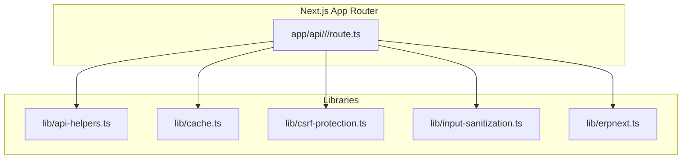
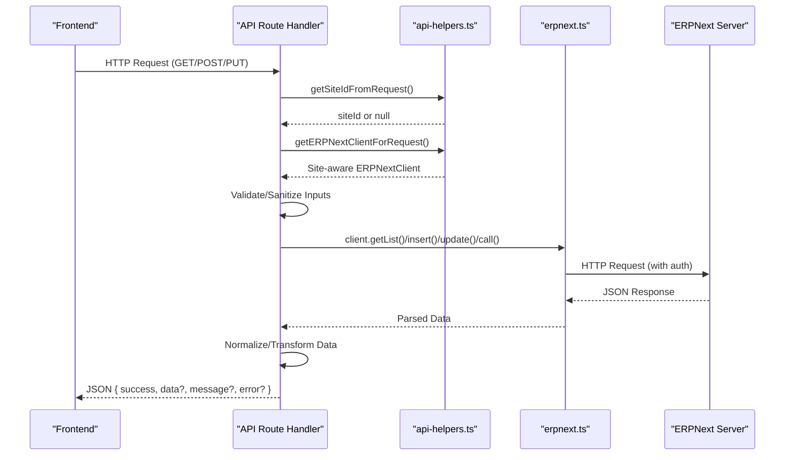
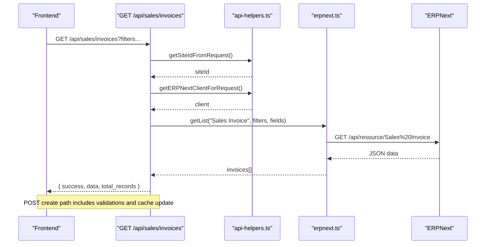
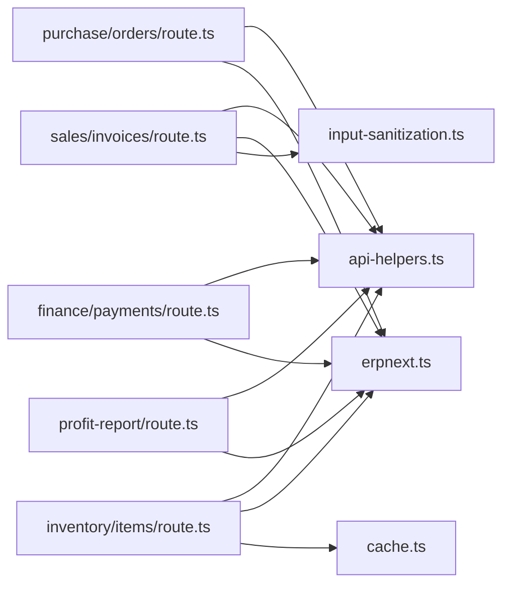

# API Route Development

<cite>
**Referenced Files in This Document**
- [app/api/README.md](file://app/api/README.md)
- [lib/api-helpers.ts](file://lib/api-helpers.ts)
- [lib/cache.ts](file://lib/cache.ts)
- [lib/csrf-protection.ts](file://lib/csrf-protection.ts)
- [lib/input-sanitization.ts](file://lib/input-sanitization.ts)
- [lib/erpnext.ts](file://lib/erpnext.ts)
- [app/api/profit-report/route.ts](file://app/api/profit-report/route.ts)
- [app/api/sales/invoices/route.ts](file://app/api/sales/invoices/route.ts)
- [app/api/purchase/orders/route.ts](file://app/api/purchase/orders/route.ts)
- [app/api/inventory/items/route.ts](file://app/api/inventory/items/route.ts)
- [app/api/finance/payments/route.ts](file://app/api/finance/payments/route.ts)
</cite>

## Table of Contents
1. [Introduction](#introduction)
2. [Project Structure](#project-structure)
3. [Core Components](#core-components)
4. [Architecture Overview](#architecture-overview)
5. [Detailed Component Analysis](#detailed-component-analysis)
6. [Dependency Analysis](#dependency-analysis)
7. [Performance Considerations](#performance-considerations)
8. [Security and Compliance](#security-and-compliance)
9. [Testing Strategies](#testing-strategies)
10. [Troubleshooting Guide](#troubleshooting-guide)
11. [Conclusion](#conclusion)

## Introduction
This document explains the API Route Development patterns used in the Next.js App Router within this ERPNext-based system. It covers route structure, request/response handling, middleware integration, helper utilities, error handling, caching, and security controls. It also details development patterns for accounting, finance, inventory, and HR-related operations, along with practical examples, parameter validation, response formatting, and best practices for organization, testing, and performance.

## Project Structure
The API routes are organized under app/api by functional domain:
- Sales, Purchase, Inventory, Finance, Setup, Utils, and Debug areas
- Each route file exports GET/POST/PUT handlers aligned with CRUD and workflow actions
- Shared helpers and clients reside in lib for multi-site support, caching, CSRF, input sanitization, and ERPNext connectivity

**Diagram sources**
- [app/api/README.md](file://app/api/README.md#L1-L298)
- [lib/api-helpers.ts](file://lib/api-helpers.ts#L1-L186)
- [lib/cache.ts](file://lib/cache.ts#L1-L95)
- [lib/csrf-protection.ts](file://lib/csrf-protection.ts#L1-L238)
- [lib/input-sanitization.ts](file://lib/input-sanitization.ts#L1-L280)
- [lib/erpnext.ts](file://lib/erpnext.ts#L1-L345)

**Section sources**
- [app/api/README.md](file://app/api/README.md#L1-L298)

## Core Components
- Site-aware client selection and error building: extract site context from headers/cookies, choose multi-site or legacy client, and produce structured error responses with site context
- In-memory cache: TTL-based cache for frequently accessed data (tax templates, items, customers, suppliers, warehouses, payment terms)
- CSRF protection: detection of API Key vs session auth, optional CSRF token addition and validation for session-based flows
- Input sanitization: robust sanitization utilities for strings, objects, emails, URLs, dates, booleans, arrays, and SQL-like inputs
- ERPNext client: unified client with list/get/count/insert/update/delete/submit/cancel/call methods and retry logic for timestamp mismatches

**Section sources**
- [lib/api-helpers.ts](file://lib/api-helpers.ts#L1-L186)
- [lib/cache.ts](file://lib/cache.ts#L1-L95)
- [lib/csrf-protection.ts](file://lib/csrf-protection.ts#L1-L238)
- [lib/input-sanitization.ts](file://lib/input-sanitization.ts#L1-L280)
- [lib/erpnext.ts](file://lib/erpnext.ts#L1-L345)

## Architecture Overview
The API routes follow a consistent pattern:
- Extract site context from request
- Obtain a site-aware ERPNext client
- Validate and sanitize inputs
- Call ERPNext client methods
- Normalize or transform responses
- Return standardized success/error responses with site context and logging

**Diagram sources**
- [app/api/profit-report/route.ts](file://app/api/profit-report/route.ts#L1-L57)
- [lib/api-helpers.ts](file://lib/api-helpers.ts#L1-L186)
- [lib/erpnext.ts](file://lib/erpnext.ts#L1-L345)

## Detailed Component Analysis

### Sales Invoices API
- Purpose: List and create Sales Invoices with validation and tax template checks
- Key behaviors:
  - Query parameter filtering (company, search, documentNumber, status, date range)
  - Backward compatibility defaults for discount/tax fields
  - Tax template existence and account head validation against Chart of Accounts
  - Pre-population of HPP snapshot and financial cost percent for items
  - Post-create cache update to resolve “not saved” status artifacts
- Response format: standardized success/error envelope with total_records for listing

**Diagram sources**
- [app/api/sales/invoices/route.ts](file://app/api/sales/invoices/route.ts#L1-L362)
- [lib/api-helpers.ts](file://lib/api-helpers.ts#L1-L186)
- [lib/erpnext.ts](file://lib/erpnext.ts#L1-L345)

**Section sources**
- [app/api/sales/invoices/route.ts](file://app/api/sales/invoices/route.ts#L1-L362)

### Purchase Orders API
- Purpose: List Purchase Orders with flexible status mapping and pagination
- Key behaviors:
  - Filters for company, status, search, documentNumber, date range
  - Status-to-docstatus mapping for ERPNext workflow states
  - Field selection and ordering
  - Count aggregation via get_count
- Response format: standardized envelope with total_records

**Section sources**
- [app/api/purchase/orders/route.ts](file://app/api/purchase/orders/route.ts#L1-L190)

### Inventory Items API
- Purpose: List, create, and update Items with automatic item code generation and price list synchronization
- Key behaviors:
  - Backward-compatible parameter names (limit_page_length vs limit)
  - Dynamic fields selection with defaults
  - Two-phase counting and data retrieval for pagination
  - Automatic item code generation for new items
  - Price list updates for purchase/sale rates when provided
- Response format: standardized envelope with total_records

**Section sources**
- [app/api/inventory/items/route.ts](file://app/api/inventory/items/route.ts#L1-L392)

### Finance Payments API
- Purpose: List, create, and update Payment Entries with required field validation and amount checks
- Key behaviors:
  - Flexible filters (party, status, payment type, mode of payment, date range)
  - Required fields enforcement (company, payment_type, party_type, party, posting_date, mode_of_payment)
  - Amount validation based on payment type
  - Payload normalization for ERPNext
- Response format: standardized envelope

**Section sources**
- [app/api/finance/payments/route.ts](file://app/api/finance/payments/route.ts#L1-L204)

### Profit Report API
- Purpose: Compute profit report via ERPNext method and normalize results
- Key behaviors:
  - Session-based auth via sid cookie
  - Parameter validation (from_date, to_date)
  - Normalization of raw report data
  - Structured error logging and response

**Section sources**
- [app/api/profit-report/route.ts](file://app/api/profit-report/route.ts#L1-L57)

## Dependency Analysis
- Routes depend on:
  - Site extraction and client selection (api-helpers)
  - ERPNext client for all persistence operations (erpnext)
  - Optional caching for read-heavy endpoints (cache)
  - CSRF protection utilities for session-based flows (csrf-protection)
  - Input sanitization for request bodies and query parameters (input-sanitization)

**Diagram sources**
- [app/api/sales/invoices/route.ts](file://app/api/sales/invoices/route.ts#L1-L362)
- [app/api/purchase/orders/route.ts](file://app/api/purchase/orders/route.ts#L1-L190)
- [app/api/inventory/items/route.ts](file://app/api/inventory/items/route.ts#L1-L392)
- [app/api/finance/payments/route.ts](file://app/api/finance/payments/route.ts#L1-L204)
- [app/api/profit-report/route.ts](file://app/api/profit-report/route.ts#L1-L57)
- [lib/api-helpers.ts](file://lib/api-helpers.ts#L1-L186)
- [lib/erpnext.ts](file://lib/erpnext.ts#L1-L345)
- [lib/cache.ts](file://lib/cache.ts#L1-L95)
- [lib/input-sanitization.ts](file://lib/input-sanitization.ts#L1-L280)

**Section sources**
- [lib/api-helpers.ts](file://lib/api-helpers.ts#L1-L186)
- [lib/erpnext.ts](file://lib/erpnext.ts#L1-L345)
- [lib/cache.ts](file://lib/cache.ts#L1-L95)
- [lib/csrf-protection.ts](file://lib/csrf-protection.ts#L1-L238)
- [lib/input-sanitization.ts](file://lib/input-sanitization.ts#L1-L280)

## Performance Considerations
- Prefer site-aware client selection to minimize cross-site latency
- Use caching for read-heavy endpoints:
  - taxTemplateCache, paymentTermsCache, warehouseCache, itemCache, customerCache, supplierCache
- Optimize list endpoints with:
  - Minimal fields selection
  - Efficient filters and ordering
  - Pagination with appropriate limits
- Retry logic for submit/cancel operations to mitigate timestamp mismatches
- Avoid unnecessary transformations; normalize data close to the source

[No sources needed since this section provides general guidance]

## Security and Compliance
- Authentication:
  - API Key authentication is preferred and CSRF-immune
  - Session-based authentication requires CSRF tokens for state-changing requests
- CSRF protection:
  - Detects auth method and conditionally validates CSRF token presence
  - Adds CSRF token to headers when needed
- Input sanitization:
  - Sanitize strings, objects, emails, URLs, dates, booleans, arrays
  - Prevents XSS and basic injection attempts
- Rate limiting and pagination:
  - Follow documented limits and pagination parameters
- Error handling:
  - Structured error responses with site context and classification
  - Centralized logging with siteId for troubleshooting

**Section sources**
- [app/api/README.md](file://app/api/README.md#L157-L206)
- [lib/csrf-protection.ts](file://lib/csrf-protection.ts#L1-L238)
- [lib/input-sanitization.ts](file://lib/input-sanitization.ts#L1-L280)
- [lib/api-helpers.ts](file://lib/api-helpers.ts#L105-L186)

## Testing Strategies
- Unit tests for helpers and utilities:
  - Cache behavior, sanitization rules, CSRF detection
- Integration tests for routes:
  - Parameter preservation, pagination, query parameter handling
  - Success and error response formats
  - Multi-site and session/site cookie flows
- End-to-end tests:
  - Business logic preservation for purchase/sales flows
  - Child table handling and cache updates
- Security tests:
  - CSRF protection validation
  - Input sanitization coverage

**Section sources**
- [app/api/README.md](file://app/api/README.md#L120-L136)

## Troubleshooting Guide
- Site-aware errors:
  - Use siteId in error responses and logs for precise debugging
- Network/authentication/configuration errors:
  - Error classification and contextual messages aid quick diagnosis
- Cache-related issues:
  - Invalidate specific keys or clear caches when data divergence occurs
- CSRF failures:
  - Ensure X-Frappe-CSRF-Token header for session-based state-changing requests
- Timestamp mismatch during submit/cancel:
  - Leverage built-in retries with incremental backoff

**Section sources**
- [lib/api-helpers.ts](file://lib/api-helpers.ts#L105-L186)
- [lib/cache.ts](file://lib/cache.ts#L1-L95)
- [lib/csrf-protection.ts](file://lib/csrf-protection.ts#L176-L238)
- [lib/erpnext.ts](file://lib/erpnext.ts#L188-L277)

## Conclusion
The API route development in this system emphasizes consistency, safety, and scalability:
- Unified site-aware client and standardized error handling
- Robust input sanitization and CSRF protection
- Practical caching for performance
- Clear patterns for listing, validation, creation, and updates across domains
Adhering to these patterns ensures reliable integrations with ERPNext and a maintainable API surface.