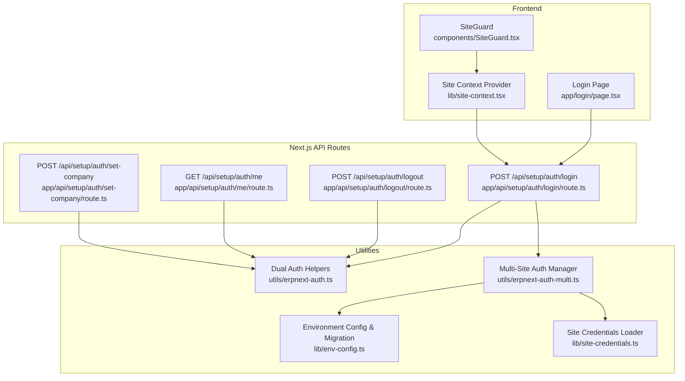
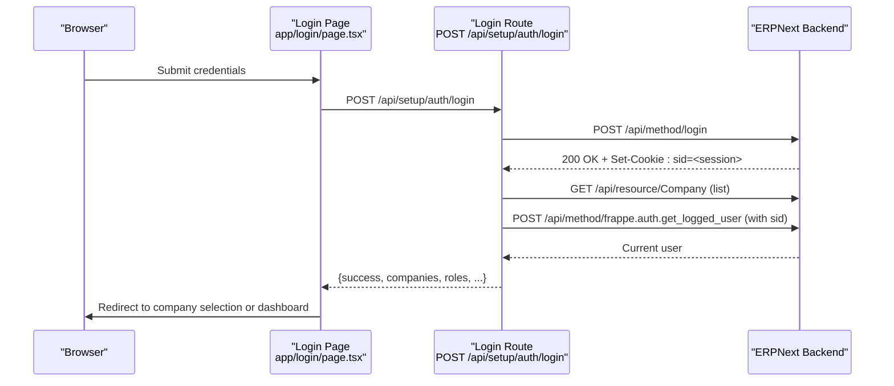
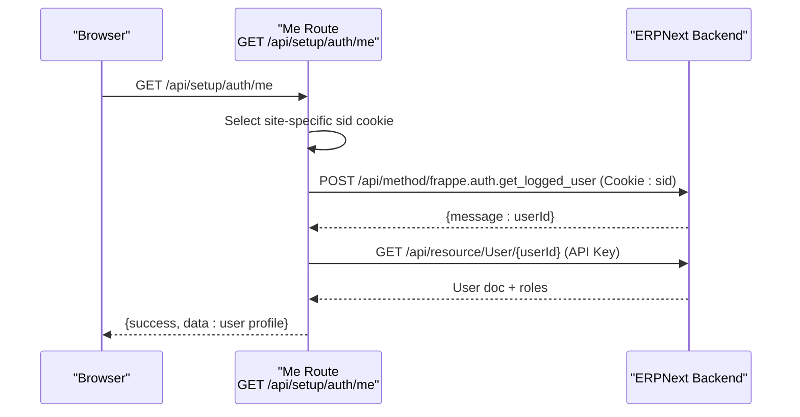
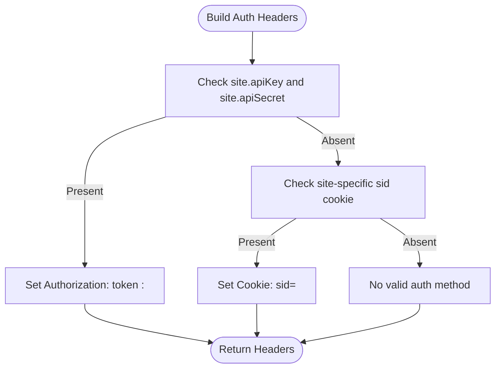
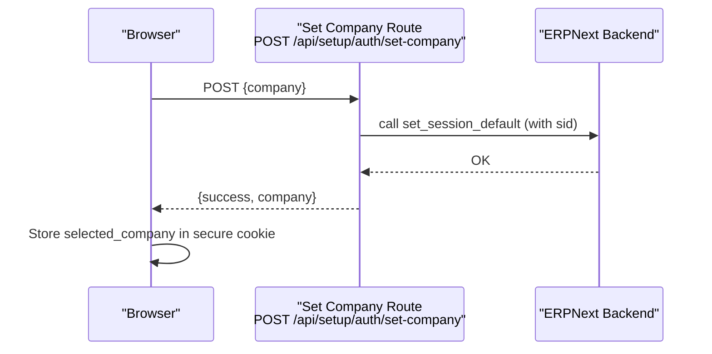
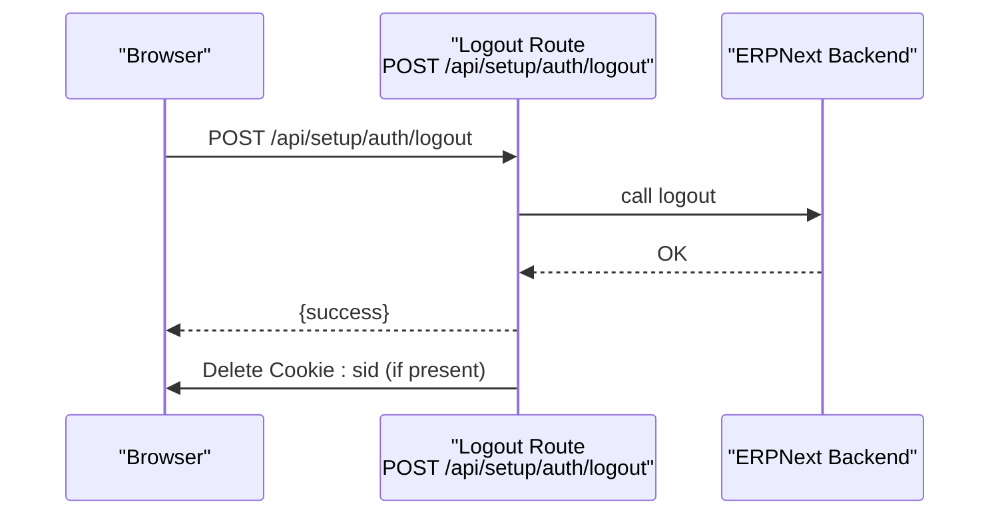
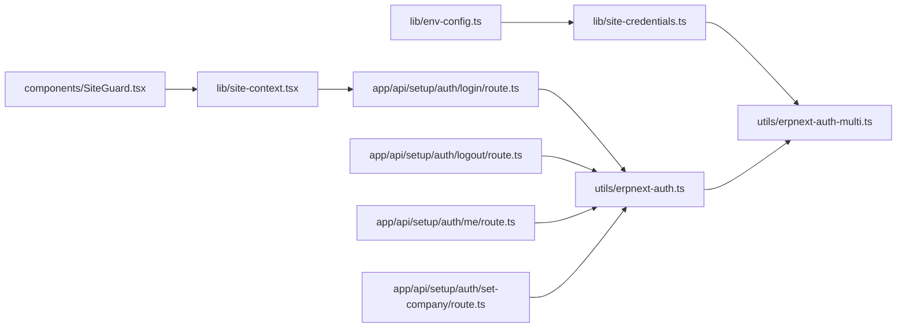

# Authentication and Authorization

<cite>
**Referenced Files in This Document**
- [utils/erpnext-auth.ts](file://utils/erpnext-auth.ts)
- [utils/erpnext-auth-multi.ts](file://utils/erpnext-auth-multi.ts)
- [app/api/setup/auth/login/route.ts](file://app/api/setup/auth/login/route.ts)
- [app/api/setup/auth/logout/route.ts](file://app/api/setup/auth/logout/route.ts)
- [app/api/setup/auth/me/route.ts](file://app/api/setup/auth/me/route.ts)
- [app/api/setup/auth/set-company/route.ts](file://app/api/setup/auth/set-company/route.ts)
- [app/login/page.tsx](file://app/login/page.tsx)
- [components/SiteGuard.tsx](file://components/SiteGuard.tsx)
- [lib/site-context.tsx](file://lib/site-context.tsx)
- [lib/site-credentials.ts](file://lib/site-credentials.ts)
- [lib/env-config.ts](file://lib/env-config.ts)
</cite>

## Table of Contents
1. [Introduction](#introduction)
2. [Project Structure](#project-structure)
3. [Core Components](#core-components)
4. [Architecture Overview](#architecture-overview)
5. [Detailed Component Analysis](#detailed-component-analysis)
6. [Dependency Analysis](#dependency-analysis)
7. [Performance Considerations](#performance-considerations)
8. [Troubleshooting Guide](#troubleshooting-guide)
9. [Conclusion](#conclusion)

## Introduction
This document explains the authentication and authorization mechanisms used by the Next.js frontend and its integration with ERPNext’s backend. It covers:
- Session-based authentication flow and cookie handling
- API key-based authentication for server/admin operations
- Site-aware authorization patterns for multi-site environments
- Authentication header construction, credential management, and multi-site authentication handling
- Login/logout processes, user session management, and company switching
- Practical examples, token validation, and secure credential storage
- Security considerations, rate limiting, and access control patterns
- Relationship between Next.js API routes and ERPNext’s authentication system

## Project Structure
Authentication and authorization logic is implemented across:
- Utilities for constructing authentication headers and managing dual authentication
- Next.js API routes for login, logout, user identity retrieval, and company selection
- Frontend pages and guards for site selection, login, and protected routing
- Site context and credential loaders for multi-site configuration

**Diagram sources**
- [app/login/page.tsx](file://app/login/page.tsx#L1-L202)
- [components/SiteGuard.tsx](file://components/SiteGuard.tsx#L1-L89)
- [lib/site-context.tsx](file://lib/site-context.tsx#L1-L353)
- [app/api/setup/auth/login/route.ts](file://app/api/setup/auth/login/route.ts#L1-L176)
- [app/api/setup/auth/logout/route.ts](file://app/api/setup/auth/logout/route.ts#L1-L39)
- [app/api/setup/auth/me/route.ts](file://app/api/setup/auth/me/route.ts#L1-L96)
- [app/api/setup/auth/set-company/route.ts](file://app/api/setup/auth/set-company/route.ts#L1-L59)
- [utils/erpnext-auth.ts](file://utils/erpnext-auth.ts#L1-L157)
- [utils/erpnext-auth-multi.ts](file://utils/erpnext-auth-multi.ts#L1-L279)
- [lib/env-config.ts](file://lib/env-config.ts#L1-L342)
- [lib/site-credentials.ts](file://lib/site-credentials.ts#L1-L97)

**Section sources**
- [utils/erpnext-auth.ts](file://utils/erpnext-auth.ts#L1-L157)
- [utils/erpnext-auth-multi.ts](file://utils/erpnext-auth-multi.ts#L1-L279)
- [app/api/setup/auth/login/route.ts](file://app/api/setup/auth/login/route.ts#L1-L176)
- [app/api/setup/auth/logout/route.ts](file://app/api/setup/auth/logout/route.ts#L1-L39)
- [app/api/setup/auth/me/route.ts](file://app/api/setup/auth/me/route.ts#L1-L96)
- [app/api/setup/auth/set-company/route.ts](file://app/api/setup/auth/set-company/route.ts#L1-L59)
- [app/login/page.tsx](file://app/login/page.tsx#L1-L202)
- [components/SiteGuard.tsx](file://components/SiteGuard.tsx#L1-L89)
- [lib/site-context.tsx](file://lib/site-context.tsx#L1-L353)
- [lib/env-config.ts](file://lib/env-config.ts#L1-L342)
- [lib/site-credentials.ts](file://lib/site-credentials.ts#L1-L97)

## Core Components
- Dual authentication helpers:
  - Construct Authorization headers using API key or fall back to session cookie
  - Provide utilities for direct API calls and request-scoped header generation
- Multi-site authentication manager:
  - Supports per-site credentials and session cookies
  - Builds site-aware headers and validates authentication per site
- Next.js API routes:
  - Login: authenticates against ERPNext, captures session cookie, returns user info and companies
  - Logout: calls backend logout and clears session cookie
  - Me: resolves current user using session cookie and enriches with roles via API key
  - Set company: sets default company and stores selection in a secure cookie
- Frontend:
  - Login page posts credentials and manages redirects and local storage
  - SiteGuard enforces site selection and authentication before protected routes
  - Site context provider manages active site, persistence, and migration

**Section sources**
- [utils/erpnext-auth.ts](file://utils/erpnext-auth.ts#L28-L78)
- [utils/erpnext-auth-multi.ts](file://utils/erpnext-auth-multi.ts#L34-L98)
- [app/api/setup/auth/login/route.ts](file://app/api/setup/auth/login/route.ts#L9-L176)
- [app/api/setup/auth/logout/route.ts](file://app/api/setup/auth/logout/route.ts#L9-L39)
- [app/api/setup/auth/me/route.ts](file://app/api/setup/auth/me/route.ts#L9-L96)
- [app/api/setup/auth/set-company/route.ts](file://app/api/setup/auth/set-company/route.ts#L9-L59)
- [app/login/page.tsx](file://app/login/page.tsx#L24-L89)
- [components/SiteGuard.tsx](file://components/SiteGuard.tsx#L22-L88)
- [lib/site-context.tsx](file://lib/site-context.tsx#L59-L336)

## Architecture Overview
The system implements a dual authentication strategy:
- Primary: API key authentication for admin/server operations
- Fallback: Session cookie (sid) for user-specific operations and audit trails

Multi-site support:
- Per-site session cookies named with site identifiers
- Site-aware header construction prioritizing API key per site, then site-specific session cookie

**Diagram sources**
- [app/login/page.tsx](file://app/login/page.tsx#L24-L89)
- [app/api/setup/auth/login/route.ts](file://app/api/setup/auth/login/route.ts#L9-L176)

**Section sources**
- [utils/erpnext-auth.ts](file://utils/erpnext-auth.ts#L64-L78)
- [utils/erpnext-auth-multi.ts](file://utils/erpnext-auth-multi.ts#L54-L72)
- [app/api/setup/auth/login/route.ts](file://app/api/setup/auth/login/route.ts#L9-L176)

## Detailed Component Analysis

### Session-Based Authentication Flow
- Login endpoint:
  - Accepts username/email and password
  - Optionally resolves email from username
  - Calls ERPNext login to obtain session cookie
  - Retrieves allowed companies and roles
  - Returns success payload and sets site-specific session cookie
- Identity endpoint:
  - Uses session cookie to call ERPNext’s get_logged_user
  - Fetches user details and roles via API key
- Logout endpoint:
  - Calls backend logout
  - Clears session cookie if present

**Diagram sources**
- [app/api/setup/auth/me/route.ts](file://app/api/setup/auth/me/route.ts#L9-L96)

**Section sources**
- [app/api/setup/auth/login/route.ts](file://app/api/setup/auth/login/route.ts#L9-L176)
- [app/api/setup/auth/me/route.ts](file://app/api/setup/auth/me/route.ts#L9-L96)
- [app/api/setup/auth/logout/route.ts](file://app/api/setup/auth/logout/route.ts#L9-L39)

### API Key-Based Authentication
- Header construction:
  - Authorization: token <key>:<secret>
  - Used for admin/server operations and role retrieval
- Multi-site API key handling:
  - Site-specific credentials resolved from environment variables
  - Headers built per site with priority for API key over session cookie

**Diagram sources**
- [utils/erpnext-auth-multi.ts](file://utils/erpnext-auth-multi.ts#L54-L72)
- [lib/site-credentials.ts](file://lib/site-credentials.ts#L25-L60)

**Section sources**
- [utils/erpnext-auth.ts](file://utils/erpnext-auth.ts#L28-L36)
- [utils/erpnext-auth-multi.ts](file://utils/erpnext-auth-multi.ts#L34-L42)
- [lib/site-credentials.ts](file://lib/site-credentials.ts#L25-L60)

### Site-Aware Authorization Patterns
- Cookie naming:
  - Generic: sid
  - Site-specific: sid_{siteId}
- Authentication priority per site:
  - API key (admin) > session cookie (sid_{siteId})
- Company switching:
  - Sets default company in ERPNext session
  - Stores selected company in a secure cookie for frontend use

**Diagram sources**
- [app/api/setup/auth/set-company/route.ts](file://app/api/setup/auth/set-company/route.ts#L9-L59)

**Section sources**
- [utils/erpnext-auth-multi.ts](file://utils/erpnext-auth-multi.ts#L109-L134)
- [app/api/setup/auth/set-company/route.ts](file://app/api/setup/auth/set-company/route.ts#L9-L59)

### Login/Logout Processes and User Session Management
- Login:
  - Posts credentials to backend login
  - Captures session cookie and persists site-specific cookie
  - Redirects to company selection or dashboard
- Logout:
  - Calls backend logout
  - Clears session cookie if present

**Diagram sources**
- [app/api/setup/auth/logout/route.ts](file://app/api/setup/auth/logout/route.ts#L9-L39)

**Section sources**
- [app/login/page.tsx](file://app/login/page.tsx#L24-L89)
- [app/api/setup/auth/login/route.ts](file://app/api/setup/auth/login/route.ts#L9-L176)
- [app/api/setup/auth/logout/route.ts](file://app/api/setup/auth/logout/route.ts#L9-L39)

### Company Switching Functionality
- After login, if multiple companies are available, the user selects a company
- The selection is stored in a secure cookie and optionally set as ERPNext session default

**Section sources**
- [app/api/setup/auth/set-company/route.ts](file://app/api/setup/auth/set-company/route.ts#L9-L59)
- [app/login/page.tsx](file://app/login/page.tsx#L43-L80)

### Practical Examples
- Authentication setup:
  - Configure environment variables for multi-site credentials
  - Use site-aware header builders to call ERPNext APIs
- Token validation:
  - Use session cookie to call get_logged_user for identity
  - Use API key for admin-level operations requiring role data
- Secure credential storage:
  - Store only site identifiers and session cookies in browser
  - Keep API keys/secrets in environment variables

**Section sources**
- [lib/env-config.ts](file://lib/env-config.ts#L244-L259)
- [lib/site-credentials.ts](file://lib/site-credentials.ts#L25-L60)
- [utils/erpnext-auth-multi.ts](file://utils/erpnext-auth-multi.ts#L54-L72)

### Security Considerations
- Prefer API key for admin operations; use session cookie for user identity
- Use site-specific session cookies to prevent cross-site session leakage
- Set secure, httpOnly, and SameSite attributes on cookies
- Avoid storing secrets in client-side storage; rely on environment variables
- Enforce site selection and authentication guards before protected routes

**Section sources**
- [utils/erpnext-auth-multi.ts](file://utils/erpnext-auth-multi.ts#L167-L190)
- [components/SiteGuard.tsx](file://components/SiteGuard.tsx#L22-L88)
- [lib/site-context.tsx](file://lib/site-context.tsx#L172-L176)

### Rate Limiting and Access Control Patterns
- Rate limiting should be enforced at the ERPNext backend level
- Access control relies on ERPNext roles; frontend can filter UI based on roles
- Use API key for privileged operations and session cookie for user-specific actions

[No sources needed since this section provides general guidance]

## Dependency Analysis
Authentication and authorization depend on:
- Environment configuration and migration utilities for multi-site setup
- Site credentials loader for resolving API keys from environment variables
- Dual authentication helpers for building headers
- Next.js API routes for login, logout, identity, and company selection

**Diagram sources**
- [lib/env-config.ts](file://lib/env-config.ts#L1-L342)
- [lib/site-credentials.ts](file://lib/site-credentials.ts#L1-L97)
- [utils/erpnext-auth-multi.ts](file://utils/erpnext-auth-multi.ts#L1-L279)
- [utils/erpnext-auth.ts](file://utils/erpnext-auth.ts#L1-L157)
- [app/api/setup/auth/login/route.ts](file://app/api/setup/auth/login/route.ts#L1-L176)
- [app/api/setup/auth/logout/route.ts](file://app/api/setup/auth/logout/route.ts#L1-L39)
- [app/api/setup/auth/me/route.ts](file://app/api/setup/auth/me/route.ts#L1-L96)
- [app/api/setup/auth/set-company/route.ts](file://app/api/setup/auth/set-company/route.ts#L1-L59)
- [lib/site-context.tsx](file://lib/site-context.tsx#L1-L353)
- [components/SiteGuard.tsx](file://components/SiteGuard.tsx#L1-L89)

**Section sources**
- [lib/env-config.ts](file://lib/env-config.ts#L1-L342)
- [lib/site-credentials.ts](file://lib/site-credentials.ts#L1-L97)
- [utils/erpnext-auth-multi.ts](file://utils/erpnext-auth-multi.ts#L1-L279)
- [utils/erpnext-auth.ts](file://utils/erpnext-auth.ts#L1-L157)
- [app/api/setup/auth/login/route.ts](file://app/api/setup/auth/login/route.ts#L1-L176)
- [app/api/setup/auth/logout/route.ts](file://app/api/setup/auth/logout/route.ts#L1-L39)
- [app/api/setup/auth/me/route.ts](file://app/api/setup/auth/me/route.ts#L1-L96)
- [app/api/setup/auth/set-company/route.ts](file://app/api/setup/auth/set-company/route.ts#L1-L59)
- [lib/site-context.tsx](file://lib/site-context.tsx#L1-L353)
- [components/SiteGuard.tsx](file://components/SiteGuard.tsx#L1-L89)

## Performance Considerations
- Prefer API key for bulk admin operations to minimize session-dependent round trips
- Cache site configurations and credentials in memory where appropriate
- Minimize cookie size and avoid unnecessary cookie reads/writes

[No sources needed since this section provides general guidance]

## Troubleshooting Guide
Common issues and resolutions:
- Login fails with 401:
  - Verify ERPNext credentials and site configuration
  - Ensure site-specific session cookie is set after login
- Session cookie not recognized:
  - Confirm site selection and active_site cookie
  - Check SameSite and secure flags for cross-origin contexts
- API key authentication blocked:
  - Use site-aware authentication helpers to prioritize API key
  - Ensure environment variables for site credentials are present
- Company selection not applied:
  - Confirm set-company route response and secure cookie presence
  - Verify ERPNext session default setting succeeded

**Section sources**
- [app/api/setup/auth/login/route.ts](file://app/api/setup/auth/login/route.ts#L169-L175)
- [app/api/setup/auth/me/route.ts](file://app/api/setup/auth/me/route.ts#L26-L29)
- [utils/erpnext-auth-multi.ts](file://utils/erpnext-auth-multi.ts#L220-L233)
- [app/api/setup/auth/set-company/route.ts](file://app/api/setup/auth/set-company/route.ts#L52-L57)

## Conclusion
The system combines robust dual authentication (API key and session cookie) with strong multi-site support. By leveraging site-aware headers, secure cookies, and guarded routes, it ensures secure and flexible access to ERPNext resources across multiple sites. Following the outlined patterns and troubleshooting steps will help maintain reliable authentication and authorization in production deployments.