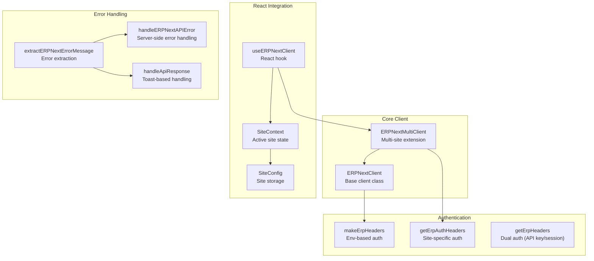
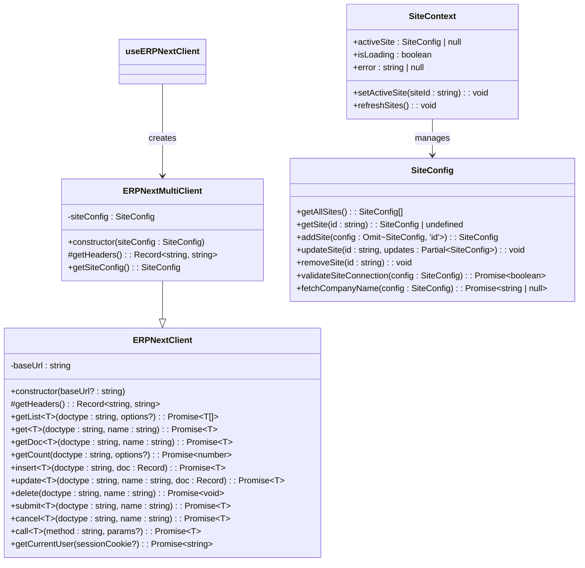
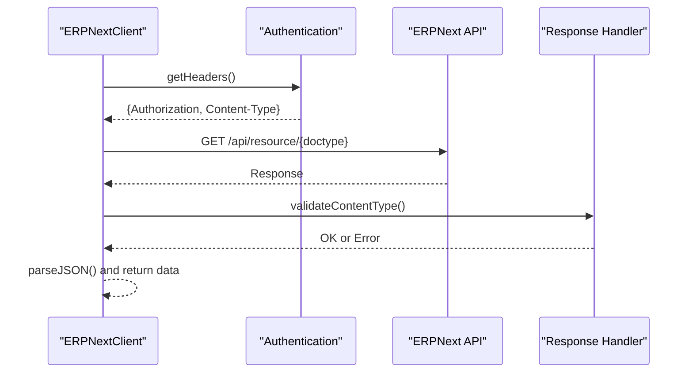
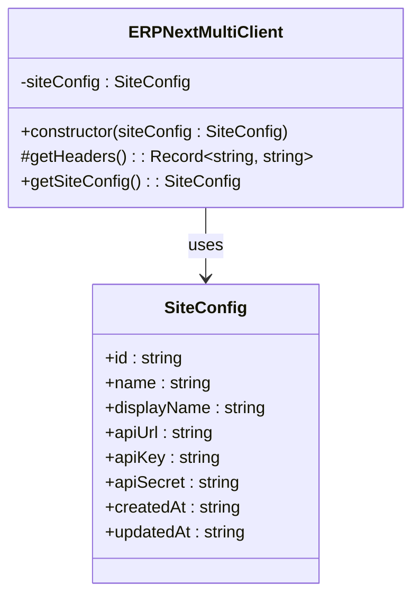
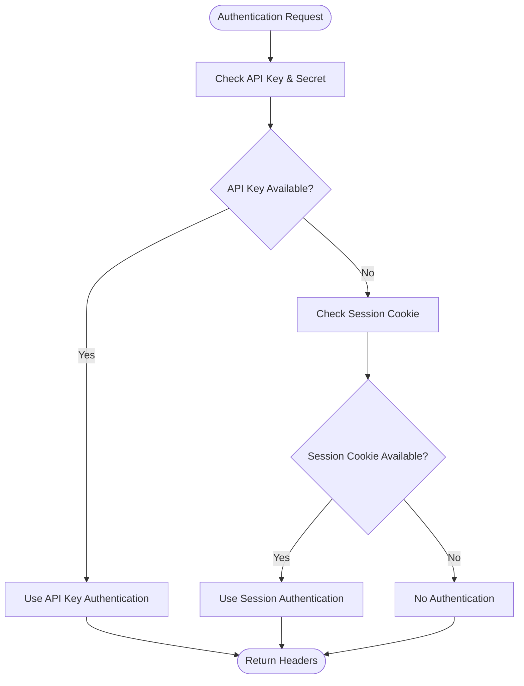
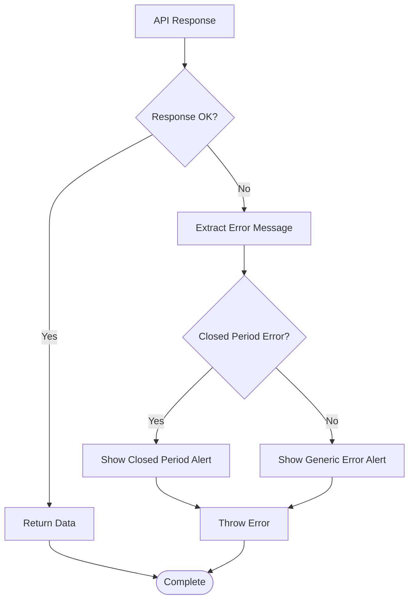
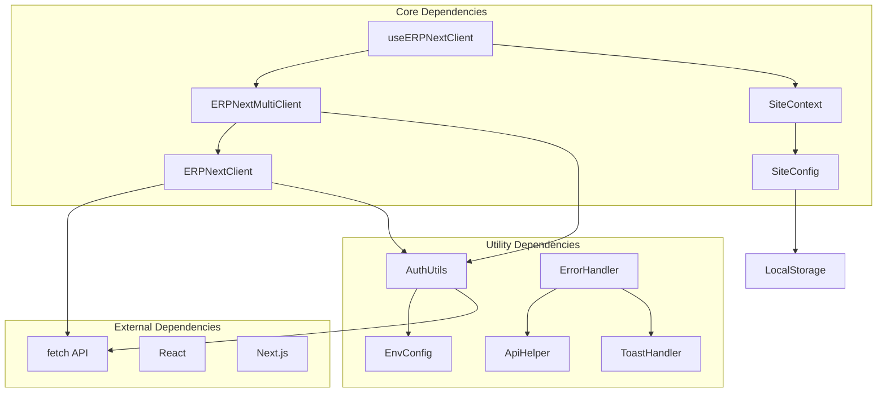

# ERPNext Client Implementation

<cite>
**Referenced Files in This Document**
- [erpnext.ts](file://lib/erpnext.ts)
- [erpnext-multi.ts](file://lib/erpnext-multi.ts)
- [use-erpnext-client.ts](file://lib/use-erpnext-client.ts)
- [erpnext-auth.ts](file://utils/erpnext-auth.ts)
- [erpnext-auth-multi.ts](file://utils/erpnext-auth-multi.ts)
- [erpnext-error-handler.ts](file://utils/erpnext-error-handler.ts)
- [erpnext-api-helper.ts](file://utils/erpnext-api-helper.ts)
- [site-config.ts](file://lib/site-config.ts)
- [site-context.tsx](file://lib/site-context.tsx)
- [backward-compatibility.test.ts](file://tests/backward-compatibility.test.ts)
- [e2e-backward-compatibility.test.ts](file://tests/e2e-backward-compatibility.test.ts)
</cite>

## Table of Contents
1. [Introduction](#introduction)
2. [Project Structure](#project-structure)
3. [Core Components](#core-components)
4. [Architecture Overview](#architecture-overview)
5. [Detailed Component Analysis](#detailed-component-analysis)
6. [Dependency Analysis](#dependency-analysis)
7. [Performance Considerations](#performance-considerations)
8. [Troubleshooting Guide](#troubleshooting-guide)
9. [Conclusion](#conclusion)

## Introduction
This document provides comprehensive documentation for the ERPNext Client Implementation, focusing on the ERPNextClient class architecture, authentication mechanisms, base URL management, CRUD operations, submit/cancel workflows with timestamp handling, custom method invocation, generic type system, parameter validation, error handling patterns, and backward compatibility. It also covers practical examples of client instantiation, API method usage, integration patterns, retry logic for timestamp mismatches, content-type validation, and troubleshooting guidance for common API connectivity issues.

## Project Structure
The ERPNext client implementation is organized around a core client class with multi-site extensions, authentication utilities, error handling helpers, and React integration hooks. The structure supports both single-site and multi-site scenarios with robust authentication fallbacks and consistent error handling.

**Diagram sources**
- [erpnext.ts](file://lib/erpnext.ts#L18-L325)
- [erpnext-multi.ts](file://lib/erpnext-multi.ts#L24-L69)
- [erpnext-auth.ts](file://utils/erpnext-auth.ts#L28-L120)
- [erpnext-auth-multi.ts](file://utils/erpnext-auth-multi.ts#L34-L98)
- [use-erpnext-client.ts](file://lib/use-erpnext-client.ts#L40-L55)
- [site-context.tsx](file://lib/site-context.tsx#L59-L336)
- [site-config.ts](file://lib/site-config.ts#L97-L172)
- [erpnext-error-handler.ts](file://utils/erpnext-error-handler.ts#L11-L70)
- [erpnext-api-helper.ts](file://utils/erpnext-api-helper.ts#L13-L81)

**Section sources**
- [erpnext.ts](file://lib/erpnext.ts#L1-L345)
- [erpnext-multi.ts](file://lib/erpnext-multi.ts#L1-L93)
- [use-erpnext-client.ts](file://lib/use-erpnext-client.ts#L1-L56)

## Core Components
This section details the primary components of the ERPNext client implementation, including the base client, multi-site client, authentication utilities, and error handling mechanisms.

- ERPNextClient: Base client class providing CRUD operations, submit/cancel workflows, custom method invocation, and authentication header management.
- ERPNextMultiClient: Multi-site extension that routes requests to site-specific URLs with appropriate authentication headers.
- Authentication Utilities: Functions for constructing authentication headers using environment variables, session cookies, and site-specific configurations.
- Error Handling Helpers: Utilities for extracting meaningful error messages, handling closed period errors, and providing user-friendly alerts.

Key responsibilities:
- Constructor configuration: Accepts optional base URL override; defaults to environment variable if not provided.
- Authentication header building: Implements dual authentication strategy with API key precedence over session cookies.
- Base URL management: Supports both single-site and multi-site configurations with dynamic URL resolution.
- CRUD operations: getList, get, insert, update, delete with comprehensive parameter validation and error handling.
- Submit/cancel workflows: Includes retry logic for timestamp mismatches with incremental backoff.
- Custom method calling: Provides flexible method invocation with parameter serialization.
- Generic type system: Strong typing for all operations with default unknown type and explicit overrides.
- Parameter validation: URL encoding for resource identifiers and query parameters; content-type validation for responses.
- Error handling patterns: Consistent error extraction, user-friendly alerts, and server-side response handling.

**Section sources**
- [erpnext.ts](file://lib/erpnext.ts#L18-L325)
- [erpnext-auth.ts](file://utils/erpnext-auth.ts#L28-L120)
- [erpnext-auth-multi.ts](file://utils/erpnext-auth-multi.ts#L34-L98)
- [erpnext-error-handler.ts](file://utils/erpnext-error-handler.ts#L11-L70)

## Architecture Overview
The client architecture follows a layered design with clear separation of concerns:
- Core Client Layer: Provides fundamental API operations and authentication.
- Multi-Site Extension Layer: Adds site-aware routing and authentication.
- React Integration Layer: Supplies React hooks and context providers for seamless integration.
- Error Handling Layer: Centralizes error extraction and user notification.

**Diagram sources**
- [erpnext.ts](file://lib/erpnext.ts#L18-L325)
- [erpnext-multi.ts](file://lib/erpnext-multi.ts#L24-L69)
- [site-context.tsx](file://lib/site-context.tsx#L21-L352)
- [site-config.ts](file://lib/site-config.ts#L97-L281)

## Detailed Component Analysis

### ERPNextClient Class
The ERPNextClient class serves as the foundation for all API interactions with ERPNext. It encapsulates authentication, URL construction, parameter encoding, and response handling.

Key features:
- Constructor with optional base URL override
- Protected getHeaders method for authentication header construction
- Comprehensive CRUD operations with strong typing
- Submit/cancel workflows with timestamp mismatch retry logic
- Custom method invocation capability
- Content-type validation for responses
- Backward compatibility methods

**Diagram sources**
- [erpnext.ts](file://lib/erpnext.ts#L25-L105)
- [erpnext-auth.ts](file://utils/erpnext-auth.ts#L28-L36)

**Section sources**
- [erpnext.ts](file://lib/erpnext.ts#L18-L325)

### Multi-Site Client Extension
The ERPNextMultiClient extends the base client to support multi-site configurations with site-specific authentication and routing.

Implementation highlights:
- Inherits all base client functionality
- Overrides getHeaders to use site-specific credentials
- Maintains backward compatibility with single-site usage
- Provides factory function for site-specific client creation

**Diagram sources**
- [erpnext-multi.ts](file://lib/erpnext-multi.ts#L24-L69)
- [site-config.ts](file://lib/site-config.ts#L14-L18)

**Section sources**
- [erpnext-multi.ts](file://lib/erpnext-multi.ts#L1-L93)

### Authentication Header Building
The authentication system implements a dual strategy with API key precedence over session cookies, supporting both single-site and multi-site scenarios.

Authentication strategies:
- Environment-based authentication: Uses API key and secret from environment variables
- Session-based authentication: Falls back to session cookies for user-specific operations
- Site-specific authentication: Supports per-site credentials and session cookies
- Dual fallback: API key authentication takes precedence over session cookies

**Diagram sources**
- [erpnext-auth.ts](file://utils/erpnext-auth.ts#L64-L78)
- [erpnext-auth-multi.ts](file://utils/erpnext-auth-multi.ts#L54-L72)

**Section sources**
- [erpnext-auth.ts](file://utils/erpnext-auth.ts#L1-L157)
- [erpnext-auth-multi.ts](file://utils/erpnext-auth-multi.ts#L1-L279)

### Error Handling and User Feedback
The error handling system provides consistent error message extraction, user-friendly alerts, and server-side response handling with comprehensive coverage of different error scenarios.

Error handling components:
- Error message extraction from various response formats
- Closed period error detection and specialized alerts
- Generic error alert generation with contextual information
- Server-side API error handling with logging
- Toast-based response handling for frontend integration

**Diagram sources**
- [erpnext-error-handler.ts](file://utils/erpnext-error-handler.ts#L121-L143)
- [erpnext-api-helper.ts](file://utils/erpnext-api-helper.ts#L87-L107)

**Section sources**
- [erpnext-error-handler.ts](file://utils/erpnext-error-handler.ts#L1-L186)
- [erpnext-api-helper.ts](file://utils/erpnext-api-helper.ts#L1-L108)

### React Integration Hooks
The React integration provides seamless client usage within Next.js applications with automatic site context management and error handling.

Integration features:
- useERPNextClient hook for automatic site-aware client creation
- SiteContext provider for managing active site state
- SiteConfig utilities for site management and validation
- Automatic error handling and site switching capabilities

**Section sources**
- [use-erpnext-client.ts](file://lib/use-erpnext-client.ts#L1-L56)
- [site-context.tsx](file://lib/site-context.tsx#L59-L336)
- [site-config.ts](file://lib/site-config.ts#L97-L281)

## Dependency Analysis
The client implementation exhibits clear dependency relationships with well-defined interfaces and minimal coupling between components.

**Diagram sources**
- [erpnext.ts](file://lib/erpnext.ts#L1-L345)
- [erpnext-multi.ts](file://lib/erpnext-multi.ts#L1-L93)
- [use-erpnext-client.ts](file://lib/use-erpnext-client.ts#L1-L56)
- [site-context.tsx](file://lib/site-context.tsx#L1-L353)
- [site-config.ts](file://lib/site-config.ts#L1-L322)

**Section sources**
- [erpnext.ts](file://lib/erpnext.ts#L1-L345)
- [erpnext-multi.ts](file://lib/erpnext-multi.ts#L1-L93)

## Performance Considerations
The client implementation incorporates several performance optimization strategies:

- Retry Logic: Submit and cancel operations include retry logic with incremental backoff for timestamp mismatch errors, reducing failed operations and improving reliability.
- Content-Type Validation: Response validation prevents unnecessary parsing of non-JSON responses, improving performance and preventing errors.
- URL Encoding: Proper URL encoding of resource identifiers prevents API errors and reduces server-side processing overhead.
- Caching Strategies: Site context includes cache clearing mechanisms to prevent data leakage between site switches while maintaining optimal performance.
- Error Handling Efficiency: Centralized error handling reduces redundant processing and improves response times.

## Troubleshooting Guide
Common issues and solutions for ERPNext client integration:

### Authentication Issues
- **API Credentials Missing**: Ensure ERP_API_KEY and ERP_API_SECRET environment variables are properly configured.
- **Session Authentication Problems**: Verify session cookies are correctly set and match the expected site prefix format (sid_{siteId}).
- **Multi-Site Authentication Failures**: Check that site-specific credentials are configured and session cookies are properly scoped to the target site.

### Connectivity Issues
- **Base URL Configuration**: Verify ERPNEXT_URL or ERPNEXT_API_URL environment variables are correctly set.
- **Network Connectivity**: Test API endpoint accessibility and firewall configurations.
- **CORS Issues**: Ensure proper CORS configuration on the ERPNext server.

### Error Handling
- **Closed Period Errors**: These indicate the accounting period is closed; adjust posting dates or contact administrators.
- **Timestamp Mismatch**: Occurs during concurrent modifications; implement retry logic or synchronize operations.
- **Validation Errors**: Review input parameters and ensure compliance with ERPNext validation rules.

### Performance Optimization
- **Retry Configuration**: Adjust retry limits and backoff intervals based on network conditions.
- **Batch Operations**: Group related operations to minimize API calls.
- **Caching**: Implement appropriate caching strategies for frequently accessed data.

**Section sources**
- [erpnext-error-handler.ts](file://utils/erpnext-error-handler.ts#L75-L85)
- [erpnext.ts](file://lib/erpnext.ts#L192-L232)

## Conclusion
The ERPNext Client Implementation provides a robust, type-safe, and extensible foundation for integrating with ERPNext systems. The architecture supports both single-site and multi-site scenarios with comprehensive authentication, error handling, and React integration capabilities. The implementation demonstrates strong adherence to modern development practices including TypeScript generics, comprehensive error handling, and backward compatibility considerations. The included retry logic for timestamp mismatches, content-type validation, and extensive test coverage ensure reliable operation in production environments.