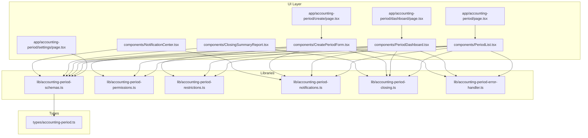
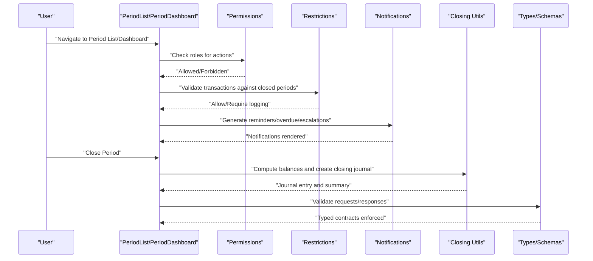
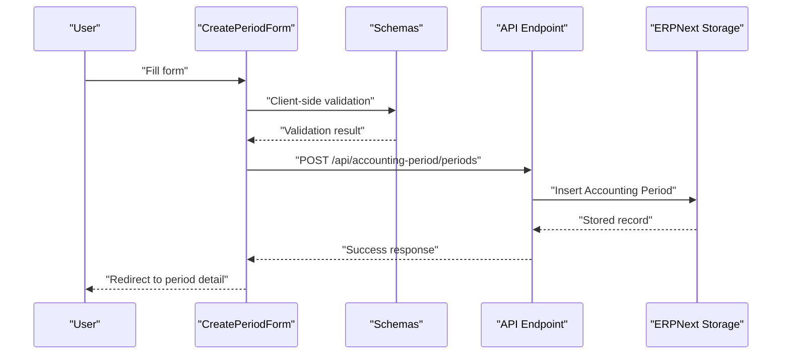
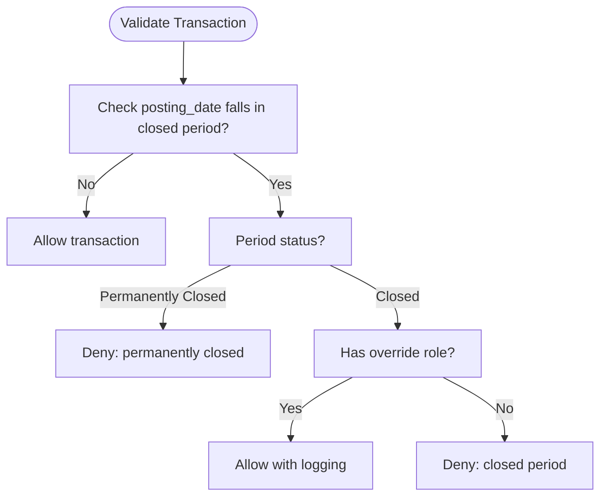
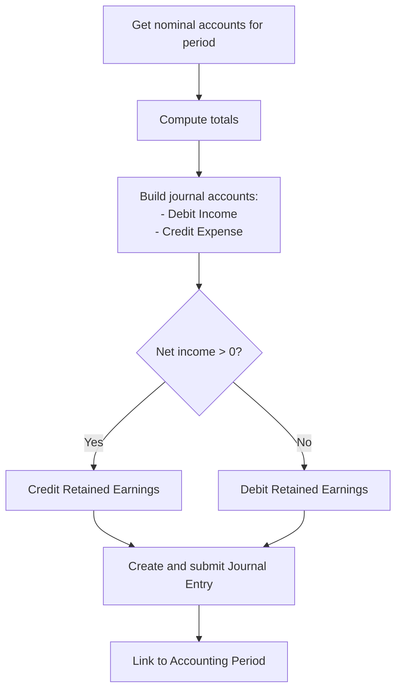
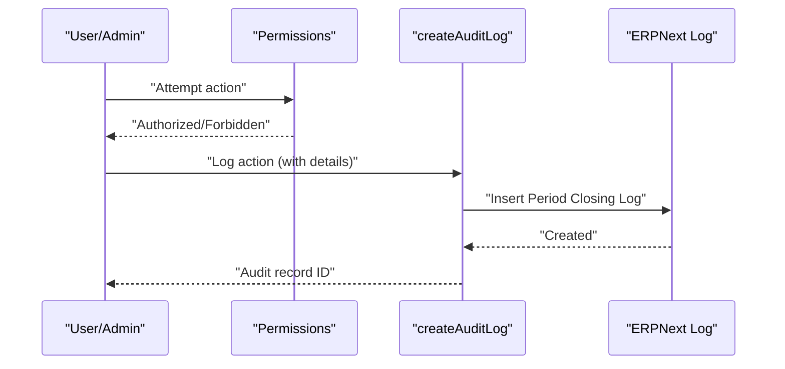
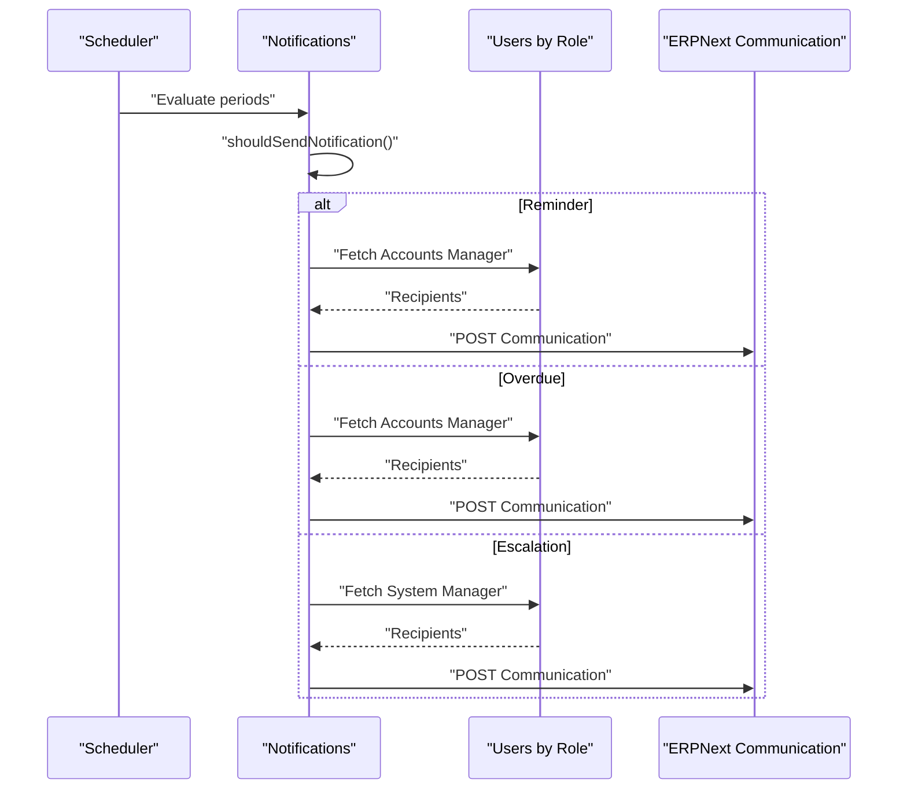
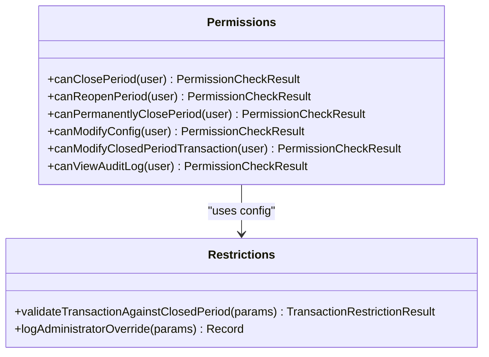
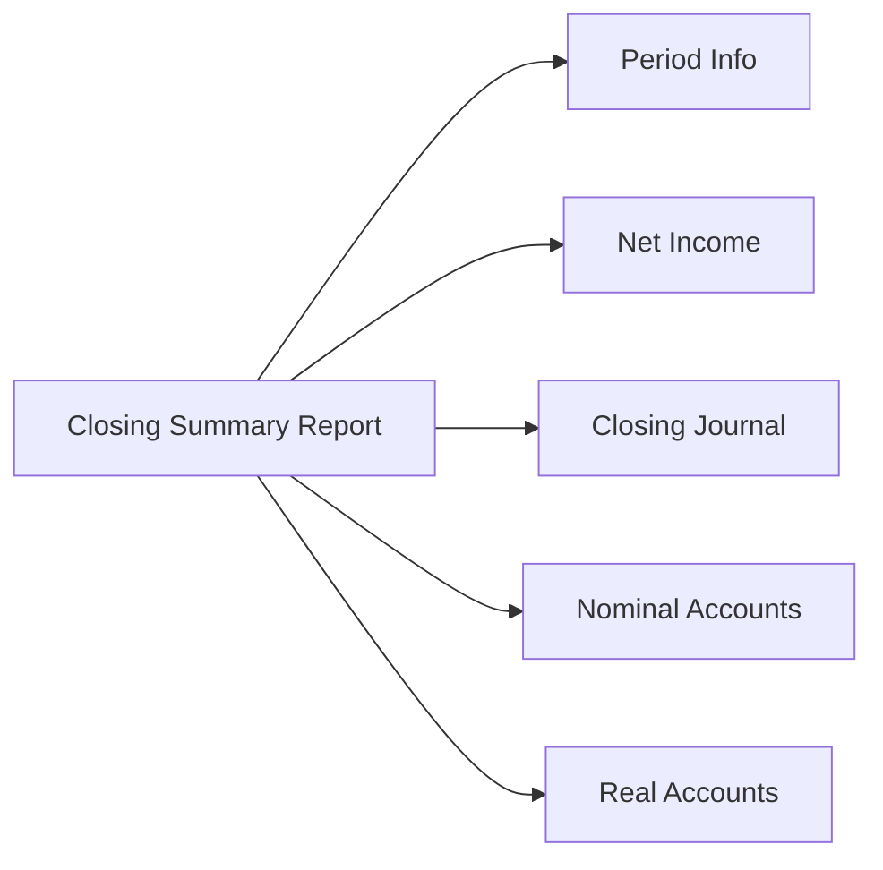
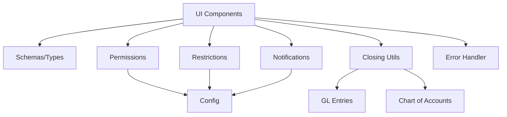

# Accounting Period Management

<cite>
**Referenced Files in This Document**
- [app/accounting-period/page.tsx](file://app/accounting-period/page.tsx)
- [app/accounting-period/create/page.tsx](file://app/accounting-period/create/page.tsx)
- [app/accounting-period/dashboard/page.tsx](file://app/accounting-period/dashboard/page.tsx)
- [app/accounting-period/settings/page.tsx](file://app/accounting-period/settings/page.tsx)
- [app/accounting-period/components/PeriodList.tsx](file://app/accounting-period/components/PeriodList.tsx)
- [app/accounting-period/components/PeriodDashboard.tsx](file://app/accounting-period/components/PeriodDashboard.tsx)
- [app/accounting-period/components/CreatePeriodForm.tsx](file://app/accounting-period/components/CreatePeriodForm.tsx)
- [app/accounting-period/components/ClosingSummaryReport.tsx](file://app/accounting-period/components/ClosingSummaryReport.tsx)
- [app/accounting-period/components/NotificationCenter.tsx](file://app/accounting-period/components/NotificationCenter.tsx)
- [lib/accounting-period-schemas.ts](file://lib/accounting-period-schemas.ts)
- [lib/accounting-period-permissions.ts](file://lib/accounting-period-permissions.ts)
- [lib/accounting-period-restrictions.ts](file://lib/accounting-period-restrictions.ts)
- [lib/accounting-period-notifications.ts](file://lib/accounting-period-notifications.ts)
- [lib/accounting-period-closing.ts](file://lib/accounting-period-closing.ts)
- [lib/accounting-period-error-handler.ts](file://lib/accounting-period-error-handler.ts)
- [types/accounting-period.ts](file://types/accounting-period.ts)
</cite>

## Table of Contents
1. [Introduction](#introduction)
2. [Project Structure](#project-structure)
3. [Core Components](#core-components)
4. [Architecture Overview](#architecture-overview)
5. [Detailed Component Analysis](#detailed-component-analysis)
6. [Dependency Analysis](#dependency-analysis)
7. [Performance Considerations](#performance-considerations)
8. [Troubleshooting Guide](#troubleshooting-guide)
9. [Conclusion](#conclusion)

## Introduction
This document describes the Accounting Period Management system, covering period creation, validation workflows, closing journal automation, and audit logging mechanisms. It explains the lifecycle from creation through closing, including validation rules, restrictions, and notification systems. It also documents automated closing journal entries, period status management, compliance features, integration with financial reporting, permissions, and ERPNext’s accounting period system. Practical examples, error handling scenarios, and troubleshooting guidance are included.

## Project Structure
The Accounting Period Management feature is implemented as a Next.js app with a dedicated UI under `/app/accounting-period`, supporting CRUD operations, dashboards, notifications, and closing workflows. Supporting libraries provide schemas, permissions, restrictions, notifications, closing logic, and error handling. Shared types define the domain model and API contracts.

**Diagram sources**
- [app/accounting-period/page.tsx](file://app/accounting-period/page.tsx#L1-L8)
- [app/accounting-period/create/page.tsx](file://app/accounting-period/create/page.tsx#L1-L27)
- [app/accounting-period/dashboard/page.tsx](file://app/accounting-period/dashboard/page.tsx#L1-L8)
- [app/accounting-period/settings/page.tsx](file://app/accounting-period/settings/page.tsx#L1-L483)
- [app/accounting-period/components/PeriodList.tsx](file://app/accounting-period/components/PeriodList.tsx#L1-L483)
- [app/accounting-period/components/PeriodDashboard.tsx](file://app/accounting-period/components/PeriodDashboard.tsx#L1-L537)
- [app/accounting-period/components/CreatePeriodForm.tsx](file://app/accounting-period/components/CreatePeriodForm.tsx#L1-L352)
- [app/accounting-period/components/ClosingSummaryReport.tsx](file://app/accounting-period/components/ClosingSummaryReport.tsx#L1-L399)
- [app/accounting-period/components/NotificationCenter.tsx](file://app/accounting-period/components/NotificationCenter.tsx#L1-L342)
- [lib/accounting-period-schemas.ts](file://lib/accounting-period-schemas.ts#L1-L191)
- [lib/accounting-period-permissions.ts](file://lib/accounting-period-permissions.ts#L1-L356)
- [lib/accounting-period-restrictions.ts](file://lib/accounting-period-restrictions.ts#L1-L226)
- [lib/accounting-period-notifications.ts](file://lib/accounting-period-notifications.ts#L1-L317)
- [lib/accounting-period-closing.ts](file://lib/accounting-period-closing.ts#L1-L406)
- [lib/accounting-period-error-handler.ts](file://lib/accounting-period-error-handler.ts#L1-L552)
- [types/accounting-period.ts](file://types/accounting-period.ts#L1-L268)

**Section sources**
- [app/accounting-period/page.tsx](file://app/accounting-period/page.tsx#L1-L8)
- [app/accounting-period/create/page.tsx](file://app/accounting-period/create/page.tsx#L1-L27)
- [app/accounting-period/dashboard/page.tsx](file://app/accounting-period/dashboard/page.tsx#L1-L8)
- [app/accounting-period/settings/page.tsx](file://app/accounting-period/settings/page.tsx#L1-L483)
- [app/accounting-period/components/PeriodList.tsx](file://app/accounting-period/components/PeriodList.tsx#L1-L483)
- [app/accounting-period/components/PeriodDashboard.tsx](file://app/accounting-period/components/PeriodDashboard.tsx#L1-L537)
- [app/accounting-period/components/CreatePeriodForm.tsx](file://app/accounting-period/components/CreatePeriodForm.tsx#L1-L352)
- [app/accounting-period/components/ClosingSummaryReport.tsx](file://app/accounting-period/components/ClosingSummaryReport.tsx#L1-L399)
- [app/accounting-period/components/NotificationCenter.tsx](file://app/accounting-period/components/NotificationCenter.tsx#L1-L342)
- [lib/accounting-period-schemas.ts](file://lib/accounting-period-schemas.ts#L1-L191)
- [lib/accounting-period-permissions.ts](file://lib/accounting-period-permissions.ts#L1-L356)
- [lib/accounting-period-restrictions.ts](file://lib/accounting-period-restrictions.ts#L1-L226)
- [lib/accounting-period-notifications.ts](file://lib/accounting-period-notifications.ts#L1-L317)
- [lib/accounting-period-closing.ts](file://lib/accounting-period-closing.ts#L1-L406)
- [lib/accounting-period-error-handler.ts](file://lib/accounting-period-error-handler.ts#L1-L552)
- [types/accounting-period.ts](file://types/accounting-period.ts#L1-L268)

## Core Components
- UI Pages and Components:
  - Period list and dashboard for overview and actions
  - Create period form with client-side validation and submission
  - Closing summary report for generated journals and balances
  - Notification center for reminders, overdue, and escalations
- Libraries:
  - Schemas for request/response validation and data modeling
  - Permissions for role-based access control
  - Restrictions for enforcing transaction rules against closed periods
  - Notifications for email reminders and escalations
  - Closing utilities for journal generation and net income calculation
  - Error handler for classification, retry, and structured responses

Key responsibilities:
- Validate and persist accounting periods
- Enforce transaction restrictions during closed periods
- Generate closing journals and compute net income
- Manage notifications and audit logs
- Provide configuration for closing behavior and roles

**Section sources**
- [app/accounting-period/components/PeriodList.tsx](file://app/accounting-period/components/PeriodList.tsx#L1-L483)
- [app/accounting-period/components/PeriodDashboard.tsx](file://app/accounting-period/components/PeriodDashboard.tsx#L1-L537)
- [app/accounting-period/components/CreatePeriodForm.tsx](file://app/accounting-period/components/CreatePeriodForm.tsx#L1-L352)
- [app/accounting-period/components/ClosingSummaryReport.tsx](file://app/accounting-period/components/ClosingSummaryReport.tsx#L1-L399)
- [app/accounting-period/components/NotificationCenter.tsx](file://app/accounting-period/components/NotificationCenter.tsx#L1-L342)
- [lib/accounting-period-schemas.ts](file://lib/accounting-period-schemas.ts#L1-L191)
- [lib/accounting-period-permissions.ts](file://lib/accounting-period-permissions.ts#L1-L356)
- [lib/accounting-period-restrictions.ts](file://lib/accounting-period-restrictions.ts#L1-L226)
- [lib/accounting-period-notifications.ts](file://lib/accounting-period-notifications.ts#L1-L317)
- [lib/accounting-period-closing.ts](file://lib/accounting-period-closing.ts#L1-L406)
- [lib/accounting-period-error-handler.ts](file://lib/accounting-period-error-handler.ts#L1-L552)
- [types/accounting-period.ts](file://types/accounting-period.ts#L1-L268)

## Architecture Overview
The system integrates UI components with backend-like orchestration through shared libraries and typed contracts. The UI communicates with ERPNext via the internal client abstraction, while libraries encapsulate business logic, validation, permissions, and closing procedures.

**Diagram sources**
- [app/accounting-period/components/PeriodList.tsx](file://app/accounting-period/components/PeriodList.tsx#L1-L483)
- [app/accounting-period/components/PeriodDashboard.tsx](file://app/accounting-period/components/PeriodDashboard.tsx#L1-L537)
- [lib/accounting-period-permissions.ts](file://lib/accounting-period-permissions.ts#L1-L356)
- [lib/accounting-period-restrictions.ts](file://lib/accounting-period-restrictions.ts#L1-L226)
- [lib/accounting-period-notifications.ts](file://lib/accounting-period-notifications.ts#L1-L317)
- [lib/accounting-period-closing.ts](file://lib/accounting-period-closing.ts#L1-L406)
- [lib/accounting-period-schemas.ts](file://lib/accounting-period-schemas.ts#L1-L191)
- [types/accounting-period.ts](file://types/accounting-period.ts#L1-L268)

## Detailed Component Analysis

### Period Creation Workflow
- UI: CreatePeriodForm validates inputs (client-side) and posts to the API endpoint.
- Validation: Zod schemas enforce required fields, date ordering, and sanitization.
- Persistence: The backend stores the period record with status “Open”.
- Notifications: Optional reminders can be scheduled based on configuration.

**Diagram sources**
- [app/accounting-period/components/CreatePeriodForm.tsx](file://app/accounting-period/components/CreatePeriodForm.tsx#L1-L352)
- [lib/accounting-period-schemas.ts](file://lib/accounting-period-schemas.ts#L106-L124)
- [types/accounting-period.ts](file://types/accounting-period.ts#L130-L144)

**Section sources**
- [app/accounting-period/components/CreatePeriodForm.tsx](file://app/accounting-period/components/CreatePeriodForm.tsx#L1-L352)
- [lib/accounting-period-schemas.ts](file://lib/accounting-period-schemas.ts#L106-L124)
- [types/accounting-period.ts](file://types/accounting-period.ts#L130-L144)

### Period Validation and Restrictions
- Validation: Periods are validated for date ordering and overlapping constraints.
- Restrictions: Transactions posted during closed periods are blocked for regular users; administrators may override with logging.
- Override logging: Administrator actions in closed periods are recorded for audit.

**Diagram sources**
- [lib/accounting-period-restrictions.ts](file://lib/accounting-period-restrictions.ts#L44-L131)
- [lib/accounting-period-permissions.ts](file://lib/accounting-period-permissions.ts#L131-L198)

**Section sources**
- [lib/accounting-period-restrictions.ts](file://lib/accounting-period-restrictions.ts#L1-L226)
- [lib/accounting-period-permissions.ts](file://lib/accounting-period-permissions.ts#L1-L356)

### Automated Closing Journal Entries
- Nominal accounts: Income and Expense accounts with balances are identified.
- Journal entries: Debit Income accounts and credit Expense accounts; balance to Retained Earnings.
- Net income calculation: Total Income minus Total Expense determines the balancing amount.
- Submission: Journal entry is submitted and linked to the period.

**Diagram sources**
- [lib/accounting-period-closing.ts](file://lib/accounting-period-closing.ts#L58-L142)
- [lib/accounting-period-closing.ts](file://lib/accounting-period-closing.ts#L159-L247)
- [lib/accounting-period-closing.ts](file://lib/accounting-period-closing.ts#L256-L269)

**Section sources**
- [lib/accounting-period-closing.ts](file://lib/accounting-period-closing.ts#L1-L406)
- [types/accounting-period.ts](file://types/accounting-period.ts#L79-L97)

### Audit Logging Mechanisms
- Audit log entries capture actions (Created, Closed, Reopened, Permanently Closed, Transaction Modified), who performed them, timestamps, and optional snapshots/affected transactions.
- Administrator overrides in closed periods are logged with details.

**Diagram sources**
- [lib/accounting-period-permissions.ts](file://lib/accounting-period-permissions.ts#L131-L198)
- [lib/accounting-period-closing.ts](file://lib/accounting-period-closing.ts#L366-L388)
- [types/accounting-period.ts](file://types/accounting-period.ts#L29-L42)

**Section sources**
- [lib/accounting-period-closing.ts](file://lib/accounting-period-closing.ts#L360-L388)
- [types/accounting-period.ts](file://types/accounting-period.ts#L29-L42)

### Notification System
- Reminders: Sent N days before end date.
- Overdue: Sent while the period remains open past end date.
- Escalations: Sent M days after end date to System Managers.
- Recipients: Fetched by role from ERPNext.

**Diagram sources**
- [lib/accounting-period-notifications.ts](file://lib/accounting-period-notifications.ts#L256-L282)
- [lib/accounting-period-notifications.ts](file://lib/accounting-period-notifications.ts#L112-L147)
- [lib/accounting-period-notifications.ts](file://lib/accounting-period-notifications.ts#L153-L188)
- [lib/accounting-period-notifications.ts](file://lib/accounting-period-notifications.ts#L194-L235)

**Section sources**
- [lib/accounting-period-notifications.ts](file://lib/accounting-period-notifications.ts#L1-L317)

### Permissions and Compliance
- Roles:
  - Close period: Requires configured closing role or System Manager.
  - Reopen period: Requires configured reopen role or System Manager.
  - Modify closed period transactions: Requires reopen role or System Manager.
  - Configure closing: Requires System Manager or Accounts Manager.
- Compliance:
  - Administrator overrides are logged.
  - Notifications escalate to higher roles when periods remain open beyond deadlines.

**Diagram sources**
- [lib/accounting-period-permissions.ts](file://lib/accounting-period-permissions.ts#L131-L283)
- [lib/accounting-period-restrictions.ts](file://lib/accounting-period-restrictions.ts#L44-L131)

**Section sources**
- [lib/accounting-period-permissions.ts](file://lib/accounting-period-permissions.ts#L1-L356)
- [lib/accounting-period-restrictions.ts](file://lib/accounting-period-restrictions.ts#L1-L226)

### Financial Reporting Integration
- Closing summary report displays:
  - Period metadata and status
  - Net income computation
  - Closing journal entries
  - Nominal and real accounts with balances
- Export/print capabilities supported by the component.

**Diagram sources**
- [app/accounting-period/components/ClosingSummaryReport.tsx](file://app/accounting-period/components/ClosingSummaryReport.tsx#L1-L399)
- [lib/accounting-period-closing.ts](file://lib/accounting-period-closing.ts#L278-L358)

**Section sources**
- [app/accounting-period/components/ClosingSummaryReport.tsx](file://app/accounting-period/components/ClosingSummaryReport.tsx#L1-L399)
- [lib/accounting-period-closing.ts](file://lib/accounting-period-closing.ts#L278-L358)

## Dependency Analysis
The system exhibits clear separation of concerns:
- UI components depend on schemas and types for validation and rendering.
- Permissions and restrictions depend on configuration and user roles.
- Notifications depend on ERPNext APIs for user retrieval and email dispatch.
- Closing utilities depend on GL entries and chart of accounts to compute balances and create journals.
- Error handler centralizes classification and retry logic.

**Diagram sources**
- [lib/accounting-period-schemas.ts](file://lib/accounting-period-schemas.ts#L1-L191)
- [lib/accounting-period-permissions.ts](file://lib/accounting-period-permissions.ts#L115-L120)
- [lib/accounting-period-restrictions.ts](file://lib/accounting-period-restrictions.ts#L92-L94)
- [lib/accounting-period-notifications.ts](file://lib/accounting-period-notifications.ts#L83-L106)
- [lib/accounting-period-closing.ts](file://lib/accounting-period-closing.ts#L61-L76)
- [lib/accounting-period-closing.ts](file://lib/accounting-period-closing.ts#L92-L100)

**Section sources**
- [lib/accounting-period-schemas.ts](file://lib/accounting-period-schemas.ts#L1-L191)
- [lib/accounting-period-permissions.ts](file://lib/accounting-period-permissions.ts#L1-L356)
- [lib/accounting-period-restrictions.ts](file://lib/accounting-period-restrictions.ts#L1-L226)
- [lib/accounting-period-notifications.ts](file://lib/accounting-period-notifications.ts#L1-L317)
- [lib/accounting-period-closing.ts](file://lib/accounting-period-closing.ts#L1-L406)

## Performance Considerations
- Large GL queries: The closing utilities aggregate GL entries and account details; consider pagination and limiting scopes to reduce memory usage.
- Notification evaluation: Batch evaluate open periods and cache recipients to minimize repeated API calls.
- Client-side filtering/pagination: UI components already implement responsive pagination and frontend filtering to improve perceived performance.
- Retry logic: Use transient error detection to retry network-bound operations with exponential backoff.

[No sources needed since this section provides general guidance]

## Troubleshooting Guide
Common issues and resolutions:
- Validation failures during period creation:
  - Ensure start date precedes end date and required fields are filled.
  - Review server-side validation details returned in the response.
- Permission denied:
  - Verify the user has the required role (closing/reopen/config).
  - Confirm configuration matches the user’s roles.
- Transaction blocked in closed period:
  - Check if the period is “Permanently Closed” (cannot be modified).
  - Confirm the user has override role or is Administrator.
- Notifications not sent:
  - Verify email notification settings and recipient roles.
  - Check ERPNext API credentials and endpoint availability.
- Closing journal not generated:
  - Ensure nominal accounts exist and have balances.
  - Confirm retained earnings account is configured.
- Error handling:
  - Use the centralized error handler to classify and log issues.
  - Leverage retry logic for transient network errors.

**Section sources**
- [lib/accounting-period-error-handler.ts](file://lib/accounting-period-error-handler.ts#L1-L552)
- [lib/accounting-period-permissions.ts](file://lib/accounting-period-permissions.ts#L131-L283)
- [lib/accounting-period-restrictions.ts](file://lib/accounting-period-restrictions.ts#L44-L131)
- [lib/accounting-period-notifications.ts](file://lib/accounting-period-notifications.ts#L49-L78)
- [lib/accounting-period-closing.ts](file://lib/accounting-period-closing.ts#L159-L247)

## Conclusion
The Accounting Period Management system provides a robust framework for managing accounting periods, enforcing transaction restrictions, automating closing journals, and maintaining compliance through audit logging and notifications. Its modular design, strong typing, and centralized error handling support reliable operations and integration with ERPNext. Adhering to the documented workflows, permissions, and troubleshooting steps ensures smooth period lifecycle management and accurate financial reporting.