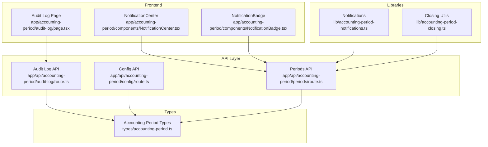
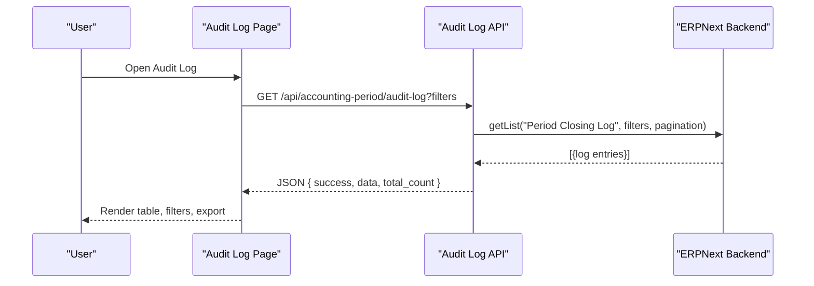
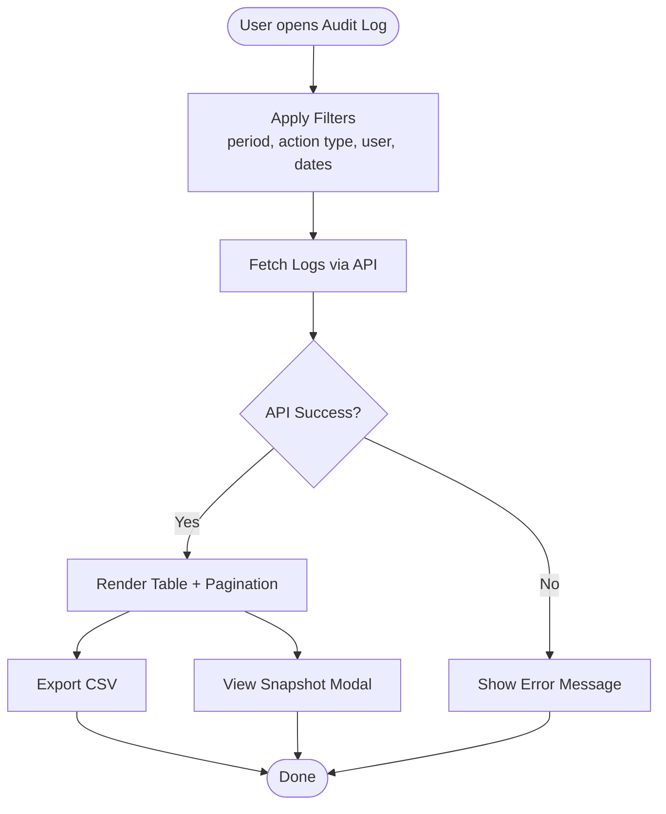
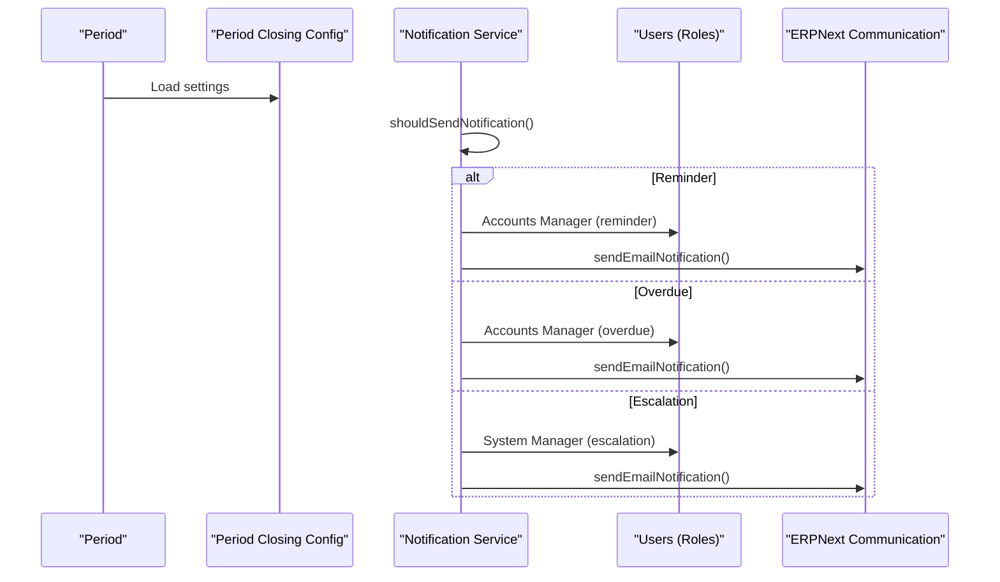
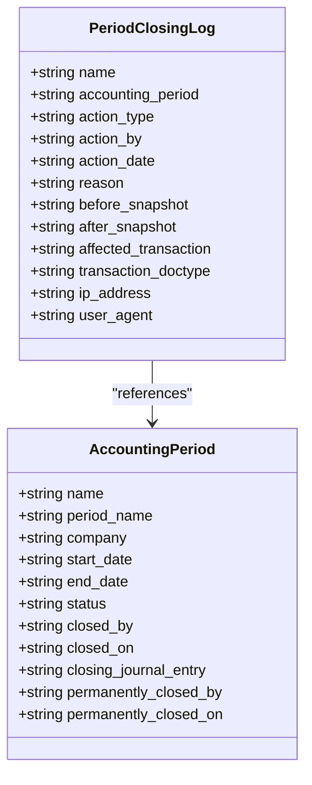
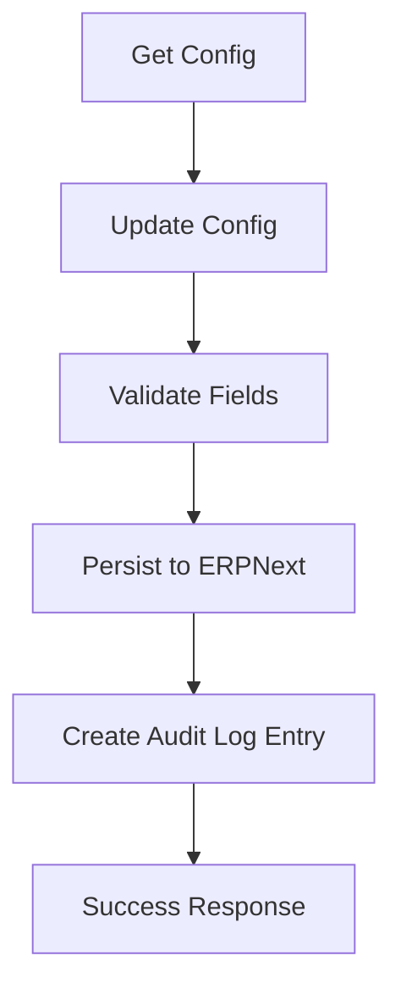
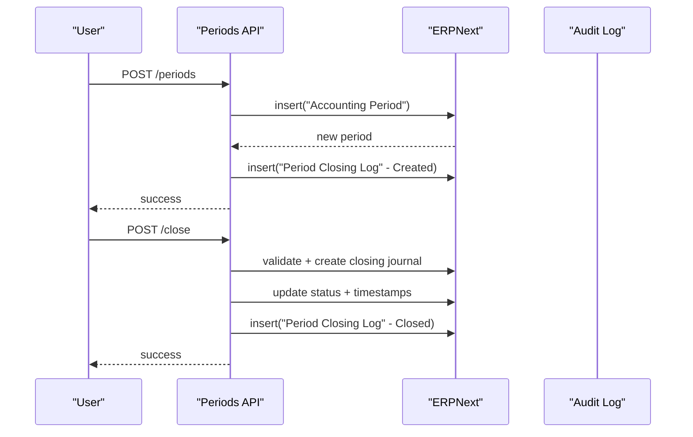
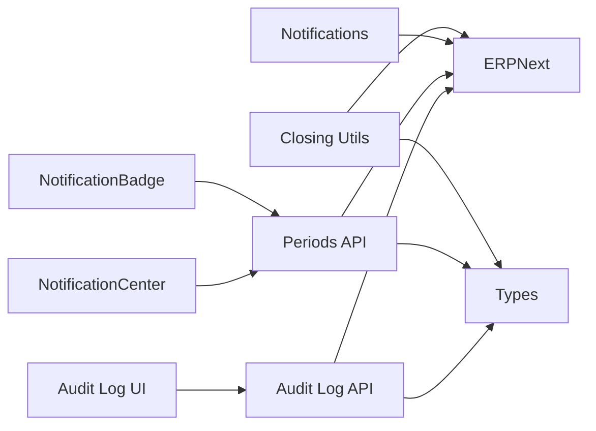

# Audit Logging and Compliance

<cite>
**Referenced Files in This Document**
- [audit-log/page.tsx](file://app/accounting-period/audit-log/page.tsx)
- [audit-log/route.ts](file://app/api/accounting-period/audit-log/route.ts)
- [accounting-period-notifications.ts](file://lib/accounting-period-notifications.ts)
- [NotificationCenter.tsx](file://app/accounting-period/components/NotificationCenter.tsx)
- [NotificationBadge.tsx](file://app/accounting-period/components/NotificationBadge.tsx)
- [accounting-period-closing.ts](file://lib/accounting-period-closing.ts)
- [accounting-period-api.md](file://docs/accounting-period/accounting-period-api.md)
- [accounting-period-user-guide.md](file://docs/accounting-period/accounting-period-user-guide.md)
- [types/accounting-period.ts](file://types/accounting-period.ts)
- [periods/route.ts](file://app/api/accounting-period/periods/route.ts)
- [config/route.ts](file://app/api/accounting-period/config/route.ts)
- [accounting-period-audit-log-unit.test.ts](file://tests/accounting-period-audit-log-unit.test.ts)
</cite>

## Table of Contents
1. [Introduction](#introduction)
2. [Project Structure](#project-structure)
3. [Core Components](#core-components)
4. [Architecture Overview](#architecture-overview)
5. [Detailed Component Analysis](#detailed-component-analysis)
6. [Dependency Analysis](#dependency-analysis)
7. [Performance Considerations](#performance-considerations)
8. [Troubleshooting Guide](#troubleshooting-guide)
9. [Conclusion](#conclusion)
10. [Appendices](#appendices)

## Introduction
This document describes the Accounting Period Audit Logging and Compliance system. It covers the audit trail functionality, action tracking, user activity monitoring, compliance reporting, notification system for period events, email alerts, and escalation procedures. It also documents the audit log schema, action types, and configuration options that support ERPNext's audit requirements and data privacy considerations.

## Project Structure
The audit and compliance system spans frontend pages, API routes, shared libraries, and documentation. Key areas include:
- Audit log UI and filtering
- Audit log API retrieval
- Notification generation and display
- Configuration management for audit and compliance
- Data models for audit logs and accounting periods

**Diagram sources**
- [audit-log/page.tsx](file://app/accounting-period/audit-log/page.tsx#L1-L456)
- [audit-log/route.ts](file://app/api/accounting-period/audit-log/route.ts#L1-L63)
- [accounting-period-notifications.ts](file://lib/accounting-period-notifications.ts#L1-L317)
- [NotificationCenter.tsx](file://app/accounting-period/components/NotificationCenter.tsx#L1-L342)
- [NotificationBadge.tsx](file://app/accounting-period/components/NotificationBadge.tsx#L1-L203)
- [accounting-period-closing.ts](file://lib/accounting-period-closing.ts#L1-L406)
- [types/accounting-period.ts](file://types/accounting-period.ts#L1-L268)
- [periods/route.ts](file://app/api/accounting-period/periods/route.ts#L1-L183)
- [config/route.ts](file://app/api/accounting-period/config/route.ts#L1-L207)

**Section sources**
- [audit-log/page.tsx](file://app/accounting-period/audit-log/page.tsx#L1-L456)
- [audit-log/route.ts](file://app/api/accounting-period/audit-log/route.ts#L1-L63)
- [accounting-period-notifications.ts](file://lib/accounting-period-notifications.ts#L1-L317)
- [NotificationCenter.tsx](file://app/accounting-period/components/NotificationCenter.tsx#L1-L342)
- [NotificationBadge.tsx](file://app/accounting-period/components/NotificationBadge.tsx#L1-L203)
- [accounting-period-closing.ts](file://lib/accounting-period-closing.ts#L1-L406)
- [types/accounting-period.ts](file://types/accounting-period.ts#L1-L268)
- [periods/route.ts](file://app/api/accounting-period/periods/route.ts#L1-L183)
- [config/route.ts](file://app/api/accounting-period/config/route.ts#L1-L207)

## Core Components
- Audit Log UI: Provides filtering, pagination, CSV export, and snapshot viewing for audit entries.
- Audit Log API: Retrieves paginated audit logs with optional filters from ERPNext.
- Notification System: Generates reminders, overdue notices, and escalations based on period dates and configuration.
- Configuration Management: Stores and validates compliance-related settings (roles, checks, reminders, escalations).
- Data Models: Define audit log entries, accounting periods, and configuration structures.

Key capabilities:
- Track Created, Closed, Reopened, Permanently Closed, and Transaction Modified actions.
- Capture before/after snapshots for auditability.
- Filter and export audit logs for compliance reporting.
- Notify stakeholders via email and in-app notifications.

**Section sources**
- [audit-log/page.tsx](file://app/accounting-period/audit-log/page.tsx#L1-L456)
- [audit-log/route.ts](file://app/api/accounting-period/audit-log/route.ts#L1-L63)
- [accounting-period-notifications.ts](file://lib/accounting-period-notifications.ts#L1-L317)
- [types/accounting-period.ts](file://types/accounting-period.ts#L29-L42)
- [config/route.ts](file://app/api/accounting-period/config/route.ts#L1-L207)

## Architecture Overview
The system integrates frontend UI, Next.js API routes, and ERPNext backend. Audit logs are persisted in ERPNext and surfaced via typed APIs. Notifications are generated locally and sent via ERPNext Communication API.

**Diagram sources**
- [audit-log/page.tsx](file://app/accounting-period/audit-log/page.tsx#L29-L59)
- [audit-log/route.ts](file://app/api/accounting-period/audit-log/route.ts#L9-L51)

**Section sources**
- [audit-log/page.tsx](file://app/accounting-period/audit-log/page.tsx#L1-L456)
- [audit-log/route.ts](file://app/api/accounting-period/audit-log/route.ts#L1-L63)

## Detailed Component Analysis

### Audit Log UI and API
- UI supports:
  - Filters: period name, action type, user, date range, and free-text search.
  - Pagination with configurable page size.
  - CSV export of filtered results.
  - Snapshot modal for before/after JSON comparisons.
- API supports:
  - Filtering by period_name, action_type, action_by.
  - Pagination via limit/start.
  - Field selection for efficient retrieval.
  - Error handling with site-aware responses.

**Diagram sources**
- [audit-log/page.tsx](file://app/accounting-period/audit-log/page.tsx#L29-L121)
- [audit-log/route.ts](file://app/api/accounting-period/audit-log/route.ts#L9-L51)

**Section sources**
- [audit-log/page.tsx](file://app/accounting-period/audit-log/page.tsx#L1-L456)
- [audit-log/route.ts](file://app/api/accounting-period/audit-log/route.ts#L1-L63)

### Notification System
- Local notification center:
  - Computes days until/after period end.
  - Generates reminders, overdue, and escalation notifications.
  - Stores read state in local storage.
- Email notifications:
  - Sends reminders, overdue, and escalations to configured roles.
  - Integrates with ERPNext Communication API.
  - Supports configurable days-before and days-after thresholds.

**Diagram sources**
- [accounting-period-notifications.ts](file://lib/accounting-period-notifications.ts#L256-L316)
- [NotificationCenter.tsx](file://app/accounting-period/components/NotificationCenter.tsx#L72-L134)

**Section sources**
- [accounting-period-notifications.ts](file://lib/accounting-period-notifications.ts#L1-L317)
- [NotificationCenter.tsx](file://app/accounting-period/components/NotificationCenter.tsx#L1-L342)
- [NotificationBadge.tsx](file://app/accounting-period/components/NotificationBadge.tsx#L1-L203)

### Audit Log Schema and Action Types
- Audit log fields include:
  - accounting_period, action_type, action_by, action_date, reason, before_snapshot, after_snapshot, affected_transaction, transaction_doctype, ip_address, user_agent.
- Action types:
  - Created, Closed, Reopened, Permanently Closed, Transaction Modified.

**Diagram sources**
- [types/accounting-period.ts](file://types/accounting-period.ts#L29-L42)
- [types/accounting-period.ts](file://types/accounting-period.ts#L3-L27)

**Section sources**
- [types/accounting-period.ts](file://types/accounting-period.ts#L29-L42)

### Configuration and Compliance Controls
- Configuration includes:
  - Retained earnings account (must be Equity).
  - Validation checks toggles.
  - Roles for closing and reopening.
  - Reminder and escalation thresholds.
  - Email notifications toggle.
- Updates are audited with before/after snapshots.

**Diagram sources**
- [config/route.ts](file://app/api/accounting-period/config/route.ts#L11-L59)
- [config/route.ts](file://app/api/accounting-period/config/route.ts#L61-L206)
- [accounting-period-closing.ts](file://lib/accounting-period-closing.ts#L366-L388)

**Section sources**
- [config/route.ts](file://app/api/accounting-period/config/route.ts#L1-L207)
- [accounting-period-closing.ts](file://lib/accounting-period-closing.ts#L366-L388)

### Period Lifecycle and Audit Trail Integration
- Period creation, closing, reopening, and permanent closure are captured in audit logs with snapshots.
- Closing workflow includes validation, preview, journal creation, and audit logging.

**Diagram sources**
- [periods/route.ts](file://app/api/accounting-period/periods/route.ts#L94-L182)
- [accounting-period-closing.ts](file://lib/accounting-period-closing.ts#L366-L388)

**Section sources**
- [periods/route.ts](file://app/api/accounting-period/periods/route.ts#L1-L183)
- [accounting-period-closing.ts](file://lib/accounting-period-closing.ts#L366-L388)

## Dependency Analysis
- The Audit Log UI depends on:
  - Audit Log API for data.
  - Types for shape validation.
- The Audit Log API depends on:
  - ERPNext client for getList and getCount.
  - Site-aware error handling.
- Notifications depend on:
  - Configuration for thresholds and roles.
  - ERPNext Communication API for sending emails.
- Closing utilities depend on:
  - ERPNext client for GL queries and Journal Entry submission.
  - Types for account and journal structures.

**Diagram sources**
- [audit-log/page.tsx](file://app/accounting-period/audit-log/page.tsx#L1-L456)
- [audit-log/route.ts](file://app/api/accounting-period/audit-log/route.ts#L1-L63)
- [periods/route.ts](file://app/api/accounting-period/periods/route.ts#L1-L183)
- [accounting-period-notifications.ts](file://lib/accounting-period-notifications.ts#L1-L317)
- [accounting-period-closing.ts](file://lib/accounting-period-closing.ts#L1-L406)
- [types/accounting-period.ts](file://types/accounting-period.ts#L1-L268)

**Section sources**
- [audit-log/page.tsx](file://app/accounting-period/audit-log/page.tsx#L1-L456)
- [audit-log/route.ts](file://app/api/accounting-period/audit-log/route.ts#L1-L63)
- [periods/route.ts](file://app/api/accounting-period/periods/route.ts#L1-L183)
- [accounting-period-notifications.ts](file://lib/accounting-period-notifications.ts#L1-L317)
- [accounting-period-closing.ts](file://lib/accounting-period-closing.ts#L1-L406)
- [types/accounting-period.ts](file://types/accounting-period.ts#L1-L268)

## Performance Considerations
- Pagination: Use limit/start to avoid large payloads.
- Field selection: Request only needed fields from ERPNext.
- Client-side filtering: Keep search scope minimal to reduce rendering overhead.
- Snapshot size: Large JSON snapshots increase payload and render time; consider trimming unnecessary fields.
- Notification computation: Memoize calculations and avoid frequent re-fetches.

[No sources needed since this section provides general guidance]

## Troubleshooting Guide
Common issues and resolutions:
- Audit log retrieval failures:
  - Verify API endpoint availability and authentication.
  - Check filters and pagination parameters.
- Empty or missing audit logs:
  - Confirm that actions generated logs (e.g., Created, Closed, Reopened, Permanently Closed, Transaction Modified).
  - Ensure snapshots are present for Closed/Reopened actions.
- Notification not sent:
  - Confirm configuration enable_email_notifications and thresholds.
  - Verify role membership for Accounts Manager/System Manager.
  - Check ERPNext Communication API credentials and connectivity.
- Configuration validation errors:
  - Retained earnings account must be an Equity account.
  - Role names must exist in ERPNext.
- Unit test failures:
  - Review test expectations for snapshots, filters, and pagination.

**Section sources**
- [accounting-period-audit-log-unit.test.ts](file://tests/accounting-period-audit-log-unit.test.ts#L1-L547)
- [config/route.ts](file://app/api/accounting-period/config/route.ts#L71-L131)
- [accounting-period-notifications.ts](file://lib/accounting-period-notifications.ts#L50-L78)

## Conclusion
The Accounting Period Audit Logging and Compliance system provides robust audit trails, comprehensive filtering, and actionable notifications aligned with ERPNext’s audit requirements. By leveraging typed models, site-aware APIs, and configurable compliance controls, organizations can maintain integrity, transparency, and regulatory readiness across financial periods.

[No sources needed since this section summarizes without analyzing specific files]

## Appendices

### Audit Log Schema Reference
- Fields: accounting_period, action_type, action_by, action_date, reason, before_snapshot, after_snapshot, affected_transaction, transaction_doctype, ip_address, user_agent.
- Action types: Created, Closed, Reopened, Permanently Closed, Transaction Modified.

**Section sources**
- [types/accounting-period.ts](file://types/accounting-period.ts#L29-L42)

### Notification Triggers and Escalation Procedures
- Reminder: N days before end date (configurable).
- Overdue: After end date within threshold (configurable).
- Escalation: M days after end date (configurable) to System Manager.

**Section sources**
- [accounting-period-notifications.ts](file://lib/accounting-period-notifications.ts#L256-L282)
- [config/route.ts](file://app/api/accounting-period/config/route.ts#L45-L47)

### Compliance Reporting Scenarios
- Export audit logs to CSV for internal reviews.
- Generate closing summaries and compare periods for trend analysis.
- Use snapshots to reconstruct state changes for audits.

**Section sources**
- [audit-log/page.tsx](file://app/accounting-period/audit-log/page.tsx#L93-L121)
- [accounting-period-api.md](file://docs/accounting-period/accounting-period-api.md#L501-L544)

### Configuration Guidance
- Configure retained earnings account (must be Equity).
- Enable/disable validation checks based on organizational needs.
- Set reminder and escalation thresholds aligned with business cycles.
- Assign roles for closing and reopening activities.

**Section sources**
- [config/route.ts](file://app/api/accounting-period/config/route.ts#L61-L206)
- [accounting-period-user-guide.md](file://docs/accounting-period/accounting-period-user-guide.md#L434-L493)