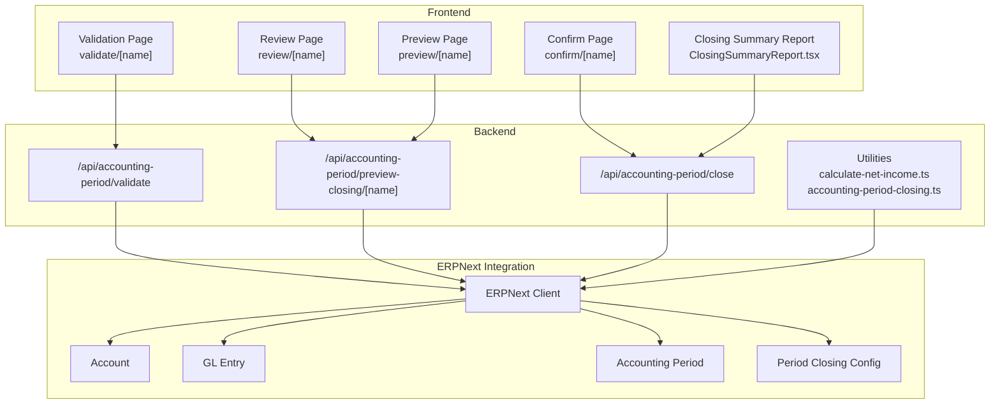
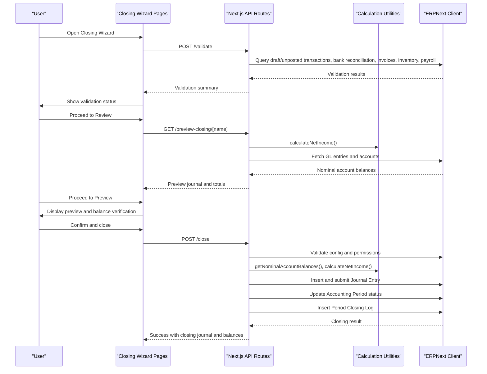
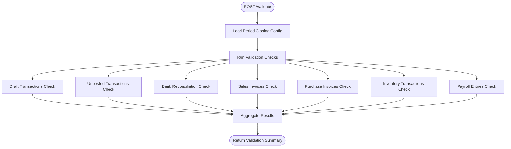
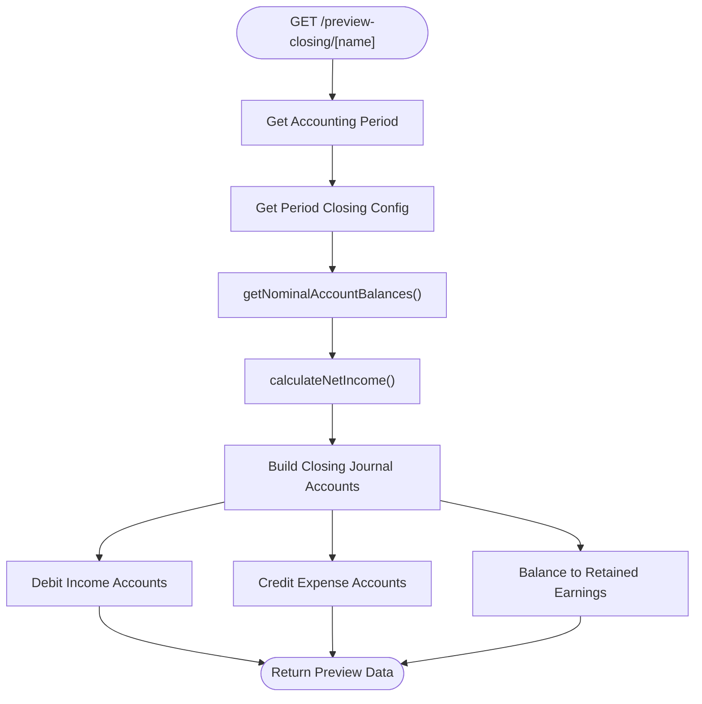
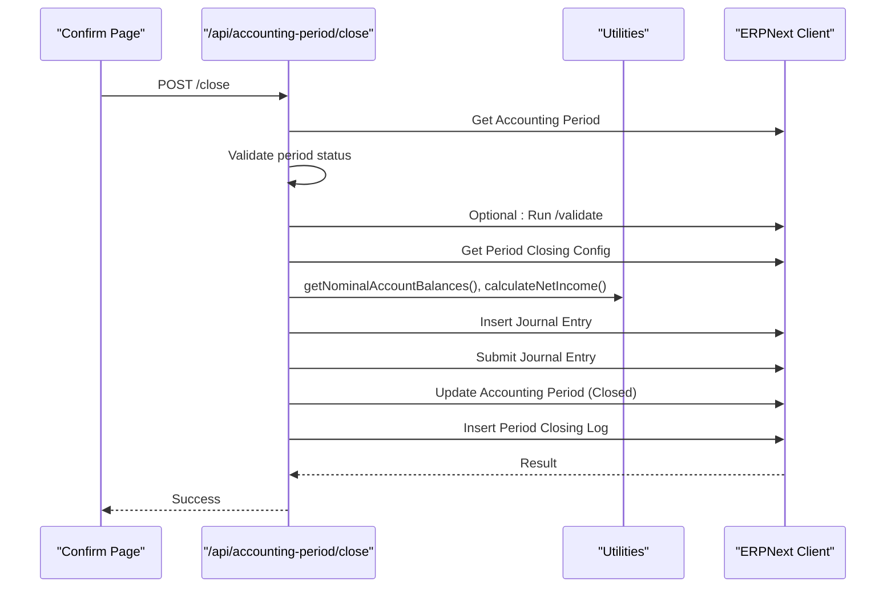
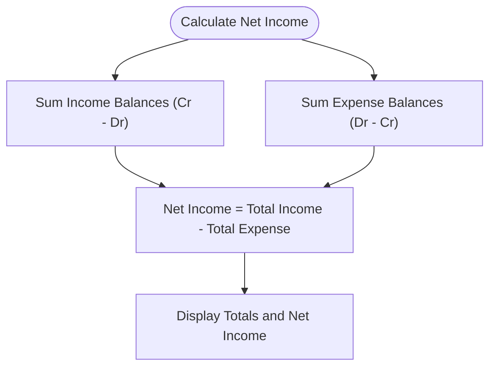
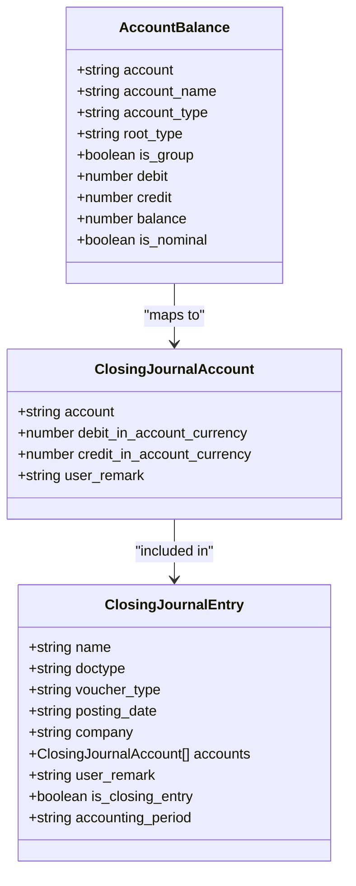
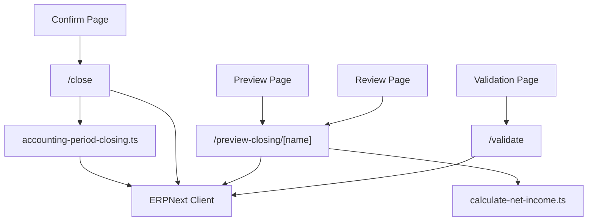

# Closing Journal Automation

<cite>
**Referenced Files in This Document**
- [accounting-period-closing.ts](file://lib/accounting-period-closing.ts)
- [calculate-net-income.ts](file://lib/calculate-net-income.ts)
- [ClosingSummaryReport.tsx](file://app/accounting-period/components/ClosingSummaryReport.tsx)
- [validate route.ts](file://app/api/accounting-period/validate/validate.route.ts)
- [preview-closing route.ts](file://app/api/accounting-period/preview-closing/[name]/route.ts)
- [close route.ts](file://app/api/accounting-period/close/route.ts)
- [Closing Wizard - Validation Page](file://app/accounting-period/close/[name]/page.tsx)
- [Closing Wizard - Review Page](file://app/accounting-period/close/[name]/review/page.tsx)
- [Closing Wizard - Preview Page](file://app/accounting-period/close/[name]/preview/page.tsx)
- [Closing Wizard - Confirm Page](file://app/accounting-period/close/[name]/confirm/page.tsx)
- [accounting-period.ts](file://types/accounting-period.ts)
</cite>

## Table of Contents
1. [Introduction](#introduction)
2. [Project Structure](#project-structure)
3. [Core Components](#core-components)
4. [Architecture Overview](#architecture-overview)
5. [Detailed Component Analysis](#detailed-component-analysis)
6. [Dependency Analysis](#dependency-analysis)
7. [Performance Considerations](#performance-considerations)
8. [Troubleshooting Guide](#troubleshooting-guide)
9. [Conclusion](#conclusion)

## Introduction
This document describes the Accounting Period Closing Journal Automation system. It covers the automated journal entry generation process, including net income calculation, retained earnings transfer, and closing entry creation. It explains the closing workflow from validation through journal entry posting, including preview functionality and reversal capabilities. It also details the net income calculation algorithms, account mapping for closing entries, and integration with financial reporting. Examples of closing journal entries, preview scenarios, and error handling during the closing process are provided, along with troubleshooting guidance and best practices for period closing procedures.

## Project Structure
The closing automation spans frontend React pages and backend Next.js API routes, with shared utilities for calculations and data modeling.

**Diagram sources**
- [validate route.ts](file://app/api/accounting-period/validate/validate.route.ts#L1-L567)
- [preview-closing route.ts](file://app/api/accounting-period/preview-closing/[name]/route.ts#L1-L183)
- [close route.ts](file://app/api/accounting-period/close/route.ts#L1-L644)
- [accounting-period-closing.ts](file://lib/accounting-period-closing.ts#L1-L406)
- [calculate-net-income.ts](file://lib/calculate-net-income.ts#L1-L82)
- [ClosingSummaryReport.tsx](file://app/accounting-period/components/ClosingSummaryReport.tsx#L1-L399)

**Section sources**
- [validate route.ts](file://app/api/accounting-period/validate/validate.route.ts#L1-L567)
- [preview-closing route.ts](file://app/api/accounting-period/preview-closing/[name]/route.ts#L1-L183)
- [close route.ts](file://app/api/accounting-period/close/route.ts#L1-L644)
- [accounting-period-closing.ts](file://lib/accounting-period-closing.ts#L1-L406)
- [calculate-net-income.ts](file://lib/calculate-net-income.ts#L1-L82)
- [ClosingSummaryReport.tsx](file://app/accounting-period/components/ClosingSummaryReport.tsx#L1-L399)

## Core Components
- Validation engine: Runs pre-closing checks for draft/unposted transactions, bank reconciliation, sales/purchase invoices, inventory, and payroll.
- Preview generator: Computes net income and builds a preview of closing journal entries with debits/credits and balancing to retained earnings.
- Closing executor: Creates and submits the closing journal entry, updates period status, and records audit logs.
- Calculation utilities: Shared net income computation and account balance aggregation.
- Reporting: Closing summary report with nominal and real accounts, journal details, and balances.

**Section sources**
- [validate route.ts](file://app/api/accounting-period/validate/validate.route.ts#L110-L566)
- [preview-closing route.ts](file://app/api/accounting-period/preview-closing/[name]/route.ts#L12-L182)
- [close route.ts](file://app/api/accounting-period/close/route.ts#L11-L169)
- [accounting-period-closing.ts](file://lib/accounting-period-closing.ts#L58-L358)
- [calculate-net-income.ts](file://lib/calculate-net-income.ts#L18-L81)
- [ClosingSummaryReport.tsx](file://app/accounting-period/components/ClosingSummaryReport.tsx#L13-L399)

## Architecture Overview
The closing workflow is a multi-step process orchestrated by frontend wizards and backend APIs:

**Diagram sources**
- [validate route.ts](file://app/api/accounting-period/validate/validate.route.ts#L12-L107)
- [preview-closing route.ts](file://app/api/accounting-period/preview-closing/[name]/route.ts#L12-L101)
- [close route.ts](file://app/api/accounting-period/close/route.ts#L11-L169)
- [accounting-period-closing.ts](file://lib/accounting-period-closing.ts#L58-L247)
- [calculate-net-income.ts](file://lib/calculate-net-income.ts#L18-L44)

## Detailed Component Analysis

### Validation Engine
The validation endpoint performs multiple checks to ensure data integrity before closing:
- Draft transactions check across Journal Entry, Sales Invoice, Purchase Invoice, and Payment Entry.
- Unposted transactions check by verifying GL Entry existence for submitted documents.
- Bank reconciliation check using Payment Entry with clearance_date field (with graceful handling for permission restrictions).
- Sales and Purchase invoice checks for draft documents within the period.
- Inventory transactions check for draft Stock Entry.
- Payroll entries check for draft Salary Slip (with permission handling).

**Diagram sources**
- [validate route.ts](file://app/api/accounting-period/validate/validate.route.ts#L12-L107)
- [validate route.ts](file://app/api/accounting-period/validate/validate.route.ts#L110-L566)

**Section sources**
- [validate route.ts](file://app/api/accounting-period/validate/validate.route.ts#L12-L107)
- [validate route.ts](file://app/api/accounting-period/validate/validate.route.ts#L110-L566)

### Preview Generator
The preview endpoint computes:
- Nominal account balances (Income/Expense) excluding stock accounts and entries on the last day to avoid including closing entries.
- Net income using the shared calculator.
- Closing journal preview with:
  - Debits for Income accounts (to zero balances).
  - Credits for Expense accounts (to zero balances).
  - Balancing entry to retained earnings (credit for profit, debit for loss).

**Diagram sources**
- [preview-closing route.ts](file://app/api/accounting-period/preview-closing/[name]/route.ts#L12-L101)
- [preview-closing route.ts](file://app/api/accounting-period/preview-closing/[name]/route.ts#L106-L182)
- [calculate-net-income.ts](file://lib/calculate-net-income.ts#L18-L44)

**Section sources**
- [preview-closing route.ts](file://app/api/accounting-period/preview-closing/[name]/route.ts#L12-L101)
- [preview-closing route.ts](file://app/api/accounting-period/preview-closing/[name]/route.ts#L106-L182)
- [calculate-net-income.ts](file://lib/calculate-net-income.ts#L18-L44)

### Closing Executor
The close endpoint:
- Validates the period is open and optionally runs validations unless forced.
- Ensures retained earnings configuration is valid and not a stock account.
- Creates and submits the closing journal entry.
- Updates the period status to Closed, sets closing_journal_entry, and blocks further transactions via closed_documents flags.
- Records an audit log with before/after snapshots.

**Diagram sources**
- [close route.ts](file://app/api/accounting-period/close/route.ts#L11-L169)
- [accounting-period-closing.ts](file://lib/accounting-period-closing.ts#L58-L247)

**Section sources**
- [close route.ts](file://app/api/accounting-period/close/route.ts#L11-L169)
- [accounting-period-closing.ts](file://lib/accounting-period-closing.ts#L58-L247)

### Net Income Calculation Algorithms
Two complementary approaches exist:
- Frontend/shared utility: Sums Income balances (Cr - Dr) and Expense balances (Dr - Cr), with absolute value for display of total expense.
- Backend preview: Same logic applied to compute totals and net income.

**Diagram sources**
- [calculate-net-income.ts](file://lib/calculate-net-income.ts#L18-L44)
- [preview-closing route.ts](file://app/api/accounting-period/preview-closing/[name]/route.ts#L32-L33)

**Section sources**
- [calculate-net-income.ts](file://lib/calculate-net-income.ts#L18-L44)
- [preview-closing route.ts](file://app/api/accounting-period/preview-closing/[name]/route.ts#L32-L33)

### Account Mapping for Closing Entries
- Income accounts: Debit closing entry to zero balances (credit balance).
- Expense accounts: Credit closing entry to zero balances (debit balance).
- Retained earnings: Balancing entry (credit for profit, debit for loss).

**Diagram sources**
- [accounting-period.ts](file://types/accounting-period.ts#L67-L97)
- [accounting-period-closing.ts](file://lib/accounting-period-closing.ts#L24-L40)

**Section sources**
- [accounting-period.ts](file://types/accounting-period.ts#L67-L97)
- [accounting-period-closing.ts](file://lib/accounting-period-closing.ts#L24-L40)

### Financial Reporting Integration
- Closing summary report displays:
  - Period metadata and status.
  - Net income summary (total income, total expense, net income).
  - Closing journal details (accounts, debits, credits).
  - Nominal and real accounts with balances.
- The report supports export/print actions.

**Section sources**
- [ClosingSummaryReport.tsx](file://app/accounting-period/components/ClosingSummaryReport.tsx#L13-L399)

### Workflow Pages
- Validation Page: Runs checks and presents pass/fail/warn statuses with explanations.
- Review Page: Shows cumulative/period-only balances, separates nominal and real accounts, and calculates net income.
- Preview Page: Displays closing journal preview, verifies debit/credit balance, and explains closing mechanics.
- Confirm Page: Summarizes closing details, warns about irreversible closure, and executes the close.

**Section sources**
- [Closing Wizard - Validation Page](file://app/accounting-period/close/[name]/page.tsx#L1-L518)
- [Closing Wizard - Review Page](file://app/accounting-period/close/[name]/review/page.tsx#L1-L476)
- [Closing Wizard - Preview Page](file://app/accounting-period/close/[name]/preview/page.tsx#L1-L351)
- [Closing Wizard - Confirm Page](file://app/accounting-period/close/[name]/confirm/page.tsx#L1-L506)

## Dependency Analysis
Key dependencies and relationships:
- Frontend pages depend on backend API routes for validation, preview, and closing.
- API routes depend on ERPNext client for database queries and document submissions.
- Calculation utilities are shared between preview and summary computations.
- Period Closing Config defines retained earnings and optional cascading profit accounts.

**Diagram sources**
- [validate route.ts](file://app/api/accounting-period/validate/validate.route.ts#L1-L567)
- [preview-closing route.ts](file://app/api/accounting-period/preview-closing/[name]/route.ts#L1-L183)
- [close route.ts](file://app/api/accounting-period/close/route.ts#L1-L644)
- [calculate-net-income.ts](file://lib/calculate-net-income.ts#L1-L82)
- [accounting-period-closing.ts](file://lib/accounting-period-closing.ts#L1-L406)

**Section sources**
- [validate route.ts](file://app/api/accounting-period/validate/validate.route.ts#L1-L567)
- [preview-closing route.ts](file://app/api/accounting-period/preview-closing/[name]/route.ts#L1-L183)
- [close route.ts](file://app/api/accounting-period/close/route.ts#L1-L644)
- [calculate-net-income.ts](file://lib/calculate-net-income.ts#L1-L82)
- [accounting-period-closing.ts](file://lib/accounting-period-closing.ts#L1-L406)

## Performance Considerations
- Large dataset handling: Queries use limit_page_length to avoid excessive memory usage when fetching GL entries and accounts.
- Efficient aggregation: Balances are aggregated in-memory using Maps to minimize repeated database calls.
- Preview filtering: Nominal accounts exclude stock accounts and entries on the last day to prevent double-counting closing entries.
- Cascading journals: Optional multi-step transfers reduce single-journal complexity and improve traceability.

[No sources needed since this section provides general guidance]

## Troubleshooting Guide
Common issues and resolutions:
- Validation failures:
  - Draft/unposted transactions: Submit or cancel pending documents before closing.
  - Bank reconciliation: Ensure clearance_date is accessible or resolve field permission restrictions.
  - Sales/Purchase invoices: Submit all invoices within the period.
  - Inventory/payroll: Post all stock entries and salary slips if applicable.
- Closing configuration errors:
  - Retained earnings account missing or invalid: Configure an Equity account in Period Closing Config.
  - Stock account selected: Replace with a proper Equity account.
- No nominal accounts with balance: If net income is zero, no closing journal is created (expected behavior).
- Audit and reversals:
  - Use Period Closing Log to track closures and modifications.
  - Reopen period only if necessary and documented.

**Section sources**
- [validate route.ts](file://app/api/accounting-period/validate/validate.route.ts#L110-L566)
- [close route.ts](file://app/api/accounting-period/close/route.ts#L68-L102)
- [close route.ts](file://app/api/accounting-period/close/route.ts#L140-L153)

## Conclusion
The Closing Journal Automation system provides a robust, validated, and auditable pathway to close accounting periods. It automates journal entry generation, integrates with financial reporting, and enforces data integrity through comprehensive validation checks. By leveraging shared calculation utilities and clear separation of concerns across frontend and backend components, the system supports reliable period-end procedures and maintains compliance with financial reporting standards.