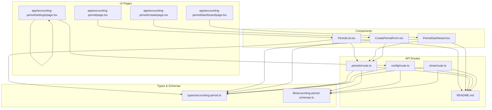
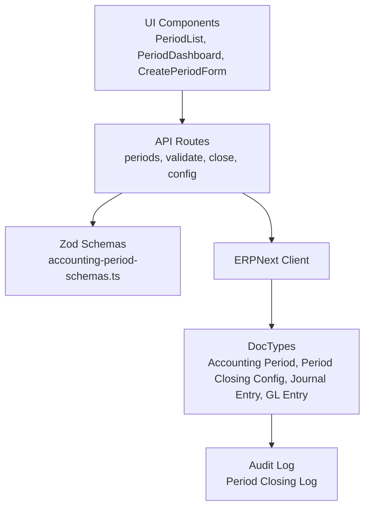
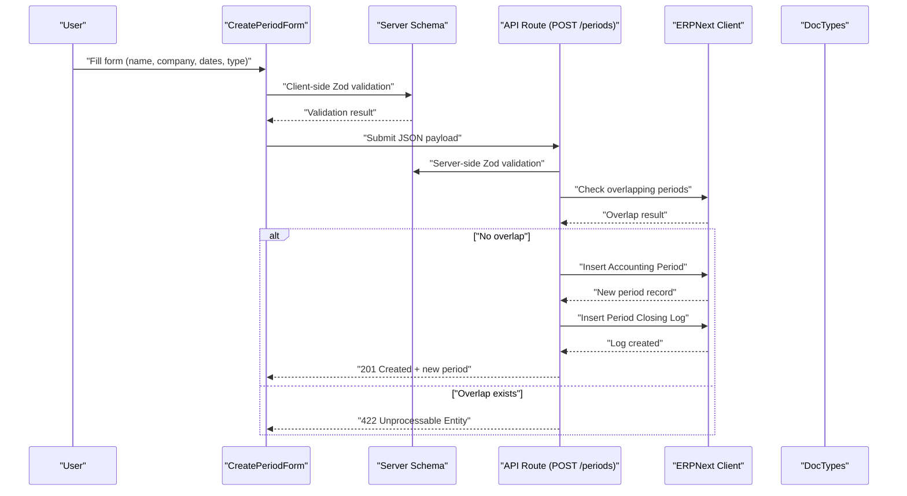
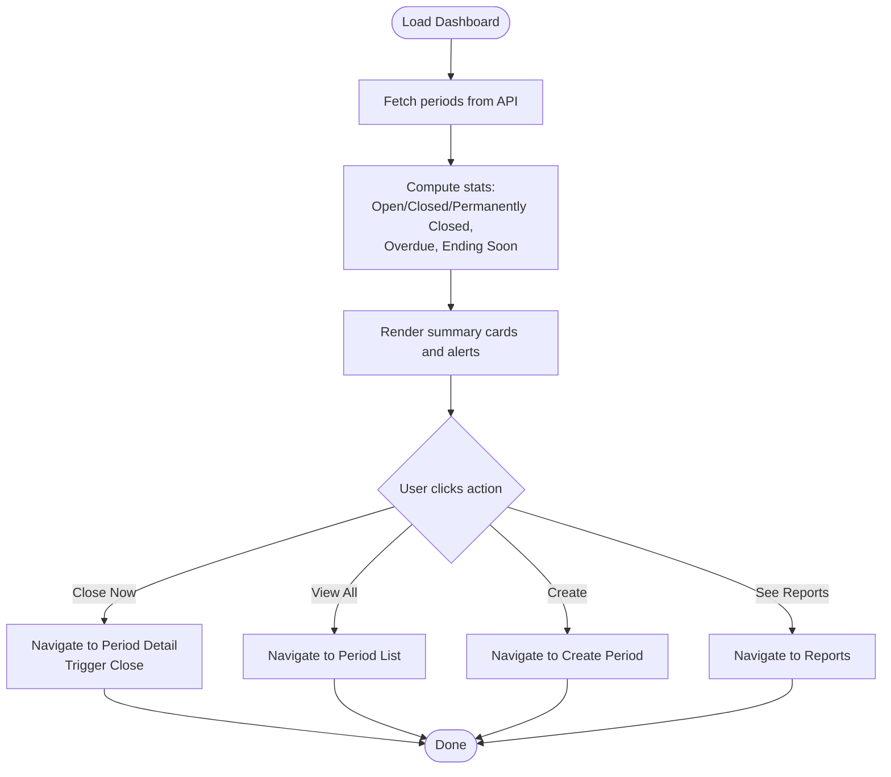
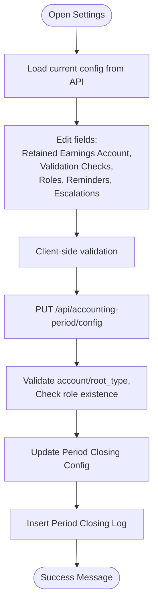
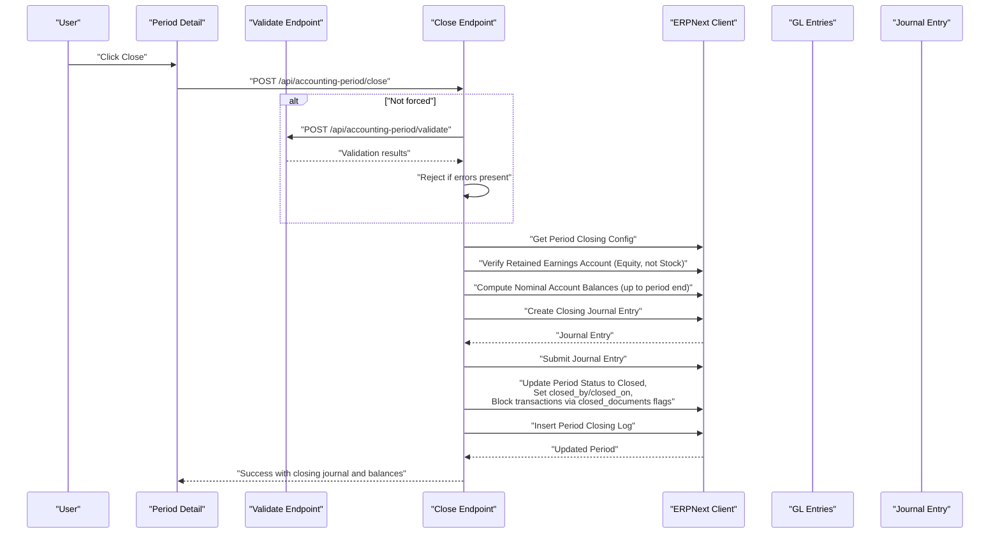
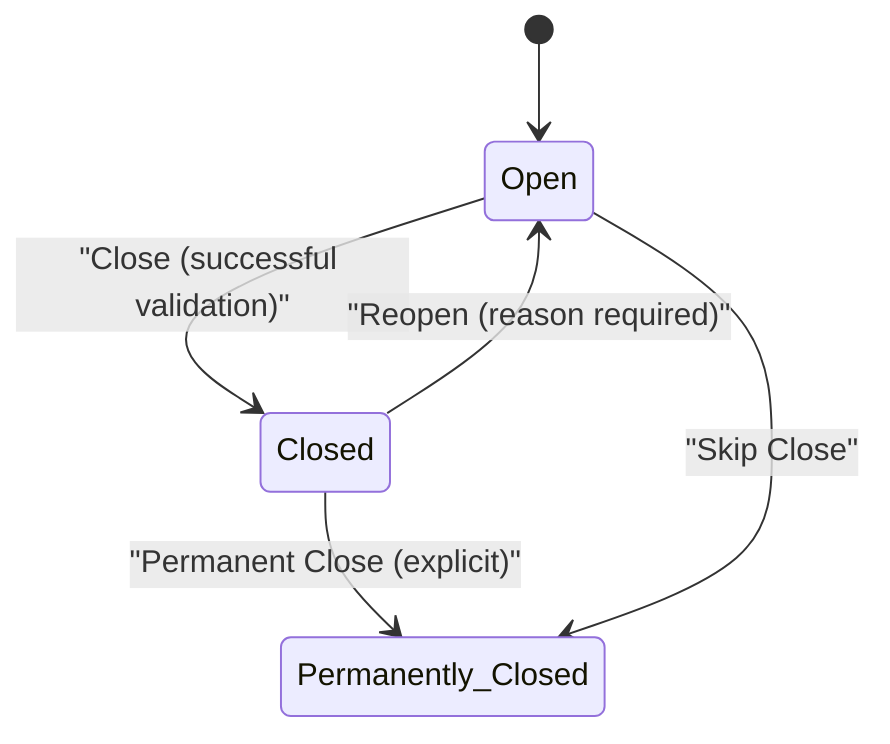
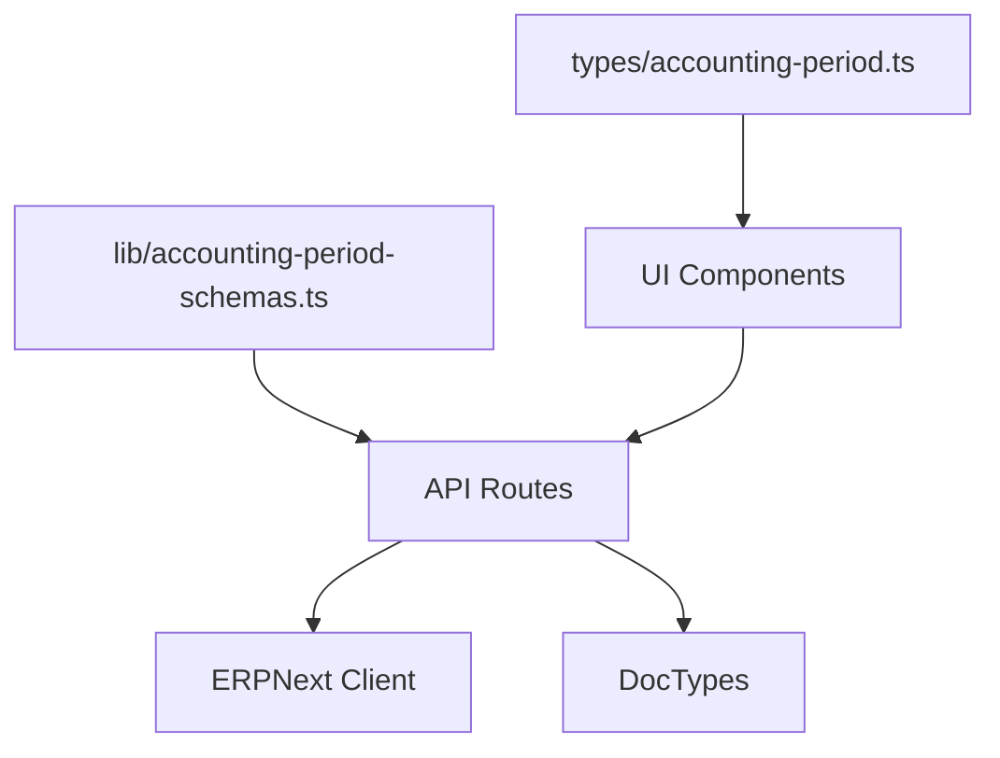

# Period Lifecycle Management

<cite>
**Referenced Files in This Document**
- [app/accounting-period/page.tsx](file://app/accounting-period/page.tsx)
- [app/accounting-period/dashboard/page.tsx](file://app/accounting-period/dashboard/page.tsx)
- [app/accounting-period/create/page.tsx](file://app/accounting-period/create/page.tsx)
- [app/accounting-period/settings/page.tsx](file://app/accounting-period/settings/page.tsx)
- [app/accounting-period/components/PeriodList.tsx](file://app/accounting-period/components/PeriodList.tsx)
- [app/accounting-period/components/PeriodDashboard.tsx](file://app/accounting-period/components/PeriodDashboard.tsx)
- [app/accounting-period/components/CreatePeriodForm.tsx](file://app/accounting-period/components/CreatePeriodForm.tsx)
- [types/accounting-period.ts](file://types/accounting-period.ts)
- [lib/accounting-period-schemas.ts](file://lib/accounting-period-schemas.ts)
- [app/api/accounting-period/README.md](file://app/api/accounting-period/README.md)
- [app/api/accounting-period/periods/route.ts](file://app/api/accounting-period/periods/route.ts)
- [app/api/accounting-period/config/route.ts](file://app/api/accounting-period/config/route.ts)
- [app/api/accounting-period/close/route.ts](file://app/api/accounting-period/close/route.ts)
</cite>

## Table of Contents
1. [Introduction](#introduction)
2. [Project Structure](#project-structure)
3. [Core Components](#core-components)
4. [Architecture Overview](#architecture-overview)
5. [Detailed Component Analysis](#detailed-component-analysis)
6. [Dependency Analysis](#dependency-analysis)
7. [Performance Considerations](#performance-considerations)
8. [Troubleshooting Guide](#troubleshooting-guide)
9. [Conclusion](#conclusion)
10. [Appendices](#appendices)

## Introduction
This document describes the Accounting Period Lifecycle Management system, covering the end-to-end lifecycle from period creation through permanent closure. It explains status transitions (Open, Closed, Permanently Closed), validation workflows, business rule enforcement, dashboard functionality, settings management, and configuration options. It also documents the relationship with ERPNext’s underlying period system, including naming conventions and validation rules, and provides practical examples and troubleshooting guidance.

## Project Structure
The system is organized around a Next.js app with dedicated pages and components for accounting periods, complemented by API routes that integrate with ERPNext. Key areas:
- UI pages: dashboard, list, creation, settings
- Components: reusable UI elements for lists, dashboards, forms
- Types: shared TypeScript interfaces for API requests/responses and domain models
- Schemas: Zod-based validation for request payloads
- API routes: backend endpoints for CRUD, validation, closing, configuration, and reporting

**Diagram sources**
- [app/accounting-period/page.tsx](file://app/accounting-period/page.tsx#L1-L8)
- [app/accounting-period/dashboard/page.tsx](file://app/accounting-period/dashboard/page.tsx#L1-L8)
- [app/accounting-period/create/page.tsx](file://app/accounting-period/create/page.tsx#L1-L27)
- [app/accounting-period/settings/page.tsx](file://app/accounting-period/settings/page.tsx#L1-L483)
- [app/accounting-period/components/PeriodList.tsx](file://app/accounting-period/components/PeriodList.tsx#L1-L483)
- [app/accounting-period/components/PeriodDashboard.tsx](file://app/accounting-period/components/PeriodDashboard.tsx#L1-L537)
- [app/accounting-period/components/CreatePeriodForm.tsx](file://app/accounting-period/components/CreatePeriodForm.tsx#L1-L352)
- [types/accounting-period.ts](file://types/accounting-period.ts#L1-L268)
- [lib/accounting-period-schemas.ts](file://lib/accounting-period-schemas.ts#L1-L191)
- [app/api/accounting-period/README.md](file://app/api/accounting-period/README.md#L1-L163)
- [app/api/accounting-period/periods/route.ts](file://app/api/accounting-period/periods/route.ts#L1-L183)
- [app/api/accounting-period/config/route.ts](file://app/api/accounting-period/config/route.ts#L1-L207)
- [app/api/accounting-period/close/route.ts](file://app/api/accounting-period/close/route.ts#L1-L644)

**Section sources**
- [app/accounting-period/page.tsx](file://app/accounting-period/page.tsx#L1-L8)
- [app/accounting-period/dashboard/page.tsx](file://app/accounting-period/dashboard/page.tsx#L1-L8)
- [app/accounting-period/create/page.tsx](file://app/accounting-period/create/page.tsx#L1-L27)
- [app/accounting-period/settings/page.tsx](file://app/accounting-period/settings/page.tsx#L1-L483)
- [app/accounting-period/components/PeriodList.tsx](file://app/accounting-period/components/PeriodList.tsx#L1-L483)
- [app/accounting-period/components/PeriodDashboard.tsx](file://app/accounting-period/components/PeriodDashboard.tsx#L1-L537)
- [app/accounting-period/components/CreatePeriodForm.tsx](file://app/accounting-period/components/CreatePeriodForm.tsx#L1-L352)
- [types/accounting-period.ts](file://types/accounting-period.ts#L1-L268)
- [lib/accounting-period-schemas.ts](file://lib/accounting-period-schemas.ts#L1-L191)
- [app/api/accounting-period/README.md](file://app/api/accounting-period/README.md#L1-L163)
- [app/api/accounting-period/periods/route.ts](file://app/api/accounting-period/periods/route.ts#L1-L183)
- [app/api/accounting-period/config/route.ts](file://app/api/accounting-period/config/route.ts#L1-L207)
- [app/api/accounting-period/close/route.ts](file://app/api/accounting-period/close/route.ts#L1-L644)

## Core Components
- PeriodList: Lists periods with filtering, sorting, pagination, and attention indicators for overdue or soon-ending periods.
- PeriodDashboard: Provides summary cards, urgent alerts, and quick actions for period management.
- CreatePeriodForm: Handles creation of new periods with client-side validation, company and fiscal year lookup, and date conversion.
- Settings/Config Page: Manages period closing configuration including validation checks, roles, reminders, escalations, and retained earnings account.
- API Endpoints: Provide CRUD, validation, closing, configuration retrieval/update, and reporting capabilities backed by ERPNext.

Key data models and types define period lifecycle states, closing logs, configurations, and validation results.

**Section sources**
- [app/accounting-period/components/PeriodList.tsx](file://app/accounting-period/components/PeriodList.tsx#L1-L483)
- [app/accounting-period/components/PeriodDashboard.tsx](file://app/accounting-period/components/PeriodDashboard.tsx#L1-L537)
- [app/accounting-period/components/CreatePeriodForm.tsx](file://app/accounting-period/components/CreatePeriodForm.tsx#L1-L352)
- [app/accounting-period/settings/page.tsx](file://app/accounting-period/settings/page.tsx#L1-L483)
- [types/accounting-period.ts](file://types/accounting-period.ts#L1-L268)

## Architecture Overview
The system follows a layered architecture:
- Presentation Layer: Next.js pages and components render UI and collect user input.
- Validation Layer: Zod schemas enforce request payload correctness on both client and server.
- Integration Layer: API routes use an ERPNext client to fetch companies, fiscal years, and manage Accounting Period documents.
- Business Logic Layer: Closing logic computes net income, creates journal entries, enforces cascading transfers, and updates period status.
- Persistence Layer: ERPNext DocTypes store periods, configurations, logs, and GL entries.

**Diagram sources**
- [app/accounting-period/components/PeriodList.tsx](file://app/accounting-period/components/PeriodList.tsx#L1-L483)
- [app/accounting-period/components/PeriodDashboard.tsx](file://app/accounting-period/components/PeriodDashboard.tsx#L1-L537)
- [app/accounting-period/components/CreatePeriodForm.tsx](file://app/accounting-period/components/CreatePeriodForm.tsx#L1-L352)
- [lib/accounting-period-schemas.ts](file://lib/accounting-period-schemas.ts#L1-L191)
- [app/api/accounting-period/periods/route.ts](file://app/api/accounting-period/periods/route.ts#L1-L183)
- [app/api/accounting-period/config/route.ts](file://app/api/accounting-period/config/route.ts#L1-L207)
- [app/api/accounting-period/close/route.ts](file://app/api/accounting-period/close/route.ts#L1-L644)

## Detailed Component Analysis

### Period Creation Workflow
The creation process validates inputs, prevents overlapping periods, and persists the new period in ERPNext while logging the event.

**Diagram sources**
- [app/accounting-period/components/CreatePeriodForm.tsx](file://app/accounting-period/components/CreatePeriodForm.tsx#L1-L352)
- [lib/accounting-period-schemas.ts](file://lib/accounting-period-schemas.ts#L106-L124)
- [app/api/accounting-period/periods/route.ts](file://app/api/accounting-period/periods/route.ts#L94-L183)

Practical example:
- Create a Monthly period for a company with start date before end date and ensure no overlapping periods exist.

Validation rules:
- Start date must be earlier than end date.
- Overlapping periods are rejected with details.
- Date format is normalized to YYYY-MM-DD internally.

**Section sources**
- [app/accounting-period/components/CreatePeriodForm.tsx](file://app/accounting-period/components/CreatePeriodForm.tsx#L1-L352)
- [lib/accounting-period-schemas.ts](file://lib/accounting-period-schemas.ts#L106-L124)
- [app/api/accounting-period/periods/route.ts](file://app/api/accounting-period/periods/route.ts#L105-L130)

### Period Dashboard Functionality
The dashboard aggregates statistics, highlights overdue and soon-ending periods, and provides quick actions.

**Diagram sources**
- [app/accounting-period/components/PeriodDashboard.tsx](file://app/accounting-period/components/PeriodDashboard.tsx#L1-L537)
- [app/api/accounting-period/periods/route.ts](file://app/api/accounting-period/periods/route.ts#L12-L92)

**Section sources**
- [app/accounting-period/components/PeriodDashboard.tsx](file://app/accounting-period/components/PeriodDashboard.tsx#L1-L537)

### Settings and Configuration Management
Settings allow configuring validation checks, roles, reminders, escalations, and the retained earnings account used in closing journals.

**Diagram sources**
- [app/accounting-period/settings/page.tsx](file://app/accounting-period/settings/page.tsx#L1-L483)
- [app/api/accounting-period/config/route.ts](file://app/api/accounting-period/config/route.ts#L61-L207)

Validation rules enforced by the API:
- Retained earnings account must be an Equity account and not a Stock account.
- Roles must exist in ERPNext.
- At least one field must be provided for updates.

**Section sources**
- [app/accounting-period/settings/page.tsx](file://app/accounting-period/settings/page.tsx#L1-L483)
- [app/api/accounting-period/config/route.ts](file://app/api/accounting-period/config/route.ts#L71-L131)

### Period Closing Workflow
The close operation runs validations (unless forced), verifies configuration, creates closing journal entries, calculates balances, and updates the period status.

**Diagram sources**
- [app/api/accounting-period/close/route.ts](file://app/api/accounting-period/close/route.ts#L11-L169)
- [app/api/accounting-period/README.md](file://app/api/accounting-period/README.md#L13-L101)

Key business rules:
- Only Open periods can be closed.
- Retained earnings account must be an Equity account and not a Stock account.
- Closing journal entries are created to zero nominal accounts and transfer net income/loss to the target account (with optional cascading).
- Transaction blocking is enforced by updating closed_documents flags.

**Section sources**
- [app/api/accounting-period/close/route.ts](file://app/api/accounting-period/close/route.ts#L11-L169)
- [app/api/accounting-period/README.md](file://app/api/accounting-period/README.md#L53-L101)

### Period Status Transitions
Supported statuses and transitions:
- Open → Closed: After successful validation and journal creation.
- Closed → Permanently Closed: Requires explicit permanent closure (not covered in current routes).
- Reopen: Requires a reason and appropriate permissions (not covered in current routes).

[No sources needed since this diagram shows conceptual workflow, not actual code structure]

## Dependency Analysis
The system exhibits clear separation of concerns:
- UI components depend on types and schemas for validation and data modeling.
- API routes depend on schemas for request validation and on the ERPNext client for persistence.
- Business logic for closing depends on GL entries aggregation and account validation.

**Diagram sources**
- [types/accounting-period.ts](file://types/accounting-period.ts#L1-L268)
- [lib/accounting-period-schemas.ts](file://lib/accounting-period-schemas.ts#L1-L191)
- [app/api/accounting-period/periods/route.ts](file://app/api/accounting-period/periods/route.ts#L1-L183)
- [app/api/accounting-period/config/route.ts](file://app/api/accounting-period/config/route.ts#L1-L207)
- [app/api/accounting-period/close/route.ts](file://app/api/accounting-period/close/route.ts#L1-L644)

**Section sources**
- [types/accounting-period.ts](file://types/accounting-period.ts#L1-L268)
- [lib/accounting-period-schemas.ts](file://lib/accounting-period-schemas.ts#L1-L191)
- [app/api/accounting-period/periods/route.ts](file://app/api/accounting-period/periods/route.ts#L1-L183)
- [app/api/accounting-period/config/route.ts](file://app/api/accounting-period/config/route.ts#L1-L207)
- [app/api/accounting-period/close/route.ts](file://app/api/accounting-period/close/route.ts#L1-L644)

## Performance Considerations
- Pagination and filtering: The list component supports pagination and server-side-like filtering/sorting to reduce payload sizes.
- Batch queries: Closing logic aggregates GL entries and account details in bulk to minimize round-trips.
- Memoization: Dashboard and list components use memoized computations for statistics and derived data.
- Client-side validation: Reduces unnecessary server calls by catching invalid inputs early.

[No sources needed since this section provides general guidance]

## Troubleshooting Guide
Common issues and resolutions:
- Overlapping periods during creation: Adjust dates or company association; the API returns details of the conflicting period.
- Validation failures before closing: Review validation results and resolve draft/unposted transactions, bank reconciliations, and module-specific requirements.
- Invalid retained earnings account: Ensure the account is an Equity account and not a Stock account; roles must exist in ERPNext.
- Permission denied for configuration changes: Verify user roles against configured closing/reopen roles.
- No closing journal created: Occurs when there are no nominal accounts with balances; this is expected behavior.

Practical examples:
- Example 1: A Monthly period cannot be closed if draft Journal Entries exist; resolve by submitting or canceling them.
- Example 2: If the retained earnings account is misconfigured, update it in Settings and reattempt closing.
- Example 3: If a period remains overdue, the dashboard highlights it; close it immediately to avoid further delays.

**Section sources**
- [app/api/accounting-period/periods/route.ts](file://app/api/accounting-period/periods/route.ts#L105-L130)
- [app/api/accounting-period/README.md](file://app/api/accounting-period/README.md#L53-L101)
- [app/api/accounting-period/config/route.ts](file://app/api/accounting-period/config/route.ts#L71-L131)
- [app/accounting-period/components/PeriodDashboard.tsx](file://app/accounting-period/components/PeriodDashboard.tsx#L140-L169)

## Conclusion
The Accounting Period Lifecycle Management system provides a robust, schema-driven approach to period creation, validation, closing, and configuration. It integrates tightly with ERPNext to ensure compliance with accounting standards, supports cascading profit transfers, and offers strong governance through roles and audit logs. By following the documented workflows and best practices, organizations can maintain accurate financial records and streamline their close processes.

[No sources needed since this section summarizes without analyzing specific files]

## Appendices

### Relationship to ERPNext’s Period System
- The system stores periods as ERPNext DocTypes and uses ERPNext client APIs for persistence and retrieval.
- Naming conventions: Period names are stored in the Accounting Period DocType; the UI displays both internal and human-readable names.
- Validation rules: The system enforces business rules such as date ordering, overlap detection, and equity account validation for retained earnings.

**Section sources**
- [app/api/accounting-period/periods/route.ts](file://app/api/accounting-period/periods/route.ts#L105-L142)
- [app/api/accounting-period/config/route.ts](file://app/api/accounting-period/config/route.ts#L71-L91)

### Best Practices for Period Management
- Configure validation checks aligned with organizational policies.
- Set reminders and escalations to prevent overdue periods.
- Use cascading profit accounts for multi-level profit accumulation.
- Regularly reconcile bank accounts and process all transactions before closing.
- Monitor dashboard alerts and address overdue periods promptly.

[No sources needed since this section provides general guidance]