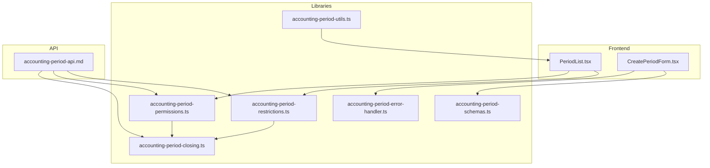
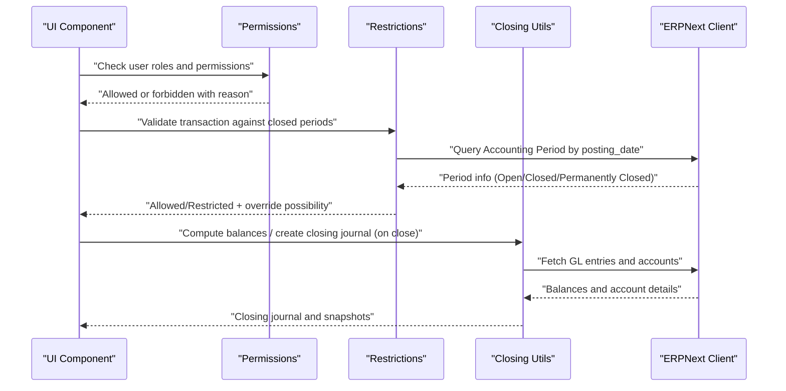
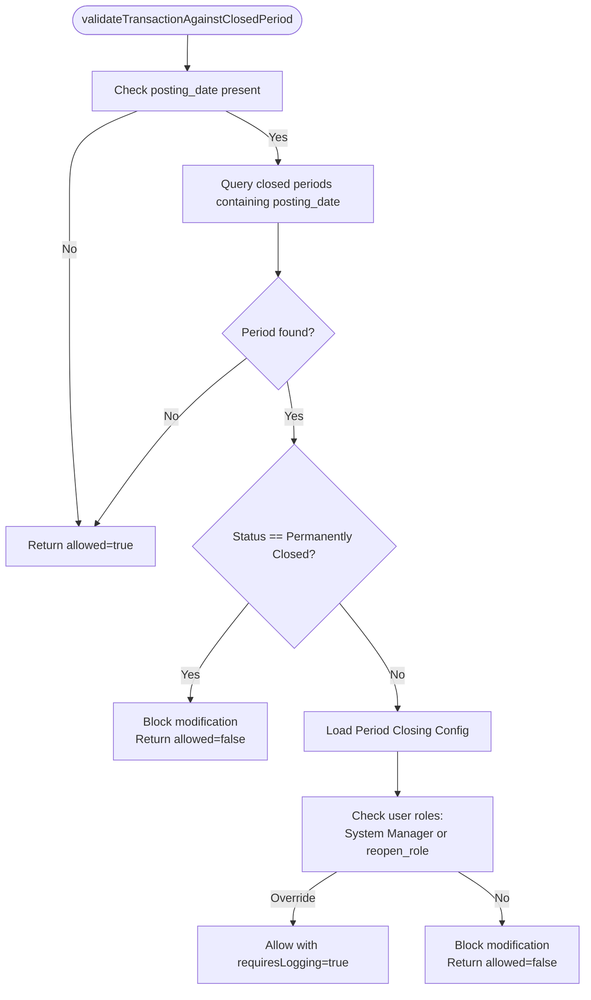
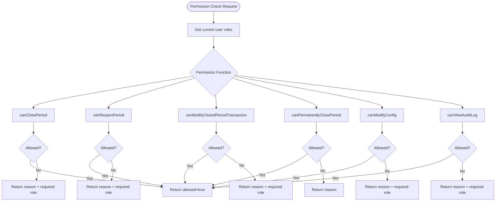
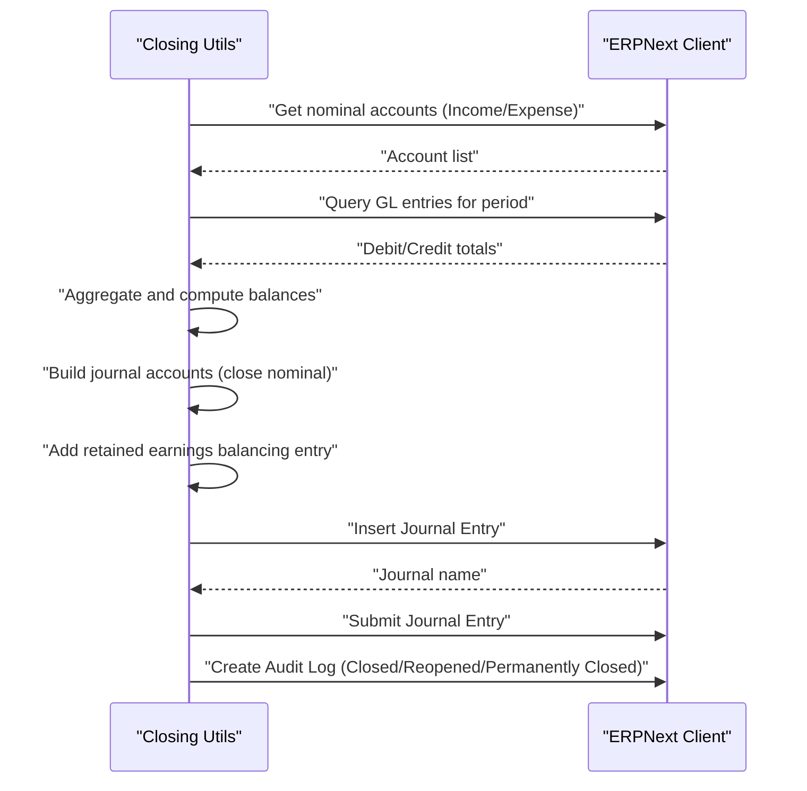
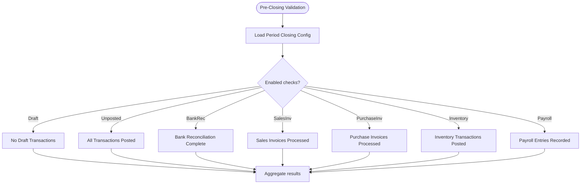
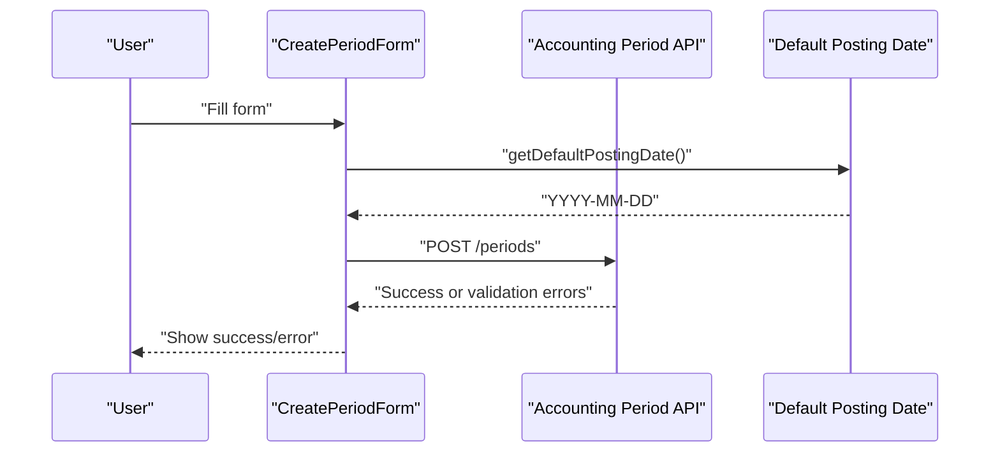
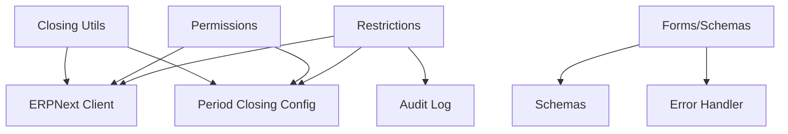

# Validation Workflows and Restrictions

<cite>
**Referenced Files in This Document**
- [accounting-period-restrictions.ts](file://lib/accounting-period-restrictions.ts)
- [accounting-period-permissions.ts](file://lib/accounting-period-permissions.ts)
- [accounting-period-closing.ts](file://lib/accounting-period-closing.ts)
- [accounting-period-schemas.ts](file://lib/accounting-period-schemas.ts)
- [accounting-period-error-handler.ts](file://lib/accounting-period-error-handler.ts)
- [accounting-period-utils.ts](file://utils/accounting-period-utils.ts)
- [accounting-period-api.md](file://docs/accounting-period/accounting-period-api.md)
- [PeriodList.tsx](file://app/accounting-period/components/PeriodList.tsx)
- [CreatePeriodForm.tsx](file://app/accounting-period/components/CreatePeriodForm.tsx)
- [accounting-period.ts](file://types/accounting-period.ts)
</cite>

## Table of Contents
1. [Introduction](#introduction)
2. [Project Structure](#project-structure)
3. [Core Components](#core-components)
4. [Architecture Overview](#architecture-overview)
5. [Detailed Component Analysis](#detailed-component-analysis)
6. [Dependency Analysis](#dependency-analysis)
7. [Performance Considerations](#performance-considerations)
8. [Troubleshooting Guide](#troubleshooting-guide)
9. [Conclusion](#conclusion)
10. [Appendices](#appendices)

## Introduction
This document explains the Validation Workflows and Restrictions system for Accounting Periods. It covers how the system enforces business rules during different period states, restricts unauthorized actions, validates transactions against closed periods, integrates with ERPNext’s permission model, and ensures compliance with period policies. It also documents configuration options, error handling, and practical guidance for troubleshooting and tuning validation behavior.

## Project Structure
The validation and restriction logic is implemented primarily in reusable libraries and integrated into the UI and API surfaces. Key areas:
- Restriction checking and transaction validation against closed periods
- Role-based access control for period operations
- Closing journal generation and audit logging
- Request/response schemas and error handling utilities
- Frontend components that trigger validation and display results
- API documentation that defines the operational contract

**Diagram sources**
- [PeriodList.tsx](file://app/accounting-period/components/PeriodList.tsx#L1-L483)
- [CreatePeriodForm.tsx](file://app/accounting-period/components/CreatePeriodForm.tsx#L1-L352)
- [accounting-period-restrictions.ts](file://lib/accounting-period-restrictions.ts#L1-L226)
- [accounting-period-permissions.ts](file://lib/accounting-period-permissions.ts#L1-L356)
- [accounting-period-closing.ts](file://lib/accounting-period-closing.ts#L1-L406)
- [accounting-period-schemas.ts](file://lib/accounting-period-schemas.ts#L1-L191)
- [accounting-period-error-handler.ts](file://lib/accounting-period-error-handler.ts#L1-L552)
- [accounting-period-utils.ts](file://utils/accounting-period-utils.ts#L1-L77)
- [accounting-period-api.md](file://docs/accounting-period/accounting-period-api.md#L1-L692)

**Section sources**
- [accounting-period-restrictions.ts](file://lib/accounting-period-restrictions.ts#L1-L226)
- [accounting-period-permissions.ts](file://lib/accounting-period-permissions.ts#L1-L356)
- [accounting-period-closing.ts](file://lib/accounting-period-closing.ts#L1-L406)
- [accounting-period-schemas.ts](file://lib/accounting-period-schemas.ts#L1-L191)
- [accounting-period-error-handler.ts](file://lib/accounting-period-error-handler.ts#L1-L552)
- [accounting-period-utils.ts](file://utils/accounting-period-utils.ts#L1-L77)
- [accounting-period-api.md](file://docs/accounting-period/accounting-period-api.md#L1-L692)
- [PeriodList.tsx](file://app/accounting-period/components/PeriodList.tsx#L1-L483)
- [CreatePeriodForm.tsx](file://app/accounting-period/components/CreatePeriodForm.tsx#L1-L352)

## Core Components
- Transaction Restriction Engine: Validates whether a transaction can be created/modified/deleted within closed or permanently closed periods and determines if administrator override is required.
- Permission Control Layer: Enforces role-based access for closing, reopening, permanent closure, configuration changes, and modifying transactions in closed periods.
- Closing Utilities: Computes nominal and real account balances, generates closing journal entries, calculates net income, and creates audit logs.
- Schemas and Validation: Strong typing for request/response bodies and runtime validation helpers.
- Error Handler: Centralized classification, user-friendly messages, retry logic, and structured error responses.
- Frontend Integration: UI components that call APIs and surface validation outcomes and restrictions.

**Section sources**
- [accounting-period-restrictions.ts](file://lib/accounting-period-restrictions.ts#L44-L131)
- [accounting-period-permissions.ts](file://lib/accounting-period-permissions.ts#L131-L283)
- [accounting-period-closing.ts](file://lib/accounting-period-closing.ts#L58-L247)
- [accounting-period-schemas.ts](file://lib/accounting-period-schemas.ts#L19-L191)
- [accounting-period-error-handler.ts](file://lib/accounting-period-error-handler.ts#L17-L552)
- [accounting-period-api.md](file://docs/accounting-period/accounting-period-api.md#L375-L403)

## Architecture Overview
The system orchestrates validation and restriction checks across three layers:
- Presentation/UI: Triggers validation and displays restriction warnings.
- Business Logic/Lib: Performs checks against closed periods, computes balances, and enforces RBAC.
- ERPNext Integration: Uses ERPNext client to query periods, GL entries, accounts, and create audit logs/journal entries.

**Diagram sources**
- [accounting-period-permissions.ts](file://lib/accounting-period-permissions.ts#L131-L283)
- [accounting-period-restrictions.ts](file://lib/accounting-period-restrictions.ts#L44-L131)
- [accounting-period-closing.ts](file://lib/accounting-period-closing.ts#L58-L247)
- [accounting-period-api.md](file://docs/accounting-period/accounting-period-api.md#L191-L293)

## Detailed Component Analysis

### Transaction Restriction Engine
Responsibilities:
- Determine if a transaction can proceed given the posting date and period status.
- Allow administrator override for closed periods with audit logging requirement.
- Provide restriction info and override capability indicators.

Key behaviors:
- If posting_date is missing, validation is skipped.
- If a closed or permanently closed period contains the posting_date, enforce restrictions.
- Permanently Closed periods block all modifications.
- Closed periods allow modifications only for users with override roles (System Manager or configured reopen role) and require logging.
- On validation errors, allow the operation to avoid blocking critical flows while capturing the error.

**Diagram sources**
- [accounting-period-restrictions.ts](file://lib/accounting-period-restrictions.ts#L44-L131)

**Section sources**
- [accounting-period-restrictions.ts](file://lib/accounting-period-restrictions.ts#L44-L131)
- [accounting-period-restrictions.ts](file://lib/accounting-period-restrictions.ts#L139-L158)
- [accounting-period-restrictions.ts](file://lib/accounting-period-restrictions.ts#L209-L225)

### Role-Based Access Control (RBAC)
Responsibilities:
- Enforce who can close/open/modify transactions in closed periods.
- Validate configuration changes and permanent closure.
- Provide middleware-style permission checks and user info retrieval.

Key permissions:
- Close Period: Requires System Manager or configured closing_role.
- Reopen Period: Requires System Manager or configured reopen_role.
- Modify Closed Period Transactions: Requires System Manager or reopen_role.
- Permanent Close: Only System Manager.
- Modify Config: System Manager or Accounts Manager.
- View Audit Logs: System Manager or Accounts Manager.

**Diagram sources**
- [accounting-period-permissions.ts](file://lib/accounting-period-permissions.ts#L131-L283)

**Section sources**
- [accounting-period-permissions.ts](file://lib/accounting-period-permissions.ts#L37-L86)
- [accounting-period-permissions.ts](file://lib/accounting-period-permissions.ts#L131-L283)

### Closing Journal Generation and Audit Logging
Responsibilities:
- Compute nominal account balances (Income/Expense) for a period.
- Generate a closing journal entry that zeroes nominal accounts and posts net income/loss to retained earnings.
- Calculate all account balances (real accounts) as of the period end date.
- Create audit log entries for period actions and transaction modifications in closed periods.

**Diagram sources**
- [accounting-period-closing.ts](file://lib/accounting-period-closing.ts#L58-L247)
- [accounting-period-closing.ts](file://lib/accounting-period-closing.ts#L366-L388)

**Section sources**
- [accounting-period-closing.ts](file://lib/accounting-period-closing.ts#L58-L142)
- [accounting-period-closing.ts](file://lib/accounting-period-closing.ts#L159-L247)
- [accounting-period-closing.ts](file://lib/accounting-period-closing.ts#L278-L358)
- [accounting-period-closing.ts](file://lib/accounting-period-closing.ts#L366-L388)

### Validation Checks and Pre-Closing Requirements
Pre-closing validations (configurable):
- No Draft Transactions
- All Transactions Posted
- Bank Reconciliation Complete
- Sales Invoices Processed
- Purchase Invoices Processed
- Inventory Transactions Posted
- Payroll Entries Recorded

These checks are surfaced via the validation endpoint and influence whether a period can be closed. Administrators can optionally bypass validations using a force flag (subject to permissions).

**Diagram sources**
- [accounting-period-api.md](file://docs/accounting-period/accounting-period-api.md#L191-L242)

**Section sources**
- [accounting-period-api.md](file://docs/accounting-period/accounting-period-api.md#L191-L242)

### Frontend Integration and User Experience
- PeriodList displays periods with status badges and overdue indicators, linking to detail pages.
- CreatePeriodForm performs client-side validation and submits to the API, handling server-side validation errors.
- Default posting date helper selects the start date of the latest open period for convenience.

**Diagram sources**
- [CreatePeriodForm.tsx](file://app/accounting-period/components/CreatePeriodForm.tsx#L106-L165)
- [accounting-period-utils.ts](file://utils/accounting-period-utils.ts#L5-L36)

**Section sources**
- [PeriodList.tsx](file://app/accounting-period/components/PeriodList.tsx#L30-L180)
- [CreatePeriodForm.tsx](file://app/accounting-period/components/CreatePeriodForm.tsx#L1-L352)
- [accounting-period-utils.ts](file://utils/accounting-period-utils.ts#L1-L77)

## Dependency Analysis
- Restrictions depend on:
  - ERPNext client for querying periods and GL entries
  - Permissions configuration for override roles
  - Audit logging for closed period modifications
- Permissions depend on:
  - Current user session and roles
  - Period Closing Config for role names
- Closing utilities depend on:
  - GL entries and account master data
  - Retained earnings account configuration
- Schemas and error handler support:
  - Strong typing and validation for all API interactions
  - Centralized error classification and retry logic

**Diagram sources**
- [accounting-period-restrictions.ts](file://lib/accounting-period-restrictions.ts#L10-L12)
- [accounting-period-permissions.ts](file://lib/accounting-period-permissions.ts#L14-L15)
- [accounting-period-closing.ts](file://lib/accounting-period-closing.ts#L10-L10)
- [accounting-period-schemas.ts](file://lib/accounting-period-schemas.ts#L1-L3)
- [accounting-period-error-handler.ts](file://lib/accounting-period-error-handler.ts#L11-L11)

**Section sources**
- [accounting-period-restrictions.ts](file://lib/accounting-period-restrictions.ts#L10-L12)
- [accounting-period-permissions.ts](file://lib/accounting-period-permissions.ts#L14-L15)
- [accounting-period-closing.ts](file://lib/accounting-period-closing.ts#L10-L10)
- [accounting-period-schemas.ts](file://lib/accounting-period-schemas.ts#L1-L3)
- [accounting-period-error-handler.ts](file://lib/accounting-period-error-handler.ts#L11-L11)

## Performance Considerations
- Restriction checks:
  - Single query to Accounting Period with date-range filters; limit to one record to reduce overhead.
  - Graceful degradation on errors to avoid blocking user operations.
- Closing journal computation:
  - Two-pass aggregation over GL entries; ensure limits are applied to avoid large result sets.
  - Map-based accumulation minimizes repeated queries.
- Frontend:
  - Client-side validation reduces unnecessary API calls.
  - Debounced or deferred computations for large lists.

[No sources needed since this section provides general guidance]

## Troubleshooting Guide
Common scenarios and resolutions:
- Validation failures:
  - Review validation results returned by the validation endpoint to identify failing checks (draft/unposted transactions, unreconciled bank accounts, etc.).
  - Address underlying documents before attempting to close again.
- Restriction errors:
  - If a period is closed, either reopen it (with proper authorization) or use administrator override if permitted.
  - Verify the posting_date falls within the correct period.
- Permission denials:
  - Confirm the user has the required role (closing_role/reopen_role/System Manager) as configured.
  - Use the permission middleware helpers to diagnose role mismatches.
- Audit trail:
  - Use the audit log endpoint to track who modified transactions in closed periods and why.
- Error handling:
  - Centralized error handler classifies and returns user-friendly messages; inspect details for deeper context.
  - For transient network errors, leverage retry logic.

**Section sources**
- [accounting-period-api.md](file://docs/accounting-period/accounting-period-api.md#L191-L242)
- [accounting-period-api.md](file://docs/accounting-period/accounting-period-api.md#L375-L403)
- [accounting-period-error-handler.ts](file://lib/accounting-period-error-handler.ts#L172-L299)
- [accounting-period-error-handler.ts](file://lib/accounting-period-error-handler.ts#L338-L380)

## Conclusion
The Accounting Period Validation and Restrictions system enforces robust business controls by combining transaction restriction checks, role-based access control, configurable pre-closing validations, and comprehensive audit logging. It integrates tightly with ERPNext’s permission model and provides clear feedback to users through the UI and API. Proper configuration of roles and validation toggles ensures compliance with organizational policies while maintaining operational flexibility.

[No sources needed since this section summarizes without analyzing specific files]

## Appendices

### Configuration Options
- Enable/disable specific pre-closing validations (draft, unposted, bank reconciliation, sales/purchase invoices, inventory, payroll).
- Configure closing and reopen roles.
- Set reminders and escalations around period end dates.
- Define retained earnings account for closing journal entries.

**Section sources**
- [accounting-period.ts](file://types/accounting-period.ts#L44-L65)
- [accounting-period-api.md](file://docs/accounting-period/accounting-period-api.md#L546-L607)

### API Reference Highlights
- Validate Period: Runs pre-closing checks and returns aggregated results.
- Close Period: Creates closing journal, updates status, logs audit, and notifies stakeholders.
- Check Restriction: Determines if a transaction can be created/modified on a given date.
- Audit Log: Retrieves closed period actions and transaction modifications.

**Section sources**
- [accounting-period-api.md](file://docs/accounting-period/accounting-period-api.md#L191-L293)
- [accounting-period-api.md](file://docs/accounting-period/accounting-period-api.md#L375-L403)
- [accounting-period-api.md](file://docs/accounting-period/accounting-period-api.md#L501-L543)