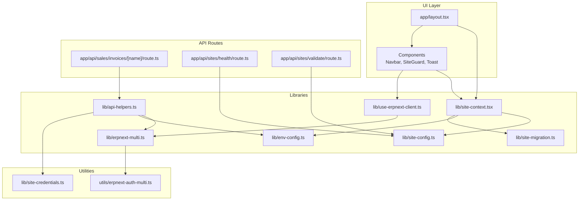
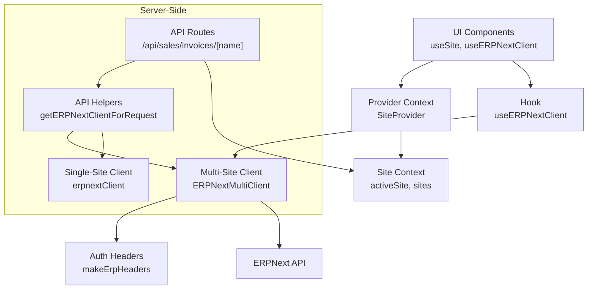
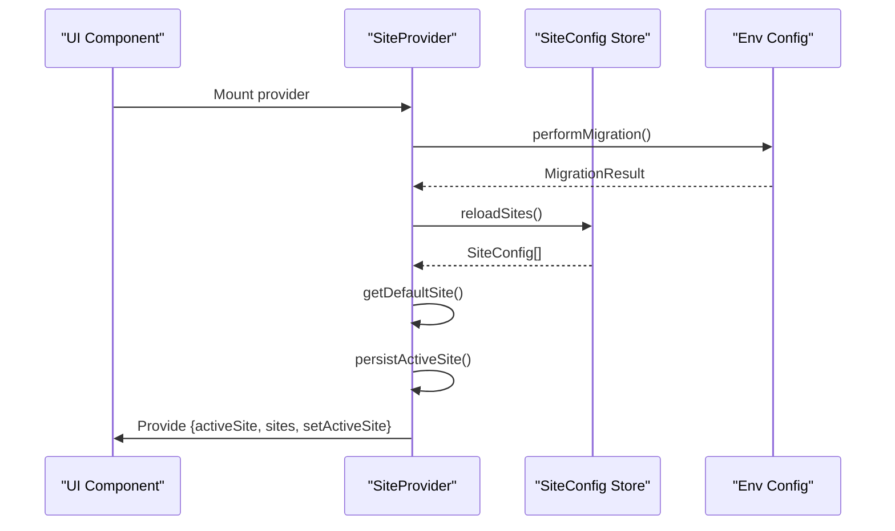
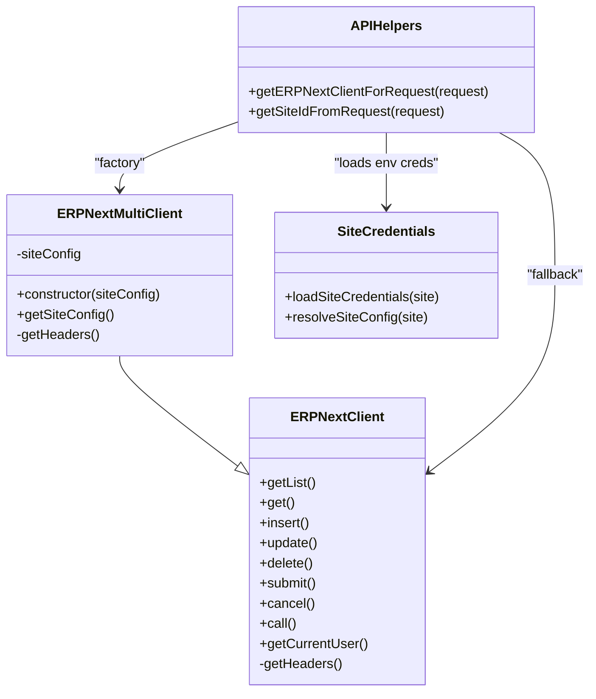
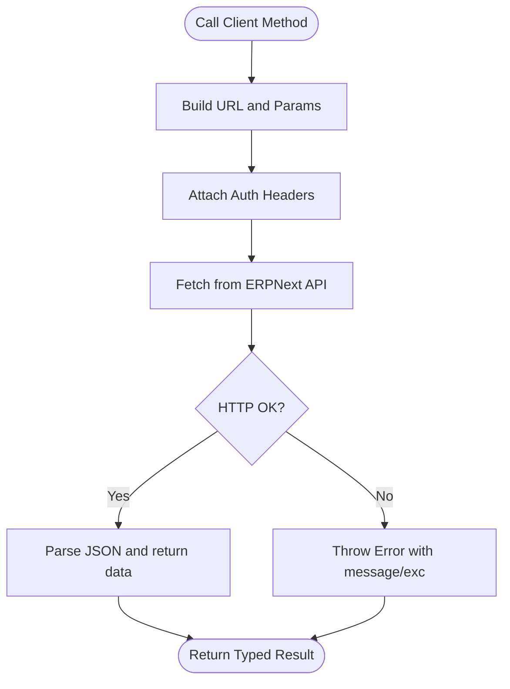
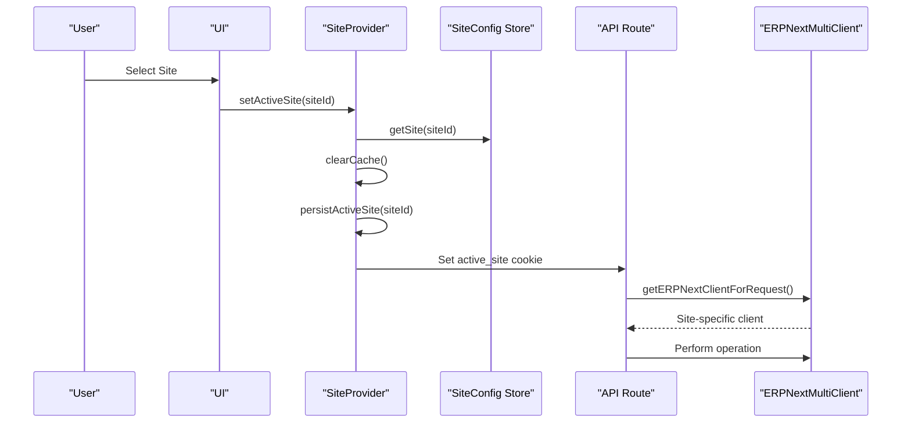
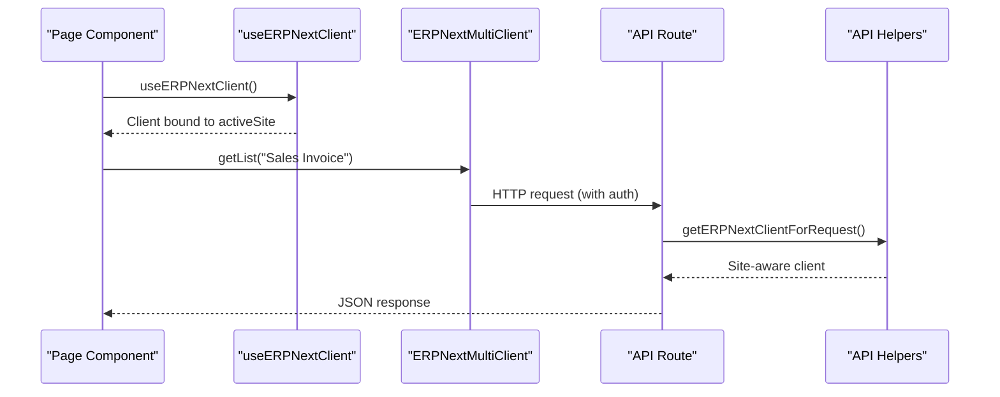
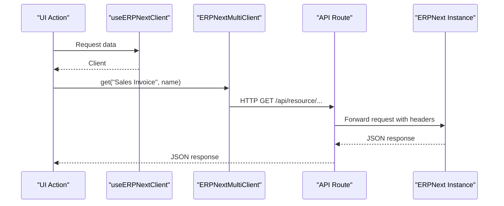
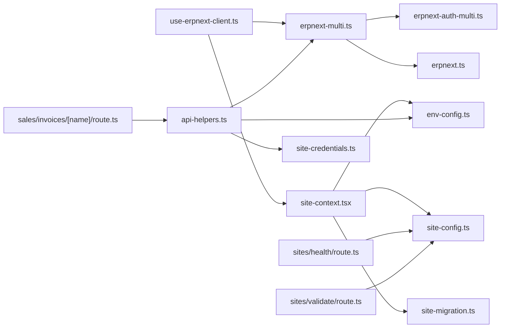

# Architecture Overview

<cite>
**Referenced Files in This Document**
- [site-context.tsx](file://lib/site-context.tsx)
- [use-erpnext-client.ts](file://lib/use-erpnext-client.ts)
- [erpnext.ts](file://lib/erpnext.ts)
- [erpnext-multi.ts](file://lib/erpnext-multi.ts)
- [site-config.ts](file://lib/site-config.ts)
- [env-config.ts](file://lib/env-config.ts)
- [api-helpers.ts](file://lib/api-helpers.ts)
- [site-credentials.ts](file://lib/site-credentials.ts)
- [erpnext-auth-multi.ts](file://utils/erpnext-auth-multi.ts)
- [site-migration.ts](file://lib/site-migration.ts)
- [layout.tsx](file://app/layout.tsx)
- [route.ts](file://app/api/sales/invoices/[name]/route.ts)
- [route.ts](file://app/api/sites/health/route.ts)
- [route.ts](file://app/api/sites/validate/route.ts)
</cite>

## Table of Contents
1. [Introduction](#introduction)
2. [Project Structure](#project-structure)
3. [Core Components](#core-components)
4. [Architecture Overview](#architecture-overview)
5. [Detailed Component Analysis](#detailed-component-analysis)
6. [Dependency Analysis](#dependency-analysis)
7. [Performance Considerations](#performance-considerations)
8. [Troubleshooting Guide](#troubleshooting-guide)
9. [Conclusion](#conclusion)

## Introduction
This document describes the architecture of the ERP Next System with a focus on multi-site capabilities, state management, client instantiation, and data access patterns. The system follows a layered architecture separating UI components, business logic, API integration, and data persistence. It leverages:
- Provider pattern for site state management
- Factory pattern for client instantiation
- Repository-like abstraction for data access
- Strong TypeScript interfaces to define contracts across layers
- Site-aware authentication and configuration management

## Project Structure
The system is organized into:
- UI layer (Next.js app directory) with pages, components, and guards
- API routes (Next.js app/api) implementing site-aware handlers
- Shared libraries (lib) for configuration, site context, clients, and helpers
- Utilities (utils) for authentication and shared logic
- Types (types) for strict contracts

**Diagram sources**
- [layout.tsx](file://app/layout.tsx#L30-L53)
- [site-context.tsx](file://lib/site-context.tsx#L59-L336)
- [use-erpnext-client.ts](file://lib/use-erpnext-client.ts#L40-L55)
- [erpnext-multi.ts](file://lib/erpnext-multi.ts#L24-L92)
- [api-helpers.ts](file://lib/api-helpers.ts#L59-L103)
- [site-config.ts](file://lib/site-config.ts#L97-L122)
- [env-config.ts](file://lib/env-config.ts#L264-L302)
- [site-migration.ts](file://lib/site-migration.ts#L80-L157)
- [erpnext-auth-multi.ts](file://utils/erpnext-auth-multi.ts#L34-L98)
- [site-credentials.ts](file://lib/site-credentials.ts#L25-L73)
- [route.ts](file://app/api/sales/invoices/[name]/route.ts#L9-L48)
- [route.ts](file://app/api/sites/health/route.ts#L26-L91)
- [route.ts](file://app/api/sites/validate/route.ts#L8-L44)

**Section sources**
- [layout.tsx](file://app/layout.tsx#L30-L53)

## Core Components
- Site Context Provider: Manages active site selection, persistence, and switching with localStorage and cookies. See [site-context.tsx](file://lib/site-context.tsx#L59-L336).
- Multi-Site Client: Extends the base client with site-specific URLs and authentication headers. See [erpnext-multi.ts](file://lib/erpnext-multi.ts#L24-L92).
- Single-Site Client: Base client for legacy or unified environments. See [erpnext.ts](file://lib/erpnext.ts#L18-L324).
- Site Configuration Store: CRUD and validation for site configurations with localStorage persistence. See [site-config.ts](file://lib/site-config.ts#L97-L322).
- Environment Configuration: Parses and validates multi-site and legacy configurations, with migration support. See [env-config.ts](file://lib/env-config.ts#L264-L342).
- API Helpers: Extracts site context from requests and builds site-aware clients and error responses. See [api-helpers.ts](file://lib/api-helpers.ts#L59-L156).
- Site Credentials Loader: Loads per-site credentials from environment variables. See [site-credentials.ts](file://lib/site-credentials.ts#L25-L73).
- Authentication Utilities: Builds headers and manages site-scoped session cookies. See [erpnext-auth-multi.ts](file://utils/erpnext-auth-multi.ts#L34-L98).
- Site Migration: Detects and migrates legacy configuration to multi-site. See [site-migration.ts](file://lib/site-migration.ts#L80-L157).
- UI Integration: Provider wiring and client hook for components. See [layout.tsx](file://app/layout.tsx#L38-L49) and [use-erpnext-client.ts](file://lib/use-erpnext-client.ts#L40-L55).

**Section sources**
- [site-context.tsx](file://lib/site-context.tsx#L59-L336)
- [erpnext-multi.ts](file://lib/erpnext-multi.ts#L24-L92)
- [erpnext.ts](file://lib/erpnext.ts#L18-L324)
- [site-config.ts](file://lib/site-config.ts#L97-L322)
- [env-config.ts](file://lib/env-config.ts#L264-L342)
- [api-helpers.ts](file://lib/api-helpers.ts#L59-L156)
- [site-credentials.ts](file://lib/site-credentials.ts#L25-L73)
- [erpnext-auth-multi.ts](file://utils/erpnext-auth-multi.ts#L34-L98)
- [site-migration.ts](file://lib/site-migration.ts#L80-L157)
- [layout.tsx](file://app/layout.tsx#L38-L49)
- [use-erpnext-client.ts](file://lib/use-erpnext-client.ts#L40-L55)

## Architecture Overview
The system implements a layered architecture:
- UI Layer: Pages and components consume site context and use the client hook to access ERPNext APIs.
- Business Logic Layer: API routes encapsulate site-aware logic, error handling, and response formatting.
- Integration Layer: Clients (single-site and multi-site) abstract HTTP calls and authentication.
- Persistence Layer: Site configurations are persisted in localStorage with environment-backed validation and migration.

**Diagram sources**
- [layout.tsx](file://app/layout.tsx#L38-L49)
- [site-context.tsx](file://lib/site-context.tsx#L59-L336)
- [use-erpnext-client.ts](file://lib/use-erpnext-client.ts#L40-L55)
- [erpnext-multi.ts](file://lib/erpnext-multi.ts#L24-L92)
- [erpnext-auth-multi.ts](file://utils/erpnext-auth-multi.ts#L34-L98)
- [route.ts](file://app/api/sales/invoices/[name]/route.ts#L9-L48)
- [api-helpers.ts](file://lib/api-helpers.ts#L59-L103)
- [erpnext.ts](file://lib/erpnext.ts#L18-L324)

## Detailed Component Analysis

### Provider Pattern for State Management
The SiteProvider manages site state, persistence, and switching. It:
- Initializes sites from storage or environment
- Supports migration from legacy configuration
- Persists active site to localStorage and sets a cookie for API routes
- Clears caches on site switches to prevent data leakage

**Diagram sources**
- [site-context.tsx](file://lib/site-context.tsx#L190-L320)
- [site-migration.ts](file://lib/site-migration.ts#L80-L157)
- [site-config.ts](file://lib/site-config.ts#L110-L114)
- [env-config.ts](file://lib/env-config.ts#L264-L302)

**Section sources**
- [site-context.tsx](file://lib/site-context.tsx#L59-L336)
- [site-migration.ts](file://lib/site-migration.ts#L80-L157)
- [site-config.ts](file://lib/site-config.ts#L97-L122)
- [env-config.ts](file://lib/env-config.ts#L264-L302)

### Factory Pattern for Client Instantiation
The system uses a factory-style approach to create site-aware clients:
- A hook creates a multi-site client bound to the active site
- API helpers choose between multi-site and single-site clients based on request context
- Authentication headers are generated per site

**Diagram sources**
- [erpnext.ts](file://lib/erpnext.ts#L18-L324)
- [erpnext-multi.ts](file://lib/erpnext-multi.ts#L24-L92)
- [api-helpers.ts](file://lib/api-helpers.ts#L59-L103)
- [site-credentials.ts](file://lib/site-credentials.ts#L25-L73)

**Section sources**
- [use-erpnext-client.ts](file://lib/use-erpnext-client.ts#L40-L55)
- [api-helpers.ts](file://lib/api-helpers.ts#L59-L103)
- [erpnext-multi.ts](file://lib/erpnext-multi.ts#L78-L92)
- [erpnext-auth-multi.ts](file://utils/erpnext-auth-multi.ts#L34-L98)

### Repository Pattern for Data Access
The system abstracts data access behind client methods that:
- Encapsulate HTTP calls to ERPNext endpoints
- Normalize query parameters and error responses
- Provide typed methods for CRUD operations and custom calls

**Diagram sources**
- [erpnext.ts](file://lib/erpnext.ts#L32-L186)

**Section sources**
- [erpnext.ts](file://lib/erpnext.ts#L18-L324)

### Multi-Site Architecture: Site Context Provider
The multi-site design centers around:
- Site configuration model with ID, name, display name, URL, and credentials
- Site-aware authentication with API key precedence and session cookie fallback
- Server-side validation and health checks
- Seamless switching with cache clearing and cookie propagation

**Diagram sources**
- [site-context.tsx](file://lib/site-context.tsx#L152-L184)
- [site-config.ts](file://lib/site-config.ts#L119-L122)
- [api-helpers.ts](file://lib/api-helpers.ts#L59-L103)
- [erpnext-auth-multi.ts](file://utils/erpnext-auth-multi.ts#L54-L72)

**Section sources**
- [site-context.tsx](file://lib/site-context.tsx#L59-L336)
- [site-config.ts](file://lib/site-config.ts#L97-L122)
- [api-helpers.ts](file://lib/api-helpers.ts#L30-L103)
- [erpnext-auth-multi.ts](file://utils/erpnext-auth-multi.ts#L54-L72)

### Component Interaction Patterns
- UI components depend on SiteProvider via a custom hook to access active site and client
- API routes extract site context from headers or cookies and delegate to site-aware clients
- Error responses include site context for easier debugging

**Diagram sources**
- [use-erpnext-client.ts](file://lib/use-erpnext-client.ts#L40-L55)
- [route.ts](file://app/api/sales/invoices/[name]/route.ts#L31-L41)
- [api-helpers.ts](file://lib/api-helpers.ts#L59-L103)

**Section sources**
- [layout.tsx](file://app/layout.tsx#L38-L49)
- [use-erpnext-client.ts](file://lib/use-erpnext-client.ts#L40-L55)
- [route.ts](file://app/api/sales/invoices/[name]/route.ts#L9-L48)

### Data Flow: User Actions Through API Routes to ERPNext Instances
- UI triggers an action (e.g., fetching a Sales Invoice)
- The hook resolves a site-aware client
- The API route extracts site context and invokes the client
- The client builds headers and performs the HTTP call to the ERPNext instance

**Diagram sources**
- [use-erpnext-client.ts](file://lib/use-erpnext-client.ts#L40-L55)
- [route.ts](file://app/api/sales/invoices/[name]/route.ts#L34-L41)
- [erpnext-multi.ts](file://lib/erpnext-multi.ts#L24-L69)

**Section sources**
- [use-erpnext-client.ts](file://lib/use-erpnext-client.ts#L40-L55)
- [route.ts](file://app/api/sales/invoices/[name]/route.ts#L9-L48)
- [erpnext-multi.ts](file://lib/erpnext-multi.ts#L24-L69)

## Dependency Analysis
The following diagram highlights key dependencies among core modules:

**Diagram sources**
- [site-context.tsx](file://lib/site-context.tsx#L59-L336)
- [site-config.ts](file://lib/site-config.ts#L97-L322)
- [env-config.ts](file://lib/env-config.ts#L264-L342)
- [site-migration.ts](file://lib/site-migration.ts#L80-L157)
- [use-erpnext-client.ts](file://lib/use-erpnext-client.ts#L40-L55)
- [erpnext-multi.ts](file://lib/erpnext-multi.ts#L24-L92)
- [erpnext-auth-multi.ts](file://utils/erpnext-auth-multi.ts#L34-L98)
- [erpnext.ts](file://lib/erpnext.ts#L18-L324)
- [api-helpers.ts](file://lib/api-helpers.ts#L59-L103)
- [site-credentials.ts](file://lib/site-credentials.ts#L25-L73)
- [route.ts](file://app/api/sites/health/route.ts#L26-L91)
- [route.ts](file://app/api/sites/validate/route.ts#L8-L44)
- [route.ts](file://app/api/sales/invoices/[name]/route.ts#L9-L48)

**Section sources**
- [site-context.tsx](file://lib/site-context.tsx#L59-L336)
- [use-erpnext-client.ts](file://lib/use-erpnext-client.ts#L40-L55)
- [erpnext-multi.ts](file://lib/erpnext-multi.ts#L24-L92)
- [api-helpers.ts](file://lib/api-helpers.ts#L59-L103)

## Performance Considerations
- Client memoization: The client hook memoizes the client instance per active site to avoid recreating clients on every render. See [use-erpnext-client.ts](file://lib/use-erpnext-client.ts#L44-L52).
- Parallel site health checks: Health API routes check multiple sites concurrently with timeouts to prevent blocking. See [route.ts](file://app/api/sites/health/route.ts#L41-L76).
- Cache clearing on site switch: Ensures stale data is not reused across sites. See [site-context.tsx](file://lib/site-context.tsx#L112-L122).
- Retry on timestamp mismatch: Submit/cancel operations retry on transient errors with incremental backoff. See [erpnext.ts](file://lib/erpnext.ts#L194-L231).

[No sources needed since this section provides general guidance]

## Troubleshooting Guide
- Site-aware error responses: API helpers classify and enrich errors with site context for easier debugging. See [api-helpers.ts](file://lib/api-helpers.ts#L114-L156).
- Logging site-specific errors: Centralized logging function records context, siteId, and stack traces. See [api-helpers.ts](file://lib/api-helpers.ts#L167-L185).
- Site validation and health: Server-side validation avoids CORS issues and provides structured results. See [route.ts](file://app/api/sites/validate/route.ts#L8-L44) and [route.ts](file://app/api/sites/health/route.ts#L26-L91).
- Migration status: Migration utility tracks completion and errors to avoid repeated migrations. See [site-migration.ts](file://lib/site-migration.ts#L80-L157).

**Section sources**
- [api-helpers.ts](file://lib/api-helpers.ts#L114-L185)
- [route.ts](file://app/api/sites/validate/route.ts#L8-L44)
- [route.ts](file://app/api/sites/health/route.ts#L26-L91)
- [site-migration.ts](file://lib/site-migration.ts#L80-L157)

## Conclusion
The ERP Next System employs a robust, layered architecture that cleanly separates concerns:
- Provider pattern centralizes site state and lifecycle
- Factory pattern enables flexible client creation per site
- Repository-like clients encapsulate data access and error handling
- Strong TypeScript interfaces ensure contract integrity across layers
- Multi-site design isolates authentication, configuration, and data through site context, cookies, and environment-driven credentials

These architectural decisions improve scalability (parallel site checks, memoized clients), maintainability (centralized helpers, validation, and logging), and operability (site-aware error handling and health checks).