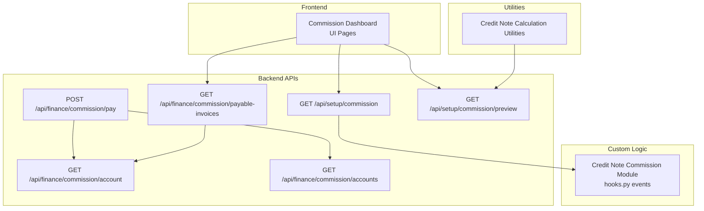
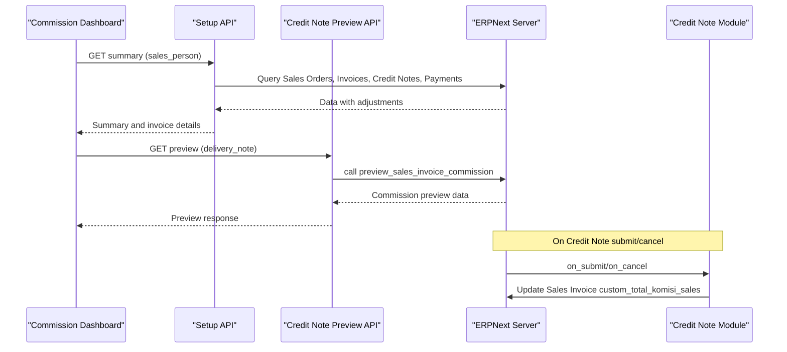
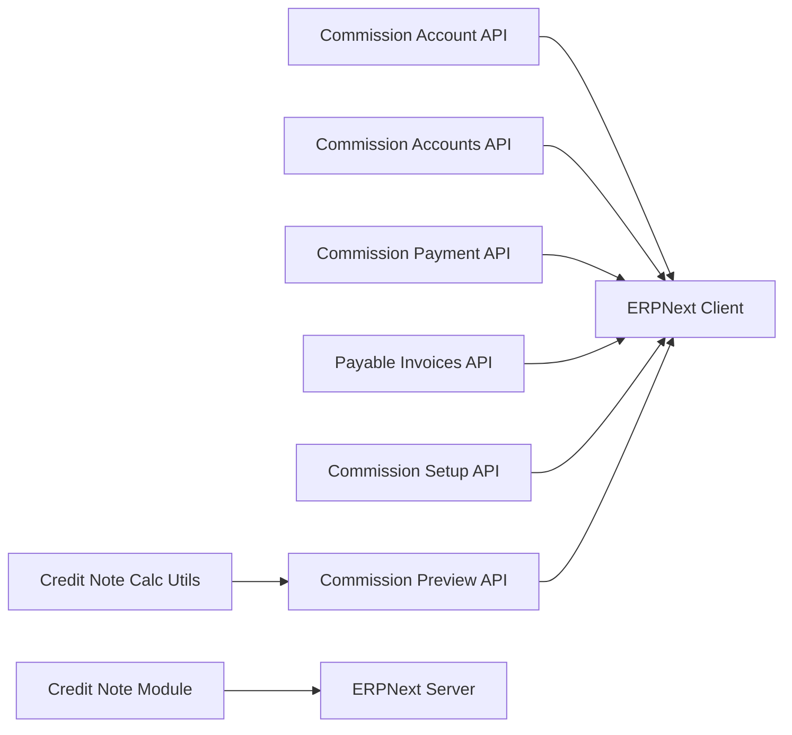

# Commission Processing System

<cite>
**Referenced Files in This Document**
- [route.ts](file://app/api/finance/commission/account/route.ts)
- [route.ts](file://app/api/finance/commission/accounts/route.ts)
- [route.ts](file://app/api/finance/commission/pay/route.ts)
- [route.ts](file://app/api/finance/commission/payable-invoices/route.ts)
- [route.ts](file://app/api/setup/commission/route.ts)
- [route.ts](file://app/api/setup/commission/preview/route.ts)
- [credit_note_commission.py](file://erpnext_custom/credit_note_commission.py)
- [test_credit_note_commission.py](file://erpnext_custom/tests/test_credit_note_commission.py)
- [commission-credit-note-integration.test.ts](file://tests/commission-credit-note-integration.test.ts)
- [credit-note-calculation.ts](file://lib/credit-note-calculation.ts)
- [CREDIT_NOTE_SERVER_SCRIPT_INSTALLATION.md](file://docs/credit-note/CREDIT_NOTE_SERVER_SCRIPT_INSTALLATION.md)
</cite>

## Table of Contents
1. [Introduction](#introduction)
2. [Project Structure](#project-structure)
3. [Core Components](#core-components)
4. [Architecture Overview](#architecture-overview)
5. [Detailed Component Analysis](#detailed-component-analysis)
6. [Dependency Analysis](#dependency-analysis)
7. [Performance Considerations](#performance-considerations)
8. [Troubleshooting Guide](#troubleshooting-guide)
9. [Conclusion](#conclusion)
10. [Appendices](#appendices)

## Introduction
This document describes the Commission Processing System that automates credit note commission adjustments and supports commission calculations for sales invoices. It explains the commission calculation algorithms, credit note integration patterns, and business rule implementations. It documents commission adjustment workflows for sales transactions, validation logic, error handling, and integration with sales invoice submissions and cancellations. Practical examples, testing procedures, validation rules, accuracy considerations, performance characteristics, troubleshooting guidance, and extension points are included.

## Project Structure
The Commission Processing System spans:
- Frontend UI pages and components under the app directory
- Backend API routes under app/api/finance/commission and app/api/setup/commission
- Custom server-side logic under erpnext_custom for credit note commission adjustments
- Shared calculation utilities under lib
- Tests under erpnext_custom/tests and repository tests
- Documentation under docs

**Diagram sources**
- [route.ts](file://app/api/finance/commission/account/route.ts#L1-L90)
- [route.ts](file://app/api/finance/commission/accounts/route.ts#L1-L63)
- [route.ts](file://app/api/finance/commission/pay/route.ts#L1-L149)
- [route.ts](file://app/api/finance/commission/payable-invoices/route.ts#L1-L224)
- [route.ts](file://app/api/setup/commission/route.ts#L1-L180)
- [route.ts](file://app/api/setup/commission/preview/route.ts#L1-L47)
- [credit_note_commission.py](file://erpnext_custom/credit_note_commission.py#L1-L286)
- [credit-note-calculation.ts](file://lib/credit-note-calculation.ts#L1-L43)

**Section sources**
- [route.ts](file://app/api/finance/commission/account/route.ts#L1-L90)
- [route.ts](file://app/api/finance/commission/accounts/route.ts#L1-L63)
- [route.ts](file://app/api/finance/commission/pay/route.ts#L1-L149)
- [route.ts](file://app/api/finance/commission/payable-invoices/route.ts#L1-L224)
- [route.ts](file://app/api/setup/commission/route.ts#L1-L180)
- [route.ts](file://app/api/setup/commission/preview/route.ts#L1-L47)
- [credit_note_commission.py](file://erpnext_custom/credit_note_commission.py#L1-L286)
- [credit-note-calculation.ts](file://lib/credit-note-calculation.ts#L1-L43)

## Core Components
- Commission Account Discovery: Resolves payable commission account based on company and naming patterns.
- Commission Accounts Catalog: Retrieves expense, cash/bank, and cost center accounts for payment creation.
- Commission Payment Creation: Builds and submits a Journal Entry to pay commission and marks invoices as paid.
- Payable Invoices Listing: Lists paid sales invoices with commission, supporting filters and fallbacks for custom fields.
- Commission Setup Summary: Aggregates sales orders, paid invoices, credit notes, and commission payments to compute adjustments and net commission.
- Commission Preview: Calls ERPNext method to preview commission computation for a delivery note.
- Credit Note Commission Adjustment: Hooks on submit/cancel of Credit Notes adjust the original Sales Invoice’s commission field.
- Credit Note Calculation Utilities: Computes proportional commission adjustments for credit note items.

**Section sources**
- [route.ts](file://app/api/finance/commission/account/route.ts#L1-L90)
- [route.ts](file://app/api/finance/commission/accounts/route.ts#L1-L63)
- [route.ts](file://app/api/finance/commission/pay/route.ts#L1-L149)
- [route.ts](file://app/api/finance/commission/payable-invoices/route.ts#L1-L224)
- [route.ts](file://app/api/setup/commission/route.ts#L1-L180)
- [route.ts](file://app/api/setup/commission/preview/route.ts#L1-L47)
- [credit_note_commission.py](file://erpnext_custom/credit_note_commission.py#L1-L286)
- [credit-note-calculation.ts](file://lib/credit-note-calculation.ts#L1-L43)

## Architecture Overview
The system integrates frontend dashboards with backend APIs and custom server logic. Sales invoice commission is computed and stored in a custom field. Credit notes trigger automatic adjustments to the original invoice’s commission via hooks. Payment creation uses Journal Entries and marks invoices accordingly.

**Diagram sources**
- [route.ts](file://app/api/setup/commission/route.ts#L1-L180)
- [route.ts](file://app/api/setup/commission/preview/route.ts#L1-L47)
- [credit_note_commission.py](file://erpnext_custom/credit_note_commission.py#L1-L286)

## Detailed Component Analysis

### Commission Account Discovery
Purpose: Locate the payable commission account for a given company using multiple search strategies.

Key behaviors:
- Searches for accounts with “Commission” in name and payable type
- Falls back to parent account pattern matching
- If still not found, scans all payable accounts for commission-related names
- Returns a default account name derived from company abbreviation when none found

Validation and error handling:
- Uses site-aware client and logging
- Returns structured success/error responses

**Section sources**
- [route.ts](file://app/api/finance/commission/account/route.ts#L1-L90)

### Commission Accounts Catalog
Purpose: Provide lists of expense accounts, cash/bank accounts, and cost centers for payment creation.

Key behaviors:
- Parallel fetch of expense accounts, cash/bank accounts, and cost centers
- Limits results to small page lengths
- Returns consolidated data structure

**Section sources**
- [route.ts](file://app/api/finance/commission/accounts/route.ts#L1-L63)

### Commission Payment Creation
Purpose: Create a Journal Entry to pay commission and mark invoices as paid.

Key behaviors:
- Validates required parameters (company, sales_person, invoices)
- Computes total amount from invoice list
- Builds Journal Entry with liability (commission payable) and cash/bank credit
- Submits the Journal Entry
- Iterates over invoices to mark them as paid via a custom field

Validation and error handling:
- Unauthorized if missing session cookie
- Structured error responses for validation failures
- Logging and site-aware error building

**Section sources**
- [route.ts](file://app/api/finance/commission/pay/route.ts#L1-L149)

### Payable Invoices Listing
Purpose: List paid sales invoices eligible for commission with optional filters and commission data.

Key behaviors:
- Filters for submitted invoices with zero outstanding and non-zero commission
- Attempts to fetch invoices with custom commission paid field; falls back if unavailable
- Fetches child table (sales_team) details for each invoice
- Applies frontend filters (invoice number, customer name, sales person, date range)
- Returns paginated results with accurate total count

Validation and error handling:
- Unauthorized if missing session cookie
- Graceful fallback when custom field is missing
- Logging and site-aware error building

**Section sources**
- [route.ts](file://app/api/finance/commission/payable-invoices/route.ts#L1-L224)

### Commission Setup Summary
Purpose: Aggregate sales orders, paid invoices, credit notes, and payments to compute adjustments and net commission.

Key behaviors:
- Queries Sales Orders and Paid Sales Invoices for a sales person
- Finds Credit Notes linked to those invoices and Commission Payments referencing invoices
- Groups Credit Notes by return_against and maps payments by reference
- Calculates credit note adjustments, net commission, and flags for post-payment credit notes
- Computes summary totals (sales, paid, potential, earned, adjustments, net)

Validation and error handling:
- Handles missing custom fields gracefully
- Logs errors and returns site-aware responses

**Section sources**
- [route.ts](file://app/api/setup/commission/route.ts#L1-L180)

### Commission Preview
Purpose: Provide a preview of commission computation for a delivery note by calling ERPNext’s server method.

Key behaviors:
- Validates delivery note parameter
- Calls ERPNext method to compute preview
- Returns message or raw response

**Section sources**
- [route.ts](file://app/api/setup/commission/preview/route.ts#L1-L47)

### Credit Note Commission Adjustment (Server-Side)
Purpose: Automatically adjust the original Sales Invoice’s commission when a Credit Note is submitted or canceled.

Key behaviors:
- on_submit: If Credit Note, get return_against invoice, compute adjustment from Credit Note’s total commission, subtract absolute value from original invoice, save with permission bypass, add audit comments
- on_cancel: Reverse the adjustment by adding back the absolute value
- Validation helpers: ensure new commission is non-negative and Credit Note commission is non-positive
- Calculation helper: sum item-level commission fields (rounded to two decimals)

Error handling:
- Non-blocking: logs errors and shows warnings instead of failing the Credit Note operation
- Audit trail via comments on both documents

**Section sources**
- [credit_note_commission.py](file://erpnext_custom/credit_note_commission.py#L1-L286)

### Credit Note Calculation Utilities (Frontend)
Purpose: Compute proportional commission for a credit note item based on returned quantity.

Key behaviors:
- Formula: negative of (originalCommission × returnQty / originalQty)
- Edge case: returns zero if original quantity is zero
- Rounds appropriately

**Section sources**
- [credit-note-calculation.ts](file://lib/credit-note-calculation.ts#L1-L43)

### Integration Tests for Credit Note Adjustments
Purpose: Validate credit note adjustment logic, grouping, and net commission calculations.

Key behaviors:
- Credit note adjustments column: sums absolute values of credit note commission fields
- Net commission calculation: earned minus total adjustments
- Grouping by invoice: aggregates credit notes per original invoice
- Post-payment detection: compares latest payment date with credit note posting dates
- Summary totals: aggregates across invoices

**Section sources**
- [commission-credit-note-integration.test.ts](file://tests/commission-credit-note-integration.test.ts#L1-L206)

### Unit Tests for Credit Note Commission Module
Purpose: Validate calculation, validation, and hook behaviors.

Key behaviors:
- calculate_commission_adjustment: handles single/multiple items, zero, missing items, rounding
- validate_commission_adjustment: ensures non-negative result and non-positive Credit Note commission
- on_credit_note_submit: verifies original invoice update, comments, and error logging paths
- on_credit_note_cancel: verifies reversal, comments, and graceful exception handling
- Integration workflow: submit then cancel restores original commission

**Section sources**
- [test_credit_note_commission.py](file://erpnext_custom/tests/test_credit_note_commission.py#L1-L366)

## Dependency Analysis
High-level dependencies:
- Commission APIs depend on ERPNext client for site-aware requests and authentication
- Payment API depends on account discovery and catalog APIs
- Setup API orchestrates queries across Sales Orders, Invoices, Credit Notes, and Journal Entries
- Credit Note module depends on ERPNext hooks and custom fields
- Preview API depends on ERPNext server method call

**Diagram sources**
- [route.ts](file://app/api/finance/commission/account/route.ts#L1-L90)
- [route.ts](file://app/api/finance/commission/accounts/route.ts#L1-L63)
- [route.ts](file://app/api/finance/commission/pay/route.ts#L1-L149)
- [route.ts](file://app/api/finance/commission/payable-invoices/route.ts#L1-L224)
- [route.ts](file://app/api/setup/commission/route.ts#L1-L180)
- [route.ts](file://app/api/setup/commission/preview/route.ts#L1-L47)
- [credit_note_commission.py](file://erpnext_custom/credit_note_commission.py#L1-L286)
- [credit-note-calculation.ts](file://lib/credit-note-calculation.ts#L1-L43)

**Section sources**
- [route.ts](file://app/api/finance/commission/account/route.ts#L1-L90)
- [route.ts](file://app/api/finance/commission/accounts/route.ts#L1-L63)
- [route.ts](file://app/api/finance/commission/pay/route.ts#L1-L149)
- [route.ts](file://app/api/finance/commission/payable-invoices/route.ts#L1-L224)
- [route.ts](file://app/api/setup/commission/route.ts#L1-L180)
- [route.ts](file://app/api/setup/commission/preview/route.ts#L1-L47)
- [credit_note_commission.py](file://erpnext_custom/credit_note_commission.py#L1-L286)
- [credit-note-calculation.ts](file://lib/credit-note-calculation.ts#L1-L43)

## Performance Considerations
- API routes use parallel fetching for account catalogs and batch operations for invoice marking.
- Credit note adjustment performs minimal queries (get and save) per adjustment and avoids recursion.
- Fallback mechanisms reduce repeated failures when custom fields are absent.
- Preview API delegates heavy computation to ERPNext server method.

Recommendations:
- Monitor Journal Entry submission latency during bulk payments.
- Index custom fields used for filtering (e.g., custom_total_komisi_sales, custom_commission_paid).
- Consider pagination tuning for large datasets in payable invoices listing.

[No sources needed since this section provides general guidance]

## Troubleshooting Guide
Common issues and resolutions:
- Unauthorized access: Ensure session cookie is present and valid for the requested site.
- Missing custom fields: APIs gracefully fall back when custom_commission_paid is not available.
- Credit note adjustment not applied: Verify hooks are registered and Credit Note has return_against reference; check logs for errors.
- Negative commission after adjustment: Validation prevents negative values; ensure Credit Note commission is non-positive.
- Payment creation fails: Confirm liability and cash/bank accounts are configured and accessible.

Operational checks:
- Review audit comments on Sales Invoice and Credit Note for adjustment/reversal history.
- Validate Journal Entry creation and submission status.
- Confirm invoice marking via custom field reflects payment status.

**Section sources**
- [route.ts](file://app/api/finance/commission/pay/route.ts#L1-L149)
- [route.ts](file://app/api/finance/commission/payable-invoices/route.ts#L1-L224)
- [credit_note_commission.py](file://erpnext_custom/credit_note_commission.py#L1-L286)

## Conclusion
The Commission Processing System provides robust automation for credit note commission adjustments and supports commission calculations and payments for sales invoices. Its modular APIs, server-side hooks, and shared utilities enable accurate, auditable, and extensible commission processing. The included tests and documentation facilitate reliable deployment and maintenance.

[No sources needed since this section summarizes without analyzing specific files]

## Appendices

### Commission Calculation Scenarios
- Proportional credit note commission: Use the utility to compute negative commission based on returned quantity.
- Credit note adjustments: Sum absolute values of credit note commission fields per invoice.
- Net commission: Earned commission minus total credit note adjustments.
- Post-payment credit notes: Detect if any credit note was created after the latest commission payment.

**Section sources**
- [credit-note-calculation.ts](file://lib/credit-note-calculation.ts#L1-L43)
- [commission-credit-note-integration.test.ts](file://tests/commission-credit-note-integration.test.ts#L1-L206)

### Testing Procedures
- Unit tests: Run Python unit tests for calculation, validation, and hook behaviors.
- Integration tests: Execute JavaScript integration tests validating grouping, adjustments, and summaries.
- Manual tests: Follow documented steps to create, submit, and cancel Credit Notes and verify adjustments.

**Section sources**
- [test_credit_note_commission.py](file://erpnext_custom/tests/test_credit_note_commission.py#L1-L366)
- [commission-credit-note-integration.test.ts](file://tests/commission-credit-note-integration.test.ts#L1-L206)
- [CREDIT_NOTE_SERVER_SCRIPT_INSTALLATION.md](file://docs/credit-note/CREDIT_NOTE_SERVER_SCRIPT_INSTALLATION.md#L127-L403)

### Validation Rules
- Credit Note commission must be non-positive.
- New commission after adjustment must be non-negative.
- Original invoice must exist and be retrievable.
- Credit Note must reference an original invoice.

**Section sources**
- [credit_note_commission.py](file://erpnext_custom/credit_note_commission.py#L229-L285)

### Customization and Extension Guidance
- Extend commission formulas: Modify calculation utilities and server-side logic to incorporate tiered rates, caps, or conditions.
- Add new filters: Enhance payable invoices listing with additional filters and sorting options.
- Integrate purchase transactions: Adapt similar patterns for purchase invoices and debit notes.
- Customize account mapping: Adjust account discovery logic to match organizational chart of accounts.
- Add approval workflows: Introduce approval steps before payment creation and before applying adjustments.

[No sources needed since this section provides general guidance]