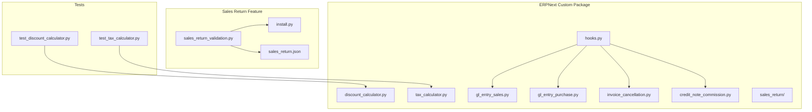
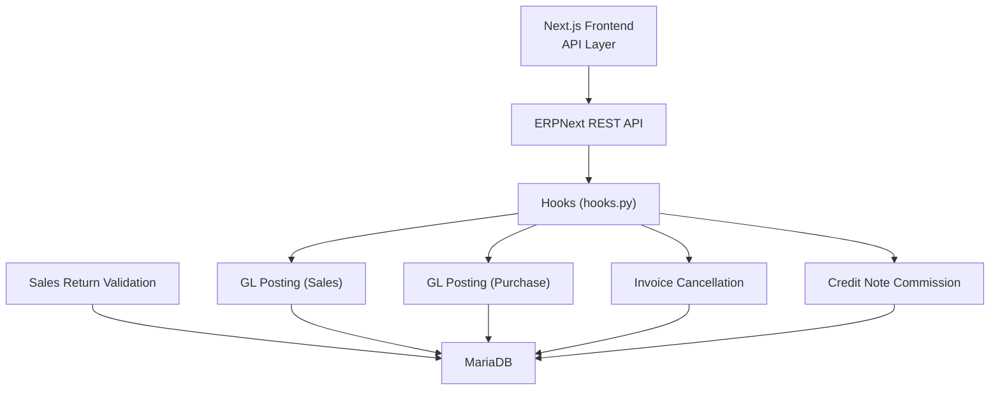
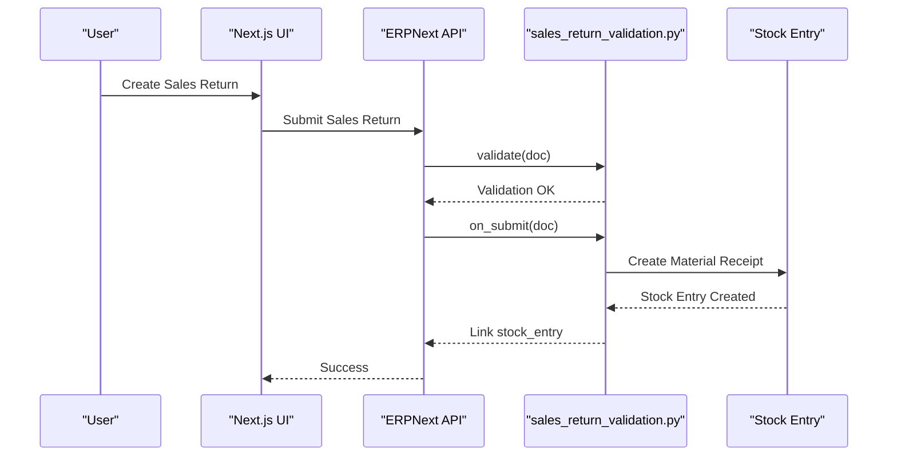
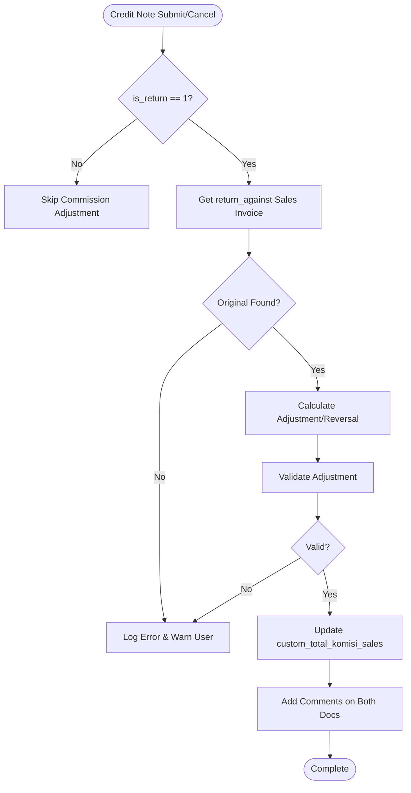
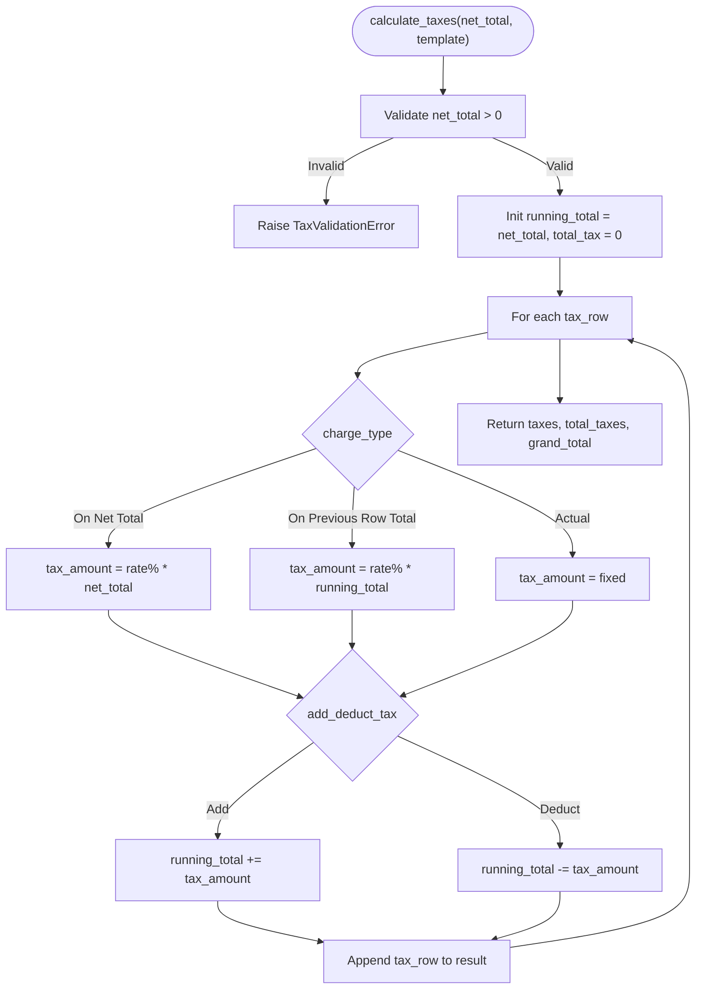
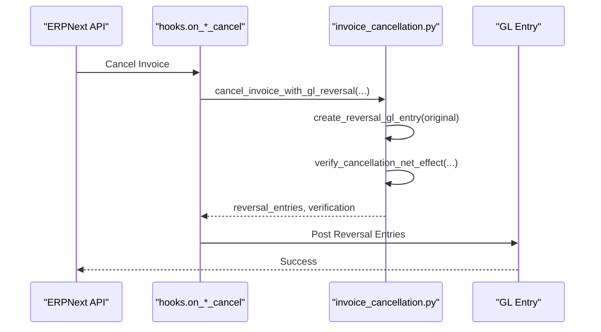
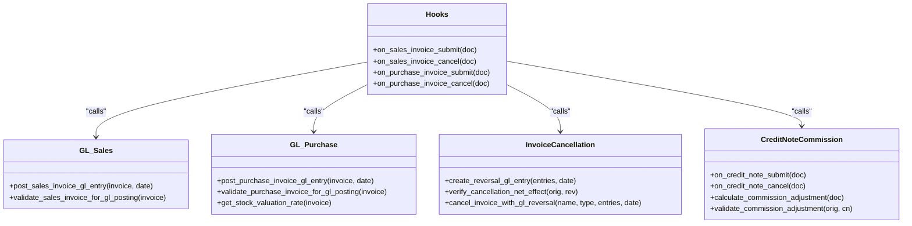
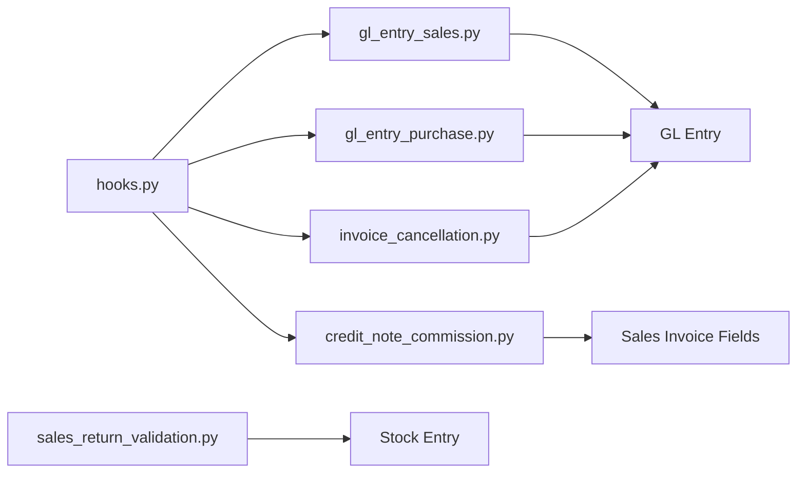

# Custom ERPNext Extensions

<cite>
**Referenced Files in This Document**
- [hooks.py](file://erpnext_custom/hooks.py)
- [install.py](file://erpnext_custom/sales_return/install.py)
- [sales_return_validation.py](file://erpnext_custom/sales_return/sales_return_validation.py)
- [invoice_cancellation.py](file://erpnext_custom/invoice_cancellation.py)
- [tax_calculator.py](file://erpnext_custom/tax_calculator.py)
- [credit_note_commission.py](file://erpnext_custom/credit_note_commission.py)
- [gl_entry_sales.py](file://erpnext_custom/gl_entry_sales.py)
- [gl_entry_purchase.py](file://erpnext_custom/gl_entry_purchase.py)
- [discount_calculator.py](file://erpnext_custom/discount_calculator.py)
- [README.md](file://erpnext_custom/README.md)
- [CREDIT_NOTE_COMMISSION.md](file://erpnext_custom/CREDIT_NOTE_COMMISSION.md)
- [sales_return.json](file://erpnext_custom/sales_return/sales_return.json)
- [sales_return_item.json](file://erpnext_custom/sales_return/sales_return_item.json)
- [test_discount_calculator.py](file://erpnext_custom/tests/test_discount_calculator.py)
- [test_tax_calculator.py](file://erpnext_custom/tests/test_tax_calculator.py)
</cite>

## Table of Contents
1. [Introduction](#introduction)
2. [Project Structure](#project-structure)
3. [Core Components](#core-components)
4. [Architecture Overview](#architecture-overview)
5. [Detailed Component Analysis](#detailed-component-analysis)
6. [Dependency Analysis](#dependency-analysis)
7. [Performance Considerations](#performance-considerations)
8. [Troubleshooting Guide](#troubleshooting-guide)
9. [Conclusion](#conclusion)
10. [Appendices](#appendices)

## Introduction
This document explains the Custom ERPNext Extensions implemented in the repository, focusing on custom fields, server scripts, validation logic, and business rule implementations. It covers:
- Custom sales return processing with DocType installation and validation
- Commission calculation algorithms integrated with Credit Notes
- Tax calculation logic supporting multiple tax rows and charge types
- Invoice cancellation workflows with GL reversal entries
- Hooks system, custom validation rules, and server script deployment
- Practical examples, testing procedures, and deployment strategies
- Extension maintenance, version compatibility, and upgrade considerations
- Guidance for extending business functionality and integrating with external systems

## Project Structure
The custom extensions are organized under the erpnext_custom package with modular Python components, a dedicated sales return feature, and comprehensive tests.

**Diagram sources**
- [hooks.py](file://erpnext_custom/hooks.py#L295-L311)
- [gl_entry_sales.py](file://erpnext_custom/gl_entry_sales.py#L1-L225)
- [gl_entry_purchase.py](file://erpnext_custom/gl_entry_purchase.py#L1-L233)
- [invoice_cancellation.py](file://erpnext_custom/invoice_cancellation.py#L1-L231)
- [credit_note_commission.py](file://erpnext_custom/credit_note_commission.py#L1-L286)
- [sales_return_validation.py](file://erpnext_custom/sales_return/sales_return_validation.py#L1-L168)
- [sales_return.json](file://erpnext_custom/sales_return/sales_return.json#L1-L171)
- [sales_return_item.json](file://erpnext_custom/sales_return/sales_return_item.json#L1-L125)
- [test_discount_calculator.py](file://erpnext_custom/tests/test_discount_calculator.py#L1-L194)
- [test_tax_calculator.py](file://erpnext_custom/tests/test_tax_calculator.py#L1-L383)

**Section sources**
- [README.md](file://erpnext_custom/README.md#L1-L338)

## Core Components
- Discount calculator: validates and computes discount amounts and percentages with priority rules.
- Tax calculator: supports multiple tax rows with charge types (On Net Total, On Previous Row Total, Actual) and add/deduct options.
- GL entry posting: automated posting for Sales and Purchase Invoices with validation and audit trail.
- Invoice cancellation: reversal GL entries ensuring net effect zero and robust verification.
- Credit note commission adjustment: automatic commission reduction/restoration on Credit Note submit/cancel.
- Sales return feature: DocType installation, custom fields, validation, and stock entry automation.

**Section sources**
- [discount_calculator.py](file://erpnext_custom/discount_calculator.py#L1-L120)
- [tax_calculator.py](file://erpnext_custom/tax_calculator.py#L1-L219)
- [gl_entry_sales.py](file://erpnext_custom/gl_entry_sales.py#L1-L225)
- [gl_entry_purchase.py](file://erpnext_custom/gl_entry_purchase.py#L1-L233)
- [invoice_cancellation.py](file://erpnext_custom/invoice_cancellation.py#L1-L231)
- [credit_note_commission.py](file://erpnext_custom/credit_note_commission.py#L1-L286)
- [sales_return_validation.py](file://erpnext_custom/sales_return/sales_return_validation.py#L1-L168)

## Architecture Overview
The extensions integrate with ERPNext’s document lifecycle via hooks and server scripts. The backend Python modules encapsulate business logic and are consumed by ERPNext DocTypes and the Next.js frontend.

**Diagram sources**
- [hooks.py](file://erpnext_custom/hooks.py#L35-L311)
- [gl_entry_sales.py](file://erpnext_custom/gl_entry_sales.py#L19-L185)
- [gl_entry_purchase.py](file://erpnext_custom/gl_entry_purchase.py#L19-L170)
- [invoice_cancellation.py](file://erpnext_custom/invoice_cancellation.py#L169-L231)
- [credit_note_commission.py](file://erpnext_custom/credit_note_commission.py#L26-L201)
- [sales_return_validation.py](file://erpnext_custom/sales_return/sales_return_validation.py#L98-L167)

## Detailed Component Analysis

### Sales Return Processing
The sales return feature introduces a parent DocType (Sales Return) and child table (Sales Return Item), with custom fields and validation logic. Installation automates DocType creation and custom field addition, while validation enforces return limits against delivery notes and generates stock entries upon submission.

**Diagram sources**
- [sales_return_validation.py](file://erpnext_custom/sales_return/sales_return_validation.py#L98-L167)

Key capabilities:
- DocType installation and verification via install script
- Custom field for linking Stock Entry
- Validation against delivery note quantities and reasons
- Stock entry generation on submit and cancellation on cancel

**Section sources**
- [install.py](file://erpnext_custom/sales_return/install.py#L18-L81)
- [sales_return.json](file://erpnext_custom/sales_return/sales_return.json#L1-L171)
- [sales_return_item.json](file://erpnext_custom/sales_return/sales_return_item.json#L1-L125)
- [sales_return_validation.py](file://erpnext_custom/sales_return/sales_return_validation.py#L10-L167)

### Commission Calculation Algorithms (Credit Notes)
The module adjusts Sales Invoice commission when Credit Notes are submitted or canceled. It reads the Credit Note’s total commission and updates the original invoice accordingly, with strict validation and non-blocking error handling.

**Diagram sources**
- [credit_note_commission.py](file://erpnext_custom/credit_note_commission.py#L26-L201)

**Section sources**
- [credit_note_commission.py](file://erpnext_custom/credit_note_commission.py#L26-L286)
- [CREDIT_NOTE_COMMISSION.md](file://erpnext_custom/CREDIT_NOTE_COMMISSION.md#L1-L403)

### Tax Calculation Logic
The tax calculator supports multiple tax rows with different charge types and add/deduct options. It validates inputs, applies sequential tax computation, and returns structured results for GL posting and invoice totals.

**Diagram sources**
- [tax_calculator.py](file://erpnext_custom/tax_calculator.py#L18-L153)

**Section sources**
- [tax_calculator.py](file://erpnext_custom/tax_calculator.py#L1-L219)

### Invoice Cancellation Workflows
Cancellation creates reversal GL entries by swapping debit/credit amounts and verifies that the net effect equals zero across all accounts.

**Diagram sources**
- [hooks.py](file://erpnext_custom/hooks.py#L103-L161)
- [invoice_cancellation.py](file://erpnext_custom/invoice_cancellation.py#L169-L231)

**Section sources**
- [invoice_cancellation.py](file://erpnext_custom/invoice_cancellation.py#L1-L231)
- [hooks.py](file://erpnext_custom/hooks.py#L103-L161)

### Hooks System and Server Scripts
ERPNext hooks trigger GL posting and commission adjustments on Sales/Purchase Invoice submit/cancel. Server scripts (validation) enforce business rules for Sales Return and Credit Notes.

**Diagram sources**
- [hooks.py](file://erpnext_custom/hooks.py#L35-L311)
- [gl_entry_sales.py](file://erpnext_custom/gl_entry_sales.py#L19-L185)
- [gl_entry_purchase.py](file://erpnext_custom/gl_entry_purchase.py#L19-L233)
- [invoice_cancellation.py](file://erpnext_custom/invoice_cancellation.py#L169-L231)
- [credit_note_commission.py](file://erpnext_custom/credit_note_commission.py#L26-L201)

**Section sources**
- [hooks.py](file://erpnext_custom/hooks.py#L1-L311)

## Dependency Analysis
The modules exhibit low coupling and high cohesion, with clear separation of concerns:
- Hooks orchestrate cross-module operations
- GL modules depend on shared validation and cancellation utilities
- Sales Return depends on Stock Entry creation
- Credit Note commission depends on Sales Invoice fields and hooks

**Diagram sources**
- [hooks.py](file://erpnext_custom/hooks.py#L28-L311)
- [gl_entry_sales.py](file://erpnext_custom/gl_entry_sales.py#L1-L225)
- [gl_entry_purchase.py](file://erpnext_custom/gl_entry_purchase.py#L1-L233)
- [invoice_cancellation.py](file://erpnext_custom/invoice_cancellation.py#L1-L231)
- [credit_note_commission.py](file://erpnext_custom/credit_note_commission.py#L1-L286)
- [sales_return_validation.py](file://erpnext_custom/sales_return/sales_return_validation.py#L98-L167)

**Section sources**
- [README.md](file://erpnext_custom/README.md#L285-L338)

## Performance Considerations
- Minimal database queries: GL posting and cancellation rely on efficient entry retrieval and validation.
- Balanced entry tolerance allows for rounding differences.
- Stock valuation and discount reflection reduce inventory misstatements.
- Non-blocking commission adjustments prevent operational bottlenecks.

[No sources needed since this section provides general guidance]

## Troubleshooting Guide
Common issues and resolutions:
- GL posting unbalanced: verify invoice totals and tax templates; check rounding thresholds.
- Sales Return submission failure: ensure delivery note is submitted and return quantities do not exceed remaining.
- Credit Note commission not adjusting: verify hooks are configured, return_against is set, and custom fields exist.
- Invoice cancellation errors: confirm original GL entries exist and reversal verification passes.
- Installation problems: re-run install script and verify DocType existence and permissions.

**Section sources**
- [gl_entry_sales.py](file://erpnext_custom/gl_entry_sales.py#L188-L224)
- [gl_entry_purchase.py](file://erpnext_custom/gl_entry_purchase.py#L173-L207)
- [sales_return_validation.py](file://erpnext_custom/sales_return/sales_return_validation.py#L21-L96)
- [invoice_cancellation.py](file://erpnext_custom/invoice_cancellation.py#L108-L166)
- [install.py](file://erpnext_custom/sales_return/install.py#L186-L278)

## Conclusion
The Custom ERPNext Extensions provide robust, modular implementations for discount and tax calculations, GL posting, invoice cancellation, commission adjustments, and sales return processing. They integrate seamlessly with ERPNext via hooks and server scripts, maintain strong validation and audit trails, and offer clear extension points for future enhancements.

[No sources needed since this section summarizes without analyzing specific files]

## Appendices

### Installation and Deployment Procedures
- Copy erpnext_custom to your ERPNext custom app directory.
- Configure hooks in your app’s hooks.py to point to erpnext_custom hooks.
- Restart ERPNext services and run unit tests to verify functionality.
- For Sales Return, execute the install script to create DocTypes and custom fields.

**Section sources**
- [README.md](file://erpnext_custom/README.md#L238-L244)
- [install.py](file://erpnext_custom/sales_return/install.py#L18-L81)

### Testing Procedures
- Unit tests for discount and tax calculators validate edge cases, rounding, and error conditions.
- Run tests using Python unittest or ERPNext test runner.

**Section sources**
- [test_discount_calculator.py](file://erpnext_custom/tests/test_discount_calculator.py#L1-L194)
- [test_tax_calculator.py](file://erpnext_custom/tests/test_tax_calculator.py#L1-L383)
- [README.md](file://erpnext_custom/README.md#L188-L222)

### Maintenance and Upgrade Considerations
- Maintain version compatibility by pinning module versions and validating hooks.
- Review breaking changes in ERPNext upgrades; update hooks and DocType JSONs as needed.
- Preserve audit logs and comments during upgrades to retain historical traces.

[No sources needed since this section provides general guidance]

### Extending Business Functionality
- Add new tax rows or charge types by updating tax templates and validators.
- Introduce additional GL entry rules by extending posting functions with validation.
- Extend Sales Return with new return reasons or warehouse constraints via DocType JSON and server scripts.
- Integrate external systems by invoking ERPNext APIs from custom endpoints and mapping results to DocTypes.

[No sources needed since this section provides general guidance]