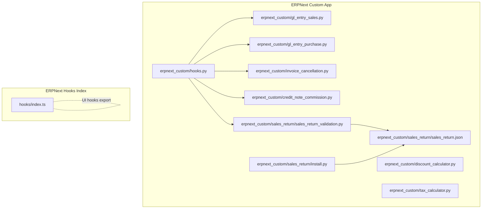
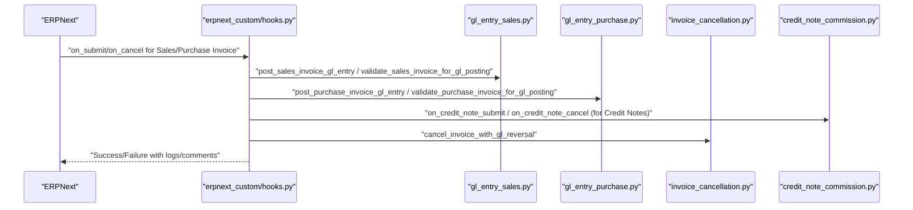
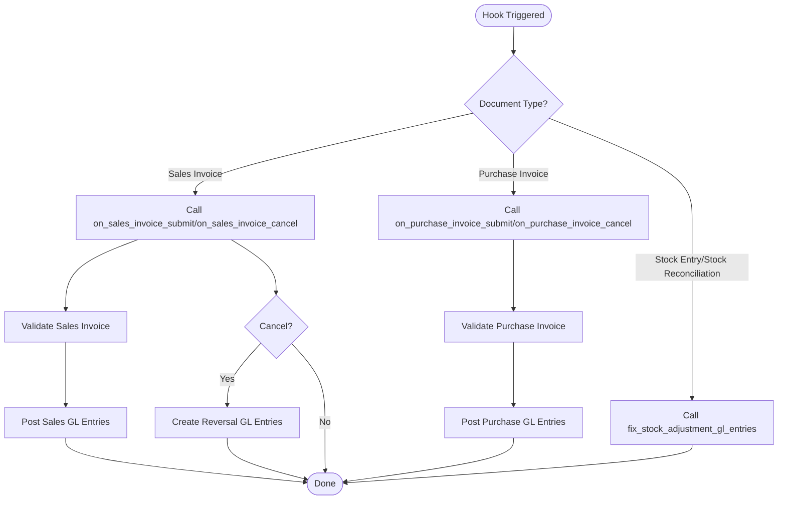
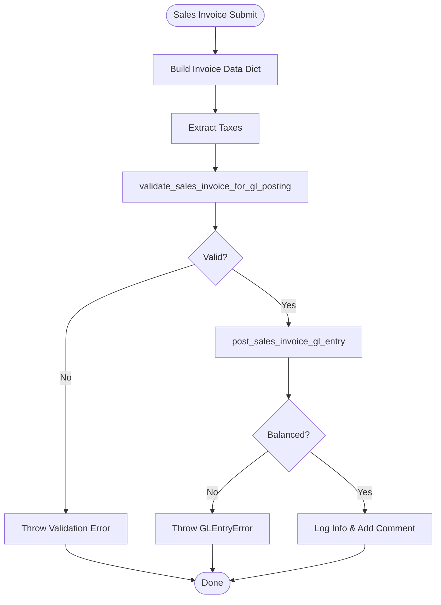
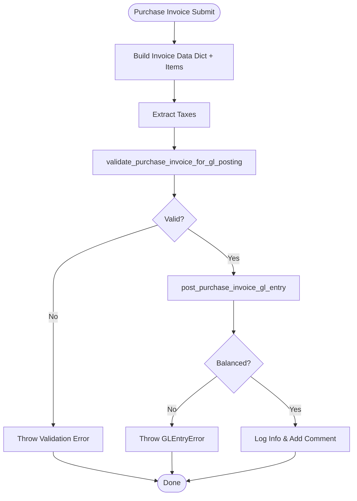
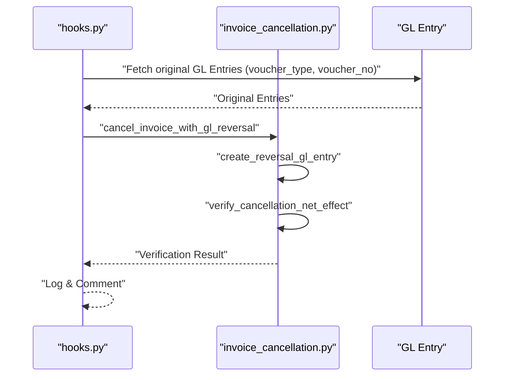
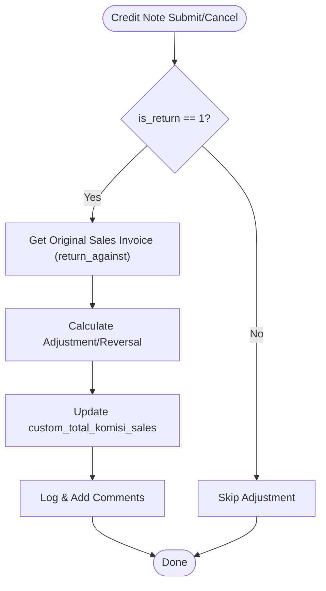
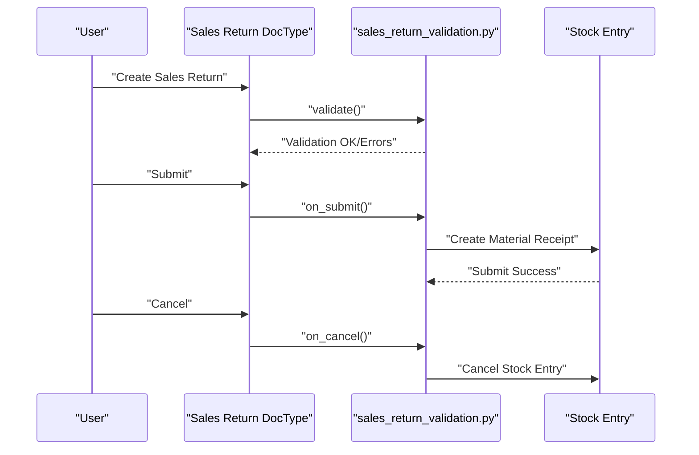
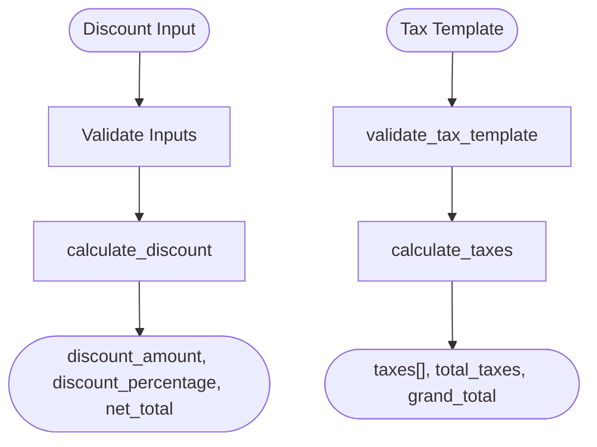
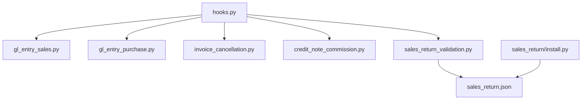

# Extension Hooks System

<cite>
**Referenced Files in This Document**
- [hooks.py](file://erpnext_custom/hooks.py)
- [gl_entry_sales.py](file://erpnext_custom/gl_entry_sales.py)
- [gl_entry_purchase.py](file://erpnext_custom/gl_entry_purchase.py)
- [invoice_cancellation.py](file://erpnext_custom/invoice_cancellation.py)
- [credit_note_commission.py](file://erpnext_custom/credit_note_commission.py)
- [discount_calculator.py](file://erpnext_custom/discount_calculator.py)
- [tax_calculator.py](file://erpnext_custom/tax_calculator.py)
- [sales_return_validation.py](file://erpnext_custom/sales_return/install.py)
- [sales_return_validation.py](file://erpnext_custom/sales_return/sales_return_validation.py)
- [sales_return.json](file://erpnext_custom/sales_return/sales_return.json)
- [index.ts](file://hooks/index.ts)
</cite>

## Table of Contents
1. [Introduction](#introduction)
2. [Project Structure](#project-structure)
3. [Core Components](#core-components)
4. [Architecture Overview](#architecture-overview)
5. [Detailed Component Analysis](#detailed-component-analysis)
6. [Dependency Analysis](#dependency-analysis)
7. [Performance Considerations](#performance-considerations)
8. [Troubleshooting Guide](#troubleshooting-guide)
9. [Conclusion](#conclusion)
10. [Appendices](#appendices)

## Introduction
This document explains the Extension Hooks System for ERPNext, focusing on document lifecycle integration, hook configuration, and event handling. It covers how hooks are registered, how document events trigger actions, and how GL entry posting and reversal logic are implemented for Sales and Purchase Invoices. It also documents the hook execution flow, error handling, logging, and practical examples for extending the system with custom event handlers and integrating with external systems.

## Project Structure
The Extension Hooks System resides primarily under the erpnext_custom directory and integrates with ERPNext’s document lifecycle via hooks.py. Supporting modules encapsulate GL entry posting, validation, cancellation, and auxiliary calculations for discounts and taxes. Additional components demonstrate custom DocType lifecycle handling (Sales Return) and reusable hooks utilities.

**Diagram sources**
- [hooks.py](file://erpnext_custom/hooks.py#L295-L310)
- [gl_entry_sales.py](file://erpnext_custom/gl_entry_sales.py#L1-L225)
- [gl_entry_purchase.py](file://erpnext_custom/gl_entry_purchase.py#L1-L233)
- [invoice_cancellation.py](file://erpnext_custom/invoice_cancellation.py#L1-L231)
- [credit_note_commission.py](file://erpnext_custom/credit_note_commission.py#L1-L286)
- [sales_return_validation.py](file://erpnext_custom/sales_return/sales_return_validation.py#L1-L168)
- [sales_return.json](file://erpnext_custom/sales_return/sales_return.json#L1-L171)
- [index.ts](file://hooks/index.ts#L1-L2)

**Section sources**
- [hooks.py](file://erpnext_custom/hooks.py#L1-L311)
- [index.ts](file://hooks/index.ts#L1-L2)

## Core Components
- Hook Registration and Dispatch: Centralized in hooks.py with DOC_EVENTS mapping document types to handler functions for on_submit and on_cancel.
- Sales Invoice GL Posting: Validates invoice data and posts GL entries for receivables, discounts, income, and taxes.
- Purchase Invoice GL Posting: Validates invoice data and posts GL entries for inventory, input taxes, and payables.
- Invoice Cancellation Reversal: Creates reversal GL entries and verifies net-zero effect.
- Credit Note Commission Adjustment: Adjusts and reverses commission on original Sales Invoices when Credit Notes are submitted or cancelled.
- Auxiliary Utilities: Discount and tax calculators support invoice validation and GL posting logic.
- Sales Return Lifecycle: DocType with server-side validation, submission, and cancellation hooks for stock entry creation and reversal.

**Section sources**
- [hooks.py](file://erpnext_custom/hooks.py#L295-L310)
- [gl_entry_sales.py](file://erpnext_custom/gl_entry_sales.py#L18-L185)
- [gl_entry_purchase.py](file://erpnext_custom/gl_entry_purchase.py#L19-L170)
- [invoice_cancellation.py](file://erpnext_custom/invoice_cancellation.py#L169-L230)
- [credit_note_commission.py](file://erpnext_custom/credit_note_commission.py#L26-L200)
- [discount_calculator.py](file://erpnext_custom/discount_calculator.py#L18-L96)
- [tax_calculator.py](file://erpnext_custom/tax_calculator.py#L18-L153)
- [sales_return_validation.py](file://erpnext_custom/sales_return/sales_return_validation.py#L10-L167)

## Architecture Overview
The hooks system integrates with ERPNext’s document lifecycle by registering handler functions against document events. On submit/cancel, hooks validate data, compute derived values, post GL entries, and manage reversals. Error handling leverages Frappe’s logging and error reporting, while comments on documents provide audit trails.

**Diagram sources**
- [hooks.py](file://erpnext_custom/hooks.py#L35-L101)
- [hooks.py](file://erpnext_custom/hooks.py#L164-L232)
- [hooks.py](file://erpnext_custom/hooks.py#L103-L161)
- [hooks.py](file://erpnext_custom/hooks.py#L235-L288)
- [gl_entry_sales.py](file://erpnext_custom/gl_entry_sales.py#L19-L185)
- [gl_entry_purchase.py](file://erpnext_custom/gl_entry_purchase.py#L19-L170)
- [invoice_cancellation.py](file://erpnext_custom/invoice_cancellation.py#L169-L230)
- [credit_note_commission.py](file://erpnext_custom/credit_note_commission.py#L26-L200)

## Detailed Component Analysis

### Hook Registration and Dispatch
- DOC_EVENTS defines mappings for Sales Invoice and Purchase Invoice on_submit/on_cancel, plus Stock Entry and Stock Reconciliation on_submit.
- Handlers extract invoice data, validate, post GL entries, and log outcomes. Exceptions are logged and surfaced as user-visible errors.

**Diagram sources**
- [hooks.py](file://erpnext_custom/hooks.py#L295-L310)
- [hooks.py](file://erpnext_custom/hooks.py#L35-L101)
- [hooks.py](file://erpnext_custom/hooks.py#L164-L232)
- [hooks.py](file://erpnext_custom/hooks.py#L103-L161)
- [hooks.py](file://erpnext_custom/hooks.py#L235-L288)

**Section sources**
- [hooks.py](file://erpnext_custom/hooks.py#L295-L310)

### Sales Invoice GL Entry Posting
- Converts invoice to dictionary, extracts taxes, validates totals, posts GL entries for receivables, discounts, income, and taxes, and ensures balanced debits and credits.
- Logs success and attaches comments to the document.

**Diagram sources**
- [gl_entry_sales.py](file://erpnext_custom/gl_entry_sales.py#L18-L185)
- [hooks.py](file://erpnext_custom/hooks.py#L35-L101)

**Section sources**
- [gl_entry_sales.py](file://erpnext_custom/gl_entry_sales.py#L18-L185)
- [hooks.py](file://erpnext_custom/hooks.py#L35-L101)

### Purchase Invoice GL Entry Posting
- Builds invoice data with items and taxes, validates totals, posts GL entries for inventory, input taxes, and payables, ensuring balanced entries.

**Diagram sources**
- [gl_entry_purchase.py](file://erpnext_custom/gl_entry_purchase.py#L19-L170)
- [hooks.py](file://erpnext_custom/hooks.py#L164-L232)

**Section sources**
- [gl_entry_purchase.py](file://erpnext_custom/gl_entry_purchase.py#L19-L170)
- [hooks.py](file://erpnext_custom/hooks.py#L164-L232)

### Invoice Cancellation Reversal Logic
- Retrieves original GL entries, creates reversal entries by swapping debit/credit, validates net-zero effect, and returns structured results.

**Diagram sources**
- [hooks.py](file://erpnext_custom/hooks.py#L103-L161)
- [hooks.py](file://erpnext_custom/hooks.py#L235-L288)
- [invoice_cancellation.py](file://erpnext_custom/invoice_cancellation.py#L169-L230)

**Section sources**
- [invoice_cancellation.py](file://erpnext_custom/invoice_cancellation.py#L169-L230)
- [hooks.py](file://erpnext_custom/hooks.py#L103-L161)
- [hooks.py](file://erpnext_custom/hooks.py#L235-L288)

### Credit Note Commission Adjustment
- Handles Credit Notes (is_return=1) by adjusting or reversing commission on the original Sales Invoice, with validation and audit comments.

**Diagram sources**
- [credit_note_commission.py](file://erpnext_custom/credit_note_commission.py#L26-L200)
- [hooks.py](file://erpnext_custom/hooks.py#L47-L48)
- [hooks.py](file://erpnext_custom/hooks.py#L115-L116)

**Section sources**
- [credit_note_commission.py](file://erpnext_custom/credit_note_commission.py#L26-L200)
- [hooks.py](file://erpnext_custom/hooks.py#L47-L48)
- [hooks.py](file://erpnext_custom/hooks.py#L115-L116)

### Sales Return Lifecycle (DocType Integration)
- Sales Return DocType with server-side hooks for validation, submission (creates stock entry), and cancellation (cancels stock entry).
- Installation script provisions child table, parent DocType, custom fields, and guidance for attaching validation scripts.

**Diagram sources**
- [sales_return_validation.py](file://erpnext_custom/sales_return/sales_return_validation.py#L10-L167)
- [sales_return.json](file://erpnext_custom/sales_return/sales_return.json#L1-L171)
- [install.py](file://erpnext_custom/sales_return/install.py#L18-L81)

**Section sources**
- [sales_return_validation.py](file://erpnext_custom/sales_return/sales_return_validation.py#L10-L167)
- [sales_return.json](file://erpnext_custom/sales_return/sales_return.json#L1-L171)
- [install.py](file://erpnext_custom/sales_return/install.py#L18-L81)

### Auxiliary Calculation Utilities
- Discount Calculator: Validates and computes discount amount/percentage and net total.
- Tax Calculator: Computes taxes from templates with support for multiple tax rows, add/deduct, and charge types.

**Diagram sources**
- [discount_calculator.py](file://erpnext_custom/discount_calculator.py#L18-L96)
- [tax_calculator.py](file://erpnext_custom/tax_calculator.py#L18-L153)

**Section sources**
- [discount_calculator.py](file://erpnext_custom/discount_calculator.py#L18-L96)
- [tax_calculator.py](file://erpnext_custom/tax_calculator.py#L18-L153)

## Dependency Analysis
- hooks.py depends on:
  - gl_entry_sales.py and gl_entry_purchase.py for GL posting/validation
  - invoice_cancellation.py for reversal logic
  - credit_note_commission.py for Credit Note commission adjustments
- Sales Return lifecycle depends on:
  - sales_return_validation.py for server-side hooks
  - sales_return.json for DocType definition
  - install.py for provisioning

**Diagram sources**
- [hooks.py](file://erpnext_custom/hooks.py#L28-L32)
- [gl_entry_sales.py](file://erpnext_custom/gl_entry_sales.py#L1-L225)
- [gl_entry_purchase.py](file://erpnext_custom/gl_entry_purchase.py#L1-L233)
- [invoice_cancellation.py](file://erpnext_custom/invoice_cancellation.py#L1-L231)
- [credit_note_commission.py](file://erpnext_custom/credit_note_commission.py#L1-L286)
- [sales_return_validation.py](file://erpnext_custom/sales_return/sales_return_validation.py#L1-L168)
- [sales_return.json](file://erpnext_custom/sales_return/sales_return.json#L1-L171)
- [install.py](file://erpnext_custom/sales_return/install.py#L1-L284)

**Section sources**
- [hooks.py](file://erpnext_custom/hooks.py#L28-L32)
- [sales_return_validation.py](file://erpnext_custom/sales_return/sales_return_validation.py#L1-L168)

## Performance Considerations
- Prefer minimal data extraction in hooks; build dictionaries once and reuse validated fields.
- Validate early to avoid unnecessary GL posting attempts.
- Use batch operations where applicable (e.g., fetching GL entries in bulk).
- Keep GL entry posting logic deterministic and bounded to reduce transaction time.
- Avoid heavy external calls inside hooks; defer to background jobs if needed.

## Troubleshooting Guide
Common issues and resolutions:
- GL Entry imbalance: Review GL posting logic and rounding thresholds; ensure taxes and discounts are correctly mapped.
- Validation failures: Confirm invoice totals match computed values; check tax templates and discount inputs.
- Cancellation verification failure: Inspect original GL entries and reversal entries for completeness and correctness.
- Credit Note commission errors: Verify return_against references and that commission values are negative for Credit Notes.
- Logging and comments: Use Frappe’s logger and document comments to trace execution and capture errors.

**Section sources**
- [gl_entry_sales.py](file://erpnext_custom/gl_entry_sales.py#L170-L185)
- [gl_entry_purchase.py](file://erpnext_custom/gl_entry_purchase.py#L155-L170)
- [invoice_cancellation.py](file://erpnext_custom/invoice_cancellation.py#L108-L166)
- [credit_note_commission.py](file://erpnext_custom/credit_note_commission.py#L102-L112)
- [hooks.py](file://erpnext_custom/hooks.py#L95-L100)
- [hooks.py](file://erpnext_custom/hooks.py#L156-L161)

## Conclusion
The Extension Hooks System integrates seamlessly with ERPNext’s document lifecycle, enabling robust GL entry posting, reversal, and custom business logic such as Credit Note commission adjustments. By centralizing hook registration, validating inputs rigorously, and leveraging Frappe’s logging and error handling, the system supports reliable, auditable, and extensible document workflows.

## Appendices

### Practical Examples
- Extending hooks for new document types: Register handlers in DOC_EVENTS and implement on_submit/on_cancel functions that validate and post GL entries.
- Integrating with external systems: Add outbound calls in hooks after successful GL posting; wrap in try/except and log errors.
- Custom event handling: Use Frappe’s comment and audit trail features to record hook outcomes for traceability.

### Debugging Techniques
- Enable Frappe logging for detailed error traces.
- Use document comments to annotate hook execution steps.
- Validate intermediate results (e.g., GL entry totals, tax computations) before proceeding to next step.

### Guidance for Extending the Hooks System
- Add new handlers in hooks.py and register them in DOC_EVENTS.
- Encapsulate domain logic in dedicated modules (e.g., GL posting, validation, calculations).
- Keep hooks lightweight; delegate heavy processing to background jobs if necessary.
- Maintain strict validation and error handling to ensure data integrity.