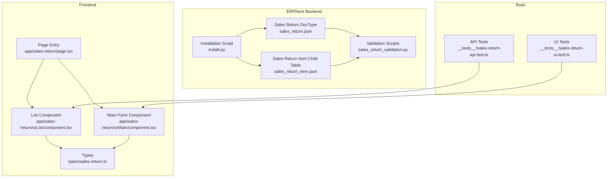
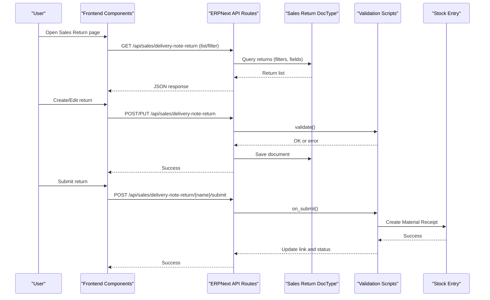
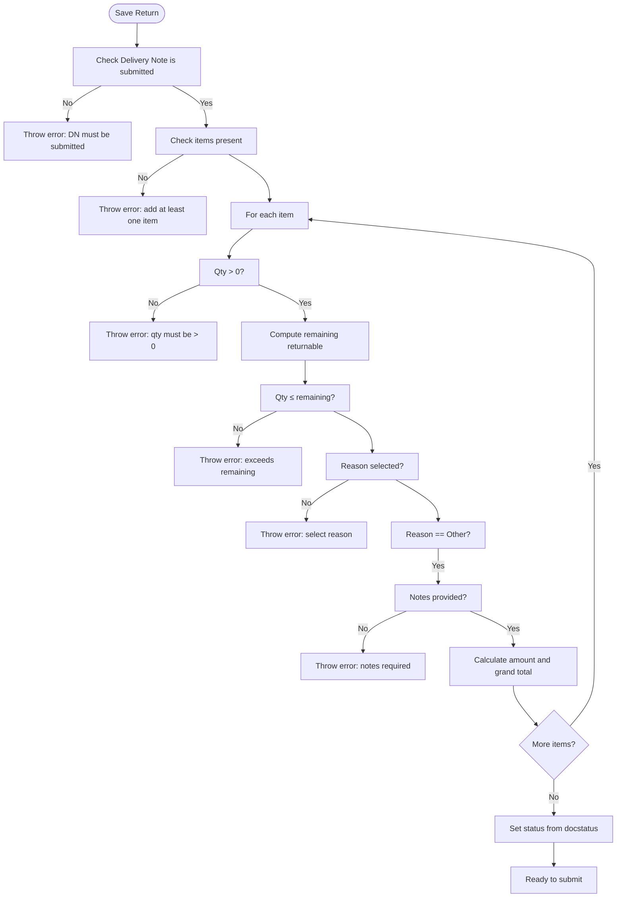
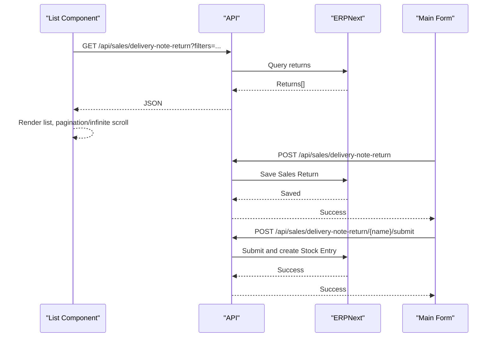
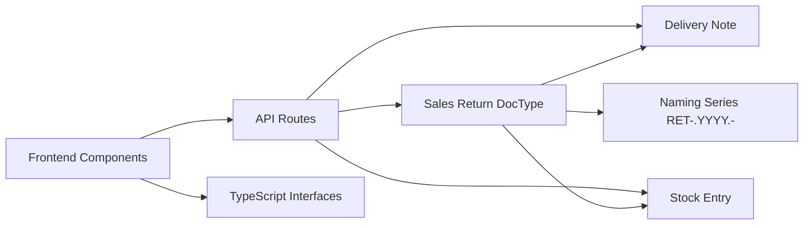

# Sales Return Extension

<cite>
**Referenced Files in This Document**
- [README.md](file://erpnext_custom/sales_return/README.md)
- [INSTALLATION_SUMMARY.md](file://erpnext_custom/sales_return/INSTALLATION_SUMMARY.md)
- [VALIDATION_SETUP.md](file://erpnext_custom/sales_return/VALIDATION_SETUP.md)
- [install.py](file://erpnext_custom/sales_return/install.py)
- [sales_return.json](file://erpnext_custom/sales_return/sales_return.json)
- [sales_return_item.json](file://erpnext_custom/sales_return/sales_return_item.json)
- [sales_return_validation.py](file://erpnext_custom/sales_return/sales_return_validation.py)
- [SALES_RETURN_README.md](file://docs/sales-return/SALES_RETURN_README.md)
- [sales-return-api.test.ts](file://__tests__/sales-return-api.test.ts)
- [sales-return-ui.test.ts](file://__tests__/sales-return-ui.test.ts)
- [page.tsx](file://app/sales-return/page.tsx)
- [srList/component.tsx](file://app/sales-return/srList/component.tsx)
- [srMain/component.tsx](file://app/sales-return/srMain/component.tsx)
- [sales-return.ts](file://types/sales-return.ts)
</cite>

## Table of Contents
1. [Introduction](#introduction)
2. [Project Structure](#project-structure)
3. [Core Components](#core-components)
4. [Architecture Overview](#architecture-overview)
5. [Detailed Component Analysis](#detailed-component-analysis)
6. [Dependency Analysis](#dependency-analysis)
7. [Performance Considerations](#performance-considerations)
8. [Troubleshooting Guide](#troubleshooting-guide)
9. [Conclusion](#conclusion)
10. [Appendices](#appendices)

## Introduction
This document describes the Sales Return Extension for ERPNext, focusing on custom fields, validation logic, and business rule implementations. It covers installation procedures, configuration of custom fields and validation scripts, integration with ERPNext’s document workflow, and the Next.js frontend components. Practical examples demonstrate sales return processing, validation scenarios, and troubleshooting common issues. Guidance is also provided for deployment, testing, and maintenance.

## Project Structure
The Sales Return Extension consists of:
- ERPNext DocType configurations for the Sales Return parent and child tables
- Python installation and validation scripts
- Next.js frontend pages and components for listing and creating returns
- TypeScript interfaces for type safety
- Comprehensive tests validating API behavior and UI interactions

**Diagram sources**
- [sales_return.json](file://erpnext_custom/sales_return/sales_return.json#L1-L171)
- [sales_return_item.json](file://erpnext_custom/sales_return/sales_return_item.json#L1-L125)
- [sales_return_validation.py](file://erpnext_custom/sales_return/sales_return_validation.py#L1-L168)
- [install.py](file://erpnext_custom/sales_return/install.py#L1-L284)
- [page.tsx](file://app/sales-return/page.tsx#L1-L8)
- [srList/component.tsx](file://app/sales-return/srList/component.tsx#L1-L790)
- [srMain/component.tsx](file://app/sales-return/srMain/component.tsx#L1-L711)
- [sales-return.ts](file://types/sales-return.ts#L1-L295)
- [sales-return-api.test.ts](file://__tests__/sales-return-api.test.ts#L1-L800)
- [sales-return-ui.test.ts](file://__tests__/sales-return-ui.test.ts#L1-L800)

**Section sources**
- [README.md](file://erpnext_custom/sales_return/README.md#L1-L279)
- [INSTALLATION_SUMMARY.md](file://erpnext_custom/sales_return/INSTALLATION_SUMMARY.md#L1-L263)

## Core Components
- Sales Return DocType (parent): Defines fields, permissions, naming series, and workflow states.
- Sales Return Item (child table): Defines per-item fields including return reason and notes.
- Validation Scripts: Enforce quantity limits, reason selection, and totals; create/cancel stock entries on submit/cancel.
- Installation Script: Automates DocType creation and adds a custom field for linking stock entries.
- Frontend Components: Next.js pages and components for listing, filtering, creating, submitting, and printing returns.
- Types: TypeScript interfaces for API requests/responses and form state.

**Section sources**
- [sales_return.json](file://erpnext_custom/sales_return/sales_return.json#L1-L171)
- [sales_return_item.json](file://erpnext_custom/sales_return/sales_return_item.json#L1-L125)
- [sales_return_validation.py](file://erpnext_custom/sales_return/sales_return_validation.py#L1-L168)
- [install.py](file://erpnext_custom/sales_return/install.py#L1-L284)
- [sales-return.ts](file://types/sales-return.ts#L1-L295)

## Architecture Overview
The extension integrates ERPNext’s native document model with a custom Next.js frontend. The backend handles validation, workflow, and stock entries; the frontend provides a user-friendly interface for creating and managing returns.

**Diagram sources**
- [srList/component.tsx](file://app/sales-return/srList/component.tsx#L135-L259)
- [srMain/component.tsx](file://app/sales-return/srMain/component.tsx#L273-L361)
- [sales_return_validation.py](file://erpnext_custom/sales_return/sales_return_validation.py#L98-L137)

## Detailed Component Analysis

### Sales Return DocType (Parent)
- Purpose: Central document for return transactions.
- Key fields:
  - Naming series RET-.YYYY.- with automatic yearly reset
  - Customer, posting date, delivery note, company
  - Status (Draft/Submitted/Cancelled)
  - Items (child table)
  - Grand total (calculated)
  - Custom notes
- Permissions: Sales User (create/read/write/submit/print/email/export/share); Sales Manager (plus cancel/amend/delete)
- Workflow: Submittable with Draft → Submitted → Cancelled transitions

**Section sources**
- [sales_return.json](file://erpnext_custom/sales_return/sales_return.json#L25-L126)
- [sales_return.json](file://erpnext_custom/sales_return/sales_return.json#L134-L163)

### Sales Return Item (Child Table)
- Purpose: Per-item details for returns.
- Key fields:
  - Item code/name, quantity, UOM, rate, amount
  - Warehouse, delivery note item reference
  - Return reason (predefined list)
  - Return notes (required when reason is “Other”)

**Section sources**
- [sales_return_item.json](file://erpnext_custom/sales_return/sales_return_item.json#L23-L124)

### Installation and Custom Field Configuration
- Methods:
  - Import via ERPNext UI (recommended)
  - Bench command import
  - Python installation script (automates DocType creation and adds a custom field for stock entry linkage)
- Custom field added: stock_entry (read-only link to Stock Entry)

**Section sources**
- [README.md](file://erpnext_custom/sales_return/README.md#L21-L83)
- [INSTALLATION_SUMMARY.md](file://erpnext_custom/sales_return/INSTALLATION_SUMMARY.md#L72-L105)
- [install.py](file://erpnext_custom/sales_return/install.py#L111-L132)

### Validation Logic and Business Rules
- Before Save (validate):
  - Delivery Note must be submitted
  - At least one item required
  - Return quantity > 0 and ≤ remaining returnable quantity
  - Return reason required for all items
  - Notes required when reason is “Other”
  - Automatic calculation of line totals and grand total
  - Status derived from docstatus (Draft/Submitted/Cancelled)
- On Submit (on_submit):
  - Create Stock Entry (Material Receipt) with items and target warehouse
  - Link Stock Entry to Sales Return
  - Update status to Submitted
- On Cancel (on_cancel):
  - Cancel linked Stock Entry
  - Show success or warning if none found

**Diagram sources**
- [sales_return_validation.py](file://erpnext_custom/sales_return/sales_return_validation.py#L10-L96)

**Section sources**
- [sales_return_validation.py](file://erpnext_custom/sales_return/sales_return_validation.py#L10-L96)
- [VALIDATION_SETUP.md](file://erpnext_custom/sales_return/VALIDATION_SETUP.md#L102-L123)

### Sales Return Workflow Integration with ERPNext
- Submission triggers stock entry creation and inventory increases.
- Cancellation reverses stock entries and statuses.
- Naming series follows RET-.YYYY.- with yearly reset.
- Permissions and roles control who can submit, cancel, amend, or delete.

**Section sources**
- [sales_return_validation.py](file://erpnext_custom/sales_return/sales_return_validation.py#L98-L168)
- [sales_return.json](file://erpnext_custom/sales_return/sales_return.json#L25-L33)

### Frontend Components and API Integration
- Page entry renders the list component.
- List component:
  - Fetches returns with filters (status, dates, customer, document number)
  - Supports pagination and infinite scroll
  - Provides actions: submit, print, navigate to edit
- Main form component:
  - Selects a Delivery Note, loads items, computes remaining quantities
  - Validates item quantities, reasons, and notes
  - Saves/updates returns and submits via API

**Diagram sources**
- [srList/component.tsx](file://app/sales-return/srList/component.tsx#L135-L259)
- [srMain/component.tsx](file://app/sales-return/srMain/component.tsx#L273-L361)

**Section sources**
- [page.tsx](file://app/sales-return/page.tsx#L1-L8)
- [srList/component.tsx](file://app/sales-return/srList/component.tsx#L1-L790)
- [srMain/component.tsx](file://app/sales-return/srMain/component.tsx#L1-L711)

### Custom JSON Configurations
- Sales Return DocType JSON defines fields, permissions, naming rule, and workflow.
- Sales Return Item JSON defines per-item fields and options.

**Section sources**
- [sales_return.json](file://erpnext_custom/sales_return/sales_return.json#L1-L171)
- [sales_return_item.json](file://erpnext_custom/sales_return/sales_return_item.json#L1-L125)

### Practical Examples

#### Example 1: Basic Sales Return Creation and Submission
- Create a Delivery Note and submit it.
- Create a Sales Return linked to the Delivery Note with valid quantities and reasons.
- Save as Draft, then submit to create a Stock Entry and update inventory.

**Section sources**
- [README.md](file://erpnext_custom/sales_return/README.md#L201-L233)

#### Example 2: Validation Scenarios
- Attempt to save without a Delivery Note: validation error.
- Attempt to save without items: validation error.
- Enter zero/negative quantity: validation error.
- Enter quantity exceeding delivered amount: validation error.
- Skip return reason: validation error.
- Select “Other” without notes: validation error.

**Section sources**
- [VALIDATION_SETUP.md](file://erpnext_custom/sales_return/VALIDATION_SETUP.md#L159-L219)

#### Example 3: Multiple Returns from Same Delivery Note
- Create a Delivery Note with item qty=10.
- Create Sales Return 1 with qty=3; submit.
- Create Sales Return 2 with qty=5; submit.
- Attempt Sales Return 3 with qty=3: validation error (only 2 remaining).

**Section sources**
- [VALIDATION_SETUP.md](file://erpnext_custom/sales_return/VALIDATION_SETUP.md#L210-L219)

### Testing Procedures
- API tests validate:
  - Initial Draft status
  - List filtering by status/date/customer/document number
  - Unique return number generation following RET-YYYY-NNNNN
  - Delivery Note linkage and complete detail display
- UI tests validate:
  - Delivery Note data retrieval
  - Item selection state
  - Return quantity validation and remaining quantity calculation
  - Return reason selection and conditional notes requirement

**Section sources**
- [sales-return-api.test.ts](file://__tests__/sales-return-api.test.ts#L318-L799)
- [sales-return-ui.test.ts](file://__tests__/sales-return-ui.test.ts#L304-L775)

## Dependency Analysis
- ERPNext DocTypes depend on:
  - Delivery Note (source document)
  - Stock Entry (created on submit)
  - Naming Series (RET-.YYYY.-)
- Frontend depends on:
  - Next.js API routes for CRUD and submit/cancel
  - TypeScript types for request/response shapes
  - UI components for dialogs and forms

**Diagram sources**
- [sales_return.json](file://erpnext_custom/sales_return/sales_return.json#L25-L33)
- [sales_return_validation.py](file://erpnext_custom/sales_return/sales_return_validation.py#L98-L137)
- [srList/component.tsx](file://app/sales-return/srList/component.tsx#L221-L259)
- [srMain/component.tsx](file://app/sales-return/srMain/component.tsx#L321-L361)
- [sales-return.ts](file://types/sales-return.ts#L66-L111)

**Section sources**
- [sales_return.json](file://erpnext_custom/sales_return/sales_return.json#L1-L171)
- [sales_return_validation.py](file://erpnext_custom/sales_return/sales_return_validation.py#L1-L168)
- [sales-return.ts](file://types/sales-return.ts#L1-L295)

## Performance Considerations
- Use filters to limit result sets when listing returns.
- Prefer server-side pagination/infinite scroll to avoid large payloads.
- Keep validation logic efficient; avoid unnecessary queries inside loops.
- Cache frequently accessed data (e.g., remaining quantities) in the frontend to reduce API calls.

## Troubleshooting Guide
- Import fails:
  - Ensure logged in as Administrator
  - Import child table first, then parent DocType
  - Clear cache and reload
- Fields not showing:
  - Clear cache and reload the page
  - Check field permissions in Customize Form
- Naming series not working:
  - Set current value in Setup > Settings > Naming Series
- Validation scripts not running:
  - Confirm scripts are enabled and DocType Events are correct
  - Clear cache and check error logs
- Stock Entry not created:
  - Verify on_submit script is enabled
  - Ensure warehouse is set for all items
  - Check user permissions for Stock Entry
- Calculation errors:
  - Confirm validate script runs
  - Verify numeric values and precision
  - Clear cache and retry

**Section sources**
- [README.md](file://erpnext_custom/sales_return/README.md#L241-L272)
- [VALIDATION_SETUP.md](file://erpnext_custom/sales_return/VALIDATION_SETUP.md#L220-L263)

## Conclusion
The Sales Return Extension provides a robust, validated, and integrated solution for managing product returns in ERPNext. It leverages native DocType features, enforces business rules through validation scripts, and offers a modern Next.js frontend for streamlined user experience. Proper installation, configuration, and testing ensure reliable operation across environments.

## Appendices

### Deployment and Maintenance
- Deploy in stages: development → staging → production.
- Backup database before deployment.
- Monitor error logs post-deployment.
- Maintain validation scripts incrementally with thorough testing.

**Section sources**
- [INSTALLATION_SUMMARY.md](file://erpnext_custom/sales_return/INSTALLATION_SUMMARY.md#L182-L187)

### Customizing Workflows and Integrations
- Add workflows via Setup > Workflow > Workflow for approvals.
- Extend validation scripts to include additional business rules.
- Integrate with existing business processes by aligning naming series and permissions.

**Section sources**
- [VALIDATION_SETUP.md](file://erpnext_custom/sales_return/VALIDATION_SETUP.md#L279-L294)