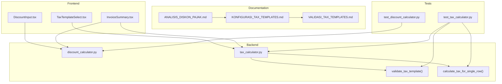
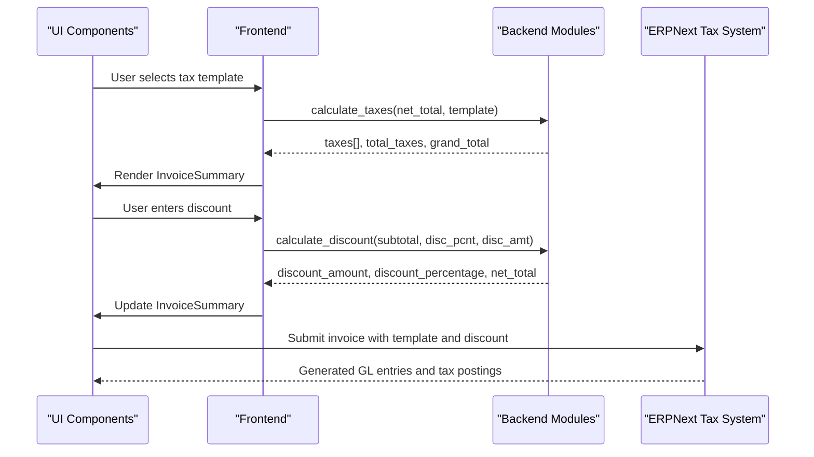
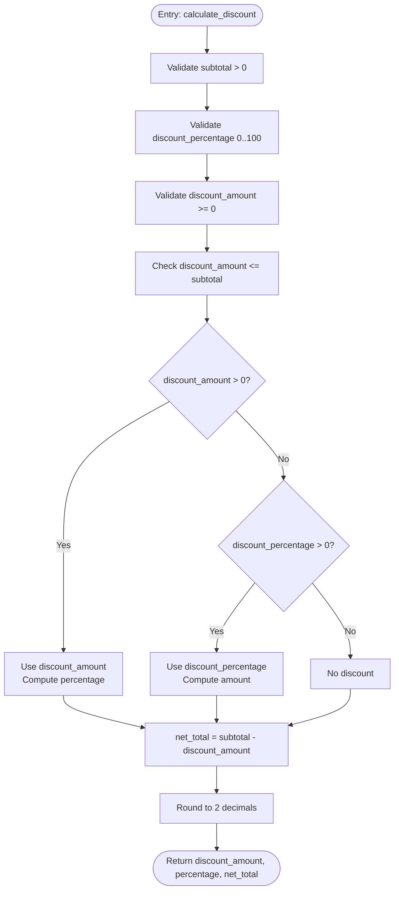
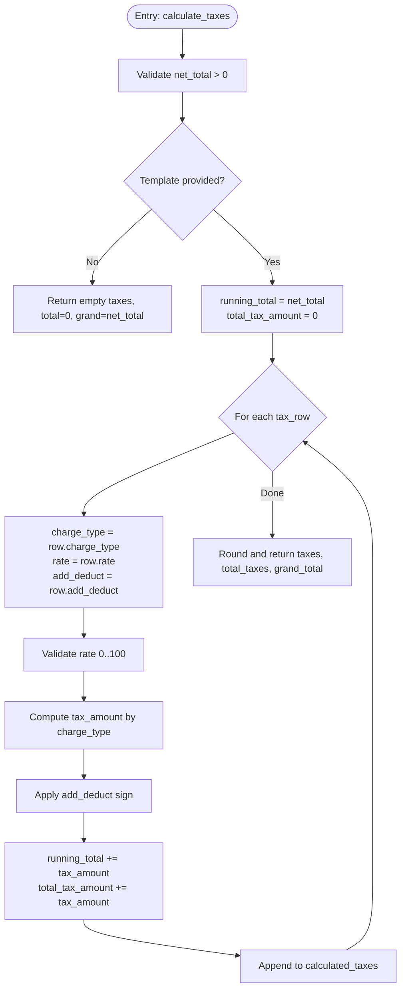
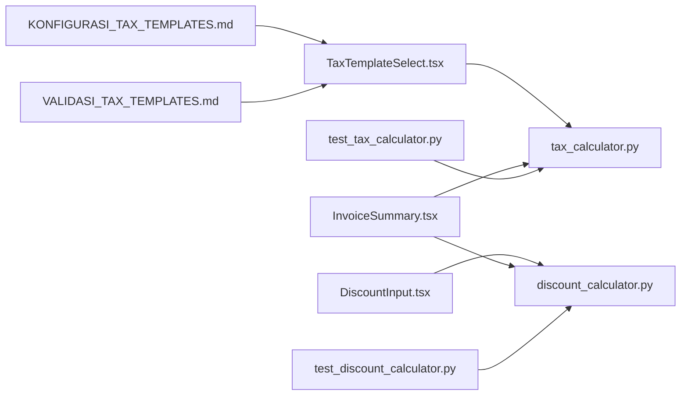

# Tax Calculation Engine

<cite>
**Referenced Files in This Document**
- [tax_calculator.py](file://erpnext_custom/tax_calculator.py)
- [discount_calculator.py](file://erpnext_custom/discount_calculator.py)
- [TaxTemplateSelect.tsx](file://components/invoice/TaxTemplateSelect.tsx)
- [DiscountInput.tsx](file://components/invoice/DiscountInput.tsx)
- [InvoiceSummary.tsx](file://components/invoice/InvoiceSummary.tsx)
- [test_tax_calculator.py](file://erpnext_custom/tests/test_tax_calculator.py)
- [test_discount_calculator.py](file://erpnext_custom/tests/test_discount_calculator.py)
- [ANALISIS_DISKON_PAJAK.md](file://docs/tax-system/ANALISIS_DISKON_PAJAK.md)
- [KONFIGURASI_TAX_TEMPLATES.md](file://docs/tax-system/KONFIGURASI_TAX_TEMPLATES.md)
- [VALIDASI_TAX_TEMPLATES.md](file://docs/tax-system/VALIDASI_TAX_TEMPLATES.md)
</cite>

## Table of Contents
1. [Introduction](#introduction)
2. [Project Structure](#project-structure)
3. [Core Components](#core-components)
4. [Architecture Overview](#architecture-overview)
5. [Detailed Component Analysis](#detailed-component-analysis)
6. [Dependency Analysis](#dependency-analysis)
7. [Performance Considerations](#performance-considerations)
8. [Troubleshooting Guide](#troubleshooting-guide)
9. [Conclusion](#conclusion)
10. [Appendices](#appendices)

## Introduction
This document describes the Tax Calculation Engine implemented in the ERPNext system. It covers discount and tax calculation algorithms, tax template validation, and the integration points with the ERPNext tax system. The engine supports:
- Discount calculation with precedence rules and validation
- Multi-tax environments with configurable charge types and add/deduct behavior
- Tax template mapping and runtime selection via UI components
- Real-time invoice summaries and GL-ready calculations

The goal is to provide a clear understanding of how taxes and discounts are computed, validated, and integrated into financial records, with practical examples, troubleshooting guidance, and extension points for regional compliance.

## Project Structure
The Tax Calculation Engine spans backend Python modules and frontend React components, plus supporting documentation and tests:
- Backend modules implement discount and tax calculation logic and validation
- Frontend components provide user controls for selecting tax templates, entering discounts, and viewing invoice summaries
- Documentation defines tax templates, validation procedures, and integration guidelines
- Unit tests verify correctness and edge cases

**Diagram sources**
- [discount_calculator.py](file://erpnext_custom/discount_calculator.py#L1-L120)
- [tax_calculator.py](file://erpnext_custom/tax_calculator.py#L1-L219)
- [DiscountInput.tsx](file://components/invoice/DiscountInput.tsx#L1-L219)
- [TaxTemplateSelect.tsx](file://components/invoice/TaxTemplateSelect.tsx#L1-L192)
- [InvoiceSummary.tsx](file://components/invoice/InvoiceSummary.tsx#L1-L185)
- [test_discount_calculator.py](file://erpnext_custom/tests/test_discount_calculator.py#L1-L194)
- [test_tax_calculator.py](file://erpnext_custom/tests/test_tax_calculator.py#L1-L383)
- [ANALISIS_DISKON_PAJAK.md](file://docs/tax-system/ANALISIS_DISKON_PAJAK.md#L1-L772)
- [KONFIGURASI_TAX_TEMPLATES.md](file://docs/tax-system/KONFIGURASI_TAX_TEMPLATES.md#L1-L440)
- [VALIDASI_TAX_TEMPLATES.md](file://docs/tax-system/VALIDASI_TAX_TEMPLATES.md#L1-L360)

**Section sources**
- [discount_calculator.py](file://erpnext_custom/discount_calculator.py#L1-L120)
- [tax_calculator.py](file://erpnext_custom/tax_calculator.py#L1-L219)
- [DiscountInput.tsx](file://components/invoice/DiscountInput.tsx#L1-L219)
- [TaxTemplateSelect.tsx](file://components/invoice/TaxTemplateSelect.tsx#L1-L192)
- [InvoiceSummary.tsx](file://components/invoice/InvoiceSummary.tsx#L1-L185)
- [ANALISIS_DISKON_PAJAK.md](file://docs/tax-system/ANALISIS_DISKON_PAJAK.md#L1-L772)
- [KONFIGURASI_TAX_TEMPLATES.md](file://docs/tax-system/KONFIGURASI_TAX_TEMPLATES.md#L1-L440)
- [VALIDASI_TAX_TEMPLATES.md](file://docs/tax-system/VALIDASI_TAX_TEMPLATES.md#L1-L360)

## Core Components
- Discount Calculator: Computes discount amounts and percentages with validation and precedence rules
- Tax Calculator: Calculates taxes across multiple rows with support for On Net Total, On Previous Row Total, and Actual charge types, plus add/deduct behavior
- Tax Template Select: Fetches and displays tax templates for Sales or Purchase, enabling runtime selection
- Discount Input: Interactive UI for entering item/document-level discount with live validation and currency formatting
- Invoice Summary: Real-time computation of subtotal, discount, taxes, and grand total with add/deduct handling

Key behaviors:
- Discount precedence: discount_amount takes priority over discount_percentage
- Tax calculation order: taxes are applied sequentially with running totals
- Validation: strict bounds checking for rates and amounts, with meaningful error messages

**Section sources**
- [discount_calculator.py](file://erpnext_custom/discount_calculator.py#L18-L96)
- [tax_calculator.py](file://erpnext_custom/tax_calculator.py#L18-L153)
- [TaxTemplateSelect.tsx](file://components/invoice/TaxTemplateSelect.tsx#L38-L103)
- [DiscountInput.tsx](file://components/invoice/DiscountInput.tsx#L66-L118)
- [InvoiceSummary.tsx](file://components/invoice/InvoiceSummary.tsx#L33-L97)

## Architecture Overview
The engine integrates frontend UI components with backend calculation logic and ERPNext’s native tax template system. The frontend components communicate with backend endpoints to fetch tax templates and present real-time summaries. The backend modules encapsulate validation and computation to ensure accuracy and compliance.

**Diagram sources**
- [TaxTemplateSelect.tsx](file://components/invoice/TaxTemplateSelect.tsx#L38-L103)
- [DiscountInput.tsx](file://components/invoice/DiscountInput.tsx#L66-L118)
- [InvoiceSummary.tsx](file://components/invoice/InvoiceSummary.tsx#L33-L97)
- [tax_calculator.py](file://erpnext_custom/tax_calculator.py#L18-L153)
- [discount_calculator.py](file://erpnext_custom/discount_calculator.py#L18-L96)
- [KONFIGURASI_TAX_TEMPLATES.md](file://docs/tax-system/KONFIGURASI_TAX_TEMPLATES.md#L1-L440)

## Detailed Component Analysis

### Discount Calculator
Responsibilities:
- Validate inputs (subtotal > 0, percentage 0–100, amount ≥ 0 and ≤ subtotal)
- Compute discount with precedence: discount_amount overrides discount_percentage
- Return rounded results to two decimals
- Provide validation-only function for pre-checking

Processing logic:
- Input validation blocks invalid states early
- Precedence ensures deterministic behavior
- Rounding maintains currency precision

**Diagram sources**
- [discount_calculator.py](file://erpnext_custom/discount_calculator.py#L54-L96)

**Section sources**
- [discount_calculator.py](file://erpnext_custom/discount_calculator.py#L18-L96)
- [test_discount_calculator.py](file://erpnext_custom/tests/test_discount_calculator.py#L21-L90)

### Tax Calculator
Responsibilities:
- Validate tax template structure and rates
- Compute taxes across multiple rows with sequential application
- Support three charge types: On Net Total, On Previous Row Total, Actual
- Handle add/deduct behavior to increase or decrease grand total
- Round results to two decimals

Processing logic:
- Validates net_total > 0 and each tax row’s rate 0–100
- Iterates tax rows, computes tax amount based on charge type
- Applies add/deduct sign and updates running total
- Aggregates total taxes and grand total

**Diagram sources**
- [tax_calculator.py](file://erpnext_custom/tax_calculator.py#L93-L153)

**Section sources**
- [tax_calculator.py](file://erpnext_custom/tax_calculator.py#L18-L153)
- [test_tax_calculator.py](file://erpnext_custom/tests/test_tax_calculator.py#L22-L133)

### Tax Template Select (Frontend)
Responsibilities:
- Fetch tax templates filtered by type (Sales/Purchase) and company
- Display template list with combined rate representation for multiple taxes
- Emit selected template to parent for downstream calculation
- Handle loading, error states, and disabled states

Integration:
- Calls backend endpoint to list templates
- Uses template.taxes to compute display rates and show tax breakdown

**Section sources**
- [TaxTemplateSelect.tsx](file://components/invoice/TaxTemplateSelect.tsx#L38-L103)
- [KONFIGURASI_TAX_TEMPLATES.md](file://docs/tax-system/KONFIGURASI_TAX_TEMPLATES.md#L1-L440)

### Discount Input (Frontend)
Responsibilities:
- Toggle between percentage and amount modes
- Validate inputs in real time with localized currency formatting
- Compute dependent values (e.g., amount from percentage and vice versa)
- Emit unified change events to parent

**Section sources**
- [DiscountInput.tsx](file://components/invoice/DiscountInput.tsx#L66-L118)

### Invoice Summary (Frontend)
Responsibilities:
- Compute subtotal from items
- Apply discount (amount or percentage)
- Compute taxes row-by-row with add/deduct handling
- Display grand total and summary cards

**Section sources**
- [InvoiceSummary.tsx](file://components/invoice/InvoiceSummary.tsx#L33-L97)

## Dependency Analysis
The engine exhibits clear separation of concerns:
- Frontend components depend on backend calculation modules for correctness
- Backend modules are standalone and can be reused independently
- Tax template configuration is externalized via ERPNext templates and fetched at runtime

**Diagram sources**
- [DiscountInput.tsx](file://components/invoice/DiscountInput.tsx#L1-L219)
- [TaxTemplateSelect.tsx](file://components/invoice/TaxTemplateSelect.tsx#L1-L192)
- [InvoiceSummary.tsx](file://components/invoice/InvoiceSummary.tsx#L1-L185)
- [discount_calculator.py](file://erpnext_custom/discount_calculator.py#L1-L120)
- [tax_calculator.py](file://erpnext_custom/tax_calculator.py#L1-L219)
- [test_discount_calculator.py](file://erpnext_custom/tests/test_discount_calculator.py#L1-L194)
- [test_tax_calculator.py](file://erpnext_custom/tests/test_tax_calculator.py#L1-L383)
- [KONFIGURASI_TAX_TEMPLATES.md](file://docs/tax-system/KONFIGURASI_TAX_TEMPLATES.md#L1-L440)
- [VALIDASI_TAX_TEMPLATES.md](file://docs/tax-system/VALIDASI_TAX_TEMPLATES.md#L1-L360)

**Section sources**
- [discount_calculator.py](file://erpnext_custom/discount_calculator.py#L1-L120)
- [tax_calculator.py](file://erpnext_custom/tax_calculator.py#L1-L219)
- [TaxTemplateSelect.tsx](file://components/invoice/TaxTemplateSelect.tsx#L1-L192)
- [DiscountInput.tsx](file://components/invoice/DiscountInput.tsx#L1-L219)
- [InvoiceSummary.tsx](file://components/invoice/InvoiceSummary.tsx#L1-L185)
- [test_discount_calculator.py](file://erpnext_custom/tests/test_discount_calculator.py#L1-L194)
- [test_tax_calculator.py](file://erpnext_custom/tests/test_tax_calculator.py#L1-L383)
- [KONFIGURASI_TAX_TEMPLATES.md](file://docs/tax-system/KONFIGURASI_TAX_TEMPLATES.md#L1-L440)
- [VALIDASI_TAX_TEMPLATES.md](file://docs/tax-system/VALIDASI_TAX_TEMPLATES.md#L1-L360)

## Performance Considerations
- Calculation complexity is linear in the number of items and tax rows; typical invoice sizes are small, keeping performance negligible
- Rounding to two decimals occurs once per computed value; minimal overhead
- Frontend recomputes summaries using memoization to avoid redundant calculations
- Backend functions are pure and stateless, enabling easy caching or reuse

Recommendations:
- Keep tax templates concise (limit rows) to reduce iteration cost
- Prefer “On Net Total” for simplicity; reserve “On Previous Row Total” for specialized cases
- Validate inputs early in the UI to prevent unnecessary backend calls

[No sources needed since this section provides general guidance]

## Troubleshooting Guide
Common issues and resolutions:
- Template not found or disabled: Verify template exists, enabled, and matches company
- Incorrect tax calculation: Confirm charge type and rate; ensure add/deduct aligns with intent
- GL entry imbalance: Check that all accounts exist and template configuration is correct
- Discount validation failures: Ensure percentage within 0–100 and amount does not exceed subtotal

Validation procedures:
- Use dummy invoices to validate Sales and Purchase templates
- Cross-check GL entries against expected debits/credits
- Run unit tests to confirm edge cases and rounding behavior

**Section sources**
- [VALIDASI_TAX_TEMPLATES.md](file://docs/tax-system/VALIDASI_TAX_TEMPLATES.md#L295-L331)
- [test_tax_calculator.py](file://erpnext_custom/tests/test_tax_calculator.py#L201-L259)
- [test_discount_calculator.py](file://erpnext_custom/tests/test_discount_calculator.py#L91-L132)

## Conclusion
The Tax Calculation Engine provides robust, validated, and integrable discount and tax computation aligned with ERPNext’s native tax template system. Its modular design enables accurate, real-time invoice summaries, reliable GL posting, and straightforward customization for regional requirements.

[No sources needed since this section summarizes without analyzing specific files]

## Appendices

### Practical Scenarios and Examples
- Single tax row (PPN 11%): compute tax on net total, add to grand total
- Multiple taxes (PPN + PPh 23): apply PPN then PPh 23 on previous row total; PPh 23 deducted from grand total
- Discount + tax: compute discount first, then tax on net total; record discount as contra income
- Purchase invoice with PKP/non-PKP: PPN input credited to prepaid tax asset or expensed depending on status

**Section sources**
- [test_tax_calculator.py](file://erpnext_custom/tests/test_tax_calculator.py#L22-L133)
- [test_discount_calculator.py](file://erpnext_custom/tests/test_discount_calculator.py#L21-L90)
- [ANALISIS_DISKON_PAJAK.md](file://docs/tax-system/ANALISIS_DISKON_PAJAK.md#L185-L220)
- [KONFIGURASI_TAX_TEMPLATES.md](file://docs/tax-system/KONFIGURASI_TAX_TEMPLATES.md#L260-L321)

### Tax Template Configuration and Compliance
- Sales templates: PPN 11%, PPN + PPh 23 (2%), PPN + PPh 22 (1.5%)
- Purchase templates: PPN Masukan (PKP) and Non-PKP variants
- Chart of Accounts: liability accounts for output taxes and asset account for input tax credits
- Reporting: VAT and PPh reporting derived from GL entries

**Section sources**
- [KONFIGURASI_TAX_TEMPLATES.md](file://docs/tax-system/KONFIGURASI_TAX_TEMPLATES.md#L1-L440)
- [ANALISIS_DISKON_PAJAK.md](file://docs/tax-system/ANALISIS_DISKON_PAJAK.md#L223-L322)
- [VALIDASI_TAX_TEMPLATES.md](file://docs/tax-system/VALIDASI_TAX_TEMPLATES.md#L14-L221)

### Integration Notes
- Frontend components call backend endpoints to fetch tax templates and present summaries
- Backend modules validate and compute; ERPNext handles GL posting and tax template mapping
- Tests ensure accuracy across scenarios and edge cases

**Section sources**
- [TaxTemplateSelect.tsx](file://components/invoice/TaxTemplateSelect.tsx#L38-L103)
- [InvoiceSummary.tsx](file://components/invoice/InvoiceSummary.tsx#L33-L97)
- [tax_calculator.py](file://erpnext_custom/tax_calculator.py#L156-L186)
- [discount_calculator.py](file://erpnext_custom/discount_calculator.py#L99-L120)