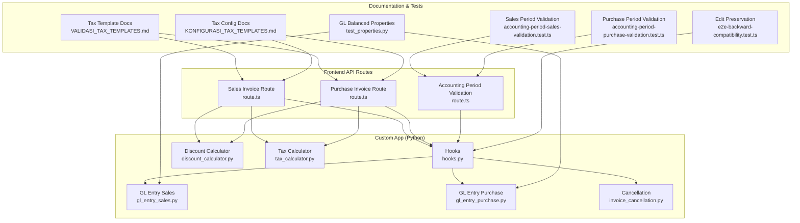
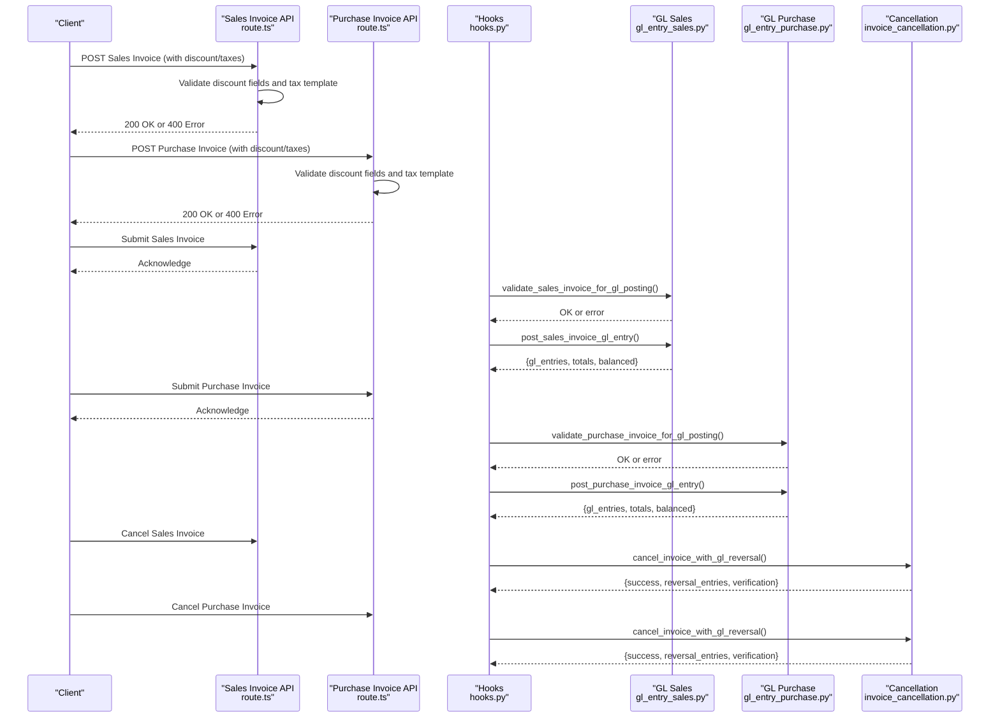
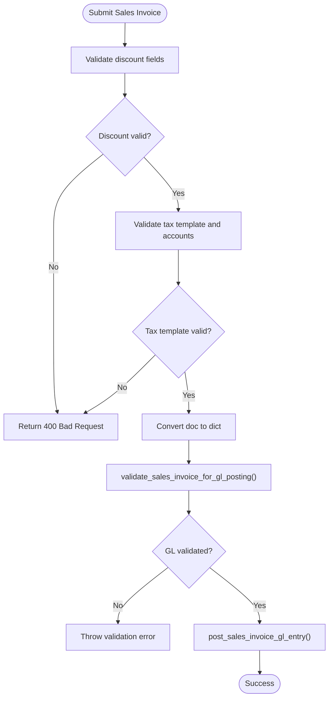
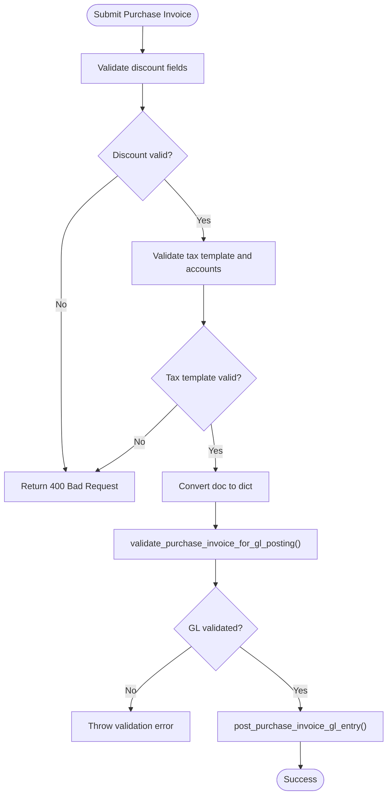
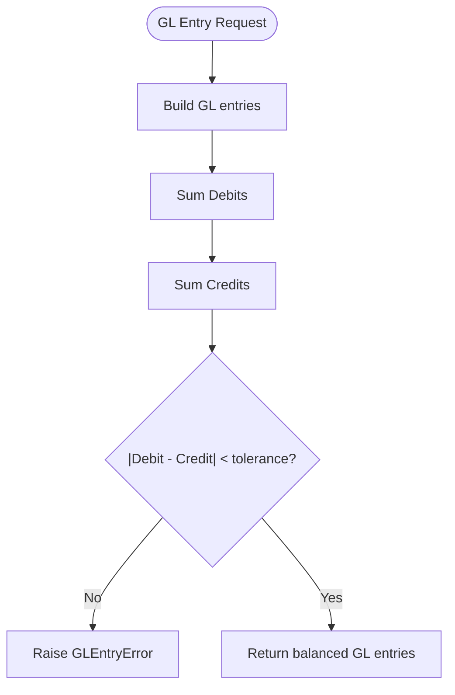
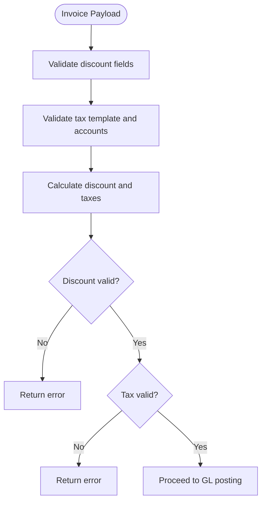
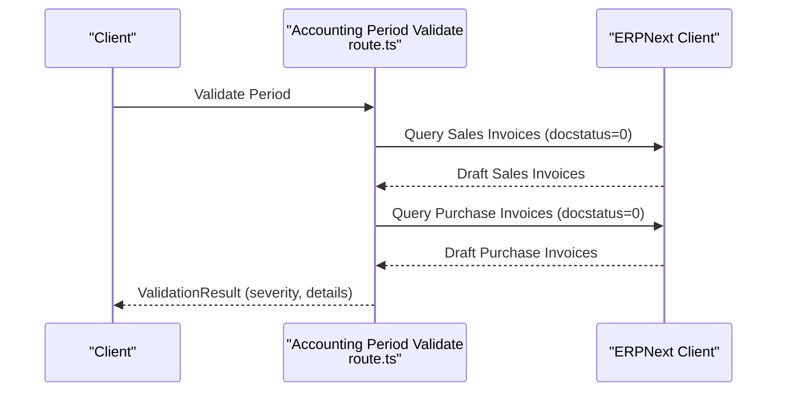
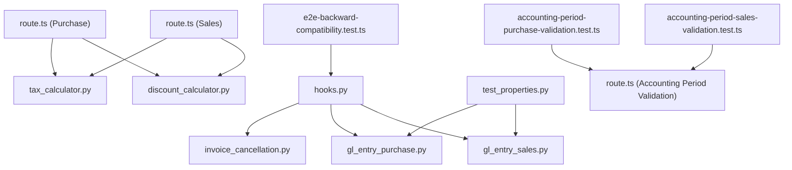

# Validation Logic System

<cite>
**Referenced Files in This Document**
- [hooks.py](file://erpnext_custom/hooks.py)
- [gl_entry_sales.py](file://erpnext_custom/gl_entry_sales.py)
- [gl_entry_purchase.py](file://erpnext_custom/gl_entry_purchase.py)
- [invoice_cancellation.py](file://erpnext_custom/invoice_cancellation.py)
- [discount_calculator.py](file://erpnext_custom/discount_calculator.py)
- [tax_calculator.py](file://erpnext_custom/tax_calculator.py)
- [route.ts (Sales)](file://app/api/sales/invoices/route.ts)
- [route.ts (Purchase)](file://app/api/purchase/invoices/route.ts)
- [route.ts (Accounting Period Validation)](file://app/api/accounting-period/validate/route.ts)
- [VALIDASI_TAX_TEMPLATES.md](file://docs/tax-system/VALIDASI_TAX_TEMPLATES.md)
- [KONFIGURASI_TAX_TEMPLATES.md](file://docs/tax-system/KONFIGURASI_TAX_TEMPLATES.md)
- [test_properties.py](file://erpnext_custom/tests/test_properties.py)
- [e2e-backward-compatibility.test.ts](file://tests/e2e-backward-compatibility.test.ts)
- [accounting-period-sales-validation.test.ts](file://tests/accounting-period-sales-validation.test.ts)
- [accounting-period-purchase-validation.test.ts](file://tests/accounting-period-purchase-validation.test.ts)
</cite>

## Table of Contents
1. [Introduction](#introduction)
2. [Project Structure](#project-structure)
3. [Core Components](#core-components)
4. [Architecture Overview](#architecture-overview)
5. [Detailed Component Analysis](#detailed-component-analysis)
6. [Dependency Analysis](#dependency-analysis)
7. [Performance Considerations](#performance-considerations)
8. [Troubleshooting Guide](#troubleshooting-guide)
9. [Conclusion](#conclusion)
10. [Appendices](#appendices)

## Introduction
This document describes the Validation Logic System responsible for ensuring accurate invoice submissions, cancellations, and GL posting requirements across Sales and Purchase workflows. It explains:
- Invoice validation algorithms for creation, editing, and cancellation
- Discount and tax validation rules
- GL entry validation logic (account mapping, amount balancing, posting restrictions)
- Practical validation scenarios, error handling, and customization guidance
- Performance optimization, maintenance, and troubleshooting strategies

## Project Structure
The validation system spans three layers:
- Backend hooks and GL posting logic (Python)
- Frontend API routes (TypeScript) performing input validation and tax template checks
- Documentation and tests validating behavior and business rules

**Diagram sources**
- [hooks.py](file://erpnext_custom/hooks.py#L1-L311)
- [gl_entry_sales.py](file://erpnext_custom/gl_entry_sales.py#L1-L225)
- [gl_entry_purchase.py](file://erpnext_custom/gl_entry_purchase.py#L1-L233)
- [invoice_cancellation.py](file://erpnext_custom/invoice_cancellation.py#L1-L231)
- [discount_calculator.py](file://erpnext_custom/discount_calculator.py#L1-L120)
- [tax_calculator.py](file://erpnext_custom/tax_calculator.py#L1-L219)
- [route.ts (Sales)](file://app/api/sales/invoices/route.ts#L1-L362)
- [route.ts (Purchase)](file://app/api/purchase/invoices/route.ts#L1-L457)
- [route.ts (Accounting Period Validation)](file://app/api/accounting-period/validate/route.ts#L350-L426)
- [VALIDASI_TAX_TEMPLATES.md](file://docs/tax-system/VALIDASI_TAX_TEMPLATES.md#L1-L360)
- [KONFIGURASI_TAX_TEMPLATES.md](file://docs/tax-system/KONFIGURASI_TAX_TEMPLATES.md#L1-L440)
- [test_properties.py](file://erpnext_custom/tests/test_properties.py#L106-L440)
- [e2e-backward-compatibility.test.ts](file://tests/e2e-backward-compatibility.test.ts#L352-L391)
- [accounting-period-sales-validation.test.ts](file://tests/accounting-period-sales-validation.test.ts#L203-L249)
- [accounting-period-purchase-validation.test.ts](file://tests/accounting-period-purchase-validation.test.ts#L158-L239)

**Section sources**
- [hooks.py](file://erpnext_custom/hooks.py#L1-L311)
- [gl_entry_sales.py](file://erpnext_custom/gl_entry_sales.py#L1-L225)
- [gl_entry_purchase.py](file://erpnext_custom/gl_entry_purchase.py#L1-L233)
- [invoice_cancellation.py](file://erpnext_custom/invoice_cancellation.py#L1-L231)
- [discount_calculator.py](file://erpnext_custom/discount_calculator.py#L1-L120)
- [tax_calculator.py](file://erpnext_custom/tax_calculator.py#L1-L219)
- [route.ts (Sales)](file://app/api/sales/invoices/route.ts#L1-L362)
- [route.ts (Purchase)](file://app/api/purchase/invoices/route.ts#L1-L457)
- [route.ts (Accounting Period Validation)](file://app/api/accounting-period/validate/route.ts#L350-L426)
- [VALIDASI_TAX_TEMPLATES.md](file://docs/tax-system/VALIDASI_TAX_TEMPLATES.md#L1-L360)
- [KONFIGURASI_TAX_TEMPLATES.md](file://docs/tax-system/KONFIGURASI_TAX_TEMPLATES.md#L1-L440)
- [test_properties.py](file://erpnext_custom/tests/test_properties.py#L106-L440)
- [e2e-backward-compatibility.test.ts](file://tests/e2e-backward-compatibility.test.ts#L352-L391)
- [accounting-period-sales-validation.test.ts](file://tests/accounting-period-sales-validation.test.ts#L203-L249)
- [accounting-period-purchase-validation.test.ts](file://tests/accounting-period-purchase-validation.test.ts#L158-L239)

## Core Components
- Hooks orchestrate invoice lifecycle events and GL posting/cancellation:
  - Sales and Purchase invoice submit/cancel hooks call GL posting validators and create GL entries
- GL posting modules:
  - Sales GL posting: Receivable, discount, income, and tax entries with strict balancing
  - Purchase GL posting: Inventory/Expense, input tax, payable with balancing
- Cancellation module:
  - Creates reversal entries and verifies net effect equals zero per account
- Frontend API routes:
  - Validate discount fields, enforce tax template existence and active status, and verify Chart of Accounts account presence
- Calculation modules:
  - Discount calculator: precedence rules and validation
  - Tax calculator: multi-row tax computation with add/deduct semantics

**Section sources**
- [hooks.py](file://erpnext_custom/hooks.py#L35-L311)
- [gl_entry_sales.py](file://erpnext_custom/gl_entry_sales.py#L19-L185)
- [gl_entry_purchase.py](file://erpnext_custom/gl_entry_purchase.py#L19-L170)
- [invoice_cancellation.py](file://erpnext_custom/invoice_cancellation.py#L19-L105)
- [discount_calculator.py](file://erpnext_custom/discount_calculator.py#L18-L96)
- [tax_calculator.py](file://erpnext_custom/tax_calculator.py#L18-L153)
- [route.ts (Sales)](file://app/api/sales/invoices/route.ts#L131-L203)
- [route.ts (Purchase)](file://app/api/purchase/invoices/route.ts#L316-L386)

## Architecture Overview
The validation pipeline integrates frontend API validation with backend GL posting and cancellation logic.

**Diagram sources**
- [route.ts (Sales)](file://app/api/sales/invoices/route.ts#L131-L203)
- [route.ts (Purchase)](file://app/api/purchase/invoices/route.ts#L316-L386)
- [hooks.py](file://erpnext_custom/hooks.py#L35-L311)
- [gl_entry_sales.py](file://erpnext_custom/gl_entry_sales.py#L188-L225)
- [gl_entry_purchase.py](file://erpnext_custom/gl_entry_purchase.py#L173-L207)
- [invoice_cancellation.py](file://erpnext_custom/invoice_cancellation.py#L169-L231)

## Detailed Component Analysis

### Invoice Submission Validation (Sales)
- Frontend validation:
  - Validates discount percentage range and discount amount vs subtotal
  - Validates tax template existence, active status, and account_head presence in Chart of Accounts
- Backend validation and GL posting:
  - Converts document to dictionary and extracts taxes/items
  - Calls GL validation for sales invoice
  - Posts GL entries and logs results
- Error handling:
  - Throws descriptive errors on validation failure or GL imbalance

**Diagram sources**
- [route.ts (Sales)](file://app/api/sales/invoices/route.ts#L131-L203)
- [gl_entry_sales.py](file://erpnext_custom/gl_entry_sales.py#L188-L225)

**Section sources**
- [route.ts (Sales)](file://app/api/sales/invoices/route.ts#L131-L203)
- [gl_entry_sales.py](file://erpnext_custom/gl_entry_sales.py#L188-L225)
- [hooks.py](file://erpnext_custom/hooks.py#L35-L101)

### Invoice Submission Validation (Purchase)
- Frontend validation:
  - Validates discount percentage and discount amount vs subtotal
  - Validates tax template existence, active status, and account_head presence in Chart of Accounts
- Backend validation and GL posting:
  - Converts document to dictionary, extracts items and taxes
  - Calls GL validation for purchase invoice
  - Posts GL entries and logs results

**Diagram sources**
- [route.ts (Purchase)](file://app/api/purchase/invoices/route.ts#L316-L386)
- [gl_entry_purchase.py](file://erpnext_custom/gl_entry_purchase.py#L173-L207)

**Section sources**
- [route.ts (Purchase)](file://app/api/purchase/invoices/route.ts#L316-L386)
- [gl_entry_purchase.py](file://erpnext_custom/gl_entry_purchase.py#L173-L207)
- [hooks.py](file://erpnext_custom/hooks.py#L164-L232)

### GL Entry Validation Logic
- Sales GL posting:
  - Ensures balanced entries: Receivable = Income + Discount + Taxes
  - Validates required fields (name, customer, grand_total)
  - Balances within rounding tolerance
- Purchase GL posting:
  - Ensures balanced entries: Inventory/Expense + Input Tax = Payable
  - Validates required fields (name, supplier, grand_total)
  - Balances within rounding tolerance
- Cancellation:
  - Creates reversal entries by swapping debit/credit
  - Verifies net effect per account equals zero

**Diagram sources**
- [gl_entry_sales.py](file://erpnext_custom/gl_entry_sales.py#L170-L185)
- [gl_entry_purchase.py](file://erpnext_custom/gl_entry_purchase.py#L155-L170)
- [invoice_cancellation.py](file://erpnext_custom/invoice_cancellation.py#L19-L105)

**Section sources**
- [gl_entry_sales.py](file://erpnext_custom/gl_entry_sales.py#L19-L185)
- [gl_entry_purchase.py](file://erpnext_custom/gl_entry_purchase.py#L19-L170)
- [invoice_cancellation.py](file://erpnext_custom/invoice_cancellation.py#L19-L105)

### Discount and Tax Validation Rules
- Discount validation:
  - Discount percentage must be between 0 and 100
  - Discount amount cannot be negative and cannot exceed subtotal
  - If both discount amount and percentage are provided, discount amount takes precedence
- Tax validation:
  - Tax template must exist and be active
  - Each tax row requires a valid account_head present in Chart of Accounts
  - Tax rates must be between 0 and 100
  - Supports multiple tax rows with add/deduct semantics

**Diagram sources**
- [discount_calculator.py](file://erpnext_custom/discount_calculator.py#L54-L96)
- [tax_calculator.py](file://erpnext_custom/tax_calculator.py#L93-L153)
- [route.ts (Sales)](file://app/api/sales/invoices/route.ts#L131-L203)
- [route.ts (Purchase)](file://app/api/purchase/invoices/route.ts#L316-L386)

**Section sources**
- [discount_calculator.py](file://erpnext_custom/discount_calculator.py#L18-L96)
- [tax_calculator.py](file://erpnext_custom/tax_calculator.py#L18-L153)
- [route.ts (Sales)](file://app/api/sales/invoices/route.ts#L131-L203)
- [route.ts (Purchase)](file://app/api/purchase/invoices/route.ts#L316-L386)

### Accounting Period Validation (Business Rule Enforcement)
- Ensures all Sales and Purchase invoices in the period are submitted (not draft) before closing
- Queries invoices by date range and company, filters by docstatus, and returns validation results with severity and details

**Diagram sources**
- [route.ts (Accounting Period Validation)](file://app/api/accounting-period/validate/route.ts#L368-L410)
- [route.ts (Accounting Period Validation)](file://app/api/accounting-period/validate/route.ts#L424-L426)

**Section sources**
- [route.ts (Accounting Period Validation)](file://app/api/accounting-period/validate/route.ts#L368-L426)
- [accounting-period-sales-validation.test.ts](file://tests/accounting-period-sales-validation.test.ts#L203-L249)
- [accounting-period-purchase-validation.test.ts](file://tests/accounting-period-purchase-validation.test.ts#L158-L239)

## Dependency Analysis
Key dependencies and relationships:
- Hooks depend on GL posting modules and cancellation module
- GL posting modules depend on validation helpers and raise errors on imbalance
- API routes depend on calculation modules and perform early validation before calling backend
- Tests validate GL balancing, edit preservation, and period validation

**Diagram sources**
- [hooks.py](file://erpnext_custom/hooks.py#L28-L31)
- [gl_entry_sales.py](file://erpnext_custom/gl_entry_sales.py#L1-L17)
- [gl_entry_purchase.py](file://erpnext_custom/gl_entry_purchase.py#L1-L17)
- [invoice_cancellation.py](file://erpnext_custom/invoice_cancellation.py#L1-L17)
- [route.ts (Sales)](file://app/api/sales/invoices/route.ts#L1-L10)
- [route.ts (Purchase)](file://app/api/purchase/invoices/route.ts#L1-L10)
- [discount_calculator.py](file://erpnext_custom/discount_calculator.py#L1-L11)
- [tax_calculator.py](file://erpnext_custom/tax_calculator.py#L1-L11)
- [test_properties.py](file://erpnext_custom/tests/test_properties.py#L106-L129)
- [e2e-backward-compatibility.test.ts](file://tests/e2e-backward-compatibility.test.ts#L352-L391)
- [route.ts (Accounting Period Validation)](file://app/api/accounting-period/validate/route.ts#L350-L426)
- [accounting-period-sales-validation.test.ts](file://tests/accounting-period-sales-validation.test.ts#L203-L249)
- [accounting-period-purchase-validation.test.ts](file://tests/accounting-period-purchase-validation.test.ts#L158-L239)

**Section sources**
- [hooks.py](file://erpnext_custom/hooks.py#L28-L31)
- [gl_entry_sales.py](file://erpnext_custom/gl_entry_sales.py#L1-L17)
- [gl_entry_purchase.py](file://erpnext_custom/gl_entry_purchase.py#L1-L17)
- [invoice_cancellation.py](file://erpnext_custom/invoice_cancellation.py#L1-L17)
- [route.ts (Sales)](file://app/api/sales/invoices/route.ts#L1-L10)
- [route.ts (Purchase)](file://app/api/purchase/invoices/route.ts#L1-L10)
- [discount_calculator.py](file://erpnext_custom/discount_calculator.py#L1-L11)
- [tax_calculator.py](file://erpnext_custom/tax_calculator.py#L1-L11)
- [test_properties.py](file://erpnext_custom/tests/test_properties.py#L106-L129)
- [e2e-backward-compatibility.test.ts](file://tests/e2e-backward-compatibility.test.ts#L352-L391)
- [route.ts (Accounting Period Validation)](file://app/api/accounting-period/validate/route.ts#L350-L426)
- [accounting-period-sales-validation.test.ts](file://tests/accounting-period-sales-validation.test.ts#L203-L249)
- [accounting-period-purchase-validation.test.ts](file://tests/accounting-period-purchase-validation.test.ts#L158-L239)

## Performance Considerations
- Early validation in API routes prevents unnecessary backend processing and GL posting attempts
- GL posting validates totals and raises errors immediately to avoid cascading failures
- Tests include property-based checks to ensure GL entries remain balanced across edits and random inputs
- Recommendation: Cache frequently accessed tax templates and COA accounts in memory where feasible to reduce repeated lookups during invoice creation

[No sources needed since this section provides general guidance]

## Troubleshooting Guide
Common issues and resolutions:
- GL Entry not balanced:
  - Verify all required fields are present and calculations are correct
  - Check rounding tolerance and ensure differences are within allowable limits
- Tax template disabled or missing:
  - Confirm template is enabled and belongs to the correct company
  - Ensure all account_head entries exist in Chart of Accounts
- Discount validation errors:
  - Ensure discount percentage is within bounds and discount amount does not exceed subtotal
  - If both discount amount and percentage are provided, discount amount takes precedence
- Cancellation verification failed:
  - Ensure original GL entries exist and reversal entries are generated correctly
  - Verify net effect per account equals zero after reversal

**Section sources**
- [gl_entry_sales.py](file://erpnext_custom/gl_entry_sales.py#L170-L185)
- [gl_entry_purchase.py](file://erpnext_custom/gl_entry_purchase.py#L155-L170)
- [invoice_cancellation.py](file://erpnext_custom/invoice_cancellation.py#L108-L166)
- [route.ts (Sales)](file://app/api/sales/invoices/route.ts#L164-L203)
- [route.ts (Purchase)](file://app/api/purchase/invoices/route.ts#L346-L386)
- [discount_calculator.py](file://erpnext_custom/discount_calculator.py#L54-L96)

## Conclusion
The Validation Logic System enforces robust invoice and GL posting rules across Sales and Purchase workflows. It combines frontend validation, backend GL posting with strict balancing, and cancellation verification to maintain financial accuracy. Business rule enforcement for accounting period closure ensures completeness before period-end activities. Extensibility is supported via hooks and calculators, enabling customization while preserving system integrity.

[No sources needed since this section summarizes without analyzing specific files]

## Appendices

### Practical Validation Scenarios
- Sales invoice with discount and PPN:
  - Validate discount precedence and tax calculation on net total
  - Confirm GL entry balanced and tax account credited
- Purchase invoice with input tax:
  - Validate tax template and account_head presence
  - Confirm inventory/expense and input tax entries balanced against payable
- Cancellation:
  - Verify reversal entries swap debit/credit and produce zero net effect per account

**Section sources**
- [VALIDASI_TAX_TEMPLATES.md](file://docs/tax-system/VALIDASI_TAX_TEMPLATES.md#L1-L360)
- [KONFIGURASI_TAX_TEMPLATES.md](file://docs/tax-system/KONFIGURASI_TAX_TEMPLATES.md#L1-L440)
- [test_properties.py](file://erpnext_custom/tests/test_properties.py#L106-L440)
- [e2e-backward-compatibility.test.ts](file://tests/e2e-backward-compatibility.test.ts#L352-L391)

### Error Handling Procedures
- API routes return structured 400 responses with validation messages
- Hooks and GL modules raise descriptive exceptions on validation or balancing failures
- Tests assert expected error conditions and verify error propagation

**Section sources**
- [route.ts (Sales)](file://app/api/sales/invoices/route.ts#L131-L203)
- [route.ts (Purchase)](file://app/api/purchase/invoices/route.ts#L316-L386)
- [gl_entry_sales.py](file://erpnext_custom/gl_entry_sales.py#L170-L185)
- [gl_entry_purchase.py](file://erpnext_custom/gl_entry_purchase.py#L155-L170)

### Validation Rule Customization
- Extend discount and tax calculation logic in dedicated modules
- Add new tax templates and ensure account_head entries exist in Chart of Accounts
- Integrate custom validation in API routes before invoking backend hooks
- Maintain backward compatibility by providing default values for older documents

**Section sources**
- [discount_calculator.py](file://erpnext_custom/discount_calculator.py#L18-L96)
- [tax_calculator.py](file://erpnext_custom/tax_calculator.py#L18-L153)
- [route.ts (Sales)](file://app/api/sales/invoices/route.ts#L164-L203)
- [route.ts (Purchase)](file://app/api/purchase/invoices/route.ts#L346-L386)