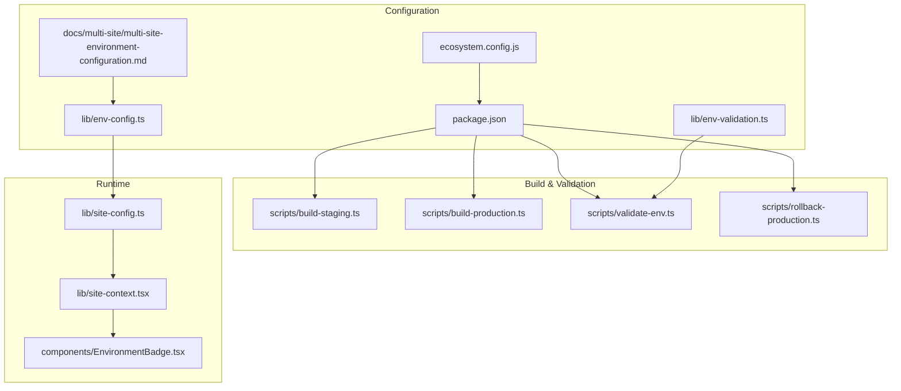
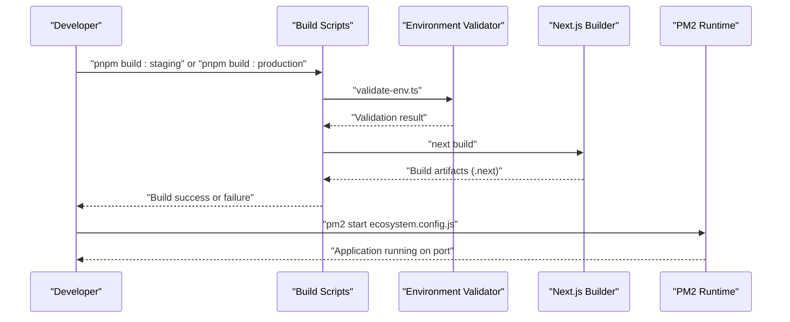
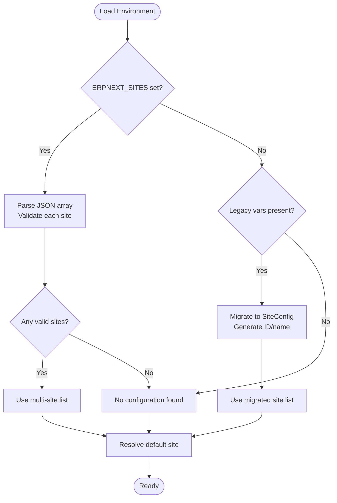
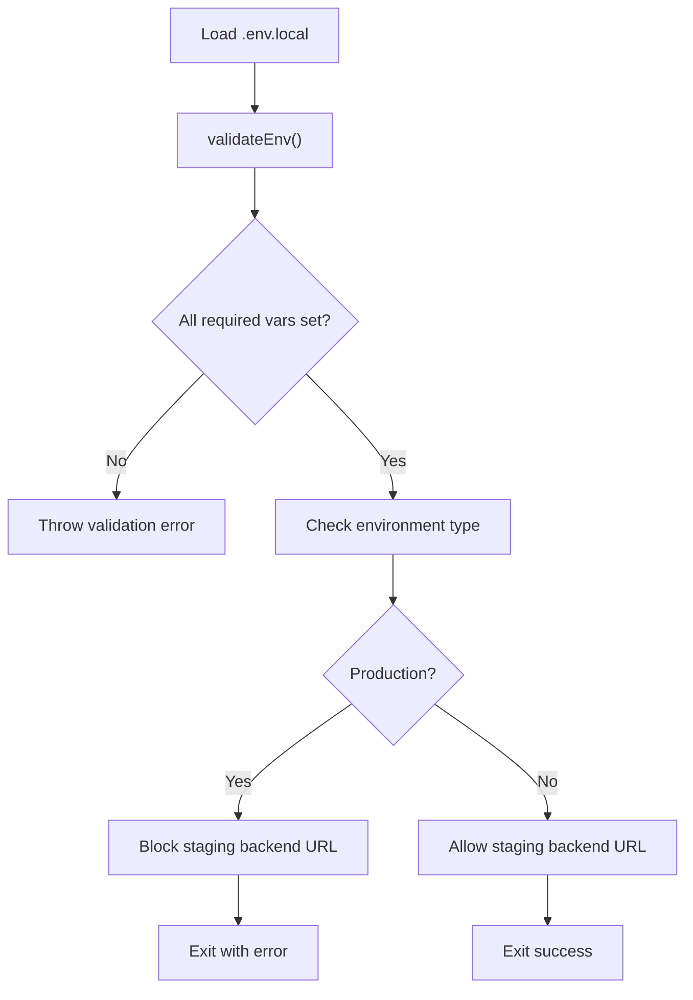
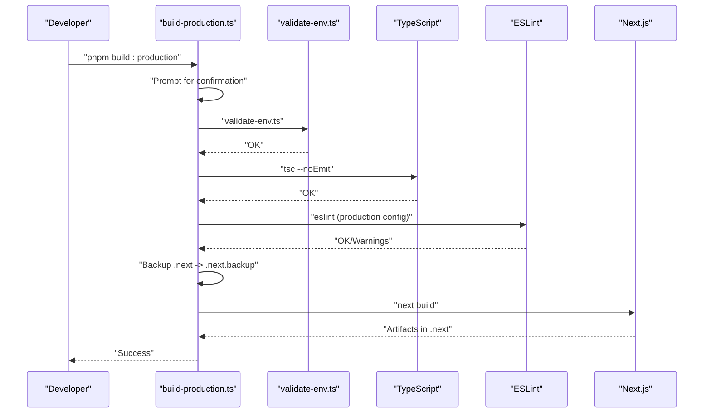
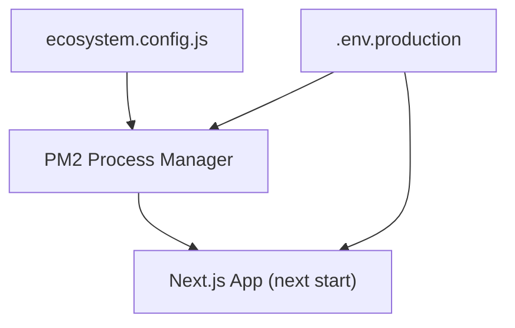
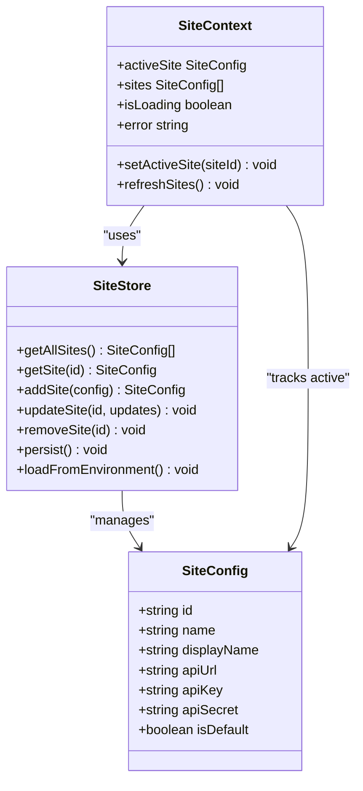
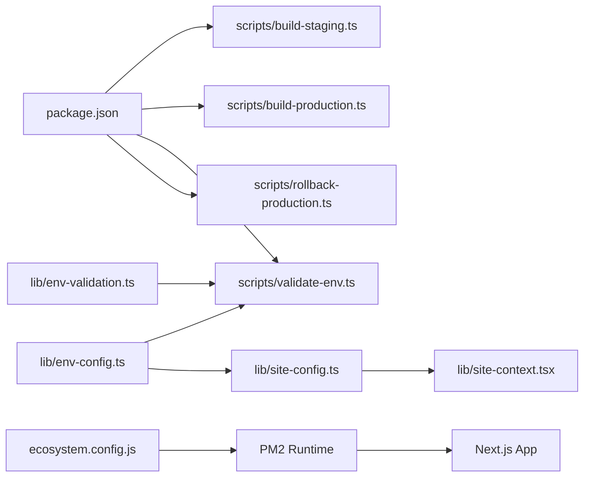

# Deployment and Configuration

<cite>
**Referenced Files in This Document**
- [DEPLOYMENT.md](file://docs/deployment/DEPLOYMENT.md)
- [production-deployment.md](file://docs/deployment/production-deployment.md)
- [staging-deployment.md](file://docs/deployment/staging-deployment.md)
- [multi-site-environment-configuration.md](file://docs/multi-site/multi-site-environment-configuration.md)
- [ecosystem.config.js](file://ecosystem.config.js)
- [package.json](file://package.json)
- [env-config.ts](file://lib/env-config.ts)
- [env-validation.ts](file://lib/env-validation.ts)
- [site-config.ts](file://lib/site-config.ts)
- [site-context.tsx](file://lib/site-context.tsx)
- [EnvironmentBadge.tsx](file://components/EnvironmentBadge.tsx)
- [validate-env.ts](file://scripts/validate-env.ts)
- [build-staging.ts](file://scripts/build-staging.ts)
- [build-production.ts](file://scripts/build-production.ts)
- [rollback-production.ts](file://scripts/rollback-production.ts)
</cite>

## Table of Contents
1. [Introduction](#introduction)
2. [Project Structure](#project-structure)
3. [Core Components](#core-components)
4. [Architecture Overview](#architecture-overview)
5. [Detailed Component Analysis](#detailed-component-analysis)
6. [Dependency Analysis](#dependency-analysis)
7. [Performance Considerations](#performance-considerations)
8. [Troubleshooting Guide](#troubleshooting-guide)
9. [Conclusion](#conclusion)
10. [Appendices](#appendices)

## Introduction
This document explains how to deploy and configure the Next.js ERP system across multiple environments (development, staging, and production). It covers environment management, multi-site configuration, deployment procedures, validation, monitoring, logging, maintenance, scaling, performance optimization, and disaster recovery planning. Practical examples are provided via file paths to scripts and configuration files.

## Project Structure
The deployment and configuration system centers around:
- Environment configuration modules for multi-site support
- Build and validation scripts for staging and production
- Process manager configuration for production runtime
- UI indicators for environment visibility
- Site context provider for runtime site switching

**Diagram sources**
- [ecosystem.config.js](file://ecosystem.config.js#L1-L18)
- [package.json](file://package.json#L5-L17)
- [env-config.ts](file://lib/env-config.ts#L1-L342)
- [env-validation.ts](file://lib/env-validation.ts#L1-L48)
- [multi-site-environment-configuration.md](file://docs/multi-site/multi-site-environment-configuration.md#L1-L232)
- [build-staging.ts](file://scripts/build-staging.ts#L1-L20)
- [build-production.ts](file://scripts/build-production.ts#L1-L87)
- [validate-env.ts](file://scripts/validate-env.ts#L1-L35)
- [rollback-production.ts](file://scripts/rollback-production.ts#L1-L24)
- [site-config.ts](file://lib/site-config.ts#L1-L322)
- [site-context.tsx](file://lib/site-context.tsx#L1-L353)
- [EnvironmentBadge.tsx](file://components/EnvironmentBadge.tsx#L1-L22)

**Section sources**
- [ecosystem.config.js](file://ecosystem.config.js#L1-L18)
- [package.json](file://package.json#L5-L17)
- [env-config.ts](file://lib/env-config.ts#L1-L342)
- [env-validation.ts](file://lib/env-validation.ts#L1-L48)
- [multi-site-environment-configuration.md](file://docs/multi-site/multi-site-environment-configuration.md#L1-L232)
- [build-staging.ts](file://scripts/build-staging.ts#L1-L20)
- [build-production.ts](file://scripts/build-production.ts#L1-L87)
- [validate-env.ts](file://scripts/validate-env.ts#L1-L35)
- [rollback-production.ts](file://scripts/rollback-production.ts#L1-L24)
- [site-config.ts](file://lib/site-config.ts#L1-L322)
- [site-context.tsx](file://lib/site-context.tsx#L1-L353)
- [EnvironmentBadge.tsx](file://components/EnvironmentBadge.tsx#L1-L22)

## Core Components
- Environment configuration parser supporting both legacy single-site and multi-site formats, with automatic migration and validation.
- Environment variable validation with schema enforcement and environment detection.
- Multi-site configuration persistence and runtime context provider for site switching.
- Build scripts for staging and production with validation, lint/type checks, and backup/rollback capabilities.
- Process manager configuration for production runtime using PM2.

**Section sources**
- [env-config.ts](file://lib/env-config.ts#L1-L342)
- [env-validation.ts](file://lib/env-validation.ts#L1-L48)
- [site-config.ts](file://lib/site-config.ts#L1-L322)
- [site-context.tsx](file://lib/site-context.tsx#L1-L353)
- [build-staging.ts](file://scripts/build-staging.ts#L1-L20)
- [build-production.ts](file://scripts/build-production.ts#L1-L87)
- [ecosystem.config.js](file://ecosystem.config.js#L1-L18)

## Architecture Overview
The deployment pipeline integrates environment configuration, build validation, and runtime orchestration:

**Diagram sources**
- [build-staging.ts](file://scripts/build-staging.ts#L1-L20)
- [build-production.ts](file://scripts/build-production.ts#L1-L87)
- [validate-env.ts](file://scripts/validate-env.ts#L1-L35)
- [ecosystem.config.js](file://ecosystem.config.js#L1-L18)

## Detailed Component Analysis

### Environment Configuration and Multi-Site Support
The system supports:
- Legacy single-site variables (URL, API key, API secret)
- Multi-site configuration via a JSON array with optional default site selection
- Automatic migration from legacy to multi-site format
- Validation of URLs and required fields
- Default site resolution with a built-in demo site fallback

**Diagram sources**
- [env-config.ts](file://lib/env-config.ts#L198-L341)
- [multi-site-environment-configuration.md](file://docs/multi-site/multi-site-environment-configuration.md#L1-L232)

**Section sources**
- [env-config.ts](file://lib/env-config.ts#L1-L342)
- [multi-site-environment-configuration.md](file://docs/multi-site/multi-site-environment-configuration.md#L1-L232)

### Environment Variable Validation
Validation enforces required variables and environment type, with additional checks to prevent accidental cross-environment connections.

**Diagram sources**
- [validate-env.ts](file://scripts/validate-env.ts#L1-L35)
- [env-validation.ts](file://lib/env-validation.ts#L12-L36)

**Section sources**
- [validate-env.ts](file://scripts/validate-env.ts#L1-L35)
- [env-validation.ts](file://lib/env-validation.ts#L1-L48)

### Build and Rollback Procedures
- Staging build: validates environment and runs Next.js build.
- Production build: prompts for confirmation, validates environment, runs type/lint checks, backs up previous build, then builds.
- Rollback: restores the previous build from backup.

**Diagram sources**
- [build-production.ts](file://scripts/build-production.ts#L1-L87)
- [validate-env.ts](file://scripts/validate-env.ts#L1-L35)

**Section sources**
- [build-staging.ts](file://scripts/build-staging.ts#L1-L20)
- [build-production.ts](file://scripts/build-production.ts#L1-L87)
- [rollback-production.ts](file://scripts/rollback-production.ts#L1-L24)

### Production Runtime with PM2
PM2 manages the production runtime, loading environment variables from a dedicated file and setting environment markers.

**Diagram sources**
- [ecosystem.config.js](file://ecosystem.config.js#L1-L18)

**Section sources**
- [ecosystem.config.js](file://ecosystem.config.js#L1-L18)

### Multi-Site Runtime Context
The site context provider loads sites from storage or environment, ensures a default demo site, persists active site selection, and clears caches on site switches.

**Diagram sources**
- [site-config.ts](file://lib/site-config.ts#L1-L322)
- [site-context.tsx](file://lib/site-context.tsx#L1-L353)
- [env-config.ts](file://lib/env-config.ts#L11-L36)

**Section sources**
- [site-config.ts](file://lib/site-config.ts#L1-L322)
- [site-context.tsx](file://lib/site-context.tsx#L1-L353)

### Environment Badge Visibility
The environment badge component is intentionally hidden in production for security and UX reasons, while still allowing development and staging to display badges.

**Section sources**
- [EnvironmentBadge.tsx](file://components/EnvironmentBadge.tsx#L1-L22)

## Dependency Analysis
The deployment pipeline depends on:
- Scripts defined in package.json to orchestrate builds, validation, and rollbacks
- Environment configuration modules to validate and load site settings
- PM2 configuration to run the application in production

**Diagram sources**
- [package.json](file://package.json#L5-L17)
- [env-validation.ts](file://lib/env-validation.ts#L1-L48)
- [env-config.ts](file://lib/env-config.ts#L1-L342)
- [site-config.ts](file://lib/site-config.ts#L1-L322)
- [site-context.tsx](file://lib/site-context.tsx#L1-L353)
- [ecosystem.config.js](file://ecosystem.config.js#L1-L18)

**Section sources**
- [package.json](file://package.json#L5-L17)
- [env-validation.ts](file://lib/env-validation.ts#L1-L48)
- [env-config.ts](file://lib/env-config.ts#L1-L342)
- [site-config.ts](file://lib/site-config.ts#L1-L322)
- [site-context.tsx](file://lib/site-context.tsx#L1-L353)
- [ecosystem.config.js](file://ecosystem.config.js#L1-L18)

## Performance Considerations
- Production builds disable verbose logging and source maps for optimal performance.
- Staging builds enable environment indicators and debugging aids.
- Use zero-downtime reloads with PM2 where possible to minimize service interruption.
- Keep dependencies updated after staging testing to avoid production surprises.

[No sources needed since this section provides general guidance]

## Troubleshooting Guide
Common issues and resolutions:
- Build confirmation timeout: ensure lowercase "yes" is typed and terminal input is functional.
- TypeScript errors: run type check locally to identify and fix issues before production build.
- ESLint violations: address lint errors/warnings prior to production build.
- Environment validation failures: verify required variables and correct backend URLs.
- Backend connection issues: confirm ERPNext instance accessibility, firewall rules, and valid credentials.
- Immediate rollback: use the rollback script to restore the previous build and restart the application.
- Build recovery: rebuild from source or restore from version control if backups are corrupted.

**Section sources**
- [production-deployment.md](file://docs/deployment/production-deployment.md#L166-L241)
- [staging-deployment.md](file://docs/deployment/staging-deployment.md#L97-L151)
- [DEPLOYMENT.md](file://docs/deployment/DEPLOYMENT.md#L116-L200)

## Conclusion
The system provides a robust, multi-environment deployment framework with strong validation, clear separation of concerns, and operational safeguards. By following the staged rollout process and leveraging the provided scripts and configuration, teams can reliably deploy, monitor, and maintain the application across environments.

[No sources needed since this section summarizes without analyzing specific files]

## Appendices

### A. Multi-Environment Setup Checklist
- Development: configure local environment variables and run dev server.
- Staging: set staging-specific variables, build and start staging, verify environment badge.
- Production: set production variables, run production build with confirmation, deploy via PM2, verify no environment badge.

**Section sources**
- [staging-deployment.md](file://docs/deployment/staging-deployment.md#L24-L81)
- [production-deployment.md](file://docs/deployment/production-deployment.md#L30-L105)
- [DEPLOYMENT.md](file://docs/deployment/DEPLOYMENT.md#L10-L84)

### B. Environment Variable Configuration Examples
- Staging environment variables file path: [staging-deployment.md](file://docs/deployment/staging-deployment.md#L26-L41)
- Production environment variables file path: [production-deployment.md](file://docs/deployment/production-deployment.md#L32-L47)
- Multi-site configuration examples: [multi-site-environment-configuration.md](file://docs/multi-site/multi-site-environment-configuration.md#L13-L169)

**Section sources**
- [staging-deployment.md](file://docs/deployment/staging-deployment.md#L26-L41)
- [production-deployment.md](file://docs/deployment/production-deployment.md#L32-L47)
- [multi-site-environment-configuration.md](file://docs/multi-site/multi-site-environment-configuration.md#L13-L169)

### C. Deployment Scripts and Commands
- Staging build: [build-staging.ts](file://scripts/build-staging.ts#L1-L20)
- Production build: [build-production.ts](file://scripts/build-production.ts#L1-L87)
- Environment validation: [validate-env.ts](file://scripts/validate-env.ts#L1-L35)
- Rollback: [rollback-production.ts](file://scripts/rollback-production.ts#L1-L24)
- Package.json scripts: [package.json](file://package.json#L5-L17)

**Section sources**
- [build-staging.ts](file://scripts/build-staging.ts#L1-L20)
- [build-production.ts](file://scripts/build-production.ts#L1-L87)
- [validate-env.ts](file://scripts/validate-env.ts#L1-L35)
- [rollback-production.ts](file://scripts/rollback-production.ts#L1-L24)
- [package.json](file://package.json#L5-L17)

### D. Monitoring, Logging, and Maintenance
- PM2 commands for status, logs, monitoring, and saving process lists: [DEPLOYMENT.md](file://docs/deployment/DEPLOYMENT.md#L165-L200)
- Production verification steps: [production-deployment.md](file://docs/deployment/production-deployment.md#L99-L165)
- Staging verification steps: [staging-deployment.md](file://docs/deployment/staging-deployment.md#L76-L81)

**Section sources**
- [DEPLOYMENT.md](file://docs/deployment/DEPLOYMENT.md#L165-L200)
- [production-deployment.md](file://docs/deployment/production-deployment.md#L99-L165)
- [staging-deployment.md](file://docs/deployment/staging-deployment.md#L76-L81)

### E. Scaling, Performance Optimization, and Disaster Recovery
- Scaling: adjust PM2 instances and memory limits in ecosystem configuration as needed.
- Performance: rely on production builds for optimized assets and minimal logging.
- Disaster recovery: maintain automatic build backups during production builds and use rollback when needed.

**Section sources**
- [ecosystem.config.js](file://ecosystem.config.js#L12-L16)
- [production-deployment.md](file://docs/deployment/production-deployment.md#L106-L130)
- [build-production.ts](file://scripts/build-production.ts#L55-L62)