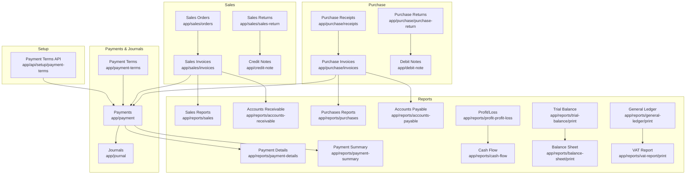
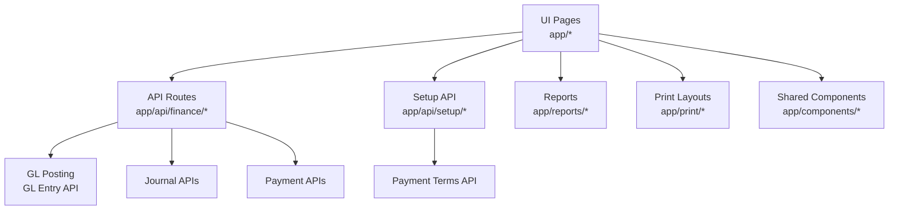
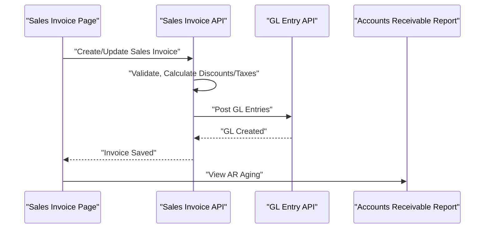
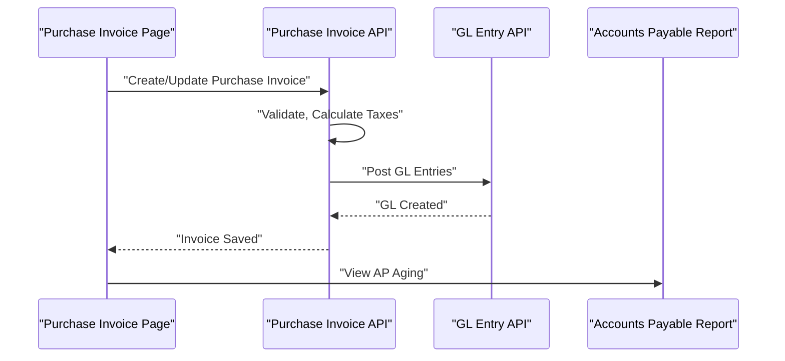
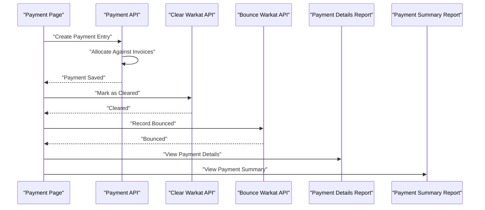
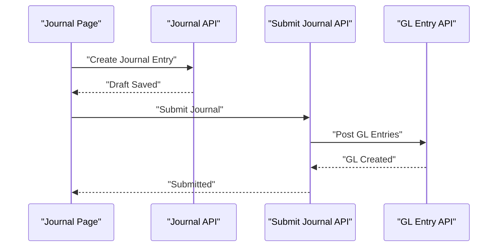
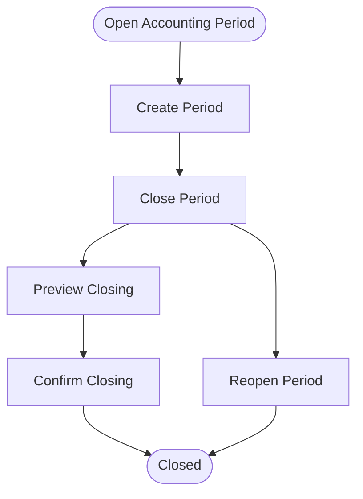
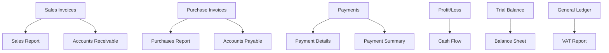
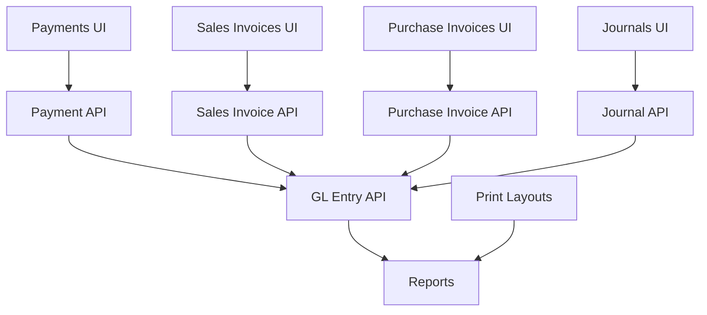

# Financial Operations

<cite>
**Referenced Files in This Document**
- [route.ts](file://app/api/finance/journal/route.ts)
- [route.ts](file://app/api/finance/journal/[name]/route.ts)
- [route.ts](file://app/api/finance/journal/[name]/submit/route.ts)
- [route.ts](file://app/api/finance/gl-entry/route.ts)
- [route.ts](file://app/api/finance/payments/route.ts)
- [route.ts](file://app/api/finance/payments/[name]/route.ts)
- [route.ts](file://app/api/finance/payments/[name]/submit/route.ts)
- [route.ts](file://app/api/finance/payments/bounce-warkat/route.ts)
- [route.ts](file://app/api/finance/payments/clear-warkat/route.ts)
- [route.ts](file://app/api/finance/payments/details/route.ts)
- [route.ts](file://app/api/setup/payment-terms/route.ts)
- [route.ts](file://app/api/setup/payment-terms/detail/route.ts)
- [page.tsx](file://app/journal/journalMain/page.tsx)
- [page.tsx](file://app/payment/paymentMain/page.tsx)
- [page.tsx](file://app/payment-terms/ptMain/page.tsx)
- [page.tsx](file://app/sales/invoices/siMain/page.tsx)
- [page.tsx](file://app/purchase/invoices/piMain/page.tsx)
- [page.tsx](file://app/sales/sales-return/srMain/page.tsx)
- [page.tsx](file://app/purchase/purchase-return/prMain/page.tsx)
- [page.tsx](file://app/debit-note/dnMain/page.tsx)
- [page.tsx](file://app/credit-note/cnMain/page.tsx)
- [page.tsx](file://app/accounting-period/dashboard/page.tsx)
- [page.tsx](file://app/accounting-period/close/[name]/page.tsx)
- [page.tsx](file://app/accounting-period/close/[name]/confirm/page.tsx)
- [page.tsx](file://app/accounting-period/close/[name]/preview/page.tsx)
- [page.tsx](file://app/accounting-period/close/[name]/review/page.tsx)
- [page.tsx](file://app/accounting-period/create/page.tsx)
- [page.tsx](file://app/accounting-period/comparison/page.tsx)
- [page.tsx](file://app/financial-reports/page.tsx)
- [page.tsx](file://app/reports/accounts-receivable/page.tsx)
- [page.tsx](file://app/reports/accounts-payable/page.tsx)
- [page.tsx](file://app/reports/sales/page.tsx)
- [page.tsx](file://app/reports/purchases/page.tsx)
- [page.tsx](file://app/reports/payment-details/page.tsx)
- [page.tsx](file://app/reports/payment-summary/page.tsx)
- [page.tsx](file://app/reports/profit-profit-loss/page.tsx)
- [page.tsx](file://app/reports/cash-flow/page.tsx)
- [page.tsx](file://app/reports/stock-balance/page.tsx)
- [page.tsx](file://app/reports/stock-card/page.tsx)
- [page.tsx](file://app/reports/hpp-ledger/page.tsx)
- [page.tsx](file://app/reports/hpp-reconciliation/page.tsx)
- [page.tsx](file://app/reports/returns/page.tsx)
- [page.tsx](file://app/reports/margin-analysis/page.tsx)
- [page.tsx](file://app/reports/acquisition-costs/page.tsx)
- [page.tsx](file://app/reports/purchase-invoice-details/page.tsx)
- [page.tsx](file://app/reports/sales-invoice-details/page.tsx)
- [page.tsx](file://app/reports/commission/print/page.tsx)
- [page.tsx](file://app/reports/profit/print/page.tsx)
- [page.tsx](file://app/reports/system/print/page.tsx)
- [page.tsx](file://app/reports/inventory/print/page.tsx)
- [page.tsx](file://app/reports/general/print/page.tsx)
- [page.tsx](file://app/reports/trial-balance/print/page.tsx)
- [page.tsx](file://app/reports/balance-sheet/print/page.tsx)
- [page.tsx](file://app/reports/profit-loss/print/page.tsx)
- [page.tsx](file://app/reports/cash-flow/print/page.tsx)
- [page.tsx](file://app/reports/general-ledger/print/page.tsx)
- [page.tsx](file://app/reports/vat-report/print/page.tsx)
- [page.tsx](file://app/reports/payment-details/print/page.tsx)
- [page.tsx](file://app/reports/payment-summary/print/page.tsx)
- [page.tsx](file://app/reports/stock-balance/print/page.tsx)
- [page.tsx](file://app/reports/stock-card/print/page.tsx)
- [page.tsx](file://app/reports/hpp-ledger/print/page.tsx)
- [page.tsx](file://app/reports/hpp-reconciliation/print/page.tsx)
- [page.tsx](file://app/reports/returns/print/page.tsx)
- [page.tsx](file://app/reports/margin-analysis/print/page.tsx)
- [page.tsx](file://app/reports/acquisition-costs/print/page.tsx)
- [page.tsx](file://app/reports/purchase-invoice-details/print/page.tsx)
- [page.tsx](file://app/reports/sales-invoice-details/print/page.tsx)
- [page.tsx](file://app/reports/commission/print/layout.tsx)
- [page.tsx](file://app/reports/profit/print/layout.tsx)
- [page.tsx](file://app/reports/system/print/layout.tsx)
- [page.tsx](file://app/reports/inventory/print/layout.tsx)
- [page.tsx](file://app/reports/general/print/layout.tsx)
- [page.tsx](file://app/reports/trial-balance/print/layout.tsx)
- [page.tsx](file://app/reports/balance-sheet/print/layout.tsx)
- [page.tsx](file://app/reports/profit-loss/print/layout.tsx)
- [page.tsx](file://app/reports/cash-flow/print/layout.tsx)
- [page.tsx](file://app/reports/general-ledger/print/layout.tsx)
- [page.tsx](file://app/reports/vat-report/print/layout.tsx)
- [page.tsx](file://app/reports/payment-details/print/layout.tsx)
- [page.tsx](file://app/reports/payment-summary/print/layout.tsx)
- [page.tsx](file://app/reports/stock-balance/print/layout.tsx)
- [page.tsx](file://app/reports/stock-card/print/layout.tsx)
- [page.tsx](file://app/reports/hpp-ledger/print/layout.tsx)
- [page.tsx](file://app/reports/hpp-reconciliation/print/layout.tsx)
- [page.tsx](file://app/reports/returns/print/layout.tsx)
- [page.tsx](file://app/reports/margin-analysis/print/layout.tsx)
- [page.tsx](file://app/reports/acquisition-costs/print/layout.tsx)
- [page.tsx](file://app/reports/purchase-invoice-details/print/layout.tsx)
- [page.tsx](file://app/reports/sales-invoice-details/print/layout.tsx)
- [page.tsx](file://app/print/invoice/page.tsx)
- [page.tsx](file://app/print/purchase-invoice/page.tsx)
- [page.tsx](file://app/print/sales-order/page.tsx)
- [page.tsx](file://app/print/purchase-order/page.tsx)
- [page.tsx](file://app/print/delivery-note/page.tsx)
- [page.tsx](file://app/print/purchase-receipt/page.tsx)
- [page.tsx](file://app/print/sales-return/page.tsx)
- [page.tsx](file://app/print/purchase-return/page.tsx)
- [page.tsx](file://app/print/credit-note/page.tsx)
- [page.tsx](file://app/print/debit-note/page.tsx)
- [page.tsx](file://app/print/payment/page.tsx)
- [page.tsx](file://app/print/stock-adjustment/page.tsx)
- [page.tsx](file://app/print/commission/print/page.tsx)
- [page.tsx](file://app/print/profit/print/page.tsx)
- [page.tsx](file://app/print/system/print/page.tsx)
- [page.tsx](file://app/print/inventory/print/page.tsx)
- [page.tsx](file://app/print/general/print/page.tsx)
- [page.tsx](file://app/print/trial-balance/print/page.tsx)
- [page.tsx](file://app/print/balance-sheet/print/page.tsx)
- [page.tsx](file://app/print/profit-loss/print/page.tsx)
- [page.tsx](file://app/print/cash-flow/print/page.tsx)
- [page.tsx](file://app/print/general-ledger/print/page.tsx)
- [page.tsx](file://app/print/vat-report/print/page.tsx)
- [page.tsx](file://app/print/payment-details/print/page.tsx)
- [page.tsx](file://app/print/payment-summary/print/page.tsx)
- [page.tsx](file://app/print/stock-balance/print/page.tsx)
- [page.tsx](file://app/print/stock-card/print/page.tsx)
- [page.tsx](file://app/print/hpp-ledger/print/page.tsx)
- [page.tsx](file://app/print/hpp-reconciliation/print/page.tsx)
- [page.tsx](file://app/print/returns/print/page.tsx)
- [page.tsx](file://app/print/margin-analysis/print/page.tsx)
- [page.tsx](file://app/print/acquisition-costs/print/page.tsx)
- [page.tsx](file://app/print/purchase-invoice-details/print/page.tsx)
- [page.tsx](file://app/print/sales-invoice-details/print/page.tsx)
- [page.tsx](file://app/print/commission/print/layout.tsx)
- [page.tsx](file://app/print/profit/print/layout.tsx)
- [page.tsx](file://app/print/system/print/layout.tsx)
- [page.tsx](file://app/print/inventory/print/layout.tsx)
- [page.tsx](file://app/print/general/print/layout.tsx)
- [page.tsx](file://app/print/trial-balance/print/layout.tsx)
- [page.tsx](file://app/print/balance-sheet/print/layout.tsx)
- [page.tsx](file://app/print/profit-loss/print/layout.tsx)
- [page.tsx](file://app/print/cash-flow/print/layout.tsx)
- [page.tsx](file://app/print/general-ledger/print/layout.tsx)
- [page.tsx](file://app/print/vat-report/print/layout.tsx)
- [page.tsx](file://app/print/payment-details/print/layout.tsx)
- [page.tsx](file://app/print/payment-summary/print/layout.tsx)
- [page.tsx](file://app/print/stock-balance/print/layout.tsx)
- [page.tsx](file://app/print/stock-card/print/layout.tsx)
- [page.tsx](file://app/print/hpp-ledger/print/layout.tsx)
- [page.tsx](file://app/print/hpp-reconciliation/print/layout.tsx)
- [page.tsx](file://app/print/returns/print/layout.tsx)
- [page.tsx](file://app/print/margin-analysis/print/layout.tsx)
- [page.tsx](file://app/print/acquisition-costs/print/layout.tsx)
- [page.tsx](file://app/print/purchase-invoice-details/print/layout.tsx)
- [page.tsx](file://app/print/sales-invoice-details/print/layout.tsx)
- [page.tsx](file://app/components/PaymentCustomerDialog.tsx)
- [page.tsx](file://app/components/PaymentSupplierDialog.tsx)
- [page.tsx](file://app/components/CustomerDialog.tsx)
- [page.tsx](file://app/components/ItemDialog.tsx)
- [page.tsx](file://app/components/DeliveryNoteDialog.tsx)
- [page.tsx](file://app/components/SalesOrderDialog.tsx)
- [page.tsx](file://app/components/SalesPersonDialog.tsx)
- [page.tsx](file://app/components/SearchableSelectDialog.tsx)
- [page.tsx](file://app/components/Navbar.tsx)
- [page.tsx](file://app/components/Pagination.tsx)
- [page.tsx](file://app/components/LoadingSpinner.tsx)
- [page.tsx](file://app/components/PrintDialog.tsx)
- [page.tsx](file://app/components/PrintLayout.tsx)
- [page.tsx](file://app/components/A4ReportLayout.tsx)
- [page.tsx](file://app/components/CurrencyInput.tsx)
- [page.tsx](file://app/components/DateInput.tsx)
- [page.tsx](file://app/components/BrowserStyleDatePicker.tsx)
- [page.tsx](file://app/components/HybridDatePicker.tsx)
- [page.tsx](file://app/components/EnvironmentBadge.tsx)
- [page.tsx](file://app/components/ErrorDialog.tsx)
- [page.tsx](file://app/components/ToastContainer.tsx)
- [page.tsx](file://app/components/SkeletonCard.tsx)
- [page.tsx](file://app/components/SkeletonList.tsx)
- [page.tsx](file://app/components/SkeletonTableRow.tsx)
- [page.tsx](file://app/components/LoadingButton.tsx)
- [page.tsx](file://app/components/LoadingOverlay.tsx)
- [page.tsx](file://app/components/SiteGuard.tsx)
- [page.tsx](file://app/components/CommissionDashboard.tsx)
- [page.tsx](file://app/components/AccountSearchDialog.tsx)
- [page.tsx](file://app/components/CustomDatePicker.tsx)
- [page.tsx](file://app/components/PrintPreviewModal.tsx)
- [page.tsx](file://app/components/SalesOrderForm.tsx)
- [page.tsx](file://app/components/ToastContainer.tsx)
- [page.tsx](file://app/components/ToastContainer.tsx)
- [page.tsx](file://app/components/ToastContainer.tsx)
- [page.tsx](file://app/components/ToastContainer.tsx)
- [page.tsx](file://app/components/ToastContainer.tsx)
- [page.tsx](file://app/components/ToastContainer.tsx)
- [page.tsx](file://app/components/ToastContainer.tsx)
- [page.tsx](file://app/components/ToastContainer.tsx)
- [page.tsx](file://app/components/ToastContainer.tsx)
- [page.tsx](file://app/components/ToastContainer.tsx)
- [page.tsx](file://app/components/ToastContainer.tsx)
- [page.tsx](file://app/components/ToastContainer.tsx)
- [page.tsx](file://app/components/ToastContainer.tsx)
- [page.tsx](file://app/components/ToastContainer.tsx)
- [page.tsx](file://app/components/ToastContainer.tsx)
- [page.tsx](file://app/components/ToastContainer.tsx)
- [page.tsx](file://app/components/ToastContainer.tsx)
- [page.tsx](file://app/components/ToastContainer.tsx)
- [page.tsx](file://app/components/ToastContainer.tsx)
- [page.tsx](file://app/components/ToastContainer.tsx)
- [page.tsx](file://app/components/ToastContainer.tsx)
- [page.tsx](file://app/components/ToastContainer.tsx)
- [page.tsx](file://app/components/ToastContainer.tsx)
- [page.tsx](file://app/components/ToastContainer.tsx)
- [page.tsx](file://app/components/ToastContainer.tsx)
- [page.tsx](file://app/components/ToastContainer.tsx)
- [page.tsx](file://app/components/ToastContainer.tsx)
- [page.tsx](file://app/components/ToastContainer.tsx)
- [page.tsx](file://app/components/ToastContainer.tsx)
- [page.tsx](file://app/components/ToastContainer.tsx)
- [page.tsx](file://app/components/ToastContainer.tsx)
- [page.tsx](file://app/components/ToastContainer.tsx)
......
</cite>

## Table of Contents
1. [Introduction](#introduction)
2. [Project Structure](#project-structure)
3. [Core Components](#core-components)
4. [Architecture Overview](#architecture-overview)
5. [Detailed Component Analysis](#detailed-component-analysis)
6. [Dependency Analysis](#dependency-analysis)
7. [Performance Considerations](#performance-considerations)
8. [Troubleshooting Guide](#troubleshooting-guide)
9. [Conclusion](#conclusion)
10. [Appendices](#appendices)

## Introduction
This document provides comprehensive documentation for Financial Operations within the system, focusing on sales management, purchase management, payment processing, and journal entries. It explains the end-to-end financial workflow from document creation through posting and reporting. It also covers customer and supplier management, discount and tax calculations, sales and purchase returns, payment entry processing, bank reconciliation, payment terms management, multi-currency support, journal entry creation, general ledger (GL) posting, and financial reporting integration. Practical examples, error handling scenarios, and integration patterns with ERPNext’s financial modules are included.

## Project Structure
The financial domain is organized around Next.js app routes under app/api/finance and app/api/setup, with frontend pages under app/ for UI components and reporting under app/reports and app/print. Key areas include:
- Sales: invoices, orders, returns, credit notes
- Purchase: invoices, receipts, returns, debit notes
- Payments: payment entries, clearing, bounce handling, payment terms
- Journal: manual journal entries and cash receipt/payment journals
- Accounting Period: period closing, reopening, and audit logs
- Reports: AR/AP, sales/purchases, payment details/summary, profit/loss, cash flow, stock reports, VAT, trial balance, balance sheet, general ledger

**Diagram sources**
- [page.tsx](file://app/sales/invoices/siMain/page.tsx)
- [page.tsx](file://app/purchase/invoices/piMain/page.tsx)
- [page.tsx](file://app/sales/sales-return/srMain/page.tsx)
- [page.tsx](file://app/purchase/purchase-return/prMain/page.tsx)
- [page.tsx](file://app/credit-note/cnMain/page.tsx)
- [page.tsx](file://app/debit-note/dnMain/page.tsx)
- [page.tsx](file://app/payment/paymentMain/page.tsx)
- [page.tsx](file://app/journal/journalMain/page.tsx)
- [page.tsx](file://app/payment-terms/ptMain/page.tsx)
- [page.tsx](file://app/reports/accounts-receivable/page.tsx)
- [page.tsx](file://app/reports/accounts-payable/page.tsx)
- [page.tsx](file://app/reports/sales/page.tsx)
- [page.tsx](file://app/reports/purchases/page.tsx)
- [page.tsx](file://app/reports/payment-details/page.tsx)
- [page.tsx](file://app/reports/payment-summary/page.tsx)
- [page.tsx](file://app/reports/profit-profit-loss/page.tsx)
- [page.tsx](file://app/reports/cash-flow/page.tsx)
- [page.tsx](file://app/reports/trial-balance/print/page.tsx)
- [page.tsx](file://app/reports/balance-sheet/print/page.tsx)
- [page.tsx](file://app/reports/general-ledger/print/page.tsx)
- [page.tsx](file://app/reports/vat-report/print/page.tsx)

**Section sources**
- [page.tsx](file://app/sales/invoices/siMain/page.tsx)
- [page.tsx](file://app/purchase/invoices/piMain/page.tsx)
- [page.tsx](file://app/payment/paymentMain/page.tsx)
- [page.tsx](file://app/journal/journalMain/page.tsx)
- [page.tsx](file://app/payment-terms/ptMain/page.tsx)
- [page.tsx](file://app/reports/accounts-receivable/page.tsx)
- [page.tsx](file://app/reports/accounts-payable/page.tsx)
- [page.tsx](file://app/reports/sales/page.tsx)
- [page.tsx](file://app/reports/purchases/page.tsx)
- [page.tsx](file://app/reports/payment-details/page.tsx)
- [page.tsx](file://app/reports/payment-summary/page.tsx)
- [page.tsx](file://app/reports/profit-profit-loss/page.tsx)
- [page.tsx](file://app/reports/cash-flow/page.tsx)
- [page.tsx](file://app/reports/trial-balance/print/page.tsx)
- [page.tsx](file://app/reports/balance-sheet/print/page.tsx)
- [page.tsx](file://app/reports/general-ledger/print/page.tsx)
- [page.tsx](file://app/reports/vat-report/print/page.tsx)

## Core Components
- Sales Invoices: Creation, validation, discount/tax calculation, posting, AR aging, and reporting.
- Purchase Invoices: Creation, validation, tax handling, AP aging, and reporting.
- Payments: Payment entry creation, allocation against invoices, clearing, bounce handling, and reporting.
- Journals: Manual journal entries and cash receipt/payment journals; submit/cancel flows.
- Accounting Period: Period creation, closing, reopening, and audit log.
- Reports: AR/AP aging, sales/purchases, payment details/summary, profit/loss, cash flow, stock, VAT, trial balance, balance sheet, general ledger.

**Section sources**
- [page.tsx](file://app/sales/invoices/siMain/page.tsx)
- [page.tsx](file://app/purchase/invoices/piMain/page.tsx)
- [page.tsx](file://app/payment/paymentMain/page.tsx)
- [page.tsx](file://app/journal/journalMain/page.tsx)
- [page.tsx](file://app/accounting-period/dashboard/page.tsx)
- [page.tsx](file://app/reports/accounts-receivable/page.tsx)
- [page.tsx](file://app/reports/accounts-payable/page.tsx)
- [page.tsx](file://app/reports/sales/page.tsx)
- [page.tsx](file://app/reports/purchases/page.tsx)
- [page.tsx](file://app/reports/payment-details/page.tsx)
- [page.tsx](file://app/reports/payment-summary/page.tsx)
- [page.tsx](file://app/reports/profit-profit-loss/page.tsx)
- [page.tsx](file://app/reports/cash-flow/page.tsx)
- [page.tsx](file://app/reports/trial-balance/print/page.tsx)
- [page.tsx](file://app/reports/balance-sheet/print/page.tsx)
- [page.tsx](file://app/reports/general-ledger/print/page.tsx)
- [page.tsx](file://app/reports/vat-report/print/page.tsx)

## Architecture Overview
The financial architecture follows a layered pattern:
- Frontend Pages: Next.js app router pages for Sales, Purchase, Payments, Journals, Accounting Period, and Reports.
- API Routes: app/api/finance/* for financial operations (journal, GL entry, payments) and app/api/setup/payment-terms for payment term management.
- Reporting: Dedicated report pages and print layouts for financial statements and transaction details.
- Dialogs and Components: Shared UI components for dialogs, date pickers, currency inputs, and printing.

**Diagram sources**
- [route.ts](file://app/api/finance/journal/route.ts)
- [route.ts](file://app/api/finance/gl-entry/route.ts)
- [route.ts](file://app/api/finance/payments/route.ts)
- [route.ts](file://app/api/setup/payment-terms/route.ts)
- [page.tsx](file://app/reports/financial-reports/page.tsx)
- [page.tsx](file://app/print/invoice/page.tsx)

**Section sources**
- [route.ts](file://app/api/finance/journal/route.ts)
- [route.ts](file://app/api/finance/gl-entry/route.ts)
- [route.ts](file://app/api/finance/payments/route.ts)
- [route.ts](file://app/api/setup/payment-terms/route.ts)
- [page.tsx](file://app/reports/financial-reports/page.tsx)
- [page.tsx](file://app/print/invoice/page.tsx)

## Detailed Component Analysis

### Sales Management
Sales management encompasses sales invoices, orders, returns, and credit notes. The workflow includes:
- Sales Order creation and fulfillment leading to Sales Invoice generation.
- Invoice creation with item lines, discounts, taxes, and multi-currency support.
- AR aging and receivable tracking via Accounts Receivable report.
- Sales returns handled via Sales Return documents and Credit Notes.

**Diagram sources**
- [page.tsx](file://app/sales/invoices/siMain/page.tsx)
- [route.ts](file://app/api/finance/gl-entry/route.ts)
- [page.tsx](file://app/reports/accounts-receivable/page.tsx)

**Section sources**
- [page.tsx](file://app/sales/invoices/siMain/page.tsx)
- [page.tsx](file://app/sales/orders/soMain/page.tsx)
- [page.tsx](file://app/sales/sales-return/srMain/page.tsx)
- [page.tsx](file://app/credit-note/cnMain/page.tsx)
- [page.tsx](file://app/reports/accounts-receivable/page.tsx)

### Purchase Management
Purchase management includes purchase invoices, receipts, returns, and debit notes:
- Purchase Order leads to Purchase Receipt and Purchase Invoice.
- Invoice creation with taxes and multi-currency support.
- AP aging via Accounts Payable report.
- Purchase returns handled via Purchase Return and Debit Notes.

**Diagram sources**
- [page.tsx](file://app/purchase/invoices/piMain/page.tsx)
- [route.ts](file://app/api/finance/gl-entry/route.ts)
- [page.tsx](file://app/reports/accounts-payable/page.tsx)

**Section sources**
- [page.tsx](file://app/purchase/invoices/piMain/page.tsx)
- [page.tsx](file://app/purchase/receipts/prMain/page.tsx)
- [page.tsx](file://app/purchase/purchase-return/prMain/page.tsx)
- [page.tsx](file://app/debit-note/dnMain/page.tsx)
- [page.tsx](file://app/reports/accounts-payable/page.tsx)

### Payment Processing
Payment processing supports payment entries, invoice allocation, clearing, bounce handling, and payment terms:
- Payment Entry creation with allocation against outstanding invoices.
- Clearing and bounce handling for warkats (payment instruments).
- Payment Terms define due dates and discount policies.
- Reports for Payment Details and Payment Summary.

**Diagram sources**
- [page.tsx](file://app/payment/paymentMain/page.tsx)
- [route.ts](file://app/api/finance/payments/route.ts)
- [route.ts](file://app/api/finance/payments/clear-warkat/route.ts)
- [route.ts](file://app/api/finance/payments/bounce-warkat/route.ts)
- [page.tsx](file://app/reports/payment-details/page.tsx)
- [page.tsx](file://app/reports/payment-summary/page.tsx)

**Section sources**
- [page.tsx](file://app/payment/paymentMain/page.tsx)
- [route.ts](file://app/api/finance/payments/route.ts)
- [route.ts](file://app/api/finance/payments/clear-warkat/route.ts)
- [route.ts](file://app/api/finance/payments/bounce-warkat/route.ts)
- [page.tsx](file://app/reports/payment-details/page.tsx)
- [page.tsx](file://app/reports/payment-summary/page.tsx)

### Journal Entries
Manual journal entries and cash journals are supported:
- Create, submit, and cancel journal entries.
- Cash receipt and cash payment journals integrated via dedicated routes.

**Diagram sources**
- [page.tsx](file://app/journal/journalMain/page.tsx)
- [route.ts](file://app/api/finance/journal/route.ts)
- [route.ts](file://app/api/finance/journal/[name]/submit/route.ts)
- [route.ts](file://app/api/finance/gl-entry/route.ts)

**Section sources**
- [page.tsx](file://app/journal/journalMain/page.tsx)
- [route.ts](file://app/api/finance/journal/route.ts)
- [route.ts](file://app/api/finance/journal/[name]/route.ts)
- [route.ts](file://app/api/finance/journal/[name]/submit/route.ts)
- [route.ts](file://app/api/finance/gl-entry/route.ts)

### Accounting Period
Accounting Period management supports period creation, closing, reopening, and audit logging:
- Dashboard for period overview.
- Close period with preview and confirmation steps.
- Audit log and comparison views.

**Diagram sources**
- [page.tsx](file://app/accounting-period/dashboard/page.tsx)
- [page.tsx](file://app/accounting-period/create/page.tsx)
- [page.tsx](file://app/accounting-period/close/[name]/page.tsx)
- [page.tsx](file://app/accounting-period/close/[name]/confirm/page.tsx)
- [page.tsx](file://app/accounting-period/close/[name]/preview/page.tsx)
- [page.tsx](file://app/accounting-period/close/[name]/review/page.tsx)
- [page.tsx](file://app/accounting-period/comparison/page.tsx)

**Section sources**
- [page.tsx](file://app/accounting-period/dashboard/page.tsx)
- [page.tsx](file://app/accounting-period/create/page.tsx)
- [page.tsx](file://app/accounting-period/close/[name]/page.tsx)
- [page.tsx](file://app/accounting-period/close/[name]/confirm/page.tsx)
- [page.tsx](file://app/accounting-period/close/[name]/preview/page.tsx)
- [page.tsx](file://app/accounting-period/close/[name]/review/page.tsx)
- [page.tsx](file://app/accounting-period/comparison/page.tsx)

### Financial Reporting Integration
Financial reporting integrates with multiple report types:
- AR/AP aging, sales/purchases, payment details/summary, profit/loss, cash flow, stock, VAT, trial balance, balance sheet, general ledger.

**Diagram sources**
- [page.tsx](file://app/reports/sales/page.tsx)
- [page.tsx](file://app/reports/purchases/page.tsx)
- [page.tsx](file://app/reports/payment-details/page.tsx)
- [page.tsx](file://app/reports/payment-summary/page.tsx)
- [page.tsx](file://app/reports/accounts-receivable/page.tsx)
- [page.tsx](file://app/reports/accounts-payable/page.tsx)
- [page.tsx](file://app/reports/profit-profit-loss/page.tsx)
- [page.tsx](file://app/reports/cash-flow/page.tsx)
- [page.tsx](file://app/reports/trial-balance/print/page.tsx)
- [page.tsx](file://app/reports/balance-sheet/print/page.tsx)
- [page.tsx](file://app/reports/general-ledger/print/page.tsx)
- [page.tsx](file://app/reports/vat-report/print/page.tsx)

**Section sources**
- [page.tsx](file://app/reports/sales/page.tsx)
- [page.tsx](file://app/reports/purchases/page.tsx)
- [page.tsx](file://app/reports/payment-details/page.tsx)
- [page.tsx](file://app/reports/payment-summary/page.tsx)
- [page.tsx](file://app/reports/accounts-receivable/page.tsx)
- [page.tsx](file://app/reports/accounts-payable/page.tsx)
- [page.tsx](file://app/reports/profit-profit-loss/page.tsx)
- [page.tsx](file://app/reports/cash-flow/page.tsx)
- [page.tsx](file://app/reports/trial-balance/print/page.tsx)
- [page.tsx](file://app/reports/balance-sheet/print/page.tsx)
- [page.tsx](file://app/reports/general-ledger/print/page.tsx)
- [page.tsx](file://app/reports/vat-report/print/page.tsx)

## Dependency Analysis
Key dependencies and relationships:
- Sales/Purchase pages depend on their respective APIs and GL posting.
- Payments depend on invoice APIs, clearing/bounce APIs, and payment terms.
- Journals depend on GL posting.
- Reports depend on underlying transaction data and GL entries.
- Print layouts depend on report pages and shared print components.

**Diagram sources**
- [page.tsx](file://app/sales/invoices/siMain/page.tsx)
- [page.tsx](file://app/purchase/invoices/piMain/page.tsx)
- [page.tsx](file://app/payment/paymentMain/page.tsx)
- [page.tsx](file://app/journal/journalMain/page.tsx)
- [route.ts](file://app/api/finance/gl-entry/route.ts)
- [page.tsx](file://app/reports/financial-reports/page.tsx)
- [page.tsx](file://app/print/invoice/page.tsx)

**Section sources**
- [page.tsx](file://app/sales/invoices/siMain/page.tsx)
- [page.tsx](file://app/purchase/invoices/piMain/page.tsx)
- [page.tsx](file://app/payment/paymentMain/page.tsx)
- [page.tsx](file://app/journal/journalMain/page.tsx)
- [route.ts](file://app/api/finance/gl-entry/route.ts)
- [page.tsx](file://app/reports/financial-reports/page.tsx)
- [page.tsx](file://app/print/invoice/page.tsx)

## Performance Considerations
- Minimize redundant GL postings by validating before submit.
- Batch operations for bulk invoice creation and payment allocations.
- Use pagination and filters in reports to reduce payload sizes.
- Cache frequently accessed lookup data (items, customers, suppliers) in UI components.
- Optimize print layouts to avoid excessive DOM rendering.

## Troubleshooting Guide
Common issues and resolutions:
- Sales invoice not saved: Verify API response and error handling in sales invoice page and related tests.
- Payment due date inconsistencies: Check payment terms API and due date calculation logic.
- Bank reconciliation discrepancies: Review payment clearance and bounce APIs and reconcile differences.
- Journal submission errors: Validate journal entries and GL posting before submit.
- Report data mismatches: Confirm GL entries and report filters.

**Section sources**
- [page.tsx](file://app/sales/invoices/siMain/page.tsx)
- [page.tsx](file://app/payment/paymentMain/page.tsx)
- [page.tsx](file://app/journal/journalMain/page.tsx)
- [route.ts](file://app/api/finance/payments/clear-warkat/route.ts)
- [route.ts](file://app/api/finance/payments/bounce-warkat/route.ts)
- [route.ts](file://app/api/finance/journal/[name]/submit/route.ts)
- [route.ts](file://app/api/finance/gl-entry/route.ts)

## Conclusion
The financial operations module provides a robust framework for managing sales, purchase, payments, and journals, with strong reporting and print capabilities. By leveraging the APIs and UI components outlined here, organizations can streamline financial workflows, maintain accurate GL records, and produce reliable financial reports.

## Appendices
- Practical Examples
  - Sales Invoice Processing: Create a sales order, generate a sales invoice, apply discounts and taxes, post GL entries, and view AR aging.
  - Purchase Invoice Processing: Create a purchase order, generate a purchase invoice, apply taxes, post GL entries, and view AP aging.
  - Payment Entry Processing: Create a payment entry, allocate against invoices, mark as cleared, handle bounced payments, and generate payment reports.
  - Journal Entry Creation: Create a journal entry, validate entries, submit to post GL entries, and review general ledger.
  - Accounting Period Management: Create an accounting period, preview and confirm closing, and review audit logs.
- Integration Patterns
  - Use setup payment terms API to configure due dates and discount policies.
  - Integrate print layouts with report pages for standardized financial document printing.
  - Leverage shared components for dialogs, date pickers, and currency inputs across financial modules.