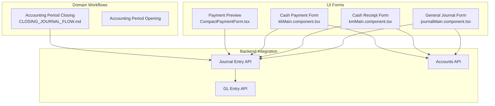
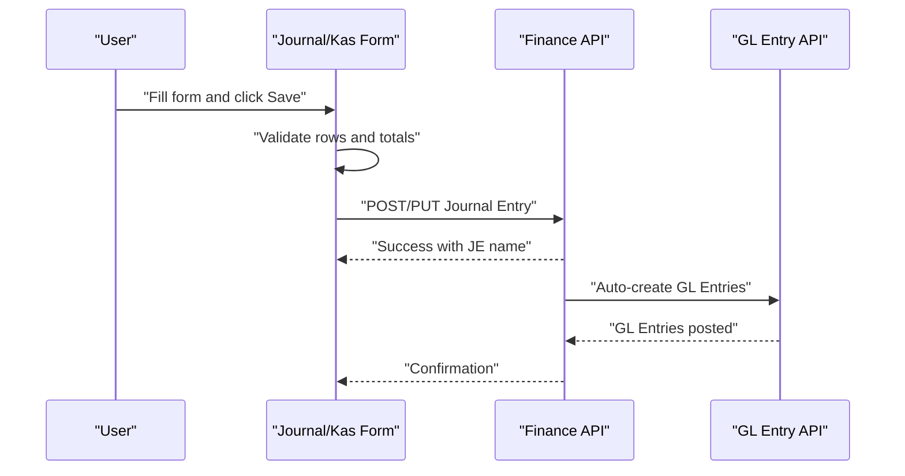
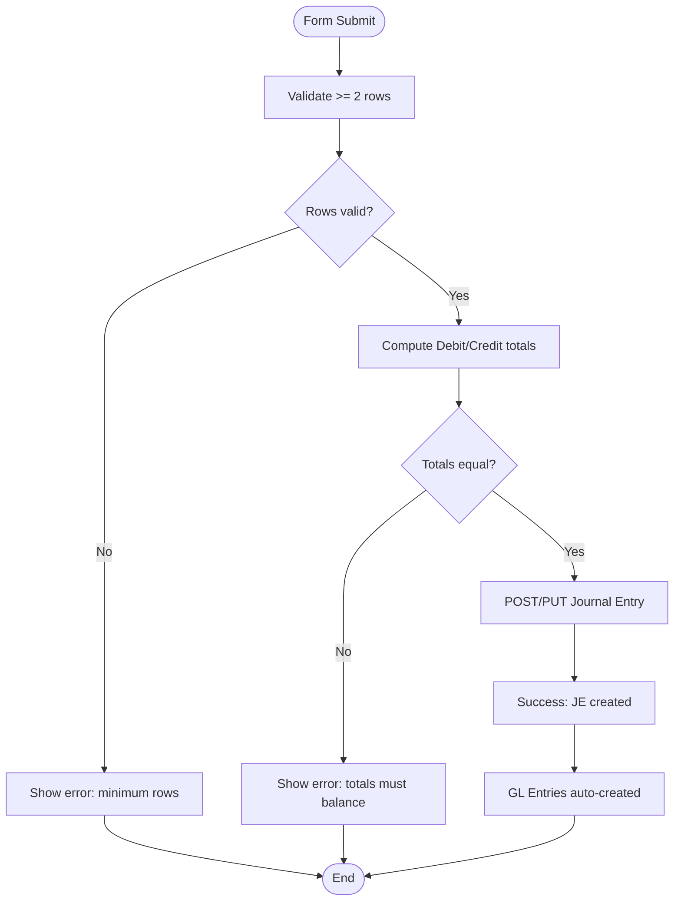
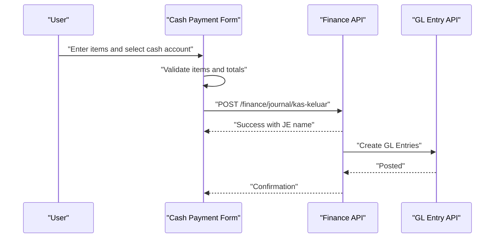
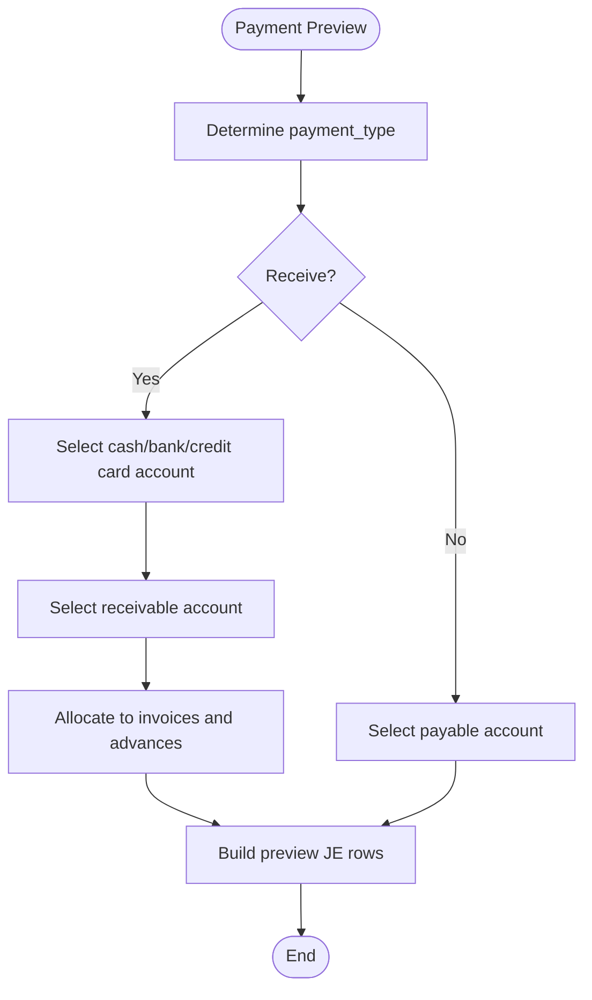
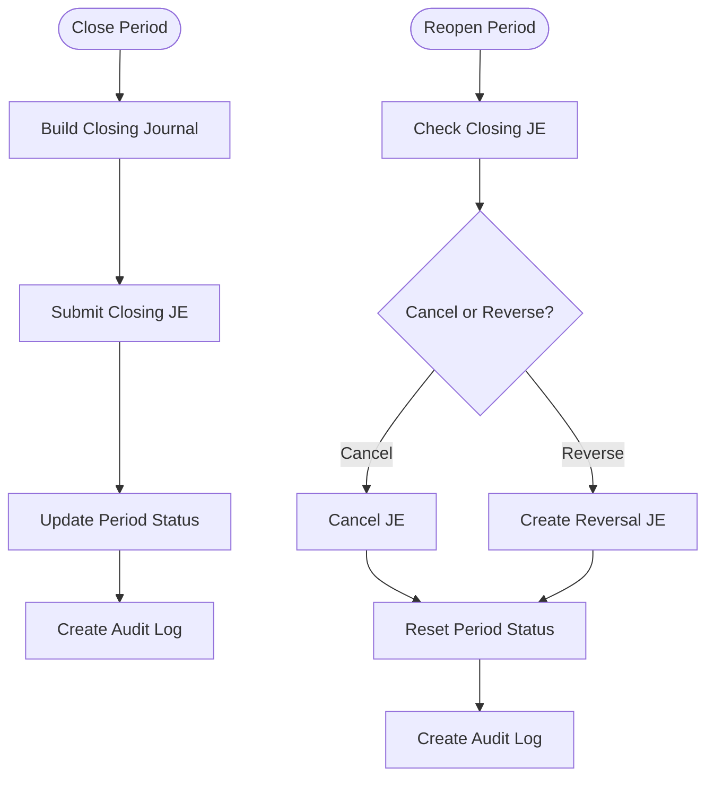
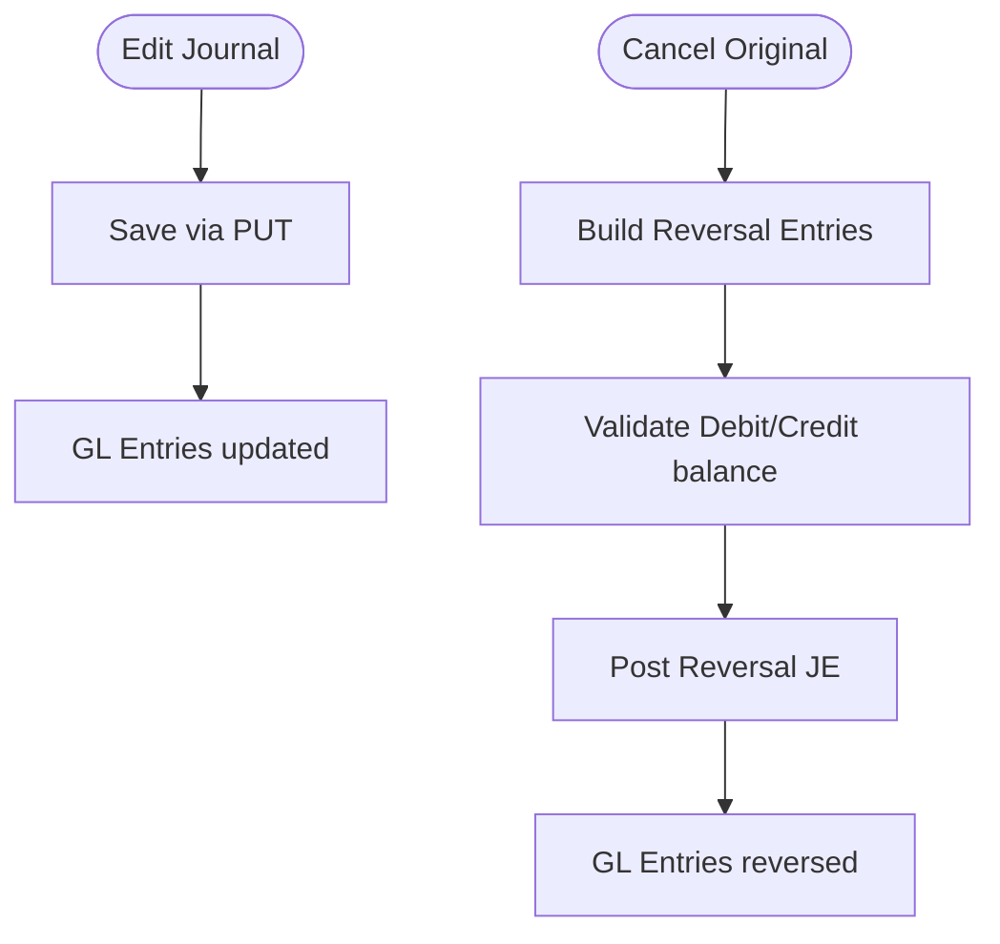
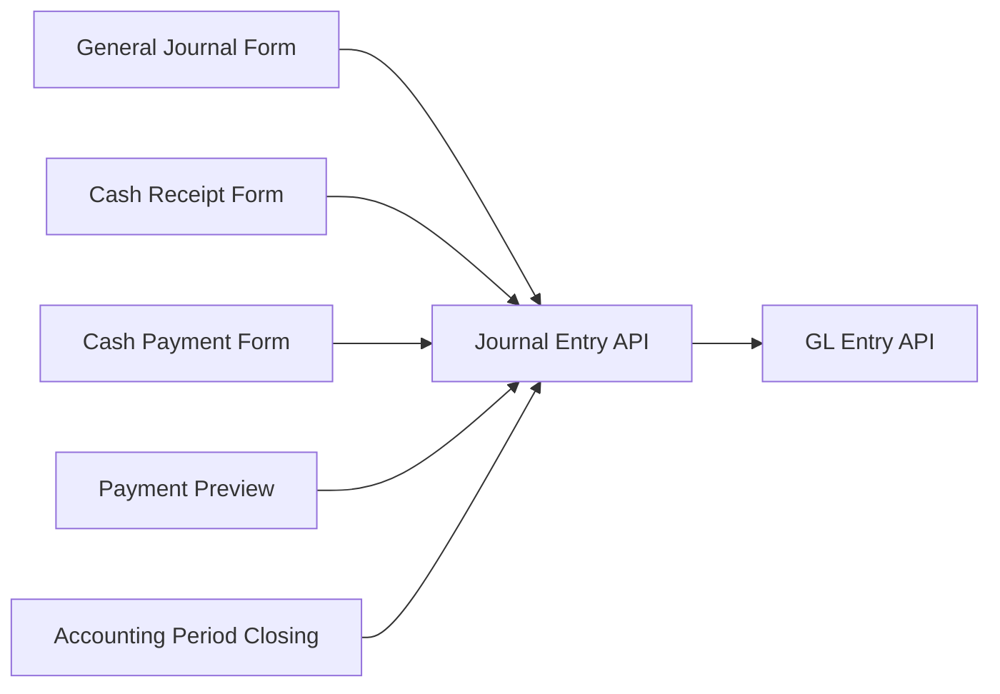

# Journal Entries

<cite>
**Referenced Files in This Document**
- [journalMain.component.tsx](file://app/journal/journalMain/component.tsx)
- [kmMain.component.tsx](file://app/kas-masuk/kmMain/component.tsx)
- [kkMain.component.tsx](file://app/kas-keluar/kkMain/component.tsx)
- [CompactPaymentForm.tsx](file://app/payment/paymentMain/CompactPaymentForm.tsx)
- [CLOSING_JOURNAL_FLOW.md](file://docs/accounting-period/CLOSING_JOURNAL_FLOW.md)
- [accounting-period-validation-unit.test.ts](file://tests/accounting-period-validation-unit.test.ts)
- [accounting-period-closing-journal.pbt.test.ts](file://tests/accounting-period-closing-journal.pbt.test.ts)
- [accounting-period-permanent-closing.pbt.test.ts](file://tests/accounting-period-permanent-closing.pbt.test.ts)
- [accounting-period-reopening.pbt.test.ts](file://tests/accounting-period-reopening.pbt.test.ts)
- [invoice_cancellation.py](file://erpnext_custom/invoice_cancellation.py)
</cite>

## Table of Contents
1. [Introduction](#introduction)
2. [Project Structure](#project-structure)
3. [Core Components](#core-components)
4. [Architecture Overview](#architecture-overview)
5. [Detailed Component Analysis](#detailed-component-analysis)
6. [Dependency Analysis](#dependency-analysis)
7. [Performance Considerations](#performance-considerations)
8. [Troubleshooting Guide](#troubleshooting-guide)
9. [Conclusion](#conclusion)
10. [Appendices](#appendices)

## Introduction
This document explains how Journal Entries are modeled and processed in the system, focusing on:
- General journal entry creation and validation
- Cash receipt journal entries (multi-item cash inflows)
- Cash payment journal entries (multi-item cash outflows)
- Approval workflows, authorization levels, and posting controls
- Modification, cancellation, and reversal procedures
- Categorization, cost center allocation, and project tracking
- Reporting, trial balance integration, and financial statement impact
- Practical scenarios, GL integration, and error handling
- Templates, recurring entries, and batch processing capabilities

## Project Structure
The journal entry feature spans frontend forms, backend APIs, and domain-specific flows:
- General journal entry form and validation
- Cash receipt (kas-masuk) and cash payment (kas-keluar) specialized forms
- Payment module preview logic that generates journal previews for cash receipts
- Accounting period closing and reopening flows that rely on journal entries
- Tests and documentation that define expected behaviors and validation rules

**Diagram sources**
- [journalMain.component.tsx](file://app/journal/journalMain/component.tsx#L1-L564)
- [kmMain.component.tsx](file://app/kas-masuk/kmMain/component.tsx#L1-L476)
- [kkMain.component.tsx](file://app/kas-keluar/kkMain/component.tsx#L1-L472)
- [CompactPaymentForm.tsx](file://app/payment/paymentMain/CompactPaymentForm.tsx#L1-L49)
- [CLOSING_JOURNAL_FLOW.md](file://docs/accounting-period/CLOSING_JOURNAL_FLOW.md#L1-L434)

**Section sources**
- [journalMain.component.tsx](file://app/journal/journalMain/component.tsx#L1-L564)
- [kmMain.component.tsx](file://app/kas-masuk/kmMain/component.tsx#L1-L476)
- [kkMain.component.tsx](file://app/kas-keluar/kkMain/component.tsx#L1-L472)
- [CompactPaymentForm.tsx](file://app/payment/paymentMain/CompactPaymentForm.tsx#L1-L49)
- [CLOSING_JOURNAL_FLOW.md](file://docs/accounting-period/CLOSING_JOURNAL_FLOW.md#L1-L434)

## Core Components
- General Journal Entry Form
  - Captures posting date, voucher type, company, user remarks, and a table of account rows with debit/credit amounts.
  - Validates minimum rows and balance equality before submission.
  - Submits to the Journal Entry API and posts GL entries automatically.

- Cash Receipt (Kas Masuk) Form
  - Multi-item cash inflow form with cash account selection and income category mapping per row.
  - Submits to a dedicated endpoint that builds and posts the journal entry.

- Cash Payment (Kas Keluar) Form
  - Multi-item cash outflow form with cash account selection and expense category mapping per row.
  - Submits to a dedicated endpoint that builds and posts the journal entry.

- Payment Preview
  - Generates a preview of journal entries for cash receipts/payments based on mode of payment and allocations.

**Section sources**
- [journalMain.component.tsx](file://app/journal/journalMain/component.tsx#L17-L56)
- [journalMain.component.tsx](file://app/journal/journalMain/component.tsx#L129-L190)
- [kmMain.component.tsx](file://app/kas-masuk/kmMain/component.tsx#L200-L251)
- [kkMain.component.tsx](file://app/kas-keluar/kkMain/component.tsx#L197-L248)
- [CompactPaymentForm.tsx](file://app/payment/paymentMain/CompactPaymentForm.tsx#L22-L46)

## Architecture Overview
The journal entry lifecycle integrates UI forms, validation, and backend APIs to produce GL entries.

**Diagram sources**
- [journalMain.component.tsx](file://app/journal/journalMain/component.tsx#L129-L190)
- [kmMain.component.tsx](file://app/kas-masuk/kmMain/component.tsx#L221-L251)
- [kkMain.component.tsx](file://app/kas-keluar/kkMain/component.tsx#L218-L248)

## Detailed Component Analysis

### General Journal Entry Creation
- Data model
  - Header: posting_date, voucher_type, user_remark, company, total_debit, total_credit.
  - Rows: account, debit_in_account_currency, credit_in_account_currency, user_remark.
- Validation
  - Minimum two rows required.
  - Debit and credit totals must balance within a small tolerance.
  - Stock accounts are excluded from selection to avoid misuse.
- Submission
  - Sends payload to Journal Entry API; GL entries are created automatically upon successful submission.

**Diagram sources**
- [journalMain.component.tsx](file://app/journal/journalMain/component.tsx#L135-L151)
- [journalMain.component.tsx](file://app/journal/journalMain/component.tsx#L153-L190)

**Section sources**
- [journalMain.component.tsx](file://app/journal/journalMain/component.tsx#L17-L56)
- [journalMain.component.tsx](file://app/journal/journalMain/component.tsx#L129-L190)

### Cash Receipt Journal Entries (Kas Masuk)
- Purpose: Capture multiple cash inflows with income categories.
- Inputs: Posting date, cash account, company, and multiple items with description, amount, and income account.
- Behavior: Builds a journal with a debit to the cash account and credits to income accounts; validates at least one item.

**Diagram sources**
- [kmMain.component.tsx](file://app/kas-masuk/kmMain/component.tsx#L200-L251)

**Section sources**
- [kmMain.component.tsx](file://app/kas-masuk/kmMain/component.tsx#L11-L36)
- [kmMain.component.tsx](file://app/kas-masuk/kmMain/component.tsx#L200-L251)

### Cash Payment Journal Entries (Kas Keluar)
- Purpose: Capture multiple cash outflows with expense categories.
- Inputs: Posting date, cash account, company, and multiple items with description, amount, and expense account.
- Behavior: Builds a journal with debits to expense accounts and a credit to the cash account; validates at least one item.

**Diagram sources**
- [kkMain.component.tsx](file://app/kas-keluar/kkMain/component.tsx#L197-L248)

**Section sources**
- [kkMain.component.tsx](file://app/kas-keluar/kkMain/component.tsx#L11-L36)
- [kkMain.component.tsx](file://app/kas-keluar/kkMain/component.tsx#L197-L248)

### Payment Preview and Journal Mapping (Cash Receipts)
- The payment module computes a preview for cash receipts based on mode of payment and allocations.
- It determines the appropriate debit account (cash/bank/credit card) and the receivable credit account, and optionally allocates to customer invoices and advances.

**Diagram sources**
- [CompactPaymentForm.tsx](file://app/payment/paymentMain/CompactPaymentForm.tsx#L22-L46)

**Section sources**
- [CompactPaymentForm.tsx](file://app/payment/paymentMain/CompactPaymentForm.tsx#L22-L46)

### Accounting Period Closing and Reversal
- Closing journal entries are generated during period closing and marked appropriately.
- Reopening requires cancellation or reversal of the closing journal, updating period status and audit logs.

**Diagram sources**
- [CLOSING_JOURNAL_FLOW.md](file://docs/accounting-period/CLOSING_JOURNAL_FLOW.md#L1-L434)

**Section sources**
- [CLOSING_JOURNAL_FLOW.md](file://docs/accounting-period/CLOSING_JOURNAL_FLOW.md#L1-L434)

### Journal Entry Modification, Cancellation, and Reversal
- Modification: General journals support edit and re-submit via PUT to the Journal Entry API.
- Cancellation: Invoices demonstrate reversal logic—swap debit/credit and mark as cancelled while ensuring totals remain balanced.
- Reversal: System-generated reversal journals are used during period reopening to restore nominal account balances.

**Diagram sources**
- [journalMain.component.tsx](file://app/journal/journalMain/component.tsx#L153-L190)
- [invoice_cancellation.py](file://erpnext_custom/invoice_cancellation.py#L73-L105)

**Section sources**
- [journalMain.component.tsx](file://app/journal/journalMain/component.tsx#L153-L190)
- [invoice_cancellation.py](file://erpnext_custom/invoice_cancellation.py#L73-L105)

### Journal Entry Approval Workflows and Authorization
- Approval workflows are not explicitly implemented in the referenced files. Typical ERP patterns include:
  - Multi-level approvals based on thresholds
  - Role-based authorization
  - Posting restrictions by period status
- The system enforces period validation and unposted transaction checks during accounting period operations.

**Section sources**
- [accounting-period-validation-unit.test.ts](file://tests/accounting-period-validation-unit.test.ts#L174-L211)

### Journal Entry Categories, Cost Centers, and Projects
- Category mapping is visible in cash receipt/payment forms where income/expense accounts are selected per item.
- Cost center and project tracking are not explicitly implemented in the referenced files; they would typically be extended via additional fields and validations.

**Section sources**
- [kmMain.component.tsx](file://app/kas-masuk/kmMain/component.tsx#L384-L413)
- [kkMain.component.tsx](file://app/kas-keluar/kkMain/component.tsx#L382-L410)

### Reporting, Trial Balance Integration, and Financial Statements
- Closing journal impacts GL entries, trial balance, and financial statements as documented in the accounting period flow.
- Reports reflect updated balances and retained earnings after closing.

**Section sources**
- [CLOSING_JOURNAL_FLOW.md](file://docs/accounting-period/CLOSING_JOURNAL_FLOW.md#L160-L190)

### Practical Scenarios and Batch Processing
- Multi-item cash receipts/payments enable batch-like processing by grouping multiple lines into a single journal entry.
- Templates and recurring entries are not explicitly implemented in the referenced files; they would typically be introduced via predefined forms and scheduling mechanisms.

**Section sources**
- [kmMain.component.tsx](file://app/kas-masuk/kmMain/component.tsx#L171-L185)
- [kkMain.component.tsx](file://app/kas-keluar/kkMain/component.tsx#L168-L179)

## Dependency Analysis
- UI forms depend on Finance APIs for accounts, journal entry creation, and GL posting.
- Cash receipt/payment forms depend on account filters for cash/bank and income/expense categories.
- Accounting period flows depend on journal entries for closing and reopening.

**Diagram sources**
- [journalMain.component.tsx](file://app/journal/journalMain/component.tsx#L129-L190)
- [kmMain.component.tsx](file://app/kas-masuk/kmMain/component.tsx#L221-L251)
- [kkMain.component.tsx](file://app/kas-keluar/kkMain/component.tsx#L218-L248)
- [CLOSING_JOURNAL_FLOW.md](file://docs/accounting-period/CLOSING_JOURNAL_FLOW.md#L1-L434)

**Section sources**
- [journalMain.component.tsx](file://app/journal/journalMain/component.tsx#L63-L86)
- [kmMain.component.tsx](file://app/kas-masuk/kmMain/component.tsx#L62-L76)
- [kkMain.component.tsx](file://app/kas-keluar/kkMain/component.tsx#L62-L76)

## Performance Considerations
- Client-side validation reduces unnecessary server requests.
- Multi-item forms compute totals locally to provide immediate feedback.
- Batch-like processing via multi-line cash receipts/payments minimizes overhead.

## Troubleshooting Guide
- Balance errors: Ensure total debit equals total credit; the form highlights imbalance.
- Missing rows: Provide at least two rows with valid amounts.
- Stock account selection: Exclude stock accounts from general journal entries.
- Period validation failures: Confirm no unsubmitted transactions and correct period status before closing.
- Cancellation/reversal: Ensure reversal entries maintain balanced totals and are posted correctly.

**Section sources**
- [journalMain.component.tsx](file://app/journal/journalMain/component.tsx#L135-L151)
- [accounting-period-validation-unit.test.ts](file://tests/accounting-period-validation-unit.test.ts#L174-L211)
- [invoice_cancellation.py](file://erpnext_custom/invoice_cancellation.py#L90-L105)

## Conclusion
The system provides robust UI forms for general, cash receipt, and cash payment journal entries, with strong validation and automatic GL posting. Accounting period flows demonstrate the impact of journal entries on closing and reopening. While approval workflows, templates, recurring entries, and advanced categorization are not present in the referenced files, the architecture supports extending these capabilities.

## Appendices
- Journal Entry API usage patterns are demonstrated by the forms’ fetch calls and payload construction.
- Closing and reopening flows illustrate the end-to-end impact on GL entries and financial reporting.