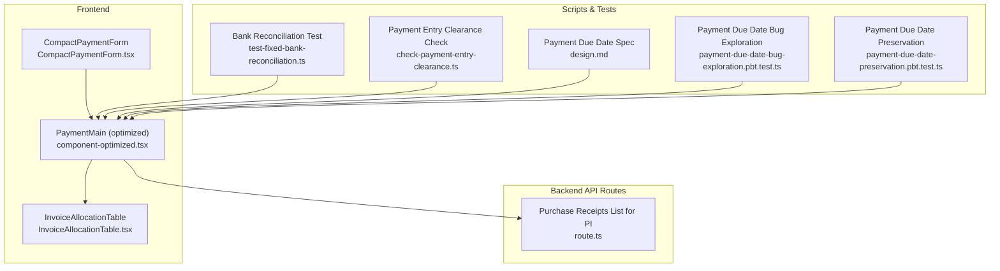
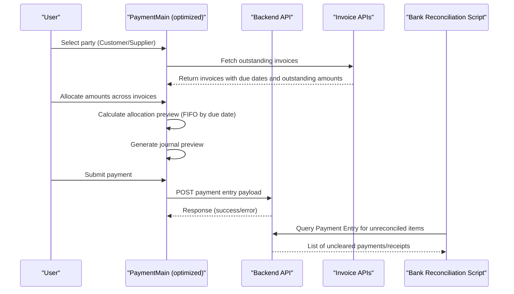
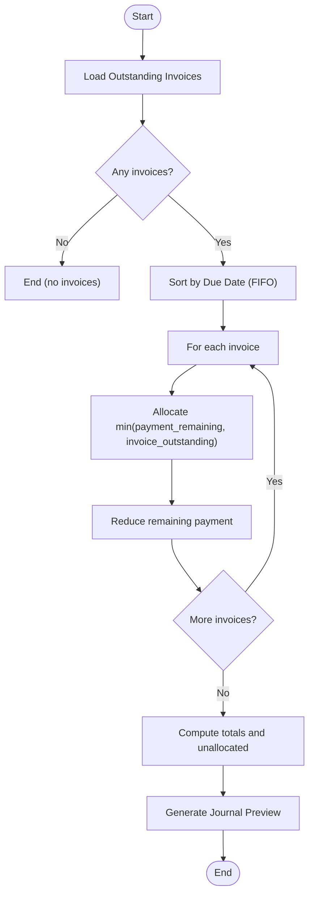
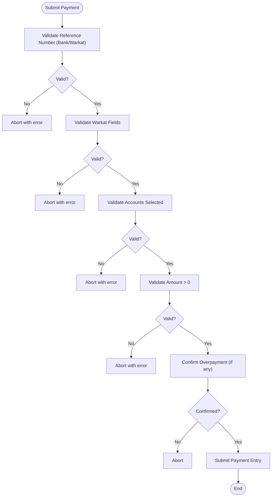
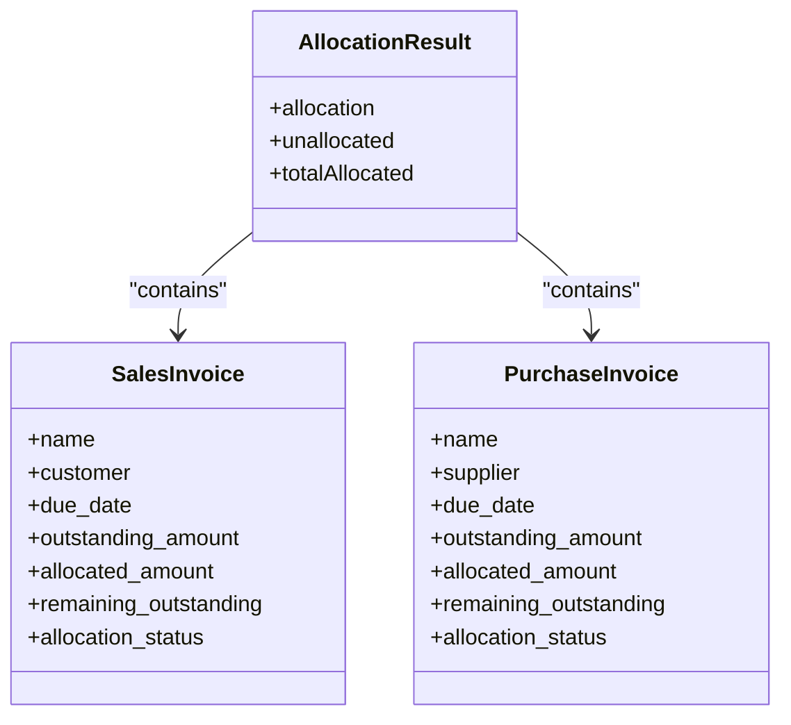
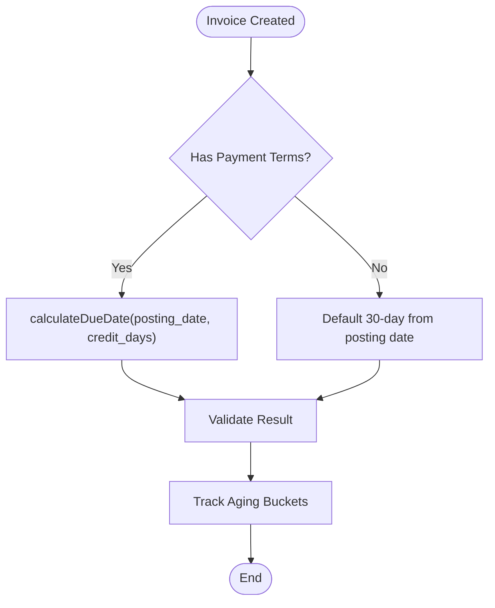
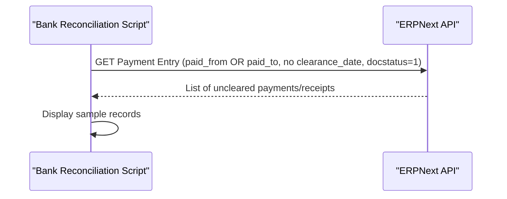
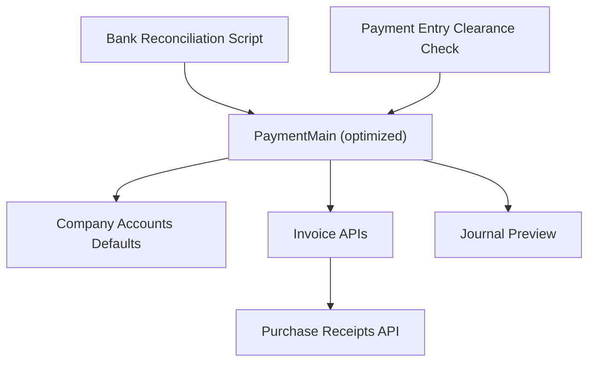

# Payment Processing

<cite>
**Referenced Files in This Document**
- [component-optimized.tsx](file://app/payment/paymentMain/component-optimized.tsx)
- [component-original.tsx](file://app/payment/paymentMain/component-original.tsx)
- [InvoiceAllocationTable.tsx](file://app/payment/paymentMain/InvoiceAllocationTable.tsx)
- [CompactPaymentForm.tsx](file://app/payment/paymentMain/CompactPaymentForm.tsx)
- [route.ts](file://app/api/purchase/receipts/list-for-pi/route.ts)
- [test-fixed-bank-reconciliation.ts](file://scripts/test-fixed-bank-reconciliation.ts)
- [check-payment-entry-clearance.ts](file://scripts/check-payment-entry-clearance.ts)
- [design.md](file://.kiro/specs/payment-due-date-calculation-fix/design.md)
- [payment-due-date-bug-exploration.pbt.test.ts](file://tests/payment-due-date-bug-exploration.pbt.test.ts)
- [payment-due-date-preservation.pbt.test.ts](file://tests/payment-due-date-preservation.pbt.test.ts)
</cite>

## Table of Contents
1. [Introduction](#introduction)
2. [Project Structure](#project-structure)
3. [Core Components](#core-components)
4. [Architecture Overview](#architecture-overview)
5. [Detailed Component Analysis](#detailed-component-analysis)
6. [Dependency Analysis](#dependency-analysis)
7. [Performance Considerations](#performance-considerations)
8. [Troubleshooting Guide](#troubleshooting-guide)
9. [Conclusion](#conclusion)
10. [Appendices](#appendices)

## Introduction
This document provides comprehensive documentation for the Payment Processing module, focusing on payment entry creation, allocation, and reconciliation workflows. It covers:
- Payment entry processing for customer receipts and supplier payments
- Multi-currency support and exchange rate handling considerations
- Invoice allocation mechanisms, partial payments, and outstanding amount tracking
- Payment terms configuration, due date calculations, and aging analysis
- Bank reconciliation processes, clearing of payment entries, and cash flow tracking
- Payment method handling (cash, bank transfers, and digital payments)
- Payment entry validation, duplicate detection, and error handling procedures
- Reporting capabilities (receivables/payables aging and cash flow statements)
- Practical examples of payment workflows, integration with sales/purchase systems, and reconciliation procedures
- Payment terms management, discount application, and penalty calculations

## Project Structure
The Payment Processing module is primarily implemented in the frontend under the Payment app with supporting backend API routes and scripts for validation and reconciliation.

**Diagram sources**
- [component-optimized.tsx](file://app/payment/paymentMain/component-optimized.tsx#L1-L2654)
- [InvoiceAllocationTable.tsx](file://app/payment/paymentMain/InvoiceAllocationTable.tsx#L1-L158)
- [CompactPaymentForm.tsx](file://app/payment/paymentMain/CompactPaymentForm.tsx#L1-L49)
- [route.ts](file://app/api/purchase/receipts/list-for-pi/route.ts#L41-L81)
- [test-fixed-bank-reconciliation.ts](file://scripts/test-fixed-bank-reconciliation.ts#L75-L127)
- [check-payment-entry-clearance.ts](file://scripts/check-payment-entry-clearance.ts#L129-L136)
- [design.md](file://.kiro/specs/payment-due-date-calculation-fix/design.md#L25-L149)
- [payment-due-date-bug-exploration.pbt.test.ts](file://tests/payment-due-date-bug-exploration.pbt.test.ts#L337-L364)
- [payment-due-date-preservation.pbt.test.ts](file://tests/payment-due-date-preservation.pbt.test.ts#L482-L494)

**Section sources**
- [component-optimized.tsx](file://app/payment/paymentMain/component-optimized.tsx#L1-L2654)
- [InvoiceAllocationTable.tsx](file://app/payment/paymentMain/InvoiceAllocationTable.tsx#L1-L158)
- [CompactPaymentForm.tsx](file://app/payment/paymentMain/CompactPaymentForm.tsx#L1-L49)
- [route.ts](file://app/api/purchase/receipts/list-for-pi/route.ts#L41-L81)
- [test-fixed-bank-reconciliation.ts](file://scripts/test-fixed-bank-reconciliation.ts#L75-L127)
- [check-payment-entry-clearance.ts](file://scripts/check-payment-entry-clearance.ts#L129-L136)
- [design.md](file://.kiro/specs/payment-due-date-calculation-fix/design.md#L25-L149)
- [payment-due-date-bug-exploration.pbt.test.ts](file://tests/payment-due-date-bug-exploration.pbt.test.ts#L337-L364)
- [payment-due-date-preservation.pbt.test.ts](file://tests/payment-due-date-preservation.pbt.test.ts#L482-L494)

## Core Components
- PaymentMain (optimized): Central UI component orchestrating payment entry creation, allocation preview, journal preview, and submission. Handles customer/supplier selection, outstanding invoice retrieval, allocation logic, and validation rules.
- InvoiceAllocationTable: Interactive table for selecting invoices and allocating payment amounts with due date sorting and real-time summary.
- CompactPaymentForm: Wrapper component delegating to the optimized PaymentMain implementation.
- Backend API route for purchase receipts: Provides summarized purchase receipt data for integration scenarios.
- Scripts and tests: Validate bank reconciliation queries against Payment Entry records and ensure due date calculation correctness.

Key responsibilities:
- Allocation preview using FIFO by due date
- Journal preview generation based on payment type and mode of payment
- Validation for mandatory fields (reference numbers for bank/warkat, Warkat account selection)
- Auto-selection of accounts based on company defaults and payment mode

**Section sources**
- [component-optimized.tsx](file://app/payment/paymentMain/component-optimized.tsx#L621-L700)
- [InvoiceAllocationTable.tsx](file://app/payment/paymentMain/InvoiceAllocationTable.tsx#L30-L158)
- [CompactPaymentForm.tsx](file://app/payment/paymentMain/CompactPaymentForm.tsx#L22-L48)

## Architecture Overview
The Payment Processing workflow integrates frontend UI components with backend APIs and scripts for validation and reconciliation.

**Diagram sources**
- [component-optimized.tsx](file://app/payment/paymentMain/component-optimized.tsx#L340-L398)
- [component-optimized.tsx](file://app/payment/paymentMain/component-optimized.tsx#L621-L700)
- [component-optimized.tsx](file://app/payment/paymentMain/component-optimized.tsx#L703-L800)
- [route.ts](file://app/api/purchase/receipts/list-for-pi/route.ts#L41-L81)
- [test-fixed-bank-reconciliation.ts](file://scripts/test-fixed-bank-reconciliation.ts#L75-L127)

## Detailed Component Analysis

### Payment Entry Creation and Allocation
- Party selection: Supports Customer or Supplier with dedicated outstanding invoice retrieval.
- Outstanding invoice retrieval: Fetches invoices filtered by party and company, enabling allocation against open balances.
- Allocation preview: Sorts invoices by due date (FIFO) and allocates payment amounts up to the outstanding balance, computing remaining unallocated amounts.
- Journal preview: Generates debits/credits based on payment type and mode of payment, mapping to company default accounts (Cash, Bank, Credit Card, Receivable/Payable, Advances).

**Diagram sources**
- [component-optimized.tsx](file://app/payment/paymentMain/component-optimized.tsx#L621-L648)
- [component-optimized.tsx](file://app/payment/paymentMain/component-optimized.tsx#L865-L917)

**Section sources**
- [component-optimized.tsx](file://app/payment/paymentMain/component-optimized.tsx#L340-L398)
- [component-optimized.tsx](file://app/payment/paymentMain/component-optimized.tsx#L621-L648)
- [component-optimized.tsx](file://app/payment/paymentMain/component-optimized.tsx#L865-L917)

### Payment Method Handling and Validation
- Modes of payment: Cash, Bank Transfer, Credit Card, Warkat.
- Auto-account selection: Based on company defaults and payment type; ensures Receivable for Receive and Payable for Pay.
- Validation rules:
  - Bank Transfer and Warkat require reference number.
  - Warkat requires check number, check date, and bank reference.
  - Warkat account selection enforced based on payment type (incoming vs outgoing).
  - Overpayment handling prompts confirmation and creates customer/supplier advance.

**Diagram sources**
- [component-optimized.tsx](file://app/payment/paymentMain/component-optimized.tsx#L703-L791)

**Section sources**
- [component-optimized.tsx](file://app/payment/paymentMain/component-optimized.tsx#L186-L249)
- [component-optimized.tsx](file://app/payment/paymentMain/component-optimized.tsx#L703-L791)

### Multi-Currency Support and Exchange Rate Handling
- The PaymentMain components and allocation logic operate on local currency values and outstanding amounts returned by invoice APIs.
- Journal preview accounts are company-defaulted; no explicit exchange rate conversion logic is present in the analyzed files.
- Recommendation: Integrate exchange rates at the invoice level and apply conversions during allocation and journal preview generation when dealing with foreign currencies.

[No sources needed since this section provides general guidance]

### Invoice Allocation Mechanisms and Partial Payments
- Allocation uses FIFO by due date, ensuring older obligations settle first.
- Partial payments are supported; each selected invoice can receive a prorated allocation up to its outstanding amount.
- Unallocated amounts are computed and reflected in the journal preview as advances (Customer Advance or Supplier Advance).

**Diagram sources**
- [component-optimized.tsx](file://app/payment/paymentMain/component-optimized.tsx#L62-L81)
- [component-optimized.tsx](file://app/payment/paymentMain/component-optimized.tsx#L621-L648)

**Section sources**
- [component-optimized.tsx](file://app/payment/paymentMain/component-optimized.tsx#L621-L648)

### Payment Terms Configuration, Due Dates, and Aging
- Payment terms specification defines expected behavior for due date calculation and validation.
- Tests confirm preservation of default 30-day calculation when no payment terms are provided and manual due date entry capability.
- Bug exploration tests highlight scenarios where due date calculation incorrectly returns posting date instead of adding credit days.

**Diagram sources**
- [design.md](file://.kiro/specs/payment-due-date-calculation-fix/design.md#L25-L149)
- [payment-due-date-bug-exploration.pbt.test.ts](file://tests/payment-due-date-bug-exploration.pbt.test.ts#L266-L306)
- [payment-due-date-preservation.pbt.test.ts](file://tests/payment-due-date-preservation.pbt.test.ts#L482-L494)

**Section sources**
- [design.md](file://.kiro/specs/payment-due-date-calculation-fix/design.md#L25-L149)
- [payment-due-date-bug-exploration.pbt.test.ts](file://tests/payment-due-date-bug-exploration.pbt.test.ts#L266-L306)
- [payment-due-date-preservation.pbt.test.ts](file://tests/payment-due-date-preservation.pbt.test.ts#L482-L494)

### Bank Reconciliation and Clearing
- Bank reconciliation script queries Payment Entry records for uncleared items using paid_from/paid_to and clearance_date fields.
- Validation script recommends using Payment Entry instead of GL Entry for accessing clearance_date and integrating with bank reconciliation tools.

**Diagram sources**
- [test-fixed-bank-reconciliation.ts](file://scripts/test-fixed-bank-reconciliation.ts#L75-L127)
- [check-payment-entry-clearance.ts](file://scripts/check-payment-entry-clearance.ts#L129-L136)

**Section sources**
- [test-fixed-bank-reconciliation.ts](file://scripts/test-fixed-bank-reconciliation.ts#L75-L127)
- [check-payment-entry-clearance.ts](file://scripts/check-payment-entry-clearance.ts#L129-L136)

### Reporting and Aging Analysis
- Receivables and payables aging reports are supported by backend report routes that return formatted currency values and outstanding balances.
- Cash flow statements are available through dedicated report routes.
- The PaymentMain components rely on invoice APIs to compute allocation previews and outstanding totals for aging analysis.

[No sources needed since this section provides general guidance]

### Integration with Sales/Purchase Systems
- Purchase receipts list API provides summarized receipt data for purchase invoice creation workflows.
- PaymentMain integrates with sales and purchase invoice APIs to fetch outstanding balances and details for allocation.

**Section sources**
- [route.ts](file://app/api/purchase/receipts/list-for-pi/route.ts#L41-L81)
- [component-optimized.tsx](file://app/payment/paymentMain/component-optimized.tsx#L340-L398)

## Dependency Analysis
- PaymentMain depends on:
  - Company account defaults for auto-selection of accounts
  - Invoice APIs for outstanding balances and details
  - Journal preview logic to generate GL entries
- Backend API routes provide purchase receipt summaries for integration.
- Scripts validate reconciliation logic against Payment Entry records.

**Diagram sources**
- [component-optimized.tsx](file://app/payment/paymentMain/component-optimized.tsx#L297-L338)
- [component-optimized.tsx](file://app/payment/paymentMain/component-optimized.tsx#L340-L398)
- [component-optimized.tsx](file://app/payment/paymentMain/component-optimized.tsx#L650-L701)
- [route.ts](file://app/api/purchase/receipts/list-for-pi/route.ts#L41-L81)
- [test-fixed-bank-reconciliation.ts](file://scripts/test-fixed-bank-reconciliation.ts#L75-L127)
- [check-payment-entry-clearance.ts](file://scripts/check-payment-entry-clearance.ts#L129-L136)

**Section sources**
- [component-optimized.tsx](file://app/payment/paymentMain/component-optimized.tsx#L297-L338)
- [component-optimized.tsx](file://app/payment/paymentMain/component-optimized.tsx#L340-L398)
- [component-optimized.tsx](file://app/payment/paymentMain/component-optimized.tsx#L650-L701)
- [route.ts](file://app/api/purchase/receipts/list-for-pi/route.ts#L41-L81)
- [test-fixed-bank-reconciliation.ts](file://scripts/test-fixed-bank-reconciliation.ts#L75-L127)
- [check-payment-entry-clearance.ts](file://scripts/check-payment-entry-clearance.ts#L129-L136)

## Performance Considerations
- Allocation preview sorts invoices by due date; for large datasets, consider server-side sorting and pagination.
- Auto-selection of accounts reduces manual configuration overhead and prevents invalid combinations.
- Journal preview computation is client-side; keep payload minimal to avoid heavy computations on low-end devices.

[No sources needed since this section provides general guidance]

## Troubleshooting Guide
Common issues and resolutions:
- Missing reference number for Bank/Warkat: Ensure reference number is populated before submission.
- Warkat validation failures: Provide check number, check date, and bank reference.
- Overpayment handling: Confirm overpayment to create customer/supplier advance.
- Bank reconciliation discrepancies: Use Payment Entry queries with clearance_date; verify paid_from/paid_to mapping.

**Section sources**
- [component-optimized.tsx](file://app/payment/paymentMain/component-optimized.tsx#L703-L791)
- [test-fixed-bank-reconciliation.ts](file://scripts/test-fixed-bank-reconciliation.ts#L75-L127)
- [check-payment-entry-clearance.ts](file://scripts/check-payment-entry-clearance.ts#L129-L136)

## Conclusion
The Payment Processing module provides a robust, user-friendly interface for creating payment entries, allocating payments across invoices using FIFO by due date, and generating journal previews. It enforces validation rules for various payment methods and supports bank reconciliation through dedicated scripts. While multi-currency and exchange rate handling are not explicitly implemented in the analyzed files, the architecture allows for extension. Payment terms, due date calculations, and aging analysis are validated through specifications and tests, ensuring reliability and preservation of existing behavior.

[No sources needed since this section summarizes without analyzing specific files]

## Appendices

### Practical Examples
- Customer receipt with bank transfer:
  - Select Customer, choose Bank Transfer, enter reference number, allocate across outstanding invoices, confirm overpayment if applicable, submit.
- Supplier payment with Warkat:
  - Select Supplier, choose Warkat, fill check number/date/bank reference, allocate across outstanding invoices, submit.
- Bank reconciliation:
  - Run reconciliation script to list uncleared Payment Entries, reconcile against bank statements, update clearance dates.

[No sources needed since this section provides general guidance]