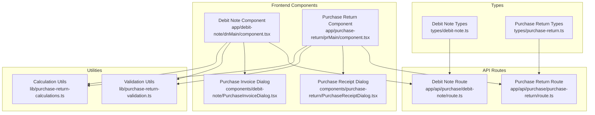
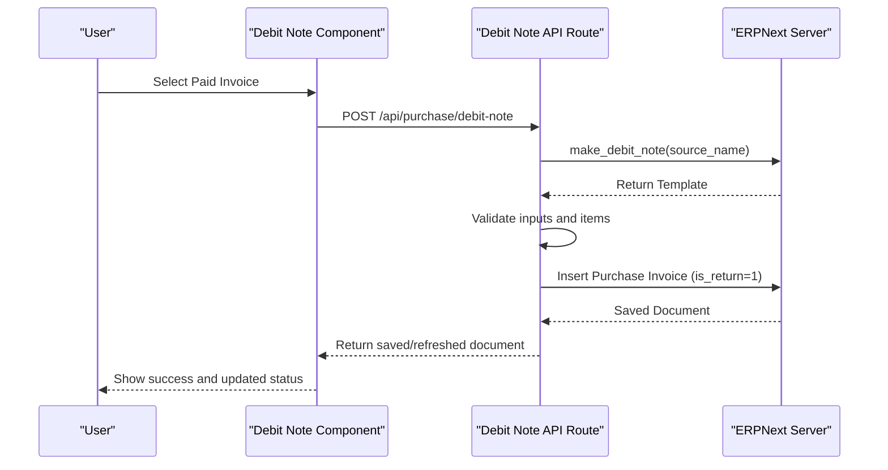
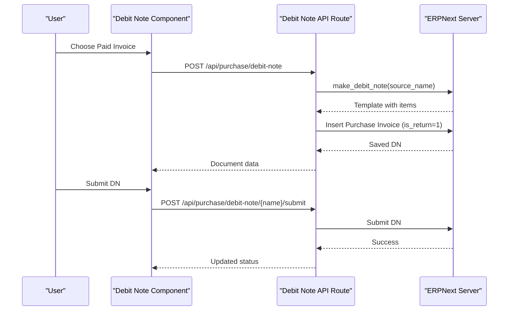
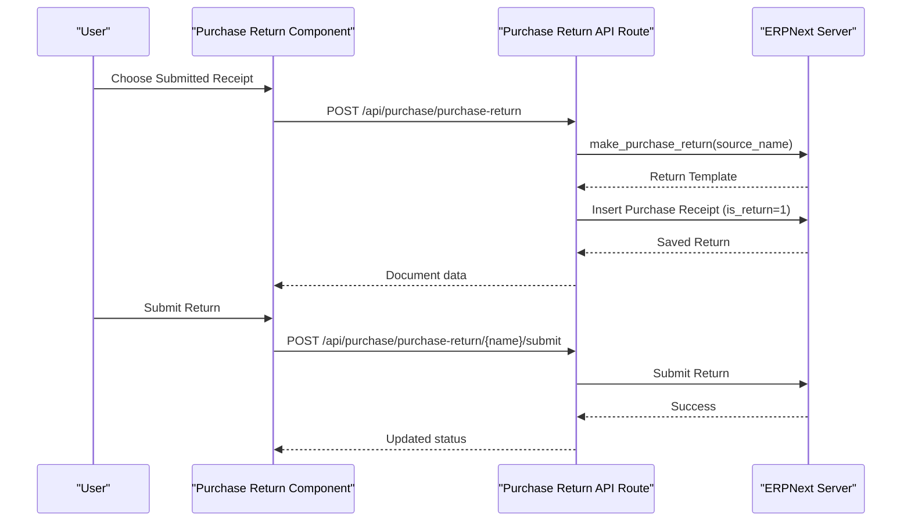
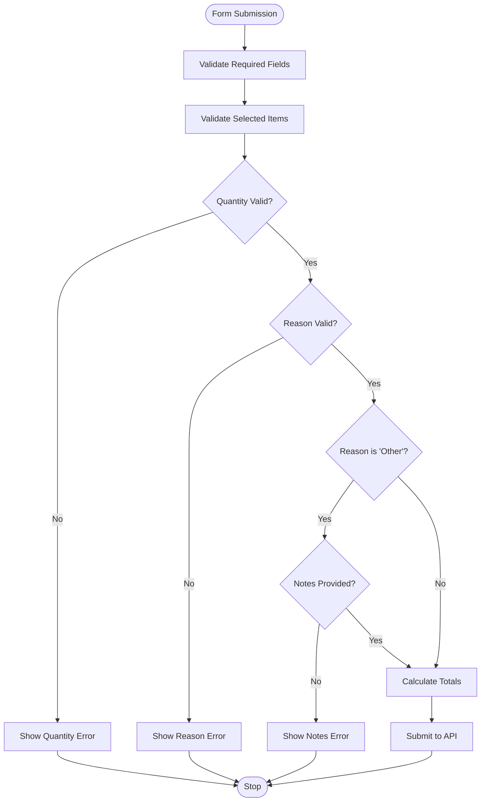
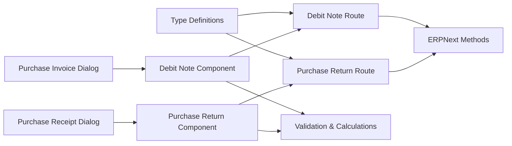

# Debit Notes and Returns

<cite>
**Referenced Files in This Document**
- [types/debit-note.ts](file://types/debit-note.ts)
- [types/purchase-return.ts](file://types/purchase-return.ts)
- [app/api/purchase/debit-note/route.ts](file://app/api/purchase/debit-note/route.ts)
- [app/api/purchase/purchase-return/route.ts](file://app/api/purchase/purchase-return/route.ts)
- [app/debit-note/dnMain/component.tsx](file://app/debit-note/dnMain/component.tsx)
- [app/purchase-return/prMain/component.tsx](file://app/purchase-return/prMain/component.tsx)
- [lib/purchase-return-validation.ts](file://lib/purchase-return-validation.ts)
- [lib/purchase-return-calculations.ts](file://lib/purchase-return-calculations.ts)
- [components/debit-note/PurchaseInvoiceDialog.tsx](file://components/debit-note/PurchaseInvoiceDialog.tsx)
- [components/purchase-return/PurchaseReceiptDialog.tsx](file://components/purchase-return/PurchaseReceiptDialog.tsx)
</cite>

## Table of Contents
1. [Introduction](#introduction)
2. [Project Structure](#project-structure)
3. [Core Components](#core-components)
4. [Architecture Overview](#architecture-overview)
5. [Detailed Component Analysis](#detailed-component-analysis)
6. [Dependency Analysis](#dependency-analysis)
7. [Performance Considerations](#performance-considerations)
8. [Troubleshooting Guide](#troubleshooting-guide)
9. [Conclusion](#conclusion)
10. [Appendices](#appendices)

## Introduction
This document explains the Debit Notes and Returns management system for vendor account adjustments and return processing. It covers:
- Debit Note creation for purchase returns against paid invoices, including reason codes, item identification, and quantity validation
- Submission and vendor account posting workflows
- Return item management with serial numbers, batch tracking, and condition assessment
- Debit Note cancellation and reversal procedures with proper authorization
- Return validation rules including eligible items, return periods, and pricing calculations
- Return tracking with status updates, warehouse processing, and supplier notification
- Examples of return workflows, inventory impact on supplier accounts, and integration with payment systems
- Reporting, analytics, and compliance requirements for vendor relations

## Project Structure
The system is organized around typed interfaces, API routes, and React components:
- Types define the data contracts for Debit Notes and Purchase Returns
- API routes implement server-side validation and integration with ERPNext
- Frontend components manage user interactions, validation, and submission flows
- Utility libraries provide shared validation and calculation logic

**Diagram sources**
- [types/debit-note.ts](file://types/debit-note.ts#L1-L272)
- [types/purchase-return.ts](file://types/purchase-return.ts#L1-L276)
- [app/api/purchase/debit-note/route.ts](file://app/api/purchase/debit-note/route.ts#L1-L295)
- [app/api/purchase/purchase-return/route.ts](file://app/api/purchase/purchase-return/route.ts#L1-L297)
- [app/debit-note/dnMain/component.tsx](file://app/debit-note/dnMain/component.tsx#L1-L951)
- [app/purchase-return/prMain/component.tsx](file://app/purchase-return/prMain/component.tsx#L1-L964)
- [components/debit-note/PurchaseInvoiceDialog.tsx](file://components/debit-note/PurchaseInvoiceDialog.tsx#L1-L352)
- [components/purchase-return/PurchaseReceiptDialog.tsx](file://components/purchase-return/PurchaseReceiptDialog.tsx#L1-L360)
- [lib/purchase-return-validation.ts](file://lib/purchase-return-validation.ts#L1-L223)
- [lib/purchase-return-calculations.ts](file://lib/purchase-return-calculations.ts#L1-L80)

**Section sources**
- [types/debit-note.ts](file://types/debit-note.ts#L1-L272)
- [types/purchase-return.ts](file://types/purchase-return.ts#L1-L276)
- [app/api/purchase/debit-note/route.ts](file://app/api/purchase/debit-note/route.ts#L1-L295)
- [app/api/purchase/purchase-return/route.ts](file://app/api/purchase/purchase-return/route.ts#L1-L297)
- [app/debit-note/dnMain/component.tsx](file://app/debit-note/dnMain/component.tsx#L1-L951)
- [app/purchase-return/prMain/component.tsx](file://app/purchase-return/prMain/component.tsx#L1-L964)
- [components/debit-note/PurchaseInvoiceDialog.tsx](file://components/debit-note/PurchaseInvoiceDialog.tsx#L1-L352)
- [components/purchase-return/PurchaseReceiptDialog.tsx](file://components/purchase-return/PurchaseReceiptDialog.tsx#L1-L360)
- [lib/purchase-return-validation.ts](file://lib/purchase-return-validation.ts#L1-L223)
- [lib/purchase-return-calculations.ts](file://lib/purchase-return-calculations.ts#L1-L80)

## Core Components
- Debit Note Types: Define return reasons, item structure, document metadata, and API contracts for paid invoice returns
- Purchase Return Types: Define return reasons, item structure, document metadata, and API contracts for unpaid receipt returns
- Debit Note API Route: Validates inputs, checks invoice status, generates return templates, and persists documents
- Purchase Return API Route: Validates inputs, checks receipt status, generates return templates, and persists documents
- Debit Note Component: Manages form state, validation, item selection, totals, and submission/cancellation actions
- Purchase Return Component: Manages form state, validation, item selection, totals, and submission/cancellation actions
- Validation Utilities: Enforce quantity limits, reason selection, and date formatting
- Calculation Utilities: Compute line totals, remaining quantities, and formatted amounts
- Dialog Components: Allow selection of eligible source documents (paid invoices or submitted receipts)

**Section sources**
- [types/debit-note.ts](file://types/debit-note.ts#L1-L272)
- [types/purchase-return.ts](file://types/purchase-return.ts#L1-L276)
- [app/api/purchase/debit-note/route.ts](file://app/api/purchase/debit-note/route.ts#L1-L295)
- [app/api/purchase/purchase-return/route.ts](file://app/api/purchase/purchase-return/route.ts#L1-L297)
- [app/debit-note/dnMain/component.tsx](file://app/debit-note/dnMain/component.tsx#L1-L951)
- [app/purchase-return/prMain/component.tsx](file://app/purchase-return/prMain/component.tsx#L1-L964)
- [lib/purchase-return-validation.ts](file://lib/purchase-return-validation.ts#L1-L223)
- [lib/purchase-return-calculations.ts](file://lib/purchase-return-calculations.ts#L1-L80)
- [components/debit-note/PurchaseInvoiceDialog.tsx](file://components/debit-note/PurchaseInvoiceDialog.tsx#L1-L352)
- [components/purchase-return/PurchaseReceiptDialog.tsx](file://components/purchase-return/PurchaseReceiptDialog.tsx#L1-L360)

## Architecture Overview
The system integrates frontend components with server-side API routes that call ERPNext methods to generate return templates and persist documents. Validation and calculations are performed on both client and server sides.

**Diagram sources**
- [app/debit-note/dnMain/component.tsx](file://app/debit-note/dnMain/component.tsx#L320-L444)
- [app/api/purchase/debit-note/route.ts](file://app/api/purchase/debit-note/route.ts#L100-L295)
- [lib/purchase-return-validation.ts](file://lib/purchase-return-validation.ts#L165-L223)

**Section sources**
- [app/debit-note/dnMain/component.tsx](file://app/debit-note/dnMain/component.tsx#L320-L444)
- [app/api/purchase/debit-note/route.ts](file://app/api/purchase/debit-note/route.ts#L100-L295)

## Detailed Component Analysis

### Debit Note Management
Debit Notes are created against paid Purchase Invoices and posted to vendor accounts. The flow includes:
- Source document selection via dialog
- Item selection with quantity validation and reason codes
- Submission to ERPNext via a dedicated endpoint
- Cancellation from submitted state

Key validations enforced:
- Required fields: supplier, posting date, return_against
- Item validation: quantity > 0, does not exceed remaining quantity, reason selected, notes required for "Other"
- Source document validation: invoice must be submitted and match supplier

Vendor account posting:
- ERPNext’s make_debit_note method generates a return template linked to the paid invoice
- On insert, the system posts vendor liability and adjusts accounts payable accordingly

Cancellation and reversal:
- From submitted state, users can cancel via a dedicated endpoint
- The system enforces authorization prompts and updates status to cancelled

**Diagram sources**
- [app/debit-note/dnMain/component.tsx](file://app/debit-note/dnMain/component.tsx#L446-L544)
- [app/api/purchase/debit-note/route.ts](file://app/api/purchase/debit-note/route.ts#L100-L295)
- [components/debit-note/PurchaseInvoiceDialog.tsx](file://components/debit-note/PurchaseInvoiceDialog.tsx#L1-L352)

**Section sources**
- [types/debit-note.ts](file://types/debit-note.ts#L1-L98)
- [app/api/purchase/debit-note/route.ts](file://app/api/purchase/debit-note/route.ts#L100-L295)
- [app/debit-note/dnMain/component.tsx](file://app/debit-note/dnMain/component.tsx#L446-L544)
- [components/debit-note/PurchaseInvoiceDialog.tsx](file://components/debit-note/PurchaseInvoiceDialog.tsx#L1-L352)

### Purchase Return Management
Purchase Returns are created against submitted Purchase Receipts (unpaid scenarios). The flow includes:
- Source receipt selection via dialog
- Item selection with quantity validation and reason codes
- Submission to ERPNext via a dedicated endpoint
- Cancellation from submitted state

Return item management:
- Serial numbers and batch tracking are supported through warehouse and item linkage
- Condition assessment is captured via reason codes and optional notes

Validation rules:
- Required fields: supplier, posting date, return_against
- Item validation: quantity > 0, does not exceed remaining quantity, reason selected, notes required for "Other"
- Source document validation: receipt must be submitted and match supplier

Warehouse processing:
- Items are associated with warehouse fields for inventory adjustments
- ERPNext handles stock movements and valuation updates

Supplier notification:
- The system surfaces supplier and document details for internal communication
- Integration with payment systems occurs through standard ERPNext workflows

**Diagram sources**
- [app/purchase-return/prMain/component.tsx](file://app/purchase-return/prMain/component.tsx#L441-L543)
- [app/api/purchase/purchase-return/route.ts](file://app/api/purchase/purchase-return/route.ts#L95-L297)
- [components/purchase-return/PurchaseReceiptDialog.tsx](file://components/purchase-return/PurchaseReceiptDialog.tsx#L1-L360)

**Section sources**
- [types/purchase-return.ts](file://types/purchase-return.ts#L1-L100)
- [app/api/purchase/purchase-return/route.ts](file://app/api/purchase/purchase-return/route.ts#L95-L297)
- [app/purchase-return/prMain/component.tsx](file://app/purchase-return/prMain/component.tsx#L441-L543)
- [components/purchase-return/PurchaseReceiptDialog.tsx](file://components/purchase-return/PurchaseReceiptDialog.tsx#L1-L360)

### Validation and Calculation Utilities
Shared utilities ensure consistent validation and calculations across both Debit Notes and Purchase Returns:
- Quantity validation: ensures return quantity is greater than zero and does not exceed remaining quantity
- Reason validation: ensures a valid reason is selected
- Date validation: validates DD/MM/YYYY format and logical date values
- Amount calculations: computes line totals and grand totals for selected items
- Remaining quantity computation: derived from delivered minus returned quantities

**Diagram sources**
- [lib/purchase-return-validation.ts](file://lib/purchase-return-validation.ts#L34-L85)
- [lib/purchase-return-calculations.ts](file://lib/purchase-return-calculations.ts#L21-L25)

**Section sources**
- [lib/purchase-return-validation.ts](file://lib/purchase-return-validation.ts#L1-L223)
- [lib/purchase-return-calculations.ts](file://lib/purchase-return-calculations.ts#L1-L80)

## Dependency Analysis
The system exhibits clear separation of concerns:
- Types define contracts consumed by both API routes and components
- API routes depend on ERPNext methods to generate return templates and persist documents
- Components depend on utilities for validation and calculations
- Dialog components provide reusable selection logic for source documents

**Diagram sources**
- [types/debit-note.ts](file://types/debit-note.ts#L1-L272)
- [types/purchase-return.ts](file://types/purchase-return.ts#L1-L276)
- [app/api/purchase/debit-note/route.ts](file://app/api/purchase/debit-note/route.ts#L1-L295)
- [app/api/purchase/purchase-return/route.ts](file://app/api/purchase/purchase-return/route.ts#L1-L297)
- [app/debit-note/dnMain/component.tsx](file://app/debit-note/dnMain/component.tsx#L1-L951)
- [app/purchase-return/prMain/component.tsx](file://app/purchase-return/prMain/component.tsx#L1-L964)
- [components/debit-note/PurchaseInvoiceDialog.tsx](file://components/debit-note/PurchaseInvoiceDialog.tsx#L1-L352)
- [components/purchase-return/PurchaseReceiptDialog.tsx](file://components/purchase-return/PurchaseReceiptDialog.tsx#L1-L360)
- [lib/purchase-return-validation.ts](file://lib/purchase-return-validation.ts#L1-L223)
- [lib/purchase-return-calculations.ts](file://lib/purchase-return-calculations.ts#L1-L80)

**Section sources**
- [types/debit-note.ts](file://types/debit-note.ts#L1-L272)
- [types/purchase-return.ts](file://types/purchase-return.ts#L1-L276)
- [app/api/purchase/debit-note/route.ts](file://app/api/purchase/debit-note/route.ts#L1-L295)
- [app/api/purchase/purchase-return/route.ts](file://app/api/purchase/purchase-return/route.ts#L1-L297)
- [app/debit-note/dnMain/component.tsx](file://app/debit-note/dnMain/component.tsx#L1-L951)
- [app/purchase-return/prMain/component.tsx](file://app/purchase-return/prMain/component.tsx#L1-L964)
- [components/debit-note/PurchaseInvoiceDialog.tsx](file://components/debit-note/PurchaseInvoiceDialog.tsx#L1-L352)
- [components/purchase-return/PurchaseReceiptDialog.tsx](file://components/purchase-return/PurchaseReceiptDialog.tsx#L1-L360)
- [lib/purchase-return-validation.ts](file://lib/purchase-return-validation.ts#L1-L223)
- [lib/purchase-return-calculations.ts](file://lib/purchase-return-calculations.ts#L1-L80)

## Performance Considerations
- Client-side validation reduces unnecessary API calls and improves responsiveness
- Batch operations: dialogs pre-filter eligible source documents to minimize network overhead
- Efficient calculations: utilities compute totals and remaining quantities on demand
- Pagination and filters: API routes support pagination and date-range filters for large datasets

## Troubleshooting Guide
Common issues and resolutions:
- Validation errors: Ensure required fields are filled, quantities are valid, and reason codes are selected
- Source document mismatch: Verify the supplier matches the selected invoice/receipt
- Date format errors: Use DD/MM/YYYY format for posting dates
- Network connectivity: Confirm stable connection and retry failed requests
- ERPNext server messages: Use the error handler to surface actionable messages

**Section sources**
- [lib/purchase-return-validation.ts](file://lib/purchase-return-validation.ts#L87-L161)
- [app/debit-note/dnMain/component.tsx](file://app/debit-note/dnMain/component.tsx#L436-L444)
- [app/purchase-return/prMain/component.tsx](file://app/purchase-return/prMain/component.tsx#L426-L435)

## Conclusion
The Debit Notes and Returns module provides a robust framework for vendor account adjustments and return processing. It enforces strict validation, supports warehouse and condition tracking, and integrates seamlessly with ERPNext for vendor posting, cancellation, and reporting. The modular design enables maintainability and extensibility for future enhancements.

## Appendices
- Example workflows:
  - Debit Note creation: Select a paid invoice → choose items → validate → submit → vendor account adjusted
  - Purchase Return creation: Select a submitted receipt → choose items → validate → submit → inventory and vendor adjustments
- Reporting and analytics:
  - Use built-in ERPNext reports for vendor balances, returns, and aging
  - Export lists filtered by date ranges and statuses
- Compliance:
  - Maintain audit trails through document status changes and server logs
  - Ensure reason codes and notes align with internal policies