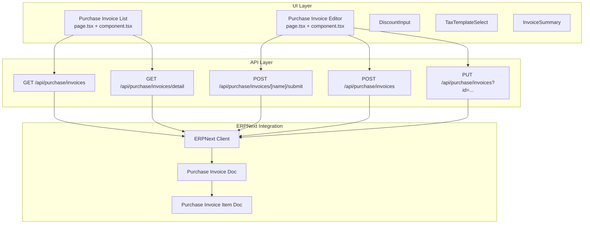
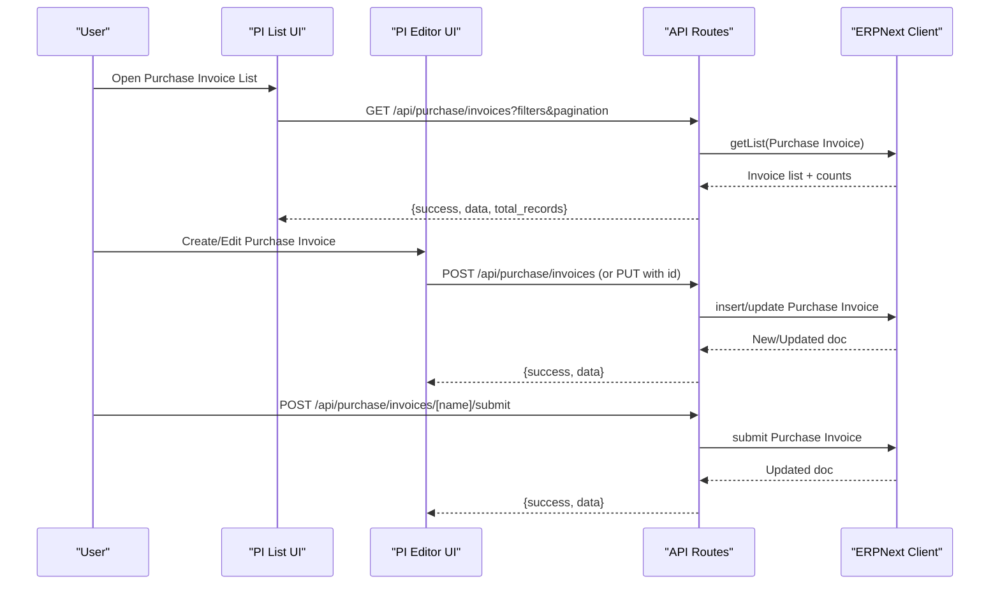
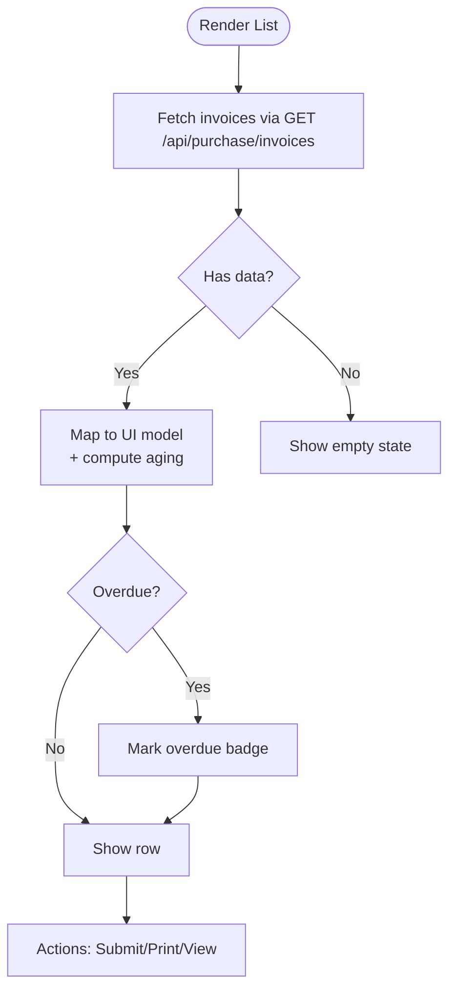
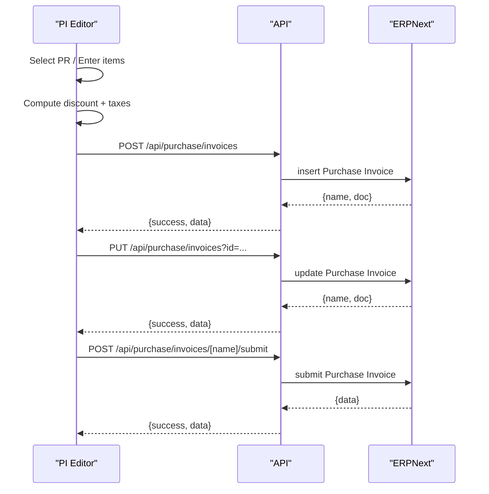
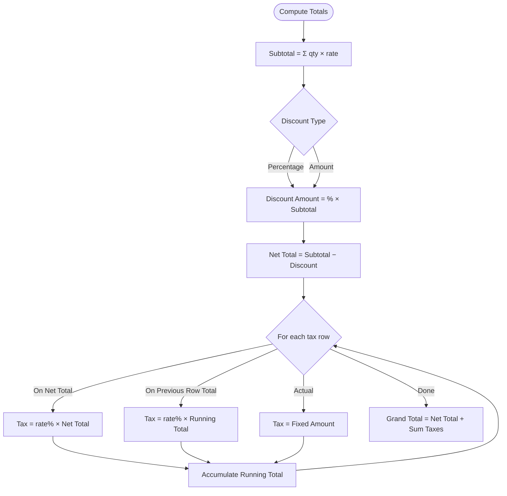
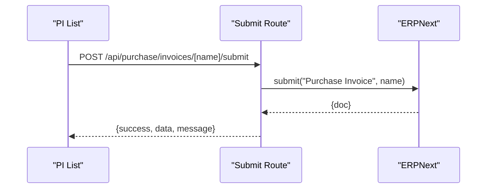
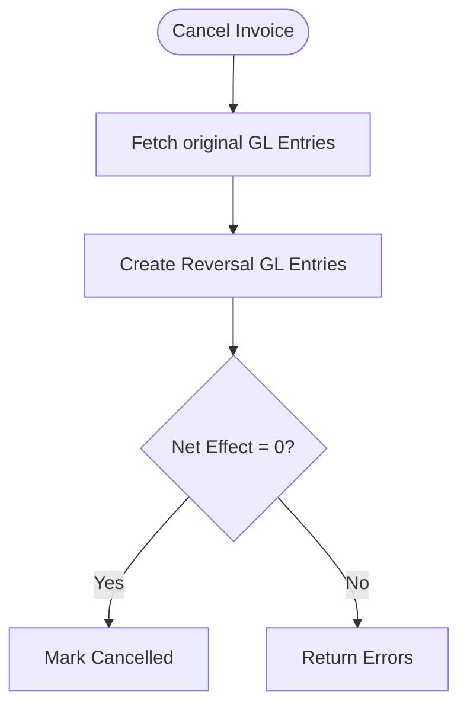
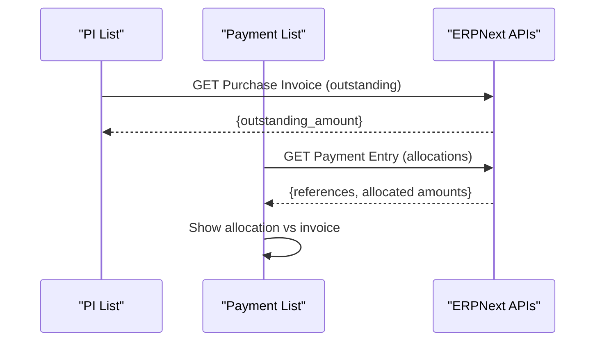
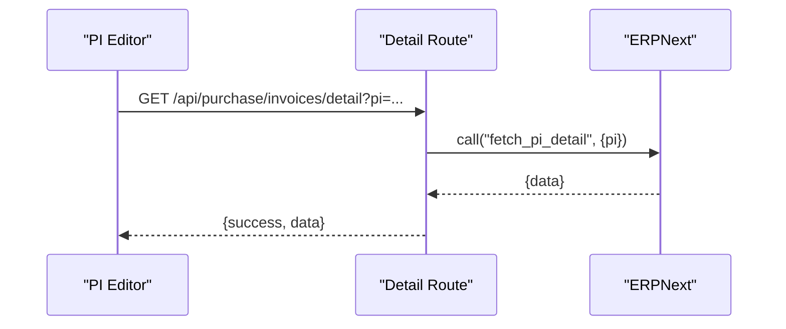
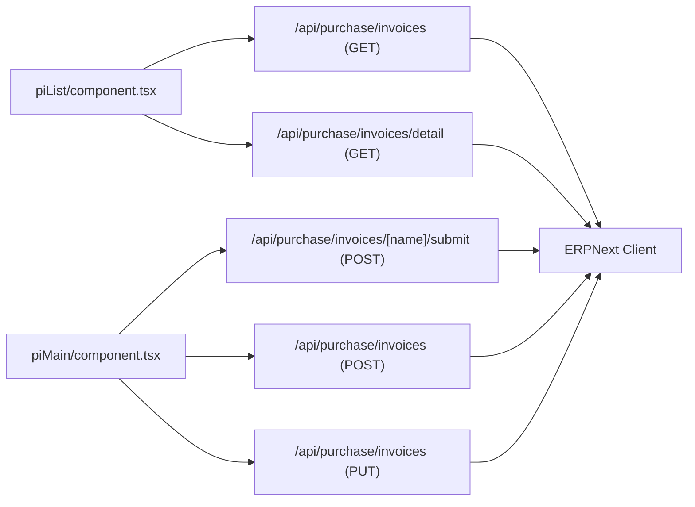

# Purchase Invoices

<cite>
**Referenced Files in This Document**
- [app/purchase-invoice/piList/page.tsx](file://app/purchase-invoice/piList/page.tsx)
- [app/purchase-invoice/piList/component.tsx](file://app/purchase-invoice/piList/component.tsx)
- [app/purchase-invoice/piMain/page.tsx](file://app/purchase-invoice/piMain/page.tsx)
- [app/purchase-invoice/piMain/component.tsx](file://app/purchase-invoice/piMain/component.tsx)
- [app/api/purchase/invoices/route.ts](file://app/api/purchase/invoices/route.ts)
- [app/api/purchase/invoices/[name]/submit/route.ts](file://app/api/purchase/invoices/[name]/submit/route.ts)
- [app/api/purchase/invoices/detail/route.ts](file://app/api/purchase/invoices/detail/route.ts)
- [types/purchase-invoice.ts](file://types/purchase-invoice.ts)
- [types/purchase-invoice-details.ts](file://types/purchase-invoice-details.ts)
- [components/invoice/DiscountInput.tsx](file://components/invoice/DiscountInput.tsx)
- [components/invoice/TaxTemplateSelect.tsx](file://components/invoice/TaxTemplateSelect.tsx)
- [components/invoice/InvoiceSummary.tsx](file://components/invoice/InvoiceSummary.tsx)
- [app/payment/paymentList/component.tsx](file://app/payment/paymentList/component.tsx)
- [erpnext_custom/invoice_cancellation.py](file://erpnext_custom/invoice_cancellation.py)
- [tests/accounting-period-purchase-validation.test.ts](file://tests/accounting-period-purchase-validation.test.ts)
</cite>

## Table of Contents
1. [Introduction](#introduction)
2. [Project Structure](#project-structure)
3. [Core Components](#core-components)
4. [Architecture Overview](#architecture-overview)
5. [Detailed Component Analysis](#detailed-component-analysis)
6. [Dependency Analysis](#dependency-analysis)
7. [Performance Considerations](#performance-considerations)
8. [Troubleshooting Guide](#troubleshooting-guide)
9. [Conclusion](#conclusion)
10. [Appendices](#appendices)

## Introduction
This document explains the complete Purchase Invoice lifecycle in the system: creation from purchase receipts, item selection and validation, discount and tax computation, submission and approval, payment allocation, outstanding tracking, and reporting/search capabilities. It also covers integration with supplier accounts, authorization controls, and error handling.

## Project Structure
The Purchase Invoice feature spans UI pages, shared invoice components, and backend API routes that integrate with ERPNext. Key areas:
- UI pages: Purchase Invoice list and main editor
- Shared components: Discount input, tax template selector, invoice summary
- Backend APIs: CRUD and submit operations, detail retrieval
- Supporting types: TypeScript interfaces for requests, responses, and details
- Payment integration: Payment list and allocation via Payment Entries
- Custom logic: Invoice cancellation workflow with GL reversal

**Diagram sources**
- [app/purchase-invoice/piList/component.tsx](file://app/purchase-invoice/piList/component.tsx#L165-L281)
- [app/purchase-invoice/piMain/component.tsx](file://app/purchase-invoice/piMain/component.tsx#L437-L640)
- [app/api/purchase/invoices/route.ts](file://app/api/purchase/invoices/route.ts#L10-L213)
- [app/api/purchase/invoices/[name]/submit/route.ts](file://app/api/purchase/invoices/[name]/submit/route.ts#L9-L46)
- [app/api/purchase/invoices/detail/route.ts](file://app/api/purchase/invoices/detail/route.ts#L9-L80)

**Section sources**
- [app/purchase-invoice/piList/page.tsx](file://app/purchase-invoice/piList/page.tsx#L1-L7)
- [app/purchase-invoice/piMain/page.tsx](file://app/purchase-invoice/piMain/page.tsx#L1-L7)

## Core Components
- Purchase Invoice List: Displays invoices with filters, pagination, overdue indicators, and actions (submit, print).
- Purchase Invoice Editor: Handles supplier selection, PR-based item population, discount/tax computation, and save/update/submit.
- Shared Invoice Components: DiscountInput, TaxTemplateSelect, InvoiceSummary.
- API Routes: GET/POST/PUT for invoices, GET detail endpoint, and submit endpoint.
- Types: Strong typing for request/response and detail structures.
- Payment Integration: Payment list supports allocation against invoices and status updates.
- Custom Cancellation: GL reversal-based cancellation workflow.

**Section sources**
- [app/purchase-invoice/piList/component.tsx](file://app/purchase-invoice/piList/component.tsx#L82-L800)
- [app/purchase-invoice/piMain/component.tsx](file://app/purchase-invoice/piMain/component.tsx#L87-L800)
- [components/invoice/DiscountInput.tsx](file://components/invoice/DiscountInput.tsx#L17-L219)
- [components/invoice/TaxTemplateSelect.tsx](file://components/invoice/TaxTemplateSelect.tsx#L26-L192)
- [components/invoice/InvoiceSummary.tsx](file://components/invoice/InvoiceSummary.tsx#L27-L185)
- [app/api/purchase/invoices/route.ts](file://app/api/purchase/invoices/route.ts#L10-L457)
- [app/api/purchase/invoices/[name]/submit/route.ts](file://app/api/purchase/invoices/[name]/submit/route.ts#L9-L46)
- [app/api/purchase/invoices/detail/route.ts](file://app/api/purchase/invoices/detail/route.ts#L9-L80)
- [types/purchase-invoice.ts](file://types/purchase-invoice.ts#L13-L151)
- [types/purchase-invoice-details.ts](file://types/purchase-invoice-details.ts#L14-L32)
- [app/payment/paymentList/component.tsx](file://app/payment/paymentList/component.tsx#L53-L903)
- [erpnext_custom/invoice_cancellation.py](file://erpnext_custom/invoice_cancellation.py#L169-L230)

## Architecture Overview
End-to-end flow:
- UI list fetches invoices via GET /api/purchase/invoices with filters and pagination.
- UI editor selects a supplier and optionally loads PR items, computes totals with discount and taxes, then posts to POST /api/purchase/invoices or updates via PUT /api/purchase/invoices?id=...
- Submit action triggers POST /api/purchase/invoices/[name]/submit, which calls ERPNext submit.
- Payment list shows allocations and statuses; payments allocate against invoices.
- Cancellation uses custom Python logic to reverse GL entries.

**Diagram sources**
- [app/purchase-invoice/piList/component.tsx](file://app/purchase-invoice/piList/component.tsx#L165-L281)
- [app/api/purchase/invoices/route.ts](file://app/api/purchase/invoices/route.ts#L10-L213)
- [app/api/purchase/invoices/[name]/submit/route.ts](file://app/api/purchase/invoices/[name]/submit/route.ts#L9-L46)

## Detailed Component Analysis

### Purchase Invoice List (View, Filters, Submission)
- Loads invoices with company-scoped filters (supplier name, document number, status, date range).
- Supports infinite scroll on mobile and pagination on desktop.
- Highlights overdue invoices and shows aging info.
- Provides actions: submit (Draft), print, and navigate to editor.

**Diagram sources**
- [app/purchase-invoice/piList/component.tsx](file://app/purchase-invoice/piList/component.tsx#L165-L281)
- [app/purchase-invoice/piList/component.tsx](file://app/purchase-invoice/piList/component.tsx#L371-L398)

**Section sources**
- [app/purchase-invoice/piList/component.tsx](file://app/purchase-invoice/piList/component.tsx#L82-L800)
- [app/api/purchase/invoices/route.ts](file://app/api/purchase/invoices/route.ts#L10-L213)

### Purchase Invoice Editor (Creation, Modification, Submission)
- Supplier selection and PR-based item population.
- Real-time discount and tax computation with InvoiceSummary.
- Save creates via POST; edits update via PUT with id.
- Submit triggers server-side submit.

**Diagram sources**
- [app/purchase-invoice/piMain/component.tsx](file://app/purchase-invoice/piMain/component.tsx#L437-L640)
- [app/api/purchase/invoices/route.ts](file://app/api/purchase/invoices/route.ts#L291-L457)
- [app/api/purchase/invoices/[name]/submit/route.ts](file://app/api/purchase/invoices/[name]/submit/route.ts#L9-L46)

**Section sources**
- [app/purchase-invoice/piMain/component.tsx](file://app/purchase-invoice/piMain/component.tsx#L87-L800)
- [components/invoice/DiscountInput.tsx](file://components/invoice/DiscountInput.tsx#L17-L219)
- [components/invoice/TaxTemplateSelect.tsx](file://components/invoice/TaxTemplateSelect.tsx#L26-L192)
- [components/invoice/InvoiceSummary.tsx](file://components/invoice/InvoiceSummary.tsx#L27-L185)
- [app/api/purchase/invoices/route.ts](file://app/api/purchase/invoices/route.ts#L215-L289)

### Discount and Tax Computation
- DiscountInput supports percentage or fixed amount modes with validation.
- TaxTemplateSelect loads templates and displays tax rows.
- InvoiceSummary computes subtotal, discount, taxes (including chained On Previous Row Total), and grand total.

**Diagram sources**
- [components/invoice/DiscountInput.tsx](file://components/invoice/DiscountInput.tsx#L66-L118)
- [components/invoice/TaxTemplateSelect.tsx](file://components/invoice/TaxTemplateSelect.tsx#L38-L75)
- [components/invoice/InvoiceSummary.tsx](file://components/invoice/InvoiceSummary.tsx#L33-L97)

**Section sources**
- [components/invoice/DiscountInput.tsx](file://components/invoice/DiscountInput.tsx#L17-L219)
- [components/invoice/TaxTemplateSelect.tsx](file://components/invoice/TaxTemplateSelect.tsx#L26-L192)
- [components/invoice/InvoiceSummary.tsx](file://components/invoice/InvoiceSummary.tsx#L27-L185)

### Invoice Submission and Approval Workflow
- Draft invoices can be submitted via POST /api/purchase/invoices/[name]/submit.
- The endpoint delegates to ERPNext submit and returns updated data.
- Accounting period validation includes purchase invoices in closing checks.

**Diagram sources**
- [app/api/purchase/invoices/[name]/submit/route.ts](file://app/api/purchase/invoices/[name]/submit/route.ts#L9-L46)
- [tests/accounting-period-purchase-validation.test.ts](file://tests/accounting-period-purchase-validation.test.ts#L238-L281)

**Section sources**
- [app/api/purchase/invoices/[name]/submit/route.ts](file://app/api/purchase/invoices/[name]/submit/route.ts#L9-L46)
- [tests/accounting-period-purchase-validation.test.ts](file://tests/accounting-period-purchase-validation.test.ts#L238-L281)

### Invoice Modification and Cancellation
- Modifications: PUT /api/purchase/invoices?id=... updates existing invoice.
- Cancellation: Custom Python logic verifies GL net effect and creates reversal entries.

**Diagram sources**
- [erpnext_custom/invoice_cancellation.py](file://erpnext_custom/invoice_cancellation.py#L169-L230)

**Section sources**
- [app/api/purchase/invoices/route.ts](file://app/api/purchase/invoices/route.ts#L215-L289)
- [erpnext_custom/invoice_cancellation.py](file://erpnext_custom/invoice_cancellation.py#L169-L230)

### Outstanding Tracking, Aging, and Payment Allocation
- Outstanding tracking: List shows outstanding_amount and aging via due_date.
- Payment allocation: Payment list supports allocation against invoices and status updates.

**Diagram sources**
- [app/purchase-invoice/piList/component.tsx](file://app/purchase-invoice/piList/component.tsx#L453-L476)
- [app/payment/paymentList/component.tsx](file://app/payment/paymentList/component.tsx#L107-L190)

**Section sources**
- [app/purchase-invoice/piList/component.tsx](file://app/purchase-invoice/piList/component.tsx#L453-L476)
- [app/payment/paymentList/component.tsx](file://app/payment/paymentList/component.tsx#L53-L903)

### Invoice Details View and Audit Trail
- Detail endpoint fetches invoice with items and supplier address display.
- Permission errors are surfaced with user-friendly messages.

**Diagram sources**
- [app/api/purchase/invoices/detail/route.ts](file://app/api/purchase/invoices/detail/route.ts#L9-L80)

**Section sources**
- [app/api/purchase/invoices/detail/route.ts](file://app/api/purchase/invoices/detail/route.ts#L9-L80)
- [types/purchase-invoice-details.ts](file://types/purchase-invoice-details.ts#L14-L32)

### Reporting, Search, and Bulk Operations
- Search filters: supplier name, document number, status, date range.
- Pagination and ordering by creation/posting date.
- Bulk operations: list supports filtering and pagination; printing supported via print dialogs/modals.

**Section sources**
- [app/purchase-invoice/piList/component.tsx](file://app/purchase-invoice/piList/component.tsx#L165-L281)
- [app/purchase-invoice/piList/component.tsx](file://app/purchase-invoice/piList/component.tsx#L518-L573)

## Dependency Analysis
- UI depends on shared invoice components for discount/tax/summary.
- API routes depend on ERPNext client for resource operations.
- Detail route calls a custom ERPNext method.
- Payment list integrates with Payment Entry resources.

**Diagram sources**
- [app/purchase-invoice/piList/component.tsx](file://app/purchase-invoice/piList/component.tsx#L165-L281)
- [app/purchase-invoice/piMain/component.tsx](file://app/purchase-invoice/piMain/component.tsx#L437-L640)
- [app/api/purchase/invoices/route.ts](file://app/api/purchase/invoices/route.ts#L10-L457)
- [app/api/purchase/invoices/[name]/submit/route.ts](file://app/api/purchase/invoices/[name]/submit/route.ts#L9-L46)
- [app/api/purchase/invoices/detail/route.ts](file://app/api/purchase/invoices/detail/route.ts#L9-L80)

**Section sources**
- [app/purchase-invoice/piList/component.tsx](file://app/purchase-invoice/piList/component.tsx#L165-L281)
- [app/purchase-invoice/piMain/component.tsx](file://app/purchase-invoice/piMain/component.tsx#L437-L640)
- [app/api/purchase/invoices/route.ts](file://app/api/purchase/invoices/route.ts#L10-L457)
- [app/api/purchase/invoices/[name]/submit/route.ts](file://app/api/purchase/invoices/[name]/submit/route.ts#L9-L46)
- [app/api/purchase/invoices/detail/route.ts](file://app/api/purchase/invoices/detail/route.ts#L9-L80)

## Performance Considerations
- Use filters and pagination to limit list size.
- Debounced search reduces unnecessary fetches.
- Memoized computations for discount/tax summaries.
- Prefer PUT for updates to avoid re-creating documents.

## Troubleshooting Guide
- Permission errors: Detail route returns explicit permission messages; redirect to list if needed.
- Validation errors: API validates discount range and tax template; UI surfaces user-friendly messages.
- Company context: Ensure selected company is persisted and passed in requests.
- Overdue and aging: Use due_date and outstanding_amount to flag overdue invoices.

**Section sources**
- [app/api/purchase/invoices/detail/route.ts](file://app/api/purchase/invoices/detail/route.ts#L55-L78)
- [app/purchase-invoice/piMain/component.tsx](file://app/purchase-invoice/piMain/component.tsx#L406-L434)
- [app/purchase-invoice/piList/component.tsx](file://app/purchase-invoice/piList/component.tsx#L453-L476)

## Conclusion
The Purchase Invoice module provides a robust, user-friendly workflow from creation to submission and payment allocation, with strong validation, clear UI feedback, and integration with ERPNext for approvals and GL impact. The system supports multi-item invoices, discount and tax computation, overdue tracking, and reporting/search capabilities.

## Appendices

### Practical Workflows

- Create from Purchase Receipt
  - Open editor, choose “Select from PR”, pick a receipt, map items, adjust quantities, apply discount/taxes, save or submit.

- Submit for Approval
  - From list, click Submit on Draft invoices; server calls ERPNext submit.

- Allocate Payments
  - Use Payment List to allocate payments against invoices; view allocation details and statuses.

- Track Aging and Outstanding
  - Use list filters and overdue indicators; view outstanding_amount and due_date.

- Modify or Cancel
  - Edit via PUT; cancel using GL reversal workflow.

**Section sources**
- [app/purchase-invoice/piMain/component.tsx](file://app/purchase-invoice/piMain/component.tsx#L297-L363)
- [app/api/purchase/invoices/[name]/submit/route.ts](file://app/api/purchase/invoices/[name]/submit/route.ts#L9-L46)
- [app/payment/paymentList/component.tsx](file://app/payment/paymentList/component.tsx#L107-L190)
- [erpnext_custom/invoice_cancellation.py](file://erpnext_custom/invoice_cancellation.py#L169-L230)