# Purchase Management

<cite>
**Referenced Files in This Document**
- [route.ts](file://app/api/purchase/invoices/route.ts)
- [route.ts](file://app/api/purchase/orders/route.ts)
- [route.ts](file://app/api/purchase/receipts/route.ts)
- [route.ts](file://app/api/purchase/suppliers/route.ts)
- [route.ts](file://app/api/purchase/supplier-groups/route.ts)
- [route.ts](file://app/api/purchase/debit-note/route.ts)
- [route.ts](file://app/api/purchase/purchase-return/route.ts)
- [purchase-invoice.ts](file://types/purchase-invoice.ts)
- [purchase-return.ts](file://types/purchase-return.ts)
- [component.tsx](file://app/purchase-invoice/piList/component.tsx)
- [component.tsx](file://app/purchase-orders/poList/component.tsx)
- [component.tsx](file://app/purchase-receipts/prList/component.tsx)
- [component.tsx](file://app/purchase-return/prList/component.tsx)
- [PurchaseReceiptDialog.tsx](file://components/purchase-return/PurchaseReceiptDialog.tsx)
- [purchase-return-calculations.ts](file://lib/purchase-return-calculations.ts)
</cite>

## Table of Contents
1. [Introduction](#introduction)
2. [Project Structure](#project-structure)
3. [Core Components](#core-components)
4. [Architecture Overview](#architecture-overview)
5. [Detailed Component Analysis](#detailed-component-analysis)
6. [Dependency Analysis](#dependency-analysis)
7. [Performance Considerations](#performance-considerations)
8. [Troubleshooting Guide](#troubleshooting-guide)
9. [Conclusion](#conclusion)
10. [Appendices](#appendices)

## Introduction
This document provides comprehensive documentation for Purchase Management in the ERP system, covering the end-to-end procurement workflow from supplier creation to invoice processing and returns. It explains purchase invoice creation, modification, and cancellation processes including discount calculations, tax application, and multi-item handling. It also details supplier management, purchase order processing, purchase receipt generation, goods receipt tracking, debit note processing for purchase returns, vendor account adjustments, refund handling, partial returns, inventory impact on supplier accounts, supplier payment processing, outstanding amounts tracking, aging reports, practical examples, integrations with inventory and payment systems, and error handling scenarios. Reporting and supplier analytics are included along with compliance considerations.

## Project Structure
The Purchase Management module is organized around:
- API routes under app/api/purchase handling CRUD operations for invoices, orders, receipts, suppliers, supplier groups, debit notes, and purchase returns.
- Frontend lists/components under app/purchase-* for listing and interacting with purchase documents.
- Shared types under types for purchase invoice and purchase return data contracts.
- Utility calculations for purchase returns and debit notes.
- A reusable dialog for selecting purchase receipts to create returns.

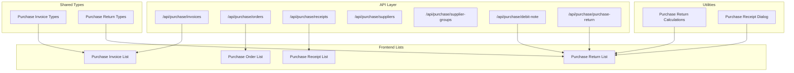

**Diagram sources**
- [route.ts](file://app/api/purchase/invoices/route.ts#L1-L457)
- [route.ts](file://app/api/purchase/orders/route.ts#L1-L190)
- [route.ts](file://app/api/purchase/receipts/route.ts#L1-L161)
- [route.ts](file://app/api/purchase/suppliers/route.ts#L1-L120)
- [route.ts](file://app/api/purchase/supplier-groups/route.ts#L1-L33)
- [route.ts](file://app/api/purchase/debit-note/route.ts#L1-L295)
- [route.ts](file://app/api/purchase/purchase-return/route.ts#L1-L297)
- [purchase-invoice.ts](file://types/purchase-invoice.ts#L1-L151)
- [purchase-return.ts](file://types/purchase-return.ts#L1-L276)
- [component.tsx](file://app/purchase-invoice/piList/component.tsx#L1-L920)
- [component.tsx](file://app/purchase-orders/poList/component.tsx#L1-L850)
- [component.tsx](file://app/purchase-receipts/prList/component.tsx#L1-L791)
- [component.tsx](file://app/purchase-return/prList/component.tsx#L1-L759)
- [PurchaseReceiptDialog.tsx](file://components/purchase-return/PurchaseReceiptDialog.tsx#L1-L360)
- [purchase-return-calculations.ts](file://lib/purchase-return-calculations.ts#L1-L80)

**Section sources**
- [route.ts](file://app/api/purchase/invoices/route.ts#L1-L457)
- [route.ts](file://app/api/purchase/orders/route.ts#L1-L190)
- [route.ts](file://app/api/purchase/receipts/route.ts#L1-L161)
- [route.ts](file://app/api/purchase/suppliers/route.ts#L1-L120)
- [route.ts](file://app/api/purchase/supplier-groups/route.ts#L1-L33)
- [route.ts](file://app/api/purchase/debit-note/route.ts#L1-L295)
- [route.ts](file://app/api/purchase/purchase-return/route.ts#L1-L297)
- [purchase-invoice.ts](file://types/purchase-invoice.ts#L1-L151)
- [purchase-return.ts](file://types/purchase-return.ts#L1-L276)
- [component.tsx](file://app/purchase-invoice/piList/component.tsx#L1-L920)
- [component.tsx](file://app/purchase-orders/poList/component.tsx#L1-L850)
- [component.tsx](file://app/purchase-receipts/prList/component.tsx#L1-L791)
- [component.tsx](file://app/purchase-return/prList/component.tsx#L1-L759)
- [PurchaseReceiptDialog.tsx](file://components/purchase-return/PurchaseReceiptDialog.tsx#L1-L360)
- [purchase-return-calculations.ts](file://lib/purchase-return-calculations.ts#L1-L80)

## Core Components
- Purchase Invoice API: Supports creation, retrieval, updates, and discount/tax validation with backward compatibility for legacy invoices.
- Purchase Order API: Handles listing and creation of purchase orders with status mapping and filters.
- Purchase Receipt API: Manages listing and creation of purchase receipts with status tracking.
- Supplier Management API: Provides supplier listing and creation with hybrid search and company-aware filtering.
- Supplier Groups API: Retrieves supplier group names for categorization.
- Debit Note API: Processes purchase returns as debit notes against purchase invoices with validation and item selection.
- Purchase Return API: Manages purchase returns against purchase receipts with validation and item selection.
- Frontend Lists: Interactive lists for invoices, purchase orders, receipts, and returns with filters, pagination, printing, and actions.
- Utilities: Calculation helpers for purchase returns and debit notes including amounts, quantities, and formatting.

**Section sources**
- [route.ts](file://app/api/purchase/invoices/route.ts#L1-L457)
- [route.ts](file://app/api/purchase/orders/route.ts#L1-L190)
- [route.ts](file://app/api/purchase/receipts/route.ts#L1-L161)
- [route.ts](file://app/api/purchase/suppliers/route.ts#L1-L120)
- [route.ts](file://app/api/purchase/supplier-groups/route.ts#L1-L33)
- [route.ts](file://app/api/purchase/debit-note/route.ts#L1-L295)
- [route.ts](file://app/api/purchase/purchase-return/route.ts#L1-L297)
- [purchase-invoice.ts](file://types/purchase-invoice.ts#L1-L151)
- [purchase-return.ts](file://types/purchase-return.ts#L1-L276)
- [component.tsx](file://app/purchase-invoice/piList/component.tsx#L1-L920)
- [component.tsx](file://app/purchase-orders/poList/component.tsx#L1-L850)
- [component.tsx](file://app/purchase-receipts/prList/component.tsx#L1-L791)
- [component.tsx](file://app/purchase-return/prList/component.tsx#L1-L759)
- [PurchaseReceiptDialog.tsx](file://components/purchase-return/PurchaseReceiptDialog.tsx#L1-L360)
- [purchase-return-calculations.ts](file://lib/purchase-return-calculations.ts#L1-L80)

## Architecture Overview
The system follows a layered architecture:
- API routes act as the backend service layer, interacting with ERPNext via a site-aware client and applying validation and transformations.
- Frontend components serve as the presentation layer, fetching data from API routes, rendering lists, forms, and handling actions like submit, print, and navigation.
- Shared types define the data contracts for purchase invoices and returns.
- Utilities encapsulate calculation logic for returns and debit notes.

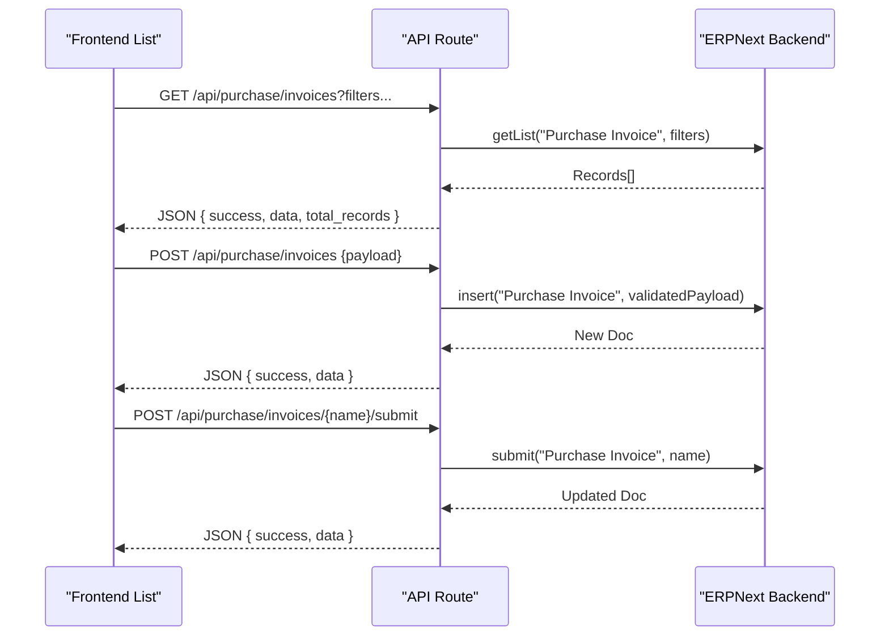

**Diagram sources**
- [route.ts](file://app/api/purchase/invoices/route.ts#L1-L457)
- [component.tsx](file://app/purchase-invoice/piList/component.tsx#L1-L920)

**Section sources**
- [route.ts](file://app/api/purchase/invoices/route.ts#L1-L457)
- [component.tsx](file://app/purchase-invoice/piList/component.tsx#L1-L920)

## Detailed Component Analysis

### Purchase Invoice Management
- Creation supports discount fields (percentage and amount), tax templates, and tax rows with validation for discount ranges and tax template existence and account head validity.
- Retrieval supports single document fetch with items and supplier address display, plus list filtering by company, supplier, status, date range, and document number.
- Updates allow modifying supplier, posting date, due date, items, and notes while preserving ERPNext fields.
- Backward compatibility ensures older invoices without discount/tax fields still render with defaults.

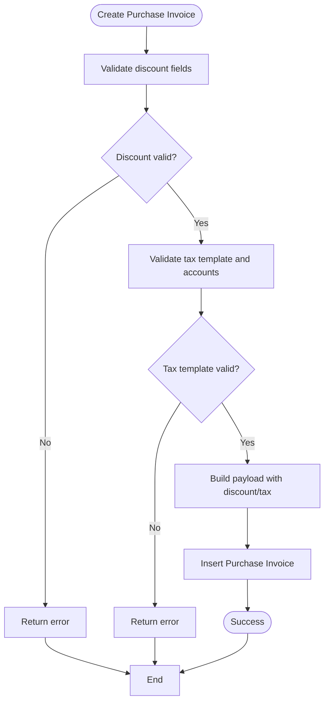

**Diagram sources**
- [route.ts](file://app/api/purchase/invoices/route.ts#L291-L457)

**Section sources**
- [route.ts](file://app/api/purchase/invoices/route.ts#L1-L457)
- [purchase-invoice.ts](file://types/purchase-invoice.ts#L1-L151)
- [component.tsx](file://app/purchase-invoice/piList/component.tsx#L1-L920)

### Purchase Order Processing
- Listing supports filters by company, status, date range, supplier search, and document number with proper status mapping.
- Creation forwards raw purchase order data to ERPNext with robust error extraction for mandatory fields, validation errors, link validation, and permissions.

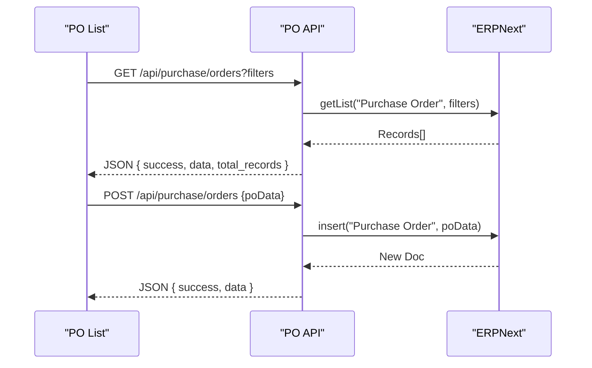

**Diagram sources**
- [route.ts](file://app/api/purchase/orders/route.ts#L1-L190)
- [component.tsx](file://app/purchase-orders/poList/component.tsx#L1-L850)

**Section sources**
- [route.ts](file://app/api/purchase/orders/route.ts#L1-L190)
- [component.tsx](file://app/purchase-orders/poList/component.tsx#L1-L850)

### Purchase Receipt Generation and Tracking
- Listing supports filters by company, status, supplier, date range, and document number with ordering by creation and posting date.
- Creation forwards raw purchase receipt data to ERPNext.
- The list supports submit action and print functionality with supplier address resolution.

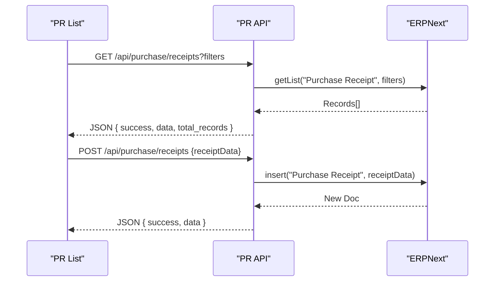

**Diagram sources**
- [route.ts](file://app/api/purchase/receipts/route.ts#L1-L161)
- [component.tsx](file://app/purchase-receipts/prList/component.tsx#L1-L791)

**Section sources**
- [route.ts](file://app/api/purchase/receipts/route.ts#L1-L161)
- [component.tsx](file://app/purchase-receipts/prList/component.tsx#L1-L791)

### Supplier Management
- Supplier listing supports hybrid search by name and supplier name with deduplication and pagination.
- Supplier creation posts data to ERPNext, letting ERPNext generate the supplier name via naming series.

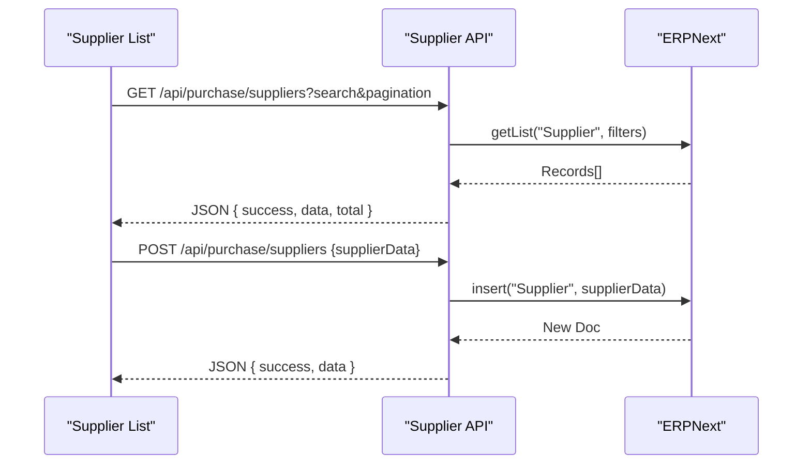

**Diagram sources**
- [route.ts](file://app/api/purchase/suppliers/route.ts#L1-L120)

**Section sources**
- [route.ts](file://app/api/purchase/suppliers/route.ts#L1-L120)
- [route.ts](file://app/api/purchase/supplier-groups/route.ts#L1-L33)

### Purchase Return Workflow (Against Purchase Receipt)
- Listing filters by company, status, date range, supplier, and document number; returns are Purchase Receipts with is_return=1.
- Creation validates return_against receipt, supplier match, item selection, quantities, and return reasons, then generates a return template via ERPNext’s make_purchase_return method, applies user selections, and inserts the return document.

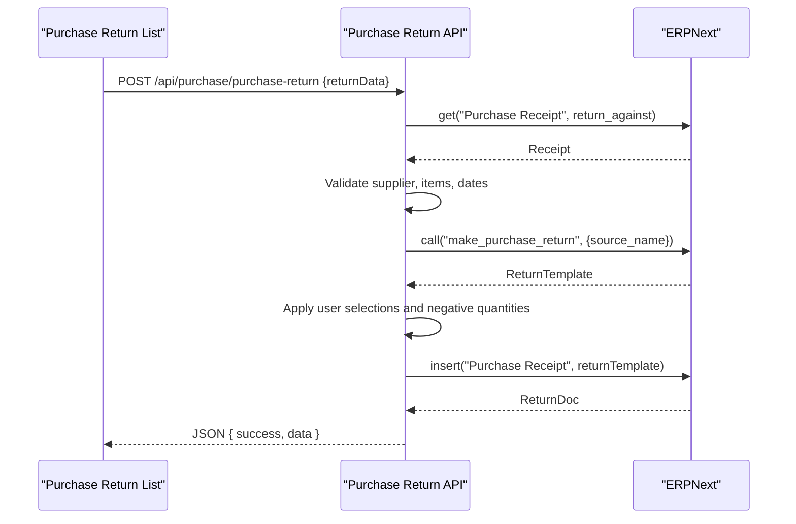

**Diagram sources**
- [route.ts](file://app/api/purchase/purchase-return/route.ts#L1-L297)
- [PurchaseReceiptDialog.tsx](file://components/purchase-return/PurchaseReceiptDialog.tsx#L1-L360)
- [component.tsx](file://app/purchase-return/prList/component.tsx#L1-L759)

**Section sources**
- [route.ts](file://app/api/purchase/purchase-return/route.ts#L1-L297)
- [PurchaseReceiptDialog.tsx](file://components/purchase-return/PurchaseReceiptDialog.tsx#L1-L360)
- [component.tsx](file://app/purchase-return/prList/component.tsx#L1-L759)
- [purchase-return.ts](file://types/purchase-return.ts#L1-L276)

### Debit Note Processing (Against Purchase Invoice)
- Listing filters by company, status, date range, supplier, and document number; debit notes are Purchase Invoices with is_return=1 and docstatus=1.
- Creation validates return_against invoice, supplier match, item selection, quantities, and return reasons, then generates a debit note template via ERPNext’s make_debit_note method, applies user selections, and inserts the debit note document.

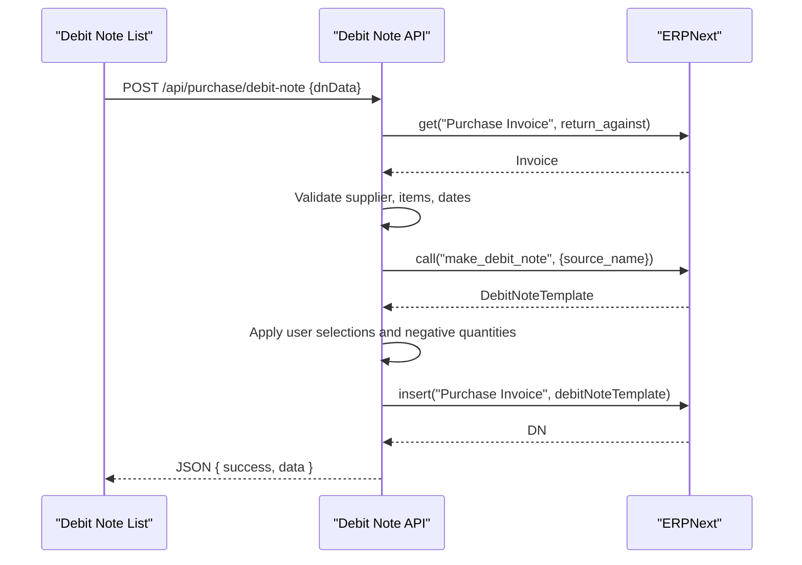

**Diagram sources**
- [route.ts](file://app/api/purchase/debit-note/route.ts#L1-L295)

**Section sources**
- [route.ts](file://app/api/purchase/debit-note/route.ts#L1-L295)
- [purchase-return-calculations.ts](file://lib/purchase-return-calculations.ts#L1-L80)

### Supplier Payment Processing and Outstanding Amounts
- Purchase Invoice list displays outstanding amounts and due dates, enabling payment actions for unpaid invoices.
- Aging indicators are derived from due dates and current date to highlight overdue invoices.
- Outstanding amounts are tracked per invoice and can be reconciled against payments.

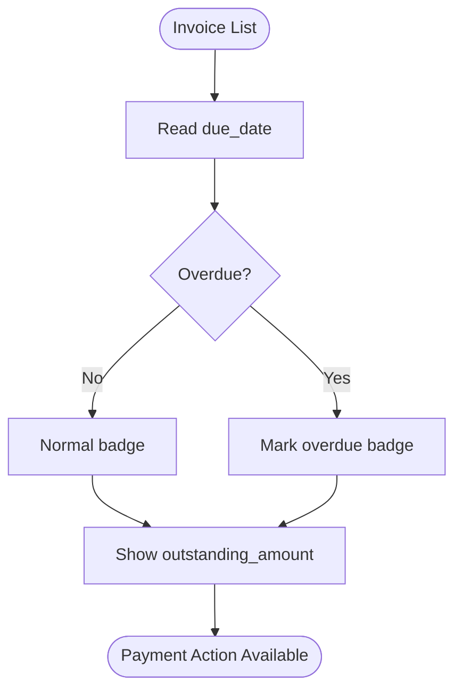

**Diagram sources**
- [component.tsx](file://app/purchase-invoice/piList/component.tsx#L453-L476)

**Section sources**
- [component.tsx](file://app/purchase-invoice/piList/component.tsx#L1-L920)

### Partial Returns and Inventory Impact
- Purchase returns support partial quantities per item with negative quantities and remaining quantity calculations.
- The system enforces returnable quantity limits and validates return reasons, including “Other” requiring notes.
- Inventory impact is handled by ERPNext via purchase receipt returns and debit notes.

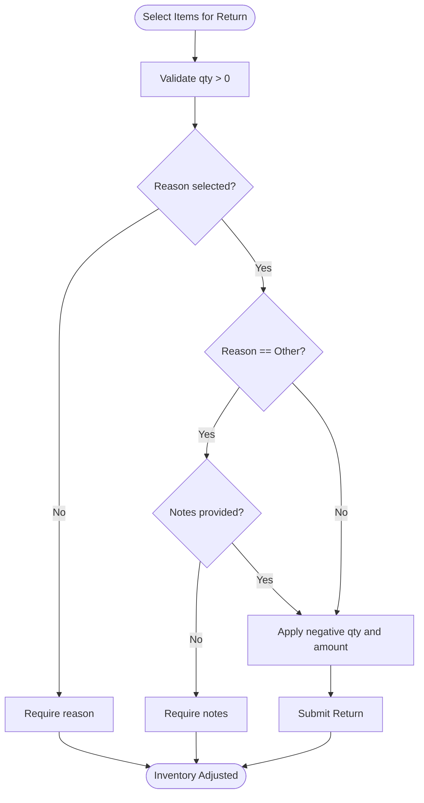

**Diagram sources**
- [route.ts](file://app/api/purchase/purchase-return/route.ts#L100-L297)
- [purchase-return-calculations.ts](file://lib/purchase-return-calculations.ts#L1-L80)

**Section sources**
- [route.ts](file://app/api/purchase/purchase-return/route.ts#L1-L297)
- [purchase-return-calculations.ts](file://lib/purchase-return-calculations.ts#L1-L80)

### Practical Examples
- Creating a Purchase Invoice with discount and tax:
  - Supply discount_amount/discount_percentage and taxes/taxes_and_charges.
  - Backend validates discount ranges and tax template/account heads.
- Generating a Purchase Return:
  - Select a submitted purchase receipt, choose items to return, specify reasons and quantities, then submit.
- Generating a Debit Note:
  - Select a submitted purchase invoice, choose items to debit, specify reasons and quantities, then submit.
- Supplier Onboarding:
  - Create supplier with minimal fields; ERPNext assigns naming series.

**Section sources**
- [route.ts](file://app/api/purchase/invoices/route.ts#L291-L457)
- [route.ts](file://app/api/purchase/purchase-return/route.ts#L100-L297)
- [route.ts](file://app/api/purchase/debit-note/route.ts#L101-L295)
- [route.ts](file://app/api/purchase/suppliers/route.ts#L98-L120)

### Integration with Inventory and Payment Systems
- Purchase Receipts integrate with inventory upon submission, updating stock and valuation.
- Purchase Invoices integrate with accounts payable and payment applications.
- Purchase Returns and Debit Notes adjust inventory and vendor balances accordingly.

**Section sources**
- [route.ts](file://app/api/purchase/receipts/route.ts#L104-L161)
- [route.ts](file://app/api/purchase/invoices/route.ts#L1-L457)
- [route.ts](file://app/api/purchase/purchase-return/route.ts#L1-L297)
- [route.ts](file://app/api/purchase/debit-note/route.ts#L1-L295)

### Reporting and Analytics
- Purchase Invoice Details report and Purchases report are available for analysis.
- Accounts Payable aging reports help track outstanding amounts and aging.
- Purchase Return reports support return analytics and trends.

**Section sources**
- [component.tsx](file://app/purchase-invoice/piList/component.tsx#L1-L920)
- [component.tsx](file://app/purchase-return/prList/component.tsx#L1-L759)

## Dependency Analysis
The frontend lists depend on API routes for data and actions. The API routes depend on ERPNext via a site-aware client and apply validation and transformations. Types define contracts for data exchange. Utilities encapsulate calculations.

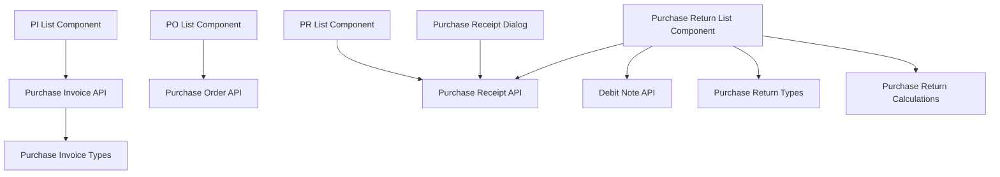

**Diagram sources**
- [component.tsx](file://app/purchase-invoice/piList/component.tsx#L1-L920)
- [component.tsx](file://app/purchase-orders/poList/component.tsx#L1-L850)
- [component.tsx](file://app/purchase-receipts/prList/component.tsx#L1-L791)
- [component.tsx](file://app/purchase-return/prList/component.tsx#L1-L759)
- [route.ts](file://app/api/purchase/invoices/route.ts#L1-L457)
- [route.ts](file://app/api/purchase/orders/route.ts#L1-L190)
- [route.ts](file://app/api/purchase/receipts/route.ts#L1-L161)
- [route.ts](file://app/api/purchase/purchase-return/route.ts#L1-L297)
- [route.ts](file://app/api/purchase/debit-note/route.ts#L1-L295)
- [purchase-invoice.ts](file://types/purchase-invoice.ts#L1-L151)
- [purchase-return.ts](file://types/purchase-return.ts#L1-L276)
- [PurchaseReceiptDialog.tsx](file://components/purchase-return/PurchaseReceiptDialog.tsx#L1-L360)
- [purchase-return-calculations.ts](file://lib/purchase-return-calculations.ts#L1-L80)

**Section sources**
- [component.tsx](file://app/purchase-invoice/piList/component.tsx#L1-L920)
- [component.tsx](file://app/purchase-orders/poList/component.tsx#L1-L850)
- [component.tsx](file://app/purchase-receipts/prList/component.tsx#L1-L791)
- [component.tsx](file://app/purchase-return/prList/component.tsx#L1-L759)
- [route.ts](file://app/api/purchase/invoices/route.ts#L1-L457)
- [route.ts](file://app/api/purchase/orders/route.ts#L1-L190)
- [route.ts](file://app/api/purchase/receipts/route.ts#L1-L161)
- [route.ts](file://app/api/purchase/purchase-return/route.ts#L1-L297)
- [route.ts](file://app/api/purchase/debit-note/route.ts#L1-L295)
- [purchase-invoice.ts](file://types/purchase-invoice.ts#L1-L151)
- [purchase-return.ts](file://types/purchase-return.ts#L1-L276)
- [PurchaseReceiptDialog.tsx](file://components/purchase-return/PurchaseReceiptDialog.tsx#L1-L360)
- [purchase-return-calculations.ts](file://lib/purchase-return-calculations.ts#L1-L80)

## Performance Considerations
- Pagination and ordering: API routes implement limit_page_length/start and order_by to manage large datasets efficiently.
- Filtering: Use targeted filters (company, status, date range, supplier) to reduce payload sizes.
- Single document fetch: Prefer id-based retrieval for detailed views to avoid heavy item queries when unnecessary.
- Client-side caching: Store frequently accessed supplier and supplier group lists to minimize network requests.
- Batch operations: Prefer bulk actions where supported to reduce API round trips.

[No sources needed since this section provides general guidance]

## Troubleshooting Guide
- Validation errors during purchase invoice creation:
  - Discount percentage must be between 0 and 100.
  - Discount amount cannot be negative and cannot exceed subtotal.
  - Tax template must exist, be active, and contain valid account heads.
- Purchase order creation errors:
  - Inspect detailed messages for missing mandatory fields, validation errors, invalid references, or permission denials.
- Purchase receipt creation errors:
  - Review server messages for mandatory fields, validation, link validation, or permission issues.
- Purchase return and debit note creation:
  - Ensure return_against exists and is in submitted status.
  - Verify supplier matches the original document.
  - Confirm item selection, quantities, and return reasons (especially “Other” requires notes).
- Supplier creation:
  - If naming series is omitted, ERPNext assigns a default naming series.

**Section sources**
- [route.ts](file://app/api/purchase/invoices/route.ts#L316-L386)
- [route.ts](file://app/api/purchase/orders/route.ts#L135-L187)
- [route.ts](file://app/api/purchase/receipts/route.ts#L121-L160)
- [route.ts](file://app/api/purchase/purchase-return/route.ts#L166-L203)
- [route.ts](file://app/api/purchase/debit-note/route.ts#L167-L203)
- [route.ts](file://app/api/purchase/suppliers/route.ts#L105-L111)

## Conclusion
The Purchase Management module provides a robust, validated, and integrated solution for procurement workflows. It supports comprehensive invoice processing with discounts and taxes, supplier management, purchase orders, receipts, returns, and debit notes. The system integrates with inventory and payment subsystems, offers actionable reporting and analytics, and maintains strong error handling and backward compatibility.

[No sources needed since this section summarizes without analyzing specific files]

## Appendices

### Compliance and Best Practices
- Always validate discount and tax configurations before creating invoices.
- Use appropriate supplier groups and payment terms for accurate reporting.
- Ensure purchase returns and debit notes are properly documented with reasons and notes.
- Track outstanding amounts and aging to maintain healthy vendor relations and cash flow.

[No sources needed since this section provides general guidance]