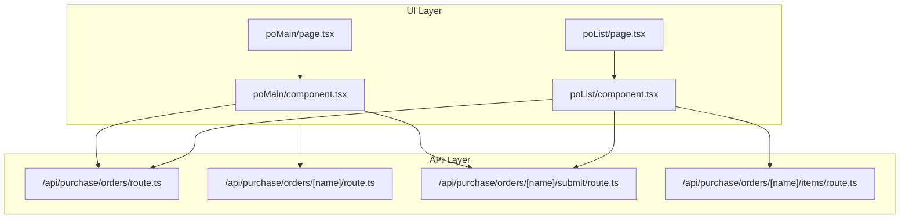
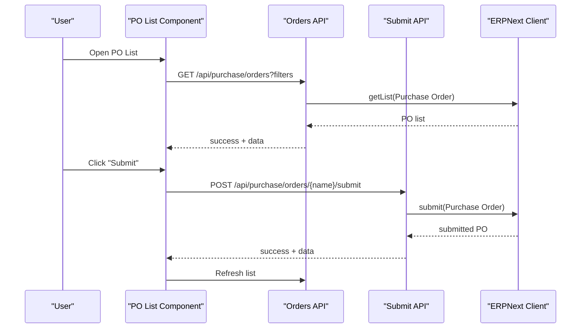
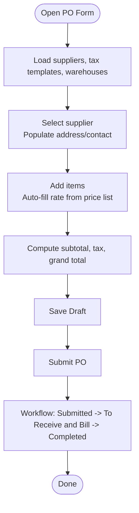
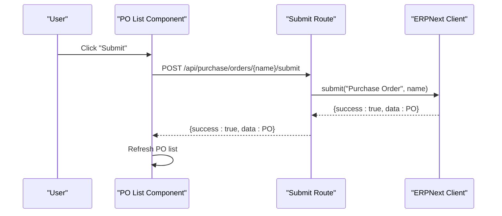
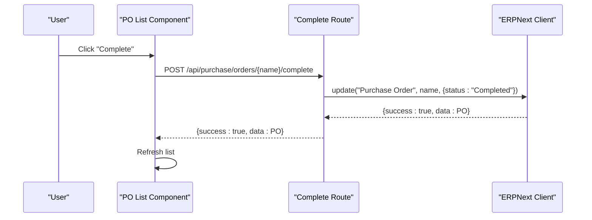
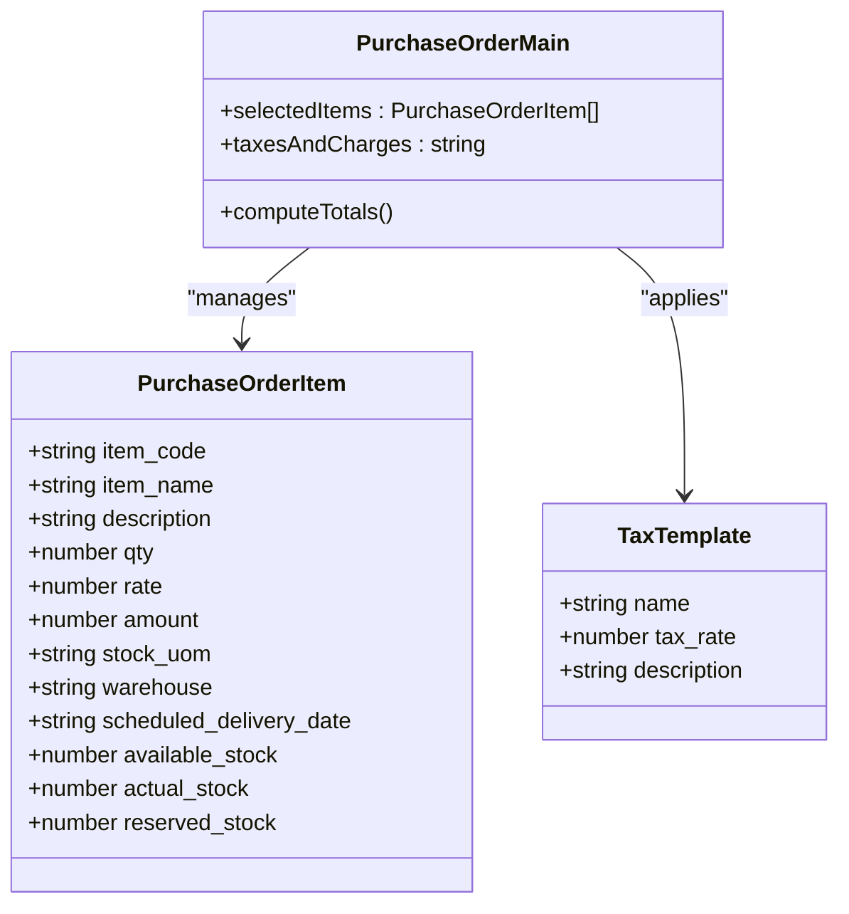
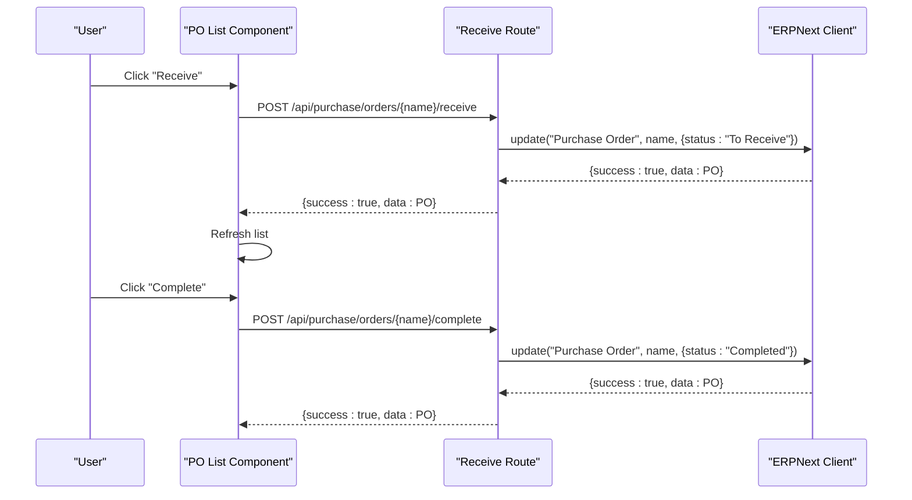
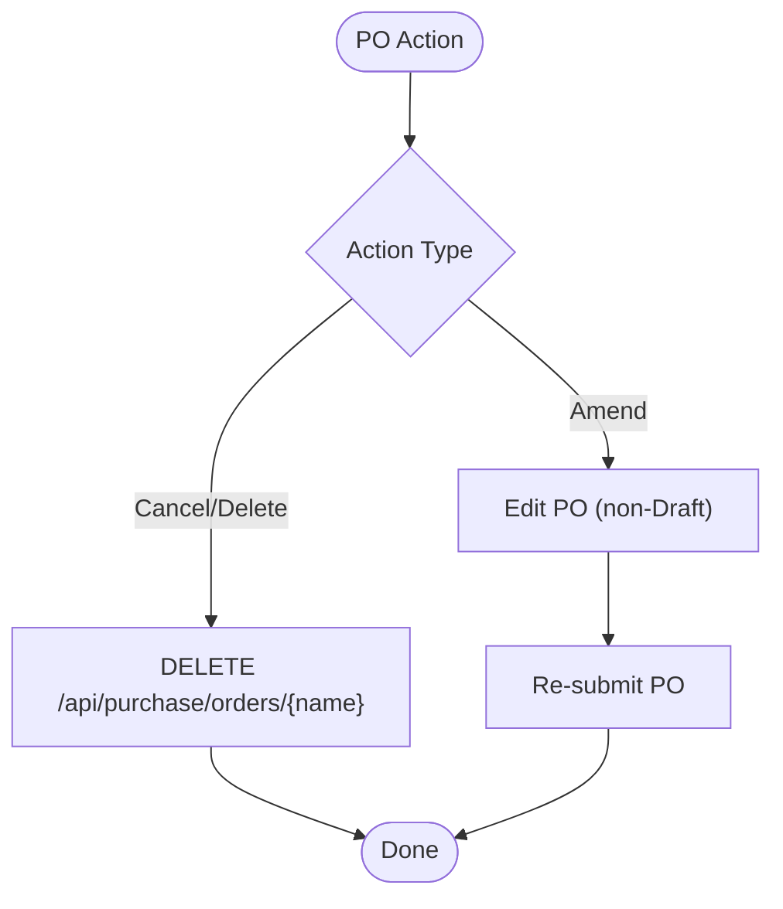
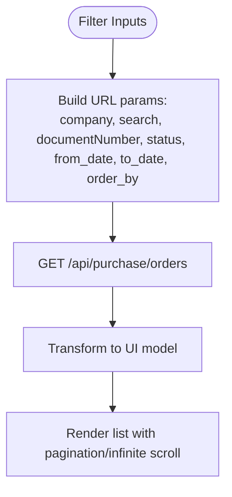
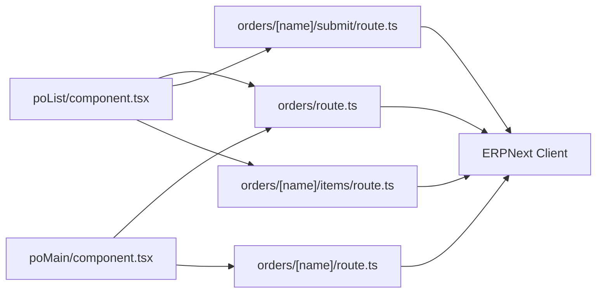

# Purchase Orders

<cite>
**Referenced Files in This Document**
- [poList/page.tsx](file://app/purchase-orders/poList/page.tsx)
- [poList/component.tsx](file://app/purchase-orders/poList/component.tsx)
- [poMain/page.tsx](file://app/purchase-orders/poMain/page.tsx)
- [poMain/component.tsx](file://app/purchase-orders/poMain/component.tsx)
- [orders/route.ts](file://app/api/purchase/orders/route.ts)
- [orders/[name]/route.ts](file://app/api/purchase/orders/[name]/route.ts)
- [orders/[name]/submit/route.ts](file://app/api/purchase/orders/[name]/submit/route.ts)
- [orders/[name]/items/route.ts](file://app/api/purchase/orders/[name]/items/route.ts)
- [API Structure Documentation](file://app/api/README.md)
- [api-routes-unmigrated-documentation.md](file://docs/api-routes/api-routes-unmigrated-documentation.md)
</cite>

## Table of Contents
1. [Introduction](#introduction)
2. [Project Structure](#project-structure)
3. [Core Components](#core-components)
4. [Architecture Overview](#architecture-overview)
5. [Detailed Component Analysis](#detailed-component-analysis)
6. [Dependency Analysis](#dependency-analysis)
7. [Performance Considerations](#performance-considerations)
8. [Troubleshooting Guide](#troubleshooting-guide)
9. [Conclusion](#conclusion)

## Introduction
This document explains the complete Purchase Order (PO) management workflow in the system, from requisition to goods receipt. It covers PO creation (supplier selection, item specification, quantities, delivery schedules), modifications (quantity changes, price adjustments, delivery date updates), submission and approval workflows, completion procedures, status tracking, item-wise order management, goods receipt processing (including partial deliveries and acceptance), cancellation/amendment workflows, reporting/search/filtering, and automated reminders. Practical examples illustrate order fulfillment tracking, supplier performance monitoring, and integration with purchase invoice generation.

## Project Structure
The PO module consists of:
- UI pages and components for listing and creating POs
- API routes for PO lifecycle operations (list, create, submit, receive, complete, delete)
- Supporting routes for PO items and status mapping

**Diagram sources**
- [poList/page.tsx](file://app/purchase-orders/poList/page.tsx#L1-L8)
- [poList/component.tsx](file://app/purchase-orders/poList/component.tsx#L1-L120)
- [poMain/page.tsx](file://app/purchase-orders/poMain/page.tsx#L1-L8)
- [poMain/component.tsx](file://app/purchase-orders/poMain/component.tsx#L1-L120)
- [orders/route.ts](file://app/api/purchase/orders/route.ts#L1-L190)
- [orders/[name]/route.ts](file://app/api/purchase/orders/[name]/route.ts#L1-L135)
- [orders/[name]/submit/route.ts](file://app/api/purchase/orders/[name]/submit/route.ts#L1-L59)
- [orders/[name]/items/route.ts](file://app/api/purchase/orders/[name]/items/route.ts#L118-L141)

**Section sources**
- [poList/page.tsx](file://app/purchase-orders/poList/page.tsx#L1-L8)
- [poList/component.tsx](file://app/purchase-orders/poList/component.tsx#L1-L120)
- [poMain/page.tsx](file://app/purchase-orders/poMain/page.tsx#L1-L8)
- [poMain/component.tsx](file://app/purchase-orders/poMain/component.tsx#L1-L120)
- [orders/route.ts](file://app/api/purchase/orders/route.ts#L1-L190)
- [orders/[name]/route.ts](file://app/api/purchase/orders/[name]/route.ts#L1-L135)
- [orders/[name]/submit/route.ts](file://app/api/purchase/orders/[name]/submit/route.ts#L1-L59)
- [orders/[name]/items/route.ts](file://app/api/purchase/orders/[name]/items/route.ts#L118-L141)

## Core Components
- Purchase Order List Page: Displays POs with filters (supplier, document number, status, date range), pagination/infinite scroll, actions (submit, receive, complete), and print preview.
- Purchase Order Main Page: Provides PO creation/editing with supplier selection, item management (add/remove/update), warehouse assignment, tax templates, and save/print flows.
- API Routes: Provide CRUD and workflow operations for Purchase Orders, including submit, receive, complete, and item details retrieval.

Key capabilities:
- Supplier selection and address population
- Line item management with quantities, rates, amounts, and scheduled delivery dates
- Tax application via tax templates
- Status mapping and display (Draft, Submitted, To Receive and Bill, To Receive, To Bill, Completed, Cancelled, On Hold)
- Goods receipt initiation and completion
- Reporting and filtering (by company, status, date range, supplier, document number)

**Section sources**
- [poList/component.tsx](file://app/purchase-orders/poList/component.tsx#L26-L88)
- [poMain/component.tsx](file://app/purchase-orders/poMain/component.tsx#L12-L113)
- [orders/route.ts](file://app/api/purchase/orders/route.ts#L36-L116)

## Architecture Overview
The PO workflow spans UI components and API routes. The UI communicates with modular API endpoints under /api/purchase/, which delegate to the ERPNext client for persistence and workflow execution.

**Diagram sources**
- [poList/component.tsx](file://app/purchase-orders/poList/component.tsx#L349-L369)
- [orders/route.ts](file://app/api/purchase/orders/route.ts#L9-L116)
- [orders/[name]/submit/route.ts](file://app/api/purchase/orders/[name]/submit/route.ts#L9-L59)

## Detailed Component Analysis

### Purchase Order Creation and Modification
- Creation flow:
  - Select company, supplier, transaction date, schedule date, currency, warehouse, remarks.
  - Add line items with item code/name, description, quantity, unit of measure, rate, amount, warehouse, scheduled delivery date.
  - Apply tax template to compute tax and grand total.
  - Save as Draft; submit to initiate workflow.
- Modification flow:
  - Edit existing PO (non-Draft status may enforce view-only mode).
  - Update quantities, rates, delivery dates, or remove items.
  - Re-save and re-submit if needed.

**Diagram sources**
- [poMain/component.tsx](file://app/purchase-orders/poMain/component.tsx#L304-L441)
- [poMain/component.tsx](file://app/purchase-orders/poMain/component.tsx#L684-L756)

**Section sources**
- [poMain/component.tsx](file://app/purchase-orders/poMain/component.tsx#L63-L113)
- [poMain/component.tsx](file://app/purchase-orders/poMain/component.tsx#L304-L441)
- [poMain/component.tsx](file://app/purchase-orders/poMain/component.tsx#L684-L756)

### Purchase Order Submission and Approval Workflows
- Submission endpoint triggers ERPNext submit workflow.
- Status transitions occur server-side; UI reflects updated status after refresh.

**Diagram sources**
- [poList/component.tsx](file://app/purchase-orders/poList/component.tsx#L349-L369)
- [orders/[name]/submit/route.ts](file://app/api/purchase/orders/[name]/submit/route.ts#L9-L59)

**Section sources**
- [poList/component.tsx](file://app/purchase-orders/poList/component.tsx#L349-L369)
- [orders/[name]/submit/route.ts](file://app/api/purchase/orders/[name]/submit/route.ts#L9-L59)

### Purchase Order Completion Procedures and Status Tracking
- Completion endpoint marks PO as completed after goods receipt.
- Status mapping supports localized labels and color-coded badges.

**Diagram sources**
- [poList/component.tsx](file://app/purchase-orders/poList/component.tsx#L386-L399)
- [orders/[name]/route.ts](file://app/api/purchase/orders/[name]/route.ts#L64-L99)

**Section sources**
- [poList/component.tsx](file://app/purchase-orders/poList/component.tsx#L386-L399)
- [poList/component.tsx](file://app/purchase-orders/poList/component.tsx#L64-L88)

### Item-Wise Order Management
- Each PO line item includes item code, name, description, quantity, rate, amount, UOM, warehouse, scheduled delivery date, and stock availability.
- Taxes are applied based on selected tax template; totals computed automatically.
- Item details endpoint augments items with remaining quantities for receipt planning.

**Diagram sources**
- [poMain/component.tsx](file://app/purchase-orders/poMain/component.tsx#L25-L45)
- [poMain/component.tsx](file://app/purchase-orders/poMain/component.tsx#L388-L406)
- [orders/[name]/items/route.ts](file://app/api/purchase/orders/[name]/items/route.ts#L118-L141)

**Section sources**
- [poMain/component.tsx](file://app/purchase-orders/poMain/component.tsx#L25-L45)
- [poMain/component.tsx](file://app/purchase-orders/poMain/component.tsx#L388-L406)
- [orders/[name]/items/route.ts](file://app/api/purchase/orders/[name]/items/route.ts#L118-L141)

### Goods Receipt Process from Purchase Orders
- Initiate receipt from PO; UI triggers receive action.
- After goods receipt, mark PO as completed.
- Partial receipts are supported conceptually; remaining quantities are tracked via items endpoint.

**Diagram sources**
- [poList/component.tsx](file://app/purchase-orders/poList/component.tsx#L371-L399)
- [orders/[name]/route.ts](file://app/api/purchase/orders/[name]/route.ts#L64-L99)

**Section sources**
- [poList/component.tsx](file://app/purchase-orders/poList/component.tsx#L371-L399)
- [orders/[name]/route.ts](file://app/api/purchase/orders/[name]/route.ts#L64-L99)

### Purchase Order Cancellation, Voiding, and Amendment Workflows
- Delete endpoint removes POs (subject to business rules).
- Amend workflow is supported via edit and re-submit flows in the UI.
- Cancellation/voluntary voiding follows standard delete operation; ensure compliance with business rules.

**Diagram sources**
- [orders/[name]/route.ts](file://app/api/purchase/orders/[name]/route.ts#L101-L134)

**Section sources**
- [orders/[name]/route.ts](file://app/api/purchase/orders/[name]/route.ts#L101-L134)

### Reporting, Search Filters, and Automated Reminders
- Reporting: The API supports listing POs with filters (company, supplier, document number, status, date range) and ordering by creation date.
- Search and filters: Implemented in the PO list component with supplier name, document number, status, and date range.
- Automated reminders: Not implemented in the current code; can be integrated via backend jobs and notifications.

**Diagram sources**
- [poList/component.tsx](file://app/purchase-orders/poList/component.tsx#L203-L282)
- [orders/route.ts](file://app/api/purchase/orders/route.ts#L9-L116)

**Section sources**
- [poList/component.tsx](file://app/purchase-orders/poList/component.tsx#L203-L282)
- [orders/route.ts](file://app/api/purchase/orders/route.ts#L9-L116)

### Practical Examples
- Order Fulfillment Tracking:
  - Track PO status transitions from Draft to Submitted to To Receive and Bill to Completed.
  - Use the items endpoint to monitor remaining quantities for receipt planning.
- Supplier Performance Monitoring:
  - Filter POs by supplier and date range to analyze delivery performance and adherence to scheduled dates.
- Integration with Purchase Invoice Generation:
  - After goods receipt, integrate with purchase invoice creation using the purchase receipt-to-invoice workflow (conceptual integration point).

**Section sources**
- [poList/component.tsx](file://app/purchase-orders/poList/component.tsx#L349-L399)
- [orders/[name]/items/route.ts](file://app/api/purchase/orders/[name]/items/route.ts#L118-L141)

## Dependency Analysis
- UI depends on API routes for data and workflow actions.
- API routes depend on the ERPNext client for persistence and workflow execution.
- Status mapping and localization are handled in the UI layer.

**Diagram sources**
- [poList/component.tsx](file://app/purchase-orders/poList/component.tsx#L1-L120)
- [poMain/component.tsx](file://app/purchase-orders/poMain/component.tsx#L1-L120)
- [orders/route.ts](file://app/api/purchase/orders/route.ts#L1-L190)
- [orders/[name]/route.ts](file://app/api/purchase/orders/[name]/route.ts#L1-L135)
- [orders/[name]/submit/route.ts](file://app/api/purchase/orders/[name]/submit/route.ts#L1-L59)
- [orders/[name]/items/route.ts](file://app/api/purchase/orders/[name]/items/route.ts#L118-L141)

**Section sources**
- [poList/component.tsx](file://app/purchase-orders/poList/component.tsx#L1-L120)
- [poMain/component.tsx](file://app/purchase-orders/poMain/component.tsx#L1-L120)
- [orders/route.ts](file://app/api/purchase/orders/route.ts#L1-L190)
- [orders/[name]/route.ts](file://app/api/purchase/orders/[name]/route.ts#L1-L135)
- [orders/[name]/submit/route.ts](file://app/api/purchase/orders/[name]/submit/route.ts#L1-L59)
- [orders/[name]/items/route.ts](file://app/api/purchase/orders/[name]/items/route.ts#L118-L141)

## Performance Considerations
- Pagination and sorting: API supports limit_page_length/start and order_by parameters; UI enforces creation date sorting.
- Infinite scroll: Mobile view uses infinite scroll with a sentinel and loading indicators.
- Filtering: UI builds URL search params; API applies filters server-side via the ERPNext client.

[No sources needed since this section provides general guidance]

## Troubleshooting Guide
- Company selection: UI requires a selected company; missing company leads to an error banner.
- Validation errors: API parses ERPNext exceptions and returns user-friendly messages for mandatory fields, validation, link validation, and permission errors.
- Network failures: UI displays generic error banners; retry after checking network connectivity.

Common scenarios:
- Missing company: Ensure company is selected from local storage or cookies.
- Validation failures: Review required fields and tax template selection.
- Submit failures: Check PO status and ensure it is in Draft before submit.

**Section sources**
- [poList/component.tsx](file://app/purchase-orders/poList/component.tsx#L176-L196)
- [orders/route.ts](file://app/api/purchase/orders/route.ts#L135-L187)
- [orders/[name]/submit/route.ts](file://app/api/purchase/orders/[name]/submit/route.ts#L45-L57)

## Conclusion
The Purchase Order module provides a robust end-to-end workflow from requisition to goods receipt, with clear UI actions, API-driven persistence, and status tracking. The system supports supplier selection, item management, tax application, submission, receipt, and completion. Reporting and filtering are available via API endpoints, while practical integrations with purchase invoices can be achieved through the receipt-to-invoice workflow. Future enhancements could include automated reminders and expanded amendment workflows.