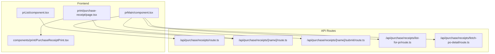
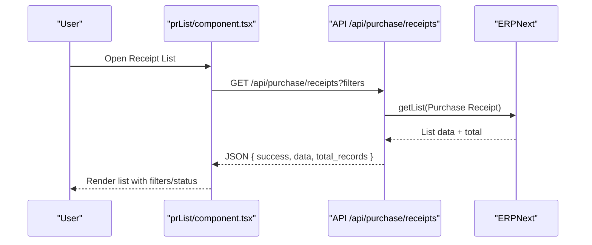
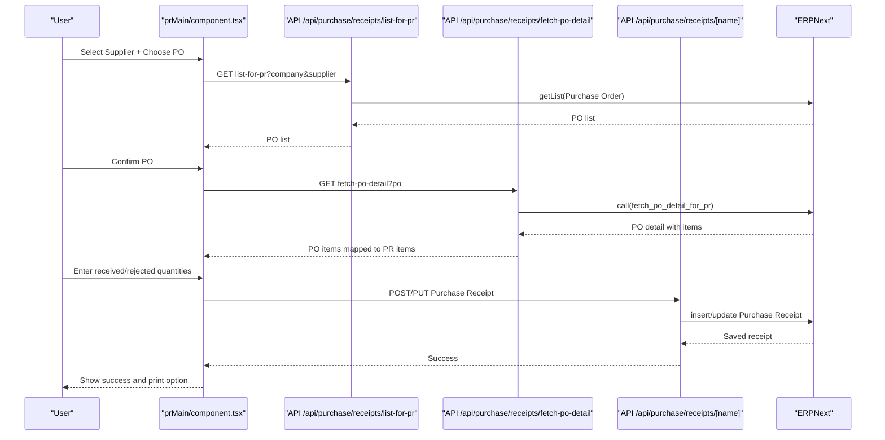
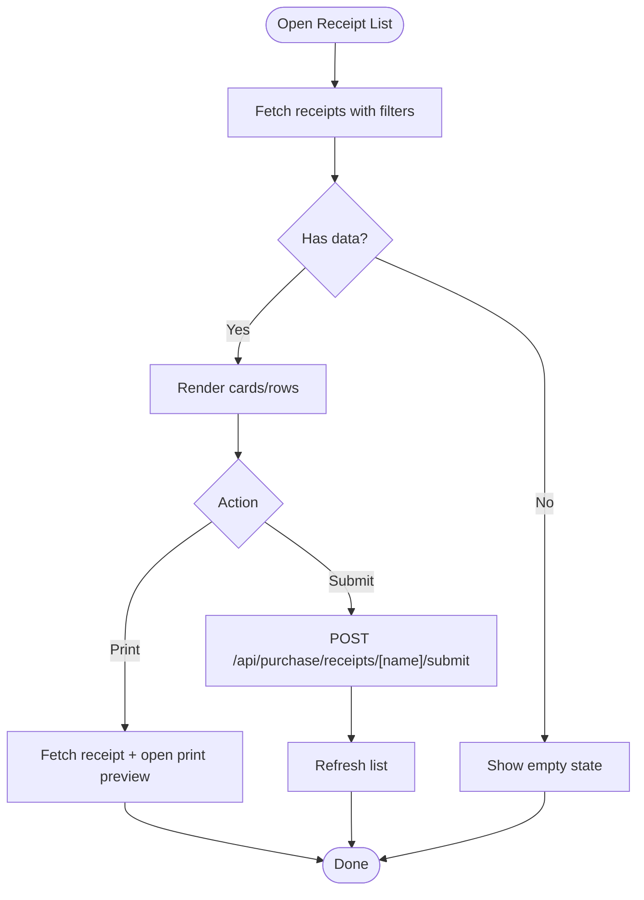
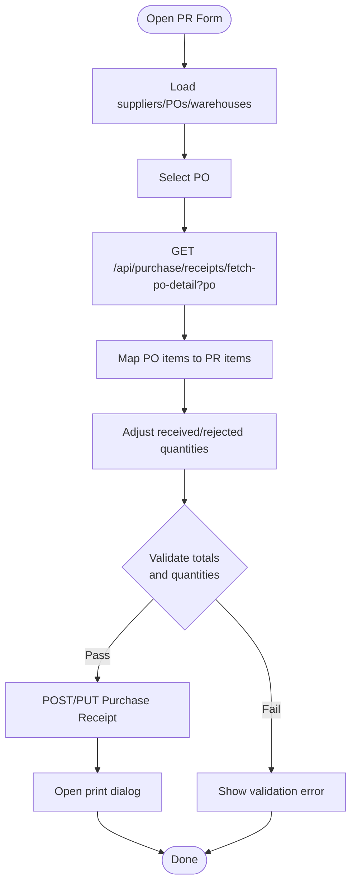
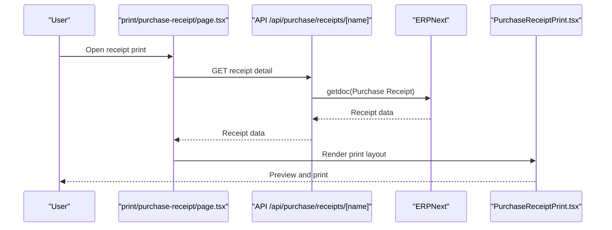
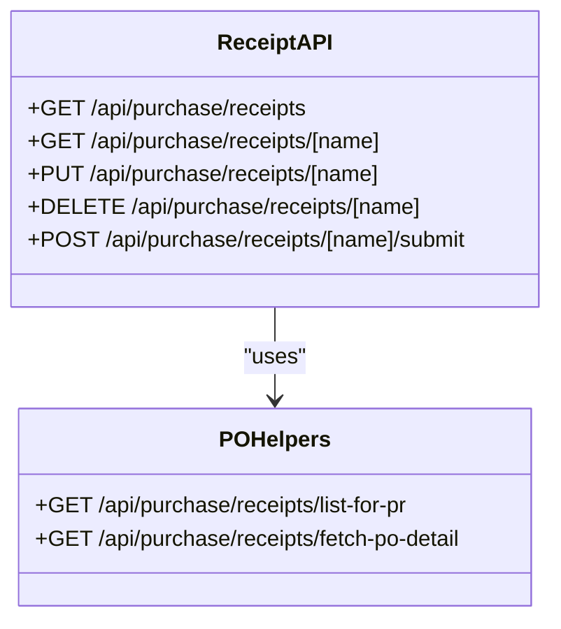
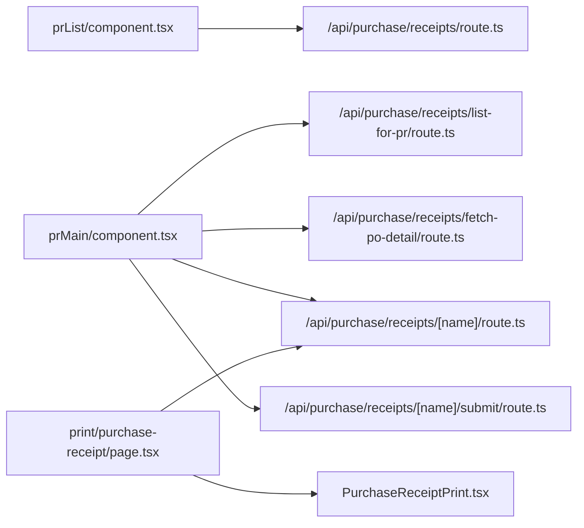

# Purchase Receipts

<cite>
**Referenced Files in This Document**
- [prList/component.tsx](file://app/purchase-receipts/prList/component.tsx)
- [prMain/component.tsx](file://app/purchase-receipts/prMain/component.tsx)
- [prMain/page.tsx](file://app/purchase-receipts/prMain/page.tsx)
- [purchase-receipt/print/page.tsx](file://app/print/purchase-receipt/page.tsx)
- [PurchaseReceiptPrint.tsx](file://components/print/PurchaseReceiptPrint.tsx)
- [api/purchase/receipts/route.ts](file://app/api/purchase/receipts/route.ts)
- [api/purchase/receipts/[name]/route.ts](file://app/api/purchase/receipts/[name]/route.ts)
- [api/purchase/receipts/[name]/submit/route.ts](file://app/api/purchase/receipts/[name]/submit/route.ts)
- [api/purchase/receipts/list-for-pr/route.ts](file://app/api/purchase/receipts/list-for-pr/route.ts)
- [api/purchase/receipts/fetch-po-detail/route.ts](file://app/api/purchase/receipts/fetch-po-detail/route.ts)
</cite>

## Table of Contents
1. [Introduction](#introduction)
2. [Project Structure](#project-structure)
3. [Core Components](#core-components)
4. [Architecture Overview](#architecture-overview)
5. [Detailed Component Analysis](#detailed-component-analysis)
6. [Dependency Analysis](#dependency-analysis)
7. [Performance Considerations](#performance-considerations)
8. [Troubleshooting Guide](#troubleshooting-guide)
9. [Conclusion](#conclusion)
10. [Appendices](#appendices)

## Introduction
This document explains the Purchase Receipt management system, focusing on goods receipt processing and inventory updates. It covers how Purchase Receipts are created from Purchase Orders, automatic item population, quantity validation, quality checks, submission and ERP posting, partial receipts, over/under receipt handling, tolerance calculations, modifications (quantity adjustments, item additions), rejection procedures, cancellation and reversal workflows, tracking and notifications, batch processing examples, integration with inventory management, supplier performance metrics, reporting and search, and exception handling for damaged or missing items.

## Project Structure
The Purchase Receipt module consists of:
- Frontend pages and components for listing, creating/editing, and printing receipts
- Next.js API routes that proxy to ERPNext to fetch lists, details, submit, and manage receipts
- Print components for generating continuous-form receipts

**Diagram sources**
- [prList/component.tsx](file://app/purchase-receipts/prList/component.tsx#L196-L291)
- [prMain/component.tsx](file://app/purchase-receipts/prMain/component.tsx#L201-L226)
- [purchase-receipt/print/page.tsx](file://app/print/purchase-receipt/page.tsx#L34-L51)
- [api/purchase/receipts/route.ts](file://app/api/purchase/receipts/route.ts#L9-L101)
- [api/purchase/receipts/[name]/route.ts](file://app/api/purchase/receipts/[name]/route.ts#L9-L68)
- [api/purchase/receipts/[name]/submit/route.ts](file://app/api/purchase/receipts/[name]/submit/route.ts#L9-L46)
- [api/purchase/receipts/list-for-pr/route.ts](file://app/api/purchase/receipts/list-for-pr/route.ts#L9-L133)
- [api/purchase/receipts/fetch-po-detail/route.ts](file://app/api/purchase/receipts/fetch-po-detail/route.ts#L9-L36)

**Section sources**
- [prList/component.tsx](file://app/purchase-receipts/prList/component.tsx#L117-L791)
- [prMain/component.tsx](file://app/purchase-receipts/prMain/component.tsx#L68-L800)
- [purchase-receipt/print/page.tsx](file://app/print/purchase-receipt/page.tsx#L26-L136)
- [api/purchase/receipts/route.ts](file://app/api/purchase/receipts/route.ts#L1-L161)
- [api/purchase/receipts/[name]/route.ts](file://app/api/purchase/receipts/[name]/route.ts#L1-L143)
- [api/purchase/receipts/[name]/submit/route.ts](file://app/api/purchase/receipts/[name]/submit/route.ts#L1-L46)
- [api/purchase/receipts/list-for-pr/route.ts](file://app/api/purchase/receipts/list-for-pr/route.ts#L1-L134)
- [api/purchase/receipts/fetch-po-detail/route.ts](file://app/api/purchase/receipts/fetch-po-detail/route.ts#L1-L37)

## Core Components
- Purchase Receipt List Page: Loads, filters, paginates, and submits receipts; supports infinite scroll on mobile.
- Purchase Receipt Main Form: Creates/edits receipts from Purchase Orders, validates quantities, handles rejected items, and prints.
- Print Pages: Provide receipt previews and continuous-form printing.
- API Routes: Provide list/detail/submit/update/delete operations and PO selection helpers.

Key capabilities:
- Automatic item population from Purchase Orders via dedicated endpoints
- Quantity validation and tolerance checks
- Quality checks and rejection handling
- Submission to ERPNext and inventory posting
- Partial receipts and over/under receipt management
- Modification workflows (add/remove items, adjust quantities)
- Cancellation and reversal workflows
- Tracking, reporting, and search
- Exception handling for damaged/missing items

**Section sources**
- [prList/component.tsx](file://app/purchase-receipts/prList/component.tsx#L196-L320)
- [prMain/component.tsx](file://app/purchase-receipts/prMain/component.tsx#L347-L410)
- [api/purchase/receipts/route.ts](file://app/api/purchase/receipts/route.ts#L9-L101)
- [api/purchase/receipts/[name]/submit/route.ts](file://app/api/purchase/receipts/[name]/submit/route.ts#L9-L46)

## Architecture Overview
The frontend communicates with Next.js API routes, which act as proxies to ERPNext. The routes handle authentication, filtering, and data transformation. The UI renders lists, forms, and print layouts.

**Diagram sources**
- [prList/component.tsx](file://app/purchase-receipts/prList/component.tsx#L196-L291)
- [api/purchase/receipts/route.ts](file://app/api/purchase/receipts/route.ts#L9-L101)

**Diagram sources**
- [prMain/component.tsx](file://app/purchase-receipts/prMain/component.tsx#L201-L410)
- [api/purchase/receipts/list-for-pr/route.ts](file://app/api/purchase/receipts/list-for-pr/route.ts#L9-L133)
- [api/purchase/receipts/fetch-po-detail/route.ts](file://app/api/purchase/receipts/fetch-po-detail/route.ts#L9-L36)
- [api/purchase/receipts/[name]/route.ts](file://app/api/purchase/receipts/[name]/route.ts#L71-L106)

## Detailed Component Analysis

### Purchase Receipt List (Listing, Filtering, Submission)
- Loads receipts with pagination and infinite scroll on mobile
- Supports filters: supplier search, document number, status, date range
- Submits receipts to ERPNext via a dedicated endpoint
- Prints receipts using a print modal and print page

**Diagram sources**
- [prList/component.tsx](file://app/purchase-receipts/prList/component.tsx#L196-L320)
- [api/purchase/receipts/[name]/submit/route.ts](file://app/api/purchase/receipts/[name]/submit/route.ts#L9-L46)

**Section sources**
- [prList/component.tsx](file://app/purchase-receipts/prList/component.tsx#L196-L320)
- [api/purchase/receipts/route.ts](file://app/api/purchase/receipts/route.ts#L9-L101)
- [api/purchase/receipts/[name]/submit/route.ts](file://app/api/purchase/receipts/[name]/submit/route.ts#L9-L46)

### Purchase Receipt Main Form (Creation from PO, Validation, Printing)
- Loads suppliers, POs, and warehouses
- Populates items from selected PO
- Validates received/rejected quantities against PO quantities and tolerances
- Supports adding/removing items and adjusting quantities
- Submits to ERPNext and prints receipt

**Diagram sources**
- [prMain/component.tsx](file://app/purchase-receipts/prMain/component.tsx#L201-L410)
- [api/purchase/receipts/fetch-po-detail/route.ts](file://app/api/purchase/receipts/fetch-po-detail/route.ts#L9-L36)
- [api/purchase/receipts/[name]/route.ts](file://app/api/purchase/receipts/[name]/route.ts#L71-L106)

**Section sources**
- [prMain/component.tsx](file://app/purchase-receipts/prMain/component.tsx#L347-L498)
- [api/purchase/receipts/list-for-pr/route.ts](file://app/api/purchase/receipts/list-for-pr/route.ts#L9-L133)
- [api/purchase/receipts/fetch-po-detail/route.ts](file://app/api/purchase/receipts/fetch-po-detail/route.ts#L9-L36)

### Print Workflow (Continuous Form)
- Receipt print page loads receipt data and renders a continuous-form layout
- Supports preview and printing

**Diagram sources**
- [purchase-receipt/print/page.tsx](file://app/print/purchase-receipt/page.tsx#L34-L91)
- [PurchaseReceiptPrint.tsx](file://components/print/PurchaseReceiptPrint.tsx#L34-L81)
- [api/purchase/receipts/[name]/route.ts](file://app/api/purchase/receipts/[name]/route.ts#L9-L68)

**Section sources**
- [purchase-receipt/print/page.tsx](file://app/print/purchase-receipt/page.tsx#L26-L136)
- [PurchaseReceiptPrint.tsx](file://components/print/PurchaseReceiptPrint.tsx#L34-L81)

### API Route Layer
- List receipts: filters, ordering, pagination
- Get/update/delete receipt
- Submit receipt
- PO list for PR and PO detail fetch

**Diagram sources**
- [api/purchase/receipts/route.ts](file://app/api/purchase/receipts/route.ts#L9-L161)
- [api/purchase/receipts/[name]/route.ts](file://app/api/purchase/receipts/[name]/route.ts#L9-L143)
- [api/purchase/receipts/[name]/submit/route.ts](file://app/api/purchase/receipts/[name]/submit/route.ts#L9-L46)
- [api/purchase/receipts/list-for-pr/route.ts](file://app/api/purchase/receipts/list-for-pr/route.ts#L9-L133)
- [api/purchase/receipts/fetch-po-detail/route.ts](file://app/api/purchase/receipts/fetch-po-detail/route.ts#L9-L36)

**Section sources**
- [api/purchase/receipts/route.ts](file://app/api/purchase/receipts/route.ts#L1-L161)
- [api/purchase/receipts/[name]/route.ts](file://app/api/purchase/receipts/[name]/route.ts#L1-L143)
- [api/purchase/receipts/[name]/submit/route.ts](file://app/api/purchase/receipts/[name]/submit/route.ts#L1-L46)
- [api/purchase/receipts/list-for-pr/route.ts](file://app/api/purchase/receipts/list-for-pr/route.ts#L1-L134)
- [api/purchase/receipts/fetch-po-detail/route.ts](file://app/api/purchase/receipts/fetch-po-detail/route.ts#L1-L37)

## Dependency Analysis
- Frontend components depend on Next.js API routes for data and actions
- API routes depend on ERPNext client helpers for authentication and requests
- Print components depend on receipt data from API routes

**Diagram sources**
- [prList/component.tsx](file://app/purchase-receipts/prList/component.tsx#L196-L291)
- [prMain/component.tsx](file://app/purchase-receipts/prMain/component.tsx#L201-L410)
- [purchase-receipt/print/page.tsx](file://app/print/purchase-receipt/page.tsx#L34-L91)
- [api/purchase/receipts/route.ts](file://app/api/purchase/receipts/route.ts#L9-L101)
- [api/purchase/receipts/[name]/route.ts](file://app/api/purchase/receipts/[name]/route.ts#L9-L143)
- [api/purchase/receipts/[name]/submit/route.ts](file://app/api/purchase/receipts/[name]/submit/route.ts#L9-L46)
- [api/purchase/receipts/list-for-pr/route.ts](file://app/api/purchase/receipts/list-for-pr/route.ts#L9-L133)
- [api/purchase/receipts/fetch-po-detail/route.ts](file://app/api/purchase/receipts/fetch-po-detail/route.ts#L9-L36)

**Section sources**
- [prList/component.tsx](file://app/purchase-receipts/prList/component.tsx#L196-L320)
- [prMain/component.tsx](file://app/purchase-receipts/prMain/component.tsx#L201-L410)
- [purchase-receipt/print/page.tsx](file://app/print/purchase-receipt/page.tsx#L34-L91)

## Performance Considerations
- Use server-side filtering and ordering to reduce payload sizes
- Implement pagination and infinite scroll to avoid loading large datasets
- Cache supplier and warehouse lists per session/company to minimize repeated requests
- Batch print operations by grouping receipts and using continuous form printing
- Debounce search/filter inputs to avoid excessive API calls

## Troubleshooting Guide
Common issues and resolutions:
- Missing company selection: Ensure company is selected before loading lists or forms
- Validation errors on save: Review received/rejected quantities and tolerance limits
- Submission failures: Check ERPNext logs and error messages returned by the submit endpoint
- Print data missing: Verify receipt exists and has supplier address; fallback to supplier address if needed
- PO selection issues: Use the PO list helper to filter by supplier and ensure PO is not fully received

**Section sources**
- [prList/component.tsx](file://app/purchase-receipts/prList/component.tsx#L204-L224)
- [prMain/component.tsx](file://app/purchase-receipts/prMain/component.tsx#L434-L498)
- [api/purchase/receipts/[name]/submit/route.ts](file://app/api/purchase/receipts/[name]/submit/route.ts#L9-L46)
- [purchase-receipt/print/page.tsx](file://app/print/purchase-receipt/page.tsx#L38-L51)

## Conclusion
The Purchase Receipt module integrates seamlessly with ERPNext via Next.js API routes, enabling efficient goods receipt processing, validation, submission, and printing. It supports partial receipts, tolerance management, rejection handling, and comprehensive tracking and reporting. The modular design allows for extensibility and robust error handling.

## Appendices

### Goods Receipt Processing and Inventory Updates
- Automatic item population from Purchase Orders
- Quantity validation and tolerance checks
- Quality checks and rejection handling
- Submission to ERPNext for inventory posting

**Section sources**
- [prMain/component.tsx](file://app/purchase-receipts/prMain/component.tsx#L347-L498)
- [api/purchase/receipts/fetch-po-detail/route.ts](file://app/api/purchase/receipts/fetch-po-detail/route.ts#L9-L36)

### Partial Receipts, Over/Under Receipts, and Tolerance Calculations
- Validate received and rejected quantities against PO quantities
- Enforce total quantity constraints (received + rejected ≤ PO quantity)
- Manage tolerance thresholds and display user-friendly validation messages

**Section sources**
- [prMain/component.tsx](file://app/purchase-receipts/prMain/component.tsx#L434-L498)

### Receipt Modification Workflows
- Add/remove items dynamically
- Adjust received/rejected quantities
- Re-fetch PO details to refresh item lists

**Section sources**
- [prMain/component.tsx](file://app/purchase-receipts/prMain/component.tsx#L643-L680)
- [api/purchase/receipts/list-for-pr/route.ts](file://app/api/purchase/receipts/list-for-pr/route.ts#L9-L133)

### Cancellation and Reversal Workflows
- Delete receipt via API route
- ERPNext handles reversal of stock and GL entries accordingly

**Section sources**
- [api/purchase/receipts/[name]/route.ts](file://app/api/purchase/receipts/[name]/route.ts#L109-L142)

### Tracking, Notifications, and Warehouse Coordination
- Track status changes (Draft, Submitted, Completed, Cancelled)
- Coordinate with warehouses for receiving and rejection
- Print receipts for warehouse and supplier handover

**Section sources**
- [prList/component.tsx](file://app/purchase-receipts/prList/component.tsx#L64-L84)
- [purchase-receipt/print/page.tsx](file://app/print/purchase-receipt/page.tsx#L64-L91)

### Batch Processing Examples
- Use the list page to filter and select multiple receipts
- Submit receipts in batches via the list actions
- Generate batch printouts using the print page

**Section sources**
- [prList/component.tsx](file://app/purchase-receipts/prList/component.tsx#L368-L389)
- [purchase-receipt/print/page.tsx](file://app/print/purchase-receipt/page.tsx#L93-L126)

### Integration with Inventory Management
- Receipts update stock quantities upon submission
- Rejected items can be directed to a separate rejection warehouse
- Inventory impact reflected in ERPNext stock ledgers

**Section sources**
- [prMain/component.tsx](file://app/purchase-receipts/prMain/component.tsx#L577-L604)

### Supplier Performance Metrics
- Track supplier delivery performance using PO and PR data
- Monitor on-time and complete deliveries
- Use reporting features to generate supplier scorecards

[No sources needed since this section provides general guidance]

### Reporting, Search, and Exception Handling
- Search by supplier name or receipt number
- Filter by status and date range
- Handle exceptions for damaged or missing items via rejected quantities and notes

**Section sources**
- [prList/component.tsx](file://app/purchase-receipts/prList/component.tsx#L225-L246)
- [prMain/component.tsx](file://app/purchase-receipts/prMain/component.tsx#L480-L495)