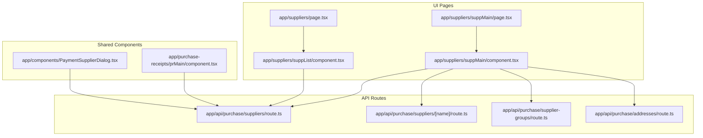
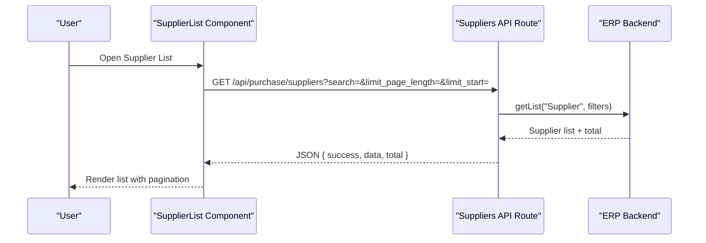
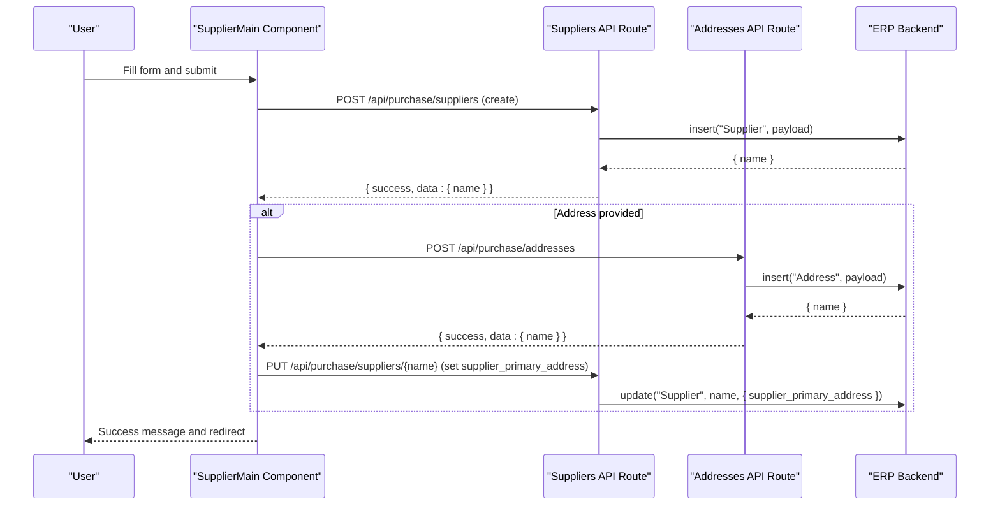
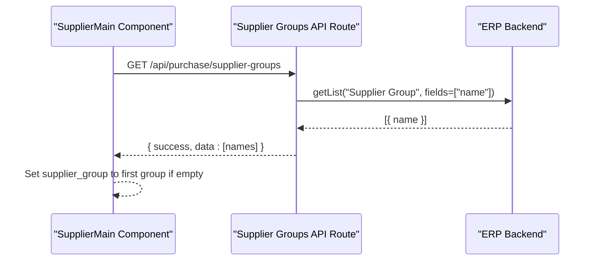
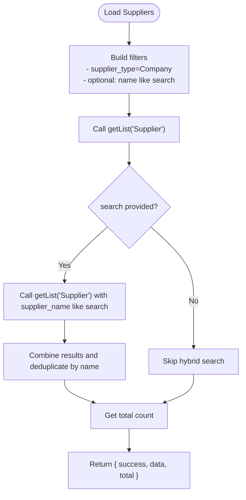
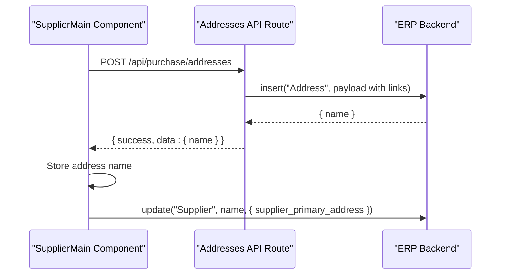
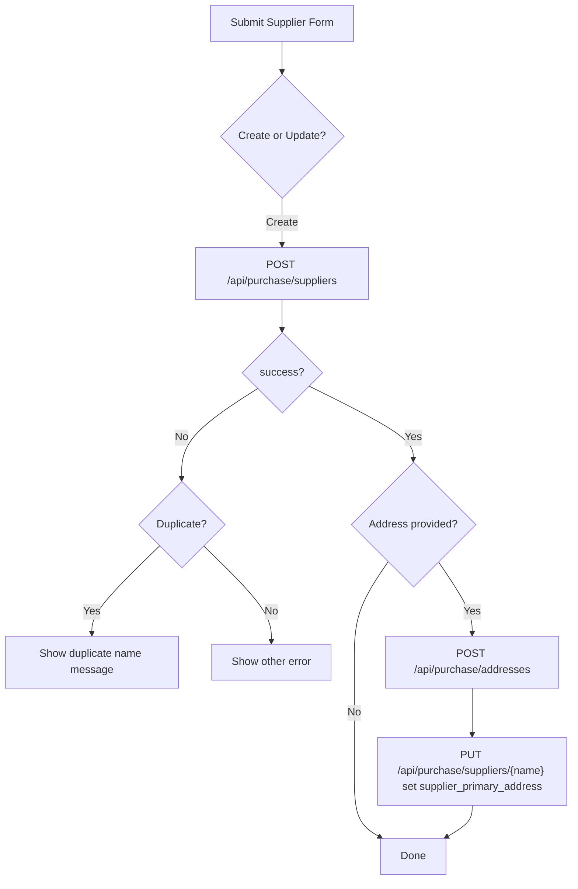
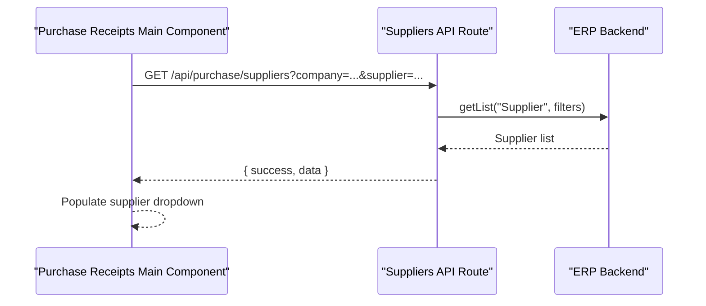
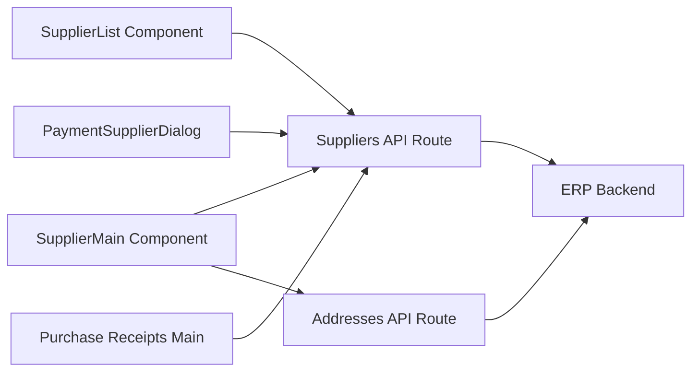

# Supplier Management

<cite>
**Referenced Files in This Document**
- [app/suppliers/page.tsx](file://app/suppliers/page.tsx)
- [app/suppliers/suppList/page.tsx](file://app/suppliers/suppList/page.tsx)
- [app/suppliers/suppList/component.tsx](file://app/suppliers/suppList/component.tsx)
- [app/suppliers/suppMain/page.tsx](file://app/suppliers/suppMain/page.tsx)
- [app/suppliers/suppMain/component.tsx](file://app/suppliers/suppMain/component.tsx)
- [app/api/purchase/suppliers/route.ts](file://app/api/purchase/suppliers/route.ts)
- [app/api/purchase/suppliers/[name]/route.ts](file://app/api/purchase/suppliers/[name]/route.ts)
- [app/api/purchase/supplier-groups/route.ts](file://app/api/purchase/supplier-groups/route.ts)
- [app/api/purchase/addresses/route.ts](file://app/api/purchase/addresses/route.ts)
- [app/components/PaymentSupplierDialog.tsx](file://app/components/PaymentSupplierDialog.tsx)
- [app/purchase-receipts/prMain/component.tsx](file://app/purchase-receipts/prMain/component.tsx)
- [tests/session-cookie-preservation.pbt.test.ts](file://tests/session-cookie-preservation.pbt.test.ts)
</cite>

## Table of Contents
1. [Introduction](#introduction)
2. [Project Structure](#project-structure)
3. [Core Components](#core-components)
4. [Architecture Overview](#architecture-overview)
5. [Detailed Component Analysis](#detailed-component-analysis)
6. [Dependency Analysis](#dependency-analysis)
7. [Performance Considerations](#performance-considerations)
8. [Troubleshooting Guide](#troubleshooting-guide)
9. [Conclusion](#conclusion)
10. [Appendices](#appendices)

## Introduction
This document describes the Supplier Management module in the ERP system. It covers supplier registration, profile maintenance, relationship management, supplier groups, search and filtering, address handling, validation and duplicate detection, and integration with purchase workflows. The goal is to provide both technical depth and practical guidance for onboarding, managing, and leveraging suppliers effectively.

## Project Structure
The Supplier Management feature is organized around a Next.js app with API routes and reusable UI components:
- UI pages and lists: supplier list and supplier creation/edit forms
- API routes: supplier listing/search, supplier detail/update, supplier group retrieval, and address creation
- Shared components: dialogs for selecting suppliers in purchase contexts
- Integration points: purchase receipts and purchase orders workflows

**Diagram sources**
- [app/suppliers/page.tsx](file://app/suppliers/page.tsx#L1-L7)
- [app/suppliers/suppList/page.tsx](file://app/suppliers/suppList/page.tsx#L1-L7)
- [app/suppliers/suppList/component.tsx](file://app/suppliers/suppList/component.tsx#L1-L301)
- [app/suppliers/suppMain/page.tsx](file://app/suppliers/suppMain/page.tsx#L1-L200)
- [app/suppliers/suppMain/component.tsx](file://app/suppliers/suppMain/component.tsx#L1-L419)
- [app/api/purchase/suppliers/route.ts](file://app/api/purchase/suppliers/route.ts#L1-L120)
- [app/api/purchase/suppliers/[name]/route.ts](file://app/api/purchase/suppliers/[name]/route.ts#L1-L95)
- [app/api/purchase/supplier-groups/route.ts](file://app/api/purchase/supplier-groups/route.ts#L1-L33)
- [app/api/purchase/addresses/route.ts](file://app/api/purchase/addresses/route.ts#L1-L55)
- [app/components/PaymentSupplierDialog.tsx](file://app/components/PaymentSupplierDialog.tsx#L1-L127)
- [app/purchase-receipts/prMain/component.tsx](file://app/purchase-receipts/prMain/component.tsx#L191-L231)

**Section sources**
- [app/suppliers/page.tsx](file://app/suppliers/page.tsx#L1-L7)
- [app/suppliers/suppList/page.tsx](file://app/suppliers/suppList/page.tsx#L1-L7)
- [app/suppliers/suppMain/page.tsx](file://app/suppliers/suppMain/page.tsx#L1-L200)

## Core Components
- Supplier List Page and Component: Provides paginated listing, search, and quick navigation to edit supplier records.
- Supplier Creation/Edit Form: Handles supplier creation and updates, including supplier group assignment, contact info, and primary address linkage.
- API Routes:
  - Supplier listing/search with hybrid search by name and supplier_name
  - Supplier detail retrieval and updates
  - Supplier group enumeration
  - Address creation linked to supplier
- Shared Supplier Dialog: Used in payment and purchase contexts to pick suppliers.
- Purchase Receipts Integration: Fetches suppliers for purchase receipt workflows.

**Section sources**
- [app/suppliers/suppList/component.tsx](file://app/suppliers/suppList/component.tsx#L35-L301)
- [app/suppliers/suppMain/component.tsx](file://app/suppliers/suppMain/component.tsx#L22-L419)
- [app/api/purchase/suppliers/route.ts](file://app/api/purchase/suppliers/route.ts#L9-L120)
- [app/api/purchase/suppliers/[name]/route.ts](file://app/api/purchase/suppliers/[name]/route.ts#L19-L95)
- [app/api/purchase/supplier-groups/route.ts](file://app/api/purchase/supplier-groups/route.ts#L11-L33)
- [app/api/purchase/addresses/route.ts](file://app/api/purchase/addresses/route.ts#L9-L55)
- [app/components/PaymentSupplierDialog.tsx](file://app/components/PaymentSupplierDialog.tsx#L17-L127)
- [app/purchase-receipts/prMain/component.tsx](file://app/purchase-receipts/prMain/component.tsx#L191-L231)

## Architecture Overview
The Supplier Management feature follows a layered architecture:
- UI Layer: Next.js pages and components for list and form
- API Layer: Next.js API routes that proxy to ERP backend
- Business Logic: ERP backend manages supplier records, supplier groups, and addresses
- Integration Layer: Purchase workflows consume supplier data

**Diagram sources**
- [app/suppliers/suppList/component.tsx](file://app/suppliers/suppList/component.tsx#L61-L108)
- [app/api/purchase/suppliers/route.ts](file://app/api/purchase/suppliers/route.ts#L9-L96)

## Detailed Component Analysis

### Supplier Registration and Profile Maintenance
Supplier registration and updates are handled in a single form with the following lifecycle:
- Load supplier groups from ERP
- On submit:
  - Create or update supplier record (excluding optional fields when empty)
  - Optionally create a primary address and link it to the supplier
  - Redirect to supplier list on success

Key behaviors:
- Mandatory fields: supplier_name, supplier_type, supplier_group, country, default_currency
- Optional fields: tax_id, mobile_no, email_id, supplier_primary_address, city
- Validation:
  - Duplicate supplier name triggers a user-friendly error
  - City is required when an address is provided
- Address linkage:
  - Address created separately and linked via supplier_primary_address

**Diagram sources**
- [app/suppliers/suppMain/component.tsx](file://app/suppliers/suppMain/component.tsx#L133-L240)
- [app/api/purchase/suppliers/route.ts](file://app/api/purchase/suppliers/route.ts#L98-L119)
- [app/api/purchase/addresses/route.ts](file://app/api/purchase/addresses/route.ts#L9-L55)

**Section sources**
- [app/suppliers/suppMain/component.tsx](file://app/suppliers/suppMain/component.tsx#L22-L419)
- [app/api/purchase/suppliers/route.ts](file://app/api/purchase/suppliers/route.ts#L98-L119)
- [app/api/purchase/addresses/route.ts](file://app/api/purchase/addresses/route.ts#L9-L55)

### Supplier Groups Functionality
Supplier groups are retrieved from ERP and presented in the form as a required dropdown. The system defaults to the first available group when creating a new supplier.

- Endpoint: GET /api/purchase/supplier-groups
- Behavior: Returns an array of group names; the form selects the first group if none is set during creation.

**Diagram sources**
- [app/suppliers/suppMain/component.tsx](file://app/suppliers/suppMain/component.tsx#L57-L83)
- [app/api/purchase/supplier-groups/route.ts](file://app/api/purchase/supplier-groups/route.ts#L11-L33)

**Section sources**
- [app/suppliers/suppMain/component.tsx](file://app/suppliers/suppMain/component.tsx#L57-L83)
- [app/api/purchase/supplier-groups/route.ts](file://app/api/purchase/supplier-groups/route.ts#L11-L33)

### Supplier Search and Filtering
The supplier list supports:
- Search by name (direct match)
- Hybrid search by supplier_name (when provided)
- Pagination via limit_page_length and limit_start
- Sorting by creation date (desc)

**Diagram sources**
- [app/api/purchase/suppliers/route.ts](file://app/api/purchase/suppliers/route.ts#L9-L96)

**Section sources**
- [app/suppliers/suppList/component.tsx](file://app/suppliers/suppList/component.tsx#L61-L108)
- [app/api/purchase/suppliers/route.ts](file://app/api/purchase/suppliers/route.ts#L9-L96)

### Supplier Addresses and Linkage
Primary address linkage is supported:
- If an address is provided, a new Address document is created and linked to the Supplier via supplier_primary_address
- City is mandatory when an address is provided
- Address creation supports both supplier and customer linkage

**Diagram sources**
- [app/suppliers/suppMain/component.tsx](file://app/suppliers/suppMain/component.tsx#L187-L230)
- [app/api/purchase/addresses/route.ts](file://app/api/purchase/addresses/route.ts#L9-L55)

**Section sources**
- [app/suppliers/suppMain/component.tsx](file://app/suppliers/suppMain/component.tsx#L187-L230)
- [app/api/purchase/addresses/route.ts](file://app/api/purchase/addresses/route.ts#L9-L55)

### Supplier Validation, Duplicate Detection, and Data Integrity
- Duplicate detection: The creation API route returns a structured error when a duplicate supplier name is detected; the UI surfaces a user-friendly message guiding the user to choose a different name or edit an existing supplier.
- Immutable fields protection: The supplier detail update route removes immutable fields before updating.
- Required fields enforcement: The form enforces required fields; the address flow requires city when an address is provided.

**Diagram sources**
- [app/suppliers/suppMain/component.tsx](file://app/suppliers/suppMain/component.tsx#L133-L240)
- [app/api/purchase/suppliers/route.ts](file://app/api/purchase/suppliers/route.ts#L98-L119)
- [app/api/purchase/suppliers/[name]/route.ts](file://app/api/purchase/suppliers/[name]/route.ts#L75-L83)

**Section sources**
- [app/suppliers/suppMain/component.tsx](file://app/suppliers/suppMain/component.tsx#L133-L240)
- [app/api/purchase/suppliers/[name]/route.ts](file://app/api/purchase/suppliers/[name]/route.ts#L75-L83)

### Integration with Purchase Workflows
- Supplier selection dialog: Used in payment and purchase contexts to pick suppliers.
- Purchase receipts workflow: Fetches suppliers filtered by company and optionally by supplier for purchase receipt creation.

**Diagram sources**
- [app/purchase-receipts/prMain/component.tsx](file://app/purchase-receipts/prMain/component.tsx#L191-L231)
- [app/api/purchase/suppliers/route.ts](file://app/api/purchase/suppliers/route.ts#L9-L96)

**Section sources**
- [app/components/PaymentSupplierDialog.tsx](file://app/components/PaymentSupplierDialog.tsx#L17-L127)
- [app/purchase-receipts/prMain/component.tsx](file://app/purchase-receipts/prMain/component.tsx#L191-L231)

## Dependency Analysis
- UI depends on API routes for data and mutations
- API routes depend on ERP client helpers for site-aware requests
- Supplier creation depends on address creation when a primary address is provided
- Supplier dialog and purchase receipts depend on supplier listing API

**Diagram sources**
- [app/suppliers/suppList/component.tsx](file://app/suppliers/suppList/component.tsx#L61-L108)
- [app/suppliers/suppMain/component.tsx](file://app/suppliers/suppMain/component.tsx#L133-L240)
- [app/api/purchase/suppliers/route.ts](file://app/api/purchase/suppliers/route.ts#L9-L120)
- [app/api/purchase/addresses/route.ts](file://app/api/purchase/addresses/route.ts#L9-L55)
- [app/components/PaymentSupplierDialog.tsx](file://app/components/PaymentSupplierDialog.tsx#L17-L127)
- [app/purchase-receipts/prMain/component.tsx](file://app/purchase-receipts/prMain/component.tsx#L191-L231)

**Section sources**
- [app/suppliers/suppList/component.tsx](file://app/suppliers/suppList/component.tsx#L61-L108)
- [app/suppliers/suppMain/component.tsx](file://app/suppliers/suppMain/component.tsx#L133-L240)
- [app/api/purchase/suppliers/route.ts](file://app/api/purchase/suppliers/route.ts#L9-L120)
- [app/api/purchase/addresses/route.ts](file://app/api/purchase/addresses/route.ts#L9-L55)
- [app/components/PaymentSupplierDialog.tsx](file://app/components/PaymentSupplierDialog.tsx#L17-L127)
- [app/purchase-receipts/prMain/component.tsx](file://app/purchase-receipts/prMain/component.tsx#L191-L231)

## Performance Considerations
- Pagination: The list uses limit_page_length and limit_start to avoid large payloads.
- Hybrid search: Combines two queries and deduplicates results; keep search terms concise to minimize overhead.
- Network efficiency: The form separates supplier creation from address creation to reduce round trips and handle partial failures gracefully.
- Session handling: Tests confirm GET operations preserve session cookies and query parameters consistently.

[No sources needed since this section provides general guidance]

## Troubleshooting Guide
Common issues and resolutions:
- Duplicate supplier name: The system detects duplicates during creation and displays a user-friendly message. Choose a unique supplier name or edit the existing record.
- Missing city when address is provided: The form requires city when an address is entered; ensure city is filled before submitting.
- Supplier not found by name: The detail route attempts direct lookup by name and falls back to supplier_name; if both fail, a 404 is returned.
- Session errors: Tests demonstrate GET endpoints preserve session cookies and behave predictably under various scenarios.

**Section sources**
- [app/suppliers/suppMain/component.tsx](file://app/suppliers/suppMain/component.tsx#L174-L183)
- [app/suppliers/suppMain/component.tsx](file://app/suppliers/suppMain/component.tsx#L190-L194)
- [app/api/purchase/suppliers/[name]/route.ts](file://app/api/purchase/suppliers/[name]/route.ts#L35-L72)
- [tests/session-cookie-preservation.pbt.test.ts](file://tests/session-cookie-preservation.pbt.test.ts#L205-L237)

## Conclusion
Supplier Management integrates a streamlined UI with robust API routes and ERP-backed data. It supports efficient onboarding, profile maintenance, group categorization, flexible search, and secure linkage of addresses. The design emphasizes user feedback, data integrity, and seamless integration with purchase workflows.

## Appendices

### Example Workflows
- Supplier Onboarding:
  - Navigate to the supplier list, click Add Supplier, fill in required fields, optionally add an address, and submit.
  - The system validates inputs, handles duplicates, and links the address if provided.
- Group-Based Pricing Strategy:
  - Assign suppliers to appropriate groups; downstream pricing logic can leverage supplier_group to apply tiered rates.
- Supplier Performance Tracking:
  - Use purchase documents (orders, receipts, invoices) to track supplier performance metrics; integrate supplier grouping for segment reporting.

[No sources needed since this section provides general guidance]