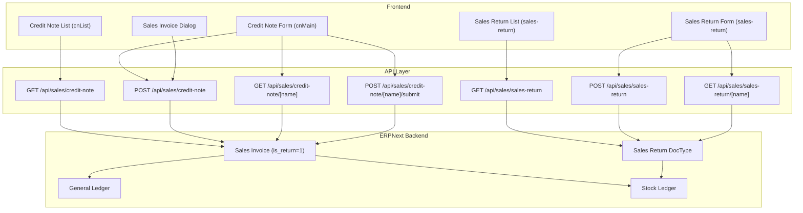
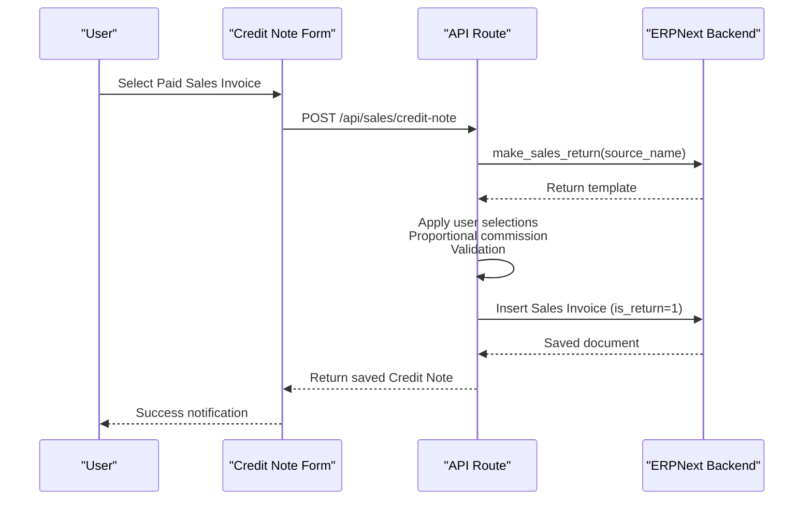
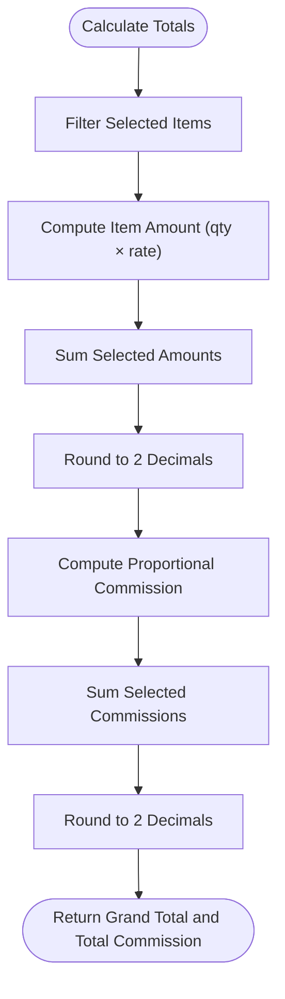
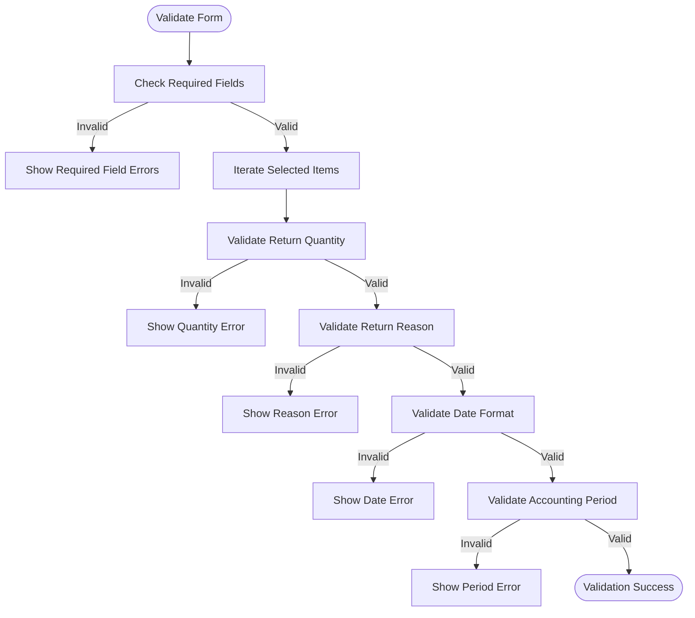
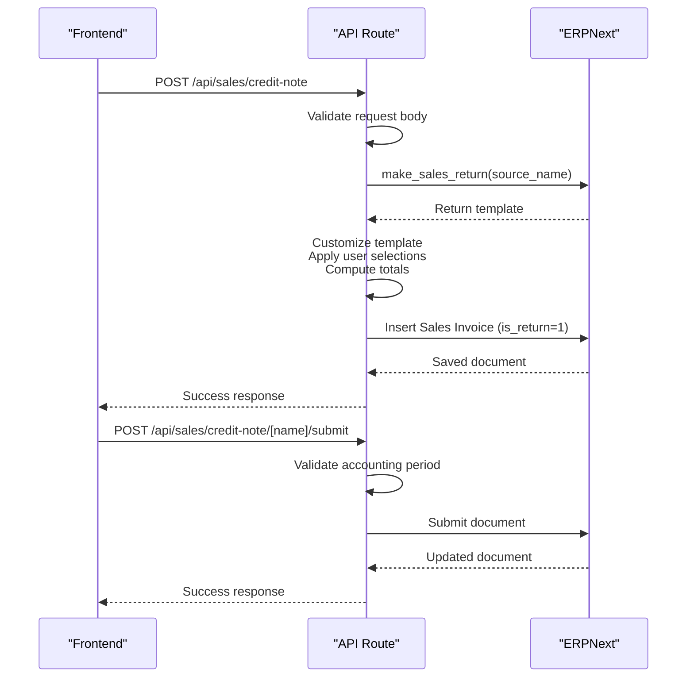
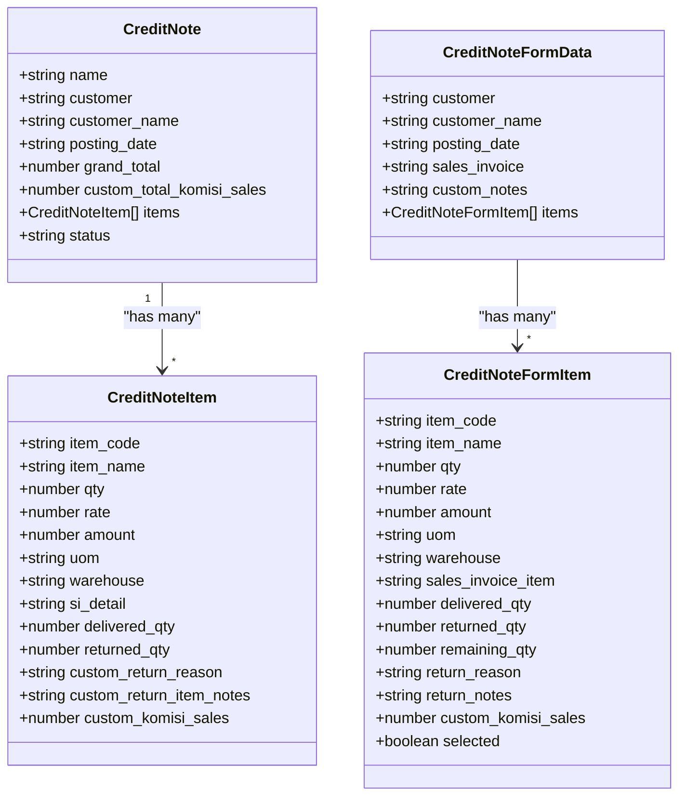
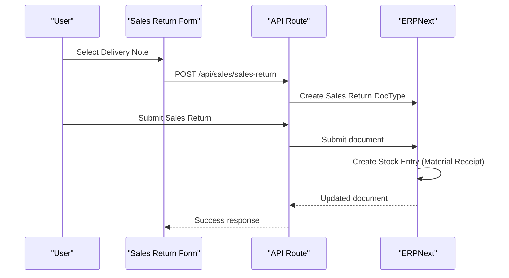
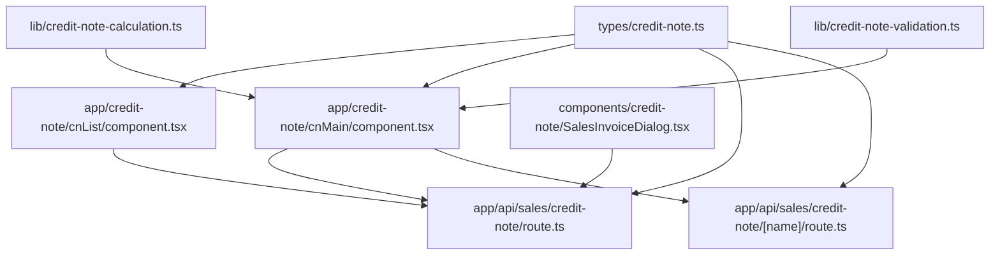

# Credit Notes and Sales Returns

<cite>
**Referenced Files in This Document**
- [credit-note-calculation.ts](file://lib/credit-note-calculation.ts)
- [credit-note-validation.ts](file://lib/credit-note-validation.ts)
- [credit-note.ts](file://types/credit-note.ts)
- [CREDIT_NOTE_INTEGRATION_TESTING.md](file://docs/credit-note/CREDIT_NOTE_INTEGRATION_TESTING.md)
- [SALES_RETURN_README.md](file://docs/sales-return/SALES_RETURN_README.md)
- [route.ts](file://app/api/sales/credit-note/route.ts)
- [route.ts](file://app/api/sales/credit-note/[name]/route.ts)
- [SalesInvoiceDialog.tsx](file://components/credit-note/SalesInvoiceDialog.tsx)
- [component.tsx](file://app/credit-note/cnList/component.tsx)
- [component.tsx](file://app/credit-note/cnMain/component.tsx)
- [design.md](file://.kiro/specs/credit-note-management/design.md)
- [requirements.md](file://.kiro/specs/credit-note-management/requirements.md)
- [design.md](file://.kiro/specs/sales-return-management/design.md)
- [requirements.md](file://.kiro/specs/sales-return-management/requirements.md)
- [route.ts](file://app/api/sales/sales-return/route.ts)
- [route.ts](file://app/api/sales/sales-return/[name]/route.ts)
</cite>

## Table of Contents
1. [Introduction](#introduction)
2. [Project Structure](#project-structure)
3. [Core Components](#core-components)
4. [Architecture Overview](#architecture-overview)
5. [Detailed Component Analysis](#detailed-component-analysis)
6. [Dependency Analysis](#dependency-analysis)
7. [Performance Considerations](#performance-considerations)
8. [Troubleshooting Guide](#troubleshooting-guide)
9. [Conclusion](#conclusion)
10. [Appendices](#appendices)

## Introduction
This document provides comprehensive coverage of credit note processing and sales return management within the ERPNext-based system. It explains customer refund workflows, including credit note creation for sales returns, item return processing, and refund calculations. It also covers credit note modification, partial returns, replacement handling, submission and cancellation workflows, inventory return processing, customer account adjustments, and integration with sales invoices, payment applications, and inventory returns. Additionally, it documents search, filtering, and status tracking capabilities, along with examples, analytics, return policy enforcement, inventory valuation impact, and customer satisfaction tracking.

## Project Structure
The system comprises:
- Frontend Next.js application with dedicated pages and components for credit notes and sales returns
- API routes that bridge to ERPNext backend for data persistence and business logic
- Shared libraries for calculations and validations
- Typescript interfaces for strong typing across frontend and backend
- Documentation and integration tests for quality assurance

**Diagram sources**
- [route.ts](file://app/api/sales/credit-note/route.ts#L32-L174)
- [route.ts](file://app/api/sales/credit-note/[name]/route.ts#L21-L107)
- [design.md](file://.kiro/specs/credit-note-management/design.md#L32-L50)
- [design.md](file://.kiro/specs/sales-return-management/design.md#L28-L67)

**Section sources**
- [route.ts](file://app/api/sales/credit-note/route.ts#L32-L174)
- [route.ts](file://app/api/sales/credit-note/[name]/route.ts#L21-L107)
- [design.md](file://.kiro/specs/credit-note-management/design.md#L32-L50)
- [design.md](file://.kiro/specs/sales-return-management/design.md#L28-L67)

## Core Components
- Credit Note calculation utilities: proportional commission, total value, remaining quantity, item amount
- Credit Note validation utilities: quantity validation, reason validation, required fields, date format conversion
- TypeScript interfaces: Credit Note, Sales Invoice, Credit Note Item, form data, request/response types
- API routes: list, create, detail, submit operations for credit notes
- UI components: Credit Note list with filters and actions, Credit Note form with invoice selection and validation, Sales Invoice selection dialog
- Sales return management: separate module for delivery note-based returns with similar validation and inventory integration

Key capabilities:
- Partial returns with remaining quantity tracking
- Proportional commission adjustments
- Accounting period validation
- Inventory and stock updates on submit/cancel
- GL entries for accounting
- Print and reporting integrations

**Section sources**
- [credit-note-calculation.ts](file://lib/credit-note-calculation.ts#L31-L160)
- [credit-note-validation.ts](file://lib/credit-note-validation.ts#L37-L284)
- [credit-note.ts](file://types/credit-note.ts#L25-L278)
- [route.ts](file://app/api/sales/credit-note/route.ts#L190-L439)
- [SalesInvoiceDialog.tsx](file://components/credit-note/SalesInvoiceDialog.tsx#L49-L140)
- [component.tsx](file://app/credit-note/cnList/component.tsx#L140-L225)
- [component.tsx](file://app/credit-note/cnMain/component.tsx#L44-L161)

## Architecture Overview
The system follows a hybrid architecture:
- Frontend Next.js handles user interactions, validation, and UI rendering
- API routes act as proxies to ERPNext, applying business rules and transformations
- ERPNext backend manages documents, workflows, inventory, and accounting

**Diagram sources**
- [route.ts](file://app/api/sales/credit-note/route.ts#L327-L400)
- [design.md](file://.kiro/specs/credit-note-management/design.md#L54-L63)

**Section sources**
- [route.ts](file://app/api/sales/credit-note/route.ts#L327-L400)
- [design.md](file://.kiro/specs/credit-note-management/design.md#L54-L63)

## Detailed Component Analysis

### Credit Note Calculation Engine
The calculation engine ensures accurate refund computations:
- Proportional commission: -(originalCommission × returnQty / originalQty)
- Total credit note value: sum of selected items (qty × rate)
- Remaining returnable quantity: delivered_qty - returned_qty
- Item amount: qty × rate with rounding to 2 decimals

**Diagram sources**
- [credit-note-calculation.ts](file://lib/credit-note-calculation.ts#L66-L76)
- [credit-note-calculation.ts](file://lib/credit-note-calculation.ts#L123-L141)

**Section sources**
- [credit-note-calculation.ts](file://lib/credit-note-calculation.ts#L31-L160)

### Credit Note Validation Pipeline
The validation pipeline enforces business rules:
- Required fields: customer, posting date, sales invoice, at least one selected item with qty > 0
- Return quantity validation: must be > 0 and ≤ remaining returnable quantity
- Return reason validation: required for each selected item; notes required when reason is "Other"
- Date format validation: DD/MM/YYYY with range checks
- Accounting period validation: posting date must fall within an open period

**Diagram sources**
- [credit-note-validation.ts](file://lib/credit-note-validation.ts#L121-L187)
- [credit-note-validation.ts](file://lib/credit-note-validation.ts#L37-L58)
- [credit-note-validation.ts](file://lib/credit-note-validation.ts#L79-L100)
- [credit-note-validation.ts](file://lib/credit-note-validation.ts#L202-L255)

**Section sources**
- [credit-note-validation.ts](file://lib/credit-note-validation.ts#L14-L284)

### Credit Note API Operations
The API layer implements CRUD operations with business logic:
- GET /api/sales/credit-note: list with filters, pagination, and status mapping
- POST /api/sales/credit-note: create from paid Sales Invoice, apply validations, compute totals, and save
- GET /api/sales/credit-note/[name]: retrieve detail with full child tables
- POST /api/sales/credit-note/[name]/submit: submit with accounting period checks

**Diagram sources**
- [route.ts](file://app/api/sales/credit-note/route.ts#L190-L439)
- [route.ts](file://app/api/sales/credit-note/[name]/route.ts#L21-L107)

**Section sources**
- [route.ts](file://app/api/sales/credit-note/route.ts#L32-L174)
- [route.ts](file://app/api/sales/credit-note/route.ts#L190-L439)
- [route.ts](file://app/api/sales/credit-note/[name]/route.ts#L21-L107)

### Credit Note User Interface
The UI provides:
- Credit Note list with filters (customer, document number, status, date range), pagination, and actions (submit, cancel, print)
- Credit Note form with Sales Invoice selection dialog, item selection with validation, return reasons, and totals computation
- Read-only views for submitted/cancelled documents

**Diagram sources**
- [credit-note.ts](file://types/credit-note.ts#L60-L97)
- [credit-note.ts](file://types/credit-note.ts#L25-L54)
- [credit-note.ts](file://types/credit-note.ts#L140-L153)
- [credit-note.ts](file://types/credit-note.ts#L103-L134)

**Section sources**
- [component.tsx](file://app/credit-note/cnList/component.tsx#L80-L225)
- [component.tsx](file://app/credit-note/cnMain/component.tsx#L44-L161)
- [SalesInvoiceDialog.tsx](file://components/credit-note/SalesInvoiceDialog.tsx#L31-L140)
- [credit-note.ts](file://types/credit-note.ts#L25-L278)

### Sales Return Management (Delivery Note-Based)
The sales return module complements credit notes by enabling returns against delivery notes:
- Return reasons: Damaged, Wrong Item, Quality Issue, Customer Request, Expired, Other
- Inventory updates on submit, stock entries for material receipt
- Validation hooks for quantity limits and reason requirements
- Separate API routes for list, create, detail, update, submit, and cancel

**Diagram sources**
- [design.md](file://.kiro/specs/sales-return-management/design.md#L96-L132)
- [requirements.md](file://.kiro/specs/sales-return-management/requirements.md#L47-L68)
- [route.ts](file://app/api/sales/sales-return/route.ts#L25-L36)

**Section sources**
- [design.md](file://.kiro/specs/sales-return-management/design.md#L96-L132)
- [requirements.md](file://.kiro/specs/sales-return-management/requirements.md#L47-L68)
- [route.ts](file://app/api/sales/sales-return/route.ts#L25-L36)
- [route.ts](file://app/api/sales/sales-return/[name]/route.ts#L41-L60)

## Dependency Analysis
The system exhibits clear separation of concerns:
- UI components depend on shared validation and calculation libraries
- API routes encapsulate business logic and integrate with ERPNext
- Types define contracts between frontend and backend
- Sales return module mirrors credit note architecture with distinct DocType

**Diagram sources**
- [credit-note-calculation.ts](file://lib/credit-note-calculation.ts#L1-L160)
- [credit-note-validation.ts](file://lib/credit-note-validation.ts#L1-L284)
- [credit-note.ts](file://types/credit-note.ts#L1-L278)
- [component.tsx](file://app/credit-note/cnList/component.tsx#L80-L225)
- [component.tsx](file://app/credit-note/cnMain/component.tsx#L44-L161)
- [SalesInvoiceDialog.tsx](file://components/credit-note/SalesInvoiceDialog.tsx#L31-L140)
- [route.ts](file://app/api/sales/credit-note/route.ts#L32-L174)
- [route.ts](file://app/api/sales/credit-note/[name]/route.ts#L21-L107)

**Section sources**
- [credit-note-calculation.ts](file://lib/credit-note-calculation.ts#L1-L160)
- [credit-note-validation.ts](file://lib/credit-note-validation.ts#L1-L284)
- [credit-note.ts](file://types/credit-note.ts#L1-L278)
- [component.tsx](file://app/credit-note/cnList/component.tsx#L80-L225)
- [component.tsx](file://app/credit-note/cnMain/component.tsx#L44-L161)
- [SalesInvoiceDialog.tsx](file://components/credit-note/SalesInvoiceDialog.tsx#L31-L140)
- [route.ts](file://app/api/sales/credit-note/route.ts#L32-L174)
- [route.ts](file://app/api/sales/credit-note/[name]/route.ts#L21-L107)

## Performance Considerations
- Client-side calculations minimize server load for totals and remaining quantities
- API routes batch validations and transformations before calling ERPNext
- Infinite scroll and pagination reduce memory usage for large lists
- Date conversions occur once per request to avoid repeated parsing
- Error handling short-circuits expensive operations when validation fails

## Troubleshooting Guide
Common issues and resolutions:
- Accounting period closed: Ensure posting date falls within an open period before submit
- Validation errors: Check required fields, return quantities, and reason requirements
- Network connectivity: API routes include robust error handling and user-friendly messages
- Commission adjustments: Verify server scripts are installed and active for commission recalculations
- Inventory updates: Confirm stock settings allow warehouse operations and sufficient permissions

**Section sources**
- [route.ts](file://app/api/sales/credit-note/route.ts#L294-L325)
- [credit-note-validation.ts](file://lib/credit-note-validation.ts#L202-L255)
- [CREDIT_NOTE_INTEGRATION_TESTING.md](file://docs/credit-note/CREDIT_NOTE_INTEGRATION_TESTING.md#L427-L442)

## Conclusion
The credit note and sales return management system provides a robust, validated, and integrated solution for customer refund workflows. It leverages ERPNext's native capabilities while offering a modern, user-friendly interface with comprehensive validation, partial return support, and detailed reporting. The architecture ensures scalability, maintainability, and compliance with business requirements.

## Appendices

### Credit Note Workflows and Examples
- Create Credit Note: Select paid Sales Invoice, choose items and quantities, fill return reasons, save as Draft
- Submit Credit Note: Validate accounting period, create GL entries, update returned quantities, apply proportional commission adjustments
- Cancel Credit Note: Reverse GL entries, restore returned quantities, revert commission adjustments
- Partial Returns: Track remaining quantities across multiple Credit Notes, enforce maximum return limits
- Replacement Handling: Use separate Sales Return module for delivery note-based returns with automatic inventory updates

**Section sources**
- [CREDIT_NOTE_INTEGRATION_TESTING.md](file://docs/credit-note/CREDIT_NOTE_INTEGRATION_TESTING.md#L76-L264)
- [CREDIT_NOTE_INTEGRATION_TESTING.md](file://docs/credit-note/CREDIT_NOTE_INTEGRATION_TESTING.md#L266-L424)
- [CREDIT_NOTE_INTEGRATION_TESTING.md](file://docs/credit-note/CREDIT_NOTE_INTEGRATION_TESTING.md#L621-L796)
- [SALES_RETURN_README.md](file://docs/sales-return/SALES_RETURN_README.md#L17-L58)

### Search, Filtering, and Status Tracking
- Credit Note list supports filtering by customer, document number, status, and date range
- Pagination controls and infinite scroll for efficient browsing
- Status badges indicate Draft, Submitted, or Cancelled states
- Print functionality with customer address resolution

**Section sources**
- [component.tsx](file://app/credit-note/cnList/component.tsx#L80-L225)
- [component.tsx](file://app/credit-note/cnList/component.tsx#L492-L547)

### Analytics and Reporting
- Credit Note reports: group by invoice, summarize return values, export to Excel
- Commission dashboards: track adjustments and net commission after Credit Notes
- Inventory valuation impact: stock ledger entries reflect returns and reversals
- Customer satisfaction tracking: return reasons and notes provide insights

**Section sources**
- [CREDIT_NOTE_INTEGRATION_TESTING.md](file://docs/credit-note/CREDIT_NOTE_INTEGRATION_TESTING.md#L780-L796)
- [design.md](file://.kiro/specs/credit-note-management/design.md#L323-L418)