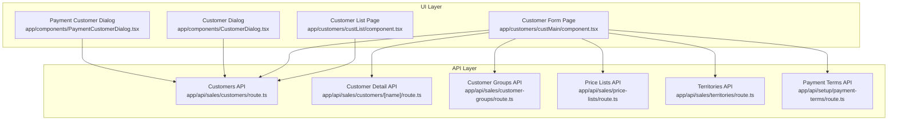
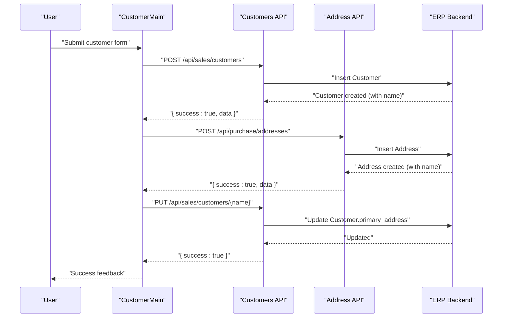
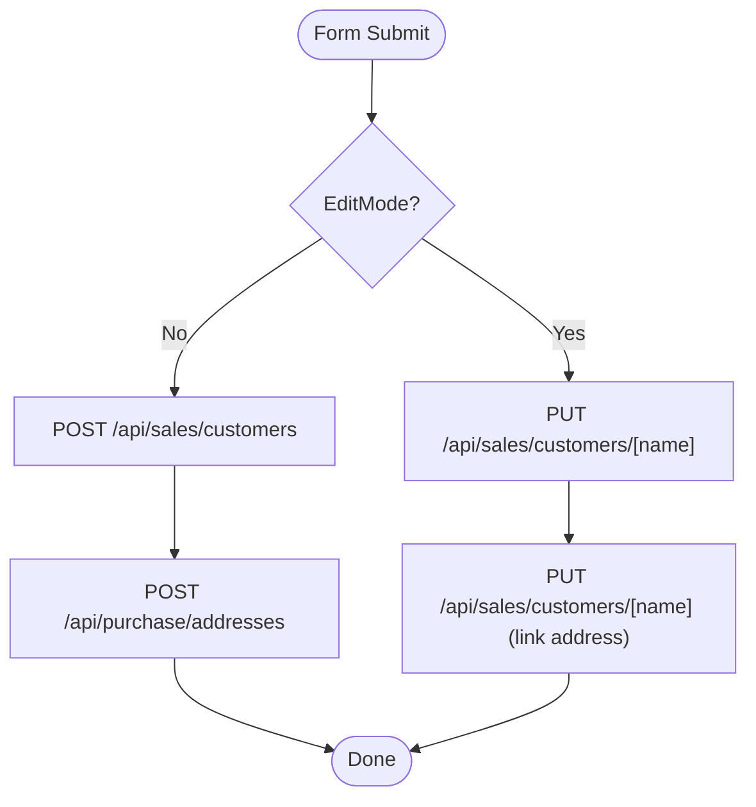
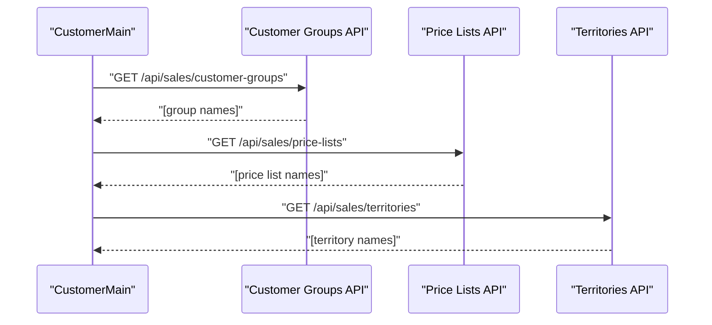
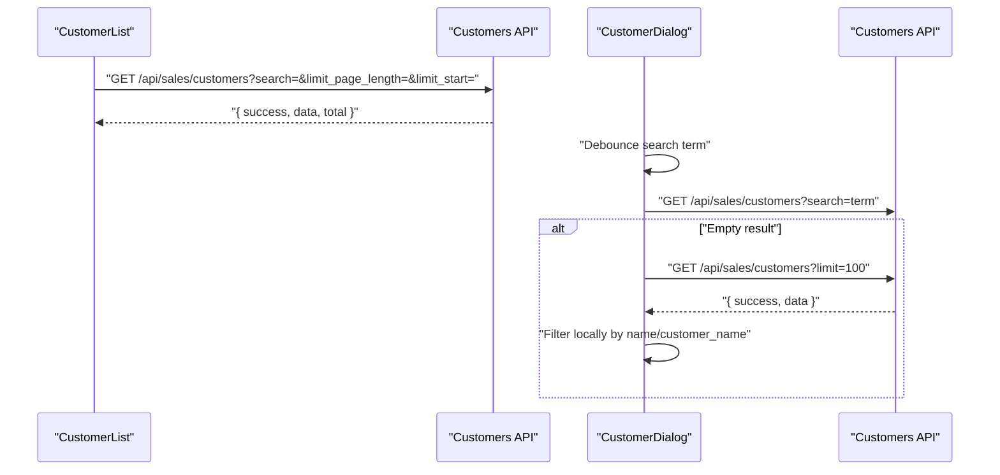
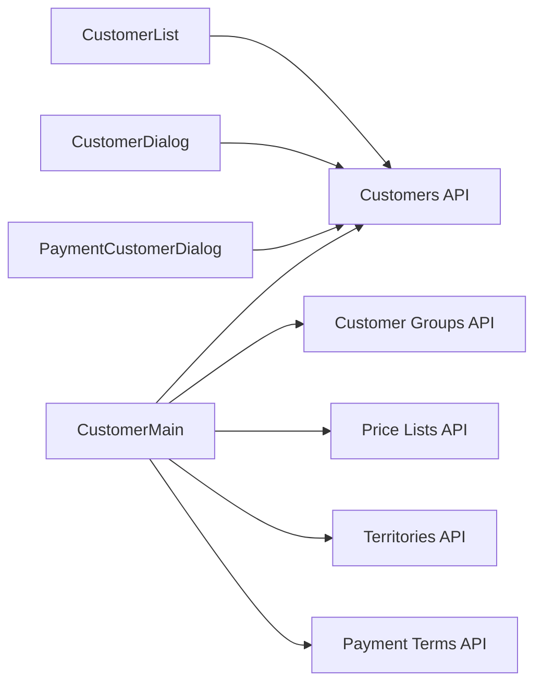

# Customer Management

<cite>
**Referenced Files in This Document**
- [app/api/sales/customers/route.ts](file://app/api/sales/customers/route.ts)
- [app/api/sales/customers/[name]/route.ts](file://app/api/sales/customers/[name]/route.ts)
- [app/api/sales/customer-groups/route.ts](file://app/api/sales/customer-groups/route.ts)
- [app/api/sales/price-lists/route.ts](file://app/api/sales/price-lists/route.ts)
- [app/api/sales/territories/route.ts](file://app/api/sales/territories/route.ts)
- [app/api/setup/payment-terms/route.ts](file://app/api/setup/payment-terms/route.ts)
- [app/components/CustomerDialog.tsx](file://app/components/CustomerDialog.tsx)
- [app/components/PaymentCustomerDialog.tsx](file://app/components/PaymentCustomerDialog.tsx)
- [app/customers/custMain/component.tsx](file://app/customers/custMain/component.tsx)
- [app/customers/custList/component.tsx](file://app/customers/custList/component.tsx)
</cite>

## Table of Contents
1. [Introduction](#introduction)
2. [Project Structure](#project-structure)
3. [Core Components](#core-components)
4. [Architecture Overview](#architecture-overview)
5. [Detailed Component Analysis](#detailed-component-analysis)
6. [Dependency Analysis](#dependency-analysis)
7. [Performance Considerations](#performance-considerations)
8. [Troubleshooting Guide](#troubleshooting-guide)
9. [Conclusion](#conclusion)
10. [Appendices](#appendices)

## Introduction
This document provides comprehensive documentation for customer management in the ERP system. It covers the customer lifecycle from creation to profile updates, contact information handling, segmentation via customer groups and territories, pricing strategies through price lists and payment terms, and operational features such as search, filtering, and lookup. It also outlines status-related controls, credit and payment terms integration, and best practices for validation, duplicate detection, and compliance.

## Project Structure
Customer management spans UI pages, shared dialogs, and backend API routes:
- UI pages: customer list and customer form
- Shared dialogs: customer selection and payment customer selection
- Backend APIs: customer CRUD, customer groups, price lists, territories, and payment terms

**Diagram sources**
- [app/customers/custList/component.tsx](file://app/customers/custList/component.tsx#L62-L89)
- [app/customers/custMain/component.tsx](file://app/customers/custMain/component.tsx#L74-L150)
- [app/components/CustomerDialog.tsx](file://app/components/CustomerDialog.tsx#L41-L113)
- [app/components/PaymentCustomerDialog.tsx](file://app/components/PaymentCustomerDialog.tsx#L43-L111)
- [app/api/sales/customers/route.ts](file://app/api/sales/customers/route.ts#L9-L54)
- [app/api/sales/customers/[name]/route.ts](file://app/api/sales/customers/[name]/route.ts#L84-L101)
- [app/api/sales/customer-groups/route.ts](file://app/api/sales/customer-groups/route.ts#L9-L28)
- [app/api/sales/price-lists/route.ts](file://app/api/sales/price-lists/route.ts#L9-L32)
- [app/api/sales/territories/route.ts](file://app/api/sales/territories/route.ts#L9-L30)
- [app/api/setup/payment-terms/route.ts](file://app/api/setup/payment-terms/route.ts#L10-L35)

**Section sources**
- [app/customers/custList/component.tsx](file://app/customers/custList/component.tsx#L1-L326)
- [app/customers/custMain/component.tsx](file://app/customers/custMain/component.tsx#L1-L548)
- [app/components/CustomerDialog.tsx](file://app/components/CustomerDialog.tsx#L1-L213)
- [app/components/PaymentCustomerDialog.tsx](file://app/components/PaymentCustomerDialog.tsx#L1-L111)
- [app/api/sales/customers/route.ts](file://app/api/sales/customers/route.ts#L1-L91)
- [app/api/sales/customers/[name]/route.ts](file://app/api/sales/customers/[name]/route.ts#L84-L101)
- [app/api/sales/customer-groups/route.ts](file://app/api/sales/customer-groups/route.ts#L1-L29)
- [app/api/sales/price-lists/route.ts](file://app/api/sales/price-lists/route.ts#L1-L33)
- [app/api/sales/territories/route.ts](file://app/api/sales/territories/route.ts#L1-L31)
- [app/api/setup/payment-terms/route.ts](file://app/api/setup/payment-terms/route.ts#L1-L59)

## Core Components
- Customer List Page: Loads paginated customer summaries, supports search, and navigates to edit/create.
- Customer Form Page: Handles customer creation/edit, validates required fields, creates and links a primary address, and integrates sales team assignment.
- Customer Dialog: Provides searchable lookup of customers with debounced search and fallback client-side filtering.
- Payment Customer Dialog: Similar to the customer dialog but scoped optionally by company.
- Customers API: Implements GET (list/search) and POST (create) with automatic naming series and sales team mapping.
- Customer Detail API: Implements PUT (update) with sales team normalization.
- Master Data APIs: Customer Groups, Price Lists, Territories, Payment Terms.

**Section sources**
- [app/customers/custList/component.tsx](file://app/customers/custList/component.tsx#L62-L89)
- [app/customers/custMain/component.tsx](file://app/customers/custMain/component.tsx#L202-L307)
- [app/components/CustomerDialog.tsx](file://app/components/CustomerDialog.tsx#L41-L113)
- [app/components/PaymentCustomerDialog.tsx](file://app/components/PaymentCustomerDialog.tsx#L43-L111)
- [app/api/sales/customers/route.ts](file://app/api/sales/customers/route.ts#L9-L91)
- [app/api/sales/customers/[name]/route.ts](file://app/api/sales/customers/[name]/route.ts#L84-L101)
- [app/api/sales/customer-groups/route.ts](file://app/api/sales/customer-groups/route.ts#L9-L28)
- [app/api/sales/price-lists/route.ts](file://app/api/sales/price-lists/route.ts#L9-L32)
- [app/api/sales/territories/route.ts](file://app/api/sales/territories/route.ts#L9-L30)
- [app/api/setup/payment-terms/route.ts](file://app/api/setup/payment-terms/route.ts#L10-L35)

## Architecture Overview
The customer management architecture follows a layered pattern:
- UI pages orchestrate data fetching and user actions.
- Shared dialogs encapsulate reusable search and selection logic.
- API routes delegate to a site-aware client to interact with the ERP backend.
- Master data endpoints supply dropdown options for groups, price lists, territories, and payment terms.

**Diagram sources**
- [app/customers/custMain/component.tsx](file://app/customers/custMain/component.tsx#L202-L307)
- [app/api/sales/customers/route.ts](file://app/api/sales/customers/route.ts#L56-L91)
- [app/api/sales/customers/[name]/route.ts](file://app/api/sales/customers/[name]/route.ts#L84-L101)

## Detailed Component Analysis

### Customer Creation and Profile Management
- Creation flow:
  - The form posts to the customers API, which removes the name and sets a naming series if missing.
  - If a sales person is provided, it is mapped to the sales team structure before insertion.
  - On success, the system creates a primary address and updates the customer record to link the address.
- Edit/update flow:
  - The form posts to the customer detail API, which normalizes sales person to sales team and updates the record.

**Diagram sources**
- [app/customers/custMain/component.tsx](file://app/customers/custMain/component.tsx#L202-L307)
- [app/api/sales/customers/route.ts](file://app/api/sales/customers/route.ts#L56-L91)
- [app/api/sales/customers/[name]/route.ts](file://app/api/sales/customers/[name]/route.ts#L84-L101)

**Section sources**
- [app/customers/custMain/component.tsx](file://app/customers/custMain/component.tsx#L202-L307)
- [app/api/sales/customers/route.ts](file://app/api/sales/customers/route.ts#L56-L91)
- [app/api/sales/customers/[name]/route.ts](file://app/api/sales/customers/[name]/route.ts#L84-L101)

### Contact Information Handling
- The form collects customer name, type, group, territory, tax ID, mobile number, email, default currency, default price list, country, city, and primary address.
- Required validation ensures that if an address is provided, city must also be present.
- Contact details are stored on the customer record; optional fields are conditionally removed before submission.

**Section sources**
- [app/customers/custMain/component.tsx](file://app/customers/custMain/component.tsx#L50-L64)
- [app/customers/custMain/component.tsx](file://app/customers/custMain/component.tsx#L250-L260)

### Customer Groups, Pricing, and Territories
- Customer Groups: Dropdown populated from the customer groups API.
- Price Lists: Dropdown populated from the price lists API (selling price lists only).
- Territories: Dropdown populated from the territories API.
- These are used for segmentation and pricing strategies during customer creation and updates.

**Diagram sources**
- [app/customers/custMain/component.tsx](file://app/customers/custMain/component.tsx#L74-L150)
- [app/api/sales/customer-groups/route.ts](file://app/api/sales/customer-groups/route.ts#L9-L28)
- [app/api/sales/price-lists/route.ts](file://app/api/sales/price-lists/route.ts#L9-L32)
- [app/api/sales/territories/route.ts](file://app/api/sales/territories/route.ts#L9-L30)

**Section sources**
- [app/api/sales/customer-groups/route.ts](file://app/api/sales/customer-groups/route.ts#L9-L28)
- [app/api/sales/price-lists/route.ts](file://app/api/sales/price-lists/route.ts#L9-L32)
- [app/api/sales/territories/route.ts](file://app/api/sales/territories/route.ts#L9-L30)

### Payment Terms and Credit Controls
- Payment Terms Template: The payment terms API retrieves templates and supports creation, cached for performance.
- Credit limits and payment terms are managed via payment terms templates and can be associated with customer records to control invoicing and receivables policies.

**Section sources**
- [app/api/setup/payment-terms/route.ts](file://app/api/setup/payment-terms/route.ts#L10-L35)

### Customer Search, Filtering, and Lookup
- Customer List Page:
  - Paginates customer summaries with configurable page size and supports search by customer name or ID.
  - Maintains URL state for page and search term.
- Customer Dialog:
  - Debounces search input and falls back to client-side filtering if server-side search yields no results.
  - Supports selecting a customer to trigger parent logic.
- Payment Customer Dialog:
  - Similar to the customer dialog with optional company scoping.

**Diagram sources**
- [app/customers/custList/component.tsx](file://app/customers/custList/component.tsx#L62-L89)
- [app/components/CustomerDialog.tsx](file://app/components/CustomerDialog.tsx#L41-L113)

**Section sources**
- [app/customers/custList/component.tsx](file://app/customers/custList/component.tsx#L62-L89)
- [app/components/CustomerDialog.tsx](file://app/components/CustomerDialog.tsx#L41-L113)
- [app/components/PaymentCustomerDialog.tsx](file://app/components/PaymentCustomerDialog.tsx#L43-L111)

### Status Management, Credit Limits, and Payment Terms
- Status management:
  - The customer record supports standard ERP status transitions (e.g., submit, cancel, update) via the underlying client.
- Credit limits and payment terms:
  - Payment terms templates define due dates and discount policies; these can be applied to customer records to enforce payment terms during transactions.

**Section sources**
- [app/api/sales/customers/[name]/route.ts](file://app/api/sales/customers/[name]/route.ts#L84-L101)
- [app/api/setup/payment-terms/route.ts](file://app/api/setup/payment-terms/route.ts#L10-L35)

### Communication Features, History Tracking, and Relationship Management
- Communication features:
  - Email and mobile number fields enable basic contact communication.
- History tracking:
  - The system tracks creation and modification timestamps via the ERP backend; UI surfaces creation ordering in lists.
- Relationship management:
  - Sales team assignment is supported through the sales team structure; sales persons can be selected via the sales person dialog.

**Section sources**
- [app/customers/custMain/component.tsx](file://app/customers/custMain/component.tsx#L473-L492)
- [app/api/sales/customers/route.ts](file://app/api/sales/customers/route.ts#L71-L80)

### Examples
- Customer onboarding:
  - Create a customer with group, territory, default price list, and primary address; the system auto-links the address to the customer.
- Profile update:
  - Edit customer details, including contact info and sales team; the system normalizes sales person to sales team.
- Group assignment:
  - Select a customer group and/or territory from dropdowns populated by master data APIs.

**Section sources**
- [app/customers/custMain/component.tsx](file://app/customers/custMain/component.tsx#L202-L307)
- [app/api/sales/customers/route.ts](file://app/api/sales/customers/route.ts#L71-L80)

### Data Validation, Duplicate Detection, and Compliance
- Required field validation:
  - Address requires city when provided; prevents incomplete records.
- Naming and uniqueness:
  - Customer naming series is enforced on creation; ERP backend enforces uniqueness constraints.
- Compliance:
  - Tax ID (e.g., NPWP) is optional; ensure compliance with local regulations by configuring required fields per jurisdiction.
- Error handling:
  - API routes wrap errors with site-aware responses and logging; UI displays user-friendly messages.

**Section sources**
- [app/customers/custMain/component.tsx](file://app/customers/custMain/component.tsx#L250-L260)
- [app/api/sales/customers/route.ts](file://app/api/sales/customers/route.ts#L65-L70)
- [app/api/sales/customers/route.ts](file://app/api/sales/customers/route.ts#L84-L89)

## Dependency Analysis
- UI depends on:
  - Customer List and Form pages depend on the customers API for listing/searching and CRUD operations.
  - Dialogs depend on the customers API for lookup and optionally on company-scoped queries.
- API dependencies:
  - All customer APIs use a site-aware client to communicate with the ERP backend.
  - Master data APIs supply dropdown options for groups, price lists, and territories.
  - Payment terms API caches templates to reduce repeated backend calls.

**Diagram sources**
- [app/customers/custMain/component.tsx](file://app/customers/custMain/component.tsx#L74-L150)
- [app/customers/custList/component.tsx](file://app/customers/custList/component.tsx#L62-L89)
- [app/components/CustomerDialog.tsx](file://app/components/CustomerDialog.tsx#L41-L113)
- [app/components/PaymentCustomerDialog.tsx](file://app/components/PaymentCustomerDialog.tsx#L43-L111)
- [app/api/sales/customers/route.ts](file://app/api/sales/customers/route.ts#L9-L54)
- [app/api/sales/customer-groups/route.ts](file://app/api/sales/customer-groups/route.ts#L9-L28)
- [app/api/sales/price-lists/route.ts](file://app/api/sales/price-lists/route.ts#L9-L32)
- [app/api/sales/territories/route.ts](file://app/api/sales/territories/route.ts#L9-L30)
- [app/api/setup/payment-terms/route.ts](file://app/api/setup/payment-terms/route.ts#L10-L35)

**Section sources**
- [app/customers/custMain/component.tsx](file://app/customers/custMain/component.tsx#L74-L150)
- [app/customers/custList/component.tsx](file://app/customers/custList/component.tsx#L62-L89)
- [app/components/CustomerDialog.tsx](file://app/components/CustomerDialog.tsx#L41-L113)
- [app/components/PaymentCustomerDialog.tsx](file://app/components/PaymentCustomerDialog.tsx#L43-L111)
- [app/api/sales/customers/route.ts](file://app/api/sales/customers/route.ts#L9-L54)
- [app/api/sales/customer-groups/route.ts](file://app/api/sales/customer-groups/route.ts#L9-L28)
- [app/api/sales/price-lists/route.ts](file://app/api/sales/price-lists/route.ts#L9-L32)
- [app/api/sales/territories/route.ts](file://app/api/sales/territories/route.ts#L9-L30)
- [app/api/setup/payment-terms/route.ts](file://app/api/setup/payment-terms/route.ts#L10-L35)

## Performance Considerations
- Debounced search in dialogs reduces network requests and improves responsiveness.
- Client-side fallback filtering ensures usability when server-side search is empty.
- Master data caching for payment terms reduces repeated backend calls.
- Pagination in the customer list minimizes payload sizes and improves load times.

[No sources needed since this section provides general guidance]

## Troubleshooting Guide
- Customer creation fails:
  - Verify required address and city fields; ensure naming series is configured.
- Address linking fails:
  - Confirm address creation succeeds before updating the customer’s primary address.
- Search returns empty:
  - Use the fallback client-side filtering path; verify server-side search parameters.
- Payment terms not applied:
  - Ensure the selected payment terms template is valid and associated with the customer.

**Section sources**
- [app/customers/custMain/component.tsx](file://app/customers/custMain/component.tsx#L250-L307)
- [app/components/CustomerDialog.tsx](file://app/components/CustomerDialog.tsx#L71-L91)
- [app/api/setup/payment-terms/route.ts](file://app/api/setup/payment-terms/route.ts#L49-L50)

## Conclusion
The customer management module provides a robust foundation for end-to-end customer lifecycle operations. It integrates search, segmentation, pricing, and payment controls while maintaining clear separation between UI, dialogs, and backend APIs. By leveraging master data APIs and site-aware client patterns, the system remains extensible and maintainable.

[No sources needed since this section summarizes without analyzing specific files]

## Appendices
- Example workflows:
  - Onboarding: Create customer → Create primary address → Link address to customer.
  - Update profile: Edit customer details → Normalize sales person to sales team → Save.
  - Assign group/territory: Select from dropdowns supplied by master data APIs.

[No sources needed since this section provides general guidance]