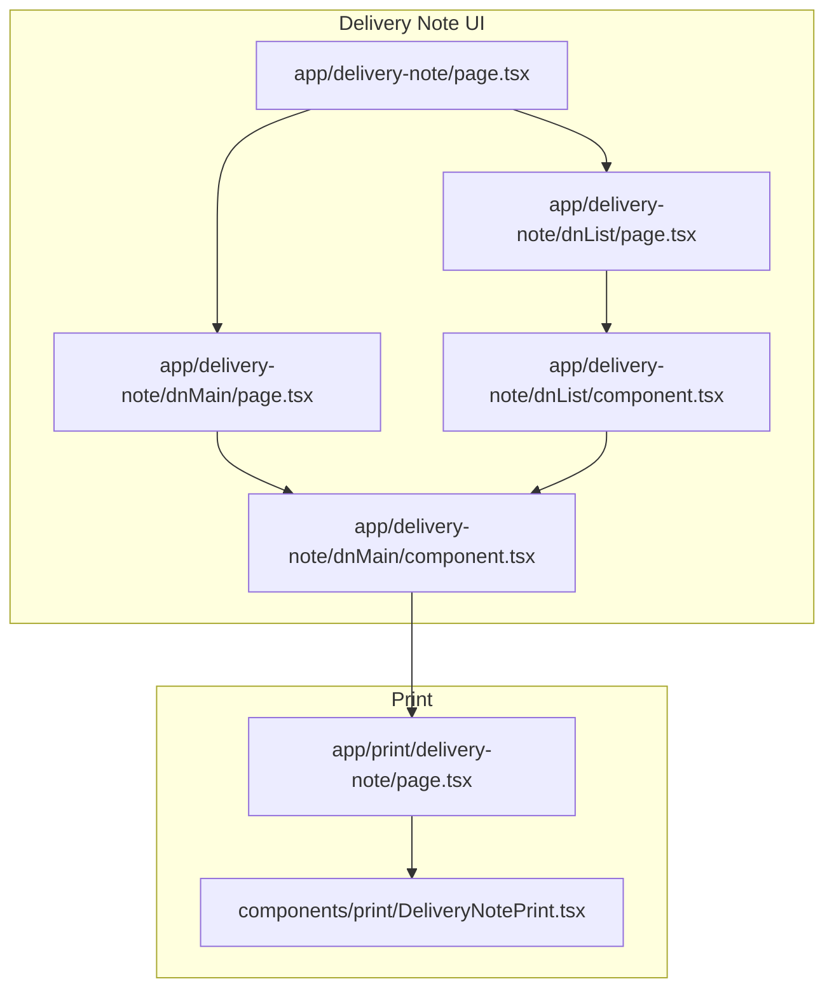
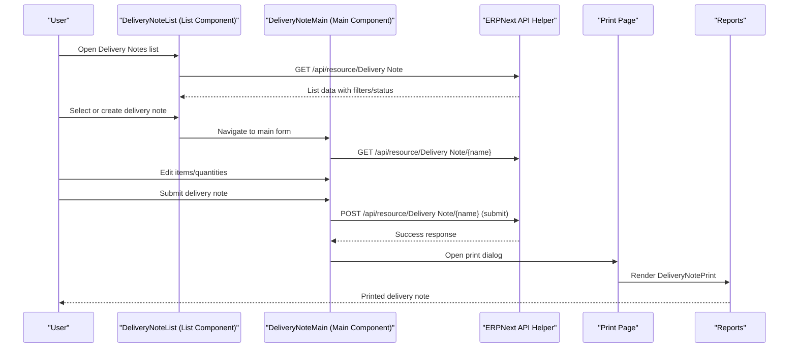
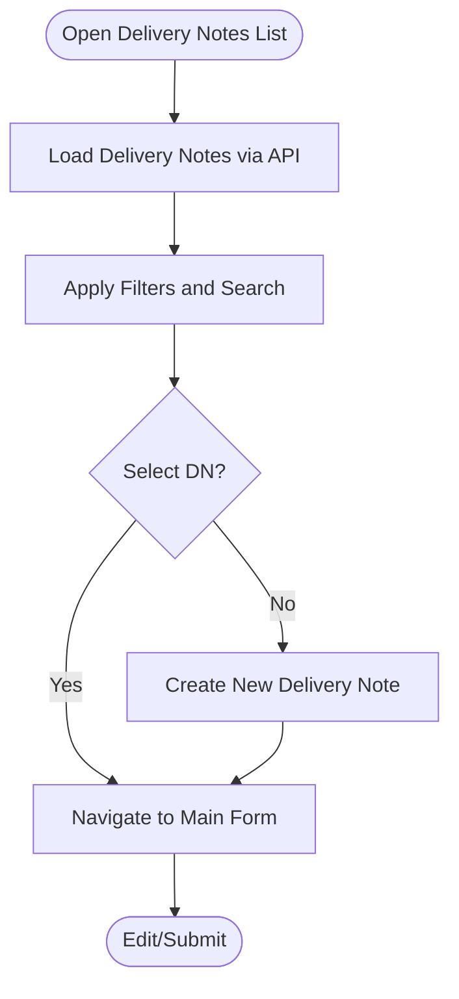
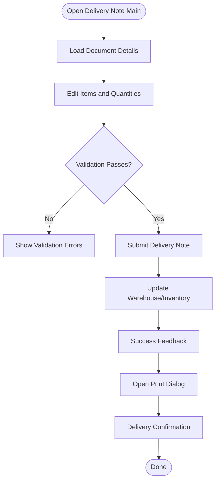
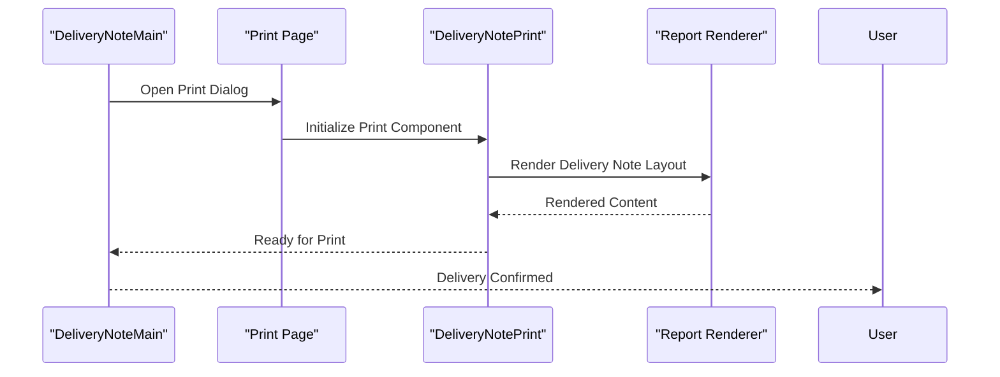
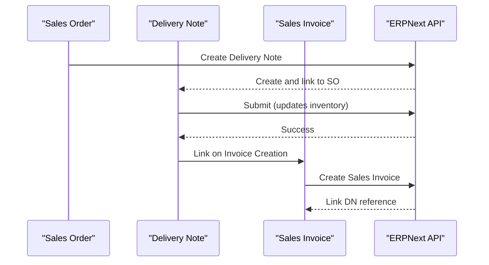
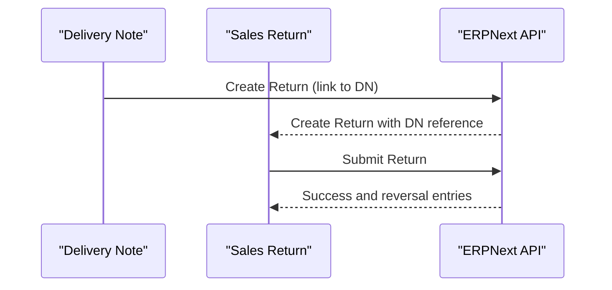
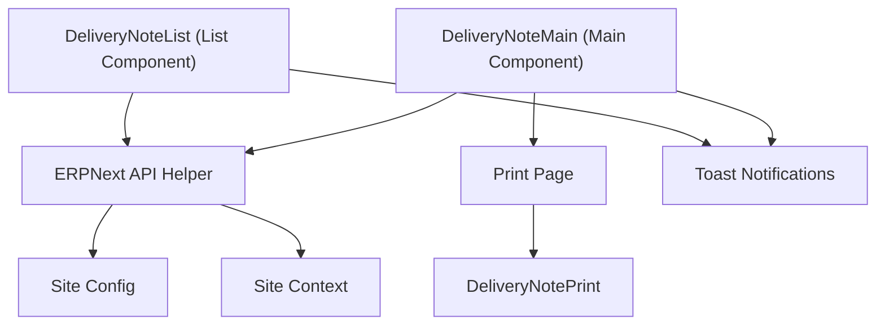

# Delivery Notes

<cite>
**Referenced Files in This Document**
- [page.tsx](file://app/delivery-note/page.tsx)
- [page.tsx](file://app/delivery-note/dnList/page.tsx)
- [component.tsx](file://app/delivery-note/dnList/component.tsx)
- [page.tsx](file://app/delivery-note/dnMain/page.tsx)
- [component.tsx](file://app/delivery-note/dnMain/component.tsx)
- [page.tsx](file://app/print/delivery-note/page.tsx)
- [DeliveryNotePrint.tsx](file://components/print/DeliveryNotePrint.tsx)
- [sales-invoice-cache-update-integration.test.ts](file://__tests__/sales-invoice-cache-update-integration.test.ts)
- [sales-return-api.test.ts](file://__tests__/sales-return-api.test.ts)
- [sales-return-ui.test.ts](file://__tests__/sales-return-ui.test.ts)
- [api-routes-diagnostic-functionality.pbt.test.ts](file://__tests__/api-routes-diagnostic-functionality.pbt.test.ts)
- [erpnext.ts](file://lib/erpnext.ts)
- [erpnext-api-helper.ts](file://utils/erpnext-api-helper.ts)
- [site-context.tsx](file://lib/site-context.tsx)
- [site-config.ts](file://lib/site-config.ts)
- [toast-context.tsx](file://lib/toast-context.tsx)
- [ToastContainer.tsx](file://components/ToastContainer.tsx)
</cite>

## Table of Contents
1. [Introduction](#introduction)
2. [Project Structure](#project-structure)
3. [Core Components](#core-components)
4. [Architecture Overview](#architecture-overview)
5. [Detailed Component Analysis](#detailed-component-analysis)
6. [Dependency Analysis](#dependency-analysis)
7. [Performance Considerations](#performance-considerations)
8. [Troubleshooting Guide](#troubleshooting-guide)
9. [Conclusion](#conclusion)
10. [Appendices](#appendices)

## Introduction
This document provides comprehensive documentation for delivery note management within the ERPNext system. It covers the end-to-end lifecycle of delivery notes: creation from sales orders, item picking and quantity verification, modification and partial deliveries, submission and integration with warehouse/inventory systems, cancellation and return processing, printing and delivery confirmation, and integration with sales orders and customer delivery tracking. It also outlines search, filtering, status management, scheduling, route optimization, and delivery performance metrics.

## Project Structure
The delivery note feature is implemented as a Next.js application with React client components, organized under the app/delivery-note directory. The UI is composed of:
- A list page for browsing and filtering delivery notes
- A main form page for viewing, editing, and submitting delivery notes
- Print functionality integrated with a dedicated print page and a reusable print component

**Diagram sources**
- [page.tsx](file://app/delivery-note/page.tsx#L1-L7)
- [page.tsx](file://app/delivery-note/dnList/page.tsx#L1-L7)
- [component.tsx](file://app/delivery-note/dnList/component.tsx#L400-L500)
- [page.tsx](file://app/delivery-note/dnMain/page.tsx#L1-L13)
- [component.tsx](file://app/delivery-note/dnMain/component.tsx#L440-L510)
- [page.tsx](file://app/print/delivery-note/page.tsx#L1-L20)
- [DeliveryNotePrint.tsx](file://components/print/DeliveryNotePrint.tsx#L1-L200)

**Section sources**
- [page.tsx](file://app/delivery-note/page.tsx#L1-L7)
- [page.tsx](file://app/delivery-note/dnList/page.tsx#L1-L7)
- [page.tsx](file://app/delivery-note/dnMain/page.tsx#L1-L13)

## Core Components
- List Page and List Component: Provide search, filtering, and status management for delivery notes, with navigation to the main form.
- Main Form Component: Handles creation/editing, item picking, quantity verification, submission, cancellation, and return linkage.
- Print Page and Print Component: Support delivery note printing and delivery confirmation.

Key responsibilities:
- Data retrieval and mutation via the ERPNext API helper
- Navigation between list and form views
- Integration with sales order and sales invoice workflows
- Return processing and linkage to delivery notes
- Print and confirmation workflows

**Section sources**
- [component.tsx](file://app/delivery-note/dnList/component.tsx#L400-L500)
- [component.tsx](file://app/delivery-note/dnMain/component.tsx#L440-L510)
- [page.tsx](file://app/print/delivery-note/page.tsx#L1-L20)
- [DeliveryNotePrint.tsx](file://components/print/DeliveryNotePrint.tsx#L1-L200)

## Architecture Overview
The delivery note UI integrates with the ERPNext backend through a typed API helper. The main flow involves:
- Loading delivery notes from the server
- Editing and validating items and quantities
- Submitting the document to trigger warehouse/inventory updates
- Printing and confirming delivery
- Linking returns and sales invoices

**Diagram sources**
- [component.tsx](file://app/delivery-note/dnList/component.tsx#L400-L500)
- [component.tsx](file://app/delivery-note/dnMain/component.tsx#L440-L510)
- [erpnext-api-helper.ts](file://utils/erpnext-api-helper.ts#L1-L200)
- [page.tsx](file://app/print/delivery-note/page.tsx#L1-L20)
- [DeliveryNotePrint.tsx](file://components/print/DeliveryNotePrint.tsx#L1-L200)

## Detailed Component Analysis

### Delivery Note List View
Responsibilities:
- Load and display delivery notes with search and filter controls
- Apply status filters and navigate to the main form
- Trigger creation of new delivery notes

Implementation highlights:
- Navigation to main form using router.push with optional name parameter
- Integration with toast notifications for feedback

**Diagram sources**
- [component.tsx](file://app/delivery-note/dnList/component.tsx#L400-L500)
- [component.tsx](file://app/delivery-note/dnList/component.tsx#L470-L510)

**Section sources**
- [component.tsx](file://app/delivery-note/dnList/component.tsx#L400-L500)
- [component.tsx](file://app/delivery-note/dnList/component.tsx#L470-L510)

### Delivery Note Main Form
Responsibilities:
- Display and edit delivery note header and items
- Validate item picking and quantities
- Submit delivery note to update warehouse/inventory
- Cancel delivery note when permitted
- Link returns and connect to sales invoices
- Print and confirm delivery

Processing logic:
- Retrieve document details on load
- Validate required fields and quantities
- Submit triggers backend workflow and inventory adjustments
- Cancellation follows system rules and reversals
- Return linkage ensures traceability from delivery to returns

**Diagram sources**
- [component.tsx](file://app/delivery-note/dnMain/component.tsx#L440-L510)
- [component.tsx](file://app/delivery-note/dnMain/component.tsx#L820-L880)

**Section sources**
- [component.tsx](file://app/delivery-note/dnMain/component.tsx#L440-L510)
- [component.tsx](file://app/delivery-note/dnMain/component.tsx#L820-L880)

### Print and Delivery Confirmation
Responsibilities:
- Render printable delivery note layouts
- Provide delivery confirmation steps
- Integrate with print system and report rendering

**Diagram sources**
- [page.tsx](file://app/print/delivery-note/page.tsx#L1-L20)
- [DeliveryNotePrint.tsx](file://components/print/DeliveryNotePrint.tsx#L1-L200)

**Section sources**
- [page.tsx](file://app/print/delivery-note/page.tsx#L1-L20)
- [DeliveryNotePrint.tsx](file://components/print/DeliveryNotePrint.tsx#L1-L200)

### Integration with Sales Orders and Sales Invoices
- Delivery notes are created from sales orders and linked to sales invoices upon invoicing.
- Tests demonstrate cross-module integration ensuring correct references and status updates.

**Diagram sources**
- [sales-invoice-cache-update-integration.test.ts](file://__tests__/sales-invoice-cache-update-integration.test.ts#L390-L470)

**Section sources**
- [sales-invoice-cache-update-integration.test.ts](file://__tests__/sales-invoice-cache-update-integration.test.ts#L390-L470)

### Return Processing Linked to Delivery Notes
- Returns can be linked to existing delivery notes, enabling traceability and reversal workflows.
- Tests validate return linkage and data retrieval for delivery notes.

**Diagram sources**
- [sales-return-api.test.ts](file://__tests__/sales-return-api.test.ts#L60-L70)
- [sales-return-ui.test.ts](file://__tests__/sales-return-ui.test.ts#L314-L346)

**Section sources**
- [sales-return-api.test.ts](file://__tests__/sales-return-api.test.ts#L60-L70)
- [sales-return-ui.test.ts](file://__tests__/sales-return-ui.test.ts#L314-L346)

### Delivery Note Diagnostics and Backend Validation
- Diagnostic tests verify presence and correctness of delivery note doctypes and items in the backend.
- Ensures system readiness and proper schema for delivery note operations.

**Section sources**
- [api-routes-diagnostic-functionality.pbt.test.ts](file://__tests__/api-routes-diagnostic-functionality.pbt.test.ts#L40-L100)
- [api-routes-diagnostic-functionality.pbt.test.ts](file://__tests__/api-routes-diagnostic-functionality.pbt.test.ts#L580-L600)

## Dependency Analysis
The delivery note feature depends on:
- ERPNext API helper for resource operations
- Site context and configuration for multi-site environments
- Toast notifications for user feedback
- Print system for delivery note rendering

**Diagram sources**
- [component.tsx](file://app/delivery-note/dnList/component.tsx#L400-L500)
- [component.tsx](file://app/delivery-note/dnMain/component.tsx#L440-L510)
- [erpnext-api-helper.ts](file://utils/erpnext-api-helper.ts#L1-L200)
- [site-config.ts](file://lib/site-config.ts#L1-L200)
- [site-context.tsx](file://lib/site-context.tsx#L1-L200)
- [ToastContainer.tsx](file://components/ToastContainer.tsx#L1-L200)
- [page.tsx](file://app/print/delivery-note/page.tsx#L1-L20)
- [DeliveryNotePrint.tsx](file://components/print/DeliveryNotePrint.tsx#L1-L200)

**Section sources**
- [erpnext.ts](file://lib/erpnext.ts#L1-L200)
- [erpnext-api-helper.ts](file://utils/erpnext-api-helper.ts#L1-L200)
- [site-context.tsx](file://lib/site-context.tsx#L1-L200)
- [site-config.ts](file://lib/site-config.ts#L1-L200)
- [toast-context.tsx](file://lib/toast-context.tsx#L1-L200)
- [ToastContainer.tsx](file://components/ToastContainer.tsx#L1-L200)

## Performance Considerations
- Use filtered queries on the list page to reduce payload sizes.
- Debounce search inputs to minimize frequent API calls.
- Batch submit operations where possible to reduce network overhead.
- Cache frequently accessed delivery note metadata locally to improve responsiveness.

## Troubleshooting Guide
Common issues and resolutions:
- API connectivity errors: Verify site configuration and authentication context.
- Document not found: Ensure correct delivery note name and permissions.
- Submission failures: Check validation rules and required fields.
- Print rendering issues: Confirm print layout and report renderer availability.

Supporting components:
- Site configuration and context helpers
- Toast container for user feedback
- API helper for robust error handling

**Section sources**
- [site-config.ts](file://lib/site-config.ts#L1-L200)
- [site-context.tsx](file://lib/site-context.tsx#L1-L200)
- [toast-context.tsx](file://lib/toast-context.tsx#L1-L200)
- [ToastContainer.tsx](file://components/ToastContainer.tsx#L1-L200)
- [erpnext-api-helper.ts](file://utils/erpnext-api-helper.ts#L1-L200)

## Conclusion
The delivery note management system integrates tightly with sales orders, sales invoices, and returns, while providing robust list/search capabilities, form-based editing, submission, printing, and confirmation. The modular UI components and typed API integration enable reliable operations across warehouse/inventory updates, return processing, and customer delivery tracking.

## Appendices

### Delivery Operations Examples
- Creating a delivery note from a sales order and submitting it to update inventory
- Editing items and quantities, then resubmitting
- Partial delivery note submission and linking to sales invoices
- Printing delivery notes and confirming delivery

### Return Processing Example
- Linking a sales return to an existing delivery note and verifying data retrieval

### Delivery Analytics and Reporting
- Use built-in reports to track delivery performance, status, and fulfillment metrics
- Export lists and reports for further analysis

### Delivery Scheduling, Route Optimization, and Performance Metrics
- Integrate scheduling and routing at the sales order level
- Track delivery performance using delivery note status and reporting dashboards