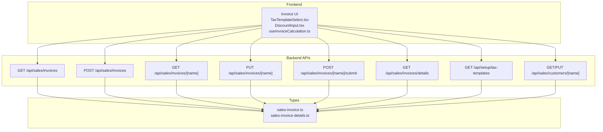
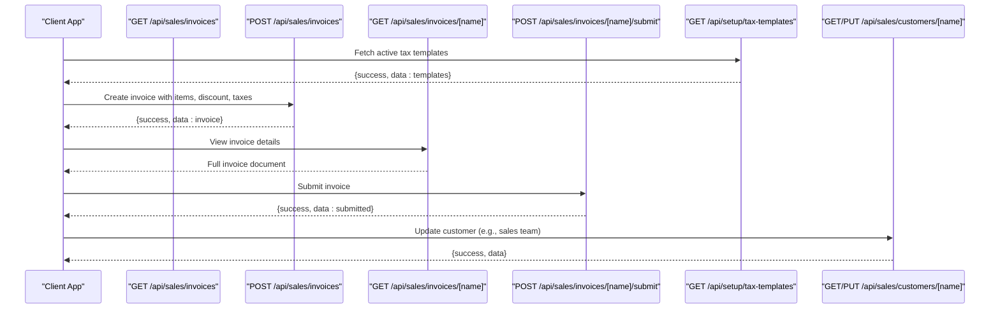
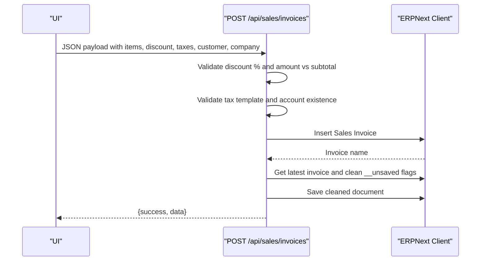
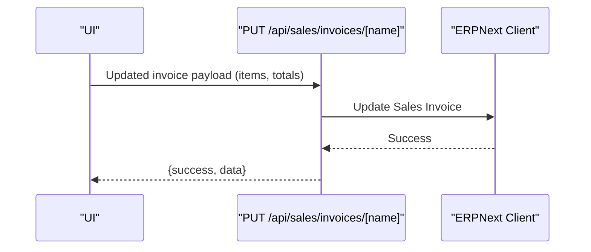
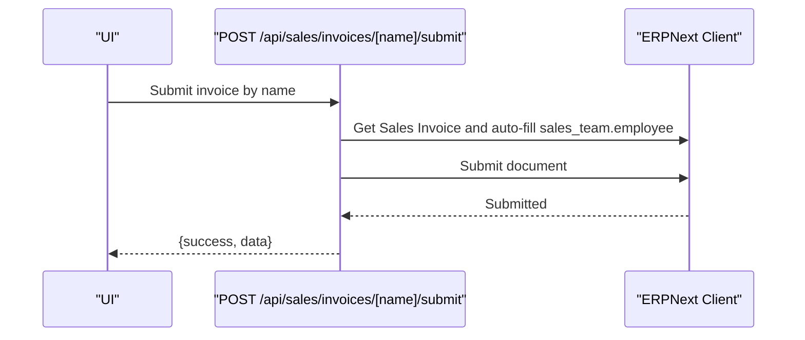
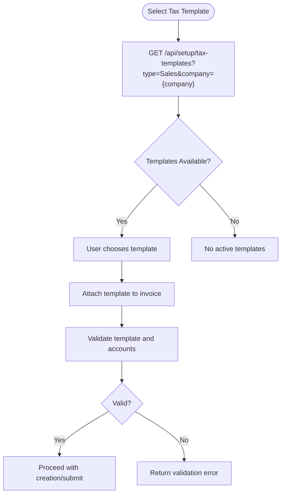
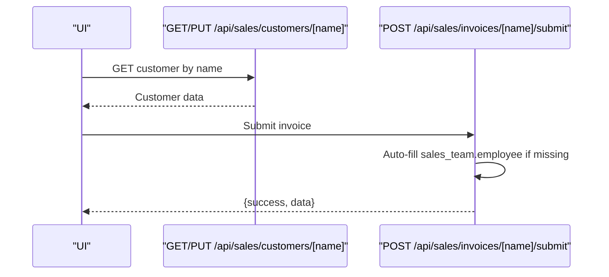
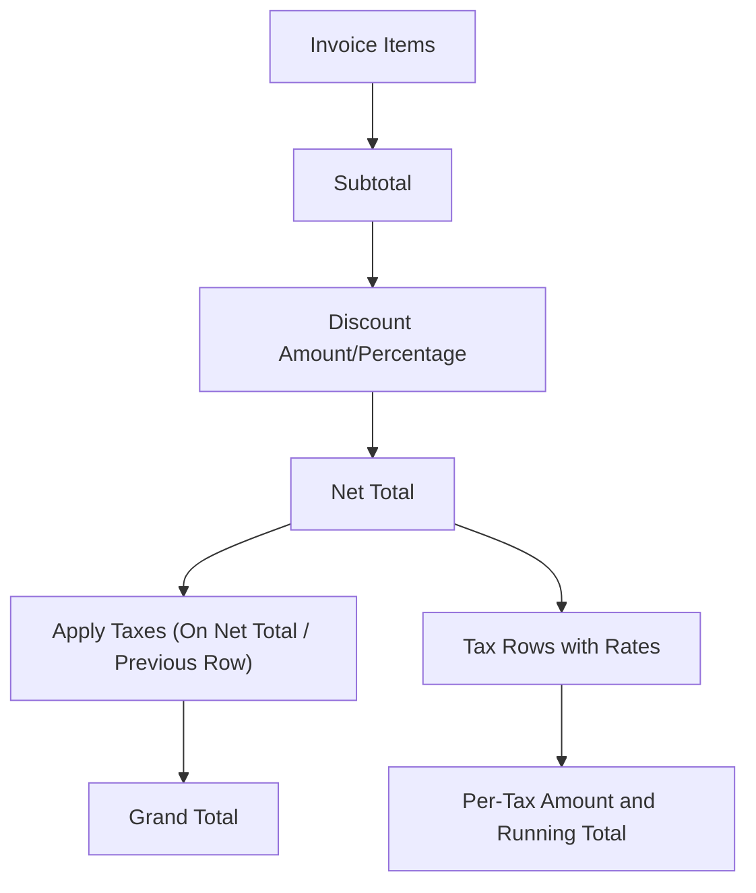
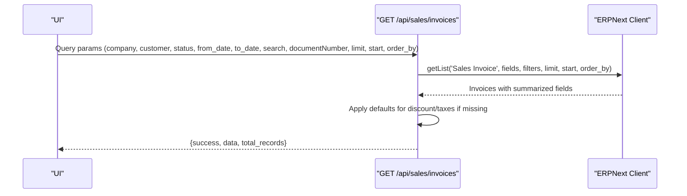
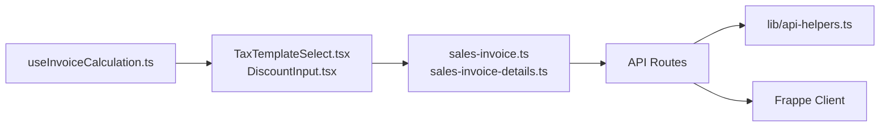

# Sales Invoices

<cite>
**Referenced Files in This Document**
- [sales-invoice.ts](file://types/sales-invoice.ts)
- [sales-invoice-details.ts](file://types/sales-invoice-details.ts)
- [route.ts](file://app/api/sales/invoices/route.ts)
- [route.ts](file://app/api/sales/invoices/[name]/route.ts)
- [route.ts](file://app/api/sales/invoices/[name]/submit/route.ts)
- [route.ts](file://app/api/sales/invoices/details/route.ts)
- [route.ts](file://app/api/setup/tax-templates/route.ts)
- [route.ts](file://app/api/sales/customers/[name]/route.ts)
- [TaxTemplateSelect.tsx](file://components/invoice/TaxTemplateSelect.tsx)
- [DiscountInput.tsx](file://components/invoice/DiscountInput.tsx)
- [useInvoiceCalculation.ts](file://hooks/useInvoiceCalculation.ts)
- [sales-invoice-api-integration.test.ts](file://tests/sales-invoice-api-integration.test.ts)
- [sales-invoice-api-validation.test.ts](file://tests/sales-invoice-api-validation.test.ts)
- [sales-invoice-cache-update-integration.test.ts](file://__tests__/sales-invoice-cache-update-integration.test.ts)
- [sales-invoice-not-saved-status-bug-exploration.pbt.test.ts](file://__tests__/sales-invoice-not-saved-status-bug-exploration.pbt.test.ts)
- [sales-invoice-preservation.pbt.test.ts](file://__tests__/sales-invoice-preservation.pbt.test.ts)
- [invoice-list-preservation.pbt.test.ts](file://__tests__/invoice-list-preservation.pbt.test.ts)
- [invoice-list-status-and-refresh-bug-exploration.pbt.test.ts](file://__tests__/invoice-list-status-and-refresh-bug-exploration.pbt.test.ts)
- [BUG_SUMMARY_SALES_INVOICE_NOT_SAVED.md](file://docs/bugs-fixes/BUG_SUMMARY_SALES_INVOICE_NOT_SAVED.md)
- [FIX_NOT_SAVED_STATUS.md](file://docs/bugs-fixes/FIX_NOT_SAVED_STATUS.md)
- [FIX_NOT_SAVED_CACHE_UPDATE.md](file://docs/bugs-fixes/FIX_NOT_SAVED_CACHE_UPDATE.md)
- [FIX_SALES_INVOICE_NOT_SAVED_STATUS.md](file://docs/bugs-fixes/FIX_SALES_INVOICE_NOT_SAVED_STATUS.md)
- [FIX_SERVER_SCRIPT_NILAI_KOMISI_SI.md](file://docs/bugs-fixes/FIX_SERVER_SCRIPT_NILAI_KOMISI_SI.md)
- [FIX_SERVER_SCRIPT_NILAI_KOMISI_SI_V2.md](file://docs/bugs-fixes/FIX_SERVER_SCRIPT_NILAI_KOMISI_SI_V2.md)
- [VALIDASI_TAX_TEMPLATES.md](file://docs/tax-system/VALIDASI_TAX_TEMPLATES.md)
- [KONFIGURASI_TAX_TEMPLATES.md](file://docs/tax-system/KONFIGURASI_TAX_TEMPLATES.md)
- [CLOSING_JOURNAL_FLOW.md](file://docs/accounting-period/CLOSING_JOURNAL_FLOW.md)
- [CANCEL_VS_REVERSAL_JURNAL.md](file://docs/accounting-period/CANCEL_VS_REVERSAL_JURNAL.md)
- [JOURNAL_TRACKING_GUIDE.md](file://docs/accounting-period/JOURNAL_TRACKING_GUIDE.md)
</cite>

## Table of Contents
1. [Introduction](#introduction)
2. [Project Structure](#project-structure)
3. [Core Components](#core-components)
4. [Architecture Overview](#architecture-overview)
5. [Detailed Component Analysis](#detailed-component-analysis)
6. [Dependency Analysis](#dependency-analysis)
7. [Performance Considerations](#performance-considerations)
8. [Troubleshooting Guide](#troubleshooting-guide)
9. [Conclusion](#conclusion)
10. [Appendices](#appendices)

## Introduction
This document describes the complete sales invoice lifecycle in the ERP system, from creation to posting and beyond. It covers multi-item handling, discount calculations, tax application via tax templates, customer-specific pricing, modifications, partial adjustments, submission and validation, cancellation and reversal procedures, customer account adjustments, detail views, line item management, tax breakdown display, integration with customer accounts and payment terms, sales team commissions, practical examples, bulk creation, search and filtering, numbering and duplicate prevention, and audit trail requirements.

## Project Structure
The sales invoice feature spans API routes, TypeScript interfaces, React components, and shared calculation hooks. The backend APIs are located under app/api/sales, while the frontend integrates with components for tax templates and discounts and a custom hook for real-time calculations.

**Diagram sources**
- [route.ts](file://app/api/sales/invoices/route.ts#L1-L362)
- [route.ts](file://app/api/sales/invoices/[name]/route.ts#L1-L123)
- [route.ts](file://app/api/sales/invoices/[name]/submit/route.ts#L1-L113)
- [route.ts](file://app/api/sales/invoices/details/route.ts#L1-L41)
- [route.ts](file://app/api/setup/tax-templates/route.ts#L1-L166)
- [route.ts](file://app/api/sales/customers/[name]/route.ts#L1-L102)
- [sales-invoice.ts](file://types/sales-invoice.ts#L1-L199)
- [sales-invoice-details.ts](file://types/sales-invoice-details.ts#L1-L40)
- [TaxTemplateSelect.tsx](file://components/invoice/TaxTemplateSelect.tsx#L1-L192)
- [DiscountInput.tsx](file://components/invoice/DiscountInput.tsx#L1-L219)
- [useInvoiceCalculation.ts](file://hooks/useInvoiceCalculation.ts#L1-L119)

**Section sources**
- [route.ts](file://app/api/sales/invoices/route.ts#L1-L362)
- [route.ts](file://app/api/sales/invoices/[name]/route.ts#L1-L123)
- [route.ts](file://app/api/sales/invoices/[name]/submit/route.ts#L1-L113)
- [route.ts](file://app/api/sales/invoices/details/route.ts#L1-L41)
- [route.ts](file://app/api/setup/tax-templates/route.ts#L1-L166)
- [route.ts](file://app/api/sales/customers/[name]/route.ts#L1-L102)
- [sales-invoice.ts](file://types/sales-invoice.ts#L1-L199)
- [sales-invoice-details.ts](file://types/sales-invoice-details.ts#L1-L40)
- [TaxTemplateSelect.tsx](file://components/invoice/TaxTemplateSelect.tsx#L1-L192)
- [DiscountInput.tsx](file://components/invoice/DiscountInput.tsx#L1-L219)
- [useInvoiceCalculation.ts](file://hooks/useInvoiceCalculation.ts#L1-L119)

## Core Components
- Sales Invoice Types: Define invoice items, tax rows, sales team members, and request/response shapes for creation and retrieval.
- Invoice List API: Supports filtering by company, customer, status, date range, and free-text search; returns summarized fields.
- Single Invoice API: Retrieve full invoice details and update invoice header fields and totals.
- Submit API: Submits an invoice after ensuring sales team employee linkage and applying validations.
- Tax Templates API: Returns active sales tax templates per company with tax rows for selection.
- Customer API: Fetches and updates customer records, including sales team assignment.
- Frontend Components: TaxTemplateSelect for template selection and preview; DiscountInput for discount entry; useInvoiceCalculation for real-time computation.

**Section sources**
- [sales-invoice.ts](file://types/sales-invoice.ts#L1-L199)
- [sales-invoice-details.ts](file://types/sales-invoice-details.ts#L1-L40)
- [route.ts](file://app/api/sales/invoices/route.ts#L1-L362)
- [route.ts](file://app/api/sales/invoices/[name]/route.ts#L1-L123)
- [route.ts](file://app/api/sales/invoices/[name]/submit/route.ts#L1-L113)
- [route.ts](file://app/api/setup/tax-templates/route.ts#L1-L166)
- [route.ts](file://app/api/sales/customers/[name]/route.ts#L1-L102)
- [TaxTemplateSelect.tsx](file://components/invoice/TaxTemplateSelect.tsx#L1-L192)
- [DiscountInput.tsx](file://components/invoice/DiscountInput.tsx#L1-L219)
- [useInvoiceCalculation.ts](file://hooks/useInvoiceCalculation.ts#L1-L119)

## Architecture Overview
The system follows a client-driven architecture where the UI composes requests to Next.js API routes backed by ERPNext’s Frappe client. Validation occurs in the API routes, and caching is handled to improve performance.

**Diagram sources**
- [route.ts](file://app/api/sales/invoices/route.ts#L1-L362)
- [route.ts](file://app/api/sales/invoices/[name]/route.ts#L1-L123)
- [route.ts](file://app/api/sales/invoices/[name]/submit/route.ts#L1-L113)
- [route.ts](file://app/api/setup/tax-templates/route.ts#L1-L166)
- [route.ts](file://app/api/sales/customers/[name]/route.ts#L1-L102)

## Detailed Component Analysis

### Invoice Creation Workflow
- Multi-item handling: Items include quantities, rates, and optional delivery note references. The backend pre-populates custom cost snapshots and financial cost percent for accurate valuation.
- Discount calculations: Supports percentage and amount-based discounts with validation against subtotal.
- Tax application: Optional tax template selection; if provided, the system validates the template and verifies account heads exist in the Chart of Accounts.
- Customer-specific pricing: Price list fields are supported; defaults are applied if omitted.
- Payment terms: Optional template can be attached to the invoice.
- Cache update: After creation, the system refreshes cached child tables to prevent “not saved” status.

**Diagram sources**
- [route.ts](file://app/api/sales/invoices/route.ts#L113-L362)

**Section sources**
- [route.ts](file://app/api/sales/invoices/route.ts#L113-L362)
- [sales-invoice.ts](file://types/sales-invoice.ts#L55-L106)

### Invoice Modification and Partial Adjustments
- Header updates: The single invoice endpoint supports updating customer, dates, items, currency, price lists, and totals.
- Partial quantity adjustments: Modify item quantities in the items array; totals are recalculated by the system.
- Price updates: Adjust item rates; ensure they align with customer pricing policies and templates.
- Write-off safeguards: Ensure write-off amounts are initialized to zero to prevent type errors.

**Diagram sources**
- [route.ts](file://app/api/sales/invoices/[name]/route.ts#L50-L122)

**Section sources**
- [route.ts](file://app/api/sales/invoices/[name]/route.ts#L50-L122)
- [sales-invoice.ts](file://types/sales-invoice.ts#L55-L106)

### Invoice Submission and Validation
- Authentication: Prefer API keys to avoid CSRF issues.
- Sales team linkage: Automatically fill employee from sales_person if missing.
- Submission: Calls the ERP submit action and returns success data.

**Diagram sources**
- [route.ts](file://app/api/sales/invoices/[name]/submit/route.ts#L9-L113)

**Section sources**
- [route.ts](file://app/api/sales/invoices/[name]/submit/route.ts#L9-L113)

### Tax Templates and Tax Application
- Template selection: The frontend component fetches active sales tax templates for a company and displays tax rows with rates and account heads.
- Backend validation: On creation, the system verifies the template exists, is enabled, and all account heads exist in the Chart of Accounts.

**Diagram sources**
- [route.ts](file://app/api/setup/tax-templates/route.ts#L28-L166)
- [TaxTemplateSelect.tsx](file://components/invoice/TaxTemplateSelect.tsx#L38-L103)
- [route.ts](file://app/api/sales/invoices/route.ts#L164-L203)

**Section sources**
- [route.ts](file://app/api/setup/tax-templates/route.ts#L28-L166)
- [TaxTemplateSelect.tsx](file://components/invoice/TaxTemplateSelect.tsx#L38-L103)
- [route.ts](file://app/api/sales/invoices/route.ts#L164-L203)

### Customer Accounts and Sales Team Commissions
- Customer lookup: Fetch customer details by name or ID; supports fallback by customer_name.
- Sales team: Customers can be linked to a sales team; the invoice submit flow auto-fills employee from sales_person if missing.
- Commissions: Custom fields capture total sales commission and notes; server-side fixes ensure correct calculation.

**Diagram sources**
- [route.ts](file://app/api/sales/customers/[name]/route.ts#L9-L102)
- [route.ts](file://app/api/sales/invoices/[name]/submit/route.ts#L36-L90)

**Section sources**
- [route.ts](file://app/api/sales/customers/[name]/route.ts#L9-L102)
- [route.ts](file://app/api/sales/invoices/[name]/submit/route.ts#L36-L90)
- [FIX_SERVER_SCRIPT_NILAI_KOMISI_SI.md](file://docs/bugs-fixes/FIX_SERVER_SCRIPT_NILAI_KOMISI_SI.md)
- [FIX_SERVER_SCRIPT_NILAI_KOMISI_SI_V2.md](file://docs/bugs-fixes/FIX_SERVER_SCRIPT_NILAI_KOMISI_SI_V2.md)

### Invoice Detail Views and Tax Breakdown
- Detail retrieval: The details endpoint returns the full invoice document for display.
- Tax breakdown: The calculation hook computes tax breakdown per row and cumulative totals for display.

**Diagram sources**
- [useInvoiceCalculation.ts](file://hooks/useInvoiceCalculation.ts#L40-L119)
- [DiscountInput.tsx](file://components/invoice/DiscountInput.tsx#L66-L118)

**Section sources**
- [route.ts](file://app/api/sales/invoices/details/route.ts#L9-L41)
- [useInvoiceCalculation.ts](file://hooks/useInvoiceCalculation.ts#L40-L119)
- [DiscountInput.tsx](file://components/invoice/DiscountInput.tsx#L66-L118)

### Invoice Listing, Search, and Filtering
- Filtering: Supports company, customer, status, date range, free-text search, and document number.
- Sorting: Defaults to creation and posting date descending.
- Backward compatibility: Ensures older invoices have default values for discount and tax arrays.

**Diagram sources**
- [route.ts](file://app/api/sales/invoices/route.ts#L11-L111)

**Section sources**
- [route.ts](file://app/api/sales/invoices/route.ts#L11-L111)
- [sales-invoice.ts](file://types/sales-invoice.ts#L185-L199)

### Bulk Invoice Creation and Numbering
- Bulk creation: The POST endpoint accepts an array of items; ensure each item is valid and aligned with customer pricing and templates.
- Numbering and duplicates: ERPNext generates the invoice number; the system avoids duplicate submissions by relying on ERPNext’s internal numbering and validation. Cache updates ensure UI reflects saved state.

**Section sources**
- [route.ts](file://app/api/sales/invoices/route.ts#L286-L345)
- [sales-invoice.ts](file://types/sales-invoice.ts#L111-L112)

### Audit Trail and Accounting Periods
- Audit trail: ERP maintains creation, modification, and ownership metadata; the system logs site-specific errors and returns site-aware responses.
- Accounting periods: Journal entries and reversals are governed by period closing workflows; use the provided documentation for cancellation vs reversal guidance.

**Section sources**
- [route.ts](file://app/api/sales/invoices/route.ts#L106-L110)
- [route.ts](file://app/api/sales/invoices/[name]/route.ts#L43-L47)
- [JOURNAL_TRACKING_GUIDE.md](file://docs/accounting-period/JOURNAL_TRACKING_GUIDE.md)
- [CANCEL_VS_REVERSAL_JURNAL.md](file://docs/accounting-period/CANCEL_VS_REVERSAL_JURNAL.md)
- [CLOSING_JOURNAL_FLOW.md](file://docs/accounting-period/CLOSING_JOURNAL_FLOW.md)

## Dependency Analysis
- API Routes depend on shared helpers for site-aware client initialization, error logging, and response building.
- Frontend components depend on types for shape validation and on the tax templates API for dynamic selection.
- Calculation logic is encapsulated in a reusable hook to keep UI components focused.

**Diagram sources**
- [sales-invoice.ts](file://types/sales-invoice.ts#L1-L199)
- [sales-invoice-details.ts](file://types/sales-invoice-details.ts#L1-L40)
- [route.ts](file://app/api/sales/invoices/route.ts#L1-L10)
- [TaxTemplateSelect.tsx](file://components/invoice/TaxTemplateSelect.tsx#L1-L32)
- [DiscountInput.tsx](file://components/invoice/DiscountInput.tsx#L1-L26)
- [useInvoiceCalculation.ts](file://hooks/useInvoiceCalculation.ts#L1-L44)

**Section sources**
- [sales-invoice.ts](file://types/sales-invoice.ts#L1-L199)
- [sales-invoice-details.ts](file://types/sales-invoice-details.ts#L1-L40)
- [route.ts](file://app/api/sales/invoices/route.ts#L1-L10)
- [TaxTemplateSelect.tsx](file://components/invoice/TaxTemplateSelect.tsx#L1-L32)
- [DiscountInput.tsx](file://components/invoice/DiscountInput.tsx#L1-L26)
- [useInvoiceCalculation.ts](file://hooks/useInvoiceCalculation.ts#L1-L44)

## Performance Considerations
- Tax template caching: The tax templates endpoint caches results keyed by site, type, and company to reduce repeated fetches.
- Child table cache refresh: After creation, unsaved flags are removed from child tables to ensure UI cache consistency.
- Pagination and ordering: Invoice listing supports pagination and explicit ordering to manage large datasets efficiently.

**Section sources**
- [route.ts](file://app/api/setup/tax-templates/route.ts#L69-L150)
- [route.ts](file://app/api/sales/invoices/route.ts#L299-L339)
- [route.ts](file://app/api/sales/invoices/route.ts#L23-L26)

## Troubleshooting Guide
Common issues and resolutions:
- Invoice “not saved” status: The creation route explicitly refreshes the document and cleans child table flags to update caches.
- Tax template validation failures: Ensure the template is active and all account heads exist in the Chart of Accounts.
- Sales team employee missing: The submit route auto-fills employee from sales_person if present.
- API credential errors: Verify API key and secret are configured; otherwise, unauthorized responses are returned.
- Cache update failures: The system logs warnings but continues; retry or refresh the UI.

**Section sources**
- [sales-invoice-cache-update-integration.test.ts](file://__tests__/sales-invoice-cache-update-integration.test.ts)
- [sales-invoice-not-saved-status-bug-exploration.pbt.test.ts](file://__tests__/sales-invoice-not-saved-status-bug-exploration.pbt.test.ts)
- [sales-invoice-preservation.pbt.test.ts](file://__tests__/sales-invoice-preservation.pbt.test.ts)
- [invoice-list-preservation.pbt.test.ts](file://__tests__/invoice-list-preservation.pbt.test.ts)
- [invoice-list-status-and-refresh-bug-exploration.pbt.test.ts](file://__tests__/invoice-list-status-and-refresh-bug-exploration.pbt.test.ts)
- [FIX_NOT_SAVED_STATUS.md](file://docs/bugs-fixes/FIX_NOT_SAVED_STATUS.md)
- [FIX_NOT_SAVED_CACHE_UPDATE.md](file://docs/bugs-fixes/FIX_NOT_SAVED_CACHE_UPDATE.md)
- [FIX_SALES_INVOICE_NOT_SAVED_STATUS.md](file://docs/bugs-fixes/FIX_SALES_INVOICE_NOT_SAVED_STATUS.md)
- [VALIDASI_TAX_TEMPLATES.md](file://docs/tax-system/VALIDASI_TAX_TEMPLATES.md)

## Conclusion
The sales invoice module provides a robust, validated pipeline from creation to posting, with strong integrations for tax templates, customer data, and sales team commissions. The APIs enforce business rules, the UI components offer real-time calculations and selections, and the backend ensures cache consistency and audit-ready documents.

## Appendices

### Practical Examples
- Create invoice with multiple items, discount, and tax template:
  - Use POST /api/sales/invoices with items, discount fields, and taxes_and_charges.
  - Reference: [route.ts](file://app/api/sales/invoices/route.ts#L113-L362), [sales-invoice.ts](file://types/sales-invoice.ts#L55-L106)
- Update invoice totals and items:
  - Use PUT /api/sales/invoices/[name] with updated items and totals.
  - Reference: [route.ts](file://app/api/sales/invoices/[name]/route.ts#L50-L122)
- Submit invoice:
  - Use POST /api/sales/invoices/[name]/submit; sales team employee is auto-filled if needed.
  - Reference: [route.ts](file://app/api/sales/invoices/[name]/submit/route.ts#L9-L113)
- Search and filter invoices:
  - Use GET /api/sales/invoices with filters and pagination.
  - Reference: [route.ts](file://app/api/sales/invoices/route.ts#L11-L111)
- Select tax template:
  - Use GET /api/setup/tax-templates?type=Sales&company={company}; choose template and attach to invoice.
  - Reference: [route.ts](file://app/api/setup/tax-templates/route.ts#L28-L166), [TaxTemplateSelect.tsx](file://components/invoice/TaxTemplateSelect.tsx#L38-L103)

### Validation Rules Summary
- Discount percentage: 0–100.
- Discount amount: Non-negative and does not exceed subtotal.
- Tax template: Must exist, be enabled, and have valid account heads.
- Required fields: At least items and customer/company are required for creation.

**Section sources**
- [route.ts](file://app/api/sales/invoices/route.ts#L131-L203)
- [route.ts](file://app/api/sales/invoices/route.ts#L164-L203)