# Sales Management

<cite>
**Referenced Files in This Document**
- [route.ts](file://app/api/sales/invoices/route.ts)
- [route.ts](file://app/api/sales/customers/route.ts)
- [route.ts](file://app/api/sales/orders/route.ts)
- [route.ts](file://app/api/sales/delivery-notes/route.ts)
- [route.ts](file://app/api/sales/credit-note/route.ts)
- [route.ts](file://app/api/sales/sales-return/route.ts)
- [route.ts](file://app/api/sales/sales-persons/route.ts)
- [route.ts](file://app/api/sales/customer-groups/route.ts)
- [sales-invoice.ts](file://types/sales-invoice.ts)
- [sales-return.ts](file://types/sales-return.ts)
- [index.ts](file://components/invoice/index.ts)
- [SalesOrderForm.tsx](file://components/SalesOrderForm.tsx)
- [DiscountInput.tsx](file://components/invoice/DiscountInput.tsx)
- [TaxTemplateSelect.tsx](file://components/invoice/TaxTemplateSelect.tsx)
- [InvoiceSummary.tsx](file://components/invoice/InvoiceSummary.tsx)
- [useInvoiceCalculation.ts](file://hooks/useInvoiceCalculation.ts)
- [credit-note-calculation.ts](file://lib/credit-note-calculation.ts)
- [credit-note-validation.ts](file://lib/credit-note-validation.ts)
- [discount_calculator.py](file://erpnext_custom/discount_calculator.py)
- [tax_calculator.py](file://erpnext_custom/tax_calculator.py)
- [invoice_cancellation.py](file://erpnext_custom/invoice_cancellation.py)
- [commission-dashboard.tsx](file://components/CommissionDashboard.tsx)
- [payment-details.ts](file://types/payment-details.ts)
- [route.ts](file://app/api/sales/price-lists/route.ts)
- [route.ts](file://app/api/sales/territories/route.ts)
- [route.ts](file://app/api/sales/delivery-note-return/route.ts)
- [route.ts](file://app/api/finance/commission/route.ts)
- [route.ts](file://app/api/finance/payments/route.ts)
- [route.ts](file://app/api/inventory/reconciliation/route.ts)
- [route.ts](file://app/api/setup/commission/route.ts)
- [route.ts](file://app/api/setup/payment-terms/route.ts)
- [route.ts](file://app/api/setup/tax-templates/route.ts)
- [route.ts](file://app/api/reports/sales/route.ts)
- [route.ts](file://app/api/reports/sales-invoice-details/route.ts)
- [route.ts](file://app/api/reports/returns/route.ts)
- [route.ts](file://app/api/reports/accounts-receivable/route.ts)
- [route.ts](file://app/api/reports/profit/report.ts)
- [route.ts](file://app/api/reports/financial-reports/route.ts)
</cite>

## Table of Contents
1. [Introduction](#introduction)
2. [Project Structure](#project-structure)
3. [Core Components](#core-components)
4. [Architecture Overview](#architecture-overview)
5. [Detailed Component Analysis](#detailed-component-analysis)
6. [Dependency Analysis](#dependency-analysis)
7. [Performance Considerations](#performance-considerations)
8. [Troubleshooting Guide](#troubleshooting-guide)
9. [Conclusion](#conclusion)
10. [Appendices](#appendices)

## Introduction
This document provides comprehensive documentation for the Sales Management module within the ERP system. It covers the entire sales workflow from customer creation to invoice processing, returns, and reporting. It explains invoice creation, modification, and cancellation with discount and tax handling, customer management (groups, pricing lists, territories), order processing, delivery note generation, fulfillment tracking, credit notes for returns, inventory impact, sales team commission calculations, and integration with inventory and payment systems. Practical examples, error handling scenarios, and compliance considerations are included.

## Project Structure
The Sales Management implementation is organized around API routes under the sales namespace, TypeScript type definitions for domain models, reusable UI components for invoice editing, and supporting libraries for calculations and validations. The structure emphasizes separation of concerns and extensibility.

```mermaid
graph TB
subgraph "API Layer"
INV["/api/sales/invoices"]
ORD["/api/sales/orders"]
DN["/api/sales/delivery-notes"]
CN["/api/sales/credit-note"]
SR["/api/sales/sales-return"]
CUST["/api/sales/customers"]
CG["/api/sales/customer-groups"]
SP["/api/sales/sales-persons"]
PL["/api/sales/price-lists"]
TERR["/api/sales/territories"]
DNR["/api/sales/delivery-note-return"]
end
subgraph "Domain Types"
TI["types/sales-invoice.ts"]
TS["types/sales-return.ts"]
end
subgraph "UI Components"
DIC["components/invoice/DiscountInput.tsx"]
TTS["components/invoice/TaxTemplateSelect.tsx"]
ISUM["components/invoice/InvoiceSummary.tsx"]
SOF["components/SalesOrderForm.tsx"]
end
subgraph "Libraries"
UIC["hooks/useInvoiceCalculation.ts"]
CDC["lib/credit-note-calculation.ts"]
CDV["lib/credit-note-validation.ts"]
DISC["erpnext_custom/discount_calculator.py"]
TAX["erpnext_custom/tax_calculator.py"]
INVCL["erpnext_custom/invoice_cancellation.py"]
end
INV --- TI
ORD --- TI
DN --- TI
CN --- TI
SR --- TS
CUST --- TI
CG --- TI
SP --- TI
PL --- TI
TERR --- TI
DNR --- TI
DIC --- TI
TTS --- TI
ISUM --- TI
SOF --- TI
UIC --- TI
CDC --- TI
CDV --- TI
DISC --- TI
TAX --- TI
INVCL --- TI
```

**Diagram sources**
- [route.ts](file://app/api/sales/invoices/route.ts#L1-L362)
- [route.ts](file://app/api/sales/orders/route.ts#L1-L199)
- [route.ts](file://app/api/sales/delivery-notes/route.ts#L1-L120)
- [route.ts](file://app/api/sales/credit-note/route.ts#L1-L439)
- [route.ts](file://app/api/sales/sales-return/route.ts#L1-L196)
- [route.ts](file://app/api/sales/customers/route.ts#L1-L91)
- [route.ts](file://app/api/sales/customer-groups/route.ts#L1-L29)
- [route.ts](file://app/api/sales/sales-persons/route.ts#L1-L108)
- [route.ts](file://app/api/sales/price-lists/route.ts)
- [route.ts](file://app/api/sales/territories/route.ts)
- [route.ts](file://app/api/sales/delivery-note-return/route.ts)
- [sales-invoice.ts](file://types/sales-invoice.ts#L1-L199)
- [sales-return.ts](file://types/sales-return.ts#L1-L295)
- [index.ts](file://components/invoice/index.ts#L1-L14)
- [DiscountInput.tsx](file://components/invoice/DiscountInput.tsx)
- [TaxTemplateSelect.tsx](file://components/invoice/TaxTemplateSelect.tsx)
- [InvoiceSummary.tsx](file://components/invoice/InvoiceSummary.tsx)
- [SalesOrderForm.tsx](file://components/SalesOrderForm.tsx#L1-L364)
- [useInvoiceCalculation.ts](file://hooks/useInvoiceCalculation.ts)
- [credit-note-calculation.ts](file://lib/credit-note-calculation.ts)
- [credit-note-validation.ts](file://lib/credit-note-validation.ts)
- [discount_calculator.py](file://erpnext_custom/discount_calculator.py)
- [tax_calculator.py](file://erpnext_custom/tax_calculator.py)
- [invoice_cancellation.py](file://erpnext_custom/invoice_cancellation.py)

**Section sources**
- [route.ts](file://app/api/sales/invoices/route.ts#L1-L362)
- [route.ts](file://app/api/sales/orders/route.ts#L1-L199)
- [route.ts](file://app/api/sales/delivery-notes/route.ts#L1-L120)
- [route.ts](file://app/api/sales/credit-note/route.ts#L1-L439)
- [route.ts](file://app/api/sales/sales-return/route.ts#L1-L196)
- [route.ts](file://app/api/sales/customers/route.ts#L1-L91)
- [route.ts](file://app/api/sales/customer-groups/route.ts#L1-L29)
- [route.ts](file://app/api/sales/sales-persons/route.ts#L1-L108)
- [sales-invoice.ts](file://types/sales-invoice.ts#L1-L199)
- [sales-return.ts](file://types/sales-return.ts#L1-L295)
- [index.ts](file://components/invoice/index.ts#L1-L14)
- [SalesOrderForm.tsx](file://components/SalesOrderForm.tsx#L1-L364)

## Core Components
- Sales Invoice API: Full CRUD with discount and tax validation, cache update, and ERP integration.
- Sales Orders API: Listing, creation, and updates with robust error handling.
- Delivery Notes API: Listing and creation of delivery documents.
- Credit Note API: Returns against paid invoices with validation, commission recalculation, and accounting period checks.
- Sales Return API: Delivery Note returns with item-level validation and naming series defaults.
- Customer Management API: Customer creation and search with sales team mapping.
- Sales Team and Groups: Sales persons and customer group retrieval.
- Pricing and Territories: Price lists and territories endpoints.
- Reports: Sales, invoice details, returns, accounts receivable, and profit reports.

**Section sources**
- [route.ts](file://app/api/sales/invoices/route.ts#L1-L362)
- [route.ts](file://app/api/sales/orders/route.ts#L1-L199)
- [route.ts](file://app/api/sales/delivery-notes/route.ts#L1-L120)
- [route.ts](file://app/api/sales/credit-note/route.ts#L1-L439)
- [route.ts](file://app/api/sales/sales-return/route.ts#L1-L196)
- [route.ts](file://app/api/sales/customers/route.ts#L1-L91)
- [route.ts](file://app/api/sales/sales-persons/route.ts#L1-L108)
- [route.ts](file://app/api/sales/customer-groups/route.ts#L1-L29)
- [route.ts](file://app/api/sales/price-lists/route.ts)
- [route.ts](file://app/api/sales/territories/route.ts)
- [route.ts](file://app/api/reports/sales/route.ts)
- [route.ts](file://app/api/reports/sales-invoice-details/route.ts)
- [route.ts](file://app/api/reports/returns/route.ts)
- [route.ts](file://app/api/reports/accounts-receivable/route.ts)
- [route.ts](file://app/api/reports/profit/report.ts)

## Architecture Overview
The system follows a layered architecture:
- Presentation/UI: React components for forms and summaries.
- API Layer: Next.js route handlers for sales operations.
- Domain Types: Strongly typed request/response models.
- Libraries: Calculation and validation utilities.
- ERP Integration: Client calls to ERP backend via site-aware helpers.

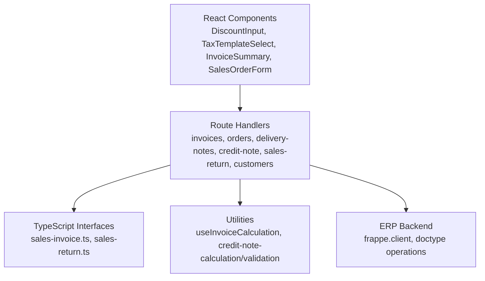

**Diagram sources**
- [index.ts](file://components/invoice/index.ts#L1-L14)
- [DiscountInput.tsx](file://components/invoice/DiscountInput.tsx)
- [TaxTemplateSelect.tsx](file://components/invoice/TaxTemplateSelect.tsx)
- [InvoiceSummary.tsx](file://components/invoice/InvoiceSummary.tsx)
- [SalesOrderForm.tsx](file://components/SalesOrderForm.tsx#L1-L364)
- [route.ts](file://app/api/sales/invoices/route.ts#L1-L362)
- [route.ts](file://app/api/sales/orders/route.ts#L1-L199)
- [route.ts](file://app/api/sales/delivery-notes/route.ts#L1-L120)
- [route.ts](file://app/api/sales/credit-note/route.ts#L1-L439)
- [route.ts](file://app/api/sales/sales-return/route.ts#L1-L196)
- [route.ts](file://app/api/sales/customers/route.ts#L1-L91)
- [sales-invoice.ts](file://types/sales-invoice.ts#L1-L199)
- [sales-return.ts](file://types/sales-return.ts#L1-L295)
- [useInvoiceCalculation.ts](file://hooks/useInvoiceCalculation.ts)
- [credit-note-calculation.ts](file://lib/credit-note-calculation.ts)
- [credit-note-validation.ts](file://lib/credit-note-validation.ts)

## Detailed Component Analysis

### Sales Invoice Workflow
End-to-end invoice lifecycle including creation, validation, tax template checks, discount enforcement, and cache synchronization.

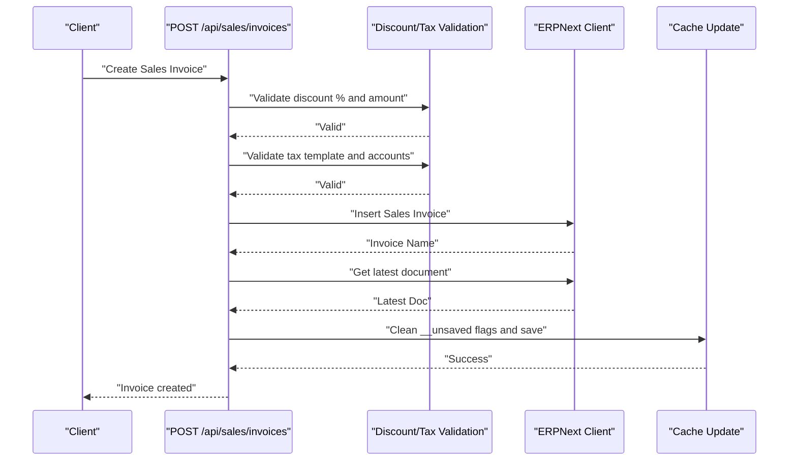

**Diagram sources**
- [route.ts](file://app/api/sales/invoices/route.ts#L113-L362)
- [sales-invoice.ts](file://types/sales-invoice.ts#L55-L106)

Key behaviors:
- Discount validation: percentage between 0–100, discount amount ≤ subtotal.
- Tax template validation: active, and all account heads exist in Chart of Accounts.
- Pre-population of custom fields for HPP snapshot and financial cost percent.
- Post-save cache update to resolve “not saved” status.

Practical example:
- Create an invoice with multiple items, apply a discount, select a tax template, and submit. The system validates inputs, constructs the payload, inserts into ERP, and refreshes cache.

**Section sources**
- [route.ts](file://app/api/sales/invoices/route.ts#L113-L362)
- [sales-invoice.ts](file://types/sales-invoice.ts#L55-L106)

### Sales Order Processing
Order creation, updates, and listing with filters and pagination.

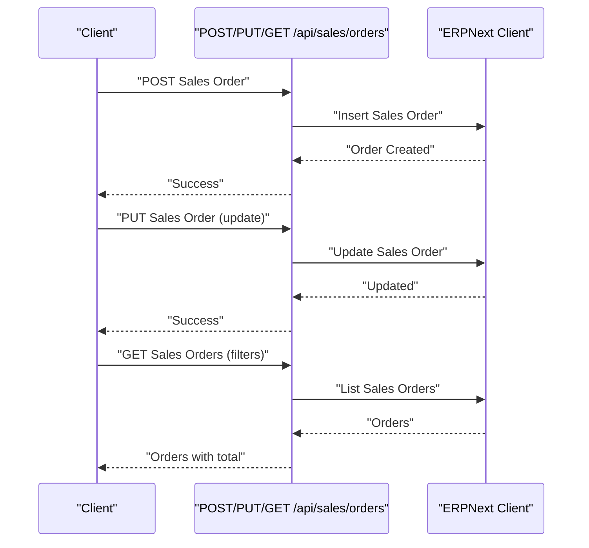

**Diagram sources**
- [route.ts](file://app/api/sales/orders/route.ts#L98-L199)

Practical example:
- Create a sales order with customer, items, and requested delivery date. Later update quantities or prices. List orders filtered by date range and status.

**Section sources**
- [route.ts](file://app/api/sales/orders/route.ts#L98-L199)
- [SalesOrderForm.tsx](file://components/SalesOrderForm.tsx#L132-L175)

### Delivery Note Generation and Fulfillment Tracking
Delivery note creation and listing with date filters.

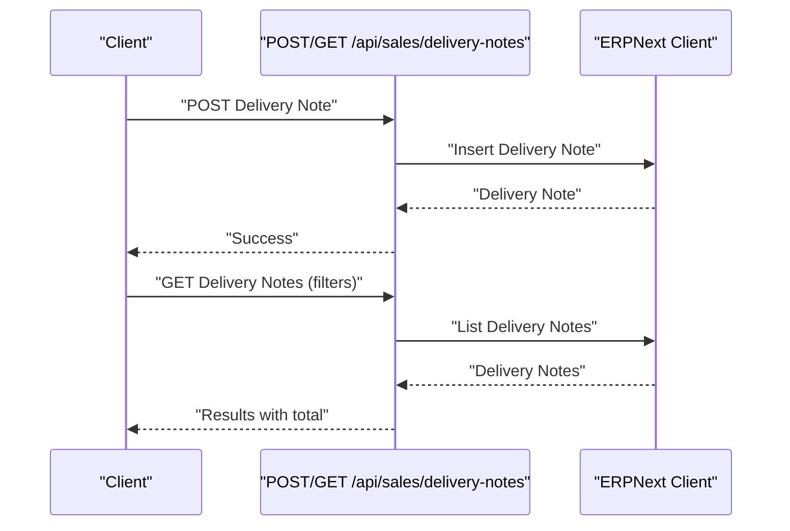

**Diagram sources**
- [route.ts](file://app/api/sales/delivery-notes/route.ts#L94-L120)

Practical example:
- After fulfilling an order, create a delivery note referencing the sales order and items. Track fulfillment status and dates.

**Section sources**
- [route.ts](file://app/api/sales/delivery-notes/route.ts#L94-L120)

### Credit Note Processing for Returns
Returns against paid invoices with item-level validation, proportional commission calculation, and accounting period checks.

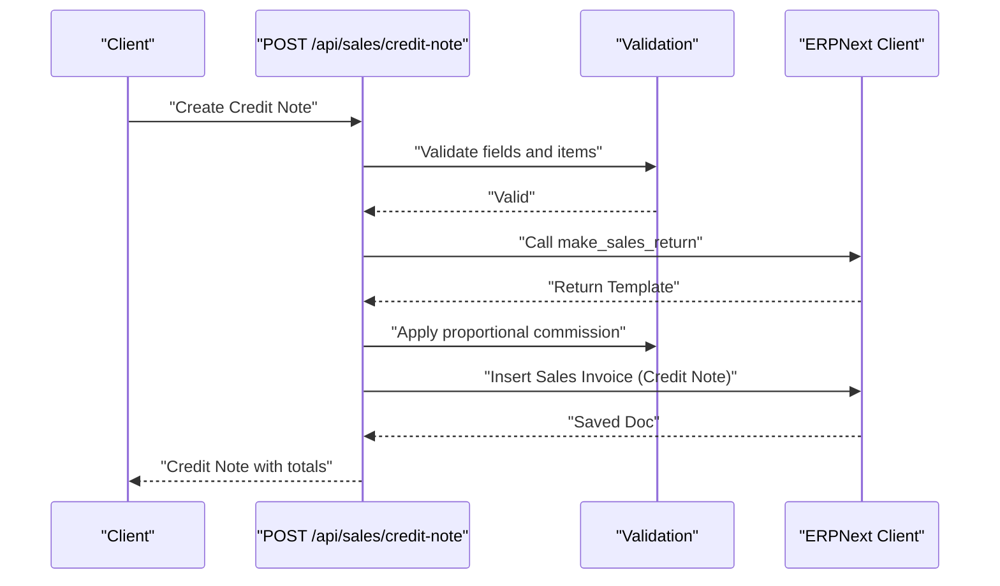

**Diagram sources**
- [route.ts](file://app/api/sales/credit-note/route.ts#L190-L439)
- [credit-note-calculation.ts](file://lib/credit-note-calculation.ts)
- [credit-note-validation.ts](file://lib/credit-note-validation.ts)

Practical example:
- Create a credit note for a paid invoice with selected items and reasons. The system computes proportional sales commissions and ensures the accounting period is open.

**Section sources**
- [route.ts](file://app/api/sales/credit-note/route.ts#L190-L439)
- [credit-note-calculation.ts](file://lib/credit-note-calculation.ts)
- [credit-note-validation.ts](file://lib/credit-note-validation.ts)

### Sales Return Workflow (Delivery Note Returns)
Partial returns with item-level validation and naming series defaults.

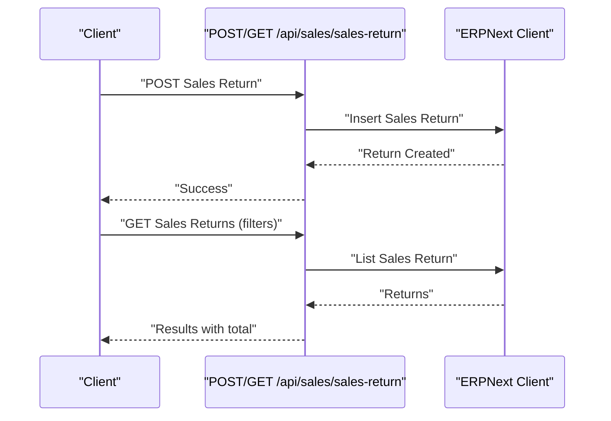

**Diagram sources**
- [route.ts](file://app/api/sales/sales-return/route.ts#L130-L196)

Practical example:
- Create a sales return for a delivery note with selected items and reasons. Supports partial returns and “Other” reasons with notes.

**Section sources**
- [route.ts](file://app/api/sales/sales-return/route.ts#L130-L196)

### Customer Management
Customer creation and search, with automatic sales team mapping.

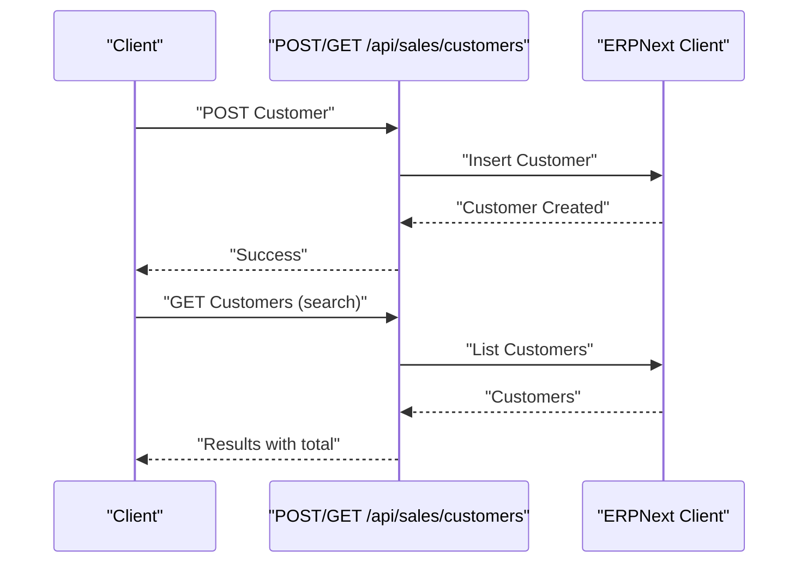

**Diagram sources**
- [route.ts](file://app/api/sales/customers/route.ts#L56-L91)

Practical example:
- Create a customer with mapped sales team from a legacy sales_person field. Search customers by name for sales forms.

**Section sources**
- [route.ts](file://app/api/sales/customers/route.ts#L56-L91)

### Sales Team and Commissions
Sales persons retrieval and commission handling.

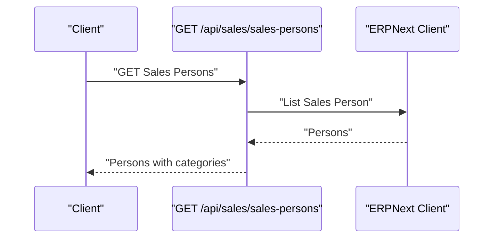

**Diagram sources**
- [route.ts](file://app/api/sales/sales-persons/route.ts#L9-L108)

Practical example:
- Retrieve sales persons for assignment to invoices or orders. Commission rates and categories are derived from naming and configuration.

**Section sources**
- [route.ts](file://app/api/sales/sales-persons/route.ts#L9-L108)

### Pricing Lists and Territories
Access pricing and territorial assignments for sales logic.

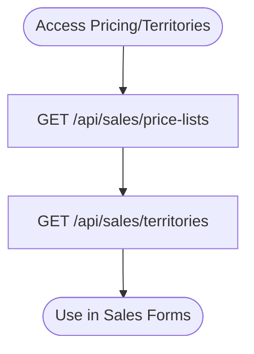

**Diagram sources**
- [route.ts](file://app/api/sales/price-lists/route.ts)
- [route.ts](file://app/api/sales/territories/route.ts)

**Section sources**
- [route.ts](file://app/api/sales/price-lists/route.ts)
- [route.ts](file://app/api/sales/territories/route.ts)

### Delivery Note Returns
Handling returns linked to delivery notes.

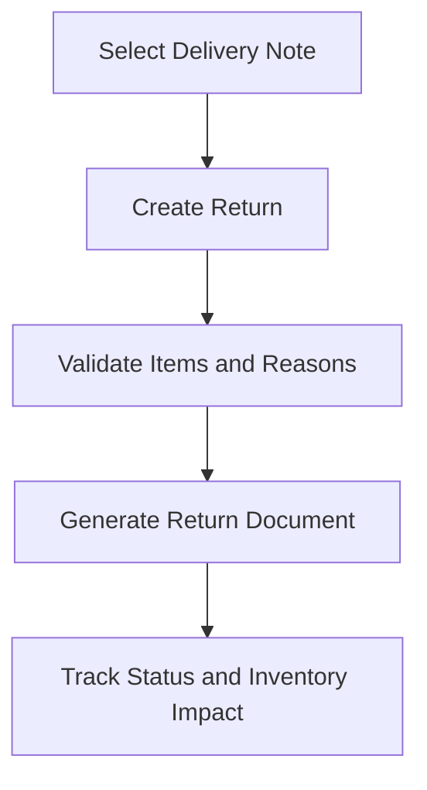

**Diagram sources**
- [route.ts](file://app/api/sales/delivery-note-return/route.ts)

**Section sources**
- [route.ts](file://app/api/sales/delivery-note-return/route.ts)

### Reporting and Compliance
Sales, invoice details, returns, accounts receivable, and profit reports.

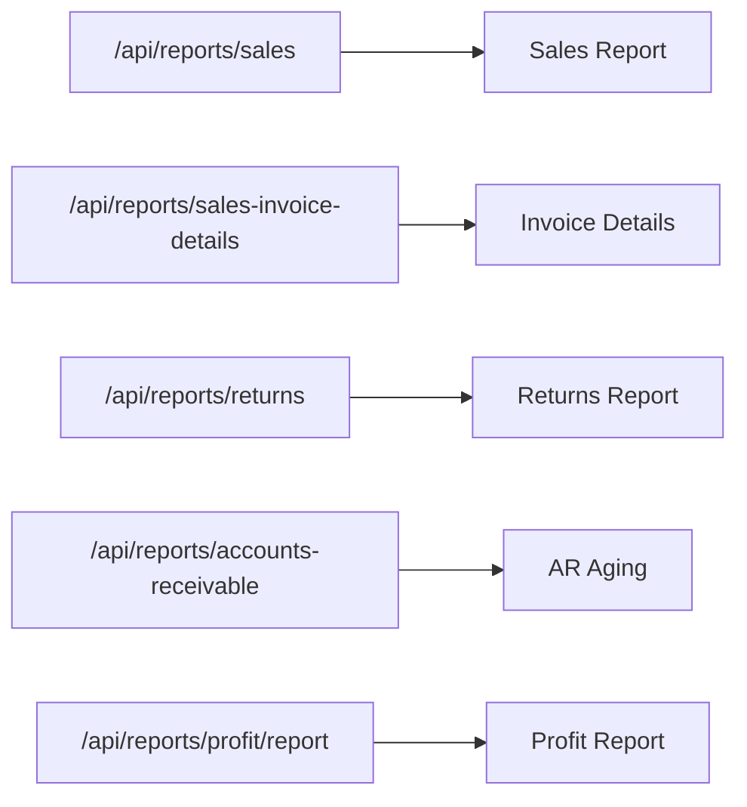

**Diagram sources**
- [route.ts](file://app/api/reports/sales/route.ts)
- [route.ts](file://app/api/reports/sales-invoice-details/route.ts)
- [route.ts](file://app/api/reports/returns/route.ts)
- [route.ts](file://app/api/reports/accounts-receivable/route.ts)
- [route.ts](file://app/api/reports/profit/report.ts)

**Section sources**
- [route.ts](file://app/api/reports/sales/route.ts)
- [route.ts](file://app/api/reports/sales-invoice-details/route.ts)
- [route.ts](file://app/api/reports/returns/route.ts)
- [route.ts](file://app/api/reports/accounts-receivable/route.ts)
- [route.ts](file://app/api/reports/profit/report.ts)

## Dependency Analysis
Sales management components depend on:
- API routes for data operations.
- TypeScript types for request/response contracts.
- UI components for input and summary views.
- Libraries for calculations and validations.
- ERP client for persistence and business logic.

```mermaid
graph TB
INV["invoices/route.ts"] --> TI["sales-invoice.ts"]
ORD["orders/route.ts"] --> TI
DN["delivery-notes/route.ts"] --> TI
CN["credit-note/route.ts"] --> TI
SR["sales-return/route.ts"] --> TS["sales-return.ts"]
CUST["customers/route.ts"] --> TI
SP["sales-persons/route.ts"] --> TI
PL["price-lists/route.ts"] --> TI
TERR["territories/route.ts"] --> TI
DNR["delivery-note-return/route.ts"] --> TI
DIC["DiscountInput.tsx"] --> TI
TTS["TaxTemplateSelect.tsx"] --> TI
ISUM["InvoiceSummary.tsx"] --> TI
SOF["SalesOrderForm.tsx"] --> TI
UIC["useInvoiceCalculation.ts"] --> TI
CDC["credit-note-calculation.ts"] --> TI
CDV["credit-note-validation.ts"] --> TI
DISC["discount_calculator.py"] --> TI
TAX["tax_calculator.py"] --> TI
INVCL["invoice_cancellation.py"] --> TI
```

**Diagram sources**
- [route.ts](file://app/api/sales/invoices/route.ts#L1-L362)
- [route.ts](file://app/api/sales/orders/route.ts#L1-L199)
- [route.ts](file://app/api/sales/delivery-notes/route.ts#L1-L120)
- [route.ts](file://app/api/sales/credit-note/route.ts#L1-L439)
- [route.ts](file://app/api/sales/sales-return/route.ts#L1-L196)
- [route.ts](file://app/api/sales/customers/route.ts#L1-L91)
- [route.ts](file://app/api/sales/sales-persons/route.ts#L1-L108)
- [route.ts](file://app/api/sales/price-lists/route.ts)
- [route.ts](file://app/api/sales/territories/route.ts)
- [route.ts](file://app/api/sales/delivery-note-return/route.ts)
- [sales-invoice.ts](file://types/sales-invoice.ts#L1-L199)
- [sales-return.ts](file://types/sales-return.ts#L1-L295)
- [index.ts](file://components/invoice/index.ts#L1-L14)
- [DiscountInput.tsx](file://components/invoice/DiscountInput.tsx)
- [TaxTemplateSelect.tsx](file://components/invoice/TaxTemplateSelect.tsx)
- [InvoiceSummary.tsx](file://components/invoice/InvoiceSummary.tsx)
- [SalesOrderForm.tsx](file://components/SalesOrderForm.tsx#L1-L364)
- [useInvoiceCalculation.ts](file://hooks/useInvoiceCalculation.ts)
- [credit-note-calculation.ts](file://lib/credit-note-calculation.ts)
- [credit-note-validation.ts](file://lib/credit-note-validation.ts)
- [discount_calculator.py](file://erpnext_custom/discount_calculator.py)
- [tax_calculator.py](file://erpnext_custom/tax_calculator.py)
- [invoice_cancellation.py](file://erpnext_custom/invoice_cancellation.py)

**Section sources**
- [route.ts](file://app/api/sales/invoices/route.ts#L1-L362)
- [route.ts](file://app/api/sales/orders/route.ts#L1-L199)
- [route.ts](file://app/api/sales/delivery-notes/route.ts#L1-L120)
- [route.ts](file://app/api/sales/credit-note/route.ts#L1-L439)
- [route.ts](file://app/api/sales/sales-return/route.ts#L1-L196)
- [route.ts](file://app/api/sales/customers/route.ts#L1-L91)
- [route.ts](file://app/api/sales/sales-persons/route.ts#L1-L108)
- [route.ts](file://app/api/sales/price-lists/route.ts)
- [route.ts](file://app/api/sales/territories/route.ts)
- [route.ts](file://app/api/sales/delivery-note-return/route.ts)
- [sales-invoice.ts](file://types/sales-invoice.ts#L1-L199)
- [sales-return.ts](file://types/sales-return.ts#L1-L295)
- [index.ts](file://components/invoice/index.ts#L1-L14)
- [DiscountInput.tsx](file://components/invoice/DiscountInput.tsx)
- [TaxTemplateSelect.tsx](file://components/invoice/TaxTemplateSelect.tsx)
- [InvoiceSummary.tsx](file://components/invoice/InvoiceSummary.tsx)
- [SalesOrderForm.tsx](file://components/SalesOrderForm.tsx#L1-L364)
- [useInvoiceCalculation.ts](file://hooks/useInvoiceCalculation.ts)
- [credit-note-calculation.ts](file://lib/credit-note-calculation.ts)
- [credit-note-validation.ts](file://lib/credit-note-validation.ts)
- [discount_calculator.py](file://erpnext_custom/discount_calculator.py)
- [tax_calculator.py](file://erpnext_custom/tax_calculator.py)
- [invoice_cancellation.py](file://erpnext_custom/invoice_cancellation.py)

## Performance Considerations
- Use pagination and filters to limit result sets for invoices, orders, delivery notes, and returns.
- Validate inputs early in API handlers to avoid unnecessary ERP calls.
- Cache updates occur post-save; ensure minimal retries to reduce load.
- Prefer batch operations where supported by the ERP client.
- Use appropriate order_by clauses to optimize UI rendering.

[No sources needed since this section provides general guidance]

## Troubleshooting Guide
Common issues and resolutions:
- Missing API credentials: Ensure ERP API key and secret are configured; otherwise, requests fail with a configuration error.
- Tax template validation failures: Verify the template exists, is active, and all account heads exist in the Chart of Accounts.
- Discount validation errors: Ensure discount percentage is between 0 and 100, and discount amount does not exceed subtotal.
- Accounting period closed: Credit notes cannot be created if the posting date falls in a closed period.
- “Not saved” status: The system performs a post-save cleanup and refresh to update caches; monitor logs for warnings.

**Section sources**
- [route.ts](file://app/api/sales/invoices/route.ts#L119-L203)
- [route.ts](file://app/api/sales/credit-note/route.ts#L294-L325)
- [route.ts](file://app/api/sales/invoices/route.ts#L299-L339)

## Conclusion
The Sales Management module provides a robust, validated pipeline for end-to-end sales operations. It integrates tightly with ERPNext for persistence and business logic while offering strong typing, reusable UI components, and comprehensive validation. The APIs support multi-item invoices, discount and tax handling, returns with proportional commission adjustments, and extensive reporting. Following the guidelines and examples herein ensures reliable operation and compliance.

[No sources needed since this section summarizes without analyzing specific files]

## Appendices

### Practical Examples Index
- Create a multi-item invoice with discount and tax template.
- Update a sales order’s items and delivery date.
- Generate a delivery note from an order.
- Create a credit note for a paid invoice with partial returns.
- Create a sales return from a delivery note.
- Assign a sales person to a customer and invoice.
- Generate sales reports and AR aging.

[No sources needed since this section indexes examples conceptually]