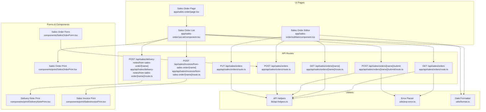
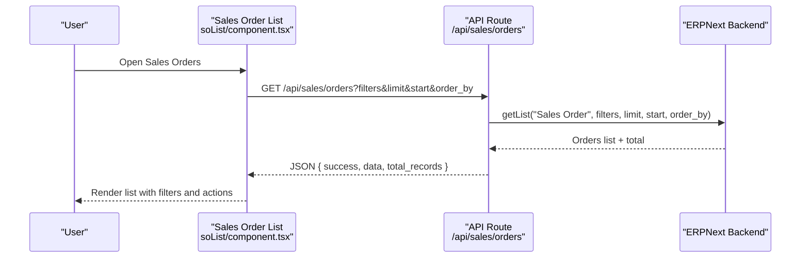
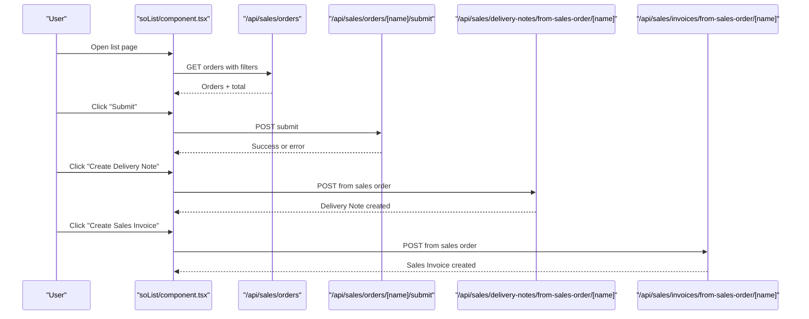
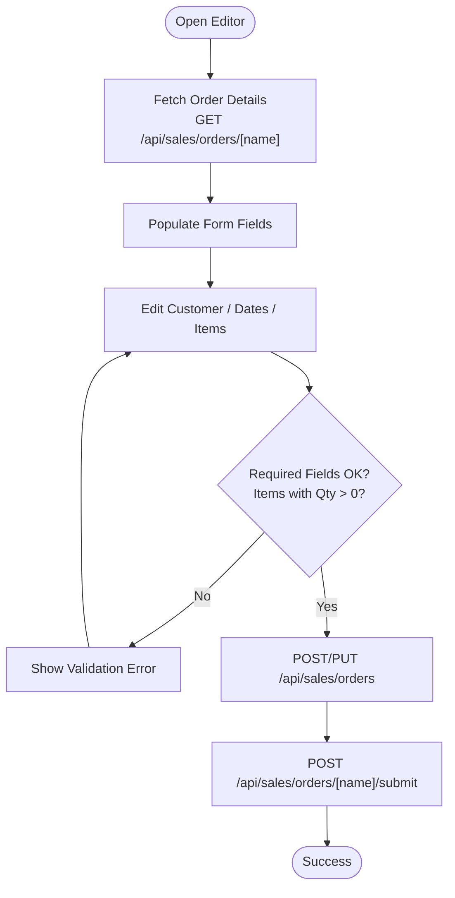
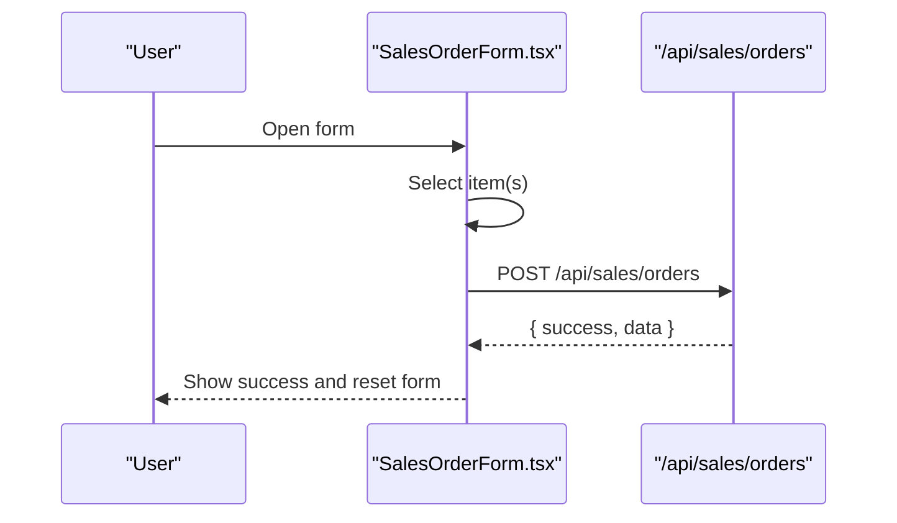
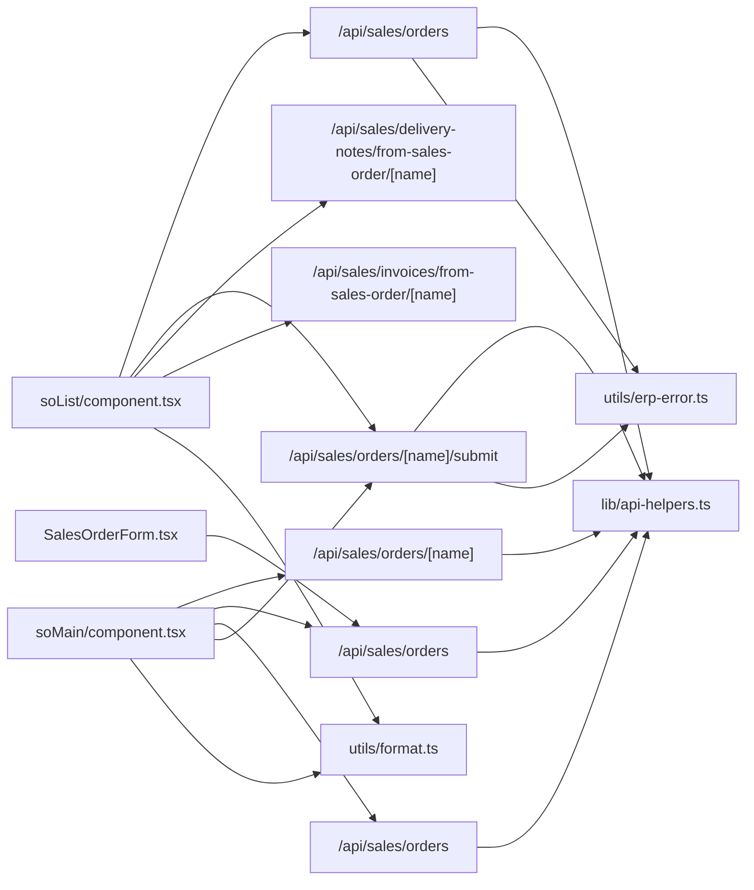

# Sales Orders

<cite>
**Referenced Files in This Document**
- [app/sales-order/page.tsx](file://app/sales-order/page.tsx)
- [app/sales-order/soList/component.tsx](file://app/sales-order/soList/component.tsx)
- [app/sales-order/soMain/component.tsx](file://app/sales-order/soMain/component.tsx)
- [components/SalesOrderForm.tsx](file://components/SalesOrderForm.tsx)
- [app/api/sales/orders/route.ts](file://app/api/sales/orders/route.ts)
- [app/api/sales/orders/[name]/route.ts](file://app/api/sales/orders/[name]/route.ts)
- [app/api/sales/orders/[name]/submit/route.ts](file://app/api/sales/orders/[name]/submit/route.ts)
- [app/api/sales/delivery-notes/from-sales-order/[name]/route.ts](file://app/api/sales/delivery-notes/from-sales-order/[name]/route.ts)
- [app/api/sales/invoices/from-sales-order/[name]/route.ts](file://app/api/sales/invoices/from-sales-order/[name]/route.ts)
- [components/print/SalesOrderPrint.tsx](file://components/print/SalesOrderPrint.tsx)
- [components/print/SalesInvoicePrint.tsx](file://components/print/SalesInvoicePrint.tsx)
- [components/print/DeliveryNotePrint.tsx](file://components/print/DeliveryNotePrint.tsx)
- [lib/api-helpers.ts](file://lib/api-helpers.ts)
- [utils/erp-error.ts](file://utils/erp-error.ts)
- [utils/format.ts](file://utils/format.ts)
- [__tests__/api-routes-sales-business-logic-preservation.pbt.test.ts](file://__tests__/api-routes-sales-business-logic-preservation.pbt.test.ts)
- [__tests__/api-routes-sales-child-table-handling.pbt.test.ts](file://__tests__/api-routes-sales-child-table-handling.pbt.test.ts)
</cite>

## Table of Contents
1. [Introduction](#introduction)
2. [Project Structure](#project-structure)
3. [Core Components](#core-components)
4. [Architecture Overview](#architecture-overview)
5. [Detailed Component Analysis](#detailed-component-analysis)
6. [Dependency Analysis](#dependency-analysis)
7. [Performance Considerations](#performance-considerations)
8. [Troubleshooting Guide](#troubleshooting-guide)
9. [Conclusion](#conclusion)
10. [Appendices](#appendices)

## Introduction
This document explains the complete sales order management workflow in the system, from creation to fulfillment and integration with delivery notes and sales invoices. It covers item specification, quantity and pricing management, order submission and validation, fulfillment tracking, partial deliveries, completion status, cancellation procedures, inventory reservation, customer notifications, order search and filtering, bulk order creation, order history management, and analytics/reporting.

## Project Structure
The sales order feature spans UI pages, client-side forms, and backend API routes that integrate with an ERPNext service layer. Key areas:
- UI pages: Sales order list and main editor
- Forms: Sales order form component and dialogs
- API routes: CRUD and lifecycle operations for sales orders, plus generation of delivery notes and sales invoices
- Print components: Sales order, delivery note, and sales invoice print layouts
- Utilities: API helpers, error parsing, and date formatting

**Diagram sources**
- [app/sales-order/page.tsx](file://app/sales-order/page.tsx#L1-L8)
- [app/sales-order/soList/component.tsx](file://app/sales-order/soList/component.tsx#L1-L842)
- [app/sales-order/soMain/component.tsx](file://app/sales-order/soMain/component.tsx#L1-L1167)
- [components/SalesOrderForm.tsx](file://components/SalesOrderForm.tsx#L1-L364)
- [app/api/sales/orders/route.ts](file://app/api/sales/orders/route.ts#L1-L199)
- [app/api/sales/orders/[name]/route.ts](file://app/api/sales/orders/[name]/route.ts#L1-L76)
- [app/api/sales/orders/[name]/submit/route.ts](file://app/api/sales/orders/[name]/submit/route.ts#L1-L72)
- [app/api/sales/delivery-notes/from-sales-order/[name]/route.ts](file://app/api/sales/delivery-notes/from-sales-order/[name]/route.ts#L1-L55)
- [app/api/sales/invoices/from-sales-order/[name]/route.ts](file://app/api/sales/invoices/from-sales-order/[name]/route.ts#L1-L55)
- [components/print/SalesOrderPrint.tsx](file://components/print/SalesOrderPrint.tsx)
- [components/print/DeliveryNotePrint.tsx](file://components/print/DeliveryNotePrint.tsx)
- [components/print/SalesInvoicePrint.tsx](file://components/print/SalesInvoicePrint.tsx)
- [lib/api-helpers.ts](file://lib/api-helpers.ts)
- [utils/erp-error.ts](file://utils/erp-error.ts)
- [utils/format.ts](file://utils/format.ts)

**Section sources**
- [app/sales-order/page.tsx](file://app/sales-order/page.tsx#L1-L8)
- [app/sales-order/soList/component.tsx](file://app/sales-order/soList/component.tsx#L1-L842)
- [app/sales-order/soMain/component.tsx](file://app/sales-order/soMain/component.tsx#L1-L1167)
- [components/SalesOrderForm.tsx](file://components/SalesOrderForm.tsx#L1-L364)
- [app/api/sales/orders/route.ts](file://app/api/sales/orders/route.ts#L1-L199)
- [app/api/sales/orders/[name]/route.ts](file://app/api/sales/orders/[name]/route.ts#L1-L76)
- [app/api/sales/orders/[name]/submit/route.ts](file://app/api/sales/orders/[name]/submit/route.ts#L1-L72)
- [app/api/sales/delivery-notes/from-sales-order/[name]/route.ts](file://app/api/sales/delivery-notes/from-sales-order/[name]/route.ts#L1-L55)
- [app/api/sales/invoices/from-sales-order/[name]/route.ts](file://app/api/sales/invoices/from-sales-order/[name]/route.ts#L1-L55)
- [lib/api-helpers.ts](file://lib/api-helpers.ts)
- [utils/erp-error.ts](file://utils/erp-error.ts)
- [utils/format.ts](file://utils/format.ts)

## Core Components
- Sales Order List: Displays orders with filters, pagination/infinite scroll, actions (submit, create delivery note, create sales invoice), and print preview.
- Sales Order Editor: Full CRUD form for creating/editing orders, item management, pricing, and submission.
- Sales Order Form (component): A reusable form for quick order creation with item selection, quantity, price, and warehouse assignment.
- API Routes: Provide endpoints for listing, retrieving, creating, updating, submitting, and generating downstream documents from sales orders.
- Print Components: Render printable layouts for sales orders, delivery notes, and sales invoices.

Key capabilities:
- Order creation with customer, transaction date, delivery date, payment terms, items, and sales team.
- Quantity and pricing management with stock availability checks and warehouse assignment.
- Submission workflow with validation and error handling.
- Fulfillment integration via delivery note and sales invoice generation.
- Filtering and search by customer, document number, status, and date range.
- Print preview and export.

**Section sources**
- [app/sales-order/soList/component.tsx](file://app/sales-order/soList/component.tsx#L37-L130)
- [app/sales-order/soMain/component.tsx](file://app/sales-order/soMain/component.tsx#L19-L101)
- [components/SalesOrderForm.tsx](file://components/SalesOrderForm.tsx#L22-L56)
- [app/api/sales/orders/route.ts](file://app/api/sales/orders/route.ts#L9-L96)
- [components/print/SalesOrderPrint.tsx](file://components/print/SalesOrderPrint.tsx)
- [components/print/DeliveryNotePrint.tsx](file://components/print/DeliveryNotePrint.tsx)
- [components/print/SalesInvoicePrint.tsx](file://components/print/SalesInvoicePrint.tsx)

## Architecture Overview
The system uses a Next.js App Router front-end with API routes that proxy to an ERPNext backend. The UI components communicate with the API routes to manage sales orders and downstream documents.

**Diagram sources**
- [app/sales-order/soList/component.tsx](file://app/sales-order/soList/component.tsx#L169-L263)
- [app/api/sales/orders/route.ts](file://app/api/sales/orders/route.ts#L9-L96)
- [lib/api-helpers.ts](file://lib/api-helpers.ts)

## Detailed Component Analysis

### Sales Order List (soList)
Responsibilities:
- Load orders with pagination/infinite scroll and filters (customer, document number, status, date range).
- Submit orders, create delivery notes, and create sales invoices from a selected order.
- Print order details via print preview modal.
- Display status badges and progress indicators.

Key flows:
- Fetch orders with URL parameters and apply sorting and filters.
- Infinite scroll sentinel triggers page increments on mobile.
- Action buttons conditionally render based on order status.

**Diagram sources**
- [app/sales-order/soList/component.tsx](file://app/sales-order/soList/component.tsx#L346-L400)
- [app/api/sales/orders/[name]/submit/route.ts](file://app/api/sales/orders/[name]/submit/route.ts#L9-L72)
- [app/api/sales/delivery-notes/from-sales-order/[name]/route.ts](file://app/api/sales/delivery-notes/from-sales-order/[name]/route.ts#L9-L55)
- [app/api/sales/invoices/from-sales-order/[name]/route.ts](file://app/api/sales/invoices/from-sales-order/[name]/route.ts#L1-L55)

**Section sources**
- [app/sales-order/soList/component.tsx](file://app/sales-order/soList/component.tsx#L96-L263)
- [app/sales-order/soList/component.tsx](file://app/sales-order/soList/component.tsx#L346-L400)
- [app/sales-order/soList/component.tsx](file://app/sales-order/soList/component.tsx#L401-L457)

### Sales Order Editor (soMain)
Responsibilities:
- Create or edit a sales order with customer, dates, payment terms, items, and sales team.
- Validate required fields and item completeness.
- Save draft orders and submit to ERPNext.
- Fetch order details and populate form fields.
- Check item stock availability and suggest warehouse.

**Diagram sources**
- [app/sales-order/soMain/component.tsx](file://app/sales-order/soMain/component.tsx#L287-L366)
- [app/sales-order/soMain/component.tsx](file://app/sales-order/soMain/component.tsx#L495-L595)
- [app/api/sales/orders/[name]/route.ts](file://app/api/sales/orders/[name]/route.ts#L9-L76)
- [app/api/sales/orders/route.ts](file://app/api/sales/orders/route.ts#L98-L127)
- [app/api/sales/orders/[name]/submit/route.ts](file://app/api/sales/orders/[name]/submit/route.ts#L9-L72)

**Section sources**
- [app/sales-order/soMain/component.tsx](file://app/sales-order/soMain/component.tsx#L144-L370)
- [app/sales-order/soMain/component.tsx](file://app/sales-order/soMain/component.tsx#L372-L430)
- [app/sales-order/soMain/component.tsx](file://app/sales-order/soMain/component.tsx#L495-L595)

### Sales Order Form (Reusable Component)
Responsibilities:
- Quick order creation with customer, sales person, delivery date, and items.
- Item selection dialog and stock availability display.
- Default warehouse assignment and auto-fill behavior.
- Submit order payload to backend.

**Diagram sources**
- [components/SalesOrderForm.tsx](file://components/SalesOrderForm.tsx#L93-L175)
- [app/api/sales/orders/route.ts](file://app/api/sales/orders/route.ts#L129-L199)

**Section sources**
- [components/SalesOrderForm.tsx](file://components/SalesOrderForm.tsx#L26-L175)

### API Routes for Sales Orders
Endpoints:
- GET /api/sales/orders: List orders with filters, pagination, and sorting.
- GET /api/sales/orders/[name]: Retrieve a single order with child tables.
- POST /api/sales/orders: Create a new order.
- PUT /api/sales/orders: Update an existing order.
- POST /api/sales/orders/[name]/submit: Submit an order.
- POST /api/sales/delivery-notes/from-sales-order/[name]: Generate a delivery note from a sales order.
- POST /api/sales/invoices/from-sales-order/[name]: Generate a sales invoice from a sales order.

Error handling:
- Authentication checks and site-aware error responses.
- Detailed error parsing for validation and permission errors.

**Section sources**
- [app/api/sales/orders/route.ts](file://app/api/sales/orders/route.ts#L9-L96)
- [app/api/sales/orders/route.ts](file://app/api/sales/orders/route.ts#L98-L127)
- [app/api/sales/orders/route.ts](file://app/api/sales/orders/route.ts#L129-L199)
- [app/api/sales/orders/[name]/route.ts](file://app/api/sales/orders/[name]/route.ts#L9-L76)
- [app/api/sales/orders/[name]/submit/route.ts](file://app/api/sales/orders/[name]/submit/route.ts#L9-L72)
- [app/api/sales/delivery-notes/from-sales-order/[name]/route.ts](file://app/api/sales/delivery-notes/from-sales-order/[name]/route.ts#L9-L55)
- [app/api/sales/invoices/from-sales-order/[name]/route.ts](file://app/api/sales/invoices/from-sales-order/[name]/route.ts#L1-L55)
- [lib/api-helpers.ts](file://lib/api-helpers.ts)
- [utils/erp-error.ts](file://utils/erp-error.ts)

### Print Components
- Sales Order Print: Renders printable sales order details.
- Delivery Note Print: Renders printable delivery note details.
- Sales Invoice Print: Renders printable sales invoice details.

Usage:
- The list/editor fetches order data and opens a print preview modal with the appropriate print component.

**Section sources**
- [components/print/SalesOrderPrint.tsx](file://components/print/SalesOrderPrint.tsx)
- [components/print/DeliveryNotePrint.tsx](file://components/print/DeliveryNotePrint.tsx)
- [components/print/SalesInvoicePrint.tsx](file://components/print/SalesInvoicePrint.tsx)
- [app/sales-order/soList/component.tsx](file://app/sales-order/soList/component.tsx#L401-L457)

## Dependency Analysis
- UI components depend on API routes for data and actions.
- API routes depend on shared helpers for authentication and error handling.
- Print components are decoupled and invoked by UI for rendering.

**Diagram sources**
- [app/sales-order/soList/component.tsx](file://app/sales-order/soList/component.tsx#L169-L263)
- [app/sales-order/soMain/component.tsx](file://app/sales-order/soMain/component.tsx#L287-L366)
- [components/SalesOrderForm.tsx](file://components/SalesOrderForm.tsx#L133-L175)
- [app/api/sales/orders/route.ts](file://app/api/sales/orders/route.ts#L9-L96)
- [app/api/sales/orders/[name]/submit/route.ts](file://app/api/sales/orders/[name]/submit/route.ts#L9-L72)
- [app/api/sales/delivery-notes/from-sales-order/[name]/route.ts](file://app/api/sales/delivery-notes/from-sales-order/[name]/route.ts#L9-L55)
- [app/api/sales/invoices/from-sales-order/[name]/route.ts](file://app/api/sales/invoices/from-sales-order/[name]/route.ts#L1-L55)
- [lib/api-helpers.ts](file://lib/api-helpers.ts)
- [utils/erp-error.ts](file://utils/erp-error.ts)
- [utils/format.ts](file://utils/format.ts)

**Section sources**
- [app/sales-order/soList/component.tsx](file://app/sales-order/soList/component.tsx#L169-L263)
- [app/sales-order/soMain/component.tsx](file://app/sales-order/soMain/component.tsx#L287-L366)
- [components/SalesOrderForm.tsx](file://components/SalesOrderForm.tsx#L133-L175)
- [app/api/sales/orders/route.ts](file://app/api/sales/orders/route.ts#L9-L96)
- [app/api/sales/orders/[name]/submit/route.ts](file://app/api/sales/orders/[name]/submit/route.ts#L9-L72)
- [lib/api-helpers.ts](file://lib/api-helpers.ts)
- [utils/erp-error.ts](file://utils/erp-error.ts)
- [utils/format.ts](file://utils/format.ts)

## Performance Considerations
- Pagination and sorting: The list endpoint supports limit/start and order_by parameters to control load volume.
- Infinite scroll: Mobile view uses an intersection observer sentinel to append more results without full reloads.
- Filtering: URL sync and controlled updates prevent unnecessary re-fetches.
- Date parsing: Centralized date formatting and parsing utilities reduce overhead and inconsistencies.
- Stock checks: On-demand stock availability queries per item minimize redundant network calls.

[No sources needed since this section provides general guidance]

## Troubleshooting Guide
Common issues and resolutions:
- Authentication failures: Ensure API keys or session cookies are present for API routes.
- Validation errors during submit: Required fields include company, customer, transaction date, delivery date, payment terms template, and at least one valid item with quantity > 0 and warehouse.
- Permission errors: Verify user roles and site permissions.
- ERPNext exceptions: Errors are parsed and returned with meaningful messages for mandatory fields, validation, link validation, and permission errors.

**Section sources**
- [app/api/sales/orders/route.ts](file://app/api/sales/orders/route.ts#L145-L199)
- [app/api/sales/orders/[name]/submit/route.ts](file://app/api/sales/orders/[name]/submit/route.ts#L58-L70)
- [utils/erp-error.ts](file://utils/erp-error.ts)

## Conclusion
The sales order module provides a robust, site-aware workflow from order creation to fulfillment. It integrates seamlessly with delivery notes and sales invoices, supports filtering and search, and offers print previews. The modular design enables easy extension for bulk order creation, analytics, and reporting.

[No sources needed since this section summarizes without analyzing specific files]

## Appendices

### Order Creation and Pricing Confirmation
- Create a sales order with customer, transaction date, delivery date, payment terms, and items.
- Pricing confirmation occurs via item price lookup and amount calculation based on quantity and rate.
- Stock availability checks help confirm warehouse assignment and prevent overselling.

**Section sources**
- [app/sales-order/soMain/component.tsx](file://app/sales-order/soMain/component.tsx#L392-L424)
- [app/sales-order/soMain/component.tsx](file://app/sales-order/soMain/component.tsx#L536-L565)

### Order Modification and Approval
- Modify items, quantities, and delivery dates while the order remains in Draft status.
- Submit the order to trigger approval workflows in ERPNext.
- Validation ensures required fields and item completeness before submission.

**Section sources**
- [app/sales-order/soMain/component.tsx](file://app/sales-order/soMain/component.tsx#L495-L595)
- [app/api/sales/orders/[name]/submit/route.ts](file://app/api/sales/orders/[name]/submit/route.ts#L9-L72)

### Fulfillment Tracking and Completion
- Generate delivery notes from submitted orders to track partial and full deliveries.
- Generate sales invoices to record billing and revenue recognition.
- Status badges reflect current state (To Deliver, To Bill, Completed, Cancelled).

**Section sources**
- [app/sales-order/soList/component.tsx](file://app/sales-order/soList/component.tsx#L361-L399)
- [app/api/sales/delivery-notes/from-sales-order/[name]/route.ts](file://app/api/sales/delivery-notes/from-sales-order/[name]/route.ts#L9-L55)
- [app/api/sales/invoices/from-sales-order/[name]/route.ts](file://app/api/sales/invoices/from-sales-order/[name]/route.ts#L1-L55)

### Cancellation Procedures and Notifications
- Cancel downstream documents (e.g., sales invoices) through dedicated API routes.
- Accounting period validation prevents cancellations in closed periods.
- Notifications are handled by the ERPNext backend; UI surfaces success/error messages.

**Section sources**
- [app/api/sales/credit-note/[name]/cancel/route.ts](file://app/api/sales/credit-note/[name]/cancel/route.ts#L79-L119)
- [app/api/sales/sales-return/[name]/cancel/route.ts](file://app/api/sales/sales-return/[name]/cancel/route.ts#L43-L56)

### Search, Filtering, and Status Tracking
- Filters: Customer name, document number, status, and date range.
- Sorting: Default order by creation date and transaction date descending.
- Status tracking: Localized status labels and color-coded badges.

**Section sources**
- [app/sales-order/soList/component.tsx](file://app/sales-order/soList/component.tsx#L199-L234)
- [app/sales-order/soList/component.tsx](file://app/sales-order/soList/component.tsx#L63-L91)

### Bulk Order Creation and History Management
- Bulk creation: Use the reusable Sales Order Form component to add multiple items and submit in batches.
- History management: The list displays order history with pagination and infinite scroll; filters preserve URL state for sharing/bookmarking.

**Section sources**
- [components/SalesOrderForm.tsx](file://components/SalesOrderForm.tsx#L133-L175)
- [app/sales-order/soList/component.tsx](file://app/sales-order/soList/component.tsx#L140-L148)
- [app/sales-order/soList/component.tsx](file://app/sales-order/soList/component.tsx#L270-L291)

### Analytics, Reporting, and Metrics
- Business logic preservation tests validate totals and child table handling across legacy and modern implementations.
- Reports and dashboards can leverage the underlying ERPNext reporting engine.

**Section sources**
- [__tests__/api-routes-sales-business-logic-preservation.pbt.test.ts](file://__tests__/api-routes-sales-business-logic-preservation.pbt.test.ts#L164-L214)
- [__tests__/api-routes-sales-child-table-handling.pbt.test.ts](file://__tests__/api-routes-sales-child-table-handling.pbt.test.ts#L150-L198)