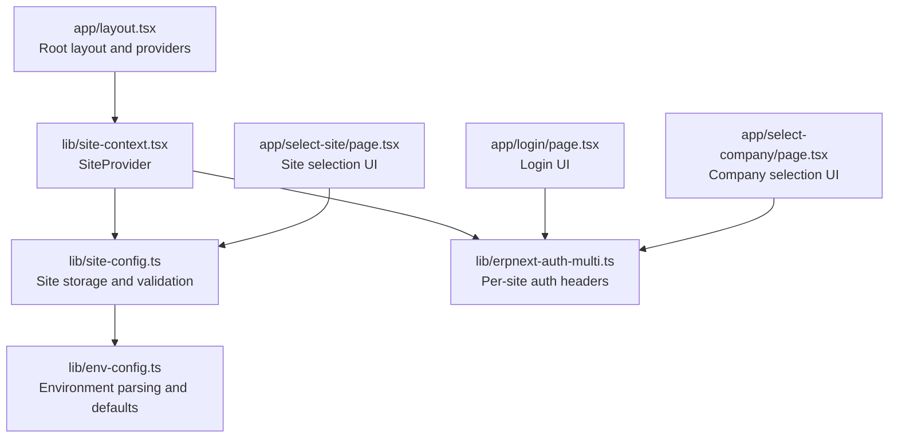
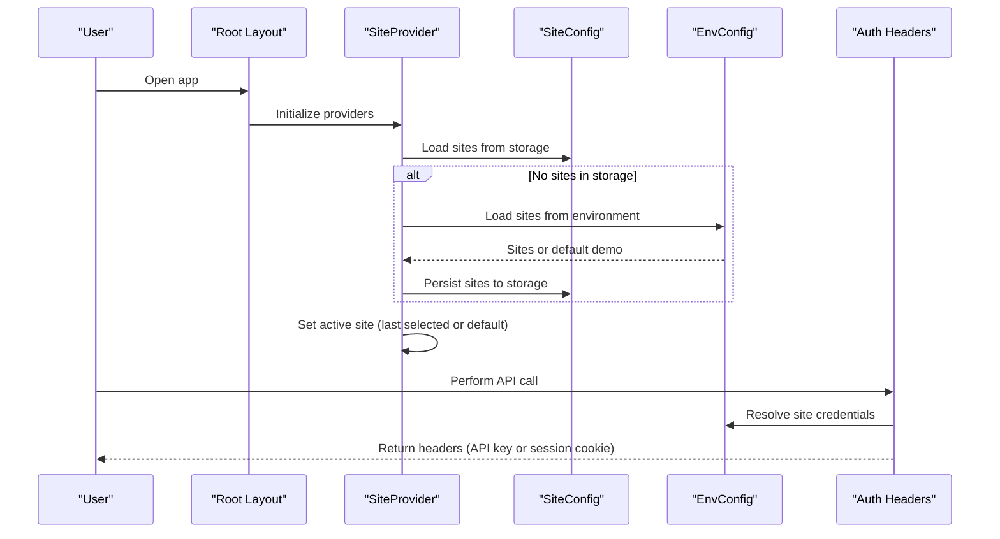
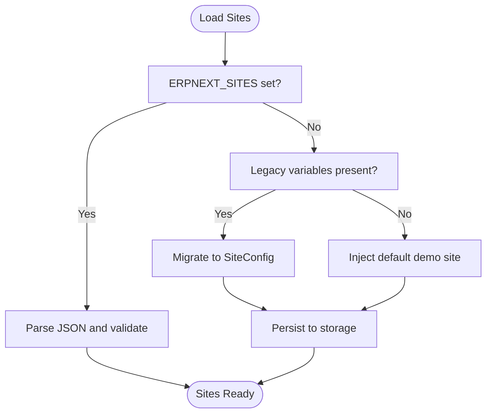
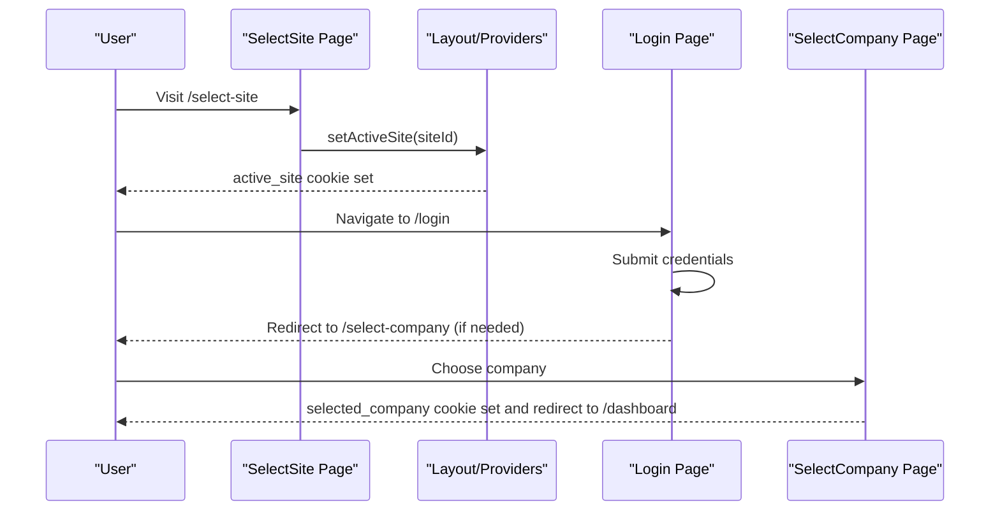
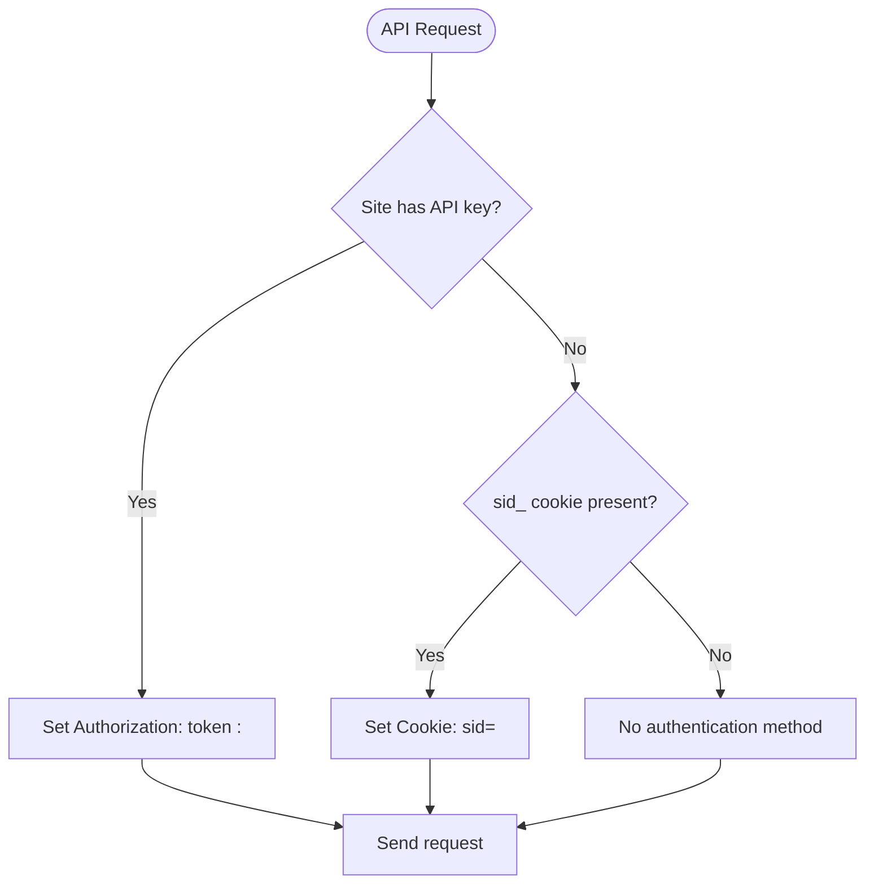
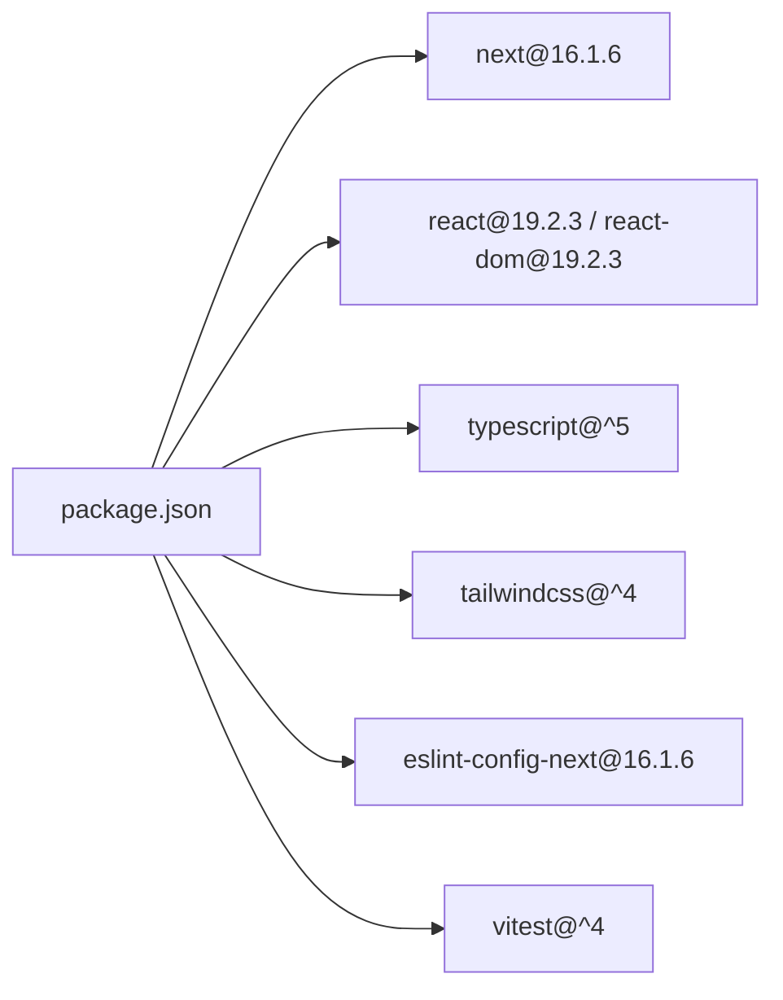

# Getting Started

<cite>
**Referenced Files in This Document**
- [package.json](file://package.json)
- [tsconfig.json](file://tsconfig.json)
- [scripts\next.config.ts](file://scripts\next.config.ts)
- [lib\env-config.ts](file://lib\env-config.ts)
- [lib\site-config.ts](file://lib\site-config.ts)
- [lib\site-context.tsx](file://lib\site-context.tsx)
- [lib\site-migration.ts](file://lib\site-migration.ts)
- [lib\erpnext-auth-multi.ts](file://utils\erpnext-auth-multi.ts)
- [lib\env-validation.ts](file://lib\env-validation.ts)
- [app\layout.tsx](file://app\layout.tsx)
- [app\login\page.tsx](file://app\login\page.tsx)
- [app\select-site\page.tsx](file://app\select-site\page.tsx)
- [app\select-company\page.tsx](file://app\select-company\page.tsx)
</cite>

## Table of Contents
1. [Introduction](#introduction)
2. [Project Structure](#project-structure)
3. [Core Components](#core-components)
4. [Architecture Overview](#architecture-overview)
5. [Detailed Component Analysis](#detailed-component-analysis)
6. [Dependency Analysis](#dependency-analysis)
7. [Performance Considerations](#performance-considerations)
8. [Troubleshooting Guide](#troubleshooting-guide)
9. [Conclusion](#conclusion)
10. [Appendices](#appendices)

## Introduction
This guide helps you set up and run the ERP Next System locally. It covers prerequisites, environment setup, multi-site configuration, authentication flow, and basic usage. The system is built with Next.js 16.1.6, React 19.2.3, TypeScript, and Tailwind CSS. It supports both single-site and multi-site modes, with secure per-site authentication and session management.

## Project Structure
The application follows a Next.js App Router structure with feature-based pages under the app directory. Authentication and site selection are handled via dedicated pages and shared libraries for environment configuration, site management, and authentication headers.

**Diagram sources**
- [app\layout.tsx](file://app\layout.tsx#L30-L52)
- [lib\site-context.tsx](file://lib\site-context.tsx#L59-L336)
- [lib\site-config.ts](file://lib\site-config.ts#L97-L105)
- [lib\env-config.ts](file://lib\env-config.ts#L244-L259)
- [lib\erpnext-auth-multi.ts](file://utils\erpnext-auth-multi.ts#L54-L72)
- [app\select-site\page.tsx](file://app\select-site\page.tsx#L16-L174)
- [app\login\page.tsx](file://app\login\page.tsx#L7-L89)
- [app\select-company\page.tsx](file://app\select-company\page.tsx#L19-L69)

**Section sources**
- [package.json](file://package.json#L118-L132)
- [tsconfig.json](file://tsconfig.json#L1-L35)
- [scripts\next.config.ts](file://scripts\next.config.ts#L1-L14)
- [app\layout.tsx](file://app\layout.tsx#L1-L54)

## Core Components
- Technology Stack
  - Next.js 16.1.6, React 19.2.3, TypeScript, Tailwind CSS
- Environment Configuration
  - Multi-site support via ERPNEXT_SITES JSON array or legacy ERPNEXT_API_URL/ERP_API_KEY/ERP_API_SECRET
  - Default demo site fallback when no sites are configured
- Site Management
  - Persistent site list in localStorage with CRUD operations
  - Automatic migration from legacy environment variables
- Authentication
  - Per-site authentication via API key or session cookies (sid_<siteId>)
  - Helpers to construct headers and manage cookies

**Section sources**
- [package.json](file://package.json#L118-L132)
- [lib\env-config.ts](file://lib\env-config.ts#L244-L302)
- [lib\site-config.ts](file://lib\site-config.ts#L97-L172)
- [lib\site-migration.ts](file://lib\site-migration.ts#L80-L157)
- [lib\erpnext-auth-multi.ts](file://utils\erpnext-auth-multi.ts#L54-L98)

## Architecture Overview
The system initializes site configuration on app boot, validates and persists sites, and enforces per-site authentication for API requests.

**Diagram sources**
- [app\layout.tsx](file://app\layout.tsx#L30-L52)
- [lib\site-context.tsx](file://lib\site-context.tsx#L189-L320)
- [lib\site-config.ts](file://lib\site-config.ts#L97-L105)
- [lib\env-config.ts](file://lib\env-config.ts#L244-L259)
- [lib\erpnext-auth-multi.ts](file://utils\erpnext-auth-multi.ts#L54-L72)

## Detailed Component Analysis

### Environment Setup and Multi-Site Configuration
- Supported environment variables
  - ERPNEXT_SITES: JSON array of site configurations
  - ERPNEXT_DEFAULT_SITE: Default site ID or name
  - Legacy: ERPNEXT_API_URL, ERP_API_KEY, ERP_API_SECRET
- Behavior
  - If ERPNEXT_SITES is present, it takes precedence
  - If absent, legacy variables are migrated to SiteConfig
  - If still none, a default demo site is injected
- Validation
  - URL format, presence of required fields, and JSON parsing are enforced

**Diagram sources**
- [lib\env-config.ts](file://lib\env-config.ts#L198-L259)
- [lib\site-migration.ts](file://lib\site-migration.ts#L80-L157)
- [lib\site-config.ts](file://lib\site-config.ts#L244-L274)

**Section sources**
- [lib\env-config.ts](file://lib\env-config.ts#L244-L302)
- [lib\site-config.ts](file://lib\site-config.ts#L294-L311)
- [lib\site-migration.ts](file://lib\site-migration.ts#L80-L157)

### Site Selection and Authentication Flow
- Site selection
  - Users choose a site from a list; health status and company name are displayed
  - Sites can be added with validation against the backend to avoid CORS issues
- Login
  - After selecting a site, users log in; the system stores login data and company choices
- Company selection
  - If multiple companies are available, users pick one; selection is persisted and cookies are set

**Diagram sources**
- [app\select-site\page.tsx](file://app\select-site\page.tsx#L156-L174)
- [lib\site-context.tsx](file://lib\site-context.tsx#L152-L184)
- [app\login\page.tsx](file://app\login\page.tsx#L24-L89)
- [app\select-company\page.tsx](file://app\select-company\page.tsx#L46-L69)

**Section sources**
- [app\select-site\page.tsx](file://app\select-site\page.tsx#L16-L174)
- [app\login\page.tsx](file://app\login\page.tsx#L7-L89)
- [app\select-company\page.tsx](file://app\select-company\page.tsx#L19-L69)
- [lib\site-context.tsx](file://lib\site-context.tsx#L152-L184)

### Authentication Headers and Cookies
- Authentication priority
  - API key (admin) preferred; if present, Authorization header is constructed
  - Otherwise, site-specific session cookie sid_<siteId> is used
- Cookie management
  - Separate cookies per site to prevent cross-site session leakage
  - Helpers to set, clear, and inspect site-specific session cookies

**Diagram sources**
- [lib\erpnext-auth-multi.ts](file://utils\erpnext-auth-multi.ts#L54-L98)
- [lib\erpnext-auth-multi.ts](file://utils\erpnext-auth-multi.ts#L167-L176)

**Section sources**
- [lib\erpnext-auth-multi.ts](file://utils\erpnext-auth-multi.ts#L54-L98)
- [lib\erpnext-auth-multi.ts](file://utils\erpnext-auth-multi.ts#L167-L190)

## Dependency Analysis
- Runtime dependencies include Next.js, React, TypeScript types, and Tailwind CSS tooling
- Development dependencies include ESLint, Vitest, and Tailwind PostCSS plugin
- Next.js configuration enables strict TypeScript checks and bundler module resolution

**Diagram sources**
- [package.json](file://package.json#L118-L150)
- [scripts\next.config.ts](file://scripts\next.config.ts#L1-L14)

**Section sources**
- [package.json](file://package.json#L118-L150)
- [tsconfig.json](file://tsconfig.json#L1-L35)
- [scripts\next.config.ts](file://scripts\next.config.ts#L1-L14)

## Performance Considerations
- Prefer API key authentication for administrative endpoints to bypass role-based permission checks on the frontend
- Use site-specific session cookies to avoid cross-site session conflicts
- Cache company names and health statuses to reduce repeated network calls during site selection
- Keep environment variables centralized and validated to avoid runtime errors

## Troubleshooting Guide
- Environment validation failures
  - Ensure ERPNEXT_API_URL, ERP_API_KEY, ERP_API_SECRET are set and valid
  - Check NEXT_PUBLIC_APP_ENV for development/staging/production modes
- Multi-site configuration issues
  - Verify ERPNEXT_SITES is a valid JSON array
  - If migrating from legacy variables, confirm the migration completes and sites are persisted
- Site selection problems
  - Confirm active_site cookie is set after site selection
  - Validate site connection via the backend validation endpoint
- Authentication errors
  - Ensure API key is present for admin-level access or that sid_<siteId> cookie is set for session-based auth
  - Clear site-specific cookies if stuck in an inconsistent state

**Section sources**
- [lib\env-validation.ts](file://lib\env-validation.ts#L12-L32)
- [lib\env-config.ts](file://lib\env-config.ts#L307-L341)
- [lib\site-migration.ts](file://lib\site-migration.ts#L80-L157)
- [app\select-site\page.tsx](file://app\select-site\page.tsx#L232-L265)
- [lib\erpnext-auth-multi.ts](file://utils\erpnext-auth-multi.ts#L167-L190)

## Conclusion
You now have the essentials to install, configure, and run the ERP Next System locally. Use the multi-site configuration to connect to one or more ERPNext instances, authenticate via API key or session cookies, and navigate to the dashboard after selecting a company. For persistent environments, ensure environment variables are correctly set and validated.

## Appendices

### A. Prerequisites
- Node.js and a package manager (pnpm/yarn/npm)
- Access to an ERPNext instance with API credentials (API key and secret) or a hosted demo site

**Section sources**
- [package.json](file://package.json#L118-L132)

### B. Local Development Setup
- Install dependencies
  - Use your preferred package manager to install dependencies
- Start the development server
  - Run the dev script to launch the Next.js server
- Environment variables
  - Configure ERPNEXT_SITES or legacy variables
  - Validate environment with the provided validation script

**Section sources**
- [package.json](file://package.json#L5-L17)
- [lib\env-validation.ts](file://lib\env-validation.ts#L12-L32)

### C. Basic Usage Examples
- Access the application
  - Open the login page after site selection
- Multi-site selection
  - From the site selection page, choose a site and continue to login
- Authentication
  - Enter credentials on the login page; if multiple companies are available, select one on the company selection page

**Section sources**
- [app\login\page.tsx](file://app\login\page.tsx#L24-L89)
- [app\select-site\page.tsx](file://app\select-site\page.tsx#L156-L174)
- [app\select-company\page.tsx](file://app\select-company\page.tsx#L46-L69)