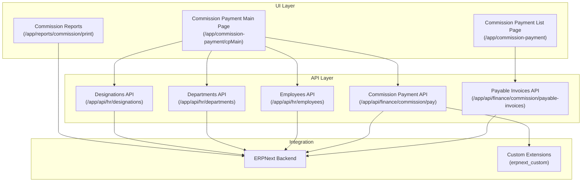
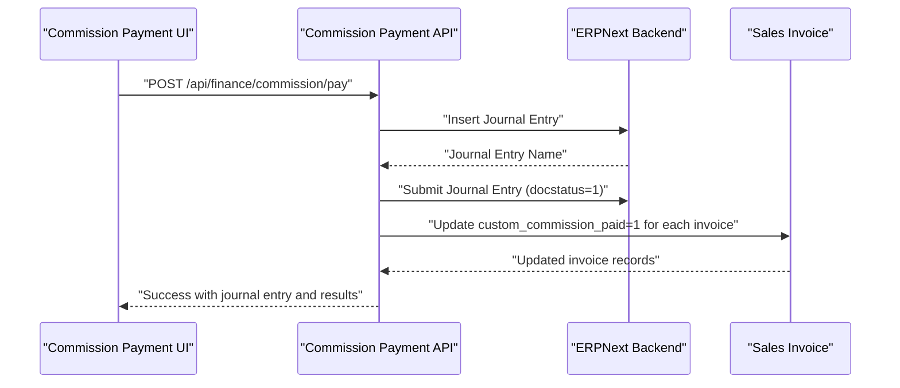
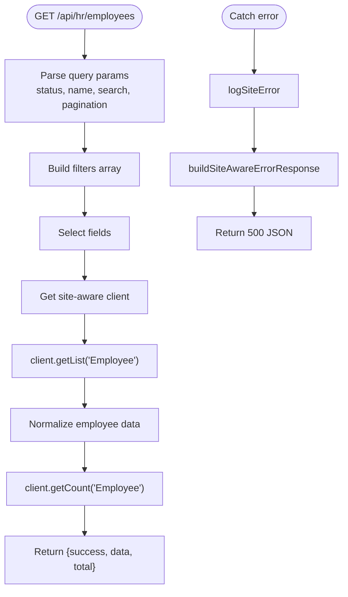
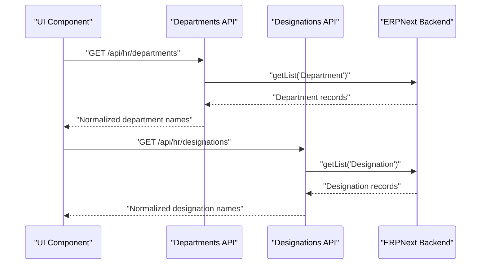
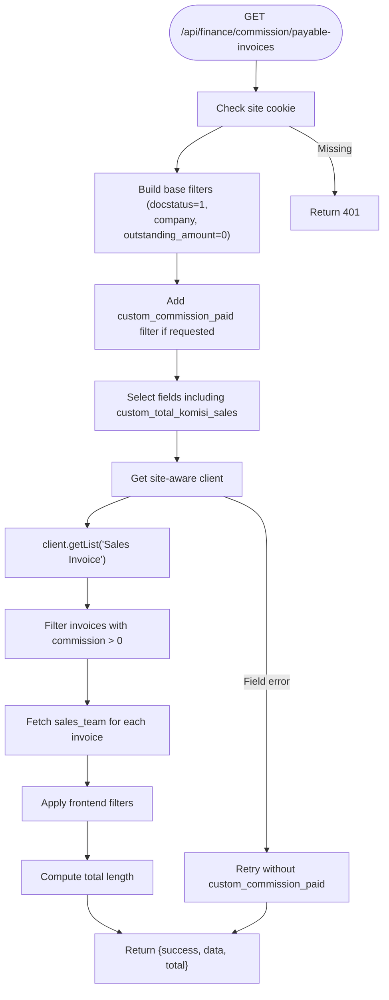
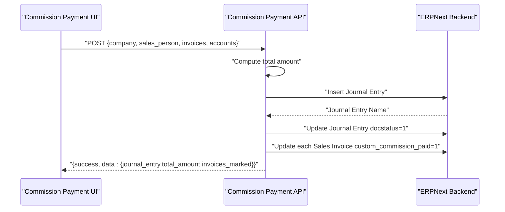
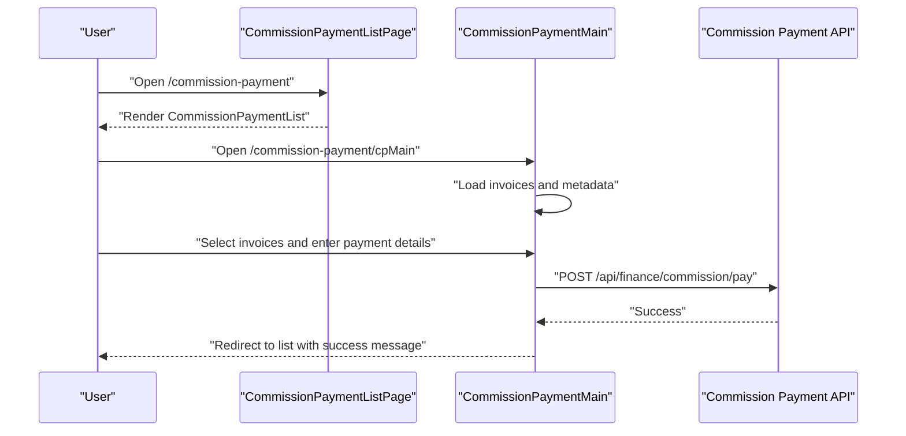
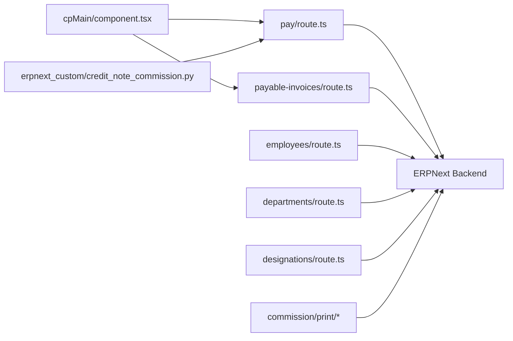

# Human Resources Management

<cite>
**Referenced Files in This Document**
- [app/api/hr/employees/route.ts](file://app/api/hr/employees/route.ts)
- [app/api/hr/departments/route.ts](file://app/api/hr/departments/route.ts)
- [app/api/hr/designations/route.ts](file://app/api/hr/designations/route.ts)
- [app/api/finance/commission/pay/route.ts](file://app/api/finance/commission/pay/route.ts)
- [app/api/finance/commission/payable-invoices/route.ts](file://app/api/finance/commission/payable-invoices/route.ts)
- [app/commission-payment/cpMain/component.tsx](file://app/commission-payment/cpMain/component.tsx)
- [app/commission-payment/cpList/page.tsx](file://app/commission-payment/cpList/page.tsx)
- [app/commission-payment/cpMain/page.tsx](file://app/commission-payment/cpMain/page.tsx)
- [app/commission-payment/page.tsx](file://app/commission-payment/page.tsx)
- [app/reports/commission/print/layout.tsx](file://app/reports/commission/print/layout.tsx)
- [app/reports/commission/print/page.tsx](file://app/reports/commission/print/page.tsx)
- [docs/employee-management/EMPLOYEE_ISSUE_SUMMARY.md](file://docs/employee-management/EMPLOYEE_ISSUE_SUMMARY.md)
- [docs/employee-management/EMPLOYEE_FIX_INSTRUCTIONS.md](file://docs/employee-management/EMPLOYEE_FIX_INSTRUCTIONS.md)
- [docs/employee-management/EMPLOYEE_NAMING_SERIES_FIX.md](file://docs/employee-management/EMPLOYEE_NAMING_SERIES_FIX.md)
- [scripts/fix_employee_naming_series.py](file://scripts/fix_employee_naming_series.py)
- [tests/commission-credit-note-integration.test.ts](file://tests/commission-credit-note-integration.test.ts)
- [erpnext_custom/credit_note_commission.py](file://erpnext_custom/credit_note_commission.py)
</cite>

## Table of Contents
1. [Introduction](#introduction)
2. [Project Structure](#project-structure)
3. [Core Components](#core-components)
4. [Architecture Overview](#architecture-overview)
5. [Detailed Component Analysis](#detailed-component-analysis)
6. [Dependency Analysis](#dependency-analysis)
7. [Performance Considerations](#performance-considerations)
8. [Troubleshooting Guide](#troubleshooting-guide)
9. [Conclusion](#conclusion)
10. [Appendices](#appendices)

## Introduction
This document provides comprehensive documentation for Human Resources Management within the ERP system, focusing on employee management, department tracking, designation management, and the commission calculation and payment workflow. It explains the end-to-end HR workflow from employee registration through commission processing and reporting, and outlines integration points with financial systems and compliance considerations. Practical examples and troubleshooting guidance are included to support daily operations and system maintenance.

## Project Structure
The HR and commission subsystems are organized under the Next.js app router with API routes in the `/app/api` namespace and UI pages/components under `/app`. Key areas:
- HR APIs: Employees, Departments, Designations
- Finance Commission APIs: Payable Invoices, Commission Payment
- UI Pages: Commission Payment List and Main form
- Reports: Commission print layout and page
- Operational documentation and scripts for employee naming series fixes
- Tests and custom extensions for commission-related logic

**Diagram sources**
- [app/commission-payment/page.tsx](file://app/commission-payment/page.tsx#L1-L7)
- [app/commission-payment/cpList/page.tsx](file://app/commission-payment/cpList/page.tsx#L1-L7)
- [app/commission-payment/cpMain/page.tsx](file://app/commission-payment/cpMain/page.tsx#L1-L13)
- [app/api/hr/employees/route.ts](file://app/api/hr/employees/route.ts#L1-L191)
- [app/api/hr/departments/route.ts](file://app/api/hr/departments/route.ts#L1-L33)
- [app/api/hr/designations/route.ts](file://app/api/hr/designations/route.ts#L1-L34)
- [app/api/finance/commission/payable-invoices/route.ts](file://app/api/finance/commission/payable-invoices/route.ts#L1-L224)
- [app/api/finance/commission/pay/route.ts](file://app/api/finance/commission/pay/route.ts#L1-L149)
- [app/reports/commission/print/layout.tsx](file://app/reports/commission/print/layout.tsx)
- [app/reports/commission/print/page.tsx](file://app/reports/commission/print/page.tsx)

**Section sources**
- [app/api/hr/employees/route.ts](file://app/api/hr/employees/route.ts#L1-L191)
- [app/api/hr/departments/route.ts](file://app/api/hr/departments/route.ts#L1-L33)
- [app/api/hr/designations/route.ts](file://app/api/hr/designations/route.ts#L1-L34)
- [app/api/finance/commission/payable-invoices/route.ts](file://app/api/finance/commission/payable-invoices/route.ts#L1-L224)
- [app/api/finance/commission/pay/route.ts](file://app/api/finance/commission/pay/route.ts#L1-L149)
- [app/commission-payment/cpMain/page.tsx](file://app/commission-payment/cpMain/page.tsx#L1-L13)
- [app/commission-payment/cpList/page.tsx](file://app/commission-payment/cpList/page.tsx#L1-L7)
- [app/reports/commission/print/layout.tsx](file://app/reports/commission/print/layout.tsx)
- [app/reports/commission/print/page.tsx](file://app/reports/commission/print/page.tsx)

## Core Components
- Employee Management API: Provides CRUD operations for employees with filtering, pagination, and robust error handling including naming series synchronization issues.
- Department and Designation APIs: Retrieve lists of departments and designations for assignment and reporting.
- Commission Payable Invoices API: Fetches eligible sales invoices with commission amounts, supports filtering and pagination, and handles missing custom fields gracefully.
- Commission Payment API: Creates a Journal Entry for commission payment, submits it, and marks invoices as paid; integrates with ERPNext financials.
- Commission Payment UI: Frontend forms and lists to select invoices, configure payment details, and submit payments.
- Reporting: Commission print layout and page for generating printable reports.

**Section sources**
- [app/api/hr/employees/route.ts](file://app/api/hr/employees/route.ts#L9-L95)
- [app/api/hr/departments/route.ts](file://app/api/hr/departments/route.ts#L9-L32)
- [app/api/hr/designations/route.ts](file://app/api/hr/designations/route.ts#L9-L33)
- [app/api/finance/commission/payable-invoices/route.ts](file://app/api/finance/commission/payable-invoices/route.ts#L9-L171)
- [app/api/finance/commission/pay/route.ts](file://app/api/finance/commission/pay/route.ts#L9-L149)
- [app/commission-payment/cpMain/component.tsx](file://app/commission-payment/cpMain/component.tsx#L32-L247)
- [app/reports/commission/print/layout.tsx](file://app/reports/commission/print/layout.tsx)
- [app/reports/commission/print/page.tsx](file://app/reports/commission/print/page.tsx)

## Architecture Overview
The HR and commission system follows a layered architecture:
- UI pages/components consume API endpoints via fetch requests.
- API routes validate authentication, construct filters, and interact with the ERPNext backend client.
- Financial operations (journal entries and invoice marking) are executed atomically and reported back to the UI.
- Custom extensions and tests support specialized commission logic and integration scenarios.

**Diagram sources**
- [app/commission-payment/cpMain/component.tsx](file://app/commission-payment/cpMain/component.tsx#L188-L236)
- [app/api/finance/commission/pay/route.ts](file://app/api/finance/commission/pay/route.ts#L9-L149)

**Section sources**
- [app/commission-payment/cpMain/component.tsx](file://app/commission-payment/cpMain/component.tsx#L32-L247)
- [app/api/finance/commission/pay/route.ts](file://app/api/finance/commission/pay/route.ts#L9-L149)

## Detailed Component Analysis

### Employee Management API
- Purpose: Retrieve, create, and update employee records with site-aware authentication and error handling.
- Key features:
  - Filtering by status, name, and partial name match.
  - Field selection for consistent data exposure.
  - PUT updates with detailed error extraction.
  - POST creation with naming series synchronization warnings.
- Data model highlights:
  - Fields include identifiers, contact info, employment dates, and department/designation links.
- Error handling:
  - Authentication checks via site-specific cookies.
  - Detailed error messages extracted from server responses.
  - Naming series mismatch detection with remediation guidance.

**Diagram sources**
- [app/api/hr/employees/route.ts](file://app/api/hr/employees/route.ts#L9-L95)

**Section sources**
- [app/api/hr/employees/route.ts](file://app/api/hr/employees/route.ts#L9-L95)
- [app/api/hr/employees/route.ts](file://app/api/hr/employees/route.ts#L97-L148)
- [app/api/hr/employees/route.ts](file://app/api/hr/employees/route.ts#L150-L191)

### Department and Designation APIs
- Purpose: Provide lookup lists for departments and designations used during employee assignment and reporting.
- Behavior:
  - GET endpoints return normalized arrays of names.
  - Ordered by display name for usability.
  - Site-aware client ensures tenant isolation.

**Diagram sources**
- [app/api/hr/departments/route.ts](file://app/api/hr/departments/route.ts#L9-L32)
- [app/api/hr/designations/route.ts](file://app/api/hr/designations/route.ts#L9-L33)

**Section sources**
- [app/api/hr/departments/route.ts](file://app/api/hr/departments/route.ts#L9-L32)
- [app/api/hr/designations/route.ts](file://app/api/hr/designations/route.ts#L9-L33)

### Commission Payable Invoices API
- Purpose: Enumerate sales invoices eligible for commission payment with advanced filtering and fallback handling for missing custom fields.
- Filters:
  - Required: company, docstatus=1, outstanding_amount=0.
  - Optional: status (paid/unpaid/all), invoice number, customer name, sales person, date range.
- Post-processing:
  - Exclude invoices with zero commission.
  - Fetch child table sales_team for each invoice.
  - Apply frontend filters and compute total count.
- Fallback:
  - Retry without custom_commission_paid field if unavailable.

**Diagram sources**
- [app/api/finance/commission/payable-invoices/route.ts](file://app/api/finance/commission/payable-invoices/route.ts#L9-L171)
- [app/api/finance/commission/payable-invoices/route.ts](file://app/api/finance/commission/payable-invoices/route.ts#L187-L223)

**Section sources**
- [app/api/finance/commission/payable-invoices/route.ts](file://app/api/finance/commission/payable-invoices/route.ts#L9-L171)
- [app/api/finance/commission/payable-invoices/route.ts](file://app/api/finance/commission/payable-invoices/route.ts#L187-L223)

### Commission Payment API
- Purpose: Process commission payments by creating and submitting a Journal Entry and marking invoices as paid.
- Steps:
  1. Validate inputs and compute total amount.
  2. Determine liability and cash accounts based on company.
  3. Create Journal Entry with appropriate party type (optional employee).
  4. Submit Journal Entry (set docstatus=1).
  5. Update each invoice to mark commission as paid.
  6. Return consolidated results.
- Security:
  - Authentication via site-specific cookies.
  - Site-aware error logging and responses.

**Diagram sources**
- [app/api/finance/commission/pay/route.ts](file://app/api/finance/commission/pay/route.ts#L9-L149)

**Section sources**
- [app/api/finance/commission/pay/route.ts](file://app/api/finance/commission/pay/route.ts#L9-L149)

### Commission Payment UI
- Pages:
  - Commission Payment List Page: Renders the list component.
  - Commission Payment Main Page: Wraps the main form with suspense and loading spinner.
- Form behavior:
  - Select company and sales person.
  - Load payable invoices with filters.
  - Toggle invoice selection and compute totals.
  - Submit payment with selected invoices and payment details.
  - Redirect on success.

**Diagram sources**
- [app/commission-payment/page.tsx](file://app/commission-payment/page.tsx#L1-L7)
- [app/commission-payment/cpList/page.tsx](file://app/commission-payment/cpList/page.tsx#L1-L7)
- [app/commission-payment/cpMain/page.tsx](file://app/commission-payment/cpMain/page.tsx#L1-L13)
- [app/commission-payment/cpMain/component.tsx](file://app/commission-payment/cpMain/component.tsx#L32-L247)
- [app/api/finance/commission/pay/route.ts](file://app/api/finance/commission/pay/route.ts#L9-L149)

**Section sources**
- [app/commission-payment/page.tsx](file://app/commission-payment/page.tsx#L1-L7)
- [app/commission-payment/cpList/page.tsx](file://app/commission-payment/cpList/page.tsx#L1-L7)
- [app/commission-payment/cpMain/page.tsx](file://app/commission-payment/cpMain/page.tsx#L1-L13)
- [app/commission-payment/cpMain/component.tsx](file://app/commission-payment/cpMain/component.tsx#L32-L247)

### Reporting Capabilities
- Commission Reports:
  - Print layout and page for commission-related reports.
  - Integrates with the broader reporting framework for printable outputs.

**Section sources**
- [app/reports/commission/print/layout.tsx](file://app/reports/commission/print/layout.tsx)
- [app/reports/commission/print/page.tsx](file://app/reports/commission/print/page.tsx)

## Dependency Analysis
- UI depends on API routes for data and actions.
- API routes depend on a site-aware client to communicate with ERPNext.
- Commission Payment API interacts with Journal Entry and Sales Invoice documents.
- Payable Invoices API depends on Sales Invoice and child table sales_team.
- Custom extensions and tests support specialized commission logic and integration scenarios.

**Diagram sources**
- [app/commission-payment/cpMain/component.tsx](file://app/commission-payment/cpMain/component.tsx#L32-L247)
- [app/api/finance/commission/pay/route.ts](file://app/api/finance/commission/pay/route.ts#L9-L149)
- [app/api/finance/commission/payable-invoices/route.ts](file://app/api/finance/commission/payable-invoices/route.ts#L9-L171)
- [app/api/hr/employees/route.ts](file://app/api/hr/employees/route.ts#L1-L191)
- [app/api/hr/departments/route.ts](file://app/api/hr/departments/route.ts#L1-L33)
- [app/api/hr/designations/route.ts](file://app/api/hr/designations/route.ts#L1-L34)
- [erpnext_custom/credit_note_commission.py](file://erpnext_custom/credit_note_commission.py)

**Section sources**
- [app/commission-payment/cpMain/component.tsx](file://app/commission-payment/cpMain/component.tsx#L32-L247)
- [app/api/finance/commission/pay/route.ts](file://app/api/finance/commission/pay/route.ts#L9-L149)
- [app/api/finance/commission/payable-invoices/route.ts](file://app/api/finance/commission/payable-invoices/route.ts#L9-L171)
- [app/api/hr/employees/route.ts](file://app/api/hr/employees/route.ts#L1-L191)
- [app/api/hr/departments/route.ts](file://app/api/hr/departments/route.ts#L1-L33)
- [app/api/hr/designations/route.ts](file://app/api/hr/designations/route.ts#L1-L34)
- [erpnext_custom/credit_note_commission.py](file://erpnext_custom/credit_note_commission.py)

## Performance Considerations
- Pagination and filtering:
  - Use limit_page_length and limit_start to control payload sizes.
  - Apply filters early to reduce dataset size.
- Batch operations:
  - Journal Entry submission and invoice marking occur sequentially; consider batching where feasible to minimize round trips.
- Client-side computation:
  - Totals and selections are computed client-side; keep invoice lists reasonably sized to avoid UI lag.
- Field selection:
  - Limit fields to only those required to reduce bandwidth and processing overhead.

## Troubleshooting Guide
- Employee naming series mismatch:
  - Symptom: Duplicate entry errors during employee creation.
  - Cause: Out-of-sync naming series counters.
  - Resolution: Run the provided script to fix counters and retry.
  - References:
    - [docs/employee-management/EMPLOYEE_ISSUE_SUMMARY.md](file://docs/employee-management/EMPLOYEE_ISSUE_SUMMARY.md)
    - [docs/employee-management/EMPLOYEE_FIX_INSTRUCTIONS.md](file://docs/employee-management/EMPLOYEE_FIX_INSTRUCTIONS.md)
    - [docs/employee-management/EMPLOYEE_NAMING_SERIES_FIX.md](file://docs/employee-management/EMPLOYEE_NAMING_SERIES_FIX.md)
    - [scripts/fix_employee_naming_series.py](file://scripts/fix_employee_naming_series.py)
- Commission payment failures:
  - Verify authentication cookies and site context.
  - Ensure required fields (company, sales_person, invoices) are present.
  - Check that invoices still exist and are eligible (submitted, no outstanding).
  - Review server logs for detailed error messages.
- Payable invoices not appearing:
  - Confirm custom fields exist; the API includes a fallback mechanism.
  - Validate filters (status, date range, customer/sales person).
- Integration with financial reporting:
  - Journal Entries are submitted immediately; verify GL posting and reconcile with financial reports.
  - Use the commission print reports for audit trails.

**Section sources**
- [app/api/hr/employees/route.ts](file://app/api/hr/employees/route.ts#L165-L189)
- [app/api/finance/commission/pay/route.ts](file://app/api/finance/commission/pay/route.ts#L9-L149)
- [app/api/finance/commission/payable-invoices/route.ts](file://app/api/finance/commission/payable-invoices/route.ts#L9-L171)
- [docs/employee-management/EMPLOYEE_ISSUE_SUMMARY.md](file://docs/employee-management/EMPLOYEE_ISSUE_SUMMARY.md)
- [docs/employee-management/EMPLOYEE_FIX_INSTRUCTIONS.md](file://docs/employee-management/EMPLOYEE_FIX_INSTRUCTIONS.md)
- [docs/employee-management/EMPLOYEE_NAMING_SERIES_FIX.md](file://docs/employee-management/EMPLOYEE_NAMING_SERIES_FIX.md)
- [scripts/fix_employee_naming_series.py](file://scripts/fix_employee_naming_series.py)

## Conclusion
The HR and commission subsystem integrates tightly with ERPNext to support employee lifecycle management and commission processing. The APIs provide robust filtering, site-aware authentication, and resilient fallbacks. The UI enables efficient selection and payment of commissions, while reporting and testing artifacts support ongoing operations and quality assurance. Adhering to the troubleshooting and maintenance practices outlined here will help sustain system reliability and compliance.

## Appendices
- Practical examples:
  - Employee registration: Use POST to create an employee; handle naming series errors and retry after fixing counters.
  - Department and designation assignment: Use GET endpoints to populate dropdowns; assign values during employee creation/update.
  - Commission workflow:
    - Load payable invoices with filters and status.
    - Select invoices and enter payment details.
    - Submit payment; verify Journal Entry and invoice statuses.
- Best practices:
  - Keep naming series counters synchronized.
  - Use pagination and filters to optimize performance.
  - Monitor server logs for detailed error messages.
  - Validate custom field availability and rely on fallback mechanisms.