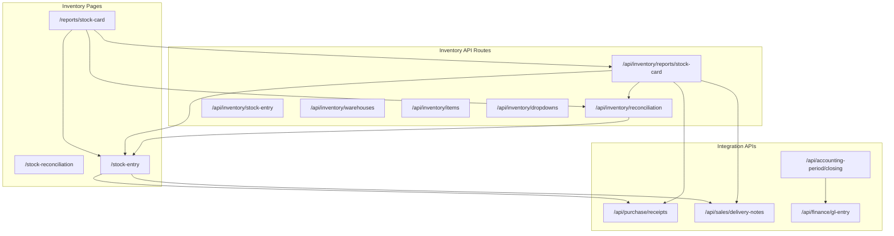
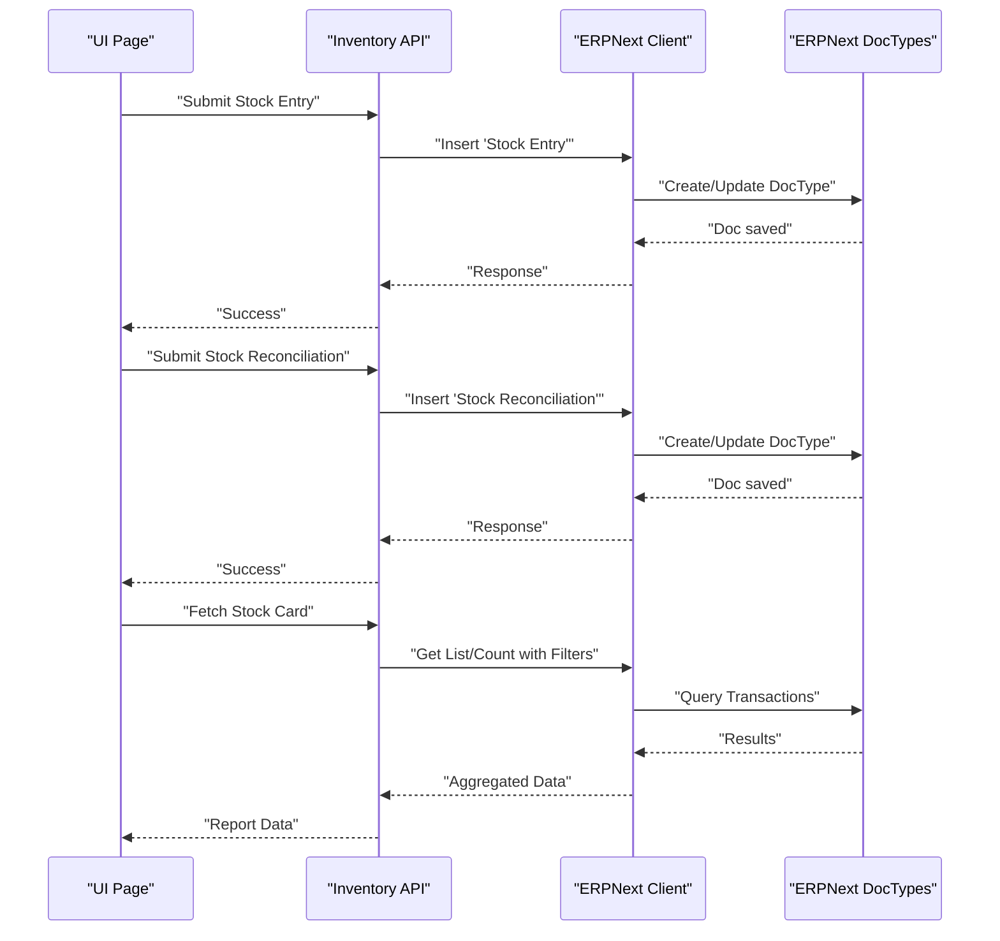
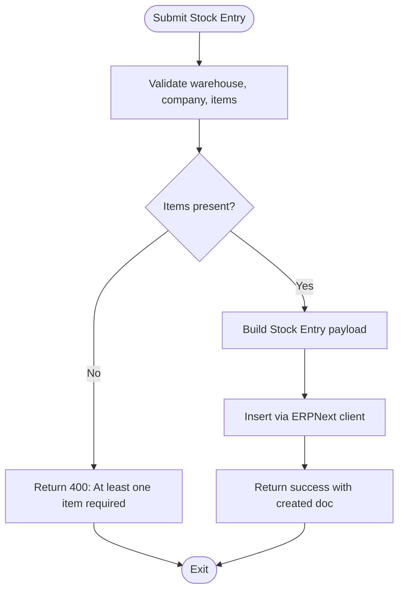
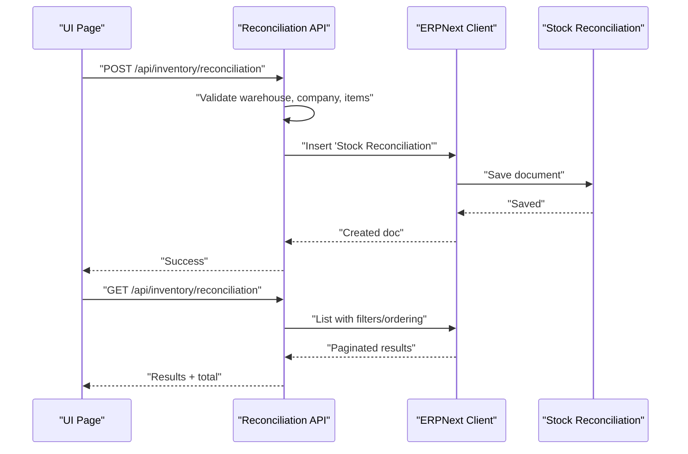
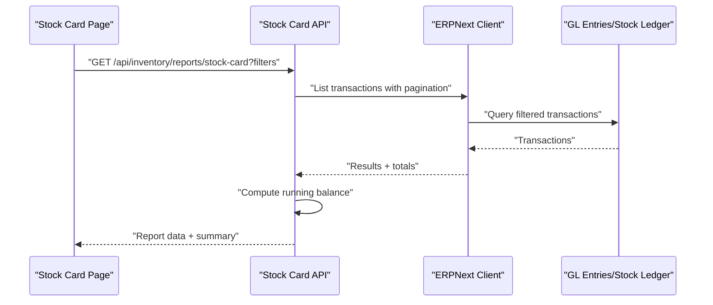
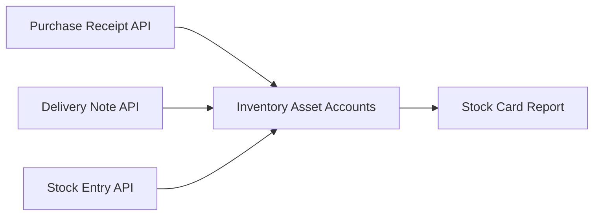
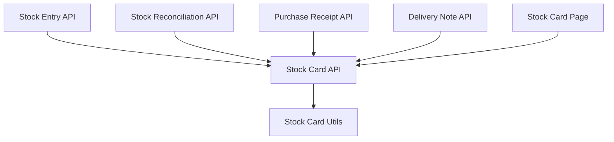

# Inventory Management

<cite>
**Referenced Files in This Document**
- [STOCK_ENTRY_VS_PURCHASE_RECEIPT.md](file://docs/inventory/STOCK_ENTRY_VS_PURCHASE_RECEIPT.md)
- [route.ts](file://app/api/inventory/reconciliation/route.ts)
- [route.ts](file://app/api/inventory/stock-entry/route.ts)
- [route.ts](file://app/api/inventory/reports/stock-card/route.ts)
- [page.tsx](file://app/reports/stock-card/page.tsx)
- [stock-card-utils.ts](file://lib/stock-card-utils.ts)
- [stock-card-summary-calculations.test.ts](file://tests/stock-card-summary-calculations.test.ts)
- [stock-card-pagination.test.ts](file://tests/stock-card-pagination.test.ts)
- [stock-card-filter-state.test.tsx](file://tests/stock-card-filter-state.test.tsx)
- [stock-card-opening-balance.pbt.test.ts](file://tests/stock-card-opening-balance.pbt.test.ts)
- [stock-card-transaction-direction.pbt.test.ts](file://tests/stock-card-transaction-direction.pbt.test.ts)
- [stock-card-report-design.md](file://.kiro/specs/stock-card-report/design.md)
- [stock-card-page-missing-design.md](file://.kiro/specs/stock-card-page-missing/design.md)
- [route.ts](file://app/api/inventory/warehouses/route.ts)
- [route.ts](file://app/api/inventory/items/route.ts)
- [route.ts](file://app/api/inventory/dropdowns/route.ts)
- [route.ts](file://app/api/purchase/receipts/route.ts)
- [route.ts](file://app/api/sales/delivery-notes/route.ts)
- [route.ts](file://app/api/accounting-period/closing/route.ts)
- [route.ts](file://app/api/finance/gl-entry/route.ts)
- [route.ts](file://app/api/hr/employees/route.ts)
- [route.ts](file://app/api/setup/companies/route.ts)
- [route.ts](file://app/api/utils/erpnext/route.ts)
</cite>

## Table of Contents
1. [Introduction](#introduction)
2. [Project Structure](#project-structure)
3. [Core Components](#core-components)
4. [Architecture Overview](#architecture-overview)
5. [Detailed Component Analysis](#detailed-component-analysis)
6. [Dependency Analysis](#dependency-analysis)
7. [Performance Considerations](#performance-considerations)
8. [Troubleshooting Guide](#troubleshooting-guide)
9. [Conclusion](#conclusion)
10. [Appendices](#appendices)

## Introduction
This document provides comprehensive documentation for Inventory Management within the ERP system. It explains the end-to-end inventory workflow from stock movement through reconciliation and reporting. It covers stock entry processing for various transaction types, warehouse-to-warehouse transfers, inventory adjustments, stock reconciliation procedures, physical inventory counting, variance handling, warehouse management, item categorization, batch tracking, valuation methods, inventory reporting, stock card generation, and real-time inventory visibility. Practical examples demonstrate inventory operations, reconciliation workflows, and integration with purchase and sales processes. Finally, it includes troubleshooting guidance for inventory discrepancies and best practices for inventory management.

## Project Structure
The inventory domain is organized around:
- API routes for inventory operations (stock entry, reconciliation, reports, warehouses, items, dropdowns)
- Frontend pages for inventory screens (stock entry, stock reconciliation, stock card report)
- Utility libraries for report calculations
- Tests validating report behavior and pagination
- Supporting documentation clarifying stock entry versus purchase receipt workflows

**Diagram sources**
- [route.ts](file://app/api/inventory/reconciliation/route.ts#L64-L146)
- [route.ts](file://app/api/inventory/stock-entry/route.ts)
- [route.ts](file://app/api/inventory/reports/stock-card/route.ts)
- [page.tsx](file://app/reports/stock-card/page.tsx)
- [route.ts](file://app/api/inventory/warehouses/route.ts)
- [route.ts](file://app/api/inventory/items/route.ts)
- [route.ts](file://app/api/inventory/dropdowns/route.ts)
- [route.ts](file://app/api/purchase/receipts/route.ts)
- [route.ts](file://app/api/sales/delivery-notes/route.ts)
- [route.ts](file://app/api/accounting-period/closing/route.ts)
- [route.ts](file://app/api/finance/gl-entry/route.ts)

**Section sources**
- [route.ts](file://app/api/inventory/reconciliation/route.ts#L64-L146)
- [route.ts](file://app/api/inventory/stock-entry/route.ts)
- [route.ts](file://app/api/inventory/reports/stock-card/route.ts)
- [page.tsx](file://app/reports/stock-card/page.tsx)
- [route.ts](file://app/api/inventory/warehouses/route.ts)
- [route.ts](file://app/api/inventory/items/route.ts)
- [route.ts](file://app/api/inventory/dropdowns/route.ts)

## Core Components
- Stock Reconciliation API: Creates, updates, lists, and deletes stock reconciliation documents with item-level quantities and valuation rates.
- Stock Entry API: Handles internal stock movements, adjustments, transfers, and manufacturing outputs.
- Stock Card Report API: Aggregates inventory transactions by item and filters, returning running balances and summaries.
- Warehouse and Item APIs: Provide warehouse and item metadata for selection and validation.
- Purchase Receipt and Delivery Note APIs: Integrate inventory movements with procurement and sales flows.
- Accounting Period and GL Entry APIs: Ensure period-closed integrity and ledger alignment for inventory adjustments.

**Section sources**
- [route.ts](file://app/api/inventory/reconciliation/route.ts#L64-L146)
- [route.ts](file://app/api/inventory/stock-entry/route.ts)
- [route.ts](file://app/api/inventory/reports/stock-card/route.ts)
- [route.ts](file://app/api/inventory/warehouses/route.ts)
- [route.ts](file://app/api/inventory/items/route.ts)
- [route.ts](file://app/api/inventory/dropdowns/route.ts)
- [route.ts](file://app/api/purchase/receipts/route.ts)
- [route.ts](file://app/api/sales/delivery-notes/route.ts)
- [route.ts](file://app/api/accounting-period/closing/route.ts)
- [route.ts](file://app/api/finance/gl-entry/route.ts)

## Architecture Overview
The inventory architecture centers on document-centric workflows:
- Stock Entry documents record internal movements and adjustments.
- Stock Reconciliation documents capture physical counts and variances.
- Reports consume transactional data to compute balances and support decision-making.
- Integrations ensure purchase receipts and delivery notes update inventory and valuation.

**Diagram sources**
- [route.ts](file://app/api/inventory/stock-entry/route.ts)
- [route.ts](file://app/api/inventory/reconciliation/route.ts#L64-L146)
- [route.ts](file://app/api/inventory/reports/stock-card/route.ts)

## Detailed Component Analysis

### Stock Entry Processing
Stock Entry supports multiple transaction types:
- Material Receipt (internal receipt)
- Material Issue (production consumption)
- Re pack
- Manufacture
- Material Transfer (warehouse-to-warehouse)
- Opening Stock
- Stock write-off

Processing logic validates required fields (warehouse, company) and ensures item entries include quantity and valuation rate. Journal entries depend on the purpose and type, aligning with company valuation settings.

**Diagram sources**
- [route.ts](file://app/api/inventory/stock-entry/route.ts)

**Section sources**
- [route.ts](file://app/api/inventory/stock-entry/route.ts)

### Stock Reconciliation Procedures
Stock Reconciliation captures physical counts and computes variances against system records. The API supports:
- Listing with filters and ordering
- Creating new reconciliations with item-level quantities and valuation rates
- Updating existing reconciliations
- Deleting submitted documents with validation

**Diagram sources**
- [route.ts](file://app/api/inventory/reconciliation/route.ts#L64-L146)

**Section sources**
- [route.ts](file://app/api/inventory/reconciliation/route.ts#L64-L146)

### Warehouse Management
Warehouse endpoints provide:
- Dropdowns for warehouse selection
- Metadata retrieval for validation and display

These are consumed by forms and reports to ensure accurate warehouse assignments during stock entry and delivery note creation.

**Section sources**
- [route.ts](file://app/api/inventory/warehouses/route.ts)
- [route.ts](file://app/api/inventory/dropdowns/route.ts)

### Item Tracking and Valuation
Item endpoints supply:
- Item master data for selection
- Validation of item codes and attributes

Valuation methods and expense inclusion are configured at the company level and influence journal entries for stock adjustments and purchase receipts.

**Section sources**
- [route.ts](file://app/api/inventory/items/route.ts)
- [STOCK_ENTRY_VS_PURCHASE_RECEIPT.md](file://docs/inventory/STOCK_ENTRY_VS_PURCHASE_RECEIPT.md#L184-L215)

### Inventory Reporting and Stock Card Generation
The Stock Card Report aggregates inventory transactions for an item across a date range, computing running balances and classifying transaction directions. It supports:
- Filtering by company, item_code, warehouse, customer/supplier, and transaction type
- Pagination and total count computation
- Summary validation ensuring balance equations and temporal consistency

**Diagram sources**
- [route.ts](file://app/api/inventory/reports/stock-card/route.ts)
- [page.tsx](file://app/reports/stock-card/page.tsx)
- [stock-card-utils.ts](file://lib/stock-card-utils.ts)

**Section sources**
- [route.ts](file://app/api/inventory/reports/stock-card/route.ts)
- [page.tsx](file://app/reports/stock-card/page.tsx)
- [stock-card-utils.ts](file://lib/stock-card-utils.ts)
- [stock-card-summary-calculations.test.ts](file://tests/stock-card-summary-calculations.test.ts#L261-L296)
- [stock-card-pagination.test.ts](file://tests/stock-card-pagination.test.ts#L1-L47)
- [stock-card-report-design.md](file://.kiro/specs/stock-card-report/design.md#L409-L443)
- [stock-card-page-missing-design.md](file://.kiro/specs/stock-card-page-missing/design.md#L80-L99)

### Integration with Purchase and Sales Processes
- Purchase Receipts update inventory asset accounts and track supplier relationships.
- Delivery Notes move inventory out to customers and impact stock balances.
- Stock Entry supports internal adjustments and transfers that do not involve suppliers.

**Diagram sources**
- [route.ts](file://app/api/purchase/receipts/route.ts)
- [route.ts](file://app/api/sales/delivery-notes/route.ts)
- [route.ts](file://app/api/inventory/stock-entry/route.ts)
- [route.ts](file://app/api/inventory/reports/stock-card/route.ts)

**Section sources**
- [route.ts](file://app/api/purchase/receipts/route.ts)
- [route.ts](file://app/api/sales/delivery-notes/route.ts)
- [STOCK_ENTRY_VS_PURCHASE_RECEIPT.md](file://docs/inventory/STOCK_ENTRY_VS_PURCHASE_RECEIPT.md#L1-L363)

## Dependency Analysis
Key dependencies and relationships:
- Stock Card Report depends on transactional data from Stock Entry, Stock Reconciliation, Purchase Receipts, and Delivery Notes.
- Stock Reconciliation and Stock Entry both insert documents that affect inventory balances and valuation.
- Reporting utilities compute running balances and validate temporal consistency and balance equations.
- UI pages coordinate with API routes to provide filtering, pagination, and summary computations.

**Diagram sources**
- [route.ts](file://app/api/inventory/stock-entry/route.ts)
- [route.ts](file://app/api/inventory/reconciliation/route.ts#L64-L146)
- [route.ts](file://app/api/inventory/reports/stock-card/route.ts)
- [route.ts](file://app/api/purchase/receipts/route.ts)
- [route.ts](file://app/api/sales/delivery-notes/route.ts)
- [page.tsx](file://app/reports/stock-card/page.tsx)
- [stock-card-utils.ts](file://lib/stock-card-utils.ts)

**Section sources**
- [route.ts](file://app/api/inventory/stock-entry/route.ts)
- [route.ts](file://app/api/inventory/reconciliation/route.ts#L64-L146)
- [route.ts](file://app/api/inventory/reports/stock-card/route.ts)
- [route.ts](file://app/api/purchase/receipts/route.ts)
- [route.ts](file://app/api/sales/delivery-notes/route.ts)
- [page.tsx](file://app/reports/stock-card/page.tsx)
- [stock-card-utils.ts](file://lib/stock-card-utils.ts)

## Performance Considerations
- Use appropriate filters (company, item_code, warehouse, date range) to reduce dataset sizes for Stock Card queries.
- Apply pagination (page and limit) to avoid large result sets and improve responsiveness.
- Ensure warehouse and item dropdowns are cached or prefetched to minimize repeated network requests.
- Batch reconciliation items judiciously to prevent excessive writes and maintain system throughput.

## Troubleshooting Guide
Common issues and resolutions:
- Incorrect document type selection:
  - Using Stock Entry for supplier receipts leads to misstated expenses and missing liability entries. Use Purchase Receipt or Purchase Invoice instead.
- Missing supplier in Purchase Receipt:
  - Always populate supplier to enable purchase tracking; otherwise, use Stock Entry for internal receipts.
- Misconfigured Stock Adjustment Account:
  - Keep Stock Adjustment as an expense account for adjustments; changing it to a liability alters journal impacts incorrectly.
- Warehouse or company not selected:
  - Stock Entry and Stock Reconciliation require warehouse and company; ensure these fields are present before submission.
- Discrepancies after adjustments:
  - Verify Accounting Period closure and General Ledger entries to ensure inventory adjustments are posted correctly.

**Section sources**
- [STOCK_ENTRY_VS_PURCHASE_RECEIPT.md](file://docs/inventory/STOCK_ENTRY_VS_PURCHASE_RECEIPT.md#L218-L255)
- [route.ts](file://app/api/inventory/stock-entry/route.ts)
- [route.ts](file://app/api/inventory/reconciliation/route.ts#L64-L146)
- [route.ts](file://app/api/accounting-period/closing/route.ts)
- [route.ts](file://app/api/finance/gl-entry/route.ts)

## Conclusion
The inventory module integrates document-centric workflows with robust reporting capabilities. Accurate selection of document types, proper warehouse and company configuration, and adherence to valuation settings ensure reliable stock movements, precise reconciliations, and trustworthy reporting. By leveraging the provided APIs and UI pages, organizations can achieve real-time visibility into inventory positions and maintain strong controls over stock entry, adjustments, and reporting.

## Appendices

### Practical Examples

- Stock Opname (Stock Entry):
  - Scenario: Physical count reveals items not recorded in the system.
  - Action: Create a Stock Entry with purpose “Material Receipt” and specify the expense account for stock adjustment.
  - Impact: Adjusts inventory asset and recognizes an expense, increasing reported profit.

- Warehouse-to-Warehouse Transfer (Stock Entry):
  - Scenario: Move stock from one warehouse to another.
  - Action: Create a Stock Entry with purpose “Material Transfer” and assign source and target warehouses.
  - Impact: Updates warehouse balances without affecting profit/loss.

- Purchase Receipt (Purchase Receipt):
  - Scenario: Goods received but invoice not yet issued.
  - Action: Create a Purchase Receipt; it posts to the “Stock Received But Not Billed” liability account.
  - Impact: No immediate effect on profit; liability recorded until invoice is received.

- Stock Reconciliation:
  - Scenario: After physical inventory, reconcile system quantities with actual counts.
  - Action: Submit a Stock Reconciliation with item quantities and valuation rates.
  - Impact: Generates adjustments to inventory asset and related accounts.

- Stock Card Report:
  - Scenario: Review item movements and running balances across a date range.
  - Action: Filter by company, item_code, warehouse, and date range; apply pagination.
  - Impact: Provides accurate, summarized inventory history for decision-making.

**Section sources**
- [STOCK_ENTRY_VS_PURCHASE_RECEIPT.md](file://docs/inventory/STOCK_ENTRY_VS_PURCHASE_RECEIPT.md#L21-L117)
- [route.ts](file://app/api/inventory/reconciliation/route.ts#L64-L146)
- [route.ts](file://app/api/inventory/reports/stock-card/route.ts)
- [stock-card-summary-calculations.test.ts](file://tests/stock-card-summary-calculations.test.ts#L261-L296)
- [stock-card-pagination.test.ts](file://tests/stock-card-pagination.test.ts#L1-L47)