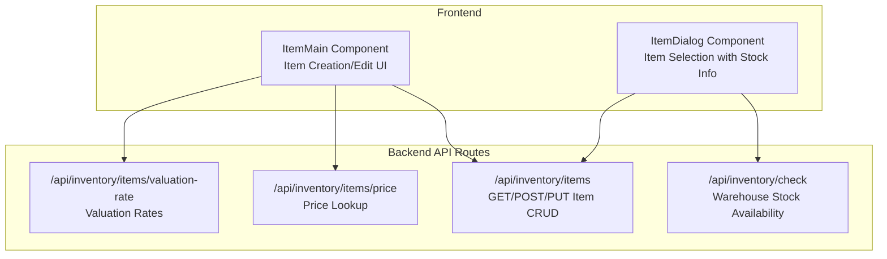
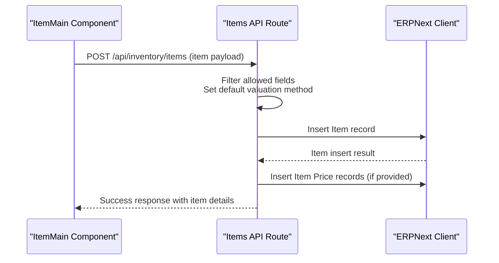
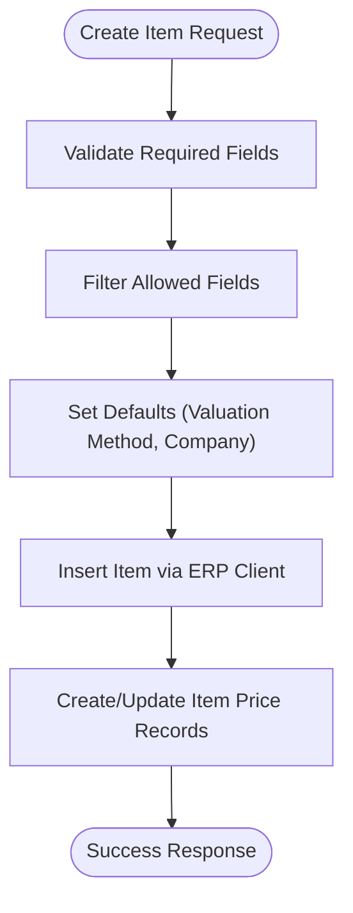
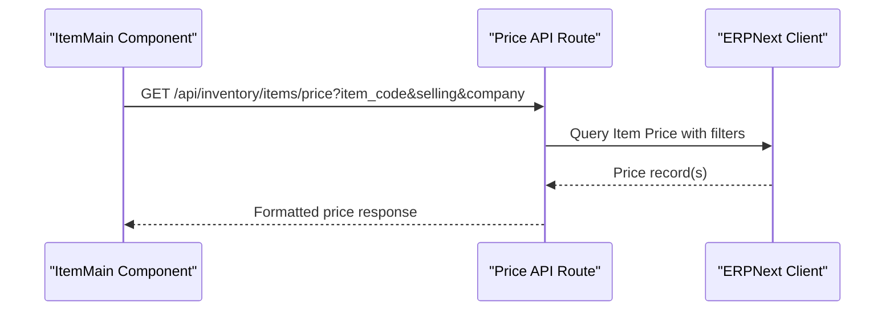
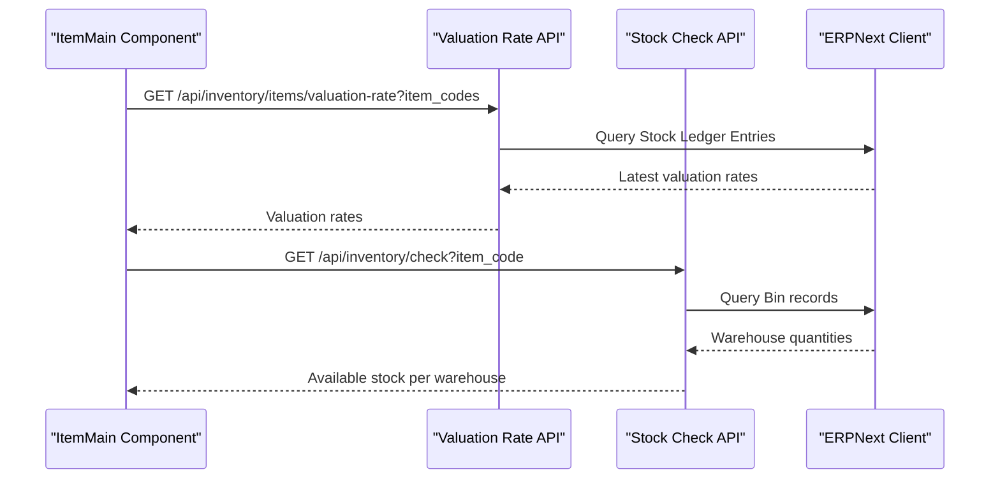
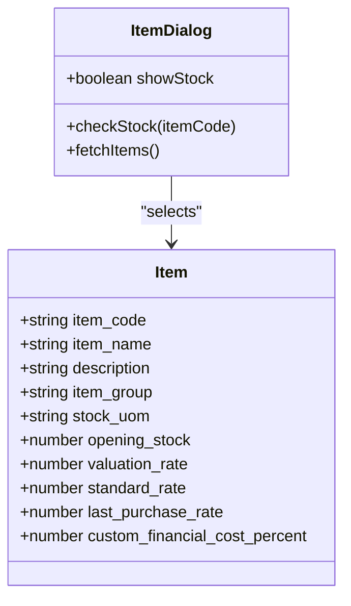
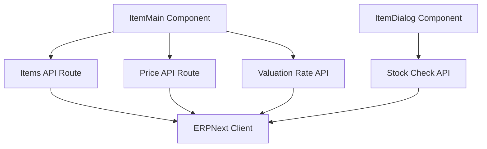

# Item Tracking and Management

<cite>
**Referenced Files in This Document**
- [app/api/inventory/items/route.ts](file://app/api/inventory/items/route.ts)
- [app/items/itemMain/component.tsx](file://app/items/itemMain/component.tsx)
- [app/components/ItemDialog.tsx](file://app/components/ItemDialog.tsx)
- [app/api/inventory/check/route.ts](file://app/api/inventory/check/route.ts)
- [app/api/inventory/items/price/route.ts](file://app/api/inventory/items/price/route.ts)
- [app/api/inventory/items/valuation-rate/route.ts](file://app/api/inventory/items/valuation-rate/route.ts)
- [Items_reconsiliasi.csv](file://Items_reconsiliasi.csv)
</cite>

## Table of Contents
1. [Introduction](#introduction)
2. [Project Structure](#project-structure)
3. [Core Components](#core-components)
4. [Architecture Overview](#architecture-overview)
5. [Detailed Component Analysis](#detailed-component-analysis)
6. [Dependency Analysis](#dependency-analysis)
7. [Performance Considerations](#performance-considerations)
8. [Troubleshooting Guide](#troubleshooting-guide)
9. [Conclusion](#conclusion)
10. [Appendices](#appendices)

## Introduction
This document provides comprehensive guidance for Item Tracking and Management within the ERPNext system. It covers item master data creation and configuration, categorization by groups and brands, unit of measure handling, valuation methods, pricing strategies, price list management, inventory tracking across warehouses, barcode scanning capabilities, serial and batch management, import/export procedures, bulk operations, and integration with purchase and sales workflows. Practical examples and troubleshooting guidance are included to support efficient item configuration and operational excellence.

## Project Structure
The item tracking and management functionality spans frontend components and backend API routes organized under the inventory module. The frontend provides interactive forms and dialogs for item creation, while the backend exposes REST endpoints for querying, creating, updating items, retrieving pricing, valuation rates, and checking inventory availability.

**Diagram sources**
- [app/items/itemMain/component.tsx](file://app/items/itemMain/component.tsx#L1-L664)
- [app/components/ItemDialog.tsx](file://app/components/ItemDialog.tsx#L1-L213)
- [app/api/inventory/items/route.ts](file://app/api/inventory/items/route.ts#L1-L392)
- [app/api/inventory/items/price/route.ts](file://app/api/inventory/items/price/route.ts#L1-L110)
- [app/api/inventory/items/valuation-rate/route.ts](file://app/api/inventory/items/valuation-rate/route.ts#L1-L92)
- [app/api/inventory/check/route.ts](file://app/api/inventory/check/route.ts#L1-L78)

**Section sources**
- [app/items/itemMain/component.tsx](file://app/items/itemMain/component.tsx#L1-L664)
- [app/components/ItemDialog.tsx](file://app/components/ItemDialog.tsx#L1-L213)
- [app/api/inventory/items/route.ts](file://app/api/inventory/items/route.ts#L1-L392)
- [app/api/inventory/items/price/route.ts](file://app/api/inventory/items/price/route.ts#L1-L110)
- [app/api/inventory/items/valuation-rate/route.ts](file://app/api/inventory/items/valuation-rate/route.ts#L1-L92)
- [app/api/inventory/check/route.ts](file://app/api/inventory/check/route.ts#L1-L78)

## Core Components
- ItemMaster Data Management
  - Creation and editing of item master records including item code, name, description, group, brand, unit of measure, opening stock, valuation rate, standard rate, last purchase rate, and financial cost percentage.
  - Automatic generation of item codes and default valuation method assignment during creation.
  - Dropdown data loading for brands, item groups, and units of measure.

- Pricing and Valuation
  - Price lookup against predefined price lists (Purchase and Sales).
  - Valuation rate retrieval from stock ledger entries for moving average costing.
  - Real-time display and formatting of pricing inputs with Indonesian locale.

- Inventory Visibility
  - Warehouse-level stock availability checks with reserved quantity adjustments.
  - Item selection dialog with optional stock visibility across warehouses.

- Import/Export and Bulk Operations
  - CSV template for bulk item reconciliation and edits, supporting fields such as barcode, item code, name, group, warehouse, quantity, UOM, valuation rate, and differences.

**Section sources**
- [app/items/itemMain/component.tsx](file://app/items/itemMain/component.tsx#L1-L664)
- [app/api/inventory/items/route.ts](file://app/api/inventory/items/route.ts#L95-L231)
- [app/api/inventory/items/price/route.ts](file://app/api/inventory/items/price/route.ts#L9-L109)
- [app/api/inventory/items/valuation-rate/route.ts](file://app/api/inventory/items/valuation-rate/route.ts#L9-L91)
- [app/api/inventory/check/route.ts](file://app/api/inventory/check/route.ts#L9-L77)
- [Items_reconsiliasi.csv](file://Items_reconsiliasi.csv#L1-L375)

## Architecture Overview
The item tracking architecture integrates frontend UI components with backend API routes that communicate with the ERPNext data layer. The system supports:
- Item CRUD operations with controlled field filtering and automatic defaults.
- Price management synchronized with Item Price records.
- Inventory visibility via warehouse bins with available quantity calculations.
- Data validation through explicit parameter checks and error handling.

**Diagram sources**
- [app/items/itemMain/component.tsx](file://app/items/itemMain/component.tsx#L268-L302)
- [app/api/inventory/items/route.ts](file://app/api/inventory/items/route.ts#L95-L231)

## Detailed Component Analysis

### Item Creation and Configuration
- Allowed fields for creation include item code, name, description, group, UOM, opening stock, brand, standard rate, last purchase rate, valuation method, and financial cost percentage.
- Default valuation method is set to Moving Average for new items.
- Price records are automatically created or updated against standardized price lists upon item creation or updates.

**Diagram sources**
- [app/api/inventory/items/route.ts](file://app/api/inventory/items/route.ts#L132-L231)

**Section sources**
- [app/api/inventory/items/route.ts](file://app/api/inventory/items/route.ts#L95-L231)

### Item Pricing Strategies and Price List Management
- Price lookup endpoint supports separate price lists for purchase and sales.
- Company-scoped price list filtering with fallback to global price list when company-specific data is unavailable.
- Real-time price display and input formatting with Indonesian locale.

**Diagram sources**
- [app/items/itemMain/component.tsx](file://app/items/itemMain/component.tsx#L134-L213)
- [app/api/inventory/items/price/route.ts](file://app/api/inventory/items/price/route.ts#L9-L109)

**Section sources**
- [app/items/itemMain/component.tsx](file://app/items/itemMain/component.tsx#L134-L213)
- [app/api/inventory/items/price/route.ts](file://app/api/inventory/items/price/route.ts#L9-L109)

### Inventory Control and Valuation Methods
- Valuation rates are retrieved from stock ledger entries, ensuring accurate moving average cost updates.
- Inventory availability checks aggregate actual quantities minus reserved quantities per warehouse.

**Diagram sources**
- [app/api/inventory/items/valuation-rate/route.ts](file://app/api/inventory/items/valuation-rate/route.ts#L9-L91)
- [app/api/inventory/check/route.ts](file://app/api/inventory/check/route.ts#L9-L77)
- [app/items/itemMain/component.tsx](file://app/items/itemMain/component.tsx#L134-L213)

**Section sources**
- [app/api/inventory/items/valuation-rate/route.ts](file://app/api/inventory/items/valuation-rate/route.ts#L9-L91)
- [app/api/inventory/check/route.ts](file://app/api/inventory/check/route.ts#L9-L77)
- [app/items/itemMain/component.tsx](file://app/items/itemMain/component.tsx#L134-L213)

### Item Categorization and Attributes
- Item groups, brands, and units of measure are managed via dropdown APIs and populated into the item form.
- Item selection dialog supports filtering by item code and name, with optional stock visibility across warehouses.

**Diagram sources**
- [app/items/itemMain/component.tsx](file://app/items/itemMain/component.tsx#L10-L53)
- [app/components/ItemDialog.tsx](file://app/components/ItemDialog.tsx#L5-L21)

**Section sources**
- [app/items/itemMain/component.tsx](file://app/items/itemMain/component.tsx#L78-L132)
- [app/components/ItemDialog.tsx](file://app/components/ItemDialog.tsx#L30-L86)

### Barcode Scanning, Serial Number Tracking, and Batch Management
- The system supports barcode scanning through the item selection dialog, enabling quick item lookup by item code.
- Serial and batch tracking are facilitated by the underlying ERPNext framework and can be integrated at the transaction level (e.g., stock entries, purchase receipts, sales invoices). While explicit barcode APIs are not present in the current code, the item selection dialog leverages item_code parameters commonly associated with barcodes.

**Section sources**
- [app/components/ItemDialog.tsx](file://app/components/ItemDialog.tsx#L37-L50)
- [app/api/inventory/check/route.ts](file://app/api/inventory/check/route.ts#L13-L16)

### Inventory Tracking by Variants
- Variant-based inventory tracking is supported through the standard ERPNext variant system. The item creation and pricing endpoints operate at the base item level, while variant-specific stock and pricing are managed within the ERPNext framework.

**Section sources**
- [app/api/inventory/items/route.ts](file://app/api/inventory/items/route.ts#L140-L150)

### Import/Export Procedures and Bulk Operations
- Bulk reconciliation and edits are supported via a CSV template that includes fields such as barcode, item code, name, group, warehouse, quantity, UOM, valuation rate, and difference metrics.
- The template enforces case sensitivity and preserves header structure for accurate processing.

**Section sources**
- [Items_reconsiliasi.csv](file://Items_reconsiliasi.csv#L1-L375)

### Integration with Purchase and Sales Workflows
- Item creation automatically sets valuation method defaults and creates price records aligned with purchase and sales price lists.
- Pricing lookups integrate with purchase and sales workflows by referencing standardized price lists, ensuring consistent pricing across transactions.

**Section sources**
- [app/api/inventory/items/route.ts](file://app/api/inventory/items/route.ts#L152-L231)
- [app/api/inventory/items/price/route.ts](file://app/api/inventory/items/price/route.ts#L29-L46)

## Dependency Analysis
The item management system exhibits clear separation of concerns:
- Frontend components depend on API routes for data operations.
- API routes encapsulate business logic and interact with the ERPNext client.
- Inventory visibility depends on warehouse bin records and stock ledger entries.

**Diagram sources**
- [app/items/itemMain/component.tsx](file://app/items/itemMain/component.tsx#L1-L664)
- [app/components/ItemDialog.tsx](file://app/components/ItemDialog.tsx#L1-L213)
- [app/api/inventory/items/route.ts](file://app/api/inventory/items/route.ts#L1-L392)
- [app/api/inventory/items/price/route.ts](file://app/api/inventory/items/price/route.ts#L1-L110)
- [app/api/inventory/items/valuation-rate/route.ts](file://app/api/inventory/items/valuation-rate/route.ts#L1-L92)
- [app/api/inventory/check/route.ts](file://app/api/inventory/check/route.ts#L1-L78)

**Section sources**
- [app/items/itemMain/component.tsx](file://app/items/itemMain/component.tsx#L1-L664)
- [app/components/ItemDialog.tsx](file://app/components/ItemDialog.tsx#L1-L213)
- [app/api/inventory/items/route.ts](file://app/api/inventory/items/route.ts#L1-L392)
- [app/api/inventory/items/price/route.ts](file://app/api/inventory/items/price/route.ts#L1-L110)
- [app/api/inventory/items/valuation-rate/route.ts](file://app/api/inventory/items/valuation-rate/route.ts#L1-L92)
- [app/api/inventory/check/route.ts](file://app/api/inventory/check/route.ts#L1-L78)

## Performance Considerations
- API endpoints implement pagination and filtering to manage large datasets efficiently.
- Price and valuation lookups leverage targeted queries with appropriate filters to minimize overhead.
- Frontend components debounce user inputs for pricing and stock checks to reduce unnecessary API calls.

## Troubleshooting Guide
Common issues and resolutions:
- Unauthorized Access: Ensure valid session cookies are present for protected endpoints.
- Missing Required Parameters: Verify item_code and selling parameters for price and valuation endpoints.
- No Price Found: Confirm price list existence and company-specific filters; the system falls back to global price list when company-specific data is unavailable.
- Stock Check Failures: Validate item_code parameter and confirm warehouse bin records exist.

**Section sources**
- [app/api/inventory/items/price/route.ts](file://app/api/inventory/items/price/route.ts#L18-L27)
- [app/api/inventory/items/valuation-rate/route.ts](file://app/api/inventory/items/valuation-rate/route.ts#L19-L35)
- [app/api/inventory/check/route.ts](file://app/api/inventory/check/route.ts#L14-L16)

## Conclusion
The Item Tracking and Management system provides robust capabilities for item master data maintenance, categorization, pricing, and inventory visibility. Through structured API endpoints and intuitive frontend components, organizations can streamline item configuration, ensure accurate valuation and pricing, and maintain precise inventory control across warehouses. The inclusion of bulk reconciliation templates and integration-ready components further enhances operational efficiency and data accuracy.

## Appendices
- Practical Setup Examples
  - New Item Creation: Use the item creation form to define item details, categories, and pricing. The system auto-generates item codes and sets default valuation method.
  - Price Updates: Modify purchase or sales prices via the pricing input fields; the system updates Item Price records accordingly.
  - Stock Visibility: Enable stock visibility in the item selection dialog to display available quantities per warehouse.

- API Endpoint Definitions
  - GET /api/inventory/items
    - Purpose: Retrieve paginated item list with customizable fields and filters.
    - Query Parameters: filters, limit, start, order_by, fields.
    - Response: success flag, data array, total_records.

  - POST /api/inventory/items
    - Purpose: Create a new item with validated fields and default valuation method.
    - Body: Item payload with allowed fields.
    - Response: success flag, data, message.

  - PUT /api/inventory/items
    - Purpose: Update item master data and synchronize price records.
    - Body: Item payload with item_code and allowed fields.
    - Response: success flag, data, message.

  - GET /api/inventory/items/price
    - Purpose: Lookup price against purchase or sales price lists.
    - Query Parameters: item_code, selling (0|1), company.
    - Response: success flag, data with formatted price.

  - GET /api/inventory/items/valuation-rate
    - Purpose: Retrieve latest valuation rates from stock ledger entries.
    - Query Parameters: item_codes (comma-separated).
    - Response: success flag, data mapping item codes to valuation rates.

  - GET /api/inventory/check
    - Purpose: Check available stock per warehouse for an item.
    - Query Parameters: item_code.
    - Response: Array of warehouse stock with available, actual, and reserved quantities.

**Section sources**
- [app/api/inventory/items/route.ts](file://app/api/inventory/items/route.ts#L9-L90)
- [app/api/inventory/items/route.ts](file://app/api/inventory/items/route.ts#L95-L391)
- [app/api/inventory/items/price/route.ts](file://app/api/inventory/items/price/route.ts#L9-L109)
- [app/api/inventory/items/valuation-rate/route.ts](file://app/api/inventory/items/valuation-rate/route.ts#L9-L91)
- [app/api/inventory/check/route.ts](file://app/api/inventory/check/route.ts#L9-L77)