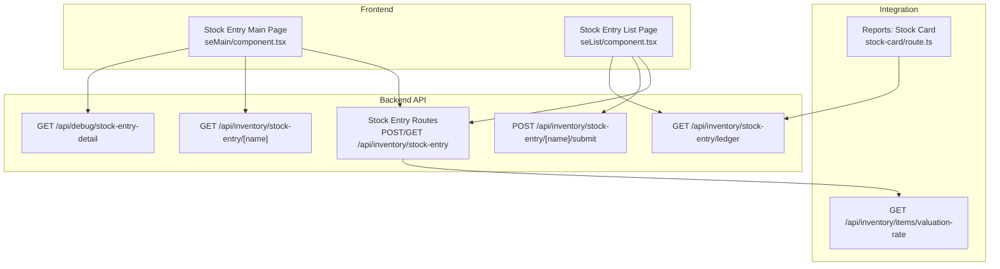
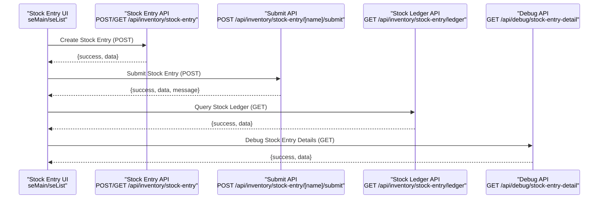
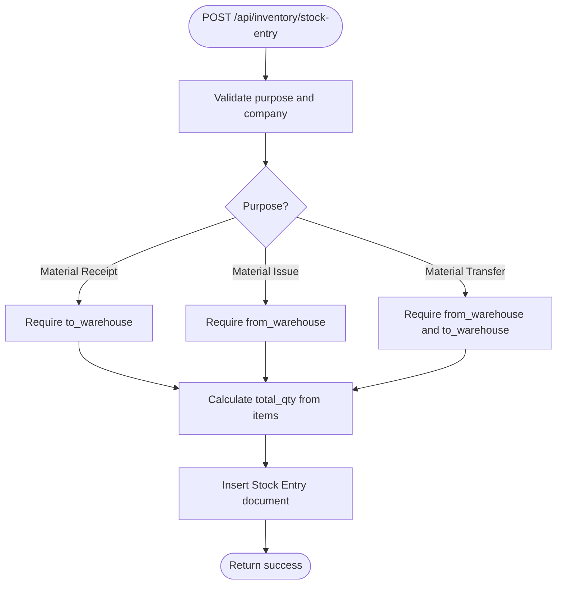
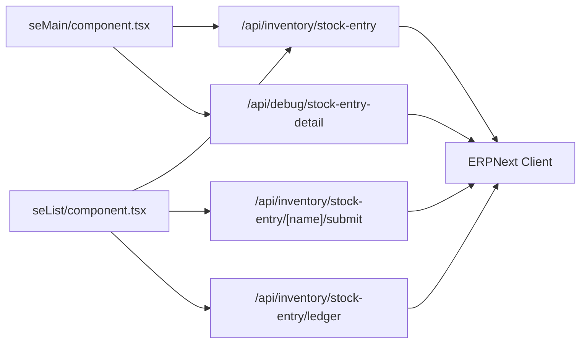

# Stock Entry Operations

<cite>
**Referenced Files in This Document**
- [STOCK_ENTRY_VS_PURCHASE_RECEIPT.md](file://docs/inventory/STOCK_ENTRY_VS_PURCHASE_RECEIPT.md)
- [stock-entry route.ts](file://app/api/inventory/stock-entry/route.ts)
- [stock-entry [name] route.ts](file://app/api/inventory/stock-entry/[name]/route.ts)
- [stock-entry [name]/submit route.ts](file://app/api/inventory/stock-entry/[name]/submit/route.ts)
- [stock-entry ledger route.ts](file://app/api/inventory/stock-entry/ledger/route.ts)
- [stock-entry debug route.ts](file://app/api/debug/stock-entry-detail/route.ts)
- [stock-entry seMain component.tsx](file://app/stock-entry/seMain/component.tsx)
- [stock-entry seList component.tsx](file://app/stock-entry/seList/component.tsx)
- [valuation-rate route.ts](file://app/api/inventory/items/valuation-rate/route.ts)
- [stock-card route.ts](file://app/api/inventory/reports/stock-card/route.ts)
- [stock-card-utils.test.ts](file://tests/stock-card-utils.test.ts)
</cite>

## Table of Contents
1. [Introduction](#introduction)
2. [Project Structure](#project-structure)
3. [Core Components](#core-components)
4. [Architecture Overview](#architecture-overview)
5. [Detailed Component Analysis](#detailed-component-analysis)
6. [Dependency Analysis](#dependency-analysis)
7. [Performance Considerations](#performance-considerations)
8. [Troubleshooting Guide](#troubleshooting-guide)
9. [Conclusion](#conclusion)
10. [Appendices](#appendices)

## Introduction
This document provides comprehensive coverage of Stock Entry Operations within the ERPNext system, focusing on inventory movement processing. It explains how to create stock entries for different transaction types (Material Receipt, Material Issue, Material Transfer, Manufacture, Repack), the end-to-end workflow from creation through submission and posting, validation rules, item quantity calculations, valuation methods, warehouse-to-warehouse transfers, serial and batch tracking, material consumption workflows, approval and cancellation procedures, audit trails, integration with purchase receipts and delivery notes, practical examples, and API endpoints for real-time inventory updates.

## Project Structure
The stock entry functionality spans frontend pages/components and backend API routes. The frontend provides forms and lists for creating, viewing, filtering, and submitting stock entries. The backend exposes REST endpoints for listing, creating, retrieving, submitting stock entries, accessing the stock ledger, and debugging stock entry details.

**Diagram sources**
- [stock-entry route.ts](file://app/api/inventory/stock-entry/route.ts#L1-L180)
- [stock-entry [name] route.ts](file://app/api/inventory/stock-entry/[name]/route.ts#L1-L62)
- [stock-entry [name]/submit route.ts](file://app/api/inventory/stock-entry/[name]/submit/route.ts#L1-L43)
- [stock-entry ledger route.ts](file://app/api/inventory/stock-entry/ledger/route.ts#L1-L87)
- [stock-entry debug route.ts](file://app/api/debug/stock-entry-detail/route.ts#L1-L223)
- [stock-entry seMain component.tsx](file://app/stock-entry/seMain/component.tsx#L1-L548)
- [stock-entry seList component.tsx](file://app/stock-entry/seList/component.tsx#L1-L683)
- [valuation-rate route.ts](file://app/api/inventory/items/valuation-rate/route.ts#L39-L91)
- [stock-card route.ts](file://app/api/inventory/reports/stock-card/route.ts#L176-L200)

**Section sources**
- [stock-entry route.ts](file://app/api/inventory/stock-entry/route.ts#L1-L180)
- [stock-entry seMain component.tsx](file://app/stock-entry/seMain/component.tsx#L1-L548)
- [stock-entry seList component.tsx](file://app/stock-entry/seList/component.tsx#L1-L683)

## Core Components
- Stock Entry Creation API: Validates purpose and company, enforces warehouse requirements per purpose, calculates total quantities, and inserts the document.
- Stock Entry Retrieval API: Fetches a single stock entry with embedded items.
- Stock Entry Submission API: Submits a draft stock entry to move inventory and create GL entries.
- Stock Ledger API: Retrieves stock ledger entries for reporting and debugging.
- Debug Endpoint: Provides detailed stock entry document, items, totals, additional costs, and GL entries.
- Frontend Forms: Provide interactive creation, editing, and submission of stock entries with warehouse auto-fill logic and item selection dialogs.
- Valuation Integration: Retrieves latest valuation rates from stock ledger entries for accurate item pricing.
- Stock Card Integration: Fetches warehouse information for stock entry transfers to enrich reports.

**Section sources**
- [stock-entry route.ts](file://app/api/inventory/stock-entry/route.ts#L80-L180)
- [stock-entry [name] route.ts](file://app/api/inventory/stock-entry/[name]/route.ts#L9-L62)
- [stock-entry [name]/submit route.ts](file://app/api/inventory/stock-entry/[name]/submit/route.ts#L9-L43)
- [stock-entry ledger route.ts](file://app/api/inventory/stock-entry/ledger/route.ts#L9-L87)
- [stock-entry debug route.ts](file://app/api/debug/stock-entry-detail/route.ts#L13-L223)
- [stock-entry seMain component.tsx](file://app/stock-entry/seMain/component.tsx#L21-L548)
- [stock-entry seList component.tsx](file://app/stock-entry/seList/component.tsx#L41-L683)
- [valuation-rate route.ts](file://app/api/inventory/items/valuation-rate/route.ts#L39-L91)
- [stock-card route.ts](file://app/api/inventory/reports/stock-card/route.ts#L176-L200)

## Architecture Overview
The system follows a client-server architecture:
- Frontend Next.js pages call backend API routes via fetch requests.
- Backend routes authenticate using site-aware cookies, construct filters, and interact with the ERPNext client to perform CRUD operations on Stock Entry documents.
- Validation occurs both on the frontend (UI constraints) and backend (route-level checks).
- Real-time inventory updates are reflected through stock ledger queries and valuation lookups.

**Diagram sources**
- [stock-entry route.ts](file://app/api/inventory/stock-entry/route.ts#L80-L180)
- [stock-entry [name]/submit route.ts](file://app/api/inventory/stock-entry/[name]/submit/route.ts#L9-L43)
- [stock-entry ledger route.ts](file://app/api/inventory/stock-entry/ledger/route.ts#L9-L87)
- [stock-entry debug route.ts](file://app/api/debug/stock-entry-detail/route.ts#L13-L223)
- [stock-entry seMain component.tsx](file://app/stock-entry/seMain/component.tsx#L167-L225)
- [stock-entry seList component.tsx](file://app/stock-entry/seList/component.tsx#L264-L289)

## Detailed Component Analysis

### Stock Entry Creation API
- Purpose validation: Requires purpose and company; rejects missing fields.
- Warehouse validation: 
  - Material Receipt requires a target warehouse.
  - Material Issue requires a source warehouse.
  - Material Transfer requires both source and target warehouses.
- Quantity calculation: Sums transfer_qty or qty across items to compute total_qty.
- Item mapping: Ensures items include item_code, qty, transfer_qty, and optional serial/batch tracking.

**Diagram sources**
- [stock-entry route.ts](file://app/api/inventory/stock-entry/route.ts#L101-L167)

**Section sources**
- [stock-entry route.ts](file://app/api/inventory/stock-entry/route.ts#L80-L180)

### Stock Entry Retrieval API
- Fetches a single stock entry by name and returns the document with embedded items.

**Section sources**
- [stock-entry [name] route.ts](file://app/api/inventory/stock-entry/[name]/route.ts#L9-L62)

### Stock Entry Submission API
- Submits a draft stock entry, transitioning it to submitted status and generating GL entries.

**Section sources**
- [stock-entry [name]/submit route.ts](file://app/api/inventory/stock-entry/[name]/submit/route.ts#L9-L43)

### Stock Ledger API
- Filters stock ledger entries by company, item_code, warehouse, voucher_type, and date range.
- Returns recent transactions sorted by posting date/time.

**Section sources**
- [stock-entry ledger route.ts](file://app/api/inventory/stock-entry/ledger/route.ts#L9-L87)

### Debug Endpoint for Stock Entry
- Retrieves detailed stock entry document, items, totals, additional costs, and GL entries.
- Calculates GL totals and verifies debit/credit balance.

**Section sources**
- [stock-entry debug route.ts](file://app/api/debug/stock-entry-detail/route.ts#L13-L223)

### Frontend Stock Entry Main Component
- Provides form controls for purpose, posting date/time, warehouse selection, and item rows.
- Auto-fills warehouse fields based on purpose and selected header warehouse.
- Validates required fields and prevents submission of already submitted entries.
- Integrates with item selection dialog and warehouse dropdown.

**Section sources**
- [stock-entry seMain component.tsx](file://app/stock-entry/seMain/component.tsx#L21-L548)

### Frontend Stock Entry List Component
- Lists stock entries with filters (purpose, warehouse, date range, search term).
- Supports pagination and submit action for draft entries.
- Shows status badges and enables navigation to edit/view mode.

**Section sources**
- [stock-entry seList component.tsx](file://app/stock-entry/seList/component.tsx#L41-L683)

### Valuation Integration
- Retrieves latest valuation rates per item from stock ledger entries for accurate pricing.

**Section sources**
- [valuation-rate route.ts](file://app/api/inventory/items/valuation-rate/route.ts#L39-L91)

### Stock Card Integration
- Fetches warehouse information for stock entry transfers to enrich reports.

**Section sources**
- [stock-card route.ts](file://app/api/inventory/reports/stock-card/route.ts#L176-L200)

## Dependency Analysis
- UI components depend on backend APIs for data retrieval and mutations.
- Backend routes depend on the ERPNext client abstraction for database operations.
- Debug and ledger endpoints rely on filters and ordering to present actionable insights.
- Validation logic is duplicated between frontend and backend to ensure robustness.

**Diagram sources**
- [stock-entry seMain component.tsx](file://app/stock-entry/seMain/component.tsx#L167-L225)
- [stock-entry seList component.tsx](file://app/stock-entry/seList/component.tsx#L264-L289)
- [stock-entry route.ts](file://app/api/inventory/stock-entry/route.ts#L80-L180)
- [stock-entry [name]/submit route.ts](file://app/api/inventory/stock-entry/[name]/submit/route.ts#L9-L43)
- [stock-entry debug route.ts](file://app/api/debug/stock-entry-detail/route.ts#L93-L223)
- [stock-entry ledger route.ts](file://app/api/inventory/stock-entry/ledger/route.ts#L67-L87)

**Section sources**
- [stock-entry seMain component.tsx](file://app/stock-entry/seMain/component.tsx#L167-L225)
- [stock-entry seList component.tsx](file://app/stock-entry/seList/component.tsx#L264-L289)
- [stock-entry route.ts](file://app/api/inventory/stock-entry/route.ts#L80-L180)

## Performance Considerations
- Filtering and ordering on the backend reduce payload sizes and improve responsiveness.
- Pagination parameters (limit_page_length, limit_start) should be tuned based on dataset volume.
- Avoid excessive re-renders by memoizing handlers and using controlled components.
- Batch operations (e.g., multiple item rows) should minimize repeated network calls.

## Troubleshooting Guide
Common issues and resolutions:
- Unauthorized Access: Ensure site-specific cookies are present; otherwise, API routes return unauthorized responses.
- Missing Required Fields: Purpose and company are mandatory; warehouse requirements vary by purpose.
- Incorrect Warehouse Configuration: Material Receipt requires to_warehouse; Material Issue requires from_warehouse; Material Transfer requires both.
- Already Submitted Entries: Prevent edits to submitted entries; use the list view to manage submissions.
- Validation Failures: Validate item rows (item_code and qty > 0) before submission.
- Audit Trail: Use the debug endpoint to inspect GL entries and totals for accuracy.

**Section sources**
- [stock-entry route.ts](file://app/api/inventory/stock-entry/route.ts#L101-L131)
- [stock-entry seMain component.tsx](file://app/stock-entry/seMain/component.tsx#L173-L201)
- [stock-entry debug route.ts](file://app/api/debug/stock-entry-detail/route.ts#L125-L202)

## Conclusion
Stock Entry Operations in this system provide a robust framework for managing inventory movements across Material Receipt, Material Issue, Material Transfer, Manufacture, and Repack. The combination of frontend forms, backend APIs, and integrated reporting ensures accurate validations, real-time inventory updates, and comprehensive audit trails. Proper use of purpose-specific validations, warehouse requirements, and submission workflows guarantees reliable inventory processing aligned with ERPNext business logic.

## Appendices

### API Endpoints Summary
- GET /api/inventory/stock-entry
  - Purpose: List stock entries with filters and pagination.
  - Query Parameters: filters (JSON-encoded), order_by, limit_page_length, limit_start.
  - Authentication: Requires site-aware cookie.
- POST /api/inventory/stock-entry
  - Purpose: Create a new stock entry.
  - Body: purpose, posting_date, posting_time, from_warehouse, to_warehouse, items, company.
  - Validation: Purpose/company required; warehouse requirements per purpose; total_qty calculated.
- GET /api/inventory/stock-entry/[name]
  - Purpose: Retrieve a single stock entry with items.
- POST /api/inventory/stock-entry/[name]/submit
  - Purpose: Submit a draft stock entry.
- GET /api/inventory/stock-entry/ledger
  - Purpose: Query stock ledger entries with filters (company, item_code, warehouse, voucher_type, from_date, to_date).
- GET /api/debug/stock-entry-detail?name=[Stock Entry Name]
  - Purpose: Debug detailed stock entry document, items, totals, additional costs, and GL entries.

**Section sources**
- [stock-entry route.ts](file://app/api/inventory/stock-entry/route.ts#L9-L180)
- [stock-entry [name] route.ts](file://app/api/inventory/stock-entry/[name]/route.ts#L9-L62)
- [stock-entry [name]/submit route.ts](file://app/api/inventory/stock-entry/[name]/submit/route.ts#L9-L43)
- [stock-entry ledger route.ts](file://app/api/inventory/stock-entry/ledger/route.ts#L9-L87)
- [stock-entry debug route.ts](file://app/api/debug/stock-entry-detail/route.ts#L13-L223)

### Practical Examples and Workflows
- Stock Opname (Stock Entry):
  - Use Material Receipt purpose with to_warehouse to record discovered inventory differences.
  - Journal impacts expenses and inventory valuation appropriately.
- Purchase Receipt vs Stock Entry:
  - Purchase Receipt records supplier deliveries and links to Purchase Invoice.
  - Stock Entry is for internal adjustments and movements; avoid using it for supplier receipts.
- Warehouse Transfers:
  - Material Transfer requires both from_warehouse and to_warehouse; no journal impact, only inventory movement.
- Serial and Batch Tracking:
  - Items can include serial_no and batch_no during creation; ensure compliance with item settings.
- Material Consumption:
  - Material Issue entries consume inventory from a source warehouse for production or usage.
- Approval and Cancellation:
  - Draft entries can be submitted; cancellation workflows rely on GL reversals and verification for financial integrity.
- Audit Trails:
  - Use the debug endpoint to review GL entries and totals for each stock entry.

**Section sources**
- [STOCK_ENTRY_VS_PURCHASE_RECEIPT.md](file://docs/inventory/STOCK_ENTRY_VS_PURCHASE_RECEIPT.md#L1-L363)
- [stock-entry debug route.ts](file://app/api/debug/stock-entry-detail/route.ts#L92-L213)

### Integration Notes
- Stock Card Reports:
  - Warehouse information for stock entry transfers is fetched to enrich report data.
- Valuation Rates:
  - Latest valuation rates are retrieved from stock ledger entries to ensure accurate item pricing.

**Section sources**
- [stock-card route.ts](file://app/api/inventory/reports/stock-card/route.ts#L176-L200)
- [valuation-rate route.ts](file://app/api/inventory/items/valuation-rate/route.ts#L39-L91)