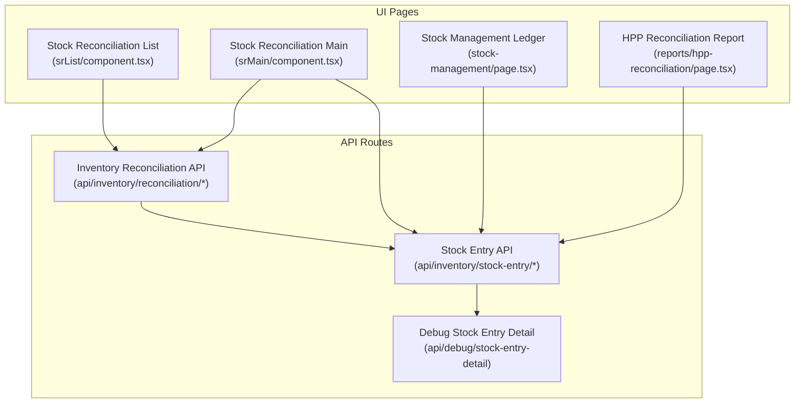
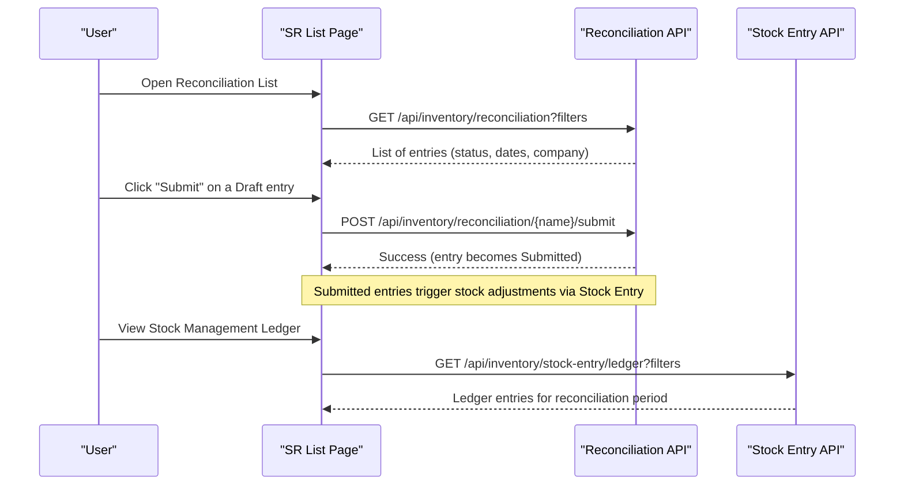
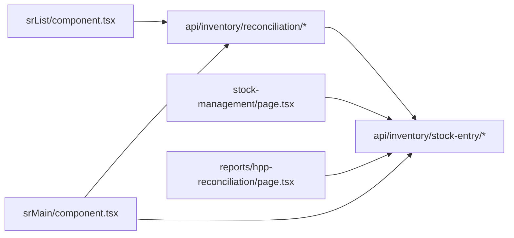

# Stock Reconciliation

<cite>
**Referenced Files in This Document**
- [app/stock-reconciliation/page.tsx](file://app/stock-reconciliation/page.tsx)
- [app/stock-reconciliation/srList/component.tsx](file://app/stock-reconciliation/srList/component.tsx)
- [app/stock-reconciliation/srMain/component.tsx](file://app/stock-reconciliation/srMain/component.tsx)
- [app/api/inventory/reconciliation/route.ts](file://app/api/inventory/reconciliation/route.ts)
- [app/api/inventory/reconciliation/[name]/route.ts](file://app/api/inventory/reconciliation/[name]/route.ts)
- [app/api/inventory/reconciliation/[name]/submit/route.ts](file://app/api/inventory/reconciliation/[name]/submit/route.ts)
- [app/api/inventory/stock-entry/route.ts](file://app/api/inventory/stock-entry/route.ts)
- [app/api/debug/stock-entry-detail/route.ts](file://app/api/debug/stock-entry-detail/route.ts)
- [app/stock-management/page.tsx](file://app/stock-management/page.tsx)
- [app/reports/hpp-reconciliation/page.tsx](file://app/reports/hpp-reconciliation/page.tsx)
</cite>

## Table of Contents
1. [Introduction](#introduction)
2. [Project Structure](#project-structure)
3. [Core Components](#core-components)
4. [Architecture Overview](#architecture-overview)
5. [Detailed Component Analysis](#detailed-component-analysis)
6. [Dependency Analysis](#dependency-analysis)
7. [Performance Considerations](#performance-considerations)
8. [Troubleshooting Guide](#troubleshooting-guide)
9. [Conclusion](#conclusion)
10. [Appendices](#appendices)

## Introduction
This document explains the Stock Reconciliation process in the system, covering planning, execution, and posting of inventory adjustments. It describes how physical counts are captured, how variances are computed and posted, and how the system integrates with inventory valuation and accounting. It also documents the approval workflow, reporting, audit trail, and API endpoints used to manage reconciliation entries.

## Project Structure
The Stock Reconciliation feature is implemented as a Next.js app with a dedicated UI and a set of server-side API routes. The UI is composed of:
- A list page to view, filter, and submit reconciliation entries
- A main form page to create or edit reconciliation entries with item rows
- Supporting API routes for CRUD operations, submission, and integration with stock entry and reporting

**Diagram sources**
- [app/stock-reconciliation/srList/component.tsx](file://app/stock-reconciliation/srList/component.tsx#L1-L376)
- [app/stock-reconciliation/srMain/component.tsx](file://app/stock-reconciliation/srMain/component.tsx#L1-L800)
- [app/stock-management/page.tsx](file://app/stock-management/page.tsx#L1-L417)
- [app/reports/hpp-reconciliation/page.tsx](file://app/reports/hpp-reconciliation/page.tsx#L1-L353)
- [app/api/inventory/reconciliation/route.ts](file://app/api/inventory/reconciliation/route.ts#L1-L254)
- [app/api/inventory/stock-entry/route.ts](file://app/api/inventory/stock-entry/route.ts#L1-L180)
- [app/api/debug/stock-entry-detail/route.ts](file://app/api/debug/stock-entry-detail/route.ts#L1-L223)

**Section sources**
- [app/stock-reconciliation/page.tsx](file://app/stock-reconciliation/page.tsx#L1-L8)
- [app/stock-reconciliation/srList/component.tsx](file://app/stock-reconciliation/srList/component.tsx#L1-L376)
- [app/stock-reconciliation/srMain/component.tsx](file://app/stock-reconciliation/srMain/component.tsx#L1-L800)
- [app/api/inventory/reconciliation/route.ts](file://app/api/inventory/reconciliation/route.ts#L1-L254)

## Core Components
- Stock Reconciliation List: Displays a paginated, filterable list of reconciliation entries with status badges and a submit action for Draft entries.
- Stock Reconciliation Main: Provides a form to create or edit reconciliation entries, including item rows with quantity and valuation rate, CSV upload support, and save actions.
- API Reconciliation: Implements CRUD and submit operations for Stock Reconciliation documents.
- Stock Entry Integration: Provides stock movement APIs used during reconciliation posting and debugging.
- Reporting: Offers HPP Reconciliation report to validate cost of goods sold versus sales.

Key behaviors:
- Validation prevents edits on submitted or cancelled entries.
- Submit action transitions entries from Draft to Submitted.
- Item rows support manual entry and CSV import.
- Filtering supports company, date range, and optional warehouse (with caveats noted in the API).

**Section sources**
- [app/stock-reconciliation/srList/component.tsx](file://app/stock-reconciliation/srList/component.tsx#L1-L376)
- [app/stock-reconciliation/srMain/component.tsx](file://app/stock-reconciliation/srMain/component.tsx#L1-L800)
- [app/api/inventory/reconciliation/route.ts](file://app/api/inventory/reconciliation/route.ts#L1-L254)
- [app/api/inventory/reconciliation/[name]/submit/route.ts](file://app/api/inventory/reconciliation/[name]/submit/route.ts#L1-L54)

## Architecture Overview
The reconciliation workflow spans UI pages and API routes. The UI interacts with the backend via REST-like endpoints to manage reconciliation documents and integrate with stock entry operations.

**Diagram sources**
- [app/stock-reconciliation/srList/component.tsx](file://app/stock-reconciliation/srList/component.tsx#L122-L149)
- [app/api/inventory/reconciliation/[name]/submit/route.ts](file://app/api/inventory/reconciliation/[name]/submit/route.ts#L9-L53)
- [app/api/inventory/reconciliation/route.ts](file://app/api/inventory/reconciliation/route.ts#L9-L91)
- [app/stock-management/page.tsx](file://app/stock-management/page.tsx#L93-L182)

## Detailed Component Analysis

### Stock Reconciliation List (srList)
Responsibilities:
- Load and display reconciliation entries with status, posting date/time, warehouse, and purpose
- Apply filters: search term, warehouse, status, date range
- Submit Draft entries to move them to Submitted state
- Paginate results

Approval workflow:
- Only Draft entries can be submitted.
- Submit triggers a server-side submit operation that validates docstatus and posts the document.

Reporting and integration:
- Uses the reconciliation API for listing and submit actions.
- Integrates with stock entry ledger for cross-checking.

**Section sources**
- [app/stock-reconciliation/srList/component.tsx](file://app/stock-reconciliation/srList/component.tsx#L42-L149)

### Stock Reconciliation Main (srMain)
Responsibilities:
- Create or edit a reconciliation entry with header fields (warehouse, posting date/time, purpose)
- Manage item rows: add, remove, edit, search, and paginate
- Import items via CSV upload
- Save as Draft or update an existing Draft entry
- Validate required fields and prevent edits on Submitted/Cancelled entries

Item listing and quantities:
- Each item row includes item code, name, warehouse, quantity, and stock UOM.
- Quantity editing supports localized formatting and validation.
- CSV upload parses a predefined column layout and merges into the item list.

Variance handling:
- The UI captures counted quantities; valuation rates are editable per item.
- Posting converts these differences into stock adjustments via Stock Entry operations.

**Section sources**
- [app/stock-reconciliation/srMain/component.tsx](file://app/stock-reconciliation/srMain/component.tsx#L38-L429)

### API: Inventory Reconciliation
Endpoints:
- GET /api/inventory/reconciliation
  - Lists reconciliation entries with filters and pagination
  - Returns total records count
- POST /api/inventory/reconciliation
  - Creates a new reconciliation entry with items
- PUT /api/inventory/reconciliation/{name}
  - Updates an existing reconciliation entry (prevents updates on Submitted)
- DELETE /api/inventory/reconciliation?name={name}
  - Deletes a reconciliation entry (prevents deletion on Submitted)

Validation and constraints:
- Requires company and warehouse for creation/update
- Rejects updates when docstatus is Submitted
- Rejects deletion when docstatus is Submitted; cancel first

**Section sources**
- [app/api/inventory/reconciliation/route.ts](file://app/api/inventory/reconciliation/route.ts#L9-L254)

### API: Reconciliation Document (by name)
Endpoints:
- GET /api/inventory/reconciliation/{name}
  - Retrieves a single reconciliation document
- PUT /api/inventory/reconciliation/{name}
  - Updates the document (prevents updates on Submitted)
- DELETE /api/inventory/reconciliation/{name}
  - Deletes the document (prevents deletion on Submitted)

**Section sources**
- [app/api/inventory/reconciliation/[name]/route.ts](file://app/api/inventory/reconciliation/[name]/route.ts#L9-L93)

### API: Submit Reconciliation
Endpoint:
- POST /api/inventory/reconciliation/{name}/submit
  - Submits a Draft reconciliation entry
  - Prevents submission if already Submitted or Cancelled

Impact:
- Submission triggers stock adjustments via Stock Entry operations
- After submission, the entry becomes immutable for edits

**Section sources**
- [app/api/inventory/reconciliation/[name]/submit/route.ts](file://app/api/inventory/reconciliation/[name]/submit/route.ts#L9-L53)

### Stock Entry Integration
While reconciliation posting is handled by the reconciliation APIs, the system’s stock entry APIs are used for:
- Creating stock movements (receipts, issues, transfers)
- Querying stock ledgers
- Debugging stock entry details and GL entries

These integrations support the underlying mechanics of posting variances and maintaining audit trails.

**Section sources**
- [app/api/inventory/stock-entry/route.ts](file://app/api/inventory/stock-entry/route.ts#L9-L180)
- [app/api/debug/stock-entry-detail/route.ts](file://app/api/debug/stock-entry-detail/route.ts#L13-L223)

### Reporting and Audit Trail
- Stock Management Ledger: Provides a searchable, filterable ledger for stock transactions around reconciliation periods.
- HPP Reconciliation Report: Validates cost of goods sold versus sales, useful for reconciling valuation impacts after posting.

**Section sources**
- [app/stock-management/page.tsx](file://app/stock-management/page.tsx#L93-L182)
- [app/reports/hpp-reconciliation/page.tsx](file://app/reports/hpp-reconciliation/page.tsx#L59-L86)

## Dependency Analysis
The reconciliation feature depends on:
- API routes for document lifecycle (create, update, delete, submit)
- Stock Entry APIs for posting and ledger queries
- UI components for list and form management
- Reporting components for validation and audit

**Diagram sources**
- [app/stock-reconciliation/srList/component.tsx](file://app/stock-reconciliation/srList/component.tsx#L84-L102)
- [app/stock-reconciliation/srMain/component.tsx](file://app/stock-reconciliation/srMain/component.tsx#L171-L223)
- [app/api/inventory/reconciliation/route.ts](file://app/api/inventory/reconciliation/route.ts#L9-L91)
- [app/api/inventory/stock-entry/route.ts](file://app/api/inventory/stock-entry/route.ts#L57-L71)
- [app/stock-management/page.tsx](file://app/stock-management/page.tsx#L157-L182)
- [app/reports/hpp-reconciliation/page.tsx](file://app/reports/hpp-reconciliation/page.tsx#L69-L86)

**Section sources**
- [app/stock-reconciliation/srList/component.tsx](file://app/stock-reconciliation/srList/component.tsx#L70-L120)
- [app/stock-reconciliation/srMain/component.tsx](file://app/stock-reconciliation/srMain/component.tsx#L171-L223)
- [app/api/inventory/reconciliation/route.ts](file://app/api/inventory/reconciliation/route.ts#L9-L91)

## Performance Considerations
- Pagination: List and item tables use pagination to limit payload sizes.
- Filtering: Server-side filters reduce result sets for large datasets.
- CSV upload: Client-side parsing avoids heavy server processing; ensure CSV files are reasonably sized.
- Real-time updates: The UI does not implement real-time updates; refresh the page or re-run queries to reflect changes after submit.

## Troubleshooting Guide
Common issues and resolutions:
- Cannot update a submitted reconciliation: The system prevents edits on Submitted or Cancelled entries. Cancel first, then update.
- Cannot delete a submitted reconciliation: Delete is blocked for Submitted entries; cancel first.
- Missing warehouse filter in list: The reconciliation list intentionally omits the warehouse filter to avoid errors in multi-warehouse setups; filter client-side or adjust site configuration.
- Unauthorized access: Stock entry APIs require a valid session cookie; ensure authentication is established.
- CSV import errors: Verify the CSV format matches the expected column layout and headers.

**Section sources**
- [app/api/inventory/reconciliation/route.ts](file://app/api/inventory/reconciliation/route.ts#L170-L182)
- [app/api/inventory/reconciliation/route.ts](file://app/api/inventory/reconciliation/route.ts#L231-L243)
- [app/api/inventory/reconciliation/route.ts](file://app/api/inventory/reconciliation/route.ts#L44-L48)
- [app/api/inventory/stock-entry/route.ts](file://app/api/inventory/stock-entry/route.ts#L25-L30)
- [app/stock-reconciliation/srMain/component.tsx](file://app/stock-reconciliation/srMain/component.tsx#L279-L357)

## Conclusion
The Stock Reconciliation module provides a robust workflow for planning, capturing physical counts, computing variances, and posting adjustments. The UI enables efficient data entry and batch operations via CSV, while the API enforces document lifecycle controls and integrates with stock entry and reporting systems. Proper use of filters, submission controls, and reporting ensures accurate inventory valuation and strong auditability.

## Appendices

### API Endpoints Summary
- GET /api/inventory/reconciliation
  - Query parameters: name, company, search, warehouse, status, from_date, to_date, limit_page_length, limit_start, order_by
  - Returns: success flag, data array, total_records
- POST /api/inventory/reconciliation
  - Body: warehouse, posting_date, posting_time, purpose, items[], company
  - Returns: success flag, created document data
- PUT /api/inventory/reconciliation/{name}
  - Body: same as POST; prevents updates when docstatus is Submitted
  - Returns: success flag, updated document data
- DELETE /api/inventory/reconciliation?name={name}
  - Returns: success flag, message
- GET /api/inventory/reconciliation/{name}
  - Returns: success flag, document data
- POST /api/inventory/reconciliation/{name}/submit
  - Returns: success flag, message
- GET /api/inventory/stock-entry
  - Query parameters: filters, order_by, limit_page_length, limit_start
  - Returns: success flag, data array, total
- GET /api/debug/stock-entry-detail?name={Stock Entry Name}
  - Returns: success flag, detailed document and GL entries

**Section sources**
- [app/api/inventory/reconciliation/route.ts](file://app/api/inventory/reconciliation/route.ts#L9-L146)
- [app/api/inventory/reconciliation/[name]/route.ts](file://app/api/inventory/reconciliation/[name]/route.ts#L9-L60)
- [app/api/inventory/reconciliation/[name]/submit/route.ts](file://app/api/inventory/reconciliation/[name]/submit/route.ts#L9-L53)
- [app/api/inventory/stock-entry/route.ts](file://app/api/inventory/stock-entry/route.ts#L9-L78)
- [app/api/debug/stock-entry-detail/route.ts](file://app/api/debug/stock-entry-detail/route.ts#L13-L223)

### Practical Scenarios and Procedures
- Planning phase
  - Select company and warehouse
  - Filter entries by date range and status
- Physical counting
  - Enter counted quantities per item in the reconciliation form
  - Optionally upload CSV with item counts
- Variance handling
  - Positive variance: increase inventory valuation
  - Negative variance: decrease inventory valuation
  - Use valuation_rate per item to compute cost adjustments
- Approval and posting
  - Submit Draft entries to transition to Submitted
  - Postings trigger stock adjustments and GL entries
- Reporting and audit
  - Review stock ledger around the posting date
  - Validate HPP reconciliation to ensure cost accuracy
- Batch processing
  - Use CSV upload to add multiple items efficiently
- Cost center allocation
  - Configure item defaults and warehouse settings; ensure proper accounts are set up for valuation and adjustments

[No sources needed since this section aggregates previously cited behaviors without analyzing new files]