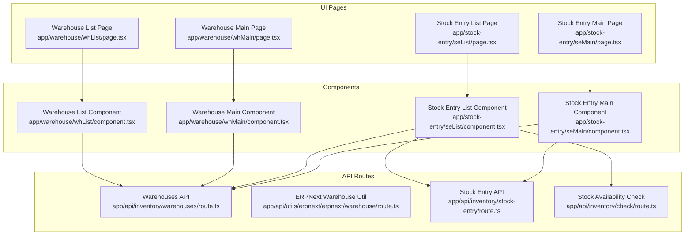
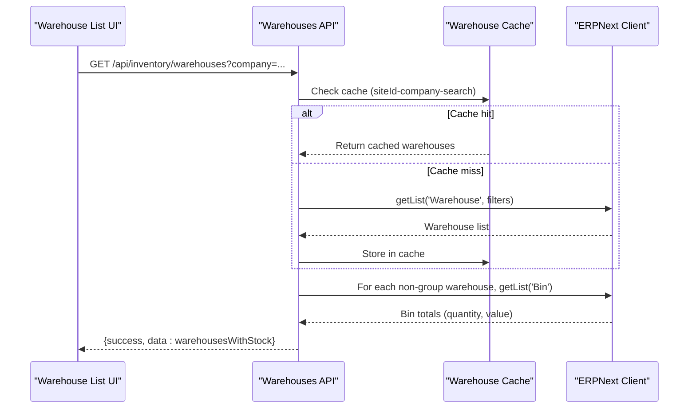
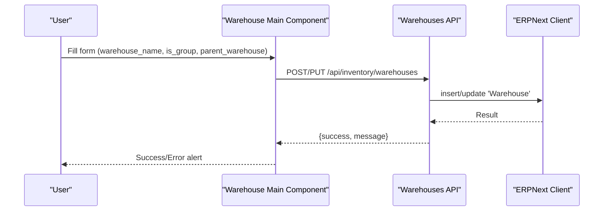
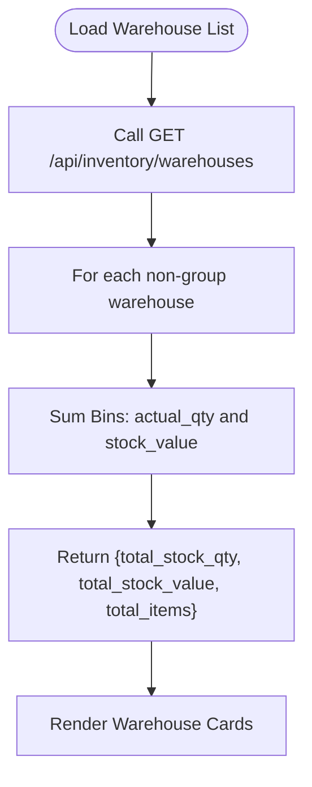
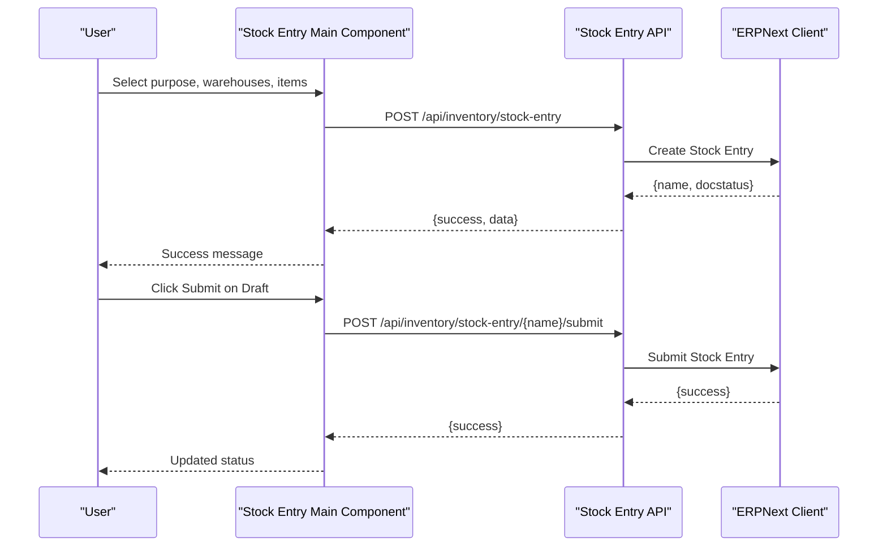
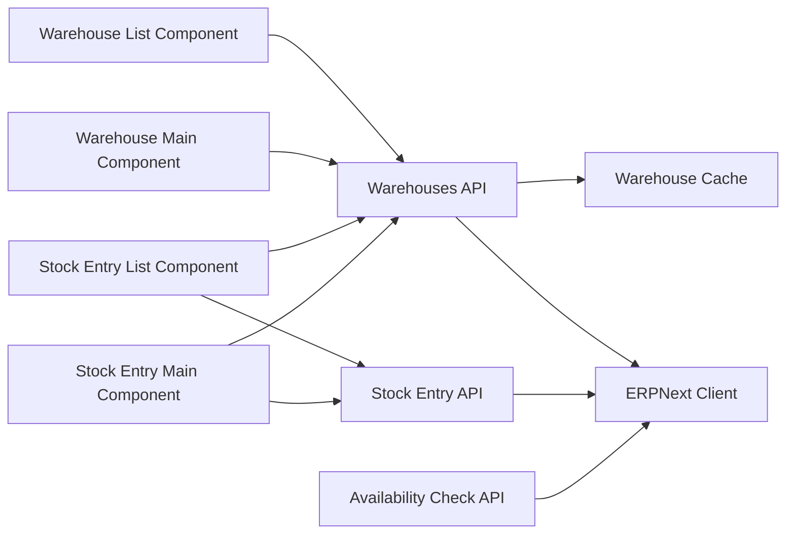

# Warehouse Management

<cite>
**Referenced Files in This Document**
- [app/warehouse/page.tsx](file://app/warehouse/page.tsx)
- [app/warehouse/whList/page.tsx](file://app/warehouse/whList/page.tsx)
- [app/warehouse/whList/component.tsx](file://app/warehouse/whList/component.tsx)
- [app/warehouse/whMain/page.tsx](file://app/warehouse/whMain/page.tsx)
- [app/warehouse/whMain/component.tsx](file://app/warehouse/whMain/component.tsx)
- [app/api/inventory/warehouses/route.ts](file://app/api/inventory/warehouses/route.ts)
- [app/api/utils/erpnext/erpnext/warehouse/route.ts](file://app/api/utils/erpnext/erpnext/warehouse/route.ts)
- [app/stock-entry/page.tsx](file://app/stock-entry/page.tsx)
- [app/stock-entry/seList/page.tsx](file://app/stock-entry/seList/page.tsx)
- [app/stock-entry/seList/component.tsx](file://app/stock-entry/seList/component.tsx)
- [app/stock-entry/seMain/page.tsx](file://app/stock-entry/seMain/page.tsx)
- [app/stock-entry/seMain/component.tsx](file://app/stock-entry/seMain/component.tsx)
- [app/api/inventory/stock-entry/route.ts](file://app/api/inventory/stock-entry/route.ts)
- [app/api/inventory/check/route.ts](file://app/api/inventory/check/route.ts)
</cite>

## Table of Contents
1. [Introduction](#introduction)
2. [Project Structure](#project-structure)
3. [Core Components](#core-components)
4. [Architecture Overview](#architecture-overview)
5. [Detailed Component Analysis](#detailed-component-analysis)
6. [Dependency Analysis](#dependency-analysis)
7. [Performance Considerations](#performance-considerations)
8. [Troubleshooting Guide](#troubleshooting-guide)
9. [Conclusion](#conclusion)
10. [Appendices](#appendices)

## Introduction
This document provides comprehensive documentation for Warehouse Management within the system. It covers warehouse configuration, location tracking, inventory storage management, and operational workflows such as stock entry, transfers, and reporting. It also documents the APIs used for warehouse operations and inventory location queries, along with practical setup scenarios and troubleshooting guidance.

## Project Structure
The warehouse management functionality is organized around:
- UI pages for listing and creating/editing warehouses
- API routes for warehouse CRUD and retrieval
- Stock entry UI and API routes for inventory movement operations
- Utility endpoints for warehouse filtering and availability checks

**Diagram sources**
- [app/warehouse/whList/page.tsx](file://app/warehouse/whList/page.tsx#L1-L8)
- [app/warehouse/whMain/page.tsx](file://app/warehouse/whMain/page.tsx#L1-L11)
- [app/stock-entry/seList/page.tsx](file://app/stock-entry/seList/page.tsx#L1-L8)
- [app/stock-entry/seMain/page.tsx](file://app/stock-entry/seMain/page.tsx#L1-L8)
- [app/warehouse/whList/component.tsx](file://app/warehouse/whList/component.tsx#L1-L206)
- [app/warehouse/whMain/component.tsx](file://app/warehouse/whMain/component.tsx#L1-L240)
- [app/stock-entry/seList/component.tsx](file://app/stock-entry/seList/component.tsx#L1-L683)
- [app/stock-entry/seMain/component.tsx](file://app/stock-entry/seMain/component.tsx#L1-L548)
- [app/api/inventory/warehouses/route.ts](file://app/api/inventory/warehouses/route.ts#L1-L289)
- [app/api/utils/erpnext/erpnext/warehouse/route.ts](file://app/api/utils/erpnext/erpnext/warehouse/route.ts#L1-L64)
- [app/api/inventory/stock-entry/route.ts](file://app/api/inventory/stock-entry/route.ts#L70-L147)
- [app/api/inventory/check/route.ts](file://app/api/inventory/check/route.ts#L40-L77)

**Section sources**
- [app/warehouse/page.tsx](file://app/warehouse/page.tsx#L1-L8)
- [app/warehouse/whList/page.tsx](file://app/warehouse/whList/page.tsx#L1-L8)
- [app/warehouse/whMain/page.tsx](file://app/warehouse/whMain/page.tsx#L1-L11)
- [app/stock-entry/page.tsx](file://app/stock-entry/page.tsx#L1-L8)
- [app/stock-entry/seList/page.tsx](file://app/stock-entry/seList/page.tsx#L1-L8)
- [app/stock-entry/seMain/page.tsx](file://app/stock-entry/seMain/page.tsx#L1-L8)

## Core Components
- Warehouse List UI: Displays warehouses with optional grouping, search, pagination, and summary metrics (total items, total quantity, total value). It fetches data via the inventory warehouses API and supports editing existing records.
- Warehouse Main UI: Provides creation and editing forms for warehouses, including group toggling and parent warehouse selection. Submits to the same inventory warehouses API.
- Stock Entry UI: Manages inventory movements (receipt, issue, transfer, manufacture, repack) with purpose-based validation, warehouse selection, and item rows. Integrates with stock entry APIs for listing, viewing, and submission.
- API Layer:
  - Warehouses API: GET lists with stock aggregation, POST/PUT for creation/update.
  - ERPNext Warehouse Util API: Returns actual warehouses (non-group) filtered by company.
  - Stock Entry API: GET list with filters and pagination, POST to create, and named endpoints for retrieval and submission.
  - Stock Availability Check API: Returns available stock per warehouse.

**Section sources**
- [app/warehouse/whList/component.tsx](file://app/warehouse/whList/component.tsx#L22-L206)
- [app/warehouse/whMain/component.tsx](file://app/warehouse/whMain/component.tsx#L8-L240)
- [app/stock-entry/seList/component.tsx](file://app/stock-entry/seList/component.tsx#L41-L683)
- [app/stock-entry/seMain/component.tsx](file://app/stock-entry/seMain/component.tsx#L21-L548)
- [app/api/inventory/warehouses/route.ts](file://app/api/inventory/warehouses/route.ts#L10-L137)
- [app/api/utils/erpnext/erpnext/warehouse/route.ts](file://app/api/utils/erpnext/erpnext/warehouse/route.ts#L17-L64)
- [app/api/inventory/stock-entry/route.ts](file://app/api/inventory/stock-entry/route.ts#L70-L147)
- [app/api/inventory/check/route.ts](file://app/api/inventory/check/route.ts#L40-L77)

## Architecture Overview
The system follows a Next.js app router pattern with server-side API routes. The UI components communicate with API routes, which in turn interact with the ERPNext client to fetch or mutate data. Caching is used for warehouse listings to improve performance.

**Diagram sources**
- [app/api/inventory/warehouses/route.ts](file://app/api/inventory/warehouses/route.ts#L10-L137)

**Section sources**
- [app/api/inventory/warehouses/route.ts](file://app/api/inventory/warehouses/route.ts#L10-L137)

## Detailed Component Analysis

### Warehouse Configuration and Setup
- Creation and Editing:
  - The main component handles both create and edit modes based on URL parameters. It validates required fields and posts to the warehouses API endpoint.
  - Group warehouses are supported; the list component distinguishes group vs. individual warehouses and displays aggregated metrics only for non-group warehouses.
- Address and Hierarchy:
  - The current UI focuses on warehouse name, group flag, and parent warehouse selection. Address fields are not exposed in the UI components reviewed here.
- Permissions and Access:
  - Authentication is enforced via session cookies extracted from the request. Unauthorized requests receive a 401 response.

**Diagram sources**
- [app/warehouse/whMain/component.tsx](file://app/warehouse/whMain/component.tsx#L53-L102)
- [app/api/inventory/warehouses/route.ts](file://app/api/inventory/warehouses/route.ts#L139-L213)

**Section sources**
- [app/warehouse/whMain/component.tsx](file://app/warehouse/whMain/component.tsx#L8-L240)
- [app/warehouse/whList/component.tsx](file://app/warehouse/whList/component.tsx#L22-L206)
- [app/api/inventory/warehouses/route.ts](file://app/api/inventory/warehouses/route.ts#L139-L213)

### Location Tracking and Inventory Storage Management
- Multi-location Inventory:
  - The warehouses API aggregates stock by summing Bin actual_qty and stock_value per warehouse (excluding group warehouses).
  - The stock entry list allows filtering by warehouse, enabling cross-location tracking.
- Storage Bin Tracking:
  - The stock entry list and main components rely on warehouse lists to populate warehouse selectors. While dedicated bin management is not visible in the reviewed files, stock movements are represented via the stock entry API.

**Diagram sources**
- [app/api/inventory/warehouses/route.ts](file://app/api/inventory/warehouses/route.ts#L80-L126)

**Section sources**
- [app/api/inventory/warehouses/route.ts](file://app/api/inventory/warehouses/route.ts#L80-L126)
- [app/stock-entry/seList/component.tsx](file://app/stock-entry/seList/component.tsx#L184-L194)

### Warehouse-to-Warehouse Transfer Workflows
- Purpose-based Validation:
  - The stock entry main component enforces warehouse requirements per purpose:
    - Material Receipt requires a destination warehouse.
    - Material Issue and Material Transfer require a source warehouse; transfer additionally requires a destination.
- Submission:
  - Draft entries can be submitted via a dedicated endpoint. The list component triggers submission and refreshes the list upon success.

**Diagram sources**
- [app/stock-entry/seMain/component.tsx](file://app/stock-entry/seMain/component.tsx#L167-L225)
- [app/api/inventory/stock-entry/route.ts](file://app/api/inventory/stock-entry/route.ts#L80-L147)
- [app/stock-entry/seList/component.tsx](file://app/stock-entry/seList/component.tsx#L264-L289)

**Section sources**
- [app/stock-entry/seMain/component.tsx](file://app/stock-entry/seMain/component.tsx#L167-L225)
- [app/api/inventory/stock-entry/route.ts](file://app/api/inventory/stock-entry/route.ts#L80-L147)
- [app/stock-entry/seList/component.tsx](file://app/stock-entry/seList/component.tsx#L264-L289)

### Cross-Dock Operations
- Cross-dock is not explicitly modeled in the reviewed files. The stock entry API supports multiple purposes including “Material Transfer,” which can represent internal cross-location movements. For true cross-dock scenarios (in-transit consolidation), additional process orchestration would be required outside the scope of the current UI/API coverage.

[No sources needed since this section does not analyze specific files]

### Reporting and Metrics
- Capacity Utilization and Turnover:
  - The current UI does not expose explicit capacity utilization or turnover ratio dashboards. The warehouse list shows total items, total quantity, and total value per warehouse, which can serve as inputs for custom reports.
- Stock Availability:
  - The availability check endpoint returns available stock per warehouse, useful for outbound planning and cross-dock readiness.

**Section sources**
- [app/api/inventory/check/route.ts](file://app/api/inventory/check/route.ts#L40-L77)
- [app/warehouse/whList/component.tsx](file://app/warehouse/whList/component.tsx#L156-L166)

### Practical Setup Scenarios
- Single Location Setup:
  - Create a non-group warehouse under the target company. Use the stock entry list to track inbound/outbound movements.
- Multi-location with Hierarchy:
  - Create a group warehouse and child warehouses. Use the list to view aggregated metrics at the group level and drill down to child locations for detailed stock.
- Inter-warehouse Transfer:
  - Create a “Material Transfer” entry selecting the source and destination warehouses. Submit to finalize the movement.

[No sources needed since this section provides general guidance]

## Dependency Analysis
- UI depends on:
  - Local storage for company selection
  - Next.js router for navigation
  - API routes for data operations
- API routes depend on:
  - ERPNext client for data persistence
  - Site-aware cookie extraction for authentication
  - Cache for warehouse listing performance

**Diagram sources**
- [app/warehouse/whList/component.tsx](file://app/warehouse/whList/component.tsx#L45-L81)
- [app/warehouse/whMain/component.tsx](file://app/warehouse/whMain/component.tsx#L53-L102)
- [app/stock-entry/seList/component.tsx](file://app/stock-entry/seList/component.tsx#L101-L182)
- [app/stock-entry/seMain/component.tsx](file://app/stock-entry/seMain/component.tsx#L167-L225)
- [app/api/inventory/warehouses/route.ts](file://app/api/inventory/warehouses/route.ts#L10-L137)
- [app/api/inventory/stock-entry/route.ts](file://app/api/inventory/stock-entry/route.ts#L70-L147)
- [app/api/inventory/check/route.ts](file://app/api/inventory/check/route.ts#L40-L77)

**Section sources**
- [app/warehouse/whList/component.tsx](file://app/warehouse/whList/component.tsx#L45-L81)
- [app/warehouse/whMain/component.tsx](file://app/warehouse/whMain/component.tsx#L53-L102)
- [app/stock-entry/seList/component.tsx](file://app/stock-entry/seList/component.tsx#L101-L182)
- [app/stock-entry/seMain/component.tsx](file://app/stock-entry/seMain/component.tsx#L167-L225)
- [app/api/inventory/warehouses/route.ts](file://app/api/inventory/warehouses/route.ts#L10-L137)
- [app/api/inventory/stock-entry/route.ts](file://app/api/inventory/stock-entry/route.ts#L70-L147)
- [app/api/inventory/check/route.ts](file://app/api/inventory/check/route.ts#L40-L77)

## Performance Considerations
- Caching:
  - Warehouse listing responses are cached keyed by site, company, and search term. Searches bypass cache to ensure freshness.
- Batch Queries:
  - Stock aggregation per warehouse uses batched Bin queries; consider pagination limits and error handling for large datasets.
- Frontend Filtering:
  - Some filters (e.g., warehouse OR logic) are applied in the frontend to work around API limitations.

**Section sources**
- [app/api/inventory/warehouses/route.ts](file://app/api/inventory/warehouses/route.ts#L51-L78)
- [app/stock-entry/seList/component.tsx](file://app/stock-entry/seList/component.tsx#L162-L169)

## Troubleshooting Guide
- Authentication Failures:
  - Missing or invalid session cookies result in 401 responses from API routes. Ensure the user is logged in and site cookies are present.
- Company Context Issues:
  - Many endpoints require a selected company stored in local storage. If missing, the UI redirects to company selection.
- Warehouse Creation/Update Errors:
  - Validate required fields (warehouse name, company). Errors from the ERPNext client are surfaced with site-aware error responses.
- Stock Entry Validation:
  - Purpose-driven warehouse requirements must be met; otherwise, submission is blocked with an error message.
- Availability Checks:
  - If no available stock is found, the endpoint returns zeros to indicate no stock-on-hand.

**Section sources**
- [app/api/inventory/warehouses/route.ts](file://app/api/inventory/warehouses/route.ts#L22-L34)
- [app/warehouse/whMain/component.tsx](file://app/warehouse/whMain/component.tsx#L54-L57)
- [app/stock-entry/seMain/component.tsx](file://app/stock-entry/seMain/component.tsx#L173-L188)
- [app/api/inventory/check/route.ts](file://app/api/inventory/check/route.ts#L61-L68)

## Conclusion
The system provides a robust foundation for warehouse configuration, location tracking, and inventory movement. The UI integrates seamlessly with API routes that interact with the ERPNext backend, offering capabilities for single and multi-location setups, inter-warehouse transfers, and availability checks. Extending reporting and capacity metrics would require additional UI components and backend aggregations aligned with the existing API patterns.

## Appendices

### API Endpoints Reference

- GET /api/inventory/warehouses
  - Purpose: List warehouses for a company, optionally filtered by search, with aggregated stock totals.
  - Query Parameters: company (required), search (optional), limit_page_length, start, order_by.
  - Response: success flag, data array of warehouses with total_stock_qty, total_stock_value, total_items.

- POST /api/inventory/warehouses
  - Purpose: Create a new warehouse.
  - Body: warehouse_name (required), is_group, parent_warehouse, company (required).
  - Response: success flag, created record, message.

- PUT /api/inventory/warehouses
  - Purpose: Update an existing warehouse.
  - Body: name (required), warehouse_name (required), is_group, parent_warehouse, company (required).
  - Response: success flag, updated record, message.

- GET /api/utils/erpnext/erpnext/warehouse
  - Purpose: Retrieve actual (non-group) warehouses for a company.
  - Query Parameters: company (required).
  - Response: data array of warehouses with name, warehouse_name, company, parent_warehouse.

- GET /api/inventory/stock-entry
  - Purpose: List stock entries with filters and pagination.
  - Query Parameters: filters (JSON-encoded), limit_page_length, limit_start, order_by.
  - Response: success flag, data array of entries, total count.

- POST /api/inventory/stock-entry
  - Purpose: Create a new stock entry.
  - Body: purpose (required), posting_date, posting_time, from_warehouse, to_warehouse, items (required), company (required).
  - Response: success flag, created record.

- GET /api/inventory/stock-entry/[name]
  - Purpose: Retrieve a specific stock entry by name.
  - Response: success flag, data object.

- POST /api/inventory/stock-entry/[name]/submit
  - Purpose: Submit a draft stock entry.
  - Response: success flag.

- GET /api/inventory/check
  - Purpose: Get available stock per warehouse (available = actual - reserved).
  - Response: Array of {warehouse, available, actual, reserved}.

**Section sources**
- [app/api/inventory/warehouses/route.ts](file://app/api/inventory/warehouses/route.ts#L10-L137)
- [app/api/utils/erpnext/erpnext/warehouse/route.ts](file://app/api/utils/erpnext/erpnext/warehouse/route.ts#L17-L64)
- [app/api/inventory/stock-entry/route.ts](file://app/api/inventory/stock-entry/route.ts#L70-L147)
- [app/api/inventory/check/route.ts](file://app/api/inventory/check/route.ts#L40-L77)