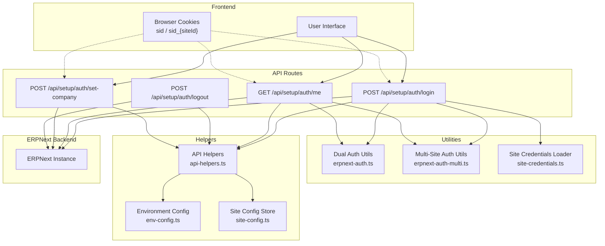
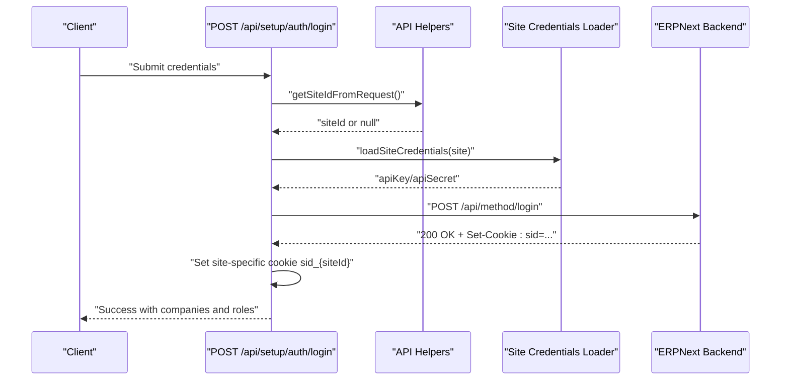
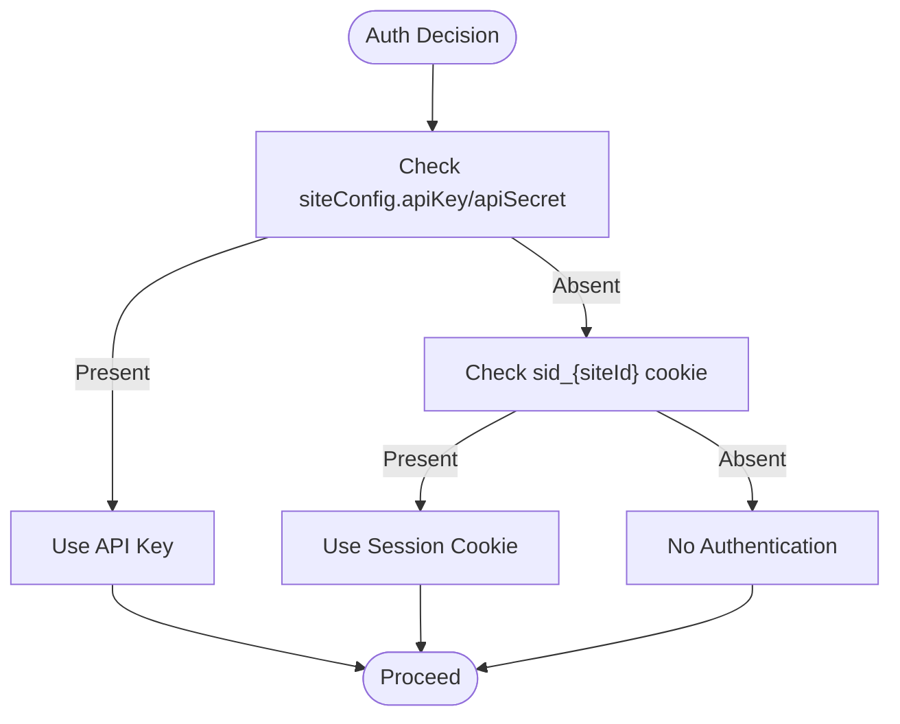
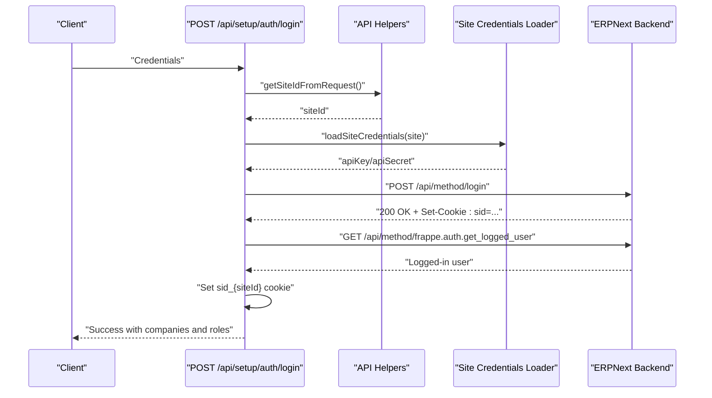
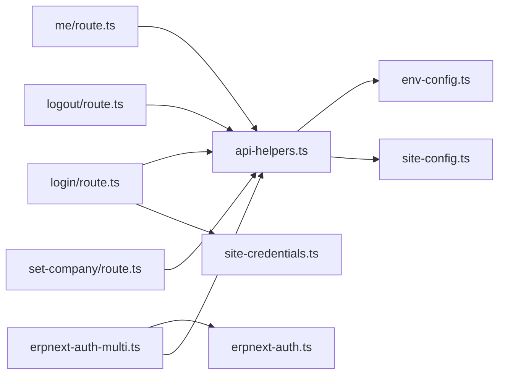

# Authentication and Session Management

<cite>
**Referenced Files in This Document**
- [site-credentials.ts](file://lib/site-credentials.ts)
- [erpnext-auth.ts](file://utils/erpnext-auth.ts)
- [erpnext-auth-multi.ts](file://utils/erpnext-auth-multi.ts)
- [login/route.ts](file://app/api/setup/auth/login/route.ts)
- [logout/route.ts](file://app/api/setup/auth/logout/route.ts)
- [me/route.ts](file://app/api/setup/auth/me/route.ts)
- [set-company/route.ts](file://app/api/setup/auth/set-company/route.ts)
- [api-helpers.ts](file://lib/api-helpers.ts)
- [env-config.ts](file://lib/env-config.ts)
- [site-config.ts](file://lib/site-config.ts)
- [csrf-protection.ts](file://lib/csrf-protection.ts)
- [input-sanitization.ts](file://lib/input-sanitization.ts)
- [api-routes-session-auth-preservation.pbt.test.ts](file://__tests__/api-routes-session-auth-preservation.pbt.test.ts)
- [api-routes-site-specific-auth.pbt.test.ts](file://__tests__/api-routes-site-specific-auth.pbt.test.ts)
- [api-routes-dual-auth-support.pbt.test.ts](file://__tests__/api-routes-dual-auth-support.pbt.test.ts)
- [csrf-protection.test.ts](file://__tests__/csrf-protection.test.ts)
- [input-sanitization.test.ts](file://__tests__/input-sanitization.test.ts)
- [session-cookie-preservation.pbt.test.ts](file://tests/session-cookie-preservation.pbt.test.ts)
- [session-cookie-blocks-api-key-bug-exploration.pbt.test.ts](file://tests/session-cookie-blocks-api-key-bug-exploration.pbt.test.ts)
</cite>

## Table of Contents
1. [Introduction](#introduction)
2. [Project Structure](#project-structure)
3. [Core Components](#core-components)
4. [Architecture Overview](#architecture-overview)
5. [Detailed Component Analysis](#detailed-component-analysis)
6. [Dependency Analysis](#dependency-analysis)
7. [Performance Considerations](#performance-considerations)
8. [Troubleshooting Guide](#troubleshooting-guide)
9. [Conclusion](#conclusion)

## Introduction
This document explains the Authentication and Session Management system for multi-site ERPNext deployments. It covers:
- Multi-site authentication flow and session isolation
- Credential management across different ERPNext instances
- Login process, site-aware authentication, session token handling, and automatic redirection patterns
- Secure credential storage and retrieval (API keys/secrets)
- Session persistence, timeout handling, and logout procedures
- Practical examples for custom authentication flows, error handling, and concurrent session management
- Security considerations including CSRF protection, input sanitization, and secure credential storage
- Troubleshooting guidance for common authentication and session issues

## Project Structure
The authentication system spans several layers:
- API routes under app/api/setup/auth handle login, logout, user info, and company selection
- Utilities in utils provide dual authentication and multi-site cookie handling
- Helpers in lib manage site context extraction, error classification, and environment configuration
- Tests validate session preservation, site-specific auth, dual auth support, CSRF, and input sanitization

**Diagram sources**
- [login/route.ts](file://app/api/setup/auth/login/route.ts#L1-L176)
- [me/route.ts](file://app/api/setup/auth/me/route.ts#L1-L96)
- [logout/route.ts](file://app/api/setup/auth/logout/route.ts#L1-L39)
- [set-company/route.ts](file://app/api/setup/auth/set-company/route.ts#L1-L59)
- [erpnext-auth.ts](file://utils/erpnext-auth.ts#L1-L157)
- [erpnext-auth-multi.ts](file://utils/erpnext-auth-multi.ts#L1-L279)
- [site-credentials.ts](file://lib/site-credentials.ts#L1-L97)
- [api-helpers.ts](file://lib/api-helpers.ts#L1-L186)
- [env-config.ts](file://lib/env-config.ts#L1-L342)
- [site-config.ts](file://lib/site-config.ts#L1-L322)

**Section sources**
- [login/route.ts](file://app/api/setup/auth/login/route.ts#L1-L176)
- [me/route.ts](file://app/api/setup/auth/me/route.ts#L1-L96)
- [logout/route.ts](file://app/api/setup/auth/logout/route.ts#L1-L39)
- [set-company/route.ts](file://app/api/setup/auth/set-company/route.ts#L1-L59)
- [erpnext-auth.ts](file://utils/erpnext-auth.ts#L1-L157)
- [erpnext-auth-multi.ts](file://utils/erpnext-auth-multi.ts#L1-L279)
- [site-credentials.ts](file://lib/site-credentials.ts#L1-L97)
- [api-helpers.ts](file://lib/api-helpers.ts#L1-L186)
- [env-config.ts](file://lib/env-config.ts#L1-L342)
- [site-config.ts](file://lib/site-config.ts#L1-L322)

## Core Components
- Dual authentication utilities: provide API key and session cookie fallback for authentication
- Multi-site authentication manager: supports per-site session cookies, authentication fallback, and cookie helpers
- Site credentials loader: loads per-site API credentials from environment variables
- API helpers: extract site context, build site-aware error responses, and log site-specific errors
- Environment configuration: parse and validate multi-site and legacy configurations
- Site configuration store: manage local site configs with persistence and validation
- API routes: implement login, logout, user info retrieval, and company selection with site awareness

**Section sources**
- [erpnext-auth.ts](file://utils/erpnext-auth.ts#L1-L157)
- [erpnext-auth-multi.ts](file://utils/erpnext-auth-multi.ts#L1-L279)
- [site-credentials.ts](file://lib/site-credentials.ts#L1-L97)
- [api-helpers.ts](file://lib/api-helpers.ts#L1-L186)
- [env-config.ts](file://lib/env-config.ts#L1-L342)
- [site-config.ts](file://lib/site-config.ts#L1-L322)

## Architecture Overview
The system implements a dual authentication strategy:
- Primary: API key authentication for administrative operations and full access
- Fallback: Session cookie authentication for user-specific operations and audit trails

Per-site session isolation is achieved by using site-specific cookie names (sid_{siteId}), preventing cross-site session leakage. Site context is determined from request headers or cookies, enabling site-aware routing and error handling.

**Diagram sources**
- [login/route.ts](file://app/api/setup/auth/login/route.ts#L1-L176)
- [api-helpers.ts](file://lib/api-helpers.ts#L1-L186)
- [site-credentials.ts](file://lib/site-credentials.ts#L1-L97)

**Section sources**
- [login/route.ts](file://app/api/setup/auth/login/route.ts#L1-L176)
- [api-helpers.ts](file://lib/api-helpers.ts#L1-L186)
- [site-credentials.ts](file://lib/site-credentials.ts#L1-L97)

## Detailed Component Analysis

### Dual Authentication Utilities
Provides authentication headers and session checks with dual fallback:
- makeErpHeaders: builds Authorization header from environment API key/secret
- getErpAuthHeaders: prefers API key; falls back to session cookie sid
- getErpHeaders: similar to above for programmatic usage
- isAuthenticated: deprecated; only checks session cookie (does not check API key)

Security note: API key authentication is prioritized for administrative operations, while session cookie remains supported for user-specific operations.

**Section sources**
- [erpnext-auth.ts](file://utils/erpnext-auth.ts#L1-L157)

### Multi-Site Authentication Manager
Implements per-site authentication and session isolation:
- makeErpHeaders(siteConfig): uses site-specific API credentials
- getErpAuthHeaders(request, siteConfig): API key first, then site-specific session cookie sid_{siteId}
- getErpHeaders(siteConfig, sid?): explicit sid fallback
- isAuthenticated(request, siteId): checks site-specific cookie
- getSessionCookieName(siteId), getSessionCookie(request, siteId), getSessionCookieClient(siteId): cookie helpers
- setSessionCookie(siteId, sessionId, maxAge), clearSessionCookie(siteId), clearAllSessionCookies(): cookie lifecycle
- hasAuthentication(siteConfig, request?), getAuthenticationMethod(siteConfig, request?): authentication detection
- isAuthenticatedForSite(request, siteConfig): comprehensive authentication check

**Diagram sources**
- [erpnext-auth-multi.ts](file://utils/erpnext-auth-multi.ts#L1-L279)

**Section sources**
- [erpnext-auth-multi.ts](file://utils/erpnext-auth-multi.ts#L1-L279)

### Site Credentials Loader
Loads per-site API credentials from environment variables:
- loadSiteCredentials(site): resolves SITE_{SITE_ID}_API_KEY and SITE_{SITE_ID}_API_SECRET
- resolveSiteConfig(site): merges resolved credentials into site config
- hasEnvironmentCredentials(siteId), getExpectedEnvVars(siteId): helpers for credential presence and expected keys
- Security: credentials are never stored in localStorage/browser; must be configured in environment variables

**Section sources**
- [site-credentials.ts](file://lib/site-credentials.ts#L1-L97)

### API Helpers
Site-aware utilities for API routes:
- getSiteIdFromRequest(request): extracts siteId from X-Site-ID header or active_site cookie
- getERPNextClientForRequest(request): constructs site-aware client; falls back to legacy client if no siteId
- buildSiteAwareErrorResponse(error, siteId?): classifies and contextualizes errors
- logSiteError(error, context, siteId?): logs structured site-specific errors

**Section sources**
- [api-helpers.ts](file://lib/api-helpers.ts#L1-L186)

### Environment Configuration
Parses and validates multi-site and legacy configurations:
- parseMultiSiteConfig(env): reads ERPNEXT_SITES JSON array
- migrateLegacyConfig(env): converts legacy ERPNEXT_API_URL/ERP_API_KEY/ERP_API_SECRET to multi-site
- loadSitesFromEnvironment(env): prioritizes ERPNEXT_SITES, then migrates legacy
- getDefaultSite(sites, env): selects default site with fallback to demo
- validateEnvironmentConfig(env): validates configuration presence and correctness

**Section sources**
- [env-config.ts](file://lib/env-config.ts#L1-L342)

### Site Configuration Store
Manages local site configurations with persistence:
- getAllSites(), reloadSites(), getSite(id)
- addSite(config), updateSite(id, updates), removeSite(id)
- fetchCompanyName(config), validateSiteConnection(config)
- persist(), loadFromEnvironment(), clearSites()

**Section sources**
- [site-config.ts](file://lib/site-config.ts#L1-L322)

### Login Flow (POST /api/setup/auth/login)
End-to-end login process:
- Extract siteId from request
- Normalize username to email if needed using a site-aware client
- Authenticate against ERPNext backend to obtain session cookie
- Fetch allowed companies and roles; derive actual user via session cookie
- Return success payload and set site-specific session cookie sid_{siteId}
- Error handling: site-aware error classification and logging

**Diagram sources**
- [login/route.ts](file://app/api/setup/auth/login/route.ts#L1-L176)
- [api-helpers.ts](file://lib/api-helpers.ts#L1-L186)
- [site-credentials.ts](file://lib/site-credentials.ts#L1-L97)

**Section sources**
- [login/route.ts](file://app/api/setup/auth/login/route.ts#L1-L176)

### User Info Retrieval (GET /api/setup/auth/me)
Retrieves current user information:
- Prefer site-specific session cookie sid_{siteId}, fallback to generic sid
- Validate session via ERPNext get_logged_user
- Fetch user roles using API key for administrative access
- Return user profile data

**Section sources**
- [me/route.ts](file://app/api/setup/auth/me/route.ts#L1-L96)

### Logout (POST /api/setup/auth/logout)
Logs out the current session:
- Use site-aware client to call backend logout
- Delete session cookie if present
- Return success response

**Section sources**
- [logout/route.ts](file://app/api/setup/auth/logout/route.ts#L1-L39)

### Company Selection (POST /api/setup/auth/set-company)
Sets the user's default company:
- Requires session cookie for authentication
- Calls ERPNext to set session default
- Stores selected company in a secure cookie for subsequent requests

**Section sources**
- [set-company/route.ts](file://app/api/setup/auth/set-company/route.ts#L1-L59)

## Dependency Analysis
The authentication system exhibits layered dependencies:
- API routes depend on API helpers for site context and error handling
- API helpers depend on environment configuration and site credentials loader
- Multi-site authentication utilities depend on request cookies and site configuration
- Frontend cookies drive session cookie names and values

**Diagram sources**
- [login/route.ts](file://app/api/setup/auth/login/route.ts#L1-L176)
- [me/route.ts](file://app/api/setup/auth/me/route.ts#L1-L96)
- [logout/route.ts](file://app/api/setup/auth/logout/route.ts#L1-L39)
- [set-company/route.ts](file://app/api/setup/auth/set-company/route.ts#L1-L59)
- [api-helpers.ts](file://lib/api-helpers.ts#L1-L186)
- [env-config.ts](file://lib/env-config.ts#L1-L342)
- [site-config.ts](file://lib/site-config.ts#L1-L322)
- [erpnext-auth-multi.ts](file://utils/erpnext-auth-multi.ts#L1-L279)
- [erpnext-auth.ts](file://utils/erpnext-auth.ts#L1-L157)
- [site-credentials.ts](file://lib/site-credentials.ts#L1-L97)

**Section sources**
- [login/route.ts](file://app/api/setup/auth/login/route.ts#L1-L176)
- [me/route.ts](file://app/api/setup/auth/me/route.ts#L1-L96)
- [logout/route.ts](file://app/api/setup/auth/logout/route.ts#L1-L39)
- [set-company/route.ts](file://app/api/setup/auth/set-company/route.ts#L1-L59)
- [api-helpers.ts](file://lib/api-helpers.ts#L1-L186)
- [env-config.ts](file://lib/env-config.ts#L1-L342)
- [site-config.ts](file://lib/site-config.ts#L1-L322)
- [erpnext-auth-multi.ts](file://utils/erpnext-auth-multi.ts#L1-L279)
- [erpnext-auth.ts](file://utils/erpnext-auth.ts#L1-L157)
- [site-credentials.ts](file://lib/site-credentials.ts#L1-L97)

## Performance Considerations
- Minimize round trips: combine user lookup and company/roles fetching where possible
- Cache site configurations: environment parsing and credential resolution should be cached
- Cookie size: keep cookies minimal (sid_{siteId}, selected_company) to reduce overhead
- Network latency: batch API calls when feasible and leverage site-aware client caching
- Error classification: use site-aware error responses to avoid repeated retries on misconfiguration

[No sources needed since this section provides general guidance]

## Troubleshooting Guide
Common issues and resolutions:
- Session cookie blocks API key authentication: the deprecated isAuthenticated only checks session cookies and ignores API key. Use isAuthenticatedForSite or the site-aware client instead.
- Session cookie preservation across requests: ensure sid_{siteId} cookies are sent with subsequent requests; verify SameSite and domain settings.
- Site-specific authentication failures: verify siteId extraction from X-Site-ID header or active_site cookie; confirm environment credentials are properly configured.
- CSRF protection: enable CSRF middleware and validate tokens for state-changing operations.
- Input sanitization: sanitize and validate all user inputs to prevent injection attacks.
- Session timeout handling: implement re-authentication prompts when get_logged_user returns guest or session expired.
- Logout behavior: ensure session cookies are cleared for the current site and any fallback cookies.

Validation references:
- Session authentication preservation and site-specific auth tests
- CSRF protection and input sanitization tests
- Bug explorations around session cookie blocking API key and session cookie preservation

**Section sources**
- [api-routes-session-auth-preservation.pbt.test.ts](file://__tests__/api-routes-session-auth-preservation.pbt.test.ts)
- [api-routes-site-specific-auth.pbt.test.ts](file://__tests__/api-routes-site-specific-auth.pbt.test.ts)
- [api-routes-dual-auth-support.pbt.test.ts](file://__tests__/api-routes-dual-auth-support.pbt.test.ts)
- [csrf-protection.test.ts](file://__tests__/csrf-protection.test.ts)
- [input-sanitization.test.ts](file://__tests__/input-sanitization.test.ts)
- [session-cookie-preservation.pbt.test.ts](file://tests/session-cookie-preservation.pbt.test.ts)
- [session-cookie-blocks-api-key-bug-exploration.pbt.test.ts](file://tests/session-cookie-blocks-api-key-bug-exploration.pbt.test.ts)

## Conclusion
The authentication and session management system provides robust multi-site support with:
- Dual authentication (API key primary, session cookie fallback)
- Per-site session isolation via site-specific cookies
- Secure credential handling through environment variables
- Site-aware error handling and logging
- Practical APIs for login, logout, user info retrieval, and company selection

Adopt the provided utilities and API routes to implement secure, scalable authentication flows across ERPNext instances.