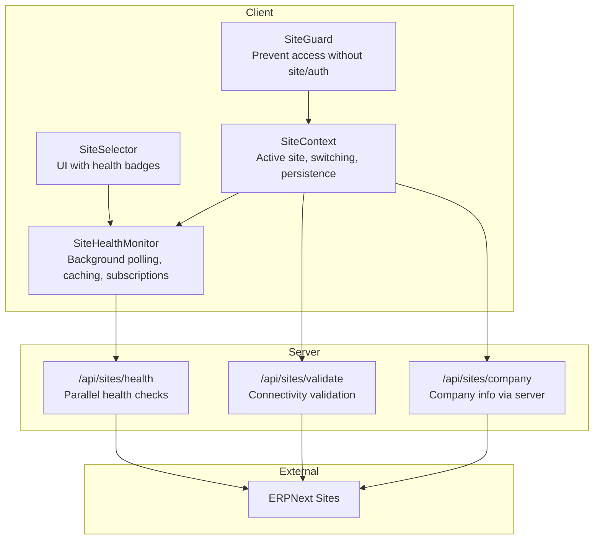
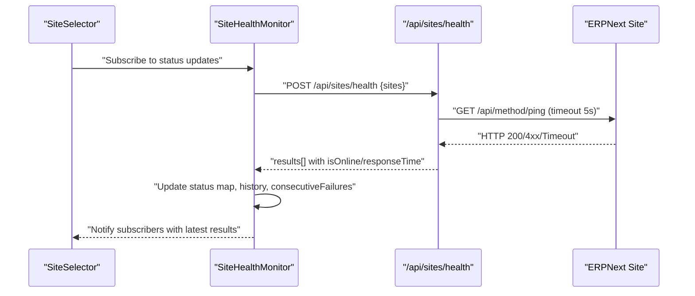
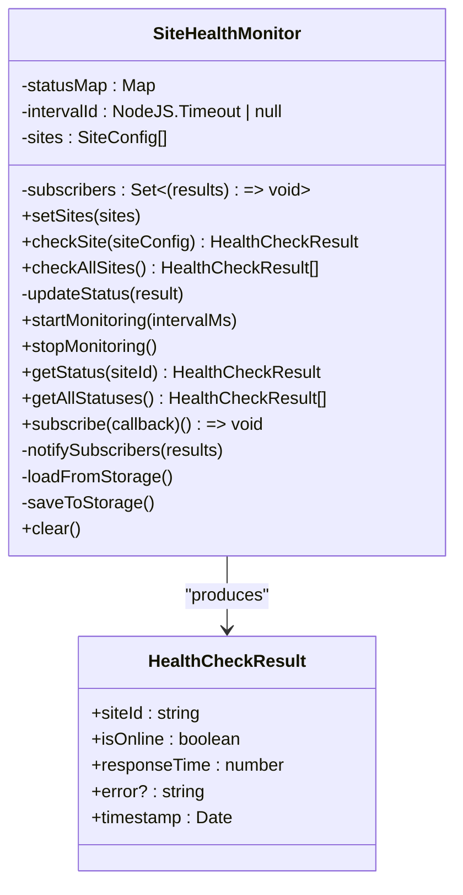
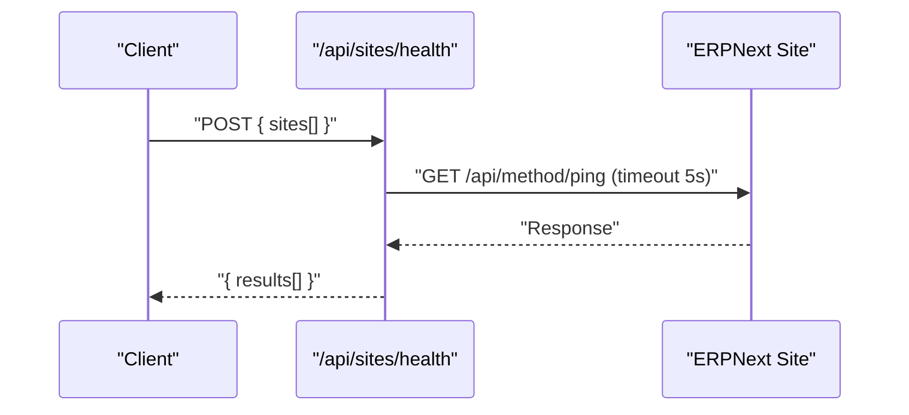
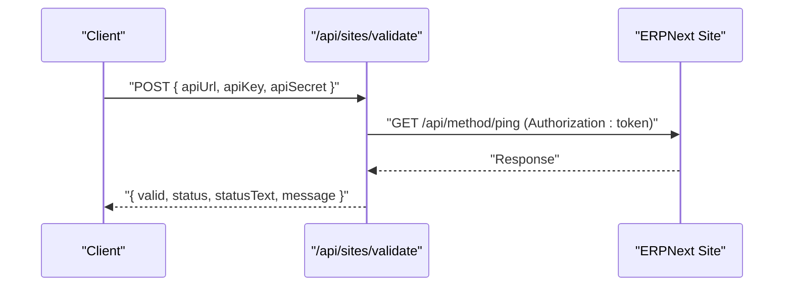
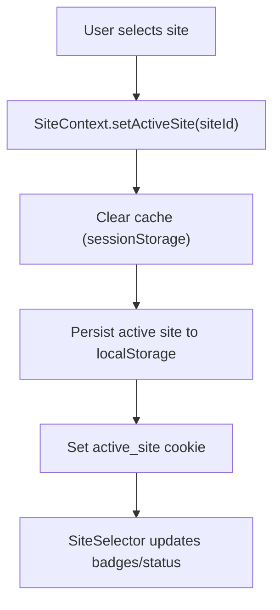
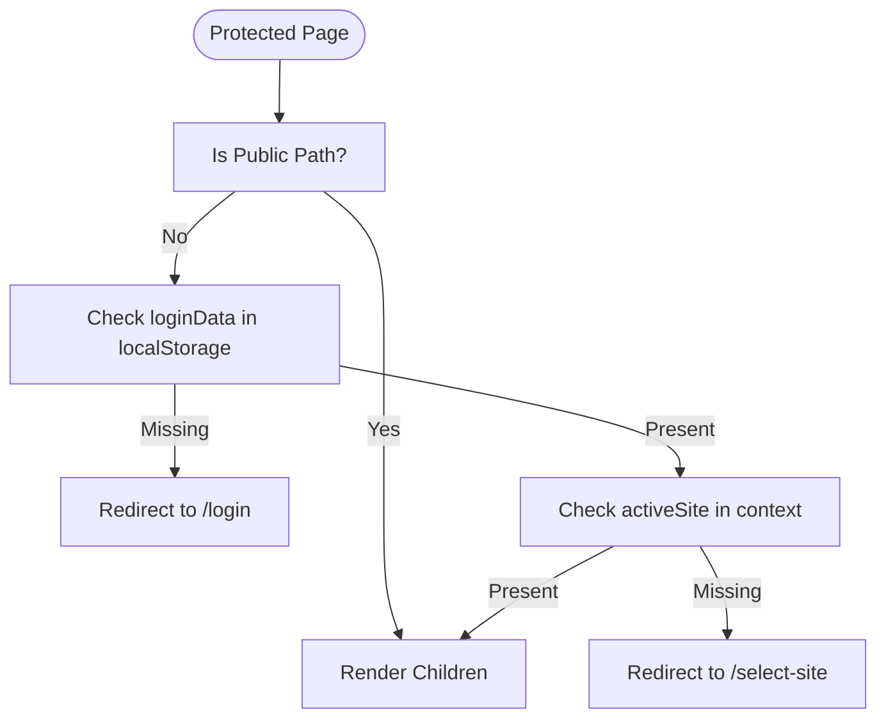
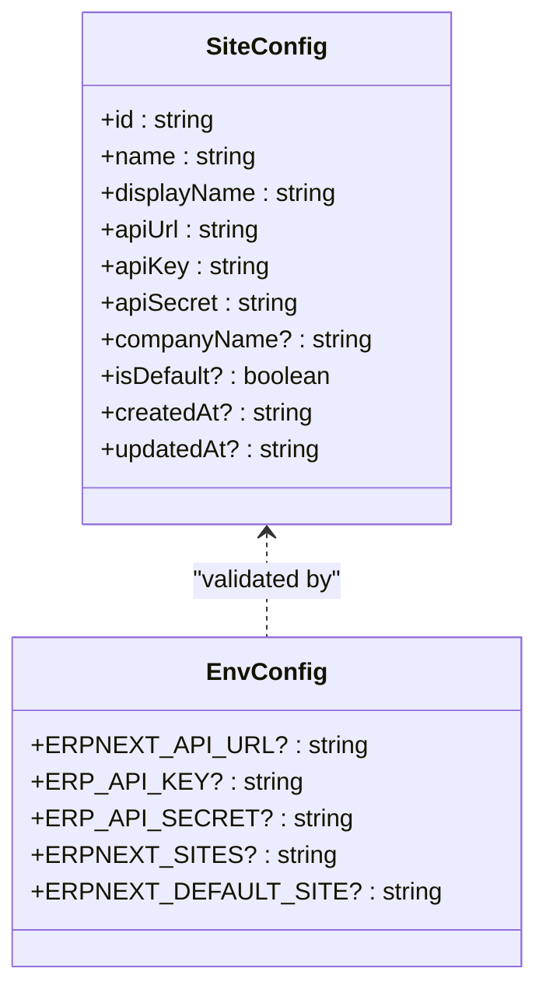
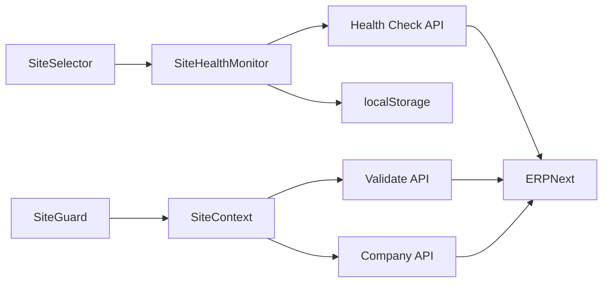

# Health Monitoring and Observability

<cite>
**Referenced Files in This Document**
- [site-health.ts](file://lib/site-health.ts)
- [route.ts](file://app/api/sites/health/route.ts)
- [route.ts](file://app/api/sites/validate/route.ts)
- [site-context.tsx](file://lib/site-context.tsx)
- [site-selector.tsx](file://components/site-selector.tsx)
- [SiteGuard.tsx](file://components/SiteGuard.tsx)
- [env-config.ts](file://lib/env-config.ts)
- [site-config.ts](file://lib/site-config.ts)
- [route.ts](file://app/api/sites/company/route.ts)
- [api-routes-dynamic-site-switching.pbt.test.ts](file://__tests__/api-routes-dynamic-site-switching.pbt.test.ts)
</cite>

## Table of Contents
1. [Introduction](#introduction)
2. [Project Structure](#project-structure)
3. [Core Components](#core-components)
4. [Architecture Overview](#architecture-overview)
5. [Detailed Component Analysis](#detailed-component-analysis)
6. [Dependency Analysis](#dependency-analysis)
7. [Performance Considerations](#performance-considerations)
8. [Troubleshooting Guide](#troubleshooting-guide)
9. [Conclusion](#conclusion)
10. [Appendices](#appendices)

## Introduction
This document explains the Health Monitoring and Observability features implemented in the system. It covers site health checking mechanisms, connectivity validation, performance monitoring, health status indicators, timeout detection, failure handling, integration with site switching to prevent operations on unhealthy sites, automatic retry behavior, health check API endpoints, status reporting formats, and alerting systems. It also provides practical examples for implementing custom health checks, configuring monitoring thresholds, integrating with external monitoring tools, troubleshooting common health issues, interpreting health status messages, and implementing proactive maintenance workflows.

## Project Structure
The health monitoring system spans several modules:
- Backend API routes for health checks and connectivity validation
- A client-side health monitor with background polling and status persistence
- Site context and selector components that integrate health status into the UI
- Site guard to enforce site selection and authentication before rendering protected pages
- Environment and site configuration utilities supporting multi-site setups

**Diagram sources**
- [site-health.ts](file://lib/site-health.ts#L35-L409)
- [route.ts](file://app/api/sites/health/route.ts#L26-L91)
- [route.ts](file://app/api/sites/validate/route.ts#L8-L44)
- [site-selector.tsx](file://components/site-selector.tsx#L32-L57)
- [site-context.tsx](file://lib/site-context.tsx#L59-L336)
- [SiteGuard.tsx](file://components/SiteGuard.tsx#L22-L88)
- [route.ts](file://app/api/sites/company/route.ts#L10-L56)

**Section sources**
- [site-health.ts](file://lib/site-health.ts#L1-L409)
- [route.ts](file://app/api/sites/health/route.ts#L1-L92)
- [route.ts](file://app/api/sites/validate/route.ts#L1-L45)
- [site-context.tsx](file://lib/site-context.tsx#L1-L353)
- [site-selector.tsx](file://components/site-selector.tsx#L1-L326)
- [SiteGuard.tsx](file://components/SiteGuard.tsx#L1-L89)
- [route.ts](file://app/api/sites/company/route.ts#L1-L57)

## Core Components
- SiteHealthMonitor: Background health monitor that periodically checks configured sites, tracks consecutive failures, caches results, persists to local storage, and notifies subscribers.
- Health Check API (/api/sites/health): Server-side endpoint that performs parallel health checks against a list of sites using the ERPNext ping endpoint with a 5-second timeout.
- Connectivity Validation API (/api/sites/validate): Validates site credentials and connectivity using token-based authentication with a 5-second timeout.
- Site Context and Selector: Manage active site selection, persistence, and display health status badges in the UI.
- SiteGuard: Enforces site selection and authentication prior to rendering protected pages.

Key capabilities:
- Lightweight health checks via ERPNext ping endpoint
- Consecutive failure threshold to stabilize transient failures
- Local storage persistence for health status across sessions
- Subscription-based notifications for UI updates
- Timeout detection and error reporting
- Integration with site switching to prevent operations on unhealthy sites

**Section sources**
- [site-health.ts](file://lib/site-health.ts#L35-L409)
- [route.ts](file://app/api/sites/health/route.ts#L26-L91)
- [route.ts](file://app/api/sites/validate/route.ts#L8-L44)
- [site-context.tsx](file://lib/site-context.tsx#L59-L336)
- [site-selector.tsx](file://components/site-selector.tsx#L32-L326)
- [SiteGuard.tsx](file://components/SiteGuard.tsx#L22-L88)

## Architecture Overview
The health monitoring architecture combines client-side polling with server-side validation to ensure accurate and resilient health status reporting.

**Diagram sources**
- [site-health.ts](file://lib/site-health.ts#L109-L164)
- [route.ts](file://app/api/sites/health/route.ts#L26-L91)

**Section sources**
- [site-health.ts](file://lib/site-health.ts#L109-L164)
- [route.ts](file://app/api/sites/health/route.ts#L26-L91)

## Detailed Component Analysis

### SiteHealthMonitor
Responsibilities:
- Periodic health checks of configured sites
- Failure tracking with consecutive failure threshold
- Status history management (bounded length)
- Local storage persistence and restoration
- Subscription-based notifications for UI updates
- Graceful fallback when server-side API is unavailable

Behavior highlights:
- Uses ERPNext ping endpoint for lightweight checks
- Applies a 5-second timeout per site check
- Marks a site as online if it succeeds OR if consecutive failures are below the threshold
- Maintains a rolling history of up to ten recent results
- Persists status to local storage for continuity across sessions

**Diagram sources**
- [site-health.ts](file://lib/site-health.ts#L11-L409)

**Section sources**
- [site-health.ts](file://lib/site-health.ts#L35-L409)

### Health Check API (/api/sites/health)
Endpoint: POST /api/sites/health
- Accepts a JSON payload with an array of sites, each containing id and apiUrl
- Performs parallel health checks against each site using the ERPNext ping endpoint
- Applies a 5-second timeout per request
- Returns a results array with siteId, isOnline, responseTime, and timestamp
- On error, returns a structured error message with appropriate HTTP status

**Diagram sources**
- [route.ts](file://app/api/sites/health/route.ts#L26-L91)

**Section sources**
- [route.ts](file://app/api/sites/health/route.ts#L26-L91)

### Connectivity Validation API (/api/sites/validate)
Endpoint: POST /api/sites/validate
- Validates site credentials using token-based authentication
- Applies a 5-second timeout
- Returns valid, status, statusText, and a human-readable message
- Designed to be used server-side to avoid CORS issues

**Diagram sources**
- [route.ts](file://app/api/sites/validate/route.ts#L8-L44)

**Section sources**
- [route.ts](file://app/api/sites/validate/route.ts#L8-L44)

### Site Context and Selector
SiteContext:
- Manages active site selection, persistence, and switching
- Clears caches when switching sites to prevent cross-site data leakage
- Sets an active_site cookie for API routes
- Loads sites from storage or environment variables and ensures a default demo site exists

SiteSelector:
- Integrates with SiteHealthMonitor to display online/offline status and response times
- Supports keyboard navigation and responsive design
- Shows a visual indicator for the active site and health status badges

**Diagram sources**
- [site-context.tsx](file://lib/site-context.tsx#L152-L184)
- [site-selector.tsx](file://components/site-selector.tsx#L124-L142)

**Section sources**
- [site-context.tsx](file://lib/site-context.tsx#L59-L336)
- [site-selector.tsx](file://components/site-selector.tsx#L32-L326)

### SiteGuard
- Ensures users have selected a site and are authenticated before accessing protected pages
- Redirects to /select-site if no active site is selected
- Redirects to /login if not authenticated
- Displays a loading state while checking authentication and site context

**Diagram sources**
- [SiteGuard.tsx](file://components/SiteGuard.tsx#L22-L88)

**Section sources**
- [SiteGuard.tsx](file://components/SiteGuard.tsx#L22-L88)

### Environment and Site Configuration
- SiteConfig interface defines site metadata and credentials
- Validation utilities ensure URL format and required fields
- Default site resolution supports environment-driven defaults
- SiteConfig store manages persistence to localStorage with versioning

**Diagram sources**
- [env-config.ts](file://lib/env-config.ts#L11-L48)
- [site-config.ts](file://lib/site-config.ts#L14-L18)

**Section sources**
- [env-config.ts](file://lib/env-config.ts#L11-L342)
- [site-config.ts](file://lib/site-config.ts#L14-L322)

## Dependency Analysis
- SiteHealthMonitor depends on SiteConfig and uses localStorage for persistence
- Health Check API depends on ERPNext ping endpoint and enforces timeouts
- SiteSelector subscribes to SiteHealthMonitor to reflect live status
- SiteContext coordinates site switching and persistence
- SiteGuard enforces site selection and authentication before rendering protected pages
- Connectivity Validation API complements SiteContext’s validation utilities

**Diagram sources**
- [site-health.ts](file://lib/site-health.ts#L35-L409)
- [route.ts](file://app/api/sites/health/route.ts#L26-L91)
- [route.ts](file://app/api/sites/validate/route.ts#L8-L44)
- [site-selector.tsx](file://components/site-selector.tsx#L32-L57)
- [site-context.tsx](file://lib/site-context.tsx#L59-L336)
- [SiteGuard.tsx](file://components/SiteGuard.tsx#L22-L88)
- [route.ts](file://app/api/sites/company/route.ts#L10-L56)

**Section sources**
- [site-health.ts](file://lib/site-health.ts#L35-L409)
- [route.ts](file://app/api/sites/health/route.ts#L26-L91)
- [route.ts](file://app/api/sites/validate/route.ts#L8-L44)
- [site-selector.tsx](file://components/site-selector.tsx#L32-L57)
- [site-context.tsx](file://lib/site-context.tsx#L59-L336)
- [SiteGuard.tsx](file://components/SiteGuard.tsx#L22-L88)
- [route.ts](file://app/api/sites/company/route.ts#L10-L56)

## Performance Considerations
- Parallel health checks: The server-side health endpoint performs checks concurrently for all requested sites, reducing total latency compared to sequential checks.
- Timeout handling: Each check applies a 5-second timeout to prevent long blocking operations and to surface transient network issues promptly.
- Consecutive failure smoothing: A threshold limits flapping between online/offline states by tolerating a small number of consecutive failures before marking a site offline.
- History truncation: Keeps only a bounded number of recent results to control memory usage and maintain responsiveness.
- Local storage persistence: Reduces repeated checks on page reloads and across sessions.

Recommendations:
- Tune monitoring interval based on site count and acceptable staleness
- Consider staggering checks for very large site lists to avoid thundering herd effects
- Monitor responseTime distributions to identify slow sites proactively

[No sources needed since this section provides general guidance]

## Troubleshooting Guide
Common issues and resolutions:
- No sites configured: Ensure sites are loaded from localStorage or environment variables. The system adds a default demo site if none exists.
- Site appears offline despite being reachable: Check for consecutive failures threshold; transient failures may temporarily mark a site offline until it recovers.
- Timeout errors: Verify network connectivity and firewall rules; ensure the ERPNext ping endpoint is accessible.
- Authentication failures: Confirm apiKey and apiSecret are correct and match the target site; use the validation endpoint to test connectivity.
- Cross-site data leakage after switching: Site switching clears sessionStorage; verify that no other caches are retaining site-specific data.
- UI not updating health status: Ensure SiteSelector is subscribed to SiteHealthMonitor and that monitoring is started.

Interpreting health status messages:
- isOnline: true indicates successful ping within the timeout
- isOnline: false indicates HTTP error or timeout; inspect error field for details
- responseTime: indicates measured latency in milliseconds
- timestamp: indicates when the check was performed

**Section sources**
- [site-health.ts](file://lib/site-health.ts#L169-L197)
- [route.ts](file://app/api/sites/health/route.ts#L46-L75)
- [route.ts](file://app/api/sites/validate/route.ts#L37-L43)
- [site-context.tsx](file://lib/site-context.tsx#L112-L122)
- [site-selector.tsx](file://components/site-selector.tsx#L145-L195)

## Conclusion
The health monitoring system provides robust, observable multi-site connectivity with resilient checks, timely failure detection, and seamless integration with site switching and UI components. By combining server-side validation, client-side polling, and persistent status tracking, it enables proactive maintenance and reliable user experiences across multiple ERPNext instances.

[No sources needed since this section summarizes without analyzing specific files]

## Appendices

### Health Check API Endpoints and Formats
- POST /api/sites/health
  - Request body: sites[] with id and apiUrl
  - Response: results[] with siteId, isOnline, responseTime, optional error, timestamp
  - Typical success: HTTP 200 with results
  - Typical error: HTTP 400 for missing/invalid sites; HTTP 500 for internal errors

- POST /api/sites/validate
  - Request body: apiUrl, apiKey, apiSecret
  - Response: { valid, status, statusText, message }
  - Typical success: HTTP 200 with valid: true
  - Typical error: HTTP 400 for missing credentials; HTTP 500 for internal errors

- POST /api/sites/company
  - Request body: siteId, apiUrl, apiKey, apiSecret
  - Response: { companyName } or error
  - Used to enrich site metadata server-side

**Section sources**
- [route.ts](file://app/api/sites/health/route.ts#L8-L25)
- [route.ts](file://app/api/sites/health/route.ts#L26-L91)
- [route.ts](file://app/api/sites/validate/route.ts#L3-L7)
- [route.ts](file://app/api/sites/validate/route.ts#L8-L44)
- [route.ts](file://app/api/sites/company/route.ts#L5-L9)
- [route.ts](file://app/api/sites/company/route.ts#L10-L56)

### Implementing Custom Health Checks
- Extend SiteHealthMonitor:
  - Add new check methods that return HealthCheckResult
  - Integrate with updateStatus to track consecutive failures and history
  - Persist and notify subscribers as done in built-in checks
- Define custom endpoints:
  - Create new API routes similar to /api/sites/health
  - Apply timeouts and return standardized result structures
- Integrate with UI:
  - Subscribe to SiteHealthMonitor in components
  - Display custom status indicators alongside existing ones

**Section sources**
- [site-health.ts](file://lib/site-health.ts#L57-L104)
- [site-health.ts](file://lib/site-health.ts#L169-L197)
- [site-health.ts](file://lib/site-health.ts#L260-L280)

### Configuring Monitoring Thresholds
- Consecutive failure threshold: Adjust the limit that determines when a site is considered offline despite a single failure
- History length: Control the number of recent results retained
- Monitoring interval: Tune the frequency of background checks based on environment needs
- Timeout values: Modify per-request timeout to balance responsiveness and reliability

**Section sources**
- [site-health.ts](file://lib/site-health.ts#L28-L29)
- [site-health.ts](file://lib/site-health.ts#L186-L188)
- [site-health.ts](file://lib/site-health.ts#L202-L213)

### Integrating with External Monitoring Tools
- Export health status:
  - Use getAllStatuses to retrieve current health snapshots
  - Persist or forward results to external systems
- Alerting:
  - Trigger alerts when isOnline is false or responseTime exceeds thresholds
  - Use error messages for contextual diagnostics
- Dashboards:
  - Visualize online/offline states and response times per site

**Section sources**
- [site-health.ts](file://lib/site-health.ts#L246-L254)
- [site-health.ts](file://lib/site-health.ts#L272-L280)

### Proactive Maintenance Workflows
- Automated retries:
  - Implement exponential backoff for transient failures
  - Avoid retrying non-retryable errors (validation, permissions)
- Scheduled maintenance windows:
  - Temporarily pause monitoring during planned outages
  - Resume monitoring after maintenance completes
- Capacity planning:
  - Track responseTime trends to identify performance regressions
  - Rotate traffic away from consistently slow sites

**Section sources**
- [site-health.ts](file://lib/site-health.ts#L169-L197)

### Site Switching and Health Enforcement
- SiteGuard ensures users select a site and are authenticated before accessing protected pages
- SiteContext clears caches on site switch to prevent cross-site data leakage
- Health status influences UI decisions; offline sites can be highlighted to prevent operations

**Section sources**
- [SiteGuard.tsx](file://components/SiteGuard.tsx#L22-L88)
- [site-context.tsx](file://lib/site-context.tsx#L112-L122)
- [site-selector.tsx](file://components/site-selector.tsx#L145-L195)

### Dynamic Site Switching Validation
- Property-based tests validate immediate and consistent site switching across multiple scenarios
- Ensures no caching between site switches and that authentication is preserved

**Section sources**
- [api-routes-dynamic-site-switching.pbt.test.ts](file://__tests__/api-routes-dynamic-site-switching.pbt.test.ts#L1-L200)