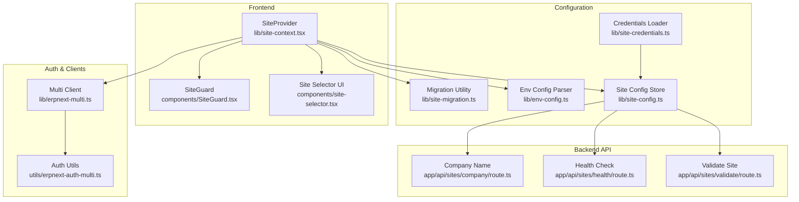
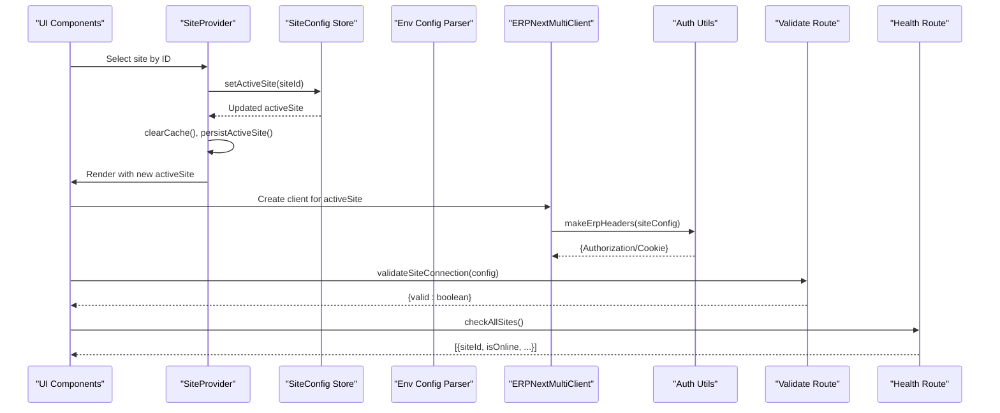
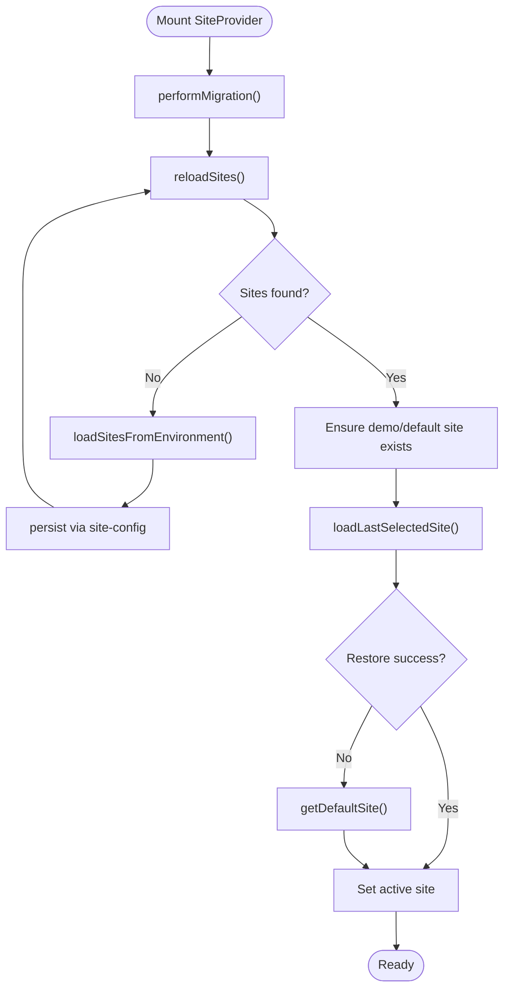
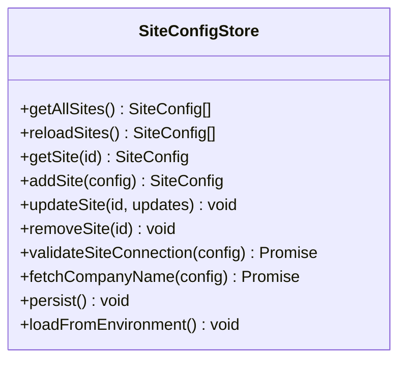
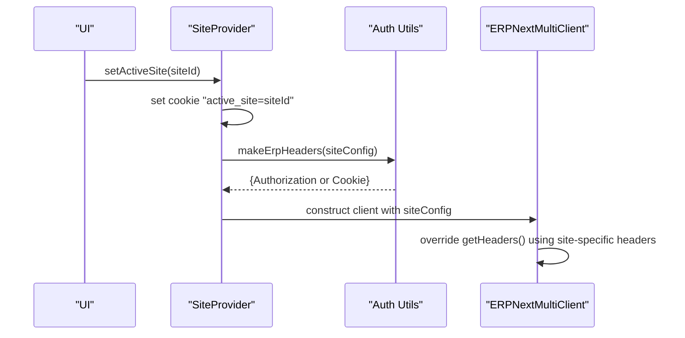
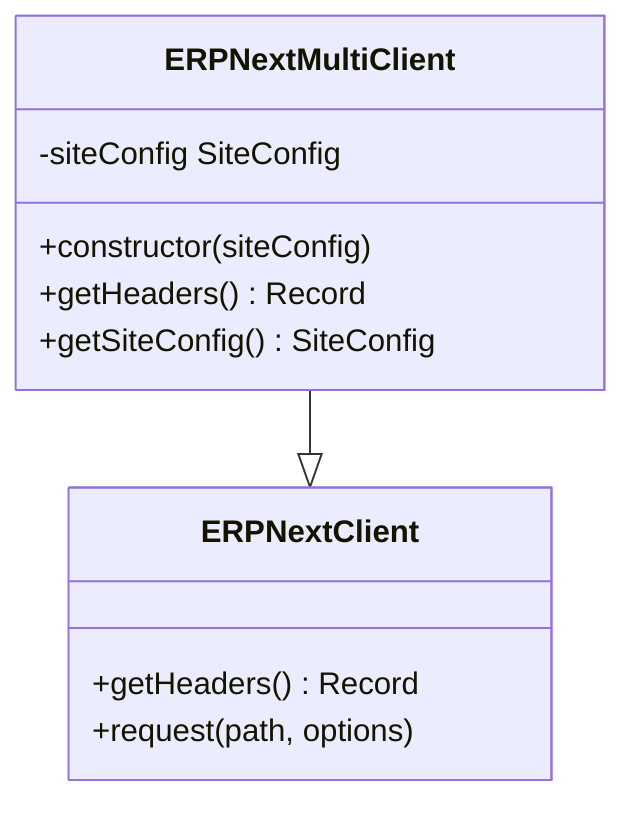
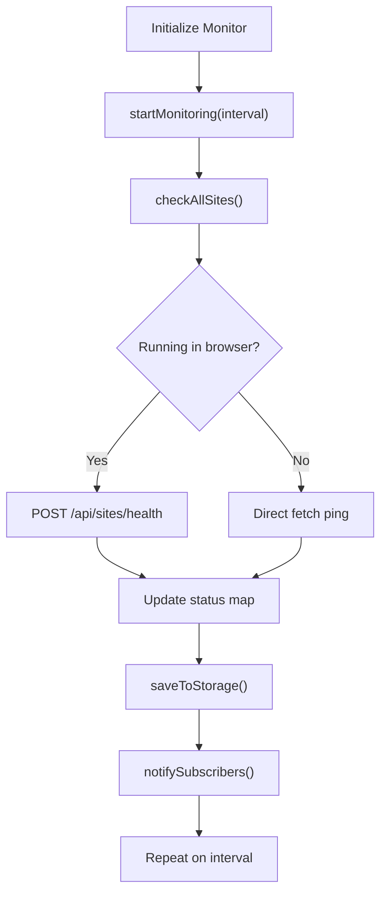
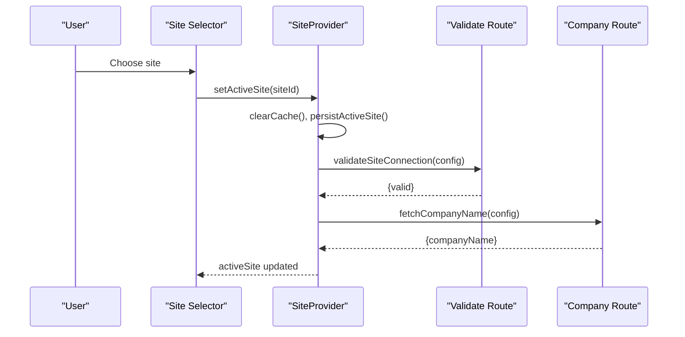
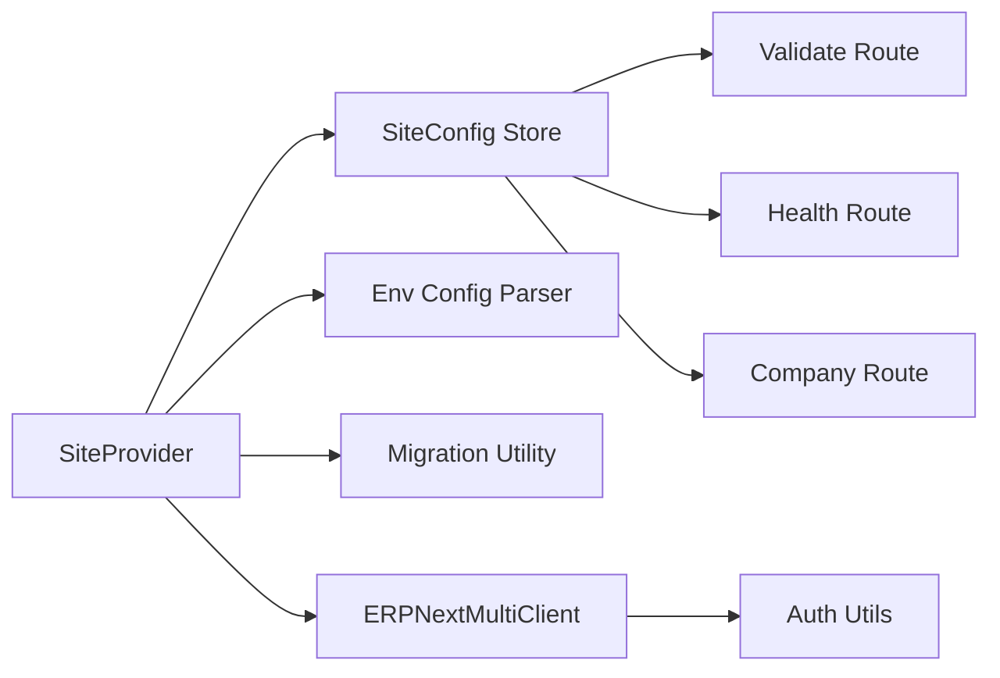

# Multi-Site Management System

<cite>
**Referenced Files in This Document**
- [site-context.tsx](file://lib/site-context.tsx)
- [site-config.ts](file://lib/site-config.ts)
- [site-credentials.ts](file://lib/site-credentials.ts)
- [site-health.ts](file://lib/site-health.ts)
- [erpnext-multi.ts](file://lib/erpnext-multi.ts)
- [erpnext-auth-multi.ts](file://utils/erpnext-auth-multi.ts)
- [env-config.ts](file://lib/env-config.ts)
- [site-migration.ts](file://lib/site-migration.ts)
- [route.ts](file://app/api/sites/validate/route.ts)
- [route.ts](file://app/api/sites/health/route.ts)
- [route.ts](file://app/api/sites/company/route.ts)
- [page.tsx](file://app/select-site/page.tsx)
- [page.tsx](file://app/settings/sites/page.tsx)
- [site-selector.tsx](file://components/site-selector.tsx)
- [SiteGuard.tsx](file://components/SiteGuard.tsx)
</cite>

## Table of Contents
1. [Introduction](#introduction)
2. [Project Structure](#project-structure)
3. [Core Components](#core-components)
4. [Architecture Overview](#architecture-overview)
5. [Detailed Component Analysis](#detailed-component-analysis)
6. [Dependency Analysis](#dependency-analysis)
7. [Performance Considerations](#performance-considerations)
8. [Troubleshooting Guide](#troubleshooting-guide)
9. [Security Considerations](#security-considerations)
10. [Conclusion](#conclusion)

## Introduction
This document explains the Multi-Site Management System that enables seamless navigation across multiple ERPNext instances from a single Next.js application. It covers the SiteProvider pattern for state management, site configuration persistence, authentication and session isolation across sites, health monitoring, and practical workflows for site switching, configuration validation, and error handling.

## Project Structure
The multi-site system spans several layers:
- Frontend state and UI: SiteProvider, site selector UI, guards
- Backend API routes: Site validation, health checks, company resolution
- Configuration and credentials: Environment parsing, migration, and secure credential loading
- Authentication: Site-specific headers and session cookie strategy
- Monitoring: Background health checks with persistence

**Diagram sources**
- [site-context.tsx](file://lib/site-context.tsx#L59-L336)
- [site-config.ts](file://lib/site-config.ts#L1-L322)
- [env-config.ts](file://lib/env-config.ts#L1-L342)
- [site-migration.ts](file://lib/site-migration.ts#L80-L157)
- [site-credentials.ts](file://lib/site-credentials.ts#L1-L97)
- [erpnext-multi.ts](file://lib/erpnext-multi.ts#L24-L92)
- [erpnext-auth-multi.ts](file://utils/erpnext-auth-multi.ts#L34-L98)
- [route.ts](file://app/api/sites/validate/route.ts)
- [route.ts](file://app/api/sites/health/route.ts)
- [route.ts](file://app/api/sites/company/route.ts)

**Section sources**
- [site-context.tsx](file://lib/site-context.tsx#L1-L353)
- [site-config.ts](file://lib/site-config.ts#L1-L322)
- [env-config.ts](file://lib/env-config.ts#L1-L342)
- [site-migration.ts](file://lib/site-migration.ts#L1-L195)
- [site-credentials.ts](file://lib/site-credentials.ts#L1-L97)
- [erpnext-multi.ts](file://lib/erpnext-multi.ts#L1-L93)
- [erpnext-auth-multi.ts](file://utils/erpnext-auth-multi.ts#L1-L279)

## Core Components
- SiteProvider: React Context provider that initializes, persists, and switches active sites; sets cookies and clears caches on site change.
- SiteConfig Store: CRUD operations for sites with localStorage persistence, validation, and connection checks.
- Environment Config: Parses ERPNEXT_SITES or legacy variables, validates, and migrates legacy setups.
- SiteHealthMonitor: Background health checks, failure tracking, and subscription notifications.
- ERPNextMultiClient: Extends the base client to route requests to a specific site with site-specific headers.
- Authentication Utilities: Site-specific header generation, session cookie naming, and authentication fallback logic.
- Credentials Loader: Loads API credentials from environment variables for UI-added sites without storing secrets in browser storage.

**Section sources**
- [site-context.tsx](file://lib/site-context.tsx#L59-L336)
- [site-config.ts](file://lib/site-config.ts#L97-L322)
- [env-config.ts](file://lib/env-config.ts#L244-L302)
- [site-health.ts](file://lib/site-health.ts#L35-L409)
- [erpnext-multi.ts](file://lib/erpnext-multi.ts#L24-L92)
- [erpnext-auth-multi.ts](file://utils/erpnext-auth-multi.ts#L34-L98)
- [site-credentials.ts](file://lib/site-credentials.ts#L25-L96)

## Architecture Overview
The system separates concerns across layers:
- Frontend state: SiteProvider manages active site and persistence.
- Configuration: Environment parsing and migration produce SiteConfig entries stored in localStorage.
- Authentication: Two-tier strategy—API key (admin-grade) or site-specific session cookie.
- Backend routes: Provide validation, health checks, and metadata retrieval per site.
- Monitoring: Background health checks with persistence and subscription model.

**Diagram sources**
- [site-context.tsx](file://lib/site-context.tsx#L152-L184)
- [site-config.ts](file://lib/site-config.ts#L253-L281)
- [erpnext-multi.ts](file://lib/erpnext-multi.ts#L32-L68)
- [erpnext-auth-multi.ts](file://utils/erpnext-auth-multi.ts#L34-L72)
- [route.ts](file://app/api/sites/validate/route.ts)
- [route.ts](file://app/api/sites/health/route.ts)

## Detailed Component Analysis

### SiteProvider Pattern (State Management)
- Responsibilities:
  - Initialize sites from migration, environment, and defaults.
  - Persist active site in localStorage and set a cookie for API routes.
  - Clear caches on site switch to prevent data leakage.
  - Expose setActiveSite, refreshSites, isLoading, and error state.
- Key behaviors:
  - On mount, runs migration, loads sites, ensures default/demo site exists, restores last-selected site, and sets active site.
  - On setActiveSite, clears caches, persists selection, sets active_site cookie, and clears errors.

**Diagram sources**
- [site-context.tsx](file://lib/site-context.tsx#L189-L320)
- [env-config.ts](file://lib/env-config.ts#L265-L302)
- [site-migration.ts](file://lib/site-migration.ts#L80-L157)

**Section sources**
- [site-context.tsx](file://lib/site-context.tsx#L59-L336)

### Site Configuration Persistence and Validation
- Storage schema:
  - Versioned object with sites array and lastModified timestamp.
  - In-memory cache for fast reads; explicit reload bypasses cache.
- Operations:
  - addSite: generates ID, validates, timestamps, updates cache and storage.
  - updateSite: merges updates, validates, persists.
  - removeSite: filters and persists.
  - validateSiteConnection: server-side proxy to avoid CORS, returns boolean.
  - fetchCompanyName: resolves company name via backend route.
- Environment integration:
  - loadFromEnvironment: loads from ERPNEXT_SITES or legacy variables and persists.

**Diagram sources**
- [site-config.ts](file://lib/site-config.ts#L97-L322)

**Section sources**
- [site-config.ts](file://lib/site-config.ts#L1-L322)

### Authentication and Session Management
- Header strategy:
  - API key authentication takes priority for admin-grade access.
  - Fallback to site-specific session cookie (sid_{siteId}) for role-based sessions.
- Cookie naming and lifecycle:
  - active_site cookie for frontend routing.
  - sid_{siteId} cookies for per-site session isolation.
  - Client helpers set/clear cookies with SameSite and expiration.
- Authentication utilities:
  - makeErpHeaders: returns Authorization header for API key.
  - getErpAuthHeaders/getErpHeaders: combine API key or session cookie.
  - isAuthenticated/isAuthenticatedForSite: checks presence of site-specific session.

**Diagram sources**
- [site-context.tsx](file://lib/site-context.tsx#L172-L184)
- [erpnext-auth-multi.ts](file://utils/erpnext-auth-multi.ts#L34-L98)
- [erpnext-multi.ts](file://lib/erpnext-multi.ts#L43-L59)

**Section sources**
- [erpnext-auth-multi.ts](file://utils/erpnext-auth-multi.ts#L1-L279)
- [erpnext-multi.ts](file://lib/erpnext-multi.ts#L1-L93)

### Multi-Tenant Architecture Implementation
- Site isolation:
  - Per-site API URL and credentials.
  - Site-specific session cookies prevent cross-site session leakage.
- Client extension:
  - ERPNextMultiClient extends base client with site-specific URL and headers.
- Company selection:
  - Company name resolved via backend route to ensure correct tenant context.

**Diagram sources**
- [erpnext-multi.ts](file://lib/erpnext-multi.ts#L24-L92)

**Section sources**
- [erpnext-multi.ts](file://lib/erpnext-multi.ts#L1-L93)
- [route.ts](file://app/api/sites/company/route.ts)

### Health Monitoring Capabilities
- Background monitoring:
  - Periodic checks against /api/method/ping endpoint.
  - Failure tracking with consecutive failure threshold.
- Subscription model:
  - Subscribe to health updates; receives batch results.
- Persistence:
  - Stores status and history in localStorage for resilience across sessions.

**Diagram sources**
- [site-health.ts](file://lib/site-health.ts#L202-L213)
- [site-health.ts](file://lib/site-health.ts#L109-L164)
- [site-health.ts](file://lib/site-health.ts#L331-L375)

**Section sources**
- [site-health.ts](file://lib/site-health.ts#L1-L409)
- [route.ts](file://app/api/sites/health/route.ts)

### Site Switching Workflow
- Practical steps:
  - Use SiteProvider’s setActiveSite to switch.
  - UI components react to activeSite changes.
  - Backend routes validate connectivity and resolve company names.
- Example paths:
  - Site switching triggers setActiveSite and cookie updates.
  - Validation uses /api/sites/validate with site credentials.
  - Company name resolution uses /api/sites/company.

**Diagram sources**
- [site-context.tsx](file://lib/site-context.tsx#L152-L184)
- [site-config.ts](file://lib/site-config.ts#L253-L281)
- [route.ts](file://app/api/sites/validate/route.ts)
- [route.ts](file://app/api/sites/company/route.ts)

**Section sources**
- [site-context.tsx](file://lib/site-context.tsx#L152-L184)
- [site-config.ts](file://lib/site-config.ts#L224-L248)

### Configuration Validation and Error Handling
- Validation pipeline:
  - Environment validation detects ERPNEXT_SITES or legacy variables and validates.
  - SiteConfig validation ensures required fields and URL format.
  - Migration handles legacy-to-multi conversion and persistence.
- Error handling:
  - SiteProvider surfaces initialization and switching errors.
  - Health monitor logs failures and notifies subscribers.
  - Validation routes return structured responses for connectivity checks.

**Section sources**
- [env-config.ts](file://lib/env-config.ts#L307-L341)
- [site-config.ts](file://lib/site-config.ts#L142-L147)
- [site-migration.ts](file://lib/site-migration.ts#L122-L156)
- [site-health.ts](file://lib/site-health.ts#L144-L146)

## Dependency Analysis
- Cohesion:
  - SiteProvider orchestrates initialization, persistence, and switching.
  - SiteConfig Store encapsulates persistence and validation.
  - Auth Utils centralizes header and cookie logic.
- Coupling:
  - Frontend depends on backend routes for validation and health.
  - Clients depend on SiteConfig and Auth Utils.
- External dependencies:
  - Next.js request/response model for server routes.
  - Browser APIs for localStorage and cookies.

**Diagram sources**
- [site-context.tsx](file://lib/site-context.tsx#L59-L336)
- [site-config.ts](file://lib/site-config.ts#L253-L281)
- [erpnext-multi.ts](file://lib/erpnext-multi.ts#L24-L92)
- [erpnext-auth-multi.ts](file://utils/erpnext-auth-multi.ts#L34-L98)
- [route.ts](file://app/api/sites/validate/route.ts)
- [route.ts](file://app/api/sites/health/route.ts)
- [route.ts](file://app/api/sites/company/route.ts)

**Section sources**
- [site-context.tsx](file://lib/site-context.tsx#L1-L353)
- [site-config.ts](file://lib/site-config.ts#L1-L322)
- [erpnext-multi.ts](file://lib/erpnext-multi.ts#L1-L93)
- [erpnext-auth-multi.ts](file://utils/erpnext-auth-multi.ts#L1-L279)

## Performance Considerations
- Caching:
  - In-memory cache in SiteConfig Store reduces repeated localStorage reads.
  - Use reloadSites to bypass cache when external changes occur.
- Network:
  - Health checks use short timeouts and controlled intervals to minimize overhead.
  - Backend routes avoid CORS issues by proxying requests.
- Rendering:
  - SiteProvider defers heavy work to initialization and uses minimal state updates.

## Troubleshooting Guide
- Site switching does not persist:
  - Verify localStorage key usage and cookie setting for active_site.
  - Confirm setActiveSite is invoked and no errors are thrown.
- Connection validation fails:
  - Check /api/sites/validate route response and network connectivity.
  - Ensure API URL is reachable and credentials are correct.
- Health status not updating:
  - Confirm monitor.startMonitoring is called and interval is appropriate.
  - Check localStorage persistence and subscriber callbacks.
- Session leakage or wrong tenant:
  - Ensure sid_{siteId} cookies are set and cleared appropriately.
  - Use isAuthenticatedForSite to verify session presence per site.

**Section sources**
- [site-context.tsx](file://lib/site-context.tsx#L172-L184)
- [site-health.ts](file://lib/site-health.ts#L202-L213)
- [erpnext-auth-multi.ts](file://utils/erpnext-auth-multi.ts#L109-L134)

## Security Considerations
- Credential handling:
  - API secrets are never stored in localStorage or browser storage.
  - Credentials are loaded from environment variables at runtime.
- Session isolation:
  - Site-specific cookies (sid_{siteId}) prevent cross-site session hijacking.
  - active_site cookie is used for frontend routing only.
- Access control:
  - API key authentication grants admin-grade access; session fallback preserves role-based access within ERPNext.
- Best practices:
  - Prefer API key authentication for administrative tasks.
  - Clear site-specific cookies on logout or site switch.
  - Validate URLs and enforce HTTPS for production environments.

**Section sources**
- [site-credentials.ts](file://lib/site-credentials.ts#L25-L96)
- [erpnext-auth-multi.ts](file://utils/erpnext-auth-multi.ts#L167-L210)
- [env-config.ts](file://lib/env-config.ts#L116-L120)

## Conclusion
The Multi-Site Management System provides a robust, secure, and maintainable foundation for operating across multiple ERPNext instances. Through the SiteProvider pattern, environment-driven configuration, strict session isolation, and background health monitoring, it ensures reliable site switching, validated connections, and resilient tenant operations.