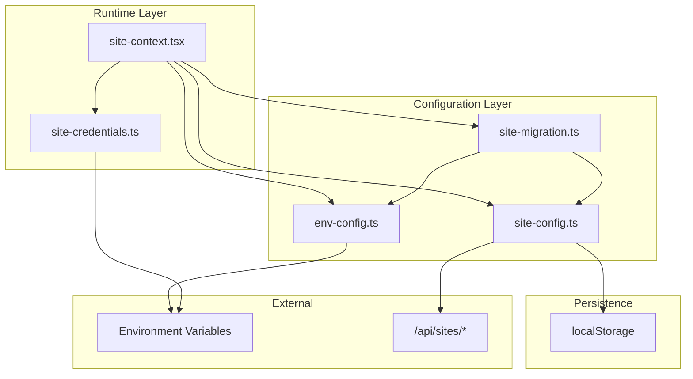
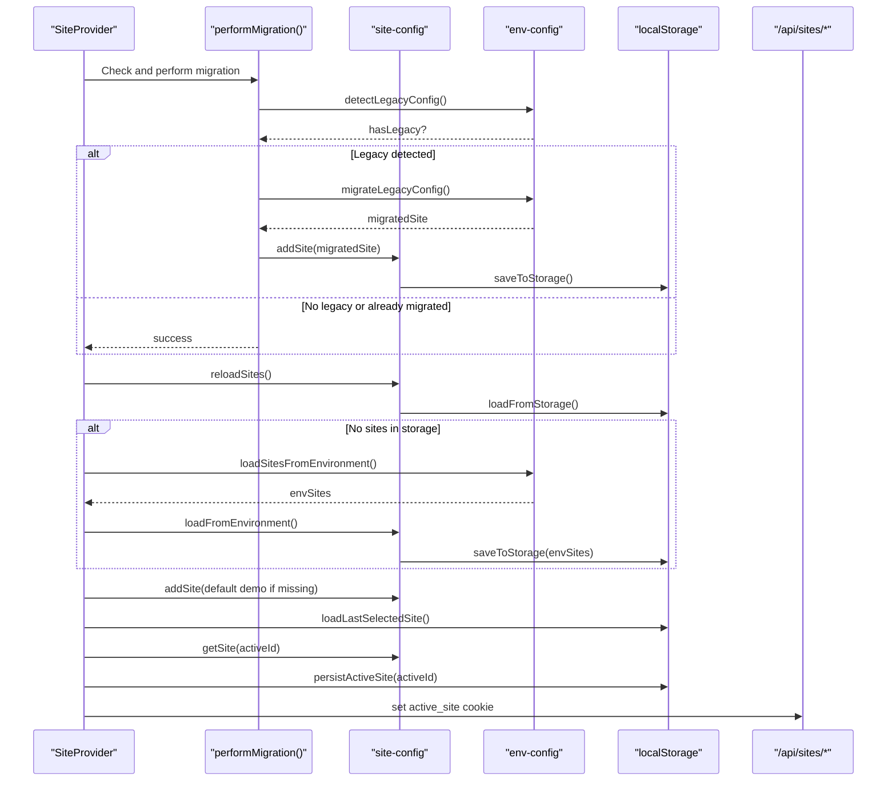
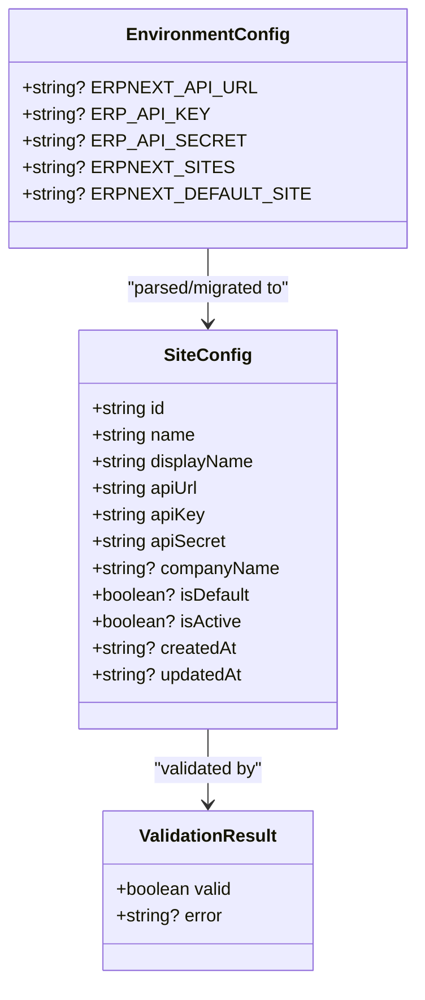
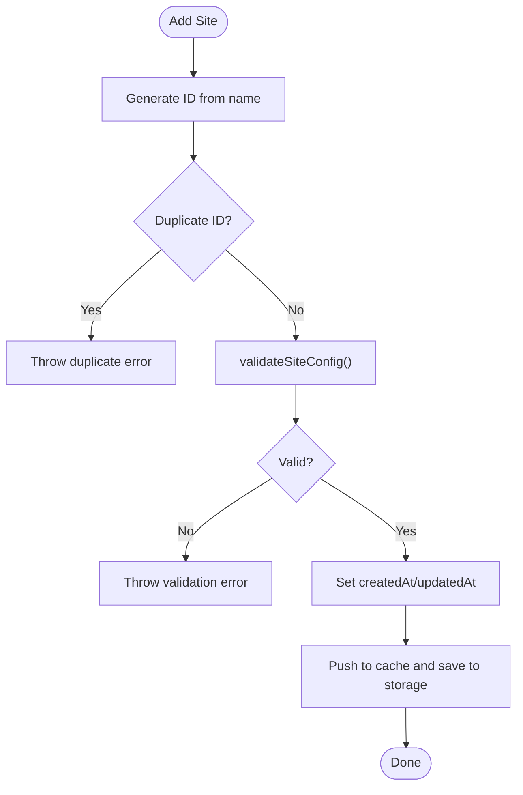
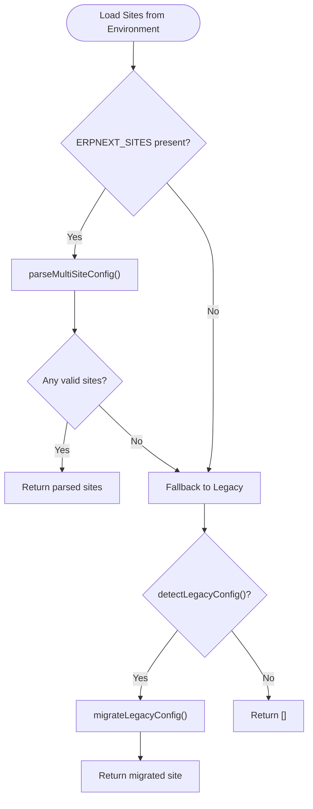
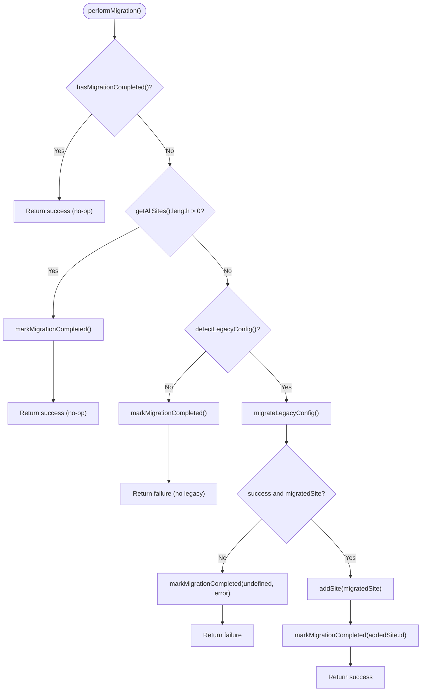
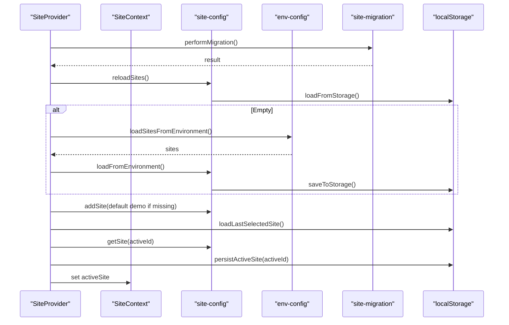
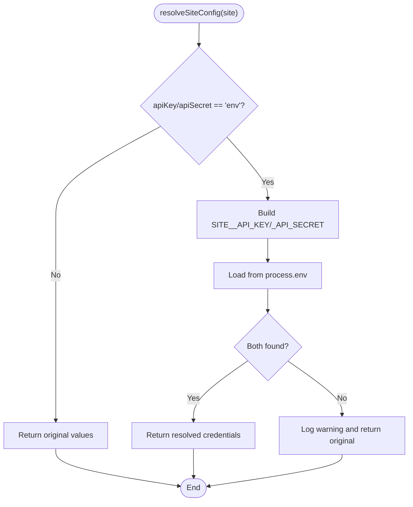
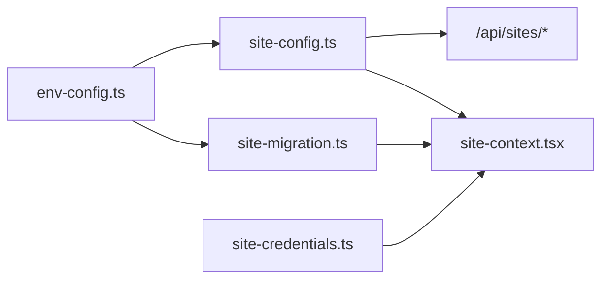

# Site Configuration Management

<cite>
**Referenced Files in This Document**
- [site-config.ts](file://lib/site-config.ts)
- [site-migration.ts](file://lib/site-migration.ts)
- [env-config.ts](file://lib/env-config.ts)
- [site-context.tsx](file://lib/site-context.tsx)
- [site-credentials.ts](file://lib/site-credentials.ts)
- [site-config.test.ts](file://tests/unit/site-config.test.ts)
- [site-migration.test.ts](file://tests/unit/site-migration.test.ts)
- [env-config.test.ts](file://tests/unit/env-config.test.ts)
</cite>

## Table of Contents
1. [Introduction](#introduction)
2. [Project Structure](#project-structure)
3. [Core Components](#core-components)
4. [Architecture Overview](#architecture-overview)
5. [Detailed Component Analysis](#detailed-component-analysis)
6. [Dependency Analysis](#dependency-analysis)
7. [Performance Considerations](#performance-considerations)
8. [Troubleshooting Guide](#troubleshooting-guide)
9. [Conclusion](#conclusion)
10. [Appendices](#appendices)

## Introduction
This document explains the Site Configuration Management system that powers multi-site support in the application. It covers the site configuration data model, storage mechanisms, validation processes, and runtime loading from multiple sources (localStorage, environment variables, and defaults). It also documents the migration system for upgrading legacy configurations, environment variable processing, and default site creation. Practical examples show how to add new sites programmatically, update existing configurations, and implement custom validation logic. Finally, it provides guidance on persistence patterns, backup and restore procedures, troubleshooting, and extending the configuration system with custom properties and validation rules.

## Project Structure
The Site Configuration Management system is implemented across several modules:
- Configuration store and persistence: lib/site-config.ts
- Migration utilities: lib/site-migration.ts
- Environment configuration parser and validators: lib/env-config.ts
- Runtime context provider and site selection: lib/site-context.tsx
- Credential loader for secure runtime resolution: lib/site-credentials.ts
- Unit tests validating behavior and edge cases: tests/unit/*.test.ts

**Diagram sources**
- [site-config.ts](file://lib/site-config.ts#L1-L322)
- [site-migration.ts](file://lib/site-migration.ts#L1-L195)
- [env-config.ts](file://lib/env-config.ts#L1-L342)
- [site-context.tsx](file://lib/site-context.tsx#L1-L353)
- [site-credentials.ts](file://lib/site-credentials.ts#L1-L97)

**Section sources**
- [site-config.ts](file://lib/site-config.ts#L1-L322)
- [site-migration.ts](file://lib/site-migration.ts#L1-L195)
- [env-config.ts](file://lib/env-config.ts#L1-L342)
- [site-context.tsx](file://lib/site-context.tsx#L1-L353)
- [site-credentials.ts](file://lib/site-credentials.ts#L1-L97)

## Core Components
- SiteConfig data model: Defines the shape of a site configuration with identifiers, display metadata, API credentials, and timestamps.
- Site store: Provides CRUD operations, validation, connection checks, and persistence to localStorage.
- Environment configuration parser: Detects and parses legacy and multi-site environment variables, validates them, and generates default site behavior.
- Migration utility: Automatically detects legacy configurations and migrates them to the new multi-site format.
- Site context provider: Initializes the system, loads from storage/environment, persists active site selection, and sets cookies for API routes.
- Credential loader: Securely resolves API credentials from environment variables at runtime without storing secrets in browser storage.

**Section sources**
- [site-config.ts](file://lib/site-config.ts#L11-L23)
- [site-config.ts](file://lib/site-config.ts#L127-L172)
- [site-config.ts](file://lib/site-config.ts#L177-L203)
- [env-config.ts](file://lib/env-config.ts#L11-L23)
- [env-config.ts](file://lib/env-config.ts#L89-L120)
- [env-config.ts](file://lib/env-config.ts#L244-L259)
- [site-migration.ts](file://lib/site-migration.ts#L80-L157)
- [site-context.tsx](file://lib/site-context.tsx#L59-L320)
- [site-credentials.ts](file://lib/site-credentials.ts#L25-L73)

## Architecture Overview
The system initializes on the client, performs migration checks, loads configurations from storage or environment, ensures a default demo site exists, restores the last selected site, and finally activates the default or restored site. API calls for connection validation and company name retrieval are proxied through server endpoints to avoid CORS issues.

**Diagram sources**
- [site-context.tsx](file://lib/site-context.tsx#L190-L320)
- [site-migration.ts](file://lib/site-migration.ts#L80-L157)
- [site-config.ts](file://lib/site-config.ts#L294-L311)
- [env-config.ts](file://lib/env-config.ts#L244-L259)

## Detailed Component Analysis

### Site Configuration Data Model
The SiteConfig interface defines the canonical structure for a site:
- Identifiers: id, name
- Display: displayName
- API connectivity: apiUrl, apiKey, apiSecret
- Optional metadata: companyName, isDefault, isActive
- Timestamps: createdAt, updatedAt

Validation rules enforce:
- Non-empty name and displayName
- Non-empty, valid URL for apiUrl
- Non-empty apiKey and apiSecret
- Optional placeholders for environment-based credentials

**Diagram sources**
- [env-config.ts](file://lib/env-config.ts#L11-L23)
- [env-config.ts](file://lib/env-config.ts#L38-L41)
- [env-config.ts](file://lib/env-config.ts#L25-L36)

**Section sources**
- [env-config.ts](file://lib/env-config.ts#L11-L23)
- [env-config.ts](file://lib/env-config.ts#L89-L120)
- [env-config.ts](file://lib/env-config.ts#L25-L36)

### Site Store: CRUD, Validation, and Persistence
The site store manages:
- getAllSites(), getSite(id), reloadSites()
- addSite(config): generates id, enforces uniqueness, validates, timestamps, caches, persists
- updateSite(id, updates): merges updates, preserves id, validates, persists
- removeSite(id): filters out site, persists
- validateSiteConnection(config): validates URL format, proxies to /api/sites/validate
- fetchCompanyName(config): proxies to /api/sites/company
- persist(): forces save to localStorage
- loadFromEnvironment(): loads from environment if storage empty
- clearSites(): clears cache and localStorage

**Diagram sources**
- [site-config.ts](file://lib/site-config.ts#L127-L172)

**Section sources**
- [site-config.ts](file://lib/site-config.ts#L97-L172)
- [site-config.ts](file://lib/site-config.ts#L177-L203)
- [site-config.ts](file://lib/site-config.ts#L224-L248)
- [site-config.ts](file://lib/site-config.ts#L253-L281)
- [site-config.ts](file://lib/site-config.ts#L286-L311)
- [site-config.ts](file://lib/site-config.ts#L316-L322)

### Environment Variable Processing and Validation
The environment configuration parser supports:
- Legacy single-site: ERPNEXT_API_URL, ERP_API_KEY, ERP_API_SECRET
- Multi-site: ERPNEXT_SITES as JSON array of SiteConfig entries
- Default site selection via ERPNEXT_DEFAULT_SITE or isDefault flag

Processing order:
- parseMultiSiteConfig() attempts to parse ERPNEXT_SITES
- If none, migrateLegacyConfig() converts legacy variables to SiteConfig
- getDefaultSite() selects default based on environment or flags
- validateEnvironmentConfig() ensures at least one valid configuration exists

**Diagram sources**
- [env-config.ts](file://lib/env-config.ts#L244-L259)
- [env-config.ts](file://lib/env-config.ts#L198-L238)
- [env-config.ts](file://lib/env-config.ts#L125-L131)
- [env-config.ts](file://lib/env-config.ts#L136-L193)
- [env-config.ts](file://lib/env-config.ts#L265-L302)
- [env-config.ts](file://lib/env-config.ts#L307-L341)

**Section sources**
- [env-config.ts](file://lib/env-config.ts#L198-L259)
- [env-config.ts](file://lib/env-config.ts#L265-L302)
- [env-config.ts](file://lib/env-config.ts#L307-L341)

### Site Migration System
The migration utility:
- Detects completion via localStorage flag
- Skips if sites already exist or migration already completed
- Detects legacy environment variables and migrates to SiteConfig
- Persists migrated site and marks completion
- Stores migration status with timestamp and migrated site ID

**Diagram sources**
- [site-migration.ts](file://lib/site-migration.ts#L80-L157)

**Section sources**
- [site-migration.ts](file://lib/site-migration.ts#L18-L67)
- [site-migration.ts](file://lib/site-migration.ts#L80-L157)
- [site-migration.ts](file://lib/site-migration.ts#L178-L194)

### Site Context Provider and Runtime Behavior
The SiteProvider:
- Runs migration on mount
- Loads sites from storage or environment
- Ensures a default demo site exists
- Restores last selected site or falls back to default
- Persists active site selection to localStorage and sets active_site cookie
- Clears caches when switching sites

**Diagram sources**
- [site-context.tsx](file://lib/site-context.tsx#L190-L320)

**Section sources**
- [site-context.tsx](file://lib/site-context.tsx#L59-L336)
- [site-context.tsx](file://lib/site-context.tsx#L344-L352)

### Credential Resolution for Secure Runtime Access
The credential loader:
- Resolves apiKey and apiSecret from environment variables for a given site
- Supports placeholders (e.g., 'env') to defer to environment at runtime
- Never stores secrets in browser storage; always loads from process.env

**Diagram sources**
- [site-credentials.ts](file://lib/site-credentials.ts#L25-L73)

**Section sources**
- [site-credentials.ts](file://lib/site-credentials.ts#L17-L96)

## Dependency Analysis
The modules are loosely coupled with clear boundaries:
- site-config.ts depends on env-config.ts for validation helpers and URL checks
- site-context.tsx orchestrates site-config.ts, env-config.ts, and site-migration.ts
- site-credentials.ts depends on env-config.ts types and operates independently of persistence
- site-migration.ts depends on env-config.ts for detection and migration, and on site-config.ts for persistence

**Diagram sources**
- [site-config.ts](file://lib/site-config.ts#L8)
- [site-migration.ts](file://lib/site-migration.ts#L8-L13)
- [site-context.tsx](file://lib/site-context.tsx#L10-L13)
- [site-credentials.ts](file://lib/site-credentials.ts#L11)

**Section sources**
- [site-config.ts](file://lib/site-config.ts#L8)
- [site-migration.ts](file://lib/site-migration.ts#L8-L13)
- [site-context.tsx](file://lib/site-context.tsx#L10-L13)
- [site-credentials.ts](file://lib/site-credentials.ts#L11)

## Performance Considerations
- In-memory cache: site-config.ts maintains an in-memory cache to avoid repeated localStorage reads. Use reloadSites() to force reload when external changes occur.
- Minimal DOM/storage writes: Only write to localStorage on add/update/remove operations and when persisting active site selection.
- Lazy environment loading: Environment variables are parsed only when storage is empty or during migration.
- Connection validation: Uses server-side proxy to avoid CORS overhead and to centralize error handling.

[No sources needed since this section provides general guidance]

## Troubleshooting Guide
Common issues and resolutions:
- Storage corruption or version mismatch: The store clears localStorage and returns empty sites. Clear localStorage and re-add configurations.
- Migration not completing: Check migration status in localStorage and reset if needed. Ensure legacy environment variables are present.
- Active site not restoring: Verify active site cookie and localStorage entry. Clear and retry.
- Connection validation failures: Confirm apiUrl format and server accessibility. Review server-side proxy logs.
- Missing credentials at runtime: Ensure environment variables match expected keys for the site ID.

**Section sources**
- [site-config.ts](file://lib/site-config.ts#L49-L61)
- [site-migration.ts](file://lib/site-migration.ts#L28-L45)
- [site-context.tsx](file://lib/site-context.tsx#L68-L107)
- [site-config.ts](file://lib/site-config.ts#L253-L281)
- [site-credentials.ts](file://lib/site-credentials.ts#L25-L60)

## Conclusion
The Site Configuration Management system provides a robust, extensible foundation for multi-site support. It safely handles configuration from multiple sources, validates inputs rigorously, migrates legacy setups seamlessly, and persists state efficiently. By following the patterns outlined here, teams can confidently add, update, and secure site configurations while maintaining reliability and operability.

[No sources needed since this section summarizes without analyzing specific files]

## Appendices

### Practical Examples

- Add a new site programmatically:
  - Use addSite() with name, displayName, apiUrl, apiKey, apiSecret. The system generates id, validates, timestamps, caches, and persists.
  - Reference: [site-config.ts](file://lib/site-config.ts#L127-L172)

- Update an existing configuration:
  - Use updateSite(id, updates). The system merges updates, preserves id, validates, and persists.
  - Reference: [site-config.ts](file://lib/site-config.ts#L177-L203)

- Implement custom validation logic:
  - Extend validateSiteConfig() with additional checks (e.g., custom URL patterns, required optional fields).
  - Reference: [env-config.ts](file://lib/env-config.ts#L89-L120)

- Load from environment variables:
  - Set ERPNEXT_SITES (JSON array) or legacy variables (ERPNEXT_API_URL, ERP_API_KEY, ERP_API_SECRET). The system auto-detects and parses.
  - Reference: [env-config.ts](file://lib/env-config.ts#L244-L259)

- Default site creation:
  - If no sites exist, a default demo site is added automatically. You can override default selection via ERPNEXT_DEFAULT_SITE.
  - Reference: [env-config.ts](file://lib/env-config.ts#L265-L302), [site-context.tsx](file://lib/site-context.tsx#L224-L274)

- Backup and restore:
  - Backup: Export localStorage key erpnext-sites-config to a safe location.
  - Restore: Replace localStorage key with backed-up JSON and reload the application.
  - Reference: [site-config.ts](file://lib/site-config.ts#L30-L62)

- Extending with custom properties:
  - Add fields to SiteConfig and update validation and parsing logic accordingly. Ensure backward compatibility and default handling.
  - Reference: [env-config.ts](file://lib/env-config.ts#L11-L23), [env-config.ts](file://lib/env-config.ts#L213-L231)

### Validation Rules Summary
- Required fields: name, displayName, apiUrl, apiKey, apiSecret
- URL format: http:// or https://
- ID generation: kebab-case from name
- Default site selection: ERPNEXT_DEFAULT_SITE, isDefault flag, or first site

**Section sources**
- [env-config.ts](file://lib/env-config.ts#L89-L120)
- [env-config.ts](file://lib/env-config.ts#L65-L84)
- [env-config.ts](file://lib/env-config.ts#L265-L302)