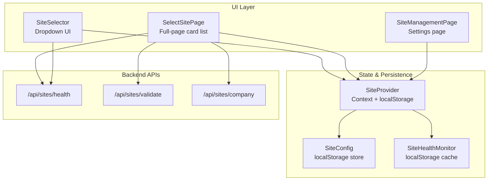
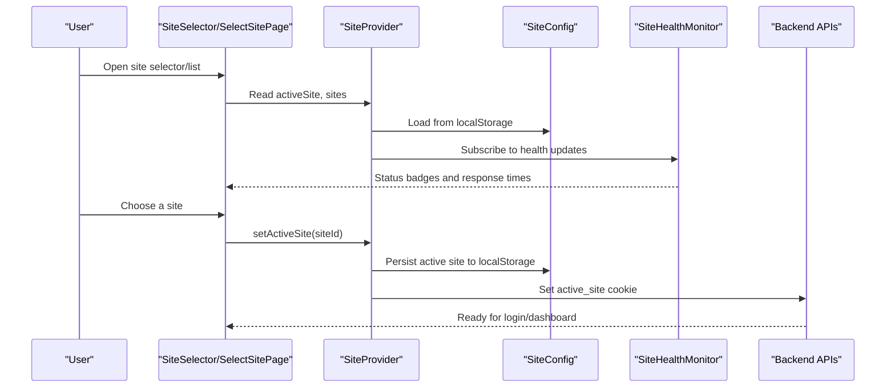
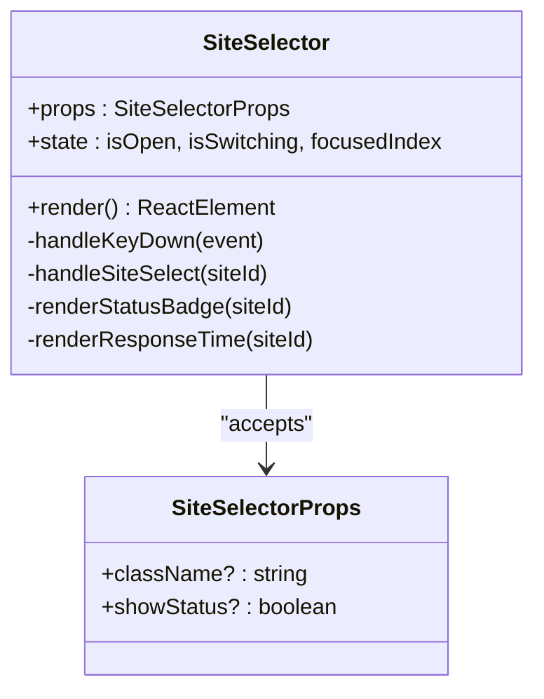
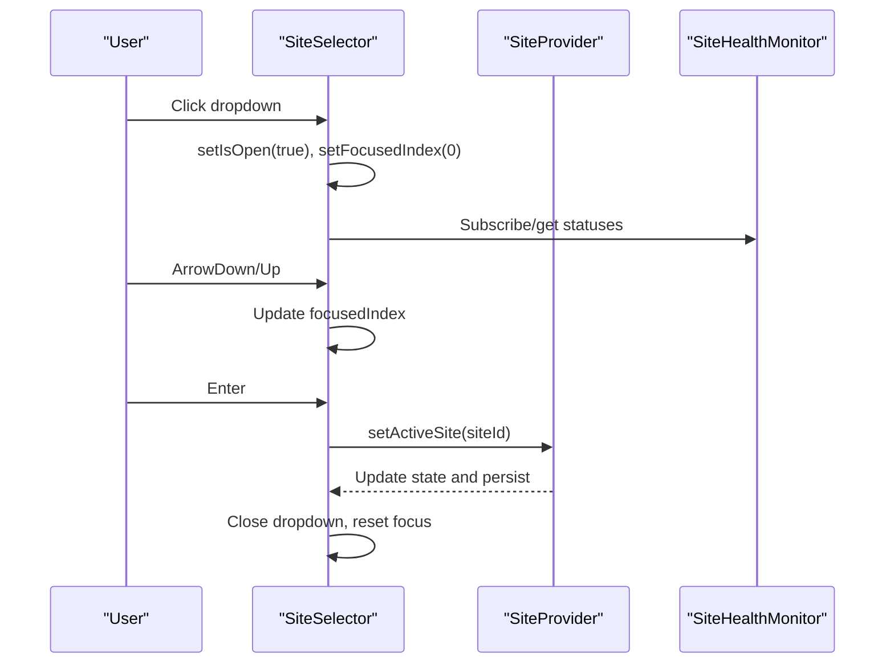
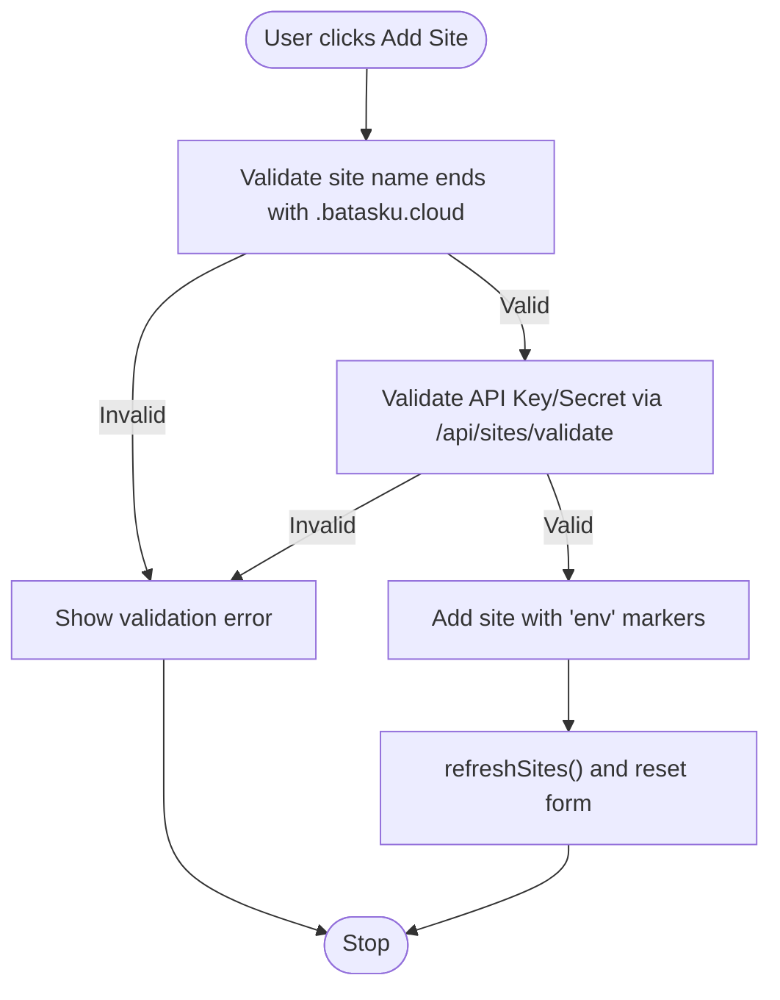
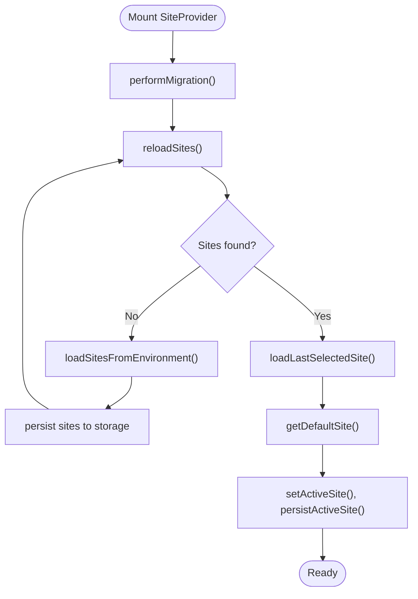
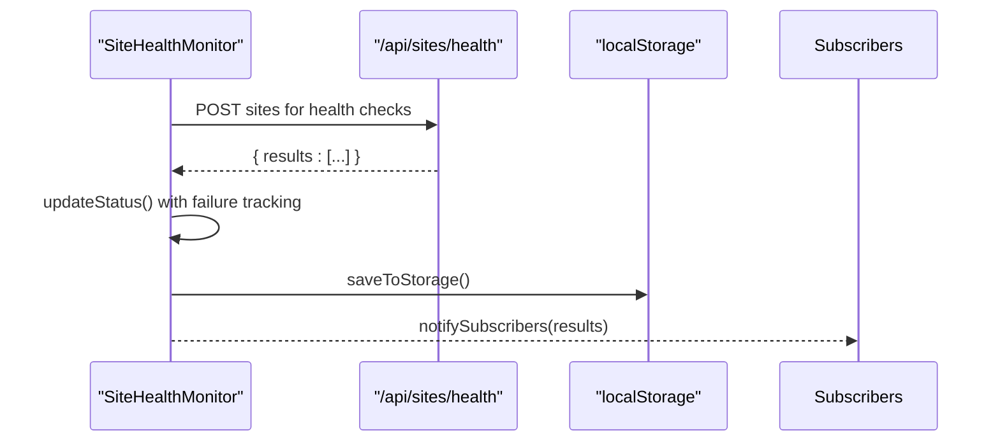
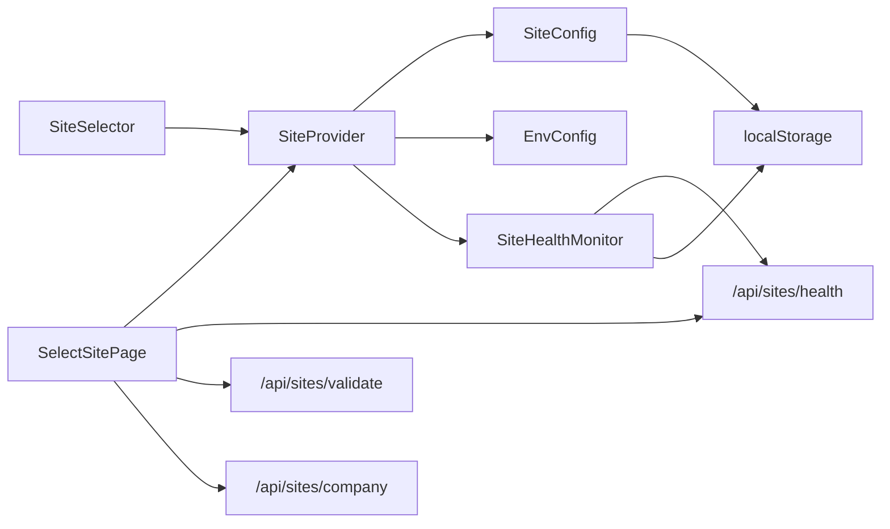

# Site Selection Interface

<cite>
**Referenced Files in This Document**
- [site-selector.tsx](file://components/site-selector.tsx)
- [page.tsx](file://app/select-site/page.tsx)
- [page.tsx](file://app/settings/sites/page.tsx)
- [site-context.tsx](file://lib/site-context.tsx)
- [site-health.ts](file://lib/site-health.ts)
- [site-config.ts](file://lib/site-config.ts)
- [env-config.ts](file://lib/env-config.ts)
- [route.ts](file://app/api/sites/health/route.ts)
- [route.ts](file://app/api/sites/validate/route.ts)
- [route.ts](file://app/api/sites/company/route.ts)
- [site-credentials.ts](file://lib/site-credentials.ts)
- [Navbar.tsx](file://app/components/Navbar.tsx)
</cite>

## Table of Contents
1. [Introduction](#introduction)
2. [Project Structure](#project-structure)
3. [Core Components](#core-components)
4. [Architecture Overview](#architecture-overview)
5. [Detailed Component Analysis](#detailed-component-analysis)
6. [Dependency Analysis](#dependency-analysis)
7. [Performance Considerations](#performance-considerations)
8. [Troubleshooting Guide](#troubleshooting-guide)
9. [Conclusion](#conclusion)

## Introduction
This document explains the Site Selection Interface, focusing on the site picker UI, user interaction patterns, and site listing functionality. It covers the site selection workflow from initial load through user choice, including site cards display, search-like filtering, and selection validation. It documents the integration with SiteProvider for state management and the persistence mechanism using localStorage. Practical examples demonstrate customizing site cards, handling empty states, implementing site filtering, responsive design considerations, accessibility features, error handling for unavailable sites, extending the selector with custom properties, and integrating with authentication flows.

## Project Structure
The Site Selection Interface spans three primary areas:
- UI Components: A compact dropdown selector and a full-page site list with cards
- State Management: SiteProvider manages active site, site lists, and persistence
- Backend Integration: API routes for health checks, validation, and company name resolution

**Diagram sources**
- [site-selector.tsx](file://components/site-selector.tsx#L1-L326)
- [page.tsx](file://app/select-site/page.tsx#L1-L590)
- [page.tsx](file://app/settings/sites/page.tsx#L1-L404)
- [site-context.tsx](file://lib/site-context.tsx#L1-L353)
- [site-health.ts](file://lib/site-health.ts#L1-L409)
- [site-config.ts](file://lib/site-config.ts#L1-L322)
- [route.ts](file://app/api/sites/health/route.ts#L1-L92)
- [route.ts](file://app/api/sites/validate/route.ts#L1-L45)
- [route.ts](file://app/api/sites/company/route.ts#L1-L57)

**Section sources**
- [site-selector.tsx](file://components/site-selector.tsx#L1-L326)
- [page.tsx](file://app/select-site/page.tsx#L1-L590)
- [page.tsx](file://app/settings/sites/page.tsx#L1-L404)
- [site-context.tsx](file://lib/site-context.tsx#L1-L353)
- [site-health.ts](file://lib/site-health.ts#L1-L409)
- [site-config.ts](file://lib/site-config.ts#L1-L322)
- [route.ts](file://app/api/sites/health/route.ts#L1-L92)
- [route.ts](file://app/api/sites/validate/route.ts#L1-L45)
- [route.ts](file://app/api/sites/company/route.ts#L1-L57)

## Core Components
- SiteSelector: A dropdown component that displays configured sites, shows online/offline status, supports keyboard navigation, and triggers site switching.
- SelectSitePage: A full-page card-based list for initial site selection before login, including add/delete site actions and company name resolution.
- SiteManagementPage: An authenticated settings page to manage sites (add/edit/remove) with validation and company name lookup.
- SiteProvider: React Context provider that initializes sites, persists the active site, and coordinates switching.
- SiteHealthMonitor: Background service that periodically checks site health and caches results.
- SiteConfig and EnvConfig: Local storage-backed CRUD for sites and environment-based configuration parsing/migration.
- Backend API routes: Health checks, connection validation, and company name retrieval via server-side requests.

**Section sources**
- [site-selector.tsx](file://components/site-selector.tsx#L1-L326)
- [page.tsx](file://app/select-site/page.tsx#L1-L590)
- [page.tsx](file://app/settings/sites/page.tsx#L1-L404)
- [site-context.tsx](file://lib/site-context.tsx#L1-L353)
- [site-health.ts](file://lib/site-health.ts#L1-L409)
- [site-config.ts](file://lib/site-config.ts#L1-L322)
- [env-config.ts](file://lib/env-config.ts#L1-L342)
- [route.ts](file://app/api/sites/health/route.ts#L1-L92)
- [route.ts](file://app/api/sites/validate/route.ts#L1-L45)
- [route.ts](file://app/api/sites/company/route.ts#L1-L57)

## Architecture Overview
The Site Selection Interface follows a layered architecture:
- UI Layer: SiteSelector and SelectSitePage provide user interactions.
- State Layer: SiteProvider centralizes active site and site list state, with localStorage persistence.
- Health Layer: SiteHealthMonitor performs periodic checks and caches results.
- Backend Layer: API routes handle health checks, validation, and company name resolution server-side to avoid CORS issues.

**Diagram sources**
- [site-selector.tsx](file://components/site-selector.tsx#L32-L142)
- [page.tsx](file://app/select-site/page.tsx#L152-L174)
- [site-context.tsx](file://lib/site-context.tsx#L68-L107)
- [site-health.ts](file://lib/site-health.ts#L109-L164)
- [route.ts](file://app/api/sites/health/route.ts#L26-L91)

## Detailed Component Analysis

### SiteSelector Component
The SiteSelector is a dropdown UI that:
- Displays the active site and a caret icon
- Shows online/offline status badges and response times when enabled
- Supports keyboard navigation (arrow keys, home/end, enter, escape)
- Prevents multiple simultaneous switches
- Renders a loading skeleton when initializing

Key behaviors:
- Health status rendering: Badge color and label reflect online/offline; response time shown when available.
- Keyboard navigation: Arrow keys move focus; Enter selects; Escape closes.
- Click-outside behavior: Closes dropdown and resets focus.
- Loading state: Shows a skeleton while context is loading.

Accessibility:
- Proper ARIA attributes: aria-haspopup, aria-expanded, aria-selected.
- Focus management: Maintains focus on the dropdown button and focused option.

Responsive design:
- Inline block layout adapts to container width.
- Mobile-friendly dropdown menu with scrollable list.

Customization examples:
- To hide status badges, pass showStatus=false.
- To customize styles, pass className with Tailwind utility classes.

Selection workflow:
- handleSiteSelect validates the target site differs from the active one, sets switching state, calls setActiveSite, and cleans up state.

**Section sources**
- [site-selector.tsx](file://components/site-selector.tsx#L1-L326)

#### SiteSelector Class Diagram

**Diagram sources**
- [site-selector.tsx](file://components/site-selector.tsx#L23-L31)

#### SiteSelector Interaction Flow

**Diagram sources**
- [site-selector.tsx](file://components/site-selector.tsx#L78-L142)
- [site-context.tsx](file://lib/site-context.tsx#L152-L184)
- [site-health.ts](file://lib/site-health.ts#L260-L280)

### SelectSitePage (Initial Site Selection)
The SelectSitePage provides:
- A full-page card list of available sites
- Company name resolution via server-side API
- Add/Delete site actions
- Health monitoring with periodic checks
- Continue to login flow after selection

Key behaviors:
- Company name fetching: Uses /api/sites/company with server-side proxy to avoid CORS.
- Health monitoring: Initializes SiteHealthMonitor, starts periodic checks, subscribes to updates.
- Site selection: Stores selection in local state and calls setActiveSite.
- Cookie setting: Sets active_site cookie for API routes.
- Add site: Validates format and credentials via /api/sites/validate, then adds site with 'env' markers.

Filtering and search:
- The page renders a flat list of sites; filtering can be implemented by pre-processing the sites prop before rendering.

Empty states:
- Loading skeleton while initializing.
- Empty state with informational message when no sites are configured.

**Section sources**
- [page.tsx](file://app/select-site/page.tsx#L1-L590)
- [route.ts](file://app/api/sites/company/route.ts#L1-L57)
- [route.ts](file://app/api/sites/validate/route.ts#L1-L45)
- [site-health.ts](file://lib/site-health.ts#L202-L223)

#### SelectSitePage Site Addition Flow

**Diagram sources**
- [page.tsx](file://app/select-site/page.tsx#L202-L293)
- [route.ts](file://app/api/sites/validate/route.ts#L8-L44)

### SiteManagementPage (Authenticated Settings)
The SiteManagementPage allows:
- Authentication check via /api/setup/auth/me
- Add/Edit/Delete sites with validation and company name lookup
- Toggle default site flag
- Real-time feedback via success/error messages

Key behaviors:
- Authentication guard: Redirects to login if not authenticated.
- Validation: Calls validateSiteConnection and fetchCompanyName before saving.
- Editing: Populates form with existing site data.
- Deleting: Confirms action and removes from storage.

**Section sources**
- [page.tsx](file://app/settings/sites/page.tsx#L1-L404)
- [site-config.ts](file://lib/site-config.ts#L253-L281)
- [route.ts](file://app/api/sites/company/route.ts#L1-L57)

### SiteProvider (State Management and Persistence)
SiteProvider manages:
- Active site state and site list state
- Loading and error states
- Persistence to localStorage for active site and health status
- Cache clearing on site switch
- Cookie setting for API routes
- Environment-based site loading and default site selection

Persistence mechanism:
- Active site: Stored under erpnext-active-site with timestamp.
- Health status: Stored under erpnext-site-health with history and failure tracking.

Initialization steps:
- Run migration checks
- Load sites from storage or environment
- Ensure default demo site exists
- Restore last selected site or choose default
- Set active site and persist

**Section sources**
- [site-context.tsx](file://lib/site-context.tsx#L1-L353)

#### SiteProvider Initialization Flow

**Diagram sources**
- [site-context.tsx](file://lib/site-context.tsx#L189-L320)

### SiteHealthMonitor (Health Checks and Caching)
SiteHealthMonitor:
- Periodically checks all configured sites via /api/sites/health
- Tracks consecutive failures and maintains history
- Persists status to localStorage
- Subscribes components to updates

Failure handling:
- Treats a site as online if it has fewer than 3 consecutive failures, even if individual checks fail.

**Section sources**
- [site-health.ts](file://lib/site-health.ts#L1-L409)
- [route.ts](file://app/api/sites/health/route.ts#L1-L92)

#### Health Monitoring Loop

**Diagram sources**
- [site-health.ts](file://lib/site-health.ts#L109-L164)
- [route.ts](file://app/api/sites/health/route.ts#L26-L91)

### Backend API Routes
- /api/sites/health: Server-side health checks for all sites; returns online status and response times.
- /api/sites/validate: Validates site connection using provided credentials.
- /api/sites/company: Fetches company name for a site using server-side credentials resolution.

Security and CORS:
- All three routes are server-side to avoid CORS issues when accessing ERPNext endpoints.

**Section sources**
- [route.ts](file://app/api/sites/health/route.ts#L1-L92)
- [route.ts](file://app/api/sites/validate/route.ts#L1-L45)
- [route.ts](file://app/api/sites/company/route.ts#L1-L57)

### Site Credentials Resolution
Site credentials are resolved from environment variables for sites added via UI:
- Environment variable naming convention derived from site ID
- loadSiteCredentials loads apiKey and apiSecret if 'env' markers are used
- resolveSiteConfig merges resolved credentials into the site config

**Section sources**
- [site-credentials.ts](file://lib/site-credentials.ts#L1-L97)

### Integration with Authentication Flows
- SelectSitePage sets active_site cookie upon selection, enabling API routes to use the chosen site context.
- SiteManagementPage requires authentication via /api/setup/auth/me before allowing site management.

**Section sources**
- [page.tsx](file://app/select-site/page.tsx#L156-L174)
- [page.tsx](file://app/settings/sites/page.tsx#L36-L55)

## Dependency Analysis
The Site Selection Interface has the following dependencies:
- UI components depend on SiteProvider for state and SiteHealthMonitor for status.
- SelectSitePage depends on backend APIs for health checks, validation, and company name resolution.
- SiteProvider depends on SiteConfig for storage and EnvConfig for environment-based loading.
- SiteHealthMonitor depends on backend API for health checks and localStorage for caching.

**Diagram sources**
- [site-selector.tsx](file://components/site-selector.tsx#L18-L21)
- [page.tsx](file://app/select-site/page.tsx#L10-L14)
- [site-context.tsx](file://lib/site-context.tsx#L10-L13)
- [site-health.ts](file://lib/site-health.ts#L109-L164)
- [site-config.ts](file://lib/site-config.ts#L30-L92)
- [env-config.ts](file://lib/env-config.ts#L244-L259)
- [route.ts](file://app/api/sites/health/route.ts#L26-L91)

**Section sources**
- [site-selector.tsx](file://components/site-selector.tsx#L18-L21)
- [page.tsx](file://app/select-site/page.tsx#L10-L14)
- [site-context.tsx](file://lib/site-context.tsx#L10-L13)
- [site-health.ts](file://lib/site-health.ts#L109-L164)
- [site-config.ts](file://lib/site-config.ts#L30-L92)
- [env-config.ts](file://lib/env-config.ts#L244-L259)
- [route.ts](file://app/api/sites/health/route.ts#L26-L91)

## Performance Considerations
- Health checks are performed server-side to avoid CORS overhead and reduce client-side latency.
- SiteHealthMonitor caches results in localStorage and uses a subscription model to minimize redundant computations.
- SelectSitePage fetches company names asynchronously and avoids blocking the UI with skeletons and loading states.
- SiteProvider clears sessionStorage on site switch to prevent cross-site data leakage and improve isolation.

## Troubleshooting Guide
Common issues and resolutions:
- No sites configured: SiteProvider ensures a default demo site exists; if none is found, verify environment variables or manual configuration.
- Active site not persisting: Check localStorage key erpnext-active-site and ensure SiteProvider persists correctly.
- Health status not updating: Verify SiteHealthMonitor is started and subscribed; confirm /api/sites/health responds correctly.
- Company name missing: Ensure /api/sites/company is reachable and credentials are properly resolved from environment variables.
- CORS errors: Use server-side APIs (/api/sites/*) instead of direct client-side calls.
- Authentication failures: Confirm /api/setup/auth/me returns success before accessing SiteManagementPage.

**Section sources**
- [site-context.tsx](file://lib/site-context.tsx#L68-L107)
- [site-health.ts](file://lib/site-health.ts#L202-L223)
- [route.ts](file://app/api/sites/health/route.ts#L26-L91)
- [route.ts](file://app/api/sites/company/route.ts#L10-L57)
- [page.tsx](file://app/settings/sites/page.tsx#L36-L55)

## Conclusion
The Site Selection Interface provides a robust, accessible, and responsive way to choose and manage ERPNext sites. It integrates tightly with SiteProvider for state management and persistence, leverages SiteHealthMonitor for reliable status reporting, and uses server-side APIs to handle health checks, validation, and company name resolution. The UI supports keyboard navigation, responsive layouts, and clear empty states, while the backend ensures secure credential handling and CORS-free operations.