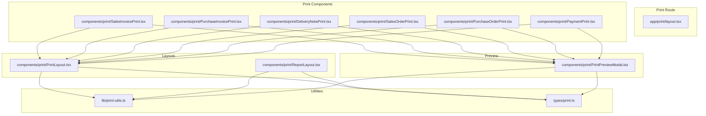
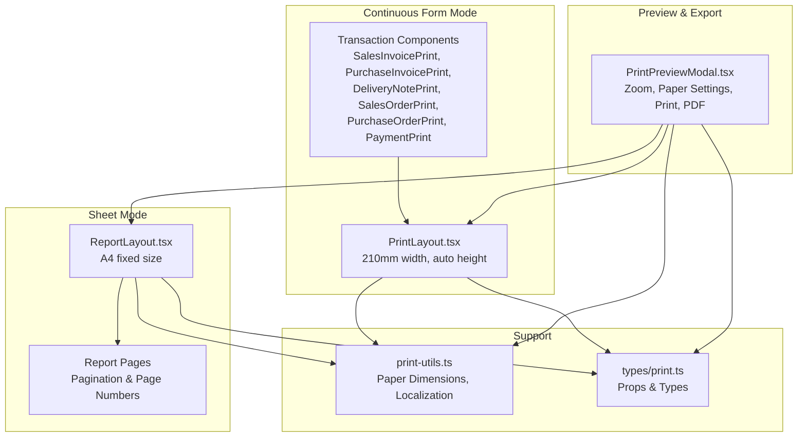
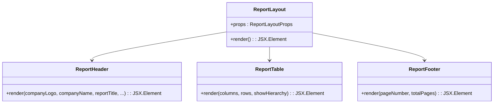
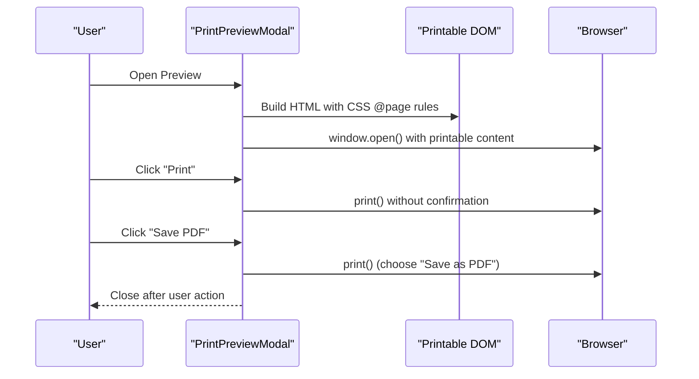
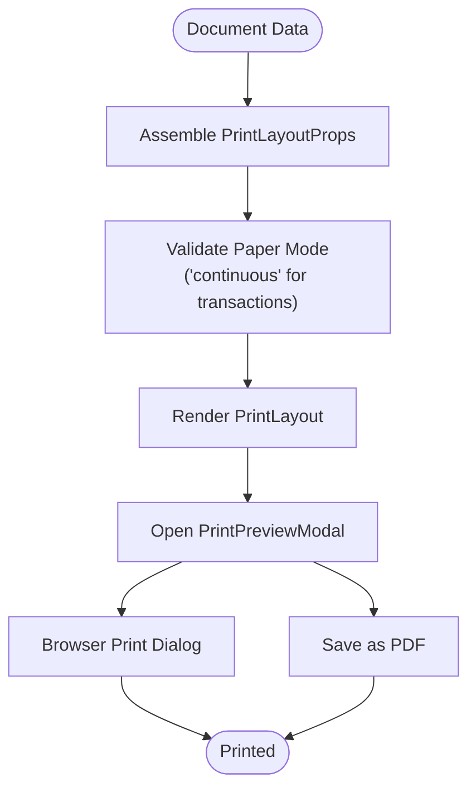
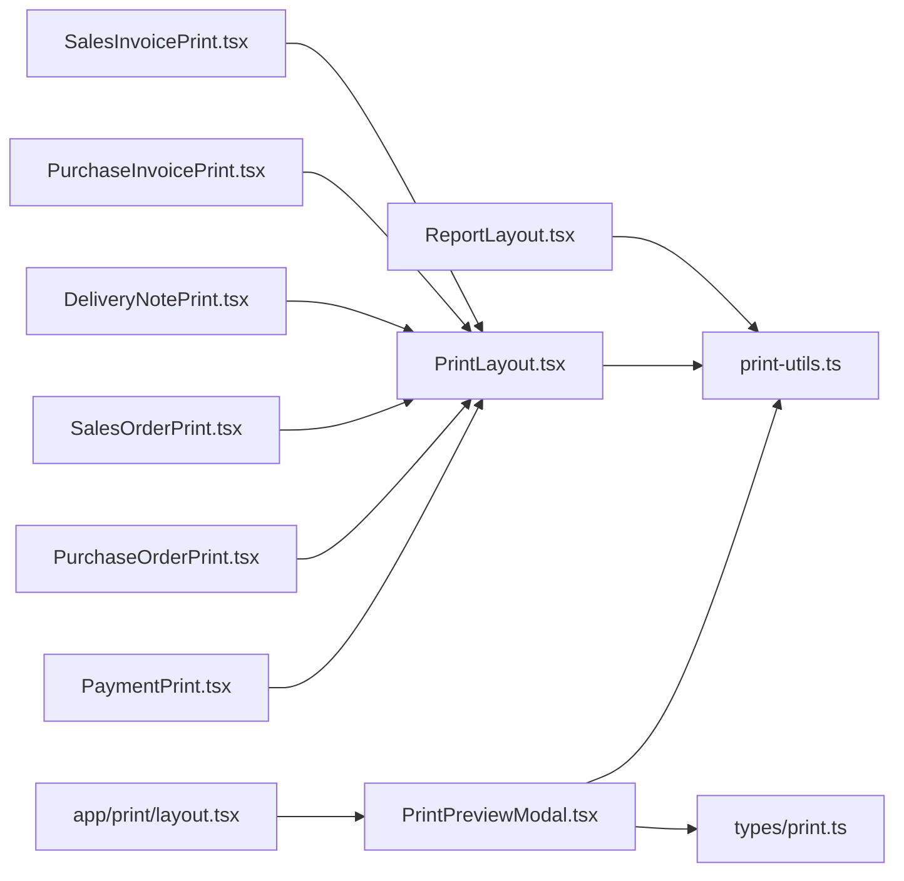

# Print System Architecture

<cite>
**Referenced Files in This Document**
- [PrintLayout.tsx](file://components/print/PrintLayout.tsx)
- [PrintPreviewModal.tsx](file://components/print/PrintPreviewModal.tsx)
- [ReportLayout.tsx](file://components/print/ReportLayout.tsx)
- [SalesInvoicePrint.tsx](file://components/print/SalesInvoicePrint.tsx)
- [PurchaseInvoicePrint.tsx](file://components/print/PurchaseInvoicePrint.tsx)
- [DeliveryNotePrint.tsx](file://components/print/DeliveryNotePrint.tsx)
- [SalesOrderPrint.tsx](file://components/print/SalesOrderPrint.tsx)
- [PurchaseOrderPrint.tsx](file://components/print/PurchaseOrderPrint.tsx)
- [PaymentPrint.tsx](file://components/print/PaymentPrint.tsx)
- [layout.tsx](file://app/print/layout.tsx)
- [print-utils.ts](file://lib/print-utils.ts)
- [print.ts](file://types/print.ts)
</cite>

## Table of Contents
1. [Introduction](#introduction)
2. [Project Structure](#project-structure)
3. [Core Components](#core-components)
4. [Architecture Overview](#architecture-overview)
5. [Detailed Component Analysis](#detailed-component-analysis)
6. [Dependency Analysis](#dependency-analysis)
7. [Performance Considerations](#performance-considerations)
8. [Troubleshooting Guide](#troubleshooting-guide)
9. [Conclusion](#conclusion)
10. [Appendices](#appendices)

## Introduction
This document describes the Print System Architecture used to generate and preview printable documents across the system. It covers:
- Dual-mode printing architecture supporting continuous form (for transaction documents) and A4 sheet (for reports)
- Print layout components, template system, and customization options
- Document generation workflows, PDF export capabilities, and browser print integration
- Print preview functionality, zoom controls, and paper settings management
- Print optimization techniques, performance considerations, and troubleshooting guidance
- Practical examples and extension guidelines for adding new document types and customizing layouts

## Project Structure
The print system is organized around reusable layout components and specialized print components for each document type. A shared utility library provides paper dimension calculations and localization helpers. The Next.js print route layout removes UI chrome during print.

**Diagram sources**
- [layout.tsx](file://app/print/layout.tsx#L1-L17)
- [SalesInvoicePrint.tsx](file://components/print/SalesInvoicePrint.tsx#L1-L135)
- [PurchaseInvoicePrint.tsx](file://components/print/PurchaseInvoicePrint.tsx#L1-L120)
- [DeliveryNotePrint.tsx](file://components/print/DeliveryNotePrint.tsx#L1-L87)
- [SalesOrderPrint.tsx](file://components/print/SalesOrderPrint.tsx#L1-L119)
- [PurchaseOrderPrint.tsx](file://components/print/PurchaseOrderPrint.tsx#L1-L117)
- [PaymentPrint.tsx](file://components/print/PaymentPrint.tsx#L1-L124)
- [PrintLayout.tsx](file://components/print/PrintLayout.tsx#L1-L622)
- [ReportLayout.tsx](file://components/print/ReportLayout.tsx#L1-L381)
- [PrintPreviewModal.tsx](file://components/print/PrintPreviewModal.tsx#L1-L385)
- [print-utils.ts](file://lib/print-utils.ts#L1-L574)
- [print.ts](file://types/print.ts#L1-L327)

**Section sources**
- [layout.tsx](file://app/print/layout.tsx#L1-L17)
- [print.ts](file://types/print.ts#L1-L327)

## Core Components
- PrintLayout: Reusable continuous form layout for transaction documents (orders, invoices, delivery notes, payments). Provides standardized sections for header, metadata, items, totals, notes, signatures, and footer.
- ReportLayout: Reusable A4 sheet layout for financial and system reports with pagination and hierarchy support.
- PrintPreviewModal: Unified preview and print dialog with zoom controls, paper settings (sheet mode), and PDF export via browser print.
- Print components: Specialized wrappers for each document type that assemble data into PrintLayout props.
- Utilities: Paper dimension calculations, localization helpers, and type definitions.

Key responsibilities:
- PrintLayout: Enforces continuous form constraints (210mm width, flexible height), page break rules, and internal sub-components for metadata, items, totals, notes, and signatures.
- ReportLayout: Enforces A4 fixed format, pagination, and styling for hierarchical and summarized reports.
- PrintPreviewModal: Builds printable HTML, applies CSS @page rules, and triggers browser print or PDF save.
- Print components: Transform domain data into standardized props for PrintLayout.

**Section sources**
- [PrintLayout.tsx](file://components/print/PrintLayout.tsx#L1-L622)
- [ReportLayout.tsx](file://components/print/ReportLayout.tsx#L1-L381)
- [PrintPreviewModal.tsx](file://components/print/PrintPreviewModal.tsx#L1-L385)
- [SalesInvoicePrint.tsx](file://components/print/SalesInvoicePrint.tsx#L1-L135)
- [PurchaseInvoicePrint.tsx](file://components/print/PurchaseInvoicePrint.tsx#L1-L120)
- [DeliveryNotePrint.tsx](file://components/print/DeliveryNotePrint.tsx#L1-L87)
- [SalesOrderPrint.tsx](file://components/print/SalesOrderPrint.tsx#L1-L119)
- [PurchaseOrderPrint.tsx](file://components/print/PurchaseOrderPrint.tsx#L1-L117)
- [PaymentPrint.tsx](file://components/print/PaymentPrint.tsx#L1-L124)
- [print-utils.ts](file://lib/print-utils.ts#L1-L574)
- [print.ts](file://types/print.ts#L1-L327)

## Architecture Overview
The print system follows a dual-architecture pattern:
- Continuous form mode for transaction documents: fixed width of 210mm, flexible height, optimized for dot matrix printers and NCR forms.
- Sheet mode for reports: A4 fixed size with pagination and page numbering.

**Diagram sources**
- [PrintLayout.tsx](file://components/print/PrintLayout.tsx#L1-L622)
- [ReportLayout.tsx](file://components/print/ReportLayout.tsx#L1-L381)
- [PrintPreviewModal.tsx](file://components/print/PrintPreviewModal.tsx#L1-L385)
- [print-utils.ts](file://lib/print-utils.ts#L1-L574)
- [print.ts](file://types/print.ts#L1-L327)

## Detailed Component Analysis

### PrintLayout (Continuous Form)
PrintLayout renders transaction documents with a continuous form layout:
- DocumentHeader: Company branding, document title, and status badge
- DocumentMetadata: Document number/date, party info, and optional fields (delivery date, payment terms, due date, driver/vehicle, warehouse, payment method, bank account)
- ItemTable: Dynamic columns with row numbers and formatted values
- TotalStatsBar: Optional total quantity and item count
- TotalsSection: Subtotal, tax, total, and Indonesian amount in words
- NotesSection: Optional notes block
- SignatureSection: Configurable signature boxes
- DocumentFooter: Print timestamp

```mermaid
classDiagram
class PrintLayout {
+props : PrintLayoutProps
+render() : JSX.Element
}
class DocumentHeader {
+render(companyLogo, companyName, documentTitle, status) : JSX.Element
}
class DocumentMetadata {
+render(documentNumber, documentDate, partyLabel, partyName, ...) : JSX.Element
}
class ItemTable {
+render(items, columns) : JSX.Element
}
class TotalStatsBar {
+render(totalQuantity, totalItems) : JSX.Element
}
class TotalsSection {
+render(subtotal, taxAmount, totalAmount, terbilang) : JSX.Element
}
class NotesSection {
+render(notes) : JSX.Element
}
class SignatureSection {
+render(signatures) : JSX.Element
}
class DocumentFooter {
+render() : JSX.Element
}
PrintLayout --> DocumentHeader
PrintLayout --> DocumentMetadata
PrintLayout --> ItemTable
PrintLayout --> TotalStatsBar
PrintLayout --> TotalsSection
PrintLayout --> NotesSection
PrintLayout --> SignatureSection
PrintLayout --> DocumentFooter
```

**Diagram sources**
- [PrintLayout.tsx](file://components/print/PrintLayout.tsx#L1-L622)

**Section sources**
- [PrintLayout.tsx](file://components/print/PrintLayout.tsx#L1-L622)

### ReportLayout (A4 Sheet)
ReportLayout renders reports with A4 fixed format:
- ReportHeader: Company info, report title, date range/as-of date, and generation timestamp
- ReportTable: Dynamic columns, optional hierarchy indentation, and row types (header, data, subtotal, total, grand total)
- ReportFooter: Page numbers and print timestamp

**Diagram sources**
- [ReportLayout.tsx](file://components/print/ReportLayout.tsx#L1-L381)

**Section sources**
- [ReportLayout.tsx](file://components/print/ReportLayout.tsx#L1-L381)

### PrintPreviewModal (Preview, Zoom, Paper Settings, PDF)
PrintPreviewModal provides:
- Zoom controls (min/max configurable)
- Paper settings panel (sheet mode only): paper size selection and orientation
- Print button: opens browser print dialog
- Save PDF button: opens printable HTML and triggers print to save as PDF
- Continuous form indicator and instructions for configuring printer settings

**Diagram sources**
- [PrintPreviewModal.tsx](file://components/print/PrintPreviewModal.tsx#L1-L385)

**Section sources**
- [PrintPreviewModal.tsx](file://components/print/PrintPreviewModal.tsx#L1-L385)

### Document Generation Workflows
Each document type component transforms domain data into PrintLayout props:
- SalesInvoicePrint: Formats invoice data, currency, dates, status, and builds notes with bank account and NPWP
- PurchaseInvoicePrint: Formats supplier invoice data and notes
- DeliveryNotePrint: Omits pricing, includes transport and warehouse info
- SalesOrderPrint: Includes delivery date, payment terms, sales person, and totals
- PurchaseOrderPrint: Includes expected delivery date and warehouse
- PaymentPrint: Builds item references from allocation data and formats payment details

**Diagram sources**
- [SalesInvoicePrint.tsx](file://components/print/SalesInvoicePrint.tsx#L1-L135)
- [PurchaseInvoicePrint.tsx](file://components/print/PurchaseInvoicePrint.tsx#L1-L120)
- [DeliveryNotePrint.tsx](file://components/print/DeliveryNotePrint.tsx#L1-L87)
- [SalesOrderPrint.tsx](file://components/print/SalesOrderPrint.tsx#L1-L119)
- [PurchaseOrderPrint.tsx](file://components/print/PurchaseOrderPrint.tsx#L1-L117)
- [PaymentPrint.tsx](file://components/print/PaymentPrint.tsx#L1-L124)
- [PrintLayout.tsx](file://components/print/PrintLayout.tsx#L1-L622)
- [PrintPreviewModal.tsx](file://components/print/PrintPreviewModal.tsx#L1-L385)

**Section sources**
- [SalesInvoicePrint.tsx](file://components/print/SalesInvoicePrint.tsx#L1-L135)
- [PurchaseInvoicePrint.tsx](file://components/print/PurchaseInvoicePrint.tsx#L1-L120)
- [DeliveryNotePrint.tsx](file://components/print/DeliveryNotePrint.tsx#L1-L87)
- [SalesOrderPrint.tsx](file://components/print/SalesOrderPrint.tsx#L1-L119)
- [PurchaseOrderPrint.tsx](file://components/print/PurchaseOrderPrint.tsx#L1-L117)
- [PaymentPrint.tsx](file://components/print/PaymentPrint.tsx#L1-L124)
- [PrintLayout.tsx](file://components/print/PrintLayout.tsx#L1-L622)
- [PrintPreviewModal.tsx](file://components/print/PrintPreviewModal.tsx#L1-L385)

### Template System and Customization Options
- PrintLayoutProps and ReportLayoutProps define the contract for rendering documents and reports.
- Columns and signatures are configurable arrays enabling customization of item tables and signature blocks.
- Localization helpers provide Indonesian labels, currency formatting, date formatting, and number-to-words conversion.
- Paper mode validation ensures transaction documents use continuous form and reports use sheet mode.

Practical customization examples:
- Add/remove columns in PrintLayoutProps.columns
- Extend PrintLayout with additional sections (e.g., tax breakdown, attachments)
- Configure PrintPreviewModal zoomMin/zoomMax and paper settings visibility
- Use localization helpers for labels and amounts

**Section sources**
- [print.ts](file://types/print.ts#L1-L327)
- [print-utils.ts](file://lib/print-utils.ts#L1-L574)
- [PrintLayout.tsx](file://components/print/PrintLayout.tsx#L1-L622)
- [ReportLayout.tsx](file://components/print/ReportLayout.tsx#L1-L381)
- [PrintPreviewModal.tsx](file://components/print/PrintPreviewModal.tsx#L1-L385)

### Browser Print Integration and PDF Export
- PrintPreviewModal constructs a complete HTML document with CSS @page rules tailored to paper mode.
- For continuous form, the page rule sets width to 210mm and height to auto; for sheet mode, it uses selected paper size and orientation.
- The built HTML is opened in a new window/tab and immediately triggers the browser’s print dialog.
- To save as PDF, users choose “Save as PDF” in the print dialog.

**Section sources**
- [PrintPreviewModal.tsx](file://components/print/PrintPreviewModal.tsx#L92-L172)
- [print-utils.ts](file://lib/print-utils.ts#L262-L276)

### Print Preview Functionality, Zoom Controls, and Paper Settings
- Zoom controls adjust the preview scale within configured bounds.
- Paper settings panel appears only in sheet mode, allowing users to change paper size and orientation.
- Continuous form mode displays an instructional banner guiding users to configure printer settings for 210mm width.

**Section sources**
- [PrintPreviewModal.tsx](file://components/print/PrintPreviewModal.tsx#L58-L90)
- [PrintPreviewModal.tsx](file://components/print/PrintPreviewModal.tsx#L321-L344)

### Paper Settings Management
- Paper dimensions and conversions are centralized in print-utils.ts.
- getPageRule generates CSS @page rules based on paper mode, size, and orientation.
- calculatePageDimensionsMm and calculatePageDimensionsPx compute dimensions in millimeters and pixels respectively.

**Section sources**
- [print-utils.ts](file://lib/print-utils.ts#L153-L192)
- [print-utils.ts](file://lib/print-utils.ts#L262-L276)

## Dependency Analysis
The print system exhibits low coupling and high cohesion:
- Print components depend on PrintLayout and share props contracts defined in types/print.ts
- Report components depend on ReportLayout
- PrintPreviewModal depends on utilities for dimension calculations and types
- The print route layout strips UI elements during print

**Diagram sources**
- [SalesInvoicePrint.tsx](file://components/print/SalesInvoicePrint.tsx#L1-L135)
- [PurchaseInvoicePrint.tsx](file://components/print/PurchaseInvoicePrint.tsx#L1-L120)
- [DeliveryNotePrint.tsx](file://components/print/DeliveryNotePrint.tsx#L1-L87)
- [SalesOrderPrint.tsx](file://components/print/SalesOrderPrint.tsx#L1-L119)
- [PurchaseOrderPrint.tsx](file://components/print/PurchaseOrderPrint.tsx#L1-L117)
- [PaymentPrint.tsx](file://components/print/PaymentPrint.tsx#L1-L124)
- [PrintLayout.tsx](file://components/print/PrintLayout.tsx#L1-L622)
- [ReportLayout.tsx](file://components/print/ReportLayout.tsx#L1-L381)
- [PrintPreviewModal.tsx](file://components/print/PrintPreviewModal.tsx#L1-L385)
- [print-utils.ts](file://lib/print-utils.ts#L1-L574)
- [print.ts](file://types/print.ts#L1-L327)
- [layout.tsx](file://app/print/layout.tsx#L1-L17)

**Section sources**
- [print.ts](file://types/print.ts#L1-L327)
- [print-utils.ts](file://lib/print-utils.ts#L1-L574)

## Performance Considerations
- Minimize DOM size in preview: Keep only essential content in the printable DOM to reduce rendering overhead.
- Prefer lightweight formatting: Use simple CSS and avoid heavy images or external resources in print previews.
- Optimize table rendering: Limit column count and cell content; leverage page-break-inside rules to prevent splits mid-row.
- Use pixel-perfect calculations: Utilize mmToPx and pxToMm helpers to avoid rounding errors that cause overflow.
- Avoid excessive reflows: Compute dimensions once and reuse values across components.
- Pagination for reports: For long reports, consider splitting content into page containers to improve print performance.

[No sources needed since this section provides general guidance]

## Troubleshooting Guide
Common issues and resolutions:
- Continuous form misalignment: Ensure printer settings specify 210mm width and appropriate margins. The preview modal displays instructions for continuous form configuration.
- Headers/footers cut off: Verify page break rules and section styles; use page-break-inside: avoid for critical sections.
- Currency/date formatting inconsistencies: Use localization helpers (formatCurrency, formatDate, numberToWords) consistently across components.
- PDF export produces blank pages: Confirm that the printable DOM is populated and CSS @page rules are applied before triggering print.
- Excessive whitespace: Adjust margins and padding; verify paper mode matches document type (continuous vs sheet).
- Signature boxes missing: Ensure signatures prop is provided and contains at least one entry.

**Section sources**
- [PrintPreviewModal.tsx](file://components/print/PrintPreviewModal.tsx#L321-L344)
- [print-utils.ts](file://lib/print-utils.ts#L397-L441)

## Conclusion
The print system provides a robust, dual-mode architecture supporting continuous form printing for transaction documents and A4 sheet printing for reports. Its modular design, strong typing, and utility functions enable easy customization and reliable browser integration. By following the provided patterns and troubleshooting guidance, teams can extend the system with new document types and tailor layouts to business needs.

[No sources needed since this section summarizes without analyzing specific files]

## Appendices

### Practical Examples
- Print a Sales Invoice: Use SalesInvoicePrint to assemble props and wrap with PrintPreviewModal for preview and print.
- Print a Purchase Invoice: Use PurchaseInvoicePrint with company branding and notes.
- Print a Delivery Note: Use DeliveryNotePrint for non-pricing logistics documents.
- Print a Sales/Purchase Order: Use SalesOrderPrint or PurchaseOrderPrint with pricing and totals.
- Print a Payment: Use PaymentPrint to allocate amounts and print payment details.
- Generate a Report: Use ReportLayout with columns and rows; pagination is handled internally.

**Section sources**
- [SalesInvoicePrint.tsx](file://components/print/SalesInvoicePrint.tsx#L1-L135)
- [PurchaseInvoicePrint.tsx](file://components/print/PurchaseInvoicePrint.tsx#L1-L120)
- [DeliveryNotePrint.tsx](file://components/print/DeliveryNotePrint.tsx#L1-L87)
- [SalesOrderPrint.tsx](file://components/print/SalesOrderPrint.tsx#L1-L119)
- [PurchaseOrderPrint.tsx](file://components/print/PurchaseOrderPrint.tsx#L1-L117)
- [PaymentPrint.tsx](file://components/print/PaymentPrint.tsx#L1-L124)
- [ReportLayout.tsx](file://components/print/ReportLayout.tsx#L1-L381)

### Extending the Print System
Steps to add a new document type:
- Define a new print component under components/print/ (follow existing patterns)
- Create a dedicated props interface and assemble PrintLayoutProps
- Integrate with PrintPreviewModal for preview and print
- Validate paper mode is continuous for transaction-like documents
- Add localization labels if needed using INDONESIAN_LABELS
- Test browser print and PDF export workflows

Integration points:
- PrintLayout for continuous form documents
- ReportLayout for A4 reports
- PrintPreviewModal for unified preview and export
- print-utils for dimensions and localization
- types/print.ts for props contracts

**Section sources**
- [PrintLayout.tsx](file://components/print/PrintLayout.tsx#L1-L622)
- [ReportLayout.tsx](file://components/print/ReportLayout.tsx#L1-L381)
- [PrintPreviewModal.tsx](file://components/print/PrintPreviewModal.tsx#L1-L385)
- [print-utils.ts](file://lib/print-utils.ts#L326-L380)
- [print.ts](file://types/print.ts#L1-L327)